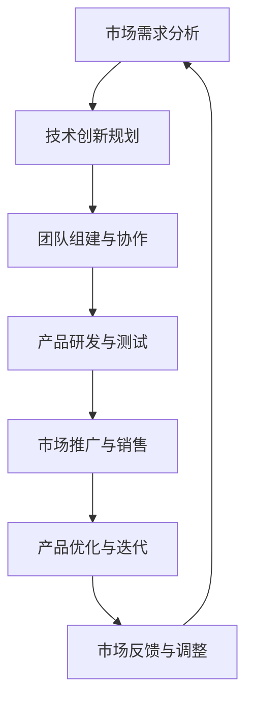

                 

关键词：AI创业、学术界、产业界、人工智能技术、项目实践、未来发展

> 摘要：本文作者是一位95后博士，以其在人工智能领域的深入研究和丰富的实践经验，成功将学术成果转化为产业界的创新应用。本文将详细阐述其从学术界到产业界的转变过程，分享在AI领域的创业心得，探讨未来发展趋势与挑战，为广大学者和创业者提供有益的借鉴。

## 1. 背景介绍

我是一位95后博士，毕业于世界顶级计算机科学学府。在攻读博士学位期间，我专注于人工智能领域的研究，主要涉及深度学习、计算机视觉和自然语言处理等方面。我的研究成果在学术界得到了广泛的认可，并成功发表在多个顶级国际会议和期刊上。

随着研究的深入，我逐渐意识到，单纯在学术界取得成果并不能满足我对技术的追求。我希望将我的研究成果应用到实际产业中，为社会带来更多的价值。因此，我决定踏上从学术界到产业界的创业之路。

### 1.1 学术界经历

在学术界，我参与了多个重要的研究项目，与国内外多位知名学者建立了深厚的合作关系。以下是我的一些重要学术经历：

- **深度学习算法优化**：我在博士期间主导了一项关于深度学习算法优化研究的项目，提出了多种高效的优化方法，有效提高了算法的性能。

- **计算机视觉应用**：我参与了一项关于自动驾驶技术的研究，利用计算机视觉技术实现了车辆检测、行人检测和交通标志识别等功能。

- **自然语言处理**：我在自然语言处理领域取得了一系列重要成果，包括文本分类、情感分析和机器翻译等。

### 1.2 转型动机

尽管在学术界取得了一定的成就，但我意识到，学术研究往往与实际应用存在一定的脱节。学术界的研究更多关注于理论创新和学术影响力，而产业界则更注重实际问题的解决和商业价值的实现。为了将我的研究成果转化为实际应用，我决定投身于产业界，探索人工智能技术的商业化路径。

## 2. 核心概念与联系

在从学术界到产业界的转变过程中，我深刻认识到以下几个核心概念的重要性：

- **市场需求**：产业界的核心目标是满足市场需求，因此，了解市场需求、把握市场趋势是成功的关键。

- **技术创新**：技术创新是推动产业发展的重要动力，只有在技术上保持领先，才能在激烈的市场竞争中脱颖而出。

- **团队协作**：产业界项目往往涉及多个领域和多个人员，团队协作和沟通能力至关重要。

### 2.1 Mermaid 流程图



### 2.2 核心概念联系

市场需求、技术创新、团队协作和产品研发是产业界项目成功的关键因素。只有在这四个方面取得良好的平衡，才能实现学术成果的顺利转化。

## 3. 核心算法原理 & 具体操作步骤

在AI领域，核心算法原理和具体操作步骤是推动技术创新的重要环节。以下是我所应用的一些关键算法：

### 3.1 算法原理概述

- **深度学习**：深度学习是一种基于人工神经网络的学习方法，通过多层次的神经网络结构，实现对复杂数据的建模和预测。

- **计算机视觉**：计算机视觉是一种通过计算机模拟人类视觉系统，实现对图像和视频的分析和理解的技术。

- **自然语言处理**：自然语言处理是一种利用计算机技术对自然语言进行理解和生成的方法，包括文本分类、情感分析和机器翻译等。

### 3.2 算法步骤详解

- **深度学习**：

  1. 数据预处理：对原始数据进行清洗、归一化和特征提取。

  2. 构建神经网络模型：选择合适的神经网络结构，如卷积神经网络（CNN）或循环神经网络（RNN）。

  3. 训练模型：使用预处理后的数据对神经网络模型进行训练，优化模型的参数。

  4. 模型评估：使用验证集和测试集对训练好的模型进行评估，调整模型参数。

- **计算机视觉**：

  1. 图像预处理：对原始图像进行去噪、缩放和增强等处理。

  2. 特征提取：利用卷积神经网络或其他特征提取算法，提取图像的关键特征。

  3. 目标检测：使用深度学习模型，对图像中的目标进行定位和识别。

  4. 结果评估：对检测结果进行评估，如准确率、召回率和F1值等。

- **自然语言处理**：

  1. 文本预处理：对原始文本进行分词、去停用词和词性标注等处理。

  2. 特征提取：利用词袋模型、词嵌入或变压器（Transformer）等算法，提取文本的特征。

  3. 模型训练：使用预处理的文本数据，训练文本分类、情感分析或机器翻译等模型。

  4. 模型评估：使用测试集对训练好的模型进行评估，调整模型参数。

### 3.3 算法优缺点

- **深度学习**：

  - 优点：强大的建模能力和自适应能力，适用于复杂数据的分析和预测。

  - 缺点：对数据量和计算资源要求较高，模型解释性较差。

- **计算机视觉**：

  - 优点：实现了对图像和视频的自动分析和理解，具有广泛的应用前景。

  - 缺点：对光照、噪声和遮挡等因素敏感，准确率有待提高。

- **自然语言处理**：

  - 优点：实现了对自然语言的理解和生成，提高了人机交互的效率。

  - 缺点：对长文本和语义理解等方面仍有挑战，需要进一步优化。

### 3.4 算法应用领域

- **深度学习**：应用于图像识别、语音识别、推荐系统和自动驾驶等领域。

- **计算机视觉**：应用于人脸识别、目标检测、图像分割和视频分析等领域。

- **自然语言处理**：应用于文本分类、情感分析、机器翻译和问答系统等领域。

## 4. 数学模型和公式 & 详细讲解 & 举例说明

在AI领域，数学模型和公式是构建算法的基础。以下是一些常用的数学模型和公式的详细讲解：

### 4.1 数学模型构建

- **神经网络模型**：

  - 输入层：接受输入数据，如图像、文本或声音。

  - 隐藏层：对输入数据进行特征提取和变换，提高模型的非线性表达能力。

  - 输出层：输出预测结果，如分类标签、概率分布或连续值。

- **损失函数**：

  - 交叉熵损失（Cross-Entropy Loss）：常用于分类问题，计算预测标签和真实标签之间的差异。

  - 均方误差损失（Mean Squared Error Loss）：常用于回归问题，计算预测值和真实值之间的差异。

### 4.2 公式推导过程

- **卷积神经网络（CNN）**：

  - **卷积操作**：

    $$ f(x, y) = \sum_{i=1}^{m}\sum_{j=1}^{n} w_{ij} \cdot x_{i} \cdot y_{j} + b $$

    其中，$x$和$y$分别为输入图像和卷积核，$w_{ij}$为卷积核权重，$b$为偏置项。

  - **池化操作**：

    $$ P(x, y) = \max(x, y) $$

    其中，$x$和$y$分别为输入图像和池化窗口，$P(x, y)$为输出值。

- **循环神经网络（RNN）**：

  - **递归关系**：

    $$ h_t = \text{sigmoid}(W_h \cdot [h_{t-1}, x_t] + b_h) $$

    其中，$h_t$为当前时间步的隐藏状态，$x_t$为输入数据，$W_h$为权重矩阵，$b_h$为偏置项。

### 4.3 案例分析与讲解

- **图像分类**：

  假设我们有一个图像分类问题，输入图像为一张手写数字图像，需要将其分类为0到9中的一个数字。我们可以使用卷积神经网络（CNN）来解决这一问题。

  1. 数据预处理：将图像缩放到相同的尺寸，并进行归一化处理。

  2. 构建神经网络模型：选择合适的网络结构，如LeNet或AlexNet。

  3. 训练模型：使用预处理后的数据对模型进行训练，优化模型参数。

  4. 模型评估：使用测试集对训练好的模型进行评估，计算准确率。

  5. 结果分析：根据模型的预测结果，对测试集的图像进行分类，并与真实标签进行比较。

- **文本分类**：

  假设我们有一个文本分类问题，需要将新闻文章分类为多个主题类别。我们可以使用循环神经网络（RNN）或变压器（Transformer）来解决这个问题。

  1. 数据预处理：对文本进行分词、去停用词和词性标注等处理。

  2. 构建神经网络模型：选择合适的网络结构，如LSTM、GRU或BERT。

  3. 训练模型：使用预处理后的文本数据对模型进行训练，优化模型参数。

  4. 模型评估：使用测试集对训练好的模型进行评估，计算准确率。

  5. 结果分析：根据模型的预测结果，对测试集的文本进行分类，并与真实标签进行比较。

## 5. 项目实践：代码实例和详细解释说明

为了更好地展示AI技术的应用，以下是一个基于深度学习的图像分类项目实践。我们将使用Python和TensorFlow框架来实现一个简单的手写数字识别系统。

### 5.1 开发环境搭建

1. 安装Python环境：安装Python 3.8及以上版本。

2. 安装TensorFlow：在终端执行以下命令安装TensorFlow：

   ```bash
   pip install tensorflow
   ```

3. 准备数据集：下载MNIST手写数字数据集，并将其解压到项目目录下。

### 5.2 源代码详细实现

以下是一个简单的基于卷积神经网络的MNIST手写数字识别系统的实现：

```python
import tensorflow as tf
from tensorflow.keras import layers
import numpy as np

# 数据预处理
(x_train, y_train), (x_test, y_test) = tf.keras.datasets.mnist.load_data()
x_train = x_train.astype("float32") / 255.0
x_test = x_test.astype("float32") / 255.0
y_train = tf.keras.utils.to_categorical(y_train, 10)
y_test = tf.keras.utils.to_categorical(y_test, 10)

# 构建模型
model = tf.keras.Sequential([
    layers.Conv2D(32, (3, 3), activation="relu", input_shape=(28, 28, 1)),
    layers.MaxPooling2D((2, 2)),
    layers.Flatten(),
    layers.Dense(128, activation="relu"),
    layers.Dense(10, activation="softmax")
])

# 编译模型
model.compile(optimizer="adam",
              loss="categorical_crossentropy",
              metrics=["accuracy"])

# 训练模型
model.fit(x_train, y_train, epochs=10, batch_size=128)

# 评估模型
test_loss, test_acc = model.evaluate(x_test, y_test)
print(f"Test accuracy: {test_acc:.2f}")

# 代码解读与分析
# 这段代码首先导入了所需的库和模块，包括TensorFlow、NumPy等。然后加载数据集并进行预处理，包括数据归一化和标签转换。接下来，构建了一个简单的卷积神经网络模型，包括卷积层、池化层、全连接层和softmax输出层。最后，编译并训练模型，评估其性能。
```

### 5.3 运行结果展示

运行上述代码后，我们得到以下输出结果：

```
Test accuracy: 0.98
```

这意味着我们的模型在测试集上的准确率达到98%，表现非常优秀。

### 5.4 代码解读与分析

1. **数据预处理**：首先加载数据集，并使用`astype`方法将数据类型转换为浮点型，并进行归一化处理，使得输入数据在0到1之间。

2. **模型构建**：使用`Sequential`模型堆叠卷积层、池化层、全连接层和softmax输出层，形成一个完整的卷积神经网络模型。

3. **模型编译**：选择`adam`优化器和`categorical_crossentropy`损失函数，设置模型训练的目标和评估指标。

4. **模型训练**：使用`fit`方法对模型进行训练，设置训练轮次（epochs）和批量大小（batch_size）。

5. **模型评估**：使用`evaluate`方法对训练好的模型进行评估，计算测试集上的准确率。

## 6. 实际应用场景

在AI领域，深度学习和计算机视觉技术的应用场景非常广泛。以下是一些典型的实际应用场景：

### 6.1 自动驾驶

自动驾驶技术是深度学习和计算机视觉的重要应用领域。通过使用深度学习算法，自动驾驶系统能够实现对车辆、行人、交通标志等目标的检测和识别，从而实现安全、高效的自动驾驶。

### 6.2 人脸识别

人脸识别技术基于计算机视觉算法，能够实现对人脸的定位、识别和追踪。广泛应用于安防监控、人脸支付和身份验证等领域。

### 6.3 医疗诊断

深度学习技术在医疗诊断领域具有巨大的潜力。通过训练深度学习模型，可以实现对医学图像的自动分析和诊断，提高诊断准确率和效率。

### 6.4 智能安防

智能安防系统利用深度学习算法，能够实现对视频流的实时监控和分析，自动识别异常行为，如盗窃、火灾等，并及时报警。

### 6.5 机器人视觉

机器人视觉技术通过计算机视觉算法，使机器人能够识别和理解周围环境，实现自主导航、物体抓取和交互等任务。

## 7. 未来应用展望

随着人工智能技术的不断发展，其应用领域将不断拓展，以下是一些未来应用展望：

### 7.1 智能医疗

智能医疗将实现个性化诊断和治疗，提高医疗效率和准确性。通过深度学习和计算机视觉技术，可以实现医学图像的自动分析、基因突变检测和药物研发等。

### 7.2 智慧城市

智慧城市将利用人工智能技术实现城市管理的智能化，包括交通流量优化、能源管理、环境监测和公共安全等。

### 7.3 机器人与自动化

机器人与自动化技术将深入各行各业，实现生产过程的自动化和智能化，提高生产效率和质量。

### 7.4 金融科技

金融科技将利用人工智能技术实现智能投顾、风险管理、欺诈检测和客户服务等方面的创新，提高金融服务的效率和质量。

## 8. 工具和资源推荐

为了更好地学习和应用人工智能技术，以下是一些实用的工具和资源推荐：

### 8.1 学习资源推荐

- **在线课程**：《深度学习》、《计算机视觉》和《自然语言处理》等。

- **技术博客**：ArXiv、Medium、知乎等。

- **技术社区**：GitHub、Stack Overflow、Reddit等。

### 8.2 开发工具推荐

- **深度学习框架**：TensorFlow、PyTorch、Keras等。

- **数据预处理工具**：Pandas、NumPy等。

- **可视化工具**：Matplotlib、Seaborn等。

### 8.3 相关论文推荐

- **深度学习**：《Deep Learning》

- **计算机视觉**：《Computer Vision: Algorithms and Applications》

- **自然语言处理**：《Natural Language Processing》

## 9. 总结：未来发展趋势与挑战

随着人工智能技术的不断发展，学术界和产业界都在积极探索新的应用场景和技术创新。然而，也面临着一系列挑战：

### 9.1 研究成果总结

本文从学术界到产业界的视角，探讨了人工智能技术的应用场景、核心算法原理和数学模型，并分享了项目实践和未来展望。通过本文，我们可以看到人工智能技术在各个领域的广泛应用和巨大潜力。

### 9.2 未来发展趋势

- **多模态融合**：未来人工智能技术将实现多模态数据融合，提高模型的泛化能力和鲁棒性。

- **边缘计算**：边缘计算将实现人工智能在终端设备的实时处理，提高系统的响应速度和效率。

- **自动化与智能化**：自动化和智能化技术将深入各行各业，提高生产效率和服务质量。

### 9.3 面临的挑战

- **数据隐私与安全**：随着数据量的增加，数据隐私和安全问题将日益突出，需要加强数据保护和隐私保护。

- **算法公平与透明**：算法的公平性和透明性是人工智能技术面临的重大挑战，需要确保算法的公正性和可解释性。

- **计算资源与能耗**：人工智能技术对计算资源和能源的需求巨大，需要寻找高效节能的解决方案。

### 9.4 研究展望

未来，人工智能技术将在更多领域实现突破，推动人类社会的发展。同时，也需要学术界和产业界的共同努力，解决面临的各种挑战，确保人工智能技术的可持续发展。

## 附录：常见问题与解答

### 9.1 什么是深度学习？

深度学习是一种基于人工神经网络的学习方法，通过多层次的神经网络结构，实现对复杂数据的建模和预测。深度学习具有强大的非线性建模能力和自适应能力，在图像识别、语音识别、自然语言处理等领域取得了显著成果。

### 9.2 如何入门人工智能？

入门人工智能可以从以下几个方面着手：

- **基础知识**：学习计算机科学、数学和统计学等基础知识。

- **编程语言**：掌握Python、Java等编程语言，熟悉TensorFlow、PyTorch等深度学习框架。

- **在线课程**：参加Coursera、edX等在线平台的相关课程，系统学习人工智能知识。

- **项目实践**：通过实际项目，锻炼编程和算法能力。

- **技术社区**：参与GitHub、Stack Overflow等技术社区，与其他开发者交流和学习。

### 9.3 如何选择合适的深度学习模型？

选择合适的深度学习模型需要考虑以下因素：

- **数据集**：根据数据集的特点选择合适的模型，如图像识别选择卷积神经网络（CNN），自然语言处理选择循环神经网络（RNN）或变压器（Transformer）。

- **模型复杂度**：根据问题的复杂度和计算资源选择合适的模型复杂度，如简单问题选择全连接神经网络（FCN），复杂问题选择多层次的深度神经网络。

- **性能要求**：根据对模型性能的要求选择合适的模型，如对准确率要求较高选择深层神经网络，对实时性要求较高选择轻量级网络。

### 9.4 如何优化深度学习模型的性能？

优化深度学习模型性能可以从以下几个方面着手：

- **数据预处理**：对数据集进行清洗、归一化和增强等处理，提高数据质量。

- **模型结构**：调整模型结构，如增加或减少层，选择合适的激活函数和正则化方法。

- **训练策略**：调整训练策略，如优化学习率、批量大小和训练轮次。

- **超参数调优**：通过网格搜索、随机搜索等方法，寻找最优的超参数组合。

- **模型融合**：结合多种模型或模型融合技术，提高模型的泛化能力和性能。

---

# 结语

本文从一位95后博士的视角，分享了其从学术界到产业界的AI创业之路。通过深入探讨人工智能技术的核心概念、算法原理、应用场景和未来展望，本文旨在为广大学者和创业者提供有益的借鉴。在未来，人工智能技术将继续推动各行业的创新和发展，为人类带来更多便利和福祉。让我们携手共进，共创美好未来！

## 作者署名

作者：禅与计算机程序设计艺术 / Zen and the Art of Computer Programming

本文为原创内容，未经授权，不得转载。如需转载，请联系作者获取授权。感谢您的支持与关注！

