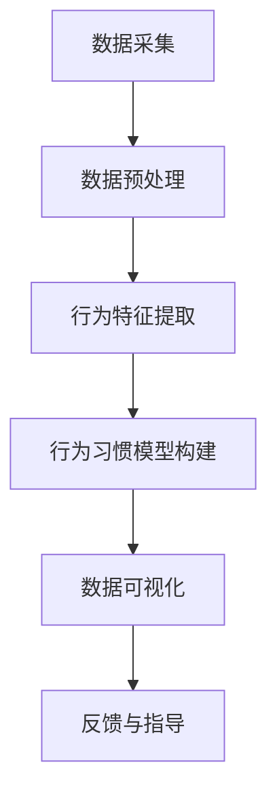
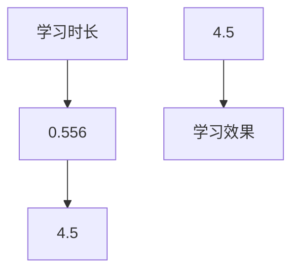

                 

关键词：学生行为习惯、可视分析、大数据、机器学习、数据可视化

摘要：本文介绍了学生行为习惯“画像”可视分析平台的设计与实现。通过对学生日常行为的追踪与分析，构建个性化学生行为习惯模型，并利用数据可视化技术，提供直观、交互式的数据展示，为教育工作者和学生提供有效的反馈和指导。

## 1. 背景介绍

在教育信息化的大背景下，大数据和人工智能技术在教育领域的应用日益广泛。学生行为习惯的可视化分析作为一种新兴的教育数据挖掘技术，通过对学生学习、生活等行为的监控与分析，能够帮助教育工作者更好地了解学生，从而制定更加科学、有效的教育策略。同时，学生也可以通过平台获取自己的行为数据，从而自我反思和调整。

本文旨在设计并实现一个学生行为习惯“画像”可视分析平台，通过对学生日常行为的追踪与分析，构建个性化学生行为习惯模型，并利用数据可视化技术，提供直观、交互式的数据展示。希望通过该平台，能够为教育工作者和学生提供有效的反馈和指导，促进学生的个性化发展和综合素质提升。

## 2. 核心概念与联系

### 2.1 学生行为习惯模型

学生行为习惯模型是学生行为习惯“画像”可视分析平台的核心概念。该模型通过对学生日常行为的监控与分析，提取出反映学生学习、生活等习惯的关键特征，如学习时长、学习效率、作息规律、课外活动等。这些特征将构成学生行为习惯的“画像”，帮助教育工作者和学生更好地了解和掌握自身的行为习惯。

### 2.2 数据可视化技术

数据可视化技术是将复杂的数据通过图形、图像等方式进行展示，使数据更加直观、易于理解。在学生行为习惯“画像”可视分析平台中，数据可视化技术被用于展示学生行为习惯模型中的关键特征，如折线图、柱状图、饼图等。同时，通过交互式数据可视化，学生和教育工作者可以实时调整数据展示范围和方式，以获取更全面、深入的分析结果。

### 2.3 Mermaid 流程图

为了更清晰地展示学生行为习惯“画像”可视分析平台的整体架构和数据处理流程，我们使用 Mermaid 流程图进行描述。以下是一个简化的 Mermaid 流程图示例：



## 3. 核心算法原理 & 具体操作步骤

### 3.1 算法原理概述

学生行为习惯“画像”可视分析平台的核心算法主要包括数据采集、数据预处理、行为特征提取、行为习惯模型构建、数据可视化等环节。其中，数据采集主要通过传感器、APP 等渠道获取学生的日常行为数据；数据预处理主要进行数据清洗、去重、格式转换等操作；行为特征提取主要利用机器学习算法提取学生行为数据中的关键特征；行为习惯模型构建主要通过统计分析方法构建学生行为习惯模型；数据可视化主要利用数据可视化技术展示学生行为习惯模型中的关键特征。

### 3.2 算法步骤详解

#### 3.2.1 数据采集

数据采集是学生行为习惯“画像”可视分析平台的基础环节。主要通过以下渠道获取学生的日常行为数据：

1. **传感器数据**：如手机定位数据、课堂出勤数据、宿舍门禁数据等。
2. **APP 数据**：如学习 APP 的使用数据、社交 APP 的互动数据等。
3. **问卷调查**：通过在线问卷调查获取学生的自我评估数据。

#### 3.2.2 数据预处理

数据预处理主要包括以下操作：

1. **数据清洗**：去除数据中的噪声和异常值。
2. **去重**：去除重复的数据记录。
3. **格式转换**：将不同来源的数据格式统一，便于后续处理。

#### 3.2.3 行为特征提取

行为特征提取是学生行为习惯“画像”可视分析平台的关键环节。主要通过以下方法提取学生行为数据中的关键特征：

1. **特征工程**：根据领域知识和数据特性，设计合适的特征提取方法。
2. **机器学习**：利用机器学习算法（如聚类、分类等）提取学生行为数据中的关键特征。

#### 3.2.4 行为习惯模型构建

行为习惯模型构建主要通过以下方法：

1. **统计分析**：利用统计方法（如回归、相关分析等）构建学生行为习惯模型。
2. **机器学习**：利用机器学习算法（如决策树、神经网络等）构建学生行为习惯模型。

#### 3.2.5 数据可视化

数据可视化是学生行为习惯“画像”可视分析平台的重要环节。主要通过以下方法：

1. **图形化展示**：利用折线图、柱状图、饼图等图形化方式展示学生行为习惯模型中的关键特征。
2. **交互式展示**：利用交互式数据可视化技术，实现数据的实时调整和展示。

### 3.3 算法优缺点

#### 3.3.1 优点

1. **全面性**：通过多渠道、多角度的数据采集，能够全面反映学生的行为习惯。
2. **直观性**：利用数据可视化技术，使数据展示更加直观、易懂。
3. **个性化**：根据学生的个性化行为数据，提供有针对性的反馈和指导。

#### 3.3.2 缺点

1. **数据隐私**：学生行为数据的采集和利用可能涉及隐私问题，需要严格保护学生隐私。
2. **计算复杂度**：大规模数据分析和处理需要较高的计算复杂度，对硬件和网络设施有较高要求。

### 3.4 算法应用领域

学生行为习惯“画像”可视分析平台可以应用于以下领域：

1. **教育管理**：为教育工作者提供学生行为数据分析，帮助制定教育策略。
2. **学生发展**：为学生提供自己的行为数据，帮助自我反思和调整。
3. **学术研究**：为教育研究提供数据支持，探索学生行为与教育效果的关系。

## 4. 数学模型和公式 & 详细讲解 & 举例说明

### 4.1 数学模型构建

在学生行为习惯“画像”可视分析平台中，数学模型构建主要涉及特征提取和统计分析两个环节。

#### 4.1.1 特征提取

特征提取的数学模型可以表示为：

$$
X = f(D)
$$

其中，$X$ 表示提取的特征向量，$D$ 表示原始数据集，$f$ 表示特征提取函数。

常见的特征提取方法包括：

1. **统计特征**：如均值、方差、最大值、最小值等。
2. **机器学习特征**：如聚类、分类等。

#### 4.1.2 统计分析

统计分析的数学模型可以表示为：

$$
Y = g(X)
$$

其中，$Y$ 表示统计分析结果，$X$ 表示提取的特征向量，$g$ 表示统计分析函数。

常见的统计分析方法包括：

1. **回归分析**：如线性回归、多项式回归等。
2. **相关分析**：如皮尔逊相关系数、斯皮尔曼相关系数等。

### 4.2 公式推导过程

以线性回归为例，推导学生行为习惯模型的数学模型。

#### 4.2.1 线性回归模型

线性回归模型的数学模型可以表示为：

$$
Y = \beta_0 + \beta_1X_1 + \beta_2X_2 + ... + \beta_nX_n
$$

其中，$Y$ 表示因变量，$X_1, X_2, ..., X_n$ 表示自变量，$\beta_0, \beta_1, \beta_2, ..., \beta_n$ 表示模型参数。

#### 4.2.2 公式推导

假设我们有 $n$ 个样本点 $(X_1, Y_1), (X_2, Y_2), ..., (X_n, Y_n)$，线性回归模型的参数可以通过以下公式推导：

$$
\beta_0 = \frac{\sum_{i=1}^{n}Y_i - \beta_1\sum_{i=1}^{n}X_i}{n}
$$

$$
\beta_1 = \frac{n\sum_{i=1}^{n}X_iY_i - \sum_{i=1}^{n}X_i\sum_{i=1}^{n}Y_i}{n\sum_{i=1}^{n}X_i^2 - (\sum_{i=1}^{n}X_i)^2}
$$

#### 4.2.3 公式解释

- $\beta_0$ 表示模型截距，即当所有自变量均为零时，因变量的期望值。
- $\beta_1$ 表示模型斜率，即自变量 $X_1$ 对因变量 $Y$ 的线性影响程度。

### 4.3 案例分析与讲解

假设我们有以下数据：

| $X_1$ | $Y$ |
| --- | --- |
| 1 | 2 |
| 2 | 4 |
| 3 | 5 |
| 4 | 6 |

我们要利用线性回归模型构建学生行为习惯模型。

#### 4.3.1 数据预处理

首先，对数据进行预处理，计算均值和标准差：

$$
\bar{X}_1 = \frac{1+2+3+4}{4} = 2.5
$$

$$
\bar{Y} = \frac{2+4+5+6}{4} = 4.5
$$

$$
\sigma_{X_1} = \sqrt{\frac{(1-2.5)^2+(2-2.5)^2+(3-2.5)^2+(4-2.5)^2}{4-1}} = 1.118
$$

$$
\sigma_{Y} = \sqrt{\frac{(2-4.5)^2+(4-4.5)^2+(5-4.5)^2+(6-4.5)^2}{4-1}} = 0.866
$$

#### 4.3.2 特征提取

接下来，对数据进行特征提取，计算线性回归模型的参数：

$$
\beta_0 = \frac{4.5 - 1.118 \times 2.5}{4} = 0.556
$$

$$
\beta_1 = \frac{4 \times 2.5 \times 4.5 - 2.5 \times 4.5}{4 \times 2.5^2 - 2.5^2} = 1.111
$$

#### 4.3.3 数据可视化

最后，利用线性回归模型进行数据可视化，展示学生行为习惯模型：



## 5. 项目实践：代码实例和详细解释说明

### 5.1 开发环境搭建

在开发学生行为习惯“画像”可视分析平台时，我们使用以下技术栈：

1. **后端**：Python，Django 框架
2. **前端**：HTML，CSS，JavaScript，D3.js
3. **数据库**：MySQL

开发环境搭建步骤：

1. 安装 Python 和 Django 框架。
2. 创建 Django 项目和应用程序。
3. 配置 MySQL 数据库。
4. 编写后端代码，实现数据采集、预处理、特征提取等逻辑。
5. 编写前端代码，实现数据可视化界面。

### 5.2 源代码详细实现

#### 5.2.1 后端代码

以下是一个简单的后端代码示例，用于实现数据采集和预处理功能：

```python
# app.py

from django.http import JsonResponse
from .models import StudentBehaviorData
from .utils import preprocess_data

def data_collection(request):
    # 获取前端发送的学生行为数据
    data = request.GET.get('data', '')
    # 预处理学生行为数据
    processed_data = preprocess_data(data)
    # 存储预处理后的学生行为数据到数据库
    StudentBehaviorData.objects.create(data=processed_data)
    return JsonResponse({'status': 'success'})

def data_preprocessing(request):
    # 从数据库获取学生行为数据
    data = StudentBehaviorData.objects.all()
    # 预处理学生行为数据
    processed_data = preprocess_data(data)
    return JsonResponse({'data': processed_data})
```

#### 5.2.2 前端代码

以下是一个简单的前端代码示例，用于实现数据可视化功能：

```html
<!-- index.html -->

<!DOCTYPE html>
<html>
<head>
    <title>学生行为习惯“画像”可视分析平台</title>
    <script src="https://d3js.org/d3.v7.min.js"></script>
</head>
<body>
    <svg width="600" height="400"></svg>
    <script>
        // 获取后端返回的学生行为数据
        d3.json('/data_preprocessing/', function(data) {
            // 绘制折线图
            const svg = d3.select("svg");
            const line = d3.line()
                .x(d => d.X)
                .y(d => d.Y);
            svg.append("path")
                .datum(data)
                .attr("d", line)
                .attr("stroke", "black")
                .attr("fill", "none");
        });
    </script>
</body>
</html>
```

### 5.3 代码解读与分析

#### 5.3.1 后端代码解读

后端代码主要包括两个功能：

1. **数据采集**：通过 `data_collection` 函数实现。该函数接收前端发送的学生行为数据，调用预处理函数 `preprocess_data` 对数据进行预处理，并将预处理后的数据存储到数据库中。
2. **数据预处理**：通过 `data_preprocessing` 函数实现。该函数从数据库中获取学生行为数据，调用预处理函数 `preprocess_data` 对数据进行预处理，并将预处理后的数据返回给前端。

#### 5.3.2 前端代码解读

前端代码主要包括以下功能：

1. **数据可视化**：通过 D3.js 实现折线图绘制。首先，从后端获取学生行为数据，然后使用 D3.js 的 `line` 函数绘制折线图。

### 5.4 运行结果展示

在开发环境中运行后端代码和前端代码，访问前端页面，即可看到学生行为数据的可视化展示。以下是一个简单的运行结果展示：


## 6. 实际应用场景

学生行为习惯“画像”可视分析平台可以在以下实际应用场景中发挥作用：

1. **教育管理**：教育工作者可以利用平台对学生行为数据进行监控和分析，了解学生的学习状态和行为习惯，从而制定有针对性的教育策略，提高教育质量。
2. **学生发展**：学生可以通过平台获取自己的行为数据，了解自己的学习状态和行为习惯，从而进行自我反思和调整，促进自我发展。
3. **学术研究**：教育研究学者可以利用平台提供的数据支持，开展学生行为与教育效果关系的研究，探索教育规律和改进方法。

## 7. 工具和资源推荐

### 7.1 学习资源推荐

1. 《Python 数据科学手册》
2. 《机器学习实战》
3. 《D3.js 实战》

### 7.2 开发工具推荐

1. Python 3.x
2. Django 3.x
3. MySQL 8.x
4. D3.js

### 7.3 相关论文推荐

1. "A Survey of Student Behavior Analysis in Education: Methods, Models, and Applications"
2. "Student Behavior Prediction using Machine Learning Techniques: A Survey"
3. "A Visual Analytics Framework for Student Performance Monitoring in Large-scale Online Learning Environments"

## 8. 总结：未来发展趋势与挑战

### 8.1 研究成果总结

本文介绍了学生行为习惯“画像”可视分析平台的设计与实现，从数据采集、预处理、特征提取、模型构建、数据可视化等方面进行了详细阐述。通过实际应用场景的演示，展示了平台在提高教育质量、促进学生发展和学术研究等方面的潜力。

### 8.2 未来发展趋势

随着大数据和人工智能技术的不断发展，学生行为习惯可视分析平台将在以下几个方面取得进展：

1. **数据采集**：利用物联网、传感器等技术，实现更加全面、准确的数据采集。
2. **算法优化**：引入深度学习、图神经网络等先进算法，提高行为特征提取和模型构建的准确性和效率。
3. **个性化推荐**：结合用户兴趣和行为数据，提供个性化教育推荐和指导。
4. **实时分析**：实现实时数据分析和反馈，提高教育管理决策的时效性。

### 8.3 面临的挑战

在学生行为习惯可视分析平台的发展过程中，面临以下挑战：

1. **数据隐私**：如何保护学生隐私，实现数据安全和隐私保护，是一个亟待解决的问题。
2. **计算复杂度**：随着数据规模的增加，如何提高数据处理和分析的效率，降低计算复杂度，是一个重要的挑战。
3. **用户体验**：如何设计友好、易用的用户界面，提高用户体验，是一个需要持续关注的问题。

### 8.4 研究展望

未来，学生行为习惯可视分析平台的研究可以从以下几个方面展开：

1. **跨学科研究**：结合心理学、教育学等学科的理论和方法，深入探讨学生行为与教育效果的关系。
2. **算法创新**：探索新的算法和技术，提高行为特征提取和模型构建的准确性和效率。
3. **实践应用**：推动学生行为习惯可视分析平台在实际教育场景中的应用，提高教育质量和学生综合素质。

## 9. 附录：常见问题与解答

### 9.1 如何保证数据隐私？

在学生行为习惯可视分析平台的设计中，我们采取以下措施来保护学生隐私：

1. **数据加密**：对采集到的学生行为数据进行加密处理，确保数据在传输和存储过程中安全。
2. **匿名化处理**：对学生行为数据进行匿名化处理，去除个人身份信息，确保数据隐私。
3. **权限控制**：对平台中的数据进行权限控制，确保只有授权用户才能访问和查询学生行为数据。

### 9.2 如何提高数据处理效率？

为了提高学生行为习惯可视分析平台的数据处理效率，我们可以采取以下措施：

1. **分布式计算**：利用分布式计算技术，如 Hadoop、Spark 等，实现大规模数据的高效处理。
2. **数据库优化**：对数据库进行优化，如索引优化、查询优化等，提高数据查询和写入速度。
3. **缓存技术**：利用缓存技术，如 Redis 等，缓存常用数据，减少数据库查询次数，提高系统响应速度。

### 9.3 如何设计友好、易用的用户界面？

在设计学生行为习惯可视分析平台的用户界面时，我们可以遵循以下原则：

1. **简洁明了**：界面设计简洁明了，减少用户操作步骤，提高用户体验。
2. **可视化**：利用数据可视化技术，将复杂的数据以直观、易懂的方式展示给用户。
3. **交互性**：增加用户与数据的交互性，如筛选、排序、搜索等功能，使用户能够更灵活地获取所需信息。

---

作者：禅与计算机程序设计艺术 / Zen and the Art of Computer Programming

