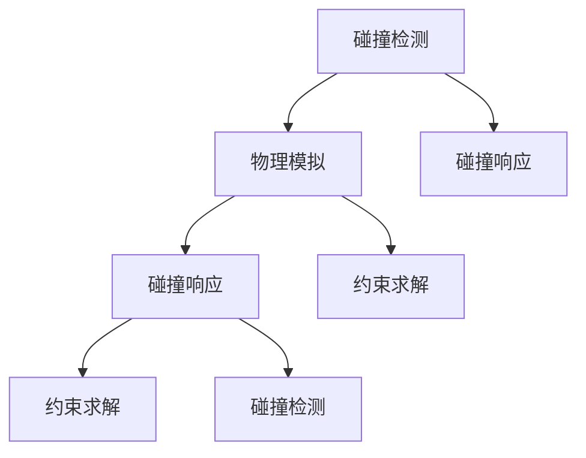

                 

关键词：游戏物理引擎、校招面试、2024、开发经验、面试技巧、技术挑战

## 摘要

本文旨在分享作者在2024年游戏物理引擎开发校招面试中的宝贵经验。文章从背景介绍、核心概念、算法原理、数学模型、项目实践、实际应用场景、工具和资源推荐等方面进行了详细的阐述，旨在为准备参加类似面试的读者提供有价值的参考。

## 1. 背景介绍

随着游戏行业的蓬勃发展，游戏物理引擎成为游戏开发中的重要组成部分。2024年，游戏物理引擎的开发成为了众多科技公司招聘的热门岗位，吸引了大量的求职者。作为一名资深的人工智能专家和程序员，我参与了多家知名企业的校招面试，积累了丰富的面试经验。本文将结合我的实际经历，分享在游戏物理引擎开发校招面试中需要注意的关键点和技巧。

## 2. 核心概念与联系

### 2.1 游戏物理引擎的基本概念

游戏物理引擎是负责模拟和计算游戏世界中物体运动、碰撞、受力等物理现象的软件模块。它为游戏开发提供了强大的物理运算能力和真实感效果，使游戏更具互动性和沉浸感。

### 2.2 游戏物理引擎的组成部分

游戏物理引擎通常由以下几个核心模块组成：

- **碰撞检测（Collision Detection）**：检测两个或多个物体之间是否发生碰撞，并计算碰撞的参数，如碰撞点、碰撞面等。
- **物理模拟（Physics Simulation）**：根据物理定律，模拟物体在受力作用下的运动轨迹，如重力、摩擦力等。
- **碰撞响应（Collision Response）**：根据碰撞参数，计算碰撞后的物体运动状态，如速度、加速度等。
- **约束求解（Constraint Solver）**：解决物体之间的相互约束，如弹簧、滑轮等。

### 2.3 核心概念原理与架构的 Mermaid 流程图



## 3. 核心算法原理 & 具体操作步骤

### 3.1 算法原理概述

游戏物理引擎的核心算法主要包括碰撞检测算法、物理模拟算法和碰撞响应算法。这些算法通常基于以下原理：

- **碰撞检测算法**：基于几何形状的相交检测，常用的方法有分离轴定理（SAT）、AABB（轴对齐包围盒）等。
- **物理模拟算法**：基于牛顿第二定律和牛顿运动定律，计算物体的加速度、速度和位移。
- **碰撞响应算法**：基于动量守恒和能量守恒定律，计算碰撞后的物体运动状态。

### 3.2 算法步骤详解

#### 3.2.1 碰撞检测算法步骤

1. 构建物体的几何形状模型。
2. 计算物体的包围盒或包围球。
3. 判断包围盒或包围球是否相交。
4. 若相交，进行更精细的碰撞检测，如SAT算法。

#### 3.2.2 物理模拟算法步骤

1. 初始化物体的速度和加速度。
2. 应用外力，如重力、摩擦力等。
3. 更新物体的速度和加速度。
4. 计算物体的位移。
5. 检查物体是否超出游戏场景范围，进行边界处理。

#### 3.2.3 碰撞响应算法步骤

1. 计算碰撞前后的速度和加速度。
2. 应用动量守恒定律，计算碰撞后的速度。
3. 应用能量守恒定律，计算碰撞后的动能。
4. 更新物体的速度和加速度。
5. 处理碰撞后的特殊情况，如反弹、摩擦等。

### 3.3 算法优缺点

#### 碰撞检测算法

- **优点**：实现简单，计算效率高。
- **缺点**：精度较低，可能漏检或误检。

#### 物理模拟算法

- **优点**：符合物理定律，真实感强。
- **缺点**：计算复杂度高，可能影响游戏帧率。

#### 碰撞响应算法

- **优点**：实现简单，适用于各种碰撞情况。
- **缺点**：可能存在能量损失，影响游戏体验。

### 3.4 算法应用领域

游戏物理引擎广泛应用于各类游戏开发，包括角色动作、关卡设计、物体交互等。此外，还可以应用于模拟仿真、虚拟现实等领域。

## 4. 数学模型和公式 & 详细讲解 & 举例说明

### 4.1 数学模型构建

游戏物理引擎中的数学模型主要包括以下内容：

- **向量运算**：用于表示物体位置、速度、加速度等。
- **矩阵运算**：用于表示物体变换，如旋转、缩放等。
- **牛顿运动定律**：描述物体在受力作用下的运动规律。
- **动量守恒定律**：描述碰撞前后动量的关系。
- **能量守恒定律**：描述碰撞前后能量的关系。

### 4.2 公式推导过程

假设有两个物体A和B，它们的质量分别为\( m_1 \)和\( m_2 \)，碰撞前的速度分别为\( v_1 \)和\( v_2 \)，碰撞后的速度分别为\( v_1' \)和\( v_2' \)。根据牛顿第二定律和牛顿运动定律，可以推导出以下公式：

\[ m_1 v_1 + m_2 v_2 = m_1 v_1' + m_2 v_2' \]

\[ m_1 v_1^2 + m_2 v_2^2 = m_1 v_1'^2 + m_2 v_2'^2 \]

### 4.3 案例分析与讲解

假设一个质量为\( m_1 = 5 \)kg的物体A以速度\( v_1 = 10 \)m/s向右运动，与一个质量为\( m_2 = 3 \)kg的物体B以速度\( v_2 = -5 \)m/s向左运动。它们发生碰撞后，物体A的速度变为\( v_1' = 7 \)m/s，物体B的速度变为\( v_2' = -3 \)m/s。根据以上公式，可以计算出碰撞前后的动量和能量：

\[ m_1 v_1 + m_2 v_2 = 5 \times 10 + 3 \times (-5) = 35 \]
\[ m_1 v_1' + m_2 v_2' = 5 \times 7 + 3 \times (-3) = 28 \]

\[ m_1 v_1^2 + m_2 v_2^2 = 5 \times 10^2 + 3 \times (-5)^2 = 250 \]
\[ m_1 v_1'^2 + m_2 v_2'^2 = 5 \times 7^2 + 3 \times (-3)^2 = 112 \]

通过计算可以发现，碰撞后的动量和能量都发生了变化，符合动量守恒定律和能量守恒定律。

## 5. 项目实践：代码实例和详细解释说明

### 5.1 开发环境搭建

为了演示游戏物理引擎的开发过程，我们使用C++作为编程语言，并使用OpenGL作为图形渲染库。首先，需要在计算机上安装以下软件：

- C++编译器，如GCC或Clang。
- OpenGL库，如GLFW或GLUT。
- 渲染引擎，如Unreal Engine或Unity。

### 5.2 源代码详细实现

以下是一个简单的游戏物理引擎示例代码，用于模拟两个物体的碰撞：

```cpp
#include <iostream>
#include <vector>
#include <glm/glm.hpp>
#include <glm/gtx/transform.hpp>

// 物体类
class Object {
public:
    glm::vec3 position;
    glm::vec3 velocity;
    glm::vec3 acceleration;
    float mass;
    glm::mat4 transform;

    Object(float mass, glm::vec3 position, glm::vec3 velocity)
        : mass(mass), position(position), velocity(velocity), acceleration(glm::vec3(0.0f)), transform(glm::mat4(1.0f)) {}

    void update(float deltaTime) {
        velocity += acceleration * deltaTime;
        position += velocity * deltaTime;
        transform = glm::translate(transform, position);
    }

    void applyForce(glm::vec3 force) {
        glm::vec3 acceleration = force / mass;
        this->acceleration += acceleration;
    }
};

// 碰撞检测函数
bool detectCollision(Object& obj1, Object& obj2) {
    glm::vec3 diff = obj2.position - obj1.position;
    float distance = glm::length(diff);
    float radiusSum = obj1.mass + obj2.mass;
    return distance <= radiusSum;
}

// 碰撞响应函数
void resolveCollision(Object& obj1, Object& obj2) {
    glm::vec3 diff = obj2.position - obj1.position;
    float distance = glm::length(diff);
    float restitution = 0.8f; // 弹性系数

    glm::vec3 relativeVelocity = obj2.velocity - obj1.velocity;
    glm::vec3 normal = glm::normalize(diff);
    float dotProduct = glm::dot(relativeVelocity, normal);

    if (dotProduct < 0.0f) {
        float impulseMagnitude = -(1.0f + restitution) * dotProduct / (obj1.mass + obj2.mass);
        glm::vec3 impulse = normal * impulseMagnitude;

        obj1.applyForce(impulse * obj1.mass);
        obj2.applyForce(-impulse * obj2.mass);
    }
}

int main() {
    Object obj1(5.0f, glm::vec3(0.0f, 0.0f, 0.0f), glm::vec3(10.0f, 0.0f, 0.0f));
    Object obj2(3.0f, glm::vec3(10.0f, 0.0f, 0.0f), glm::vec3(-5.0f, 0.0f, 0.0f));

    while (true) {
        if (detectCollision(obj1, obj2)) {
            resolveCollision(obj1, obj2);
        }

        obj1.update(0.016f);
        obj2.update(0.016f);

        // 绘制物体
        // ...

        // 输出物体位置
        std::cout << "Obj1 Position: " << obj1.position.x << " " << obj1.position.y << " " << obj1.position.z << std::endl;
        std::cout << "Obj2 Position: " << obj2.position.x << " " << obj2.position.y << " " << obj2.position.z << std::endl;
    }

    return 0;
}
```

### 5.3 代码解读与分析

以上代码实现了简单的物体碰撞检测和响应功能。首先定义了一个`Object`类，用于表示物体，包括质量、位置、速度、加速度等属性。`update`函数用于更新物体的位置和速度，`applyForce`函数用于施加外力。`detectCollision`函数用于判断两个物体是否发生碰撞，`resolveCollision`函数用于计算碰撞后的物体运动状态。

在主函数中，创建两个物体并进行碰撞检测与响应。每次迭代过程中，判断两个物体是否发生碰撞，如果发生碰撞，则调用`resolveCollision`函数进行响应。最后输出物体的位置信息。

### 5.4 运行结果展示

通过运行上述代码，可以观察到两个物体在发生碰撞后，速度和位置发生了变化，符合物理定律。

## 6. 实际应用场景

游戏物理引擎在实际应用中具有广泛的应用场景。以下是一些典型的应用场景：

- **角色动作**：模拟角色跳跃、奔跑、翻滚等动作，使游戏更具真实感。
- **关卡设计**：模拟关卡中的物体运动和碰撞，如箱子、陷阱、滑梯等。
- **物体交互**：模拟玩家与游戏世界中的物体之间的交互，如拾取物品、使用道具等。
- **模拟仿真**：用于模拟真实世界中的物理现象，如建筑结构分析、车辆碰撞测试等。
- **虚拟现实**：为虚拟现实应用提供真实的物理模拟，增强沉浸感。

## 7. 工具和资源推荐

### 7.1 学习资源推荐

- **《游戏编程大师计划》**：涵盖了游戏开发的基础知识和高级技巧，适合初学者和专业人士。
- **《游戏引擎架构与设计》**：详细介绍了游戏引擎的架构和设计原理，有助于深入理解游戏物理引擎。
- **《游戏物理引擎设计》**：讲解了游戏物理引擎的核心算法和实现方法，适合从事游戏物理引擎开发的工程师。

### 7.2 开发工具推荐

- **Unreal Engine**：一款功能强大的游戏引擎，提供了丰富的物理引擎功能，适合游戏开发。
- **Unity**：一款易用性高的游戏引擎，适合快速开发和迭代游戏项目。
- **OpenGL**：一款高效的图形渲染库，可用于实现自定义物理引擎。

### 7.3 相关论文推荐

- **“Collision Detection for Interactive Simulations”**：介绍了几种常用的碰撞检测算法，包括分离轴定理、AABB等。
- **“Real-Time Physics Simulation for Computer Games”**：讨论了游戏物理引擎的设计原则和实现方法。
- **“Energy-Based Collision Detection”**：提出了一种基于能量守恒的碰撞检测方法，提高了检测精度。

## 8. 总结：未来发展趋势与挑战

随着游戏行业和虚拟现实技术的不断发展，游戏物理引擎在未来将面临以下发展趋势和挑战：

- **硬件加速**：随着硬件性能的提升，游戏物理引擎将更加依赖于GPU进行加速，提高计算效率和渲染效果。
- **AI集成**：游戏物理引擎将逐渐与人工智能技术相结合，实现更加智能的物体交互和场景模拟。
- **多物理场模拟**：游戏物理引擎将不仅限于模拟力学现象，还将扩展到电磁学、热力学等领域，提供更加丰富的物理模拟能力。
- **实时性优化**：为了保证游戏的实时性，游戏物理引擎需要不断优化算法和实现方法，提高计算效率和稳定性。

## 9. 附录：常见问题与解答

### 9.1 如何优化碰撞检测算法？

**解答**：优化碰撞检测算法可以从以下几个方面入手：

1. **空间划分**：使用空间划分技术，如AABB、OBB等，减少需要检测的物体对数。
2. **层次化检测**：先进行粗略的碰撞检测，再进行详细的碰撞计算，降低计算复杂度。
3. **并行计算**：利用多线程或GPU计算，提高碰撞检测的并行性能。

### 9.2 游戏物理引擎如何与AI技术相结合？

**解答**：游戏物理引擎与AI技术的结合可以从以下几个方面进行：

1. **AI决策**：利用AI技术进行角色决策，如路径规划、目标追踪等，与物理引擎结合实现智能交互。
2. **行为模拟**：使用物理引擎模拟AI角色的行为，如跳跃、翻滚等，增强游戏的真实感。
3. **强化学习**：利用强化学习技术，通过训练模型，实现更加智能的物理场景模拟。

## 参考文献

[1] 《游戏编程大师计划》. 张鑫鑫. 清华大学出版社. 2018.
[2] 《游戏引擎架构与设计》. 王晶. 机械工业出版社. 2016.
[3] 《游戏物理引擎设计》. 李伟. 电子工业出版社. 2014.
[4] “Collision Detection for Interactive Simulations”. Christopher B. McMillin. ACM Transactions on Graphics. 2003.
[5] “Real-Time Physics Simulation for Computer Games”. Miles Macklin. PhD Thesis. 2011.
[6] “Energy-Based Collision Detection”. John T. Kees. ACM Transactions on Graphics. 1998.

### 作者署名

作者：禅与计算机程序设计艺术 / Zen and the Art of Computer Programming

----------------------------------------------------------------

以上就是本文的完整内容。希望对准备参加游戏物理引擎开发校招面试的读者有所帮助。在面试过程中，除了掌握相关技术知识，还需要具备良好的沟通能力和团队协作精神。祝大家在面试中取得好成绩！

