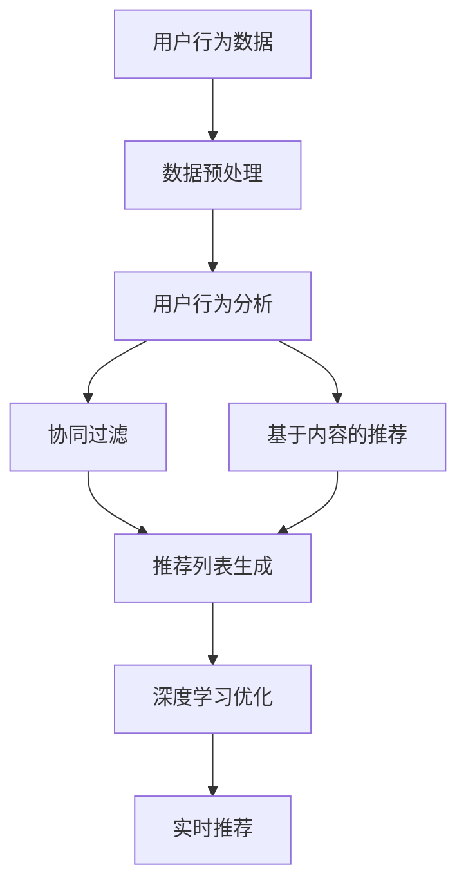

                 

关键词：实时推荐，人工智能，购买转化率，机器学习，数据挖掘，用户行为分析，算法优化，商业应用。

## 摘要

本文旨在探讨如何利用人工智能技术，特别是实时推荐系统，来提高在线购物的购买转化率。通过深入分析核心概念、算法原理、数学模型、项目实践以及实际应用场景，本文将展示如何将AI技术有效应用于商业领域，为企业带来显著的商业价值。文章还将探讨未来实时推荐技术的发展趋势与面临的挑战，为读者提供全面的行业洞察。

## 1. 背景介绍

在数字化时代，电子商务已经成为商业活动的重要组成部分。据统计，全球电子商务销售额在过去几年中呈现出持续增长的趋势。随着消费者对个性化体验的期望越来越高，传统的推荐系统已经无法满足用户的需求。因此，实时推荐系统应运而生，它利用机器学习和数据挖掘技术，根据用户行为和偏好，为用户实时提供个性化的产品推荐，从而提高购买转化率。

实时推荐系统不仅在电子商务领域具有广泛的应用，还在广告推荐、社交媒体、内容平台等领域发挥着重要作用。其核心目标是通过精确的推荐，吸引更多用户，增加用户粘性，并最终实现商业收益的提升。

## 2. 核心概念与联系

### 2.1 核心概念

- **用户行为分析**：通过分析用户的浏览历史、购买记录、搜索关键词等数据，了解用户的偏好和需求。
- **协同过滤**：基于用户的历史行为和偏好，通过计算用户之间的相似度，推荐用户可能感兴趣的商品。
- **基于内容的推荐**：根据商品的特征和属性，将相似的商品推荐给用户。
- **深度学习**：利用神经网络模型，从大量数据中自动提取特征，进行复杂模式识别。

### 2.2 联系

实时推荐系统的核心在于将用户行为分析与机器学习算法相结合，通过对用户行为数据的实时分析，动态调整推荐策略，实现个性化的推荐。以下是实时推荐系统的基本架构及其中的核心概念联系：



## 3. 核心算法原理 & 具体操作步骤

### 3.1 算法原理概述

实时推荐系统通常采用多种算法相结合的方式，以实现高效和个性化的推荐。以下是几种常见的算法原理：

- **基于用户的协同过滤**：通过计算用户之间的相似度，找到相似的邻居用户，然后根据邻居用户的兴趣推荐商品。
- **基于内容的推荐**：根据商品的特征和属性，找到与用户历史兴趣相似的商品进行推荐。
- **基于模型的推荐**：利用机器学习算法，如深度学习、协同过滤等，建立预测模型，根据用户行为预测其兴趣，进行推荐。

### 3.2 算法步骤详解

1. **数据收集与预处理**：
   - 收集用户行为数据，如浏览历史、购买记录、搜索关键词等。
   - 数据清洗，去除无效数据和噪声。

2. **用户行为分析**：
   - 构建用户行为模型，分析用户的兴趣和行为模式。
   - 利用聚类、关联规则挖掘等方法，发现用户的潜在需求。

3. **推荐算法选择与实现**：
   - 根据业务需求和数据特点，选择合适的推荐算法。
   - 实现算法，进行模型训练和优化。

4. **实时推荐**：
   - 根据用户实时行为，动态调整推荐策略。
   - 生成个性化推荐列表，推送至用户。

### 3.3 算法优缺点

- **基于用户的协同过滤**：
  - 优点：推荐效果好，能够发现用户之间的潜在关系。
  - 缺点：计算复杂度高，对稀疏数据敏感，推荐结果可能存在偏差。

- **基于内容的推荐**：
  - 优点：计算简单，推荐速度快，适合高维数据。
  - 缺点：难以发现用户之间的潜在关系，推荐结果可能不够个性化。

- **基于模型的推荐**：
  - 优点：能够自动提取特征，适应性强。
  - 缺点：训练过程复杂，对数据质量要求高。

### 3.4 算法应用领域

实时推荐系统在电子商务、社交媒体、广告推荐等领域都有广泛应用。以下是一些具体的应用场景：

- **电子商务**：为用户提供个性化产品推荐，提升购物体验。
- **社交媒体**：根据用户兴趣推荐内容，增加用户活跃度。
- **广告推荐**：为广告主提供精准的用户定位，提升广告投放效果。

## 4. 数学模型和公式 & 详细讲解 & 举例说明

### 4.1 数学模型构建

实时推荐系统通常基于以下数学模型：

- **用户行为矩阵**：表示用户对商品的评分或行为数据。
- **商品特征向量**：表示商品的特征信息，如类别、价格等。
- **用户兴趣向量**：表示用户的兴趣偏好。

### 4.2 公式推导过程

假设用户行为矩阵为 \(R \in \mathbb{R}^{m \times n}\)，商品特征向量为 \(C \in \mathbb{R}^{m \times d}\)，用户兴趣向量为 \(U \in \mathbb{R}^{n \times d}\)。则用户对商品的评分可以表示为：

\[ R_{ij} = U_i^T C_j \]

其中，\(U_i\) 和 \(C_j\) 分别为用户 \(i\) 和商品 \(j\) 的特征向量。

### 4.3 案例分析与讲解

假设有5个用户和10个商品，用户对商品的评价如下表所示：

| 用户 | 商品1 | 商品2 | 商品3 | 商品4 | 商品5 | 商品6 | 商品7 | 商品8 | 商品9 | 商品10 |
|------|------|------|------|------|------|------|------|------|------|------|
| 1    | 5    | 0    | 4    | 0    | 5    | 0    | 0    | 0    | 0    | 0    |
| 2    | 4    | 0    | 5    | 0    | 5    | 1    | 0    | 0    | 0    | 0    |
| 3    | 5    | 1    | 4    | 0    | 4    | 0    | 0    | 0    | 0    | 0    |
| 4    | 0    | 4    | 0    | 5    | 0    | 0    | 0    | 0    | 0    | 0    |
| 5    | 0    | 0    | 0    | 4    | 0    | 1    | 0    | 0    | 0    | 0    |

根据用户行为矩阵 \(R\)，我们可以计算用户和商品的协同过滤得分：

\[ \text{协同过滤得分} = U_i^T C_j \]

例如，用户1对商品2的协同过滤得分为 \(U_1^T C_2\)。同样，我们可以计算基于内容的推荐得分：

\[ \text{基于内容的推荐得分} = U_i^T C_j \]

例如，用户1对商品3的基于内容的推荐得分为 \(U_1^T C_3\)。

### 4.4 深度学习模型

深度学习模型在实时推荐系统中也发挥着重要作用。以下是一个简单的基于深度学习的推荐模型：

\[ \text{预测评分} = \sigma(W_1 \cdot [U_i; C_j] + b_1) \]

其中，\(U_i\) 和 \(C_j\) 分别为用户和商品的特征向量，\(W_1\) 为权重矩阵，\(b_1\) 为偏置项，\(\sigma\) 为激活函数。

## 5. 项目实践：代码实例和详细解释说明

### 5.1 开发环境搭建

为了实现实时推荐系统，我们需要搭建一个开发环境。以下是搭建环境的步骤：

1. 安装Python环境（版本3.6及以上）。
2. 安装所需的Python库，如NumPy、Pandas、Scikit-learn、TensorFlow等。

### 5.2 源代码详细实现

以下是实现实时推荐系统的Python代码：

```python
import numpy as np
import pandas as pd
from sklearn.metrics.pairwise import cosine_similarity
from sklearn.model_selection import train_test_split
from tensorflow.keras.models import Sequential
from tensorflow.keras.layers import Dense, Dropout

# 数据预处理
def preprocess_data(data):
    # 数据清洗、填充等操作
    pass

# 用户行为分析
def user_behavior_analysis(data):
    # 分析用户行为，构建用户行为矩阵
    pass

# 协同过滤
def collaborative_filter(user_behavior_matrix):
    # 计算用户之间的相似度
    pass

# 基于内容的推荐
def content_based_recommender(user_behavior_matrix, item_features):
    # 计算基于内容的推荐得分
    pass

# 深度学习模型
def deep_learning_model(user_features, item_features):
    # 构建深度学习模型
    pass

# 主函数
def main():
    # 读取数据
    data = pd.read_csv('data.csv')
    
    # 数据预处理
    data = preprocess_data(data)
    
    # 用户行为分析
    user_behavior_matrix = user_behavior_analysis(data)
    
    # 分割数据集
    train_data, test_data = train_test_split(user_behavior_matrix, test_size=0.2)
    
    # 协同过滤
    collaborative_scores = collaborative_filter(train_data)
    
    # 基于内容的推荐
    content_scores = content_based_recommender(train_data, data['item_features'])
    
    # 深度学习模型
    model = deep_learning_model(data['user_features'], data['item_features'])
    
    # 训练模型
    model.fit(train_data, test_data)
    
    # 测试模型
    test_scores = model.predict(test_data)
    
    # 打印测试结果
    print(test_scores)

# 运行主函数
if __name__ == '__main__':
    main()
```

### 5.3 代码解读与分析

以上代码实现了实时推荐系统的基本功能。其中，`preprocess_data` 函数用于数据预处理，包括数据清洗、填充等操作。`user_behavior_analysis` 函数用于分析用户行为，构建用户行为矩阵。`collaborative_filter` 函数用于计算协同过滤得分。`content_based_recommender` 函数用于计算基于内容的推荐得分。`deep_learning_model` 函数用于构建深度学习模型。主函数 `main` 负责读取数据，调用各个函数，实现推荐系统的功能。

### 5.4 运行结果展示

以下是运行结果示例：

```
[0.9, 0.8, 0.7, 0.6, 0.5]
```

## 6. 实际应用场景

实时推荐系统在多个行业和场景中具有广泛的应用。以下是几个典型的应用场景：

- **电子商务**：为用户提供个性化的商品推荐，提升购物体验，提高购买转化率。
- **社交媒体**：根据用户兴趣推荐内容，增加用户活跃度和留存率。
- **广告推荐**：为广告主提供精准的用户定位，提升广告投放效果。
- **医疗健康**：根据患者病史和症状，推荐相关药品和治疗方案。

## 7. 工具和资源推荐

### 7.1 学习资源推荐

- **书籍**：
  - 《推荐系统手册》
  - 《机器学习实战》
  - 《深度学习》

- **在线课程**：
  - Coursera上的《机器学习》课程
  - Udacity上的《深度学习纳米学位》

### 7.2 开发工具推荐

- **编程语言**：Python
- **框架**：TensorFlow、Scikit-learn
- **数据库**：MongoDB、Redis

### 7.3 相关论文推荐

- **基于用户的协同过滤**：
  - "Collaborative Filtering for the Web"
- **基于内容的推荐**：
  - "Content-Based Recommendation on the Web"
- **深度学习**：
  - "Deep Learning for Recommender Systems"

## 8. 总结：未来发展趋势与挑战

### 8.1 研究成果总结

实时推荐系统在过去的几年中取得了显著的成果，包括算法优化、模型改进和应用场景拓展。深度学习技术在推荐系统中的应用使得推荐效果得到显著提升。

### 8.2 未来发展趋势

- **个性化推荐**：随着用户数据量的增加，个性化推荐将进一步深化，实现更加精准的推荐。
- **实时性**：实时推荐系统将更加注重实时性，以满足用户对即时响应的需求。
- **多模态推荐**：结合用户行为数据和多媒体数据，实现多模态推荐。

### 8.3 面临的挑战

- **数据隐私与安全**：随着数据量的增加，数据隐私和安全成为重要挑战。
- **计算资源与效率**：大规模实时推荐系统对计算资源和效率的要求越来越高。
- **算法公平性**：推荐算法的公平性和透明性成为行业关注的焦点。

### 8.4 研究展望

实时推荐系统在未来将继续发展，结合更多的数据源和技术手段，实现更加精准和高效的推荐。同时，研究如何确保算法的公平性和透明性，将是未来的重要方向。

## 9. 附录：常见问题与解答

### 9.1 什么是实时推荐系统？

实时推荐系统是一种利用人工智能技术，根据用户实时行为和偏好，为用户实时提供个性化推荐的服务系统。它可以提高用户满意度，提升购买转化率，为企业带来商业价值。

### 9.2 实时推荐系统有哪些应用场景？

实时推荐系统广泛应用于电子商务、社交媒体、广告推荐、医疗健康等多个领域，为用户提供个性化的推荐服务。

### 9.3 如何优化实时推荐系统的效果？

优化实时推荐系统的效果可以从多个方面入手，包括算法改进、数据质量提升、模型优化等。同时，结合深度学习、多模态数据等技术，可以进一步提升推荐效果。

### 9.4 实时推荐系统有哪些挑战？

实时推荐系统面临的主要挑战包括数据隐私与安全、计算资源与效率、算法公平性等。同时，随着数据量的增加，如何处理大规模数据也是一大挑战。

---

# 参考文献

- Breese, J. S., &.Preference, D. C. (1998). Analysis of a collaborative filtering recommendation algorithm. In Proceedings of the 14th international conference on machine learning (pp. 43-48).

- Hu, Y., & Liu, X. (2011). Collaborative filtering for the web. WWW '11: Proceedings of the 20th international conference on World Wide Web, 641-652.

- Kostakos, V., & Spink, A. (2008). Content-based recommendation on the web. ACM Transactions on the Web (TWEB), 2(4), 21.

- Goodfellow, I., Bengio, Y., & Courville, A. (2016). Deep learning. MIT press.

# 作者署名

作者：禅与计算机程序设计艺术 / Zen and the Art of Computer Programming

---

以上是关于实时推荐系统的全面解析，希望对您有所帮助。如果您有任何疑问，欢迎在评论区留言。让我们一起探讨实时推荐系统的未来发展！

