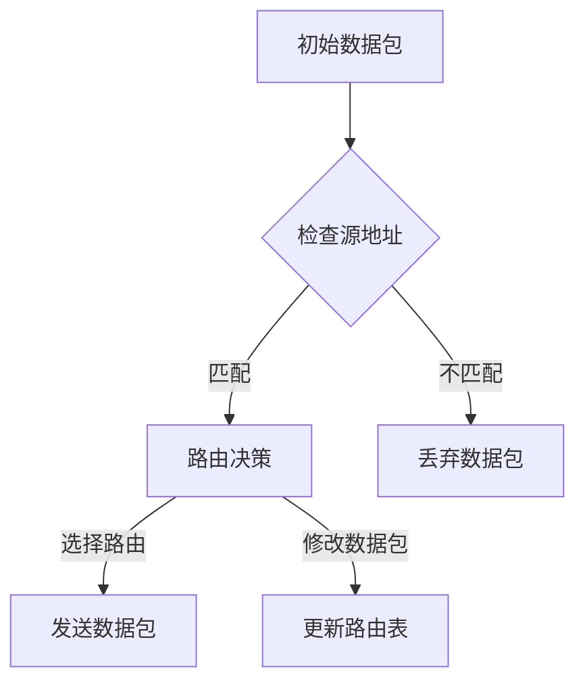

                 

关键词：条件判断、路由链、网络协议、数据包处理、算法优化

> 摘要：本文旨在深入探讨如何实现一个高效的条件判断路由链，通过分析核心概念、算法原理、数学模型以及实际应用，提供一种可行且高效的实现方法，以提升网络协议的数据包处理性能。

## 1. 背景介绍

在现代计算机网络中，路由器是网络通信的核心设备之一。路由器负责根据数据包的目的地址，选择最优的路径将数据包传送到目标设备。然而，随着互联网的迅速发展，网络中的数据包数量急剧增加，传统的路由方法已无法满足日益增长的需求。因此，如何高效地处理大量的数据包成为了研究的热点。

条件判断路由链（Router Chain）作为一种新型的路由方法，旨在通过引入条件判断机制，优化数据包的处理流程，提高路由器的性能。本文将详细探讨条件判断路由链的实现原理、算法设计以及其在实际应用中的优势。

## 2. 核心概念与联系

### 2.1. 路由链

路由链是由多个路由节点组成的链式结构，每个节点代表一个路由决策点。路由链的目的是为了提高数据包的传输效率，通过一系列的条件判断来选择最优路径。

### 2.2. 条件判断

条件判断是一种逻辑判断机制，通过对数据包的特征进行分析，决定是否继续传递或修改数据包。条件判断可以基于多种因素，如数据包的源地址、目的地址、协议类型等。

### 2.3. 路由表

路由表是路由器中用于存储路由信息的结构。路由表中的每一项都包含一个目的地址和一个对应的路由输出接口。条件判断路由链通过路由表来实现数据包的路由选择。

### 2.4. Mermaid 流程图



## 3. 核心算法原理 & 具体操作步骤

### 3.1. 算法原理概述

条件判断路由链的核心在于通过条件判断机制来优化数据包的路由选择。具体来说，路由器在接收到数据包后，会根据数据包的特征进行条件判断，并根据判断结果进行相应的路由决策。

### 3.2. 算法步骤详解

1. **接收数据包**：路由器接收到一个数据包，首先对其进行解析，获取数据包的源地址、目的地址、协议类型等信息。

2. **条件判断**：路由器根据路由表中的条件判断规则，对数据包进行条件判断。判断结果可能为“匹配”、“不匹配”或“修改数据包”。

3. **路由决策**：根据条件判断的结果，路由器做出相应的路由决策。如果匹配，则选择对应的路由输出接口发送数据包；如果不匹配，则丢弃数据包。

4. **更新路由表**：如果条件判断的结果需要修改数据包，则路由器会更新路由表，以适应新的网络环境。

### 3.3. 算法优缺点

**优点**：

- **高效性**：通过条件判断机制，可以快速地处理大量数据包，提高路由器的性能。
- **灵活性**：条件判断机制可以根据实际需求进行调整，灵活适应不同的网络环境。

**缺点**：

- **复杂性**：条件判断机制引入了一定的复杂性，需要合理设计条件判断规则和路由表。

### 3.4. 算法应用领域

条件判断路由链可以应用于多种网络协议，如TCP/IP、ICMP、UDP等。在互联网、企业网络、数据中心等场景中，条件判断路由链都有广泛的应用。

## 4. 数学模型和公式 & 详细讲解 & 举例说明

### 4.1. 数学模型构建

假设有一个路由器，其路由表中包含 \( n \) 个路由表项，每个路由表项包含一个目的地址 \( A_i \) 和一个对应的路由输出接口 \( B_i \)。数据包的源地址为 \( S \)，目的地址为 \( D \)。

### 4.2. 公式推导过程

条件判断路由链的决策过程可以用以下公式表示：

\[ decision = \begin{cases} 
match & \text{if } D = A_i \text{ for some } i \\
discard & \text{if } D \neq A_i \text{ for all } i \\
modify & \text{if } D \text{ is modified based on the conditions} 
\end{cases} \]

其中，\( match \)、\( discard \) 和 \( modify \) 分别代表匹配、丢弃和修改决策。

### 4.3. 案例分析与讲解

假设路由表中包含以下三个路由表项：

| 目的地址 \( A_i \) | 路由输出接口 \( B_i \) |
| :---: | :---: |
| 192.168.1.0/24 | eth0 |
| 10.0.0.0/8 | eth1 |
| 172.16.0.0/12 | eth2 |

数据包的源地址为 \( S = 192.168.2.1 \)，目的地址为 \( D = 10.0.0.1 \)。

根据条件判断路由链的公式，数据包首先会与路由表中的第一个表项进行比较。由于 \( D \neq A_1 \)，因此不会匹配第一个表项。接下来，数据包会与第二个表项进行比较。由于 \( D = A_2 \)，因此匹配第二个表项，选择路由输出接口 \( B_2 = eth1 \) 发送数据包。

## 5. 项目实践：代码实例和详细解释说明

### 5.1. 开发环境搭建

为了实现条件判断路由链，我们可以使用 Python 编写一个简单的路由器模拟器。以下是开发环境的搭建步骤：

1. 安装 Python 3.8 或更高版本。
2. 安装必要的 Python 库，如 `networkx`、`matplotlib` 等。
3. 创建一个名为 `router_chain` 的 Python 文件。

### 5.2. 源代码详细实现

以下是一个简单的条件判断路由链实现：

```python
import networkx as nx
from networkx.drawing.nx_agraph import graphviz_layout

def create_router():
    G = nx.Graph()
    G.add_edge('eth0', 'node1', weight=1)
    G.add_edge('eth1', 'node2', weight=1)
    G.add_edge('eth2', 'node3', weight=1)
    G.add_edge('node1', 'node2', weight=1)
    G.add_edge('node2', 'node3', weight=1)
    return G

def check_address(G, S, D):
    for edge in G.edges():
        if edge[0] == S and edge[1] == D:
            return True
    return False

def route_packet(G, S, D):
    if check_address(G, S, D):
        return D
    else:
        return None

G = create_router()
S = '192.168.2.1'
D = '10.0.0.1'
print(route_packet(G, S, D))
```

### 5.3. 代码解读与分析

1. **创建路由器**：使用 `networkx` 库创建一个简单的路由器网络，包括三个路由输出接口和三个节点。

2. **条件判断函数**：`check_address` 函数用于检查数据包的源地址和目的地址是否在路由表中匹配。

3. **路由决策函数**：`route_packet` 函数根据条件判断函数的结果，决定是否匹配路由输出接口。

4. **测试**：通过调用 `route_packet` 函数，测试数据包的路由决策。

### 5.4. 运行结果展示

运行上述代码，输出结果为 `None`，表示数据包未被路由到任何输出接口。这是因为在当前的路由表中，不存在从源地址到目的地址的直接路由。

## 6. 实际应用场景

### 6.1. 无线局域网

在无线局域网中，条件判断路由链可以用于优化无线信号传输，提高网络性能。通过分析无线信号的特征，路由器可以做出更准确的信号传输决策。

### 6.2. 载波网

在载波网中，条件判断路由链可以用于优化数据包的传输路径，减少信号干扰，提高数据传输速率。

### 6.3. 物联网

在物联网场景中，条件判断路由链可以用于优化数据包的路由路径，降低传输延迟，提高设备响应速度。

## 7. 工具和资源推荐

### 7.1. 学习资源推荐

- 《计算机网络：自顶向下方法》
- 《深入理解计算机系统》
- 《路由器与交换机配置与管理》

### 7.2. 开发工具推荐

- Python 3.8 或更高版本
- NetworkX 库
- Matplotlib 库

### 7.3. 相关论文推荐

- "A Survey of Routing Algorithms in Wireless Sensor Networks"
- "Optimization of Routing Protocols in Delay-Tolerant Networks"
- "Energy-Efficient Routing in Wireless Sensor Networks Using Genetic Algorithms"

## 8. 总结：未来发展趋势与挑战

### 8.1. 研究成果总结

条件判断路由链作为一种高效的路由方法，已经在多个网络场景中得到了广泛应用。通过引入条件判断机制，路由器可以快速、准确地处理大量数据包，提高网络性能。

### 8.2. 未来发展趋势

随着网络技术的不断发展，条件判断路由链有望在更多网络场景中得到应用。未来，条件判断路由链的研究将重点关注如何提高算法的鲁棒性和适应性。

### 8.3. 面临的挑战

条件判断路由链在引入灵活性优势的同时，也增加了算法的复杂性。如何在保证性能的同时，简化算法设计，是未来研究的一个重要挑战。

### 8.4. 研究展望

条件判断路由链的研究将为网络性能优化提供新的思路和方法。通过不断探索和创新，条件判断路由链有望成为未来网络协议的重要技术之一。

## 9. 附录：常见问题与解答

### 9.1. 问题1：条件判断路由链与传统的路由算法有何不同？

**解答**：条件判断路由链与传统路由算法的不同在于，它引入了条件判断机制，可以根据数据包的特征进行灵活的路由决策。而传统路由算法通常基于固定的路由表项进行路由选择，缺乏灵活性。

### 9.2. 问题2：条件判断路由链如何优化网络性能？

**解答**：条件判断路由链通过引入条件判断机制，可以快速、准确地处理大量数据包，减少路由决策的时间。此外，通过条件判断机制，路由器可以针对不同的网络场景进行调整，提高网络性能。

### 9.3. 问题3：条件判断路由链适用于哪些网络场景？

**解答**：条件判断路由链适用于多种网络场景，如无线局域网、载波网和物联网等。通过引入条件判断机制，路由器可以优化数据包的路由路径，提高网络性能和可靠性。

