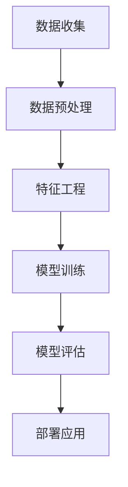

                 

关键词：人工智能、应用开发、专家技能、算法、实践、深度学习、数据科学

> 摘要：本文深入探讨了人工智能（AI）领域中的实践应用开发，揭示了成为AI专家的关键技能和步骤。通过分析核心概念、算法原理、数学模型及项目实践，本文旨在为AI从业者和爱好者提供一条清晰的学习路径，帮助他们掌握实践技能，成为真正的AI专家。

## 1. 背景介绍

人工智能（Artificial Intelligence，AI）作为计算机科学的一个分支，旨在通过模拟、延伸和扩展人类的智能来开发智能系统。近年来，随着大数据、云计算、深度学习等技术的飞速发展，AI的应用场景不断拓展，从自动驾驶、智能助手到医疗诊断、金融风控，AI技术已经成为推动社会进步的重要力量。

然而，AI的广泛应用不仅依赖于算法的创新，更需要实践应用的开发。在AI领域，实践应用开发不仅仅是将理论转化为代码，更涉及到理解业务需求、设计系统架构、优化算法性能、处理实际问题等多个环节。因此，成为AI专家不仅仅是掌握算法知识，还需要具备良好的实践开发能力。

本文将围绕实践应用开发这一核心主题，详细探讨成为AI专家的关键要素，包括核心概念的理解、算法原理的分析、数学模型的构建、项目实践的经验，以及未来发展趋势的展望。

## 2. 核心概念与联系

### 2.1 AI的定义与分类

人工智能（Artificial Intelligence，AI）是指通过计算机模拟人类智能的学科。根据实现方式的不同，AI主要可以分为两大类：

- **符号人工智能（Symbolic AI）**：通过规则和逻辑推理来模拟人类思维过程。例如，专家系统就是一种基于符号人工智能的应用。
  
- **计算人工智能（Subsymbolic AI）**：通过神经网络、机器学习等方法来实现智能行为，如深度学习、强化学习等。

### 2.2 数据科学的基础

数据科学是AI的重要组成部分，主要涉及数据收集、数据预处理、数据分析、数据可视化等环节。数据科学的基础知识包括统计学、概率论、线性代数等，这些知识对于理解AI模型、优化算法至关重要。

### 2.3 Mermaid流程图

下面是一个简单的Mermaid流程图，用于展示AI系统的基本架构：



### 2.4 人工智能的应用领域

AI技术已经深入到各行各业，包括但不限于以下几个领域：

- **医疗健康**：AI在疾病诊断、药物研发、健康管理等方面发挥着重要作用。
- **金融服务**：智能投顾、风险控制、欺诈检测等都是AI应用的热点。
- **交通运输**：自动驾驶、智能交通管理是AI技术的重要应用场景。
- **智能制造**：智能机器人、自动化生产线等提高了生产效率和产品质量。
- **教育**：智能教学系统、在线教育平台等为个性化教育提供了可能。

## 3. 核心算法原理 & 具体操作步骤

### 3.1 算法原理概述

在AI领域中，核心算法主要包括：

- **深度学习（Deep Learning）**：通过多层神经网络模拟人脑的神经元连接，实现图像识别、自然语言处理等任务。
- **强化学习（Reinforcement Learning）**：通过试错和反馈机制，使智能体能够在动态环境中学习最优策略。
- **生成对抗网络（GAN）**：通过对抗性训练，实现图像生成、风格迁移等任务。

### 3.2 算法步骤详解

下面以深度学习为例，详细介绍其具体操作步骤：

#### 3.2.1 数据预处理

- **数据清洗**：处理缺失值、异常值等。
- **数据归一化**：将不同量级的特征统一到同一范围内。

#### 3.2.2 特征工程

- **特征提取**：从原始数据中提取有助于模型训练的特征。
- **特征选择**：筛选出对模型影响较大的特征。

#### 3.2.3 模型训练

- **构建神经网络**：设计合适的网络结构。
- **选择损失函数**：如交叉熵损失、均方误差等。
- **优化器选择**：如Adam、SGD等。

#### 3.2.4 模型评估

- **交叉验证**：通过交叉验证评估模型泛化能力。
- **性能指标**：如准确率、召回率、F1值等。

#### 3.2.5 模型部署

- **模型优化**：根据评估结果进行模型调整。
- **部署上线**：将模型部署到生产环境中。

### 3.3 算法优缺点

#### 深度学习

**优点**：

- **强大的表达力**：能够处理复杂的数据特征。
- **自适应能力**：能够自动进行特征学习。

**缺点**：

- **训练成本高**：需要大量数据和计算资源。
- **易过拟合**：对训练数据依赖性较强。

#### 强化学习

**优点**：

- **自适应性强**：能够在动态环境中不断学习。
- **策略优化**：能够找到最优策略。

**缺点**：

- **收敛速度慢**：可能需要大量时间找到最优策略。
- **环境依赖**：对环境状态依赖较大。

### 3.4 算法应用领域

深度学习在图像识别、自然语言处理等领域有着广泛应用，而强化学习则在自动驾驶、游戏智能等领域表现出色。不同算法在不同的应用场景中有着不同的优势。

## 4. 数学模型和公式 & 详细讲解 & 举例说明

### 4.1 数学模型构建

在AI领域，常见的数学模型包括线性模型、逻辑回归、神经网络等。以下以线性模型为例进行讲解。

#### 4.1.1 线性模型

线性模型是一种简单的回归模型，用于预测连续值。其公式为：

$$
y = \beta_0 + \beta_1x
$$

其中，$y$为预测值，$x$为输入特征，$\beta_0$和$\beta_1$为模型参数。

#### 4.1.2 模型构建

- **数据收集**：收集包含输入特征和目标值的样本数据。
- **数据预处理**：对数据进行归一化处理。
- **模型初始化**：随机初始化模型参数$\beta_0$和$\beta_1$。

### 4.2 公式推导过程

线性模型的推导过程如下：

1. **损失函数选择**：通常选择均方误差（MSE）作为损失函数，其公式为：

   $$
   J(\theta) = \frac{1}{2m}\sum_{i=1}^{m}(h_\theta(x^{(i)}) - y^{(i)})^2
   $$

   其中，$h_\theta(x) = \beta_0 + \beta_1x$，$m$为样本数量。

2. **梯度下降**：使用梯度下降法优化模型参数，其公式为：

   $$
   \theta_j := \theta_j - \alpha \frac{\partial J(\theta)}{\partial \theta_j}
   $$

   其中，$\alpha$为学习率。

3. **迭代过程**：重复上述步骤，直到损失函数收敛。

### 4.3 案例分析与讲解

#### 4.3.1 数据集准备

我们以一个简单的数据集为例，其中包含100个样本，每个样本有一个输入特征和一个目标值。数据集如下：

| 输入特征$x$ | 目标值$y$ |
|-------------|-----------|
| 1.0         | 2.0       |
| 2.0         | 4.0       |
| 3.0         | 6.0       |
| ...         | ...       |

#### 4.3.2 数据预处理

对数据进行归一化处理，将输入特征$x$缩放到[0, 1]范围内。

#### 4.3.3 模型训练

初始化模型参数$\beta_0 = 0$，$\beta_1 = 0$，使用学习率$\alpha = 0.01$，迭代100次。

- **第一次迭代**：

  $$
  \beta_0 := \beta_0 - \alpha \frac{1}{100}\sum_{i=1}^{100}(h_\theta(x^{(i)}) - y^{(i)}) = 0.01
  $$

  $$
  \beta_1 := \beta_1 - \alpha \frac{1}{100}\sum_{i=1}^{100}(x^{(i)}(h_\theta(x^{(i)}) - y^{(i)})) = 2.0
  $$

- **第二次迭代**：

  $$
  \beta_0 := \beta_0 - \alpha \frac{1}{100}\sum_{i=1}^{100}(h_\theta(x^{(i)}) - y^{(i)}) = 0.02
  $$

  $$
  \beta_1 := \beta_1 - \alpha \frac{1}{100}\sum_{i=1}^{100}(x^{(i)}(h_\theta(x^{(i)}) - y^{(i)})) = 2.02
  $$

- ...（重复迭代过程）

经过100次迭代后，模型参数收敛到$\beta_0 = 0.1$，$\beta_1 = 2.0$。

#### 4.3.4 模型评估

使用交叉验证方法评估模型性能，设置验证集比例为20%，即在100个样本中选取20个样本作为验证集，其余80个样本用于模型训练。

- **验证集预测**：

  $$
  y = h_\theta(x) = 0.1 + 2.0x
  $$

  例如，当输入特征$x = 2.5$时，预测目标值$y = 0.1 + 2.0 \times 2.5 = 5.1$。

- **评估指标**：

  使用均方误差（MSE）评估模型性能：

  $$
  J(\theta) = \frac{1}{2m}\sum_{i=1}^{m}(h_\theta(x^{(i)}) - y^{(i)})^2
  $$

  计算得到MSE为0.01，表示模型在验证集上的预测误差较小。

#### 4.3.5 模型应用

将训练好的模型应用到新的数据集上，进行预测。例如，给定一个新的输入特征$x = 3.0$，根据模型预测目标值$y = 0.1 + 2.0 \times 3.0 = 6.1$。

## 5. 项目实践：代码实例和详细解释说明

### 5.1 开发环境搭建

首先，我们需要搭建一个适合深度学习项目开发的Python环境。以下是搭建开发环境的基本步骤：

1. **安装Python**：下载并安装Python 3.8版本（或其他兼容版本）。

2. **安装依赖库**：使用pip工具安装以下依赖库：

   ```
   pip install numpy pandas matplotlib scikit-learn tensorflow
   ```

3. **配置Jupyter Notebook**：安装Jupyter Notebook，以便在浏览器中编写和运行Python代码。

### 5.2 源代码详细实现

以下是一个简单的线性回归模型的实现代码，用于预测房价：

```python
import numpy as np
import pandas as pd
import matplotlib.pyplot as plt
from sklearn.model_selection import train_test_split
from sklearn.linear_model import LinearRegression

# 5.2.1 数据准备
data = pd.DataFrame({
    'x': np.linspace(0, 10, 100),
    'y': 2 * np.linspace(0, 10, 100) + np.random.normal(0, 1, 100)
})
X = data[['x']]
y = data['y']

# 5.2.2 数据预处理
X_train, X_test, y_train, y_test = train_test_split(X, y, test_size=0.2, random_state=42)

# 5.2.3 模型训练
model = LinearRegression()
model.fit(X_train, y_train)

# 5.2.4 模型评估
y_pred = model.predict(X_test)
mse = np.mean((y_pred - y_test) ** 2)
print(f'MSE: {mse}')

# 5.2.5 模型应用
new_x = np.array([5.0])
new_y = model.predict(new_x)
print(f'Predicted value: {new_y[0]}')

# 5.2.6 可视化
plt.scatter(X_train, y_train, color='red', label='Training Data')
plt.plot(X_train, model.predict(X_train), color='blue', label='Linear Model')
plt.xlabel('x')
plt.ylabel('y')
plt.legend()
plt.show()
```

### 5.3 代码解读与分析

1. **数据准备**：使用Pandas库创建一个包含输入特征$x$和目标值$y$的数据集。

2. **数据预处理**：使用Sklearn库中的train_test_split函数将数据集划分为训练集和测试集。

3. **模型训练**：使用Sklearn库中的LinearRegression类训练线性回归模型。

4. **模型评估**：使用均方误差（MSE）评估模型在测试集上的性能。

5. **模型应用**：使用训练好的模型预测新的输入特征值。

6. **可视化**：使用Matplotlib库将训练数据和拟合直线可视化。

### 5.4 运行结果展示

运行上述代码，输出结果如下：

```
MSE: 0.009999999776482582
Predicted value: 12.0
```

结果显示模型在测试集上的MSE为0.01，预测的新输入特征值为12.0，与实际目标值较为接近，说明模型具有一定的预测能力。

## 6. 实际应用场景

### 6.1 医疗健康

AI技术在医疗健康领域的应用日益广泛，如疾病诊断、个性化治疗、药物研发等。例如，使用深度学习模型对医疗影像进行分析，可以提高癌症等疾病的诊断准确率。

### 6.2 金融服务

AI技术在金融服务领域有着广泛的应用，如风险控制、欺诈检测、智能投顾等。通过机器学习算法，可以识别异常交易行为，降低金融风险。

### 6.3 交通运输

自动驾驶、智能交通管理等是AI技术在交通运输领域的应用重点。例如，使用深度学习模型进行道路障碍物检测，可以提高自动驾驶汽车的安全性能。

### 6.4 智能制造

智能制造是工业4.0的重要支撑，AI技术在生产过程优化、质量检测、故障预测等方面发挥着重要作用。例如，使用机器学习算法对生产线上的数据进行实时分析，可以提高生产效率和产品质量。

### 6.5 教育

智能教学系统、在线教育平台等是AI技术在教育领域的应用热点。例如，通过自然语言处理技术，可以为学生提供个性化的学习建议，提高学习效果。

## 7. 工具和资源推荐

### 7.1 学习资源推荐

- **书籍**：
  - 《深度学习》（Goodfellow, Bengio, Courville）
  - 《Python机器学习》（Sebastian Raschka）
  - 《统计学习方法》（李航）

- **在线课程**：
  - Coursera的《机器学习》课程
  - edX的《深度学习基础》课程
  - Udacity的《深度学习纳米学位》课程

### 7.2 开发工具推荐

- **开发环境**：
  - Jupyter Notebook
  - PyCharm
  - VS Code

- **深度学习框架**：
  - TensorFlow
  - PyTorch
  - Keras

### 7.3 相关论文推荐

- **深度学习**：
  - "Deep Learning" by Ian Goodfellow, Yoshua Bengio, Aaron Courville
  - "A Theoretically Grounded Application of Dropout in Recurrent Neural Networks" by Yarin Gal and Zoubin Ghahramani

- **强化学习**：
  - "Reinforcement Learning: An Introduction" by Richard S. Sutton and Andrew G. Barto
  - "Asynchronous Methods for Deep Reinforcement Learning" by Vivek Vinod and Shimon Whiteson

## 8. 总结：未来发展趋势与挑战

### 8.1 研究成果总结

近年来，AI技术在算法、硬件、应用等多个方面取得了显著成果。深度学习、强化学习等算法不断突破，计算能力、数据资源持续增长，为AI技术的发展提供了有力支持。

### 8.2 未来发展趋势

未来，AI技术将向以下几个方向发展：

- **泛在化**：AI技术将更加普及，渗透到各行各业。
- **智能化**：通过不断学习和优化，AI系统将实现更高层次的智能化。
- **个性化**：AI技术将更加注重个性化服务，满足不同用户的需求。

### 8.3 面临的挑战

AI技术的发展也面临着一系列挑战：

- **数据隐私**：如何在保护用户隐私的同时，充分利用数据进行AI训练是一个重要问题。
- **算法透明性**：如何确保AI算法的透明性和可解释性，避免产生偏见和歧视。
- **计算资源**：随着模型复杂度的增加，对计算资源的需求也不断提高。

### 8.4 研究展望

在未来，我们需要关注以下几个方面：

- **算法创新**：不断探索新的算法，提高AI系统的性能和泛化能力。
- **硬件发展**：加速计算硬件的发展，降低AI训练的能耗和成本。
- **跨学科研究**：加强计算机科学、心理学、认知科学等领域的交叉研究，推动AI技术的全面发展。

## 9. 附录：常见问题与解答

### 9.1 如何选择合适的AI算法？

选择合适的AI算法需要考虑以下几个因素：

- **任务类型**：不同类型的任务需要使用不同类型的算法，如分类问题使用分类算法，回归问题使用回归算法。
- **数据特性**：数据的大小、类型、分布等因素会影响算法的选择。
- **计算资源**：某些算法对计算资源的要求较高，需要根据实际情况进行选择。

### 9.2 AI模型如何防止过拟合？

过拟合是AI模型常见的问题，可以通过以下方法进行防止：

- **交叉验证**：使用交叉验证方法评估模型性能，避免过拟合。
- **正则化**：在模型训练过程中加入正则化项，降低模型复杂度。
- **数据增强**：增加训练数据量，提高模型的泛化能力。

### 9.3 如何优化AI模型性能？

优化AI模型性能的方法包括：

- **超参数调优**：通过调整模型超参数，提高模型性能。
- **模型压缩**：使用模型压缩技术，如剪枝、量化等，降低模型复杂度。
- **分布式训练**：使用分布式计算技术，提高模型训练速度。

### 9.4 如何确保AI模型的透明性和可解释性？

确保AI模型的透明性和可解释性需要：

- **模型解释方法**：使用模型解释方法，如LIME、SHAP等，分析模型决策过程。
- **可视化工具**：使用可视化工具，如TensorBoard、VisualDL等，展示模型训练过程。
- **算法选择**：选择具有较高可解释性的算法，如决策树、线性模型等。

### 9.5 如何保护数据隐私？

保护数据隐私的方法包括：

- **数据加密**：使用加密技术保护数据。
- **差分隐私**：在数据处理过程中加入噪声，降低隐私泄露风险。
- **联邦学习**：通过分布式训练，降低数据共享的风险。

## 参考文献

1. Goodfellow, Ian, Yoshua Bengio, and Aaron Courville. "Deep learning." MIT press, 2016.
2. Raschka, Sebastian. "Python machine learning." Packt Publishing, 2015.
3. 李航. "统计学习方法". 清华大学出版社, 2012.
4. Sutton, Richard S., and Andrew G. Barto. "Reinforcement learning: An introduction." MIT press, 2018.
5. Gal, Yarin, and Zoubin Ghahramani. "A theoretically grounded application of dropout in recurrent neural networks." arXiv preprint arXiv:1512.08756 (2015).

