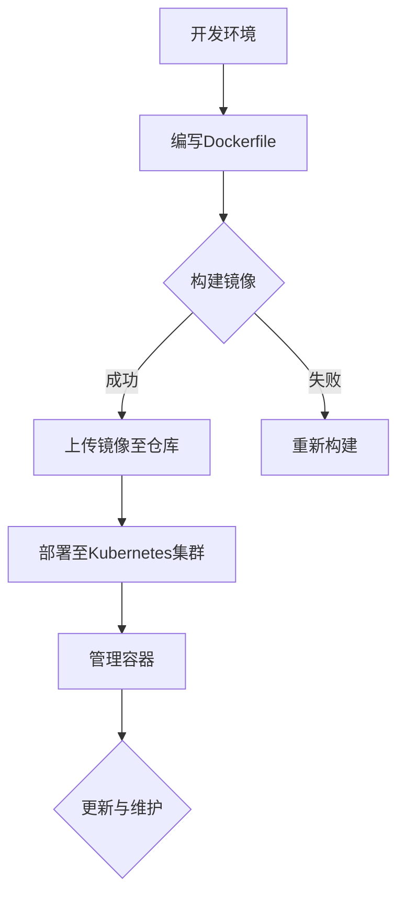

                 

## 1. 背景介绍

容器化技术作为现代软件开发和运维的重要技术，已经在全球范围内得到了广泛应用。它解决了传统虚拟化技术中的许多问题，如资源利用率低、部署复杂等。在容器化技术的阵营中，Docker和Kubernetes无疑是两位最耀眼的明星。

Docker是一款开源的应用容器引擎，它允许开发者将应用程序及其依赖环境打包到一个可移植的容器中，然后发布到任何流行的Linux或Windows操作系统上。这种技术让开发者可以“一劳永逸”地解决环境不一致的问题，从而加快了开发流程。

Kubernetes则是一个开源的容器编排平台，用于自动化容器化应用程序的部署、扩展和管理。它提供了自动化的部署、滚动更新、故障转移等功能，大大简化了容器化应用程序的运维过程。

本文将深入探讨Docker和Kubernetes的核心概念、工作原理、具体操作步骤，以及它们在实际项目中的应用。

## 2. 核心概念与联系

### 2.1 Docker简介

Docker的核心概念包括镜像（Image）、容器（Container）、仓库（Repository）和容器引擎（Engine）。首先，镜像是一个静态的、不可变的文件系统，用于封装应用程序及其依赖环境。容器则是镜像运行时的实例，它可以从镜像创建，并拥有独立的文件系统、网络和进程空间。仓库用于存储和管理镜像，而容器引擎则是Docker的核心组件，负责管理容器的创建、启动、停止和删除等操作。

### 2.2 Kubernetes简介

Kubernetes则是一个分布式系统，它用于管理容器化应用程序的生命周期。核心概念包括节点（Node）、集群（Cluster）、工作负载（Workload）等。节点是运行容器的主机，集群是由多个节点组成的集合，而工作负载则是运行在集群中的应用程序。Kubernetes提供了多种工作负载资源，如Deployment、StatefulSet、Pod等，用于管理应用程序的部署、扩展和更新。

### 2.3 Docker与Kubernetes的关系

Docker是Kubernetes的基础，它提供了容器化的应用程序。Kubernetes则负责管理这些容器化应用程序的生命周期。Docker用于创建和管理容器，而Kubernetes用于编排和管理容器集群。两者相辅相成，共同构成了现代容器化技术的核心。

### 2.4 Mermaid 流程图

下面是一个Mermaid流程图，展示了Docker与Kubernetes之间的核心概念和关系：



## 3. 核心算法原理 & 具体操作步骤

### 3.1 算法原理概述

容器化技术的工作原理主要涉及镜像的构建和容器的管理。在Docker中，镜像的构建是通过Dockerfile来完成的。Dockerfile是一个包含一系列命令的文本文件，用于指定如何构建镜像。在Kubernetes中，容器化应用程序的管理是通过声明式配置文件（如YAML文件）来完成的，这些配置文件定义了应用程序的部署、扩展和更新策略。

### 3.2 算法步骤详解

#### 3.2.1 Docker镜像构建

1. 编写Dockerfile：Dockerfile是构建镜像的基石，它包含了所有必要的步骤，如安装依赖、配置环境等。
2. 执行构建命令：使用`docker build`命令构建镜像，该命令会将Dockerfile中的指令翻译成实际的镜像构建过程。
3. 镜像推送到仓库：使用`docker push`命令将镜像推送到远程仓库，如Docker Hub。

#### 3.2.2 Kubernetes容器管理

1. 编写Kubernetes配置文件：根据应用程序的需求，编写Kubernetes的YAML配置文件，定义应用程序的部署、扩展和更新策略。
2. 部署应用程序：使用`kubectl apply`命令部署应用程序，该命令会将配置文件中的定义应用到Kubernetes集群中。
3. 监控和管理容器：使用`kubectl`命令行工具监控和管理容器，如查看容器状态、重启容器、扩展容器等。

### 3.3 算法优缺点

#### 优点

1. **可移植性**：容器化应用程序可以在任何支持Docker的操作系统上运行，无需关心底层硬件和操作系统环境。
2. **简化部署**：容器化应用程序的部署过程简单，只需要将镜像和配置文件上传到Kubernetes集群即可。
3. **高效资源利用**：容器共享宿主机的操作系统内核，大大提高了资源利用率。

#### 缺点

1. **安全性**：容器虽然提供了隔离性，但仍然存在一定的安全风险。
2. **运维复杂性**：对于大规模的容器化应用程序，运维管理变得更加复杂，需要专业的技能和工具。

### 3.4 算法应用领域

容器化技术广泛应用于云计算、大数据、人工智能等领域的应用程序开发与部署。例如，云计算平台如AWS、Azure和Google Cloud都提供了基于Docker和Kubernetes的容器化服务。大数据领域中的Hadoop和Spark等框架也支持容器化部署，以实现高效的资源利用和弹性扩展。

## 4. 数学模型和公式 & 详细讲解 & 举例说明

### 4.1 数学模型构建

在容器化技术的优化和调度中，数学模型起到了关键作用。以下是一个简化的数学模型，用于描述容器部署的优化问题。

#### 4.1.1 目标函数

我们希望最大化容器的利用率，即每个容器的CPU和内存使用率。目标函数可以表示为：

\[ \text{Maximize} \sum_{i=1}^{n} \frac{C_i \cdot U_i}{R_i} \]

其中，\(C_i\)表示容器\(i\)的CPU使用率，\(U_i\)表示容器\(i\)的内存使用率，\(R_i\)表示容器\(i\)的资源限制。

#### 4.1.2 约束条件

1. 每个容器的CPU使用率不能超过其资源限制：\[ C_i \leq R_i \]
2. 每个容器的内存使用率不能超过其资源限制：\[ U_i \leq R_i \]
3. 每个节点的CPU和内存使用率不能超过其资源限制：\[ \sum_{i=1}^{n} C_i \leq R_{\text{node}} \] \[ \sum_{i=1}^{n} U_i \leq R_{\text{node}} \]

### 4.2 公式推导过程

目标函数和约束条件的推导基于以下假设：

1. 容器是静态的，即在部署后不会动态改变其资源需求。
2. 节点是静态的，即节点的资源限制是固定的。

在假设成立的情况下，我们可以通过以下步骤推导目标函数和约束条件：

1. 确定每个容器的资源需求，即CPU和内存使用率。
2. 计算每个容器的利用率，即使用率与资源限制的比值。
3. 确定每个节点的资源限制。
4. 根据约束条件计算每个容器的可行部署方案。

### 4.3 案例分析与讲解

假设我们有一个包含5个容器的集群，每个容器的资源需求如下表所示：

| 容器ID | CPU使用率 | 内存使用率 | 资源限制 |
|--------|-----------|------------|----------|
| 1      | 2         | 4          | 8        |
| 2      | 3         | 6          | 10       |
| 3      | 1         | 2          | 4        |
| 4      | 4         | 8          | 12       |
| 5      | 2         | 4          | 6        |

假设节点的资源限制为CPU 10、内存 16。我们希望最大化容器的利用率。

首先，计算每个容器的利用率为：

\[ \text{利用率}_1 = \frac{2}{8} = 0.25 \]
\[ \text{利用率}_2 = \frac{3}{10} = 0.3 \]
\[ \text{利用率}_3 = \frac{1}{4} = 0.25 \]
\[ \text{利用率}_4 = \frac{4}{12} = 0.33 \]
\[ \text{利用率}_5 = \frac{2}{6} = 0.33 \]

根据约束条件，我们可以得出以下可行部署方案：

1. 容器1和容器3部署在同一节点上，总CPU使用率为3，总内存使用率为6。
2. 容器2、容器4和容器5部署在同一节点上，总CPU使用率为9，总内存使用率为18。

计算每种部署方案的目标函数值：

\[ \text{方案1目标函数值} = 0.25 + 0.25 = 0.5 \]
\[ \text{方案2目标函数值} = 0.3 + 0.33 + 0.33 = 0.96 \]

因此，最优部署方案是方案2，即容器2、容器4和容器5部署在同一节点上，容器1和容器3部署在同一节点上。

## 5. 项目实践：代码实例和详细解释说明

### 5.1 开发环境搭建

为了实践Docker和Kubernetes，我们首先需要搭建一个开发环境。这里，我们将使用Docker Desktop和Minikube来搭建本地开发环境。

1. 下载并安装Docker Desktop（https://www.docker.com/products/docker-desktop）。
2. 打开Docker Desktop，确保Docker版本不低于19.03。
3. 安装Minikube（https://minikube.sigs.k8s.io/docs/start/），可以使用以下命令：

   ```shell
   curl -LO https://storage.googleapis.com/minikube/releases/v1.23.0/minikube-linux-amd64
   chmod +x minikube-linux-amd64
   sudo mv minikube-linux-amd64 /usr/local/bin/minikube
   ```

4. 启动Minikube集群：

   ```shell
   minikube start --vm-driver=virtualbox
   ```

### 5.2 源代码详细实现

我们将使用一个简单的Web应用程序作为示例，该应用程序基于Node.js框架。

1. 创建一个名为`webapp`的目录，并在该目录中创建一个名为`Dockerfile`的文件：

   ```dockerfile
   # 使用官方的Node.js镜像为基础
   FROM node:14-alpine

   # 创建应用的工作目录
   WORKDIR /app

   # 将当前目录的内容复制到工作目录中
   COPY . /app

   # 安装依赖
   RUN npm install

   # 暴露8080端口
   EXPOSE 8080

   # 启动应用
   CMD ["node", "app.js"]
   ```

2. 在`webapp`目录中创建一个名为`app.js`的文件，内容如下：

   ```javascript
   const express = require('express');
   const app = express();

   app.get('/', (req, res) => {
     res.send('Hello, World!');
   });

   const port = process.env.PORT || 8080;
   app.listen(port, () => {
     console.log(`Web server listening on port ${port}`);
   });
   ```

3. 在`webapp`目录中创建一个名为`k8s.yml`的文件，内容如下：

   ```yaml
   apiVersion: apps/v1
   kind: Deployment
   metadata:
     name: webapp-deployment
   spec:
     replicas: 3
     selector:
       matchLabels:
         app: webapp
     template:
       metadata:
         labels:
           app: webapp
       spec:
         containers:
         - name: webapp
           image: localhost:5000/webapp:latest
           ports:
           - containerPort: 8080
   ```

### 5.3 代码解读与分析

#### Dockerfile

Dockerfile定义了如何构建Web应用程序的镜像。首先，我们使用官方的Node.js镜像为基础，确保容器中有一个完整的Node.js环境。然后，我们将当前目录的内容复制到容器的工作目录中，这是我们的应用代码。接下来，我们运行`npm install`安装所有依赖项，并将8080端口暴露给外部网络。最后，我们指定启动应用的命令。

#### app.js

`app.js`是一个简单的Node.js Web应用程序，它使用Express框架。这个应用程序定义了一个GET请求处理器，当访问根路径时，返回“Hello, World!”字符串。应用程序监听8080端口，并在启动时输出日志信息。

#### k8s.yml

`k8s.yml`是Kubernetes的YAML配置文件，用于部署Web应用程序。在这个配置文件中，我们定义了一个名为`webapp-deployment`的Deployment资源。Deployment负责创建和管理Pod的副本。在这个例子中，我们设置了3个副本，这意味着Kubernetes将创建3个Pod，每个Pod都运行一个Web应用程序实例。配置文件还指定了Pod的标签和选择器，以便Kubernetes知道哪些Pod属于Web应用程序。

### 5.4 运行结果展示

1. 在Docker Desktop中构建镜像：

   ```shell
   docker build -t localhost:5000/webapp:latest .
   ```

2. 将镜像推送到本地仓库：

   ```shell
   docker push localhost:5000/webapp:latest
   ```

3. 在Minikube集群中部署应用程序：

   ```shell
   kubectl apply -f k8s.yml
   ```

4. 查看Pod状态：

   ```shell
   kubectl get pods
   ```

   你应该看到3个处于`Running`状态的Pod。

5. 访问Web应用程序：

   ```shell
   kubectl get svc
   ```

   获取NodePort，然后在浏览器中访问`<minikube-ip>:<node-port>`，其中`<minikube-ip>`是Minikube的IP地址，`<node-port>`是NodePort。

   你应该看到“Hello, World!”字符串。

## 6. 实际应用场景

### 6.1 云计算

在云计算领域，Docker和Kubernetes被广泛用于部署和管理容器化应用程序。云计算平台如AWS、Azure和Google Cloud都提供了基于Docker和Kubernetes的服务，如Amazon ECS、Azure Kubernetes Service和Google Kubernetes Engine。这些服务简化了容器化应用程序的部署和管理，提高了资源利用率和灵活性。

### 6.2 大数据

在大数据领域，容器化技术被用于部署和管理大数据处理框架，如Hadoop和Spark。容器化使得大数据处理变得更加灵活和可扩展。例如，Apache Spark提供了基于Docker的容器化部署方案，使得Spark集群可以在不同的环境中快速部署和扩展。

### 6.3 人工智能

在人工智能领域，容器化技术被用于部署和管理机器学习和深度学习模型。容器化使得模型的部署和管理变得更加简单和高效。例如，TensorFlow和PyTorch都支持容器化部署，这使得研究人员可以轻松地将模型部署到不同的环境中。

### 6.4 未来应用展望

随着容器化技术的不断发展，它将在更多的领域得到应用。未来，容器化技术有望在物联网、区块链和边缘计算等领域发挥重要作用。例如，容器化技术可以用于部署和管理物联网设备上的应用程序，使得设备可以更加高效地处理数据。此外，容器化技术还可以用于部署和管理区块链网络中的节点，提高区块链网络的可靠性和性能。

## 7. 工具和资源推荐

### 7.1 学习资源推荐

1. 《Docker Deep Dive》- 第1版（作者：Nan Liu）：这是一本全面的Docker指南，涵盖了从基础到高级的各个方面。
2. 《Kubernetes Up & Running: Docker容器 + Kubernetes集群的实践》- 第1版（作者：Kelsey Hightower等）：这本书详细介绍了如何使用Kubernetes部署和管理容器化应用程序。
3. Kubernetes官方文档：https://kubernetes.io/docs/，这是学习Kubernetes的最佳资源之一。

### 7.2 开发工具推荐

1. Docker Desktop：https://www.docker.com/products/docker-desktop，一个易于使用的Docker开发环境。
2. Visual Studio Code：https://code.visualstudio.com/，一个强大的代码编辑器，支持Kubernetes和Docker插件。
3. Kubectl：https://kubernetes.io/docs/tasks/tools%，Kubernetes的命令行工具，用于管理Kubernetes集群。

### 7.3 相关论文推荐

1. "Docker: Lightweight Linux Containers for Developments"（作者：Solomon Hykes等）：这篇论文详细介绍了Docker的工作原理和设计理念。
2. "Kubernetes: System Architecture"（作者：Bhaskar昱、Craig Tracey等）：这篇论文介绍了Kubernetes的架构和设计原则。
3. "container-scheduler: A Cgroups-based Container Scheduling System"（作者：Yuxiang Zhou等）：这篇论文介绍了一种基于cgroups的容器调度系统，为Kubernetes的调度算法提供了理论基础。

## 8. 总结：未来发展趋势与挑战

### 8.1 研究成果总结

容器化技术自诞生以来，已经取得了显著的成果。Docker和Kubernetes作为容器化技术的两大支柱，极大地提高了软件开发和运维的效率。容器化技术解决了传统虚拟化技术中的许多问题，如资源利用率低、部署复杂等。此外，容器化技术还在云计算、大数据、人工智能等领域的应用中取得了显著成果。

### 8.2 未来发展趋势

未来，容器化技术将继续发展，并在更多的领域得到应用。以下是一些发展趋势：

1. **自动化和智能化**：随着人工智能技术的发展，容器化技术将实现更高的自动化和智能化，从而提高运维效率。
2. **跨平台支持**：容器化技术将支持更多操作系统和硬件平台，以实现更广泛的兼容性。
3. **分布式存储和缓存**：容器化技术将结合分布式存储和缓存技术，实现更高效的数据处理和存储。
4. **服务网格**：容器化技术将结合服务网格技术，实现更高效的服务发现、负载均衡和安全通信。

### 8.3 面临的挑战

尽管容器化技术取得了显著成果，但仍然面临一些挑战：

1. **安全性**：容器化技术虽然提供了隔离性，但仍需提高安全性，以防止容器被恶意攻击。
2. **运维复杂性**：容器化应用程序的运维管理变得更加复杂，需要专业的技能和工具。
3. **资源管理**：如何高效地管理容器化应用程序的资源，实现最优的资源利用率，仍然是一个挑战。

### 8.4 研究展望

未来，容器化技术的研究将集中在以下几个方面：

1. **安全性和隐私保护**：研究如何提高容器化技术的安全性，并保护用户隐私。
2. **资源管理和调度**：研究如何优化容器化应用程序的资源管理和调度，实现更高的资源利用率和性能。
3. **跨平台支持**：研究如何支持更多操作系统和硬件平台，以实现更广泛的兼容性。
4. **自动化和智能化**：研究如何结合人工智能和自动化技术，实现更高效的容器化应用程序部署和管理。

## 9. 附录：常见问题与解答

### 9.1 Docker与Kubernetes的区别是什么？

Docker是一个容器引擎，用于构建、运行和分发容器化应用程序。Kubernetes是一个容器编排平台，用于自动化容器化应用程序的部署、扩展和管理。

### 9.2 Docker和Kubernetes的安全性如何？

Docker和Kubernetes提供了多种安全特性，如容器隔离、网络隔离、安全加固等。然而，安全性仍然是一个挑战，需要用户采取额外的安全措施，如使用安全容器、限制容器权限等。

### 9.3 容器化技术如何提高开发效率？

容器化技术通过提供一致的开发和运行环境，减少了环境不一致引起的问题，从而加快了开发流程。此外，容器化技术还提供了高效的资源利用和弹性扩展，提高了开发效率。

### 9.4 Kubernetes如何管理容器化应用程序？

Kubernetes通过声明式配置文件（如YAML文件）定义容器化应用程序的部署、扩展和更新策略。Kubernetes自动化地部署和管理容器化应用程序，提供了自动化的部署、滚动更新、故障转移等功能。

