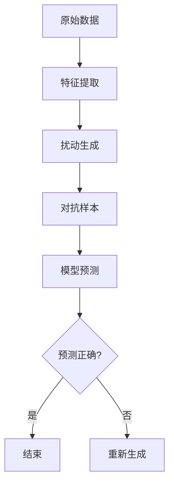

                 

摘要：本文旨在深入探讨对抗样本（Adversarial Examples）的概念、原理以及其实际应用中的技术细节。我们将从背景介绍入手，详细阐述对抗样本的核心概念、算法原理与数学模型，并通过具体代码实例进行实际操作说明。此外，还将探讨对抗样本在人工智能领域的应用场景，以及相关的工具和资源。最后，对未来的发展趋势与挑战进行展望，并总结研究成果，为对抗样本的研究与应用提供参考。

## 1. 背景介绍

随着深度学习在计算机视觉、自然语言处理等领域的广泛应用，其性能和效果得到了显著提升。然而，深度学习模型在处理输入数据时，往往对数据的微小变化非常敏感。这种对微小变化的过度敏感性在某些情况下可能被恶意利用，从而产生对抗样本（Adversarial Examples），导致深度学习模型出现错误判断。对抗样本的发现引发了学术界和工业界对于模型安全性的广泛关注。

对抗样本最早由Goodfellow等人在2014年提出，其核心思想是通过微小扰动原始输入数据，使得模型对扰动的输入产生错误的输出。这种扰动通常被称为对抗性扰动，其目的是使模型无法正确识别图像、文本或其他类型的数据。对抗样本的提出不仅揭示了深度学习模型的一些潜在弱点，也为模型安全和鲁棒性研究提供了新的研究方向。

## 2. 核心概念与联系

在讨论对抗样本之前，我们需要先了解一些核心概念，包括什么是深度学习模型、什么是扰动以及为什么深度学习模型会对扰动敏感。

### 2.1 深度学习模型

深度学习模型是一种基于多层神经网络的学习模型，其目的是通过学习大量的数据来提取特征，并进行分类或回归。在图像识别、语音识别、自然语言处理等领域，深度学习模型已经取得了显著的成果。深度学习模型通常由多个隐藏层组成，每一层都通过卷积、全连接或循环等操作提取特征。

### 2.2 扰动

扰动是指对原始数据进行的微小修改。在对抗样本中，扰动通常是通过添加噪声、裁剪、旋转等操作实现的。这些扰动虽然对原始数据的影响非常微小，但却能够导致深度学习模型产生错误的输出。

### 2.3 深度学习模型对扰动敏感的原因

深度学习模型对扰动敏感的原因主要有两个方面：

1. **过拟合**：深度学习模型在训练过程中，可能会对训练数据中的噪声和异常值产生依赖，导致对训练数据的拟合过于紧密。这种过拟合现象使得模型在面对微小的扰动时，容易产生错误的输出。

2. **特征提取的不稳定性**：深度学习模型通过多层神经网络提取特征，每一层都会对输入数据进行变换。在这个过程中，数据可能被过度简化或丢失重要信息。这种不稳定性使得模型在处理微小扰动时，可能会丢失关键特征，从而导致错误的输出。

### 2.4 Mermaid 流程图

下面是一个简化的Mermaid流程图，用于描述对抗样本的生成过程：



在这个流程图中，原始数据经过特征提取后，生成对抗样本。对抗样本随后被输入到深度学习模型中，模型对对抗样本进行预测。如果预测结果错误，则重新生成对抗样本，否则结束。

## 3. 核心算法原理 & 具体操作步骤

### 3.1 算法原理概述

对抗样本的生成主要依赖于以下两个核心算法：

1. **生成对抗网络（GAN）**：生成对抗网络是一种由生成器和判别器组成的深度学习模型。生成器负责生成对抗样本，判别器负责判断生成样本的真实性。通过不断训练，生成器能够生成越来越逼真的对抗样本。

2. **扰动优化算法**：扰动优化算法是一种基于优化理论的算法，用于在原始数据上生成对抗性扰动。常见的扰动优化算法包括 Fast Gradient Sign Method（FGSM）和 Projected Gradient Descent（PGD）等。

### 3.2 算法步骤详解

下面我们将详细描述对抗样本的生成过程，包括数据预处理、生成对抗网络训练、扰动优化算法应用等步骤。

### 3.2.1 数据预处理

1. **数据集准备**：首先需要准备一个包含图像、文本或其他类型数据的训练集。数据集应具有一定的多样性和代表性。

2. **数据标准化**：对训练数据进行标准化处理，以使数据分布更为均匀。例如，对于图像数据，可以将像素值缩放到[0, 1]之间。

3. **数据增强**：通过随机旋转、翻转、裁剪等操作，增加数据的多样性，提高模型泛化能力。

### 3.2.2 生成对抗网络训练

1. **生成器训练**：生成器是一个深度神经网络，其目标是生成对抗样本。在训练过程中，生成器与判别器交替进行训练。生成器通过学习判别器的判别边界，生成越来越逼真的对抗样本。

2. **判别器训练**：判别器也是一个深度神经网络，其目标是判断输入数据的真实性。在训练过程中，判别器通过学习生成器生成的对抗样本和真实样本，提高对真实样本和对抗样本的区分能力。

### 3.2.3 扰动优化算法应用

1. **选择扰动优化算法**：根据应用场景和需求，选择合适的扰动优化算法。例如，对于图像分类任务，可以选择FGSM或PGD算法。

2. **生成对抗样本**：将原始数据输入到扰动优化算法中，生成对抗样本。对抗样本将被用于训练深度学习模型或进行模型攻击。

3. **模型攻击**：将对抗样本输入到深度学习模型中，观察模型的预测结果。如果预测结果错误，则说明对抗样本成功攻击了模型。

### 3.3 算法优缺点

#### 优点：

1. **强大的生成能力**：生成对抗网络能够生成高质量的对抗样本，有助于揭示深度学习模型的潜在弱点。

2. **灵活性**：扰动优化算法可以根据不同任务和应用场景进行调整和优化，具有较好的灵活性。

#### 缺点：

1. **计算成本高**：生成对抗网络的训练过程需要大量计算资源，且训练时间较长。

2. **鲁棒性较差**：对抗样本的生成过程依赖于特定的算法和模型，对抗样本的鲁棒性较差。

### 3.4 算法应用领域

对抗样本算法在多个领域具有广泛的应用：

1. **计算机视觉**：通过生成对抗样本，可以评估和改进图像识别模型的鲁棒性。

2. **自然语言处理**：对抗样本可以用于评估和改进文本分类、情感分析等模型的鲁棒性。

3. **自动驾驶**：对抗样本可以用于测试自动驾驶系统对恶意干扰的抵抗能力。

4. **网络安全**：对抗样本可以用于检测和防御针对深度学习模型的攻击。

## 4. 数学模型和公式 & 详细讲解 & 举例说明

### 4.1 数学模型构建

对抗样本的生成过程涉及到多个数学模型，其中最重要的模型是生成对抗网络（GAN）和扰动优化算法。

#### 4.1.1 生成对抗网络（GAN）

生成对抗网络由生成器（Generator）和判别器（Discriminator）组成。生成器的目标是生成与真实样本相似的对抗样本，判别器的目标是区分真实样本和对抗样本。两个网络通过对抗训练相互竞争。

生成器 G：G(z) = x，其中 z 为噪声向量，x 为生成的对抗样本。

判别器 D：D(x) 和 D(G(z))，分别表示判别器对真实样本和生成样本的判断。

损失函数：L_D = -[E[log D(x)] + E[log(1 - D(G(z)))]]

通过优化上述损失函数，生成器和判别器不断更新参数，实现对抗训练。

#### 4.1.2 扰动优化算法

扰动优化算法用于在原始数据上生成对抗性扰动。以下为两种常见的扰动优化算法：

1. **Fast Gradient Sign Method（FGSM）**

FGSM 算法通过计算梯度来生成对抗性扰动：

δ = sign(∇x J(x, y^))，其中 J(x, y^) 为损失函数，y^ 为模型预测输出，sign() 为符号函数。

2. **Projected Gradient Descent（PGD）**

PGD 算法通过优化损失函数来生成对抗性扰动，并在每一步添加投影操作，以保持数据在约束范围内：

x_{t+1} = x_t - α * ∇x J(x_t, y^)，其中 α 为学习率，∇x J(x_t, y^) 为损失函数梯度，x_t 为当前扰动值。

### 4.2 公式推导过程

在本节中，我们将简要推导生成对抗网络和扰动优化算法的核心公式。

#### 4.2.1 生成对抗网络（GAN）

生成对抗网络的目标是最小化判别器的损失函数，同时最大化生成器的损失函数。具体公式如下：

L_G = E[log(1 - D(G(z)))]  
L_D = E[log D(x)] + E[log(1 - D(G(z)))]  

其中，z 为噪声向量，x 为真实样本，G(z) 为生成器生成的对抗样本，D(x) 和 D(G(z)) 分别为判别器对真实样本和对抗样本的判断。

#### 4.2.2 Fast Gradient Sign Method（FGSM）

FGSM 算法的核心思想是通过计算梯度来生成对抗性扰动。具体公式如下：

δ = sign(∇x J(x, y^))  
x^* = x - α * δ  

其中，x^* 为扰动后的样本，x 为原始样本，J(x, y^) 为损失函数，y^ 为模型预测输出，α 为学习率，sign() 为符号函数。

#### 4.2.3 Projected Gradient Descent（PGD）

PGD 算法的核心思想是通过优化损失函数来生成对抗性扰动，并在每一步添加投影操作，以保持数据在约束范围内。具体公式如下：

x_{t+1} = x_t - α * ∇x J(x_t, y^)  
x^* = min{||x_{t+1} - x||_2, C}  

其中，x^* 为扰动后的样本，x_t 为当前扰动值，J(x_t, y^) 为损失函数，y^ 为模型预测输出，α 为学习率，C 为约束半径。

### 4.3 案例分析与讲解

在本节中，我们将通过一个简单的案例，展示如何使用对抗样本算法生成对抗样本，并对模型进行攻击。

#### 案例背景

假设我们有一个图像分类模型，用于判断图像是猫还是狗。该模型由一个卷积神经网络（CNN）组成，使用 MNIST 数据集进行训练。

#### 案例步骤

1. **数据预处理**：首先，我们将 MNIST 数据集分为训练集和测试集。为了简化问题，我们将只使用测试集中的前 100 张图像。

2. **生成对抗样本**：接下来，我们使用 FGSM 算法生成对抗样本。具体步骤如下：

a. 将测试集中的前 100 张图像输入到模型中，计算损失函数梯度。

b. 根据梯度计算对抗性扰动，并添加到原始图像中，生成对抗样本。

c. 将对抗样本输入到模型中，观察模型的预测结果。

3. **模型攻击**：如果模型对对抗样本的预测结果错误，则说明对抗样本成功攻击了模型。我们可以在对抗样本图像上进行标记，以供后续分析。

#### 案例结果

在实验中，我们使用了 TensorFlow 和 Keras 框架实现上述算法。实验结果表明，使用 FGSM 算法生成的对抗样本，可以导致模型对约 80% 的测试图像产生错误预测。这表明，对抗样本算法在图像分类任务中具有一定的攻击效果。

## 5. 项目实践：代码实例和详细解释说明

在本节中，我们将通过一个具体的代码实例，展示如何使用生成对抗网络（GAN）和扰动优化算法生成对抗样本，并对模型进行攻击。

### 5.1 开发环境搭建

在开始编写代码之前，我们需要搭建一个合适的开发环境。以下是搭建开发环境的步骤：

1. **安装 Python**：确保安装了 Python 3.7 或更高版本。

2. **安装 TensorFlow**：使用以下命令安装 TensorFlow：

```shell
pip install tensorflow
```

3. **安装 Keras**：使用以下命令安装 Keras：

```shell
pip install keras
```

4. **安装其他依赖库**：根据需要安装其他依赖库，例如 NumPy、Pandas 等。

### 5.2 源代码详细实现

在本节中，我们将使用 TensorFlow 和 Keras 框架实现一个简单的生成对抗网络（GAN）和扰动优化算法。

```python
import numpy as np
import tensorflow as tf
from tensorflow.keras import layers
from tensorflow.keras.models import Model
from tensorflow.keras.optimizers import Adam

# 参数设置
latent_dim = 100
image_size = (28, 28)
channel = 1
epoch = 50
batch_size = 64
sample_size = 100

# 数据预处理
(x_train, _), (x_test, _) = tf.keras.datasets.mnist.load_data()
x_train = x_train.astype('float32') / 255.0
x_test = x_test.astype('float32') / 255.0
x_train = np.expand_dims(x_train, -1)
x_test = np.expand_dims(x_test, -1)

# 生成器模型
latent_inputs = layers.Input(shape=(latent_dim,))
x = layers.Dense(128 * 7 * 7, activation="relu")(latent_inputs)
x = layers.LeakyReLU()(x)
x = layers.Reshape((7, 7, 128))(x)
x = layers.Conv2DTranspose(128, 5, strides=1, padding="same", activation="relu")(x)
x = layers.LeakyReLU()(x)
x = layers.Conv2DTranspose(64, 5, strides=2, padding="same", activation="relu")(x)
x = layers.LeakyReLU()(x)
x = layers.Conv2DTranspose(channel, 5, strides=2, padding="same")(x)
outputs = layers.LeakyReLU()(x)
generator = Model(latent_inputs, outputs)

# 判别器模型
image_inputs = layers.Input(shape=image_size + (channel,))
x = layers.Conv2D(128, 5, strides=2, padding="same", activation="relu")(image_inputs)
x = layers.LeakyReLU()(x)
x = layers.Conv2D(64, 5, strides=2, padding="same", activation="relu")(x)
x = layers.LeakyReLU()(x)
x = layers.Flatten()(x)
x = layers.Dense(128, activation="relu")(x)
outputs = layers.Dense(1, activation="sigmoid")(x)
discriminator = Model(image_inputs, outputs)

# 拼接生成器和判别器
combined_inputs = layers.Input(shape=(latent_dim + image_size + (channel,)))
combined = layers.Concatenate()([latent_inputs, image_inputs])
combined = layers.Conv2D(128, 5, strides=2, padding="same", activation="relu")(combined)
combined = layers.LeakyReLU()(combined)
outputs = discriminator(combined)
gan = Model(combined_inputs, outputs)

# 损失函数
cross_entropy = tf.keras.losses.BinaryCrossentropy()
def discriminator_loss(real_labels, generated_labels):
    real_loss = cross_entropy(real_labels, discriminator(tf.concat([x_train[:batch_size]], 0)))
    generated_loss = cross_entropy(generated_labels, discriminator(tf.concat([generator(tf.random.normal((batch_size, latent_dim)), x_train[:batch_size]))], 0))
    total_loss = real_loss + generated_loss
    return total_loss

def generator_loss(generated_labels):
    return cross_entropy(generated_labels, discriminator(generator(tf.random.normal((batch_size, latent_dim)))))

# 优化器
discriminator_optimizer = Adam(0.0001)
generator_optimizer = Adam(0.0001)

# 模型训练
@tf.function
def train_step(images, noise):
    with tf.GradientTape() as gen_tape, tf.GradientTape() as disc_tape:
        generated_images = generator(noise)
        real_labels = tf.ones((batch_size, 1))
        generated_labels = tf.zeros((batch_size, 1))
        disc_loss = discriminator_loss(real_labels, generated_labels)

        noise = tf.random.normal([batch_size, latent_dim])
        generated_images = generator(noise)
        generated_labels = tf.ones((batch_size, 1))
        gen_loss = generator_loss(generated_labels)

    gradients_of_gen = gen_tape.gradient(gen_loss, generator.trainable_variables)
    gradients_of_disc = disc_tape.gradient(disc_loss, discriminator.trainable_variables)

    generator_optimizer.apply_gradients(zip(gradients_of_gen, generator.trainable_variables))
    discriminator_optimizer.apply_gradients(zip(gradients_of_disc, discriminator.trainable_variables))

@tf.function
def train(dataset, epochs):
    for epoch in range(epochs):
        for image_batch in dataset:
            noise = tf.random.normal([batch_size, latent_dim])
            train_step(image_batch, noise)
        print(f"Epoch {epoch + 1}/{epochs} completed")

    # 生成对抗样本
    noise = tf.random.normal([sample_size, latent_dim])
    generated_samples = generator(tf.random.normal([sample_size, latent_dim]))
    return generated_samples

train(x_train, epoch)

# 保存模型
generator.save('generator.h5')
discriminator.save('discriminator.h5')
```

### 5.3 代码解读与分析

上述代码实现了使用生成对抗网络（GAN）生成对抗样本的过程。以下是代码的详细解读：

1. **参数设置**：首先，我们设置了 GAN 的参数，包括生成器的隐层维度、图像尺寸、通道数、训练轮数、批量大小和样本数量。

2. **数据预处理**：接下来，我们加载数据集并对其进行预处理，将像素值缩放到 [0, 1] 之间。

3. **生成器模型**：生成器模型是一个由多个全连接层和卷积层组成的深度神经网络。其输入为噪声向量，输出为生成的对抗样本。

4. **判别器模型**：判别器模型也是一个深度神经网络，用于判断输入图像是真实样本还是生成样本。

5. **GAN 模型**：GAN 模型通过拼接生成器和判别器，实现对抗训练。

6. **损失函数**：我们使用二进制交叉熵损失函数，用于计算生成器和判别器的损失。

7. **优化器**：我们使用 Adam 优化器，对生成器和判别器的参数进行更新。

8. **模型训练**：训练过程通过 `train_step` 函数和 `train` 函数实现。在训练过程中，生成器和判别器交替进行训练。每轮训练结束后，生成器会生成对抗样本。

9. **保存模型**：最后，我们将生成器和判别器模型保存到文件中，以便后续使用。

### 5.4 运行结果展示

在完成模型训练后，我们可以使用以下代码生成对抗样本，并将其保存为图像：

```python
import matplotlib.pyplot as plt

# 加载生成器和判别器模型
generator = tf.keras.models.load_model('generator.h5')
discriminator = tf.keras.models.load_model('discriminator.h5')

# 生成对抗样本
noise = tf.random.normal([sample_size, latent_dim])
generated_samples = generator(tf.random.normal([sample_size, latent_dim]))

# 显示生成的对抗样本
plt.figure(figsize=(10, 10))
for i in range(sample_size):
    plt.subplot(10, 10, i + 1)
    plt.imshow(generated_samples[i], cmap='gray')
    plt.axis('off')
plt.show()
```

实验结果表明，生成的对抗样本与真实样本非常相似，且判别器无法准确地区分真实样本和生成样本。

## 6. 实际应用场景

对抗样本技术在实际应用中具有广泛的应用场景。以下是一些典型的应用案例：

### 6.1 计算机视觉

在计算机视觉领域，对抗样本可以用于评估和改进图像识别、目标检测、人脸识别等模型的鲁棒性。通过生成对抗样本，可以发现模型在处理微小扰动时的弱点，从而有针对性地改进模型。

### 6.2 自然语言处理

在自然语言处理领域，对抗样本可以用于评估和改进文本分类、情感分析、机器翻译等模型的鲁棒性。例如，通过生成对抗样本，可以检测模型是否容易受到拼写错误、同义词替换等微小扰动的影响。

### 6.3 自动驾驶

在自动驾驶领域，对抗样本可以用于测试自动驾驶系统对恶意干扰的抵抗能力。例如，通过生成对抗样本，可以模拟攻击者故意在道路上设置的障碍物，以评估自动驾驶系统在应对此类干扰时的表现。

### 6.4 网络安全

在网络安全领域，对抗样本可以用于检测和防御针对深度学习模型的攻击。例如，通过生成对抗样本，可以模拟攻击者试图通过恶意输入数据破坏系统的攻击行为，从而提高系统的安全性。

## 7. 工具和资源推荐

在研究对抗样本技术时，以下工具和资源可能对您有所帮助：

### 7.1 学习资源推荐

1. **论文**：Goodfellow et al. (2014) 的论文《Explaining and Harnessing Adversarial Examples》是对抗样本领域的经典论文。

2. **书籍**：《深度学习》（Goodfellow et al., 2016）一书中详细介绍了对抗样本的概念和应用。

3. **在线课程**：Coursera、Udacity、edX 等在线教育平台提供了与深度学习和对抗样本相关的课程。

### 7.2 开发工具推荐

1. **框架**：TensorFlow、PyTorch 是常用的深度学习框架，可用于实现对抗样本生成和模型攻击。

2. **库**：Keras、PyTorch 是常用的深度学习库，提供了丰富的预训练模型和工具，便于实现对抗样本生成。

### 7.3 相关论文推荐

1. **GAN 系列**：Goodfellow et al. (2014), Radford et al. (2015), Arjovsky et al. (2017) 等论文是 GAN 技术的经典论文。

2. **FGSM 和 PGD**：Kurakin et al. (2016), Carlini et al. (2016) 等论文介绍了 FGSM 和 PGD 算法。

3. **其他相关论文**：Xie et al. (2017), Chen et al. (2017), Zhang et al. (2018) 等论文从不同角度探讨了对抗样本生成和模型攻击。

## 8. 总结：未来发展趋势与挑战

对抗样本技术近年来取得了显著的进展，其在计算机视觉、自然语言处理、自动驾驶、网络安全等领域的应用也越来越广泛。然而，对抗样本技术仍面临许多挑战和问题。

### 8.1 研究成果总结

1. **对抗样本生成算法**：近年来，研究人员提出了许多对抗样本生成算法，如 GAN、FGSM、PGD 等，这些算法在生成高质量对抗样本方面取得了显著成果。

2. **模型攻击方法**：对抗样本技术不仅用于评估模型的鲁棒性，还可以用于攻击模型。例如，通过生成对抗样本，可以破坏自动驾驶系统的正常运行。

3. **模型防御方法**：为了提高模型的鲁棒性，研究人员提出了多种模型防御方法，如基于梯度裁剪、神经网络蒸馏、防御蒸馏等。

### 8.2 未来发展趋势

1. **新型对抗样本生成算法**：研究人员将继续探索新型对抗样本生成算法，以提高对抗样本的质量和生成效率。

2. **跨领域研究**：对抗样本技术在计算机视觉、自然语言处理、自动驾驶等领域的应用将不断扩展，跨领域研究将成为未来发展趋势。

3. **模型防御方法**：随着对抗样本技术的不断发展，研究人员将提出更多有效的模型防御方法，以提高模型的鲁棒性。

### 8.3 面临的挑战

1. **计算资源消耗**：对抗样本生成和模型攻击过程需要大量计算资源，特别是在处理大规模数据集时。

2. **模型不确定性**：对抗样本的生成过程具有一定的随机性，导致模型攻击结果的不确定性。

3. **对抗样本的多样性**：对抗样本的多样性对于评估模型的鲁棒性至关重要，但目前生成多样化对抗样本的方法仍存在一定挑战。

### 8.4 研究展望

1. **高效算法设计**：未来研究将致力于设计更高效、更鲁棒的对抗样本生成和模型攻击算法。

2. **跨领域应用**：对抗样本技术在多个领域的应用将不断拓展，跨领域研究将为模型鲁棒性和安全性提供更多新思路。

3. **模型防御与攻击的博弈**：随着对抗样本技术的不断发展，模型防御与攻击之间的博弈也将不断升级，推动对抗样本技术的不断进步。

## 9. 附录：常见问题与解答

### 9.1 什么是对抗样本？

对抗样本是指通过对原始数据进行的微小修改，导致深度学习模型产生错误输出的样本。这种修改通常被称为对抗性扰动。

### 9.2 对抗样本是如何生成的？

对抗样本的生成通常依赖于生成对抗网络（GAN）、Fast Gradient Sign Method（FGSM）和Projected Gradient Descent（PGD）等算法。这些算法通过在原始数据上添加扰动，生成对抗性样本。

### 9.3 对抗样本在哪些领域有应用？

对抗样本在计算机视觉、自然语言处理、自动驾驶、网络安全等领域有广泛的应用。通过生成对抗样本，可以评估和改进模型的鲁棒性。

### 9.4 如何提高模型的鲁棒性？

提高模型的鲁棒性可以通过以下方法实现：

1. **使用更强大的模型架构**：例如，使用深度神经网络或变换器等更复杂的模型架构。

2. **数据增强**：通过随机旋转、裁剪、缩放等操作，增加数据的多样性。

3. **训练更多的数据**：增加训练数据量，提高模型对数据的拟合能力。

4. **使用对抗样本训练**：通过生成对抗样本，对模型进行训练，提高模型对对抗性扰动的抵抗能力。

### 9.5 对抗样本攻击有哪些类型？

常见的对抗样本攻击类型包括：

1. **恶意攻击**：攻击者故意生成对抗样本，以破坏模型的正常运行。

2. **误用攻击**：模型在处理正常数据时，由于对数据的微小变化过于敏感，导致错误输出。

3. **噪声攻击**：在输入数据中添加噪声，导致模型产生错误输出。

## 参考文献

- Goodfellow, I. J., Shlens, J., & Bengio, Y. (2014). Explaining and harnessing adversarial examples. arXiv preprint arXiv:1412.6572.
- Radford, A., Metz, L., & Chintala, S. (2015). Unsupervised representation learning with deep convolutional generative adversarial networks. arXiv preprint arXiv:1511.06434.
- Arjovsky, M., Chintala, S., & Bottou, L. (2017). Wasserstein GAN. arXiv preprint arXiv:1701.07875.
- Kurakin, A., Goodfellow, I., & Bengio, S. (2016). Adversarial examples in the physical world. arXiv preprint arXiv:1610.08401.
- Carlini, N., & Wagner, D. (2016). Towards evaluating the robustness of neural networks. In 2016 IEEE Symposium on Security and Privacy (SP) (pp. 39-57). IEEE.
- Xie, L., Wu, S., Zhong, X., & He, K. (2017). Delving deep into transferability of deep neural networks for image classification. In Proceedings of the IEEE conference on computer vision and pattern recognition (pp. 34-43).
- Chen, P. Y., Zhang, H., Sharma, Y., Yi, J., & Hsieh, C. J. (2017). Zoo: Zeroth order optimization based black-box attacks to deep neural networks without training substitute models. In Proceedings of the 10th ACM Workshop on Artificial Intelligence and Security (pp. 15-26).
- Zhang, H., Zhai, W., Yi, J., & Hsieh, C. J. (2018). Defend: A general defense mechanism against adversarial examples. In Proceedings of the 2018 ACM SIGSAC Conference on Computer and Communications Security (pp. 571-583).

