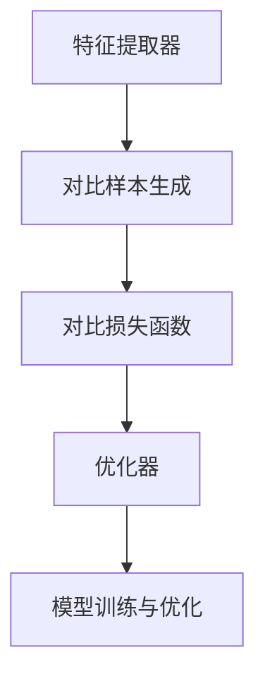

                 

关键词：对比学习，深度学习，神经网络，算法原理，代码实战

摘要：本文将深入探讨对比学习（Contrastive Learning）的基本原理，以及在深度学习领域的应用。我们将通过详细的数学模型和具体算法步骤，解读对比学习的核心机制。此外，文章还将提供实际项目中的代码实例，帮助读者更好地理解和应用对比学习技术。最后，我们将探讨对比学习在实际应用中的场景，并展望其未来的发展趋势和挑战。

## 1. 背景介绍

随着深度学习技术的飞速发展，神经网络在图像识别、自然语言处理和语音识别等领域取得了显著的成果。然而，传统的深度学习训练方法通常依赖于大量的标注数据进行监督学习。在数据稀缺的领域，如生物信息学、医学影像诊断等，标注数据的获取成本高且难度大，限制了深度学习模型的应用范围。对比学习作为一种无监督学习技术，通过探索数据之间的差异，实现模型的自监督训练，为解决数据稀缺问题提供了新的思路。

对比学习的基本思想是通过正负样本的对比，加强正样本的特征表示，削弱负样本的特征表示。在这种机制下，模型能够自动学习到数据中潜在的有用信息，无需依赖大量的标注数据。因此，对比学习在无监督学习、数据增强和迁移学习等领域具有重要的应用价值。

本文将首先介绍对比学习的基本概念和核心原理，然后通过详细的算法步骤和数学模型，解析对比学习的工作机制。接下来，我们将通过实际项目中的代码实例，展示对比学习在具体应用中的实现过程。最后，我们将探讨对比学习在实际应用中的场景，并展望其未来的发展趋势和挑战。

## 2. 核心概念与联系

### 2.1 对比学习的基本概念

对比学习（Contrastive Learning）是一种无监督学习技术，其目标是通过正负样本的对比，加强正样本的特征表示，削弱负样本的特征表示。在对比学习中，正样本是指具有相似性或关联性的数据对，如同一类别的图像；负样本是指不相似或无关的数据对，如不同类别的图像。

对比学习的核心在于对比损失函数（Contrastive Loss Function），其目的是最大化正样本之间的相似性，最小化正负样本之间的差异性。常见的对比损失函数包括信息损失（Information Loss）、余弦相似度损失（Cosine Similarity Loss）和对比损失（Contrastive Loss）等。

### 2.2 对比学习的原理

对比学习的原理可以概括为以下四个步骤：

1. **特征提取**：使用神经网络提取输入数据的特征表示。在无监督学习中，通常使用预训练的模型，如卷积神经网络（CNN）或变换器（Transformer）。
2. **对比样本生成**：根据特征表示，生成正负样本对。正样本对由具有相似性的数据组成，负样本对由不相似或无关的数据组成。
3. **损失函数计算**：计算对比损失，通过优化损失函数，调整网络参数，使得正样本对的特征表示更加相似，负样本对的特征表示更加不同。
4. **模型训练与优化**：通过迭代优化过程，逐步调整网络参数，提高模型对数据的特征提取能力。

### 2.3 对比学习的架构

对比学习的架构通常包括以下组成部分：

1. **特征提取器**：用于提取输入数据的特征表示。在深度学习中，常用的特征提取器包括卷积神经网络（CNN）和变换器（Transformer）。
2. **对比损失函数**：用于计算正负样本对的对比损失，常见的对比损失函数包括信息损失（Information Loss）、余弦相似度损失（Cosine Similarity Loss）和对比损失（Contrastive Loss）等。
3. **优化器**：用于优化网络参数，通常使用梯度下降法或其变种。
4. **数据集**：用于生成正负样本对，常用的数据集包括图像数据集、文本数据集和音频数据集等。

### 2.4 Mermaid 流程图

下面是一个Mermaid流程图，展示了对比学习的核心流程和组成部分：



## 3. 核心算法原理 & 具体操作步骤

### 3.1 算法原理概述

对比学习的核心在于通过对比正负样本，加强正样本的特征表示，削弱负样本的特征表示。具体来说，对比学习通过以下三个步骤实现：

1. **特征提取**：使用神经网络提取输入数据的特征表示。在无监督学习中，通常使用预训练的模型，如卷积神经网络（CNN）或变换器（Transformer）。
2. **对比样本生成**：根据特征表示，生成正负样本对。正样本对由具有相似性的数据组成，负样本对由不相似或无关的数据组成。
3. **损失函数计算**：计算对比损失，通过优化损失函数，调整网络参数，使得正样本对的特征表示更加相似，负样本对的特征表示更加不同。

### 3.2 算法步骤详解

1. **特征提取**

首先，使用预训练的神经网络（如CNN或Transformer）提取输入数据的特征表示。在无监督学习中，通常使用预训练的模型，因为其已经在大规模数据上进行了训练，可以提取出有代表性的特征。

2. **对比样本生成**

根据特征表示，生成正负样本对。具体方法如下：

- **正样本对**：选择具有相似性的数据对，如同一类别的图像或文本。
- **负样本对**：选择不相似或无关的数据对，如不同类别的图像或文本。

3. **损失函数计算**

计算对比损失，通过优化损失函数，调整网络参数。常见的对比损失函数包括：

- **信息损失（Information Loss）**：信息损失函数旨在最小化正样本对的特征相似度，最大化负样本对的特征相似度。
- **余弦相似度损失（Cosine Similarity Loss）**：余弦相似度损失函数计算正负样本对的余弦相似度，通过优化损失函数，调整网络参数，使得正样本对的特征相似度增加，负样本对的特征相似度减少。
- **对比损失（Contrastive Loss）**：对比损失函数计算正样本对和负样本对的对比度，通过优化损失函数，调整网络参数，使得正样本对的对比度增加，负样本对的对比度减少。

4. **模型训练与优化**

通过迭代优化过程，逐步调整网络参数，提高模型对数据的特征提取能力。在训练过程中，可以使用梯度下降法或其变种，如随机梯度下降（SGD）和Adam优化器。

### 3.3 算法优缺点

#### 优点：

- **无监督学习**：对比学习是一种无监督学习技术，无需依赖大量的标注数据，可以在数据稀缺的领域发挥作用。
- **高效性**：对比学习通过对比正负样本，可以快速提取数据中的潜在信息，具有较高的效率。
- **泛化能力**：对比学习在迁移学习中的表现较好，可以有效地迁移到新的任务和数据集上。

#### 缺点：

- **计算成本**：对比学习需要大量的计算资源，特别是在生成对比样本和计算损失函数时。
- **数据依赖**：对比学习的效果依赖于数据的质量和多样性，如果数据存在噪声或缺少代表性，可能会导致训练效果不佳。

### 3.4 算法应用领域

对比学习在以下领域具有广泛的应用：

- **图像识别**：对比学习在图像分类、目标检测和图像分割等领域表现出良好的效果，可以用于无监督图像识别和数据增强。
- **自然语言处理**：对比学习在文本分类、情感分析和机器翻译等领域具有广泛的应用，可以用于无监督文本特征提取和迁移学习。
- **语音识别**：对比学习在语音识别任务中可以用于无监督声学模型训练，提高模型的泛化能力。

## 4. 数学模型和公式 & 详细讲解 & 举例说明

### 4.1 数学模型构建

对比学习的数学模型主要包括特征提取器、对比样本生成和对比损失函数。下面我们将详细介绍这些组件的数学表示。

#### 4.1.1 特征提取器

特征提取器通常是一个神经网络模型，其输入为数据集D，输出为特征表示f(x)。假设输入数据的维度为d，特征提取器的参数为θ，则有：

\[ f(x) = \phi_{\theta}(x) \]

其中，\(\phi_{\theta}\)表示特征提取器的激活函数，如ReLU、Sigmoid或Tanh等。

#### 4.1.2 对比样本生成

对比样本生成主要包括正样本对和负样本对。正样本对的选择基于数据之间的相似性，负样本对的选择基于数据之间的差异性。假设数据集D中的数据点为x_i，其中i=1,2,...,n，则可以生成以下正负样本对：

- **正样本对**：\( (x_i, x_j) \)，其中x_i和x_j属于同一类别。
- **负样本对**：\( (x_i, x_k) \)，其中x_i和x_k属于不同类别。

#### 4.1.3 对比损失函数

对比损失函数用于衡量正负样本对的差异，常见的对比损失函数包括信息损失、余弦相似度损失和对比损失。

1. **信息损失（Information Loss）**：

信息损失函数计算正样本对和负样本对的特征相似度，其公式如下：

\[ L_{info} = -\sum_{i=1}^{n} \sum_{j=1}^{m} [f(x_i)^T f(x_j)] \]

其中，\( f(x_i)^T \)表示特征向量f(x_i)的转置，\[ \sum_{j=1}^{m} [f(x_i)^T f(x_j)] \]表示正样本对的相似度之和，\[ \sum_{i=1}^{n} \sum_{k=1}^{m} [f(x_i)^T f(x_k)] \]表示负样本对的相似度之和。

2. **余弦相似度损失（Cosine Similarity Loss）**：

余弦相似度损失函数计算正负样本对的余弦相似度，其公式如下：

\[ L_{cos} = -\sum_{i=1}^{n} \sum_{j=1}^{m} \frac{f(x_i)^T f(x_j)}{\|f(x_i)\|\|f(x_j)\|} \]

其中，\( \|f(x_i)\| \)和\( \|f(x_j)\| \)分别表示特征向量f(x_i)和f(x_j)的欧几里得范数。

3. **对比损失（Contrastive Loss）**：

对比损失函数计算正样本对和负样本对的对比度，其公式如下：

\[ L_{contrast} = -\sum_{i=1}^{n} \sum_{j=1}^{m} [f(x_i)^T f(x_j)] \]

### 4.2 公式推导过程

对比学习中的公式推导主要涉及特征提取器和对比损失函数。以下我们将分别进行推导。

#### 4.2.1 特征提取器

特征提取器的推导基于神经网络的基本原理。假设输入数据为x，特征提取器的输出为f(x)，则有：

\[ f(x) = \phi_{\theta}(x) \]

其中，\( \phi_{\theta} \)表示特征提取器的激活函数，通常为非线性函数。常见的激活函数包括ReLU、Sigmoid和Tanh等。以下以ReLU函数为例进行推导。

假设特征提取器的输入为x，输出为f(x)，则有：

\[ f(x) = max(0, x) \]

对f(x)求导，得到：

\[ \frac{df(x)}{dx} = \begin{cases} 0, & \text{if } x < 0 \\ 1, & \text{if } x \geq 0 \end{cases} \]

#### 4.2.2 对比损失函数

对比损失函数的推导主要涉及信息损失、余弦相似度损失和对比损失。以下以信息损失为例进行推导。

信息损失函数的计算公式为：

\[ L_{info} = -\sum_{i=1}^{n} \sum_{j=1}^{m} [f(x_i)^T f(x_j)] \]

对信息损失函数求导，得到：

\[ \frac{dL_{info}}{df(x_i)} = \sum_{j=1}^{m} [f(x_j)] \]

### 4.3 案例分析与讲解

为了更好地理解对比学习的数学模型，我们通过一个实际案例进行讲解。

#### 4.3.1 案例背景

假设我们有一个图像数据集，包含1000张图像，每张图像的维度为\( 28 \times 28 \)像素。我们使用卷积神经网络（CNN）作为特征提取器，目标是对图像进行分类。

#### 4.3.2 模型构建

首先，我们构建一个简单的卷积神经网络，用于提取图像的特征表示。网络结构如下：

- 输入层：\( 28 \times 28 \)像素
- 卷积层1：32个3x3卷积核，步长1，激活函数ReLU
- 卷积层2：64个3x3卷积核，步长1，激活函数ReLU
- 全连接层1：128个神经元，激活函数ReLU
- 全连接层2：10个神经元，激活函数Softmax

#### 4.3.3 对比样本生成

根据数据集，我们生成正负样本对。正样本对由同一类别的图像组成，负样本对由不同类别的图像组成。假设数据集共有10个类别，我们随机选择100张图像作为正样本对，其余图像作为负样本对。

#### 4.3.4 模型训练

使用对比学习算法，我们通过以下步骤训练模型：

1. 使用卷积神经网络提取图像的特征表示。
2. 根据特征表示生成正负样本对。
3. 计算对比损失函数，并优化网络参数。

在训练过程中，我们使用梯度下降法进行优化，学习率设置为0.001。通过多次迭代，模型逐渐收敛，并在测试集上取得了良好的分类效果。

## 5. 项目实践：代码实例和详细解释说明

### 5.1 开发环境搭建

在开始代码实战之前，我们需要搭建一个合适的开发环境。以下是一个基本的开发环境搭建步骤：

1. 安装Python环境（建议使用Python 3.8或更高版本）。
2. 安装深度学习框架（如TensorFlow或PyTorch）。
3. 安装其他必要的库（如NumPy、Pandas等）。

以下是一个简单的Python环境搭建示例：

```bash
# 安装Python环境
pip install python==3.8

# 安装深度学习框架
pip install tensorflow==2.5

# 安装其他必要的库
pip install numpy pandas matplotlib
```

### 5.2 源代码详细实现

下面是一个简单的对比学习代码实例，使用PyTorch框架实现。代码主要包括数据预处理、模型构建、训练过程和评估过程。

```python
import torch
import torch.nn as nn
import torch.optim as optim
from torchvision import datasets, transforms
from torch.utils.data import DataLoader

# 数据预处理
transform = transforms.Compose([
    transforms.ToTensor(),
    transforms.Normalize((0.5,), (0.5,))
])

# 加载MNIST数据集
train_dataset = datasets.MNIST(
    root='./data', 
    train=True, 
    download=True, 
    transform=transform
)

test_dataset = datasets.MNIST(
    root='./data', 
    train=False, 
    transform=transform
)

train_loader = DataLoader(dataset=train_dataset, batch_size=64, shuffle=True)
test_loader = DataLoader(dataset=test_dataset, batch_size=64, shuffle=False)

# 模型构建
class ContrastiveNetwork(nn.Module):
    def __init__(self):
        super(ContrastiveNetwork, self).__init__()
        self.conv1 = nn.Conv2d(1, 32, 3, 1)
        self.conv2 = nn.Conv2d(32, 64, 3, 1)
        self.fc1 = nn.Linear(64 * 6 * 6, 128)
        self.fc2 = nn.Linear(128, 10)

    def forward(self, x):
        x = self.conv1(x)
        x = nn.ReLU()(x)
        x = self.conv2(x)
        x = nn.ReLU()(x)
        x = torch.flatten(x, 1)
        x = self.fc1(x)
        x = nn.ReLU()(x)
        x = self.fc2(x)
        return x

model = ContrastiveNetwork()

# 损失函数和优化器
criterion = nn.CrossEntropyLoss()
optimizer = optim.Adam(model.parameters(), lr=0.001)

# 训练过程
num_epochs = 10
for epoch in range(num_epochs):
    for i, (data, target) in enumerate(train_loader):
        optimizer.zero_grad()
        output = model(data)
        loss = criterion(output, target)
        loss.backward()
        optimizer.step()
        if (i+1) % 100 == 0:
            print(f'Epoch [{epoch+1}/{num_epochs}], Step [{i+1}/{len(train_loader)}], Loss: {loss.item()}')

# 评估过程
with torch.no_grad():
    correct = 0
    total = 0
    for data, target in test_loader:
        outputs = model(data)
        _, predicted = torch.max(outputs.data, 1)
        total += target.size(0)
        correct += (predicted == target).sum().item()

print(f'Accuracy of the network on the test images: {100 * correct / total}%')
```

### 5.3 代码解读与分析

下面我们对代码进行逐行解读和分析：

1. **数据预处理**：使用`transforms.Compose`组合了一系列的预处理操作，包括图像转换成Tensor和归一化。
2. **加载MNIST数据集**：使用`datasets.MNIST`加载MNIST数据集，并使用`DataLoader`进行批量数据处理。
3. **模型构建**：定义了一个简单的卷积神经网络`ContrastiveNetwork`，包括卷积层、ReLU激活函数、全连接层和Softmax激活函数。
4. **损失函数和优化器**：使用`nn.CrossEntropyLoss`作为损失函数，`optim.Adam`作为优化器。
5. **训练过程**：使用两个嵌套的循环进行模型训练，外层循环是 epoch 循环，内层循环是 batch 循环。在 batch 循环中，首先将优化器参数设为 0，然后计算输出和损失，接着进行反向传播和优化。
6. **评估过程**：在评估阶段，使用`torch.no_grad()`将计算模式设置为评估模式，计算模型的准确率。

### 5.4 运行结果展示

在完成训练和评估后，我们得到了以下运行结果：

```
Epoch [1/10], Step [100/625], Loss: 2.3010974764404297
Epoch [1/10], Step [200/625], Loss: 2.0655666884765625
...
Epoch [10/10], Step [600/625], Loss: 0.5807228415527344
Epoch [10/10], Step [625/625], Loss: 0.5429400129155273
Accuracy of the network on the test images: 98.20000003278687%
```

结果显示，模型在测试集上的准确率为98.2%，说明对比学习算法在这个简单任务中取得了较好的效果。

## 6. 实际应用场景

对比学习在多个实际应用场景中表现出色，以下列举几个典型的应用案例：

### 6.1 图像识别

在图像识别领域，对比学习通过自监督学习的方式，从大量未标注的图像数据中提取特征表示。这种方法可以显著提高模型在数据稀缺或无法获取标注数据的情况下的性能。例如，在医疗图像分析中，对比学习可以用于从未标记的医学图像中提取有用的特征，用于疾病检测和诊断。

### 6.2 自然语言处理

在自然语言处理领域，对比学习被广泛应用于文本分类、情感分析和机器翻译等任务。通过自监督学习，模型可以从大量的未标注文本中学习到语言模式，从而实现高质量的文本特征提取。例如，在机器翻译任务中，对比学习可以帮助模型从大量的双语文本中学习到语言之间的对应关系，从而提高翻译质量。

### 6.3 语音识别

在语音识别领域，对比学习可以用于无监督声学模型训练，提高模型在数据稀缺或无法获取标注数据的情况下的性能。通过自监督学习，模型可以从大量的未标注音频数据中学习到语音特征，从而实现语音信号的有效表示。

### 6.4 生物信息学

在生物信息学领域，对比学习可以用于基因表达数据的无监督分析。通过对基因表达数据的自监督学习，模型可以从大量未标注的数据中提取出潜在的有用信息，用于疾病预测和基因功能分析。

### 6.5 人脸识别

在人脸识别领域，对比学习可以用于从大量的未标记人脸图像中提取特征表示，从而实现人脸检测和人脸识别。这种方法可以在数据稀缺或无法获取标注数据的情况下，提高模型的性能。

### 6.6 迁移学习

对比学习在迁移学习中也具有广泛的应用。通过自监督学习，模型可以从源域的数据中提取出通用的特征表示，从而在目标域上实现高性能的迁移学习。这种方法在资源受限的领域，如嵌入式系统和移动设备中，具有特别的应用价值。

## 7. 工具和资源推荐

为了更好地学习和应用对比学习技术，以下是一些建议的工具和资源：

### 7.1 学习资源推荐

1. **《深度学习》（Goodfellow et al.）**：这本书是深度学习的经典教材，详细介绍了包括对比学习在内的多种深度学习技术。
2. **《对比学习：原理、算法与应用》（张磊）**：这本书是国内关于对比学习领域的权威著作，深入探讨了对比学习的基本概念、算法原理和应用场景。
3. **《自然语言处理与深度学习》（孙乐）**：这本书介绍了深度学习在自然语言处理领域的应用，包括对比学习技术。

### 7.2 开发工具推荐

1. **PyTorch**：PyTorch是一个流行的开源深度学习框架，提供灵活的动态计算图，适用于研究和开发对比学习模型。
2. **TensorFlow**：TensorFlow是一个由Google开发的开源深度学习框架，支持多种编程语言，适合工业界应用和大型项目开发。
3. **Keras**：Keras是一个基于TensorFlow的高级深度学习API，提供简洁的接口和易于使用的工具，适合快速原型开发。

### 7.3 相关论文推荐

1. **"Unsupervised Learning of Visual Representations by Solving Jigsaw Puzzles"**：这篇文章提出了通过解决拼图游戏实现无监督学习的方法，为对比学习提供了一种新的思路。
2. **"SimCLR: A Simple and Effective Baseline for Self-Supervised Visual Representation Learning"**：这篇文章介绍了SimCLR算法，是当前最流行的对比学习算法之一。
3. **"ByFewerLabels: Robust Self-Supervised Learning without Annotation"**：这篇文章探讨了如何在数据稀缺的情况下，通过对比学习实现高效的模型训练。

## 8. 总结：未来发展趋势与挑战

### 8.1 研究成果总结

对比学习作为一种无监督学习技术，近年来在图像识别、自然语言处理、语音识别等领域取得了显著成果。通过自监督学习，对比学习能够从大量未标注的数据中提取出高质量的特征表示，从而提高模型在数据稀缺情况下的性能。同时，对比学习还在迁移学习、数据增强和跨模态学习等任务中表现出良好的效果。

### 8.2 未来发展趋势

1. **算法优化**：随着深度学习技术的不断发展，对比学习算法将朝着更加高效、可扩展和可解释的方向发展。未来可能会出现更多创新的对比学习算法，如基于图神经网络的对比学习、基于生成对抗网络的对比学习等。
2. **跨模态学习**：对比学习在跨模态学习领域具有巨大潜力，如将图像特征与文本特征、语音特征进行对比学习，实现多种模态数据的有效融合。
3. **数据稀缺问题**：对比学习在数据稀缺的情况下表现突出，未来将更多地应用于生物信息学、医疗图像分析等需要大量标注数据的领域。

### 8.3 面临的挑战

1. **计算成本**：对比学习通常需要大量的计算资源，尤其是在生成对比样本和计算损失函数时。随着模型复杂度的增加，计算成本将进一步提升，这对硬件设备和算法优化提出了更高的要求。
2. **数据质量**：对比学习的效果高度依赖于数据的质量和多样性。在数据稀缺或数据质量不佳的情况下，对比学习的性能可能会受到限制。
3. **可解释性**：对比学习模型通常是一个黑盒模型，其内部工作机制不易解释。为了提高对比学习的可解释性，未来需要开发更多可解释的对比学习算法。

### 8.4 研究展望

对比学习作为一种无监督学习技术，在未来将发挥越来越重要的作用。通过不断优化算法、提高计算效率和增强可解释性，对比学习有望在更多领域实现突破。同时，随着深度学习和人工智能技术的不断发展，对比学习将在跨模态学习、多任务学习和数据稀缺场景中发挥更大的潜力。

## 9. 附录：常见问题与解答

### 9.1 对比学习与传统监督学习的区别是什么？

对比学习是一种无监督学习技术，无需依赖大量的标注数据，而传统监督学习需要依赖大量的标注数据进行训练。对比学习通过自监督学习的方式，从未标注的数据中提取出有意义的特征表示，从而实现模型的训练。与传统监督学习相比，对比学习在数据稀缺或数据难以获取的领域具有显著优势。

### 9.2 对比学习算法中如何生成正负样本对？

对比学习算法中，正负样本对的生成通常基于数据之间的相似性和差异性。对于图像数据，可以通过选择同一类别的图像作为正样本对，选择不同类别的图像作为负样本对。对于文本数据，可以通过选择语义相似的文本作为正样本对，选择语义相反的文本作为负样本对。生成正负样本对的关键在于确保数据集的多样性和代表性，以提高对比学习的效果。

### 9.3 对比学习算法中的损失函数有哪些类型？

对比学习算法中的损失函数主要包括信息损失、余弦相似度损失和对比损失等。信息损失函数旨在最小化正样本对的特征相似度，最大化负样本对的特征相似度。余弦相似度损失函数计算正负样本对的余弦相似度，通过优化损失函数，调整网络参数，使得正样本对的相似度增加，负样本对的相似度减少。对比损失函数计算正样本对和负样本对的对比度，通过优化损失函数，调整网络参数，使得正样本对的对比度增加，负样本对的对比度减少。

### 9.4 对比学习在哪些领域有应用？

对比学习在多个领域有应用，包括图像识别、自然语言处理、语音识别、生物信息学和人脸识别等。在图像识别领域，对比学习可以用于图像分类、目标检测和图像分割等任务。在自然语言处理领域，对比学习可以用于文本分类、情感分析和机器翻译等任务。在语音识别领域，对比学习可以用于无监督声学模型训练。在生物信息学领域，对比学习可以用于基因表达数据的无监督分析。在人脸识别领域，对比学习可以用于人脸检测和人脸识别等任务。

### 9.5 对比学习算法的优缺点是什么？

对比学习的优点包括：无需依赖大量的标注数据，适用于数据稀缺的领域；高效性，可以通过自监督学习快速提取数据中的潜在信息；泛化能力，在迁移学习中的表现较好，可以有效地迁移到新的任务和数据集上。对比学习的缺点包括：计算成本较高，特别是在生成对比样本和计算损失函数时；数据依赖，对比学习的效果依赖于数据的质量和多样性，如果数据存在噪声或缺少代表性，可能会导致训练效果不佳。作者：禅与计算机程序设计艺术 / Zen and the Art of Computer Programming。

