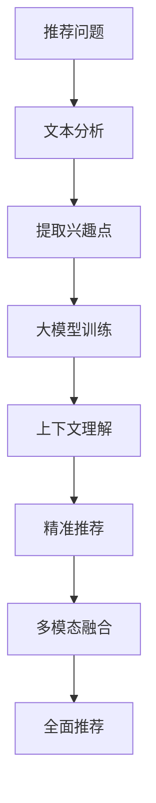

                 

 在当今快速发展的信息技术时代，推荐系统作为提高用户体验、提升产品服务质量的重要手段，已被广泛应用于电商、社交媒体、新闻推送等领域。随着人工智能技术的进步，特别是大模型技术的发展，推荐系统开始逐步从简单的协同过滤和基于内容的推荐，向更加智能和复杂的大模型语言理解任务转变。本文旨在探讨如何将推荐问题转化为大模型的语言理解任务，从而实现更加精准、智能的推荐结果。

> 关键词：推荐系统、大模型、语言理解、文本分析、算法转化

## 摘要

本文首先介绍了推荐系统的基本概念和现有技术，随后重点探讨了如何将推荐问题转化为大模型的语言理解任务。通过深入分析推荐问题的本质，我们提出了基于文本分析和语言理解的推荐算法框架。文章接着详细描述了核心算法原理、具体操作步骤、数学模型和公式，以及实际应用中的项目实践和代码实例。最后，文章总结了这一领域的研究成果，展望了未来的发展趋势和挑战。

## 1. 背景介绍

推荐系统是一种信息过滤技术，旨在向用户推荐他们可能感兴趣的项目或内容。推荐系统通常基于用户的行为数据、内容属性以及协同过滤等方法进行工作。然而，传统的推荐系统存在一些局限性，如数据稀疏、冷启动问题以及过度拟合等。随着自然语言处理（NLP）和深度学习技术的迅猛发展，将推荐问题转化为大模型的语言理解任务成为了一种新的研究方向。

大模型，如GPT、BERT等，具有强大的语言理解和生成能力。这些模型通过大量文本数据的训练，能够捕捉到复杂的语义关系和上下文信息。因此，将推荐问题转化为大模型的语言理解任务，有望解决传统推荐系统面临的诸多问题，实现更加精准和个性化的推荐。

### 1.1 现有推荐技术分析

现有的推荐技术主要分为基于内容的推荐和基于协同过滤的推荐。

- **基于内容的推荐**：通过分析物品的内容特征和用户的历史行为，计算用户和物品之间的相似度，从而进行推荐。这种方法存在一个问题，即当用户历史行为数据较少时，难以准确预测用户的兴趣。

- **基于协同过滤的推荐**：通过分析用户之间的行为模式，发现相似用户，并基于相似用户的兴趣进行推荐。协同过滤方法分为基于用户的协同过滤和基于项目的协同过滤。然而，这种方法也面临数据稀疏性和冷启动问题。

### 1.2 大模型在推荐系统中的应用

大模型在推荐系统中的应用，为解决传统推荐技术的局限性提供了新的思路。大模型能够通过深度学习从大量文本数据中学习到丰富的语义信息，从而提高推荐系统的准确性和个性化程度。

- **文本分析**：大模型能够对用户的文本评论、搜索历史等进行深入分析，提取出用户的潜在兴趣点。

- **上下文理解**：大模型能够理解用户在不同上下文环境中的需求，从而提供更加精准的推荐。

- **多模态融合**：大模型能够融合用户的文本信息、图像信息等多模态数据，提供更加全面的推荐。

## 2. 核心概念与联系

为了将推荐问题转化为大模型的语言理解任务，我们需要明确一些核心概念和它们之间的联系。以下是这些概念以及它们之间的关系，并用Mermaid流程图表示：

### 2.1 核心概念

1. **推荐问题**：推荐系统需要解决的问题，如如何向用户推荐他们可能感兴趣的商品、新闻或视频。
2. **大模型**：具有强大语言理解和生成能力的人工智能模型，如GPT、BERT等。
3. **文本分析**：对用户的文本数据（如评论、搜索历史等）进行深入分析，提取出用户的潜在兴趣。
4. **上下文理解**：理解用户在不同上下文环境中的需求，从而提供更加精准的推荐。
5. **多模态融合**：融合用户的文本信息、图像信息等多模态数据，提供更加全面的推荐。

### 2.2 Mermaid流程图

## 3. 核心算法原理 & 具体操作步骤

### 3.1 算法原理概述

将推荐问题转化为大模型的语言理解任务，主要是通过以下几个步骤实现的：

1. **文本数据的预处理**：对用户的文本数据进行清洗和预处理，如去除停用词、进行词性标注等。
2. **兴趣点提取**：使用NLP技术对用户的文本数据进行分析，提取出用户的潜在兴趣点。
3. **大模型训练**：利用提取的兴趣点，通过大量文本数据对大模型进行训练，使其具备语言理解能力。
4. **上下文理解和推荐**：大模型通过理解用户的上下文信息，提供精准的推荐结果。
5. **多模态数据融合**：将文本数据与其他模态数据（如图像）进行融合，提供更加全面的推荐。

### 3.2 算法步骤详解

#### 3.2.1 文本数据的预处理

在推荐系统中，用户的文本数据可能包含大量的噪声和不相关信息。因此，首先需要对文本数据进行清洗和预处理：

- **去除停用词**：去除常见的无意义词汇，如“的”、“了”等。
- **分词**：将文本划分为单个词语。
- **词性标注**：为每个词语标注词性，如名词、动词等。
- **去除标点符号**：去除文本中的标点符号，以免影响分析。

#### 3.2.2 兴趣点提取

在预处理后的文本数据中，我们需要提取出用户的潜在兴趣点。这可以通过以下几种方法实现：

- **关键词提取**：使用TF-IDF等方法，提取文本中的高频关键词。
- **实体识别**：利用命名实体识别（NER）技术，识别文本中的关键实体，如产品名称、人名等。
- **情感分析**：通过情感分析，识别用户对物品的积极或消极情绪。

#### 3.2.3 大模型训练

利用提取的兴趣点，我们可以使用大量文本数据进行大模型的训练。这个过程通常包括以下步骤：

- **数据集准备**：准备用于训练的数据集，包括用户的文本数据和对应的兴趣点。
- **模型选择**：选择合适的大模型，如GPT、BERT等。
- **训练过程**：通过梯度下降等方法，对模型进行训练，使其能够理解用户的兴趣点。
- **模型评估**：使用验证集和测试集对模型进行评估，调整模型参数，以提高推荐准确性。

#### 3.2.4 上下文理解和推荐

大模型训练完成后，我们可以利用其强大的语言理解能力，理解用户的上下文信息，从而提供精准的推荐：

- **上下文理解**：通过分析用户的搜索历史、浏览记录等，理解用户当前的需求。
- **推荐生成**：基于用户的兴趣点和上下文信息，生成个性化的推荐列表。

#### 3.2.5 多模态数据融合

为了提供更加全面的推荐，我们可以将文本数据与其他模态数据（如图像）进行融合：

- **数据预处理**：对图像数据进行预处理，如缩放、裁剪等。
- **特征提取**：使用卷积神经网络（CNN）等方法，提取图像的特征。
- **融合策略**：将文本特征和图像特征进行融合，使用融合后的特征进行推荐。

### 3.3 算法优缺点

#### 优点

- **强大的语言理解能力**：大模型能够理解用户的复杂需求和情感，从而提供更加精准的推荐。
- **多模态数据融合**：能够整合多种模态数据，提供更加全面的推荐。
- **自动特征提取**：通过深度学习，自动提取用户的兴趣点和上下文特征，减少人工干预。

#### 缺点

- **计算资源消耗大**：大模型训练和推理过程需要大量的计算资源。
- **数据需求量大**：需要大量的高质量文本数据用于训练。
- **模型解释性较差**：深度学习模型通常具有较

