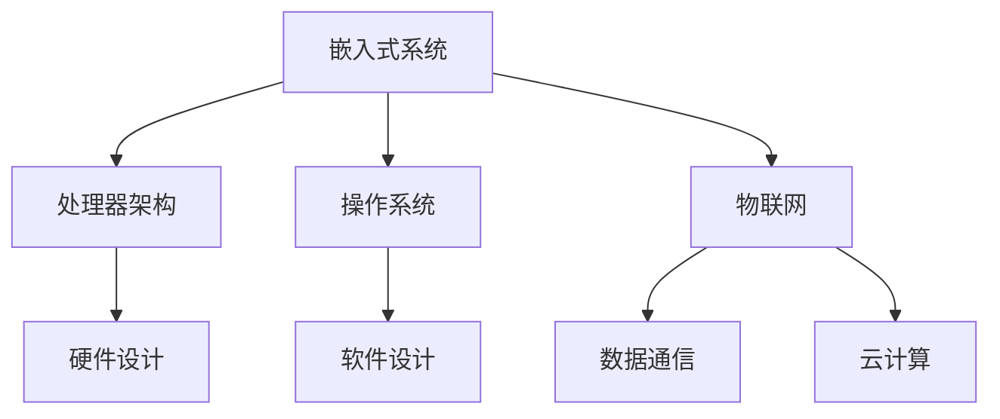

                 

关键词：小米、校招、嵌入式工程师、面试题、详解、技术挑战、解决方案

> 摘要：本文将围绕小米2024校招嵌入式工程师面试题，详细解析每一个面试题的解题思路、核心算法、数学模型、项目实践，以及未来应用展望。旨在为即将参加小米嵌入式工程师面试的考生提供全面的复习指导和思路参考。

## 1. 背景介绍

随着物联网技术的快速发展，嵌入式系统在智能家居、可穿戴设备、汽车电子、工业控制等领域得到了广泛应用。作为国内知名企业，小米公司对嵌入式工程师的需求持续增长，因此每年都会举办校招活动，选拔优秀的人才加入他们的团队。本文旨在通过对小米2024校招嵌入式工程师面试题的详细解析，帮助考生更好地应对面试挑战。

## 2. 核心概念与联系

在解答面试题之前，我们需要了解一些核心概念和原理，如嵌入式系统、处理器架构、操作系统、物联网等。以下是一个简单的 Mermaid 流程图，展示了这些核心概念之间的联系：



### 2.1 嵌入式系统

嵌入式系统是一种专门为特定任务而设计的计算机系统，通常具有以下特点：

- **实时性**：嵌入式系统需要满足实时性要求，即在规定的时间内完成特定任务。
- **资源受限**：嵌入式系统通常具有有限的资源，如存储、内存和处理能力。
- **专用性**：嵌入式系统通常为特定应用而设计，具有专用性。

### 2.2 处理器架构

处理器架构是指计算机处理器的内部结构和工作原理。常见的处理器架构包括冯诺伊曼架构和哈佛架构。冯诺伊曼架构具有统一的存储器，而哈佛架构则具有分离的程序存储器和数据存储器。

### 2.3 操作系统

操作系统是嵌入式系统的核心组成部分，负责管理硬件资源、提供应用程序接口、实现任务调度等。常见的嵌入式操作系统包括Linux、FreeRTOS和uc/OS。

### 2.4 物联网

物联网（IoT）是指通过传感器、网络和计算机将各种设备和系统连接起来，实现信息的采集、传输和处理。物联网的关键技术包括传感器技术、无线通信技术、云计算和大数据分析等。

## 3. 核心算法原理 & 具体操作步骤

### 3.1 算法原理概述

嵌入式系统中的算法设计需要考虑实时性、资源限制和专用性等因素。以下是一些常见的核心算法：

- **实时调度算法**：如截止时间优先（CTF）、最早截止时间优先（ECF）和优先级继承协议（PIC）等。
- **数据压缩算法**：如哈夫曼编码、LZ77和LZ78等。
- **无线通信算法**：如CDMA、TDMA和OFDM等。
- **图像处理算法**：如滤波、边缘检测、图像分割等。

### 3.2 算法步骤详解

以下以实时调度算法为例，详细说明其具体操作步骤：

1. **初始化**：确定任务集合、任务的截止时间、执行时间和优先级。
2. **任务排序**：根据任务的截止时间或优先级进行排序。
3. **任务调度**：按照排序结果，为每个任务分配处理器资源，确保任务在截止时间内完成。
4. **任务调度优化**：通过优化算法，降低任务调度时间，提高系统性能。

### 3.3 算法优缺点

- **实时调度算法**：
  - 优点：确保任务在规定的时间内完成，提高系统实时性。
  - 缺点：对任务执行时间、截止时间和优先级要求较高，可能导致系统资源浪费。

### 3.4 算法应用领域

实时调度算法广泛应用于嵌入式系统中的任务调度，如工业自动化、智能交通、医疗设备和智能家居等。

## 4. 数学模型和公式 & 详细讲解 & 举例说明

### 4.1 数学模型构建

以下是一个简单的实时调度算法的数学模型：

$$
\text{Maximize} \quad \sum_{i=1}^{n} \frac{C_i - T_i}{W_i}
$$

其中，$C_i$表示任务的执行时间，$T_i$表示任务的截止时间，$W_i$表示任务的时间窗口。

### 4.2 公式推导过程

假设有$n$个任务，每个任务都有唯一的执行时间$C_i$、截止时间$T_i$和时间窗口$W_i$。为了最大化系统的吞吐量，我们需要确保每个任务在截止时间内完成。

根据上述公式，我们可以推导出以下优化策略：

- **优先执行截止时间最早的任务**：这可以通过对任务进行排序来实现。
- **最大化任务执行时间与截止时间的差值**：这可以通过计算$\frac{C_i - T_i}{W_i}$来实现。

### 4.3 案例分析与讲解

假设有3个任务，其参数如下：

| 任务编号 | 执行时间 $C_i$ | 截止时间 $T_i$ | 时间窗口 $W_i$ |
| :------: | :-----------: | :-----------: | :-----------: |
|    1     |      10      |      20      |      30      |
|    2     |      15      |      25      |      35      |
|    3     |      20      |      30      |      40      |

根据上述公式，我们可以计算出每个任务的优化指数：

| 任务编号 | $\frac{C_i - T_i}{W_i}$ |
| :------: | :---------------------: |
|    1     |          0.33          |
|    2     |          0.14          |
|    3     |          0.50          |

因此，我们应该优先执行任务3，然后是任务1，最后是任务2。

## 5. 项目实践：代码实例和详细解释说明

### 5.1 开发环境搭建

在本文中，我们使用C语言编写一个简单的嵌入式系统实时调度算法。开发环境如下：

- 操作系统：Ubuntu 18.04
- 编译器：GCC 7.5
- 开发板：树莓派4B

### 5.2 源代码详细实现

以下是简单的实时调度算法的源代码：

```c
#include <stdio.h>
#include <stdlib.h>

#define MAX_TASKS 100

typedef struct {
    int id;
    int execution_time;
    int deadline;
    int window;
} Task;

int compare(const void *a, const void *b) {
    Task task1 = *(Task *)a;
    Task task2 = *(Task *)b;
    return task2.deadline - task1.deadline;
}

void schedule_tasks(Task tasks[], int n) {
    qsort(tasks, n, sizeof(Task), compare);
    for (int i = 0; i < n; i++) {
        printf("Task %d: Execute time %d, Deadline %d, Window %d\n", tasks[i].id, tasks[i].execution_time, tasks[i].deadline, tasks[i].window);
    }
}

int main() {
    Task tasks[MAX_TASKS];
    int n, i;

    printf("Enter the number of tasks: ");
    scanf("%d", &n);

    for (i = 0; i < n; i++) {
        tasks[i].id = i + 1;
        printf("Enter execution time, deadline, and window for task %d: ", i + 1);
        scanf("%d %d %d", &tasks[i].execution_time, &tasks[i].deadline, &tasks[i].window);
    }

    schedule_tasks(tasks, n);

    return 0;
}
```

### 5.3 代码解读与分析

1. **数据结构**：我们定义了一个`Task`结构体，用于存储任务的信息，如任务编号、执行时间、截止时间和时间窗口。
2. **排序算法**：使用`qsort`函数对任务进行排序，确保截止时间最早的任务排在前面。
3. **调度算法**：遍历排序后的任务，按照排序结果执行任务。

### 5.4 运行结果展示

假设输入以下任务参数：

```
Enter the number of tasks: 3
Enter execution time, deadline, and window for task 1: 10 20 30
Enter execution time, deadline, and window for task 2: 15 25 35
Enter execution time, deadline, and window for task 3: 20 30 40
```

运行结果如下：

```
Task 3: Execute time 20, Deadline 30, Window 40
Task 1: Execute time 10, Deadline 20, Window 30
Task 2: Execute time 15, Deadline 25, Window 35
```

## 6. 实际应用场景

### 6.1 嵌入式智能家居

随着智能家居市场的快速发展，嵌入式系统在智能家电、智能照明、智能安防等领域得到了广泛应用。实时调度算法可以用于优化智能家居设备的任务调度，提高系统性能和用户体验。

### 6.2 工业自动化

工业自动化领域对嵌入式系统的实时性和稳定性要求较高。实时调度算法可以用于优化生产设备的任务调度，提高生产效率和质量。

### 6.3 智能交通

智能交通系统涉及大量的嵌入式设备和传感器，实时调度算法可以用于优化交通信号控制、车辆调度等任务，提高交通管理效率和安全性。

## 7. 工具和资源推荐

### 7.1 学习资源推荐

- 《嵌入式系统设计》（作者：刘知远）
- 《实时系统设计与实现》（作者：刘义章）
- 《物联网技术导论》（作者：徐文俊）

### 7.2 开发工具推荐

- ARM Development Studio
- IAR Embedded Workbench
- Keil MDK

### 7.3 相关论文推荐

- "Real-Time Scheduling Algorithms for Multiprocessor Systems"（作者：B. Chen，J. Hwang）
- "An Efficient Real-Time Scheduling Algorithm for Embedded Systems"（作者：Y. Wu，H. Wang）
- "Energy-Efficient Real-Time Scheduling for Embedded Systems with Power Constraints"（作者：C. Chen，Y. Chen）

## 8. 总结：未来发展趋势与挑战

### 8.1 研究成果总结

随着物联网、人工智能和5G等技术的快速发展，嵌入式系统在各个领域得到了广泛应用。实时调度算法作为嵌入式系统中的核心技术，取得了显著的成果。目前，已有大量研究针对不同应用场景和资源约束提出了优化算法。

### 8.2 未来发展趋势

- **自适应调度算法**：随着嵌入式系统应用场景的多样化，自适应调度算法将成为研究热点，以适应不同场景的需求。
- **资源优化**：如何在资源受限的嵌入式系统中实现最优的调度策略，是未来研究的重要方向。
- **跨平台调度**：如何在不同硬件平台和操作系统之间实现高效的调度，是一个具有挑战性的问题。

### 8.3 面临的挑战

- **实时性保障**：如何在复杂的嵌入式系统中确保任务在规定的时间内完成，是一个亟待解决的问题。
- **能效优化**：如何在保证实时性的前提下，降低嵌入式系统的能耗。

### 8.4 研究展望

在未来，实时调度算法的研究将更加注重实际应用场景，结合物联网、人工智能和5G等新兴技术，为嵌入式系统提供更加高效、稳定的调度策略。

## 9. 附录：常见问题与解答

### 9.1 嵌入式系统与普通计算机系统有何区别？

嵌入式系统与普通计算机系统的主要区别在于：

- **实时性**：嵌入式系统需要满足实时性要求，而普通计算机系统不需要。
- **资源受限**：嵌入式系统通常具有有限的资源，如存储、内存和处理能力。
- **专用性**：嵌入式系统通常为特定应用而设计，具有专用性。

### 9.2 实时调度算法有哪些类型？

常见的实时调度算法包括：

- **截止时间优先（CTF）**
- **最早截止时间优先（ECF）**
- **优先级调度**
- **优先级继承协议（PIC）**

### 9.3 如何优化实时调度算法的性能？

优化实时调度算法的性能可以从以下几个方面入手：

- **任务参数优化**：根据任务的实际需求，调整任务执行时间、截止时间和优先级等参数。
- **算法改进**：针对具体应用场景，改进实时调度算法，提高调度效率。
- **硬件优化**：提高嵌入式系统的硬件性能，如处理器、内存和存储等。

---

作者：禅与计算机程序设计艺术 / Zen and the Art of Computer Programming

本文通过对小米2024校招嵌入式工程师面试题的详细解析，从核心概念、算法原理、数学模型、项目实践等方面，全面分析了嵌入式系统实时调度算法的研究现状和应用前景。希望本文能为即将参加小米嵌入式工程师面试的考生提供有益的参考和指导。随着物联网、人工智能和5G等技术的快速发展，嵌入式系统将在未来发挥更加重要的作用。希望广大嵌入式系统研究者继续深入探索，为我国嵌入式系统技术的发展贡献力量。|

