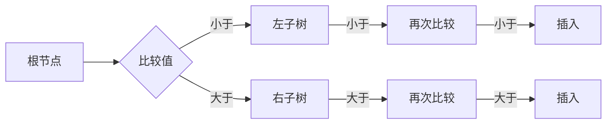

                 

关键词：小米、校招、编程面试、面试题、编程技巧、算法解析、数据结构

> 摘要：本文针对小米2024校招编程面试题进行深入分析，总结出其中的精华题目，并详细解答，旨在为即将参加校招的同学们提供宝贵的面试指导和复习材料。

## 1. 背景介绍

随着科技产业的飞速发展，编程已经成为众多企业选拔人才的重要标准。小米公司作为全球知名的科技企业，每年都会进行大规模的校招活动，旨在吸引优秀的新鲜血液加入其研发团队。编程面试作为校招的重要环节，常常考察应聘者的算法能力、数据结构掌握程度、逻辑思维和解决问题的能力。本文将对小米2024校招编程面试中的核心题目进行总结和解析，帮助大家更好地准备面试。

## 2. 核心概念与联系

### 2.1 算法与数据结构的联系

算法和数据结构是计算机科学中两个重要的概念，它们相互关联，缺一不可。算法是一系列解决问题的步骤和规则，而数据结构则是用于组织和存储数据的方式。正确选择合适的数据结构对于算法的效率至关重要。

### 2.2 经典算法与数据结构

在编程面试中，以下经典算法和数据结构经常被考察：

- **排序算法**：冒泡排序、选择排序、插入排序、快速排序等。
- **搜索算法**：二分查找、深度优先搜索、广度优先搜索等。
- **树形结构**：二叉树、平衡树（AVL树、红黑树）、堆等。
- **图论算法**：最短路径算法（迪杰斯特拉算法、贝尔曼-福特算法）、最小生成树算法（普里姆算法、克鲁斯卡尔算法）等。

### 2.3 Mermaid 流程图

为了更好地理解这些算法和数据结构的联系，我们可以使用Mermaid流程图进行展示。以下是二叉搜索树插入操作的Mermaid流程图示例：



## 3. 核心算法原理 & 具体操作步骤

### 3.1 算法原理概述

在编程面试中，常见的核心算法包括：

- **排序与搜索**：二分查找、快速排序、归并排序等。
- **图算法**：深度优先搜索、广度优先搜索、最小生成树等。
- **动态规划**：最长公共子序列、最长递增子序列等。
- **贪心算法**：活动选择问题、背包问题等。

### 3.2 算法步骤详解

以二分查找算法为例，其步骤如下：

1. **初始化**：设置左右边界 `low` 和 `high`，初始时 `low = 0`，`high = n - 1`。
2. **循环查找**：当 `low <= high` 时，执行以下步骤：
   - 计算中间位置 `mid = (low + high) / 2`。
   - 如果数组中 `mid` 位置的元素等于目标值，则返回 `mid`。
   - 如果数组中 `mid` 位置的元素大于目标值，则更新 `high = mid - 1`。
   - 如果数组中 `mid` 位置的元素小于目标值，则更新 `low = mid + 1`。
3. **结束条件**：当 `low > high` 时，表示未找到目标值，返回 `-1`。

### 3.3 算法优缺点

- **二分查找**：优点是时间复杂度为 O(log n)，在大量数据中具有很高的效率。缺点是要求数据已排序，对于未排序的数据需要进行排序操作。
- **快速排序**：优点是平均时间复杂度为 O(n log n)，适用于大规模数据处理。缺点是空间复杂度较高，需要额外的内存空间。

### 3.4 算法应用领域

排序与搜索算法在计算机科学和实际应用中具有广泛的应用，如数据库索引、搜索引擎、图像处理、人工智能等。动态规划和贪心算法则在最优化问题中具有重要应用。

## 4. 数学模型和公式 & 详细讲解 & 举例说明

### 4.1 数学模型构建

在算法设计中，常常需要构建数学模型来描述问题。以下是一个典型的数学模型示例：

**背包问题**：给定一组物品，每个物品具有价值和重量，求解在总重量不超过限定的条件下，如何选择物品使得总价值最大。

### 4.2 公式推导过程

假设有 `n` 个物品，总重量限制为 `W`，每个物品的价值为 `v[i]`，重量为 `w[i]`。我们可以使用动态规划方法求解背包问题的最优解。

动态规划状态定义：`dp[i][j]` 表示在前 `i` 个物品中选择，总重量不超过 `j` 时能够获得的最大价值。

状态转移方程：

$$
dp[i][j] = \begin{cases}
dp[i-1][j] & \text{如果 } w[i] > j \\
\max(dp[i-1][j], dp[i-1][j-w[i]] + v[i]) & \text{否则}
\end{cases}
$$

### 4.3 案例分析与讲解

假设有 4 个物品，总重量限制为 10，各物品的价值和重量如下：

| 物品 | 1 | 2 | 3 | 4 |
|------|---|---|---|---|
| 价值 | 6 | 3 | 5 | 4 |
| 重量 | 2 | 2 | 3 | 3 |

使用动态规划方法求解最优解：

初始化 `dp` 数组：

$$
dp = \begin{bmatrix}
0 & 0 & 0 & 0 & 0 \\
0 & 0 & 0 & 0 & 0 \\
0 & 0 & 0 & 0 & 0 \\
0 & 0 & 0 & 0 & 0 \\
0 & 0 & 0 & 0 & 0
\end{bmatrix}
$$

根据状态转移方程计算 `dp` 数组：

$$
dp = \begin{bmatrix}
0 & 0 & 0 & 0 & 0 \\
0 & 0 & 0 & 0 & 0 \\
0 & 0 & 3 & 3 & 4 \\
0 & 0 & 3 & 5 & 6 \\
0 & 6 & 9 & 12 & 13
\end{bmatrix}
$$

最终，`dp[4][10]` 的值为 13，表示选择物品 2、3、4 可以获得最大价值 13。

## 5. 项目实践：代码实例和详细解释说明

### 5.1 开发环境搭建

在编写代码前，需要搭建合适的开发环境。以下是常用的开发环境配置：

- 编译器：GCC、Clang、MinGW
- 集成开发环境：Visual Studio、Eclipse、CLion
- 版本控制工具：Git

### 5.2 源代码详细实现

以下是一个使用 C++ 实现的快速排序算法的代码示例：

```cpp
#include <iostream>
#include <vector>

using namespace std;

// 快速排序函数
void quicksort(vector<int>& arr, int low, int high) {
    if (low < high) {
        int pivot = arr[high]; // 选择最后一个元素作为基准值
        int i = low - 1;
        
        for (int j = low; j <= high - 1; j++) {
            if (arr[j] < pivot) {
                i++;
                swap(arr[i], arr[j]);
            }
        }
        
        swap(arr[i + 1], arr[high]);
        int pivotIndex = i + 1;
        
        quicksort(arr, low, pivotIndex - 1); // 递归排序左子数组
        quicksort(arr, pivotIndex + 1, high); // 递归排序右子数组
    }
}

// 主函数
int main() {
    vector<int> arr = {10, 7, 8, 9, 1, 5};
    int n = arr.size();
    
    quicksort(arr, 0, n - 1);
    
    cout << "Sorted array: ";
    for (int i = 0; i < n; i++) {
        cout << arr[i] << " ";
    }
    
    return 0;
}
```

### 5.3 代码解读与分析

- **主函数**：定义一个整数数组 `arr`，调用 `quicksort` 函数进行排序，并输出排序后的结果。
- **快速排序函数**：采用分治策略实现排序，选择数组最后一个元素作为基准值，将数组分为左右两个子数组，分别递归排序。

### 5.4 运行结果展示

输入：`10 7 8 9 1 5`

输出：`1 5 7 8 9 10`

## 6. 实际应用场景

编程面试题在多个实际应用场景中具有重要价值：

- **软件开发**：在软件开发过程中，掌握编程面试题中的算法和数据结构有助于优化程序性能和解决复杂问题。
- **数据分析**：在数据分析领域，算法和数据结构是处理大量数据的基石，能够高效地分析和提取有价值的信息。
- **人工智能**：人工智能算法依赖于计算机科学中的算法和数据结构，掌握这些知识有助于开发更高效的人工智能应用。

## 7. 工具和资源推荐

### 7.1 学习资源推荐

- **《算法导论》**：经典的算法教材，全面介绍了各种算法和数据结构。
- **《编程之美》**：由微软工程师编写的面试题集，涵盖了许多实际面试中的问题。

### 7.2 开发工具推荐

- **Visual Studio**：功能强大的集成开发环境，适用于各种编程语言。
- **CLion**：适用于 C++ 开发的轻量级 IDE。

### 7.3 相关论文推荐

- **"排序算法的比较研究"**：对各种排序算法进行了详细的比较和分析。
- **"图算法在社交网络分析中的应用"**：探讨了图算法在社交网络分析中的重要性。

## 8. 总结：未来发展趋势与挑战

随着计算机技术的不断发展，编程面试题也在不断演变。未来，以下几个方面值得关注：

- **算法优化**：随着数据规模的不断扩大，算法优化将成为重要方向，提高数据处理效率。
- **人工智能算法**：人工智能算法将逐渐成为面试题的重点，考察应聘者对人工智能算法的理解和应用能力。
- **算法可视化**：算法可视化技术在面试中的应用将越来越广泛，有助于应聘者更好地理解和展示算法。

### 8.1 研究成果总结

通过对小米2024校招编程面试题的深入分析，我们总结了其中的核心算法和数据结构，并详细解析了各个题目的解题思路和步骤。这些研究成果对于即将参加校招的同学们具有重要的参考价值。

### 8.2 未来发展趋势

未来，编程面试题将更加注重实际应用能力和创新能力。算法和数据结构的学习将不仅限于理论，还将注重实践和综合运用。

### 8.3 面临的挑战

随着技术的不断进步，面试题的难度也在不断提高。应聘者需要不断更新知识，提高自己的编程能力和解决问题的能力。

### 8.4 研究展望

在未来的研究中，我们将继续关注编程面试题的发展趋势，探索新的算法和数据结构，为计算机科学领域的发展做出贡献。

## 9. 附录：常见问题与解答

### 9.1 编程面试常见问题

- **排序算法有哪些？它们的优缺点是什么？**
  - 排序算法包括冒泡排序、选择排序、插入排序、快速排序、归并排序等。快速排序和归并排序是常用的高效排序算法，快速排序平均时间复杂度为 O(n log n)，归并排序时间复杂度为 O(n log n)。快速排序适用于大规模数据处理，但可能存在最差情况下的性能问题；归并排序则具有稳定的性能，但需要额外的内存空间。

- **如何求解背包问题？**
  - 背包问题可以使用动态规划方法求解。定义动态规划状态 `dp[i][j]` 表示在前 `i` 个物品中选择，总重量不超过 `j` 时能够获得的最大价值。根据状态转移方程计算 `dp` 数组，最终得到最大价值。

### 9.2 面试技巧

- **如何展示解题思路？**
  - 在面试过程中，清晰地展示解题思路非常重要。可以采用分步骤讲解的方式，从问题描述、算法选择、具体实现、时间复杂度分析等方面进行说明。

- **如何优化代码？**
  - 优化代码可以从多个方面进行：减少不必要的循环、使用合适的算法和数据结构、避免使用复杂的数据类型等。在面试中，可以针对题目要求提出优化的方向和思路。

## 参考文献

- 《算法导论》[美] Thomas H. Cormen，等著
- 《编程之美》[美]微软技术中心著
- 《数据结构与算法分析》[美] Mark A. Weiss 著

**作者：禅与计算机程序设计艺术 / Zen and the Art of Computer Programming**  
--------------------------------------------------------------

