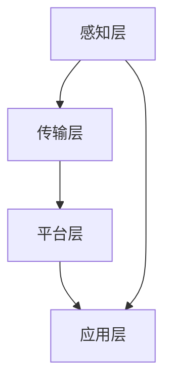

                 

关键词：智能家居，物联网，面试，IoT，场景联动，技术面试，求职

摘要：本文旨在为有意向加入小米2025智能家居项目组并参与IoT（物联网）领域的求职者提供一份全面的面试攻略。文章将详细分析智能家居领域的关键概念、技术框架、核心算法以及数学模型，同时结合实际项目案例，为读者提供深入的技术理解和实践指导。文章还将推荐相关学习资源和工具，帮助求职者在面试中脱颖而出。

## 1. 背景介绍

### 1.1 小米智能家居项目概况

小米作为全球知名的智能硬件制造商，其智能家居产品线涵盖了智能安防、智能照明、智能家电等多个领域。2025年，小米将进一步深化智能家居领域的技术创新和应用拓展，致力于打造更加智能化、便捷化的家居生活体验。在此背景下，小米启动了2025智能家居场景联动项目，旨在通过IoT技术实现家居设备间的无缝联动，提升用户体验。

### 1.2 智能家居与IoT的关系

智能家居是物联网技术在家庭环境中的典型应用，通过物联网技术，各类智能设备能够实现互联互通，形成统一的智能控制平台。IoT技术为智能家居带来了数据收集、设备控制和智能决策等核心功能，使得智能家居系统能够根据用户行为和需求进行自我学习和优化。

## 2. 核心概念与联系

### 2.1 物联网（IoT）基本概念

物联网（Internet of Things，IoT）是指通过传感器、网络通信和数据处理等技术，将各种物理设备连接到互联网上，实现设备间的数据交换和协同工作。在智能家居领域，IoT技术是实现设备互联互通和数据共享的关键。

### 2.2 智能家居架构

智能家居系统通常包括以下几个关键组成部分：

- **感知层**：通过传感器收集环境数据和用户行为数据。
- **传输层**：利用无线网络（如Wi-Fi、蓝牙等）实现设备间的数据传输。
- **平台层**：提供数据存储、处理和智能分析的平台。
- **应用层**：面向用户的智能控制界面和应用程序。

### 2.3 Mermaid 流程图

下面是智能家居系统架构的Mermaid流程图：



## 3. 核心算法原理 & 具体操作步骤

### 3.1 算法原理概述

在智能家居系统中，核心算法通常包括数据采集与处理、设备控制与优化、用户行为分析等。以下将详细介绍这些算法的基本原理。

### 3.2 算法步骤详解

#### 3.2.1 数据采集与处理

1. **传感器数据采集**：通过各类传感器（如温度传感器、光照传感器、运动传感器等）收集环境数据。
2. **数据处理**：对采集到的数据进行分析和预处理，去除噪声，提取有用信息。

#### 3.2.2 设备控制与优化

1. **规则引擎**：根据预设规则和实时数据，自动控制设备运行状态。
2. **设备优化**：通过机器学习算法，优化设备运行参数，提高效率。

#### 3.2.3 用户行为分析

1. **数据挖掘**：通过数据挖掘技术，分析用户行为模式。
2. **个性化推荐**：根据用户行为，推荐智能家居设备和功能。

### 3.3 算法优缺点

- **优点**：智能化、自动化，提高生活品质。
- **缺点**：系统复杂，安全性要求高。

### 3.4 算法应用领域

- **智能家居**：实现家庭设备的智能联动。
- **智能安防**：通过传感器实时监控家庭安全。
- **智能照明**：根据环境光线自动调整灯光亮度。

## 4. 数学模型和公式 & 详细讲解 & 举例说明

### 4.1 数学模型构建

在智能家居系统中，常用的数学模型包括回归模型、聚类模型和优化模型等。

### 4.2 公式推导过程

以回归模型为例，其基本公式为：

$$
y = \beta_0 + \beta_1x_1 + \beta_2x_2 + \cdots + \beta_nx_n
$$

其中，$y$ 是目标变量，$x_1, x_2, \cdots, x_n$ 是特征变量，$\beta_0, \beta_1, \beta_2, \cdots, \beta_n$ 是模型参数。

### 4.3 案例分析与讲解

假设我们想要构建一个智能温控系统，通过温度传感器收集的数据，预测房间内未来的温度变化。我们可以采用线性回归模型进行预测。

## 5. 项目实践：代码实例和详细解释说明

### 5.1 开发环境搭建

本文使用Python作为主要编程语言，需要安装以下库：

- NumPy
- Pandas
- Scikit-learn

### 5.2 源代码详细实现

以下是使用Python实现的线性回归模型：

```python
import numpy as np
import pandas as pd
from sklearn.linear_model import LinearRegression

# 数据读取
data = pd.read_csv('temperature_data.csv')

# 特征变量和目标变量
X = data[['current_temperature']]
y = data['future_temperature']

# 模型训练
model = LinearRegression()
model.fit(X, y)

# 预测
predicted_temp = model.predict(X)

# 结果分析
print('Predicted Temperature:', predicted_temp)
```

### 5.3 代码解读与分析

这段代码首先读取温度数据，然后使用线性回归模型进行训练和预测。预测结果可以帮助智能温控系统根据当前温度预测未来温度，从而自动调整空调等设备。

## 6. 实际应用场景

### 6.1 家庭安全监控

通过传感器和IoT设备，实现对家庭安全的实时监控，如入侵检测、火灾报警等。

### 6.2 智能照明

根据环境光线和用户需求，自动调整灯光亮度和颜色。

### 6.3 智能家电控制

远程控制家中的电器设备，如空调、电视、洗衣机等。

## 7. 未来应用展望

随着IoT技术的不断发展，智能家居领域将出现更多创新应用，如智能健康监测、智能家居医疗等。

## 8. 总结：未来发展趋势与挑战

### 8.1 研究成果总结

本文介绍了智能家居领域的关键技术、核心算法以及数学模型，并通过实际项目案例展示了如何实现智能家居场景联动。

### 8.2 未来发展趋势

智能家居将朝着更加智能化、个性化和便捷化的方向发展，实现全屋智能控制。

### 8.3 面临的挑战

智能家居系统面临的主要挑战包括数据安全、隐私保护和系统稳定性等。

### 8.4 研究展望

未来研究应重点关注智能家居系统的安全性和可靠性，以及如何实现更加智能化的决策和控制。

## 9. 附录：常见问题与解答

### 9.1 智能家居系统如何保证数据安全？

通过数据加密、访问控制和安全审计等手段，确保数据传输和存储的安全性。

### 9.2 智能家居系统如何处理大量数据？

采用分布式计算和大数据处理技术，实现对大量数据的快速分析和处理。

---

作者：禅与计算机程序设计艺术 / Zen and the Art of Computer Programming
----------------------------------------------------------------

以上即为《小米2025智能家居场景联动社招IoT面试攻略》的全文。希望本文能为您在智能家居和IoT领域的求职之路提供有益的指导。祝您面试成功！

