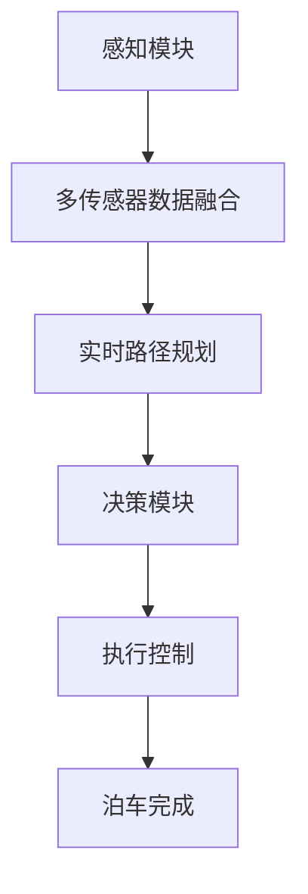

                 

关键词：小米汽车、端到端泊车系统、自动驾驶、机器学习、深度学习

> 摘要：本文将深入探讨小米汽车的端到端泊车系统，从背景介绍、核心概念与联系、核心算法原理与操作步骤、数学模型与公式、项目实践、实际应用场景、未来展望、工具和资源推荐、总结与展望等多个方面，全面解析这一先进技术的细节与前景。

## 1. 背景介绍

随着科技的飞速发展，自动驾驶技术逐渐成为汽车工业的重要趋势。作为自动驾驶技术的关键环节之一，泊车系统的研究和应用受到越来越多企业的关注。小米汽车作为一家新兴的智能汽车制造商，致力于提供创新且高效的自动驾驶解决方案。其中，端到端泊车系统是其核心技术之一，代表了智能泊车领域的先进水平。

端到端泊车系统的核心在于实现车辆的自动泊车功能，即车辆无需驾驶员干预，能够自主完成停车位识别、路径规划、泊车动作等操作。这不仅提升了驾驶的便利性，还提高了泊车效率，减轻了驾驶员的疲劳。

本文将围绕小米汽车的端到端泊车系统展开，详细介绍其工作原理、技术实现、应用场景以及未来发展方向。

### 1.1 小米汽车的端到端泊车系统概述

小米汽车的端到端泊车系统基于先进的深度学习技术和机器学习算法，通过多传感器数据融合、实时路径规划和精确控制技术，实现了车辆在复杂环境中的自动泊车。

系统的基本架构包括感知模块、决策模块和执行模块。感知模块负责收集车辆周围环境的信息，如摄像头、激光雷达、超声波传感器等；决策模块利用深度学习模型对感知数据进行处理，生成泊车路径；执行模块则根据决策结果控制车辆的泊车动作。

### 1.2 市场背景与趋势

自动驾驶技术的快速发展，使得智能泊车系统成为汽车市场的重要方向。根据市场研究机构的预测，未来几年，全球智能泊车系统的市场规模将呈现快速增长态势。随着消费者对驾驶便利性和安全性的需求不断提升，智能泊车系统有望在更多车型中得到普及。

在这一背景下，小米汽车的端到端泊车系统应运而生，凭借其技术创新和高效性能，有望在智能泊车市场中占据一席之地。

### 1.3 本文结构

本文将按照以下结构展开：

1. 背景介绍：梳理小米汽车端到端泊车系统的市场背景和发展趋势。
2. 核心概念与联系：介绍系统涉及的深度学习、机器学习等核心技术。
3. 核心算法原理 & 具体操作步骤：详细解释泊车系统的算法原理和操作步骤。
4. 数学模型和公式 & 详细讲解 & 举例说明：讲解泊车系统中的数学模型和公式。
5. 项目实践：提供代码实例和详细解释说明。
6. 实际应用场景：探讨泊车系统的实际应用场景。
7. 未来应用展望：分析泊车系统的未来发展方向。
8. 工具和资源推荐：推荐学习资源和开发工具。
9. 总结与展望：总结研究成果，展望未来挑战与机遇。

## 2. 核心概念与联系

要理解小米汽车的端到端泊车系统，我们需要首先掌握一些核心概念和技术。以下是本文中涉及的一些关键概念及其相互联系：

### 2.1 深度学习与机器学习

深度学习是机器学习的一个分支，它通过模拟人脑神经网络的结构和功能来实现复杂的模式识别和决策。在端到端泊车系统中，深度学习技术被广泛应用于感知模块和决策模块。

机器学习则是更广泛的概念，包括深度学习在内。它利用数据驱动的方式，使计算机系统能够自动学习和改进性能。在端到端泊车系统中，机器学习算法用于训练模型，以实现对泊车环境的理解和决策。

### 2.2 多传感器数据融合

多传感器数据融合是端到端泊车系统的核心技术之一。系统通过集成摄像头、激光雷达、超声波传感器等多种传感器，收集车辆周围环境的信息，如障碍物位置、车辆姿态等。

多传感器数据融合技术能够提高感知的准确性和鲁棒性，从而为泊车系统提供更可靠的决策依据。例如，摄像头可以提供清晰的图像信息，激光雷达可以提供精确的距离信息，而超声波传感器则可以在近距离提供高精度的障碍物检测。

### 2.3 实时路径规划

实时路径规划是端到端泊车系统的关键环节之一。它利用感知模块提供的环境信息，结合车辆自身的状态，生成一条最优泊车路径。

实时路径规划通常采用基于采样的算法，如RRT（快速随机树）算法和A*算法等。这些算法能够在复杂的泊车环境中快速计算出一条安全的泊车路径，同时考虑泊车过程的可行性和效率。

### 2.4 执行控制

执行控制是端到端泊车系统的最后一个环节，它负责根据决策模块生成的泊车路径，控制车辆的泊车动作。

执行控制通常采用PID（比例-积分-微分）控制算法，通过调节车辆的转向、加速和制动等动作，使车辆沿着规划的泊车路径平稳泊车。为了提高泊车过程的精确性和稳定性，现代泊车系统还采用了高级控制算法，如模型预测控制（MPC）等。

### 2.5 Mermaid 流程图

为了更直观地展示端到端泊车系统的核心概念与联系，我们可以使用Mermaid流程图来描述系统的主要模块和功能。



在这个流程图中，A代表感知模块，它通过多传感器数据融合（B）收集环境信息，然后实时路径规划（C）生成泊车路径。决策模块（D）利用这些路径信息，通过执行控制（E）控制车辆泊车，最终实现泊车完成（F）。

### 2.6 小结

在本节中，我们介绍了端到端泊车系统涉及的一些核心概念和技术，包括深度学习、机器学习、多传感器数据融合、实时路径规划、执行控制等。通过这些概念的理解，我们可以更好地掌握端到端泊车系统的原理和工作流程。

在下一节中，我们将深入探讨端到端泊车系统的核心算法原理与具体操作步骤。

## 3. 核心算法原理 & 具体操作步骤

### 3.1 算法原理概述

小米汽车的端到端泊车系统采用了多种先进算法，包括深度学习算法、机器学习算法、多传感器数据融合算法、实时路径规划算法和执行控制算法等。这些算法共同作用，实现了车辆在复杂环境中的自动泊车。

#### 3.1.1 深度学习算法

深度学习算法在端到端泊车系统中主要用于感知模块和决策模块。感知模块通过卷积神经网络（CNN）对摄像头图像进行处理，提取车辆周围环境的特征信息。这些特征信息包括障碍物位置、车辆姿态、停车位信息等。决策模块则利用循环神经网络（RNN）或长短期记忆网络（LSTM）对感知信息进行处理，生成泊车路径。

#### 3.1.2 机器学习算法

机器学习算法在端到端泊车系统中主要用于训练深度学习模型，以优化泊车过程的性能。常用的机器学习算法包括支持向量机（SVM）、决策树（DT）和随机森林（RF）等。这些算法通过对大量泊车数据的学习，可以帮助模型更好地理解和预测泊车环境。

#### 3.1.3 多传感器数据融合算法

多传感器数据融合算法是端到端泊车系统的核心技术之一。它通过融合摄像头、激光雷达、超声波传感器等多种传感器的数据，提高了感知的准确性和鲁棒性。常用的数据融合算法包括卡尔曼滤波（KF）和粒子滤波（PF）等。

#### 3.1.4 实时路径规划算法

实时路径规划算法是端到端泊车系统的关键环节。它通过采样算法，如RRT和A*算法，快速计算出一条最优泊车路径。实时路径规划算法需要考虑泊车环境的动态变化，以应对突发情况。

#### 3.1.5 执行控制算法

执行控制算法负责根据决策模块生成的泊车路径，控制车辆的泊车动作。常用的执行控制算法包括PID控制和模型预测控制（MPC）。这些算法通过调节车辆的转向、加速和制动等动作，使车辆沿着规划的泊车路径平稳泊车。

### 3.2 算法步骤详解

下面我们将详细讲解端到端泊车系统的算法步骤，包括感知、数据融合、路径规划、决策和执行等环节。

#### 3.2.1 感知环节

感知环节是端到端泊车系统的第一步，它通过多种传感器收集车辆周围环境的信息。具体步骤如下：

1. **摄像头图像处理**：摄像头捕获车辆周围环境的图像，并通过卷积神经网络（CNN）提取图像特征。这些特征包括障碍物位置、车辆姿态、停车位信息等。
2. **激光雷达数据处理**：激光雷达（LIDAR）测量车辆周围环境的距离信息，生成点云数据。通过点云数据，可以更准确地识别障碍物和停车位。
3. **超声波传感器数据处理**：超声波传感器在近距离提供高精度的障碍物检测，用于补充摄像头和激光雷达的感知信息。

#### 3.2.2 数据融合环节

数据融合环节是将多种传感器数据集成起来，以提高感知的准确性和鲁棒性。具体步骤如下：

1. **卡尔曼滤波（KF）**：卡尔曼滤波是一种常用的数据融合算法，它通过预测和更新状态估计，将摄像头、激光雷达和超声波传感器的数据融合起来，得到一个更可靠的环境模型。
2. **粒子滤波（PF）**：粒子滤波是一种基于采样的数据融合算法，它通过生成一组代表环境状态的粒子，利用这些粒子的权重来估计环境状态。粒子滤波能够处理非线性和非高斯噪声，提高了数据融合的效果。

#### 3.2.3 路径规划环节

路径规划环节是根据感知模块提供的环境信息，生成一条最优泊车路径。具体步骤如下：

1. **障碍物识别**：通过感知模块提供的环境特征，识别车辆周围的障碍物，如其他车辆、行人、墙壁等。
2. **路径搜索**：采用RRT或A*算法进行路径搜索，从起始位置到目标位置生成一条最优路径。路径搜索过程中，需要考虑障碍物、泊车空间大小等因素。
3. **路径优化**：对生成的路径进行优化，使其更符合泊车过程的需求。优化策略可以包括路径长度、泊车时间、泊车稳定性等。

#### 3.2.4 决策环节

决策环节是根据路径规划结果，生成泊车策略。具体步骤如下：

1. **泊车策略生成**：根据路径规划结果，生成泊车策略。泊车策略包括泊车方向、泊车速度、泊车加速度等参数。
2. **泊车动作规划**：根据泊车策略，规划泊车过程中的具体动作。动作规划需要考虑泊车过程中的各种约束条件，如车辆速度、泊车角度等。

#### 3.2.5 执行环节

执行环节是根据决策模块生成的泊车策略，控制车辆的泊车动作。具体步骤如下：

1. **PID控制**：采用PID控制算法，调节车辆的转向、加速和制动等动作，使车辆沿着规划的泊车路径平稳泊车。PID控制可以通过实时反馈调整控制参数，提高泊车过程的稳定性。
2. **模型预测控制（MPC）**：模型预测控制是一种基于数学模型的控制算法，它通过预测泊车过程中的各种变化，生成最优控制策略。MPC能够处理泊车过程中的不确定性和非线性，提高了泊车过程的精确性。

### 3.3 算法优缺点

端到端泊车系统采用了多种先进算法，各有优缺点。下面我们将对各种算法的优缺点进行简要分析。

#### 3.3.1 深度学习算法

优点：

- **强大的特征提取能力**：深度学习算法可以通过多层网络结构，提取出更高级、更抽象的特征，提高了感知的准确性和鲁棒性。
- **自适应能力**：深度学习算法可以根据不同的泊车环境和场景，自动调整模型参数，提高泊车效果。

缺点：

- **计算资源消耗大**：深度学习算法通常需要大量的计算资源和时间，特别是在训练阶段。
- **对数据依赖性较强**：深度学习算法的性能在很大程度上取决于训练数据的质量和数量，数据不足或数据质量差可能导致模型效果不佳。

#### 3.3.2 机器学习算法

优点：

- **灵活性强**：机器学习算法可以根据具体问题设计不同的模型和算法，适应各种泊车场景。
- **计算效率高**：与深度学习算法相比，机器学习算法通常计算效率更高，适合实时性要求较高的泊车系统。

缺点：

- **特征提取能力较弱**：机器学习算法通常需要手工设计特征，难以提取出高层次的抽象特征。
- **对专家知识依赖性较强**：机器学习算法的设计和应用需要丰富的专业知识，对专家的依赖性较强。

#### 3.3.3 多传感器数据融合算法

优点：

- **提高感知准确性**：多传感器数据融合可以充分利用不同传感器的优势，提高感知的准确性和鲁棒性。
- **降低系统成本**：通过数据融合，可以减少对单个传感器的依赖，降低系统的成本。

缺点：

- **复杂度高**：多传感器数据融合算法通常涉及到复杂的计算和优化问题，实现起来相对困难。
- **实时性要求较高**：多传感器数据融合算法需要处理大量实时数据，对系统的实时性要求较高。

#### 3.3.4 实时路径规划算法

优点：

- **快速响应**：实时路径规划算法可以在短时间内生成一条最优泊车路径，对突发情况具有较好的应对能力。
- **适应性强**：实时路径规划算法可以适应各种复杂的泊车环境和场景。

缺点：

- **计算资源消耗大**：实时路径规划算法通常需要大量的计算资源和时间，特别是在复杂环境下。
- **路径优化难度大**：在复杂环境中，路径优化的难度较大，需要考虑的因素较多。

#### 3.3.5 执行控制算法

优点：

- **高精度控制**：执行控制算法可以通过精确控制车辆的转向、加速和制动等动作，实现平稳泊车。
- **适应性强**：执行控制算法可以适应不同的泊车环境和场景。

缺点：

- **对传感器依赖性较强**：执行控制算法需要依赖于高精度的传感器数据，传感器故障可能导致执行控制失效。
- **实时性要求较高**：执行控制算法需要在短时间内完成控制动作，对系统的实时性要求较高。

### 3.4 算法应用领域

端到端泊车系统算法的应用领域非常广泛，包括但不限于以下几个方面：

1. **城市停车场**：城市停车场的泊车需求量大，空间有限，端到端泊车系统可以显著提高泊车效率和空间利用率。
2. **高速公路**：高速公路上的停车需求较高，端到端泊车系统可以实现车辆在高速公路上的自动泊车，提高行驶安全性。
3. **无人驾驶出租车**：无人驾驶出租车需要具备自动泊车功能，端到端泊车系统可以为无人驾驶出租车提供高效、安全的泊车服务。
4. **仓储物流**：仓储物流中的自动泊车需求较大，端到端泊车系统可以实现对物流车辆的自动泊车管理，提高仓储物流效率。

### 3.5 小结

在本节中，我们详细介绍了端到端泊车系统的核心算法原理与具体操作步骤，包括深度学习算法、机器学习算法、多传感器数据融合算法、实时路径规划算法和执行控制算法等。通过这些算法的应用，端到端泊车系统实现了车辆在复杂环境中的自动泊车。在下一节中，我们将进一步探讨端到端泊车系统中的数学模型和公式，为读者提供更深入的理解。

## 4. 数学模型和公式 & 详细讲解 & 举例说明

在小米汽车的端到端泊车系统中，数学模型和公式起到了至关重要的作用。它们不仅帮助我们在感知、路径规划、决策和执行等各个环节中进行精确计算，还为系统的稳定性和可靠性提供了坚实的理论基础。在本节中，我们将详细介绍这些数学模型和公式，并通过具体例子进行说明。

### 4.1 数学模型构建

端到端泊车系统涉及多个数学模型，主要包括以下几个方面：

#### 4.1.1 感知模型

感知模型用于对车辆周围环境进行感知和识别。具体来说，它包括图像处理模型和点云处理模型。

1. **图像处理模型**：图像处理模型通过卷积神经网络（CNN）对摄像头捕获的图像进行处理。其中，卷积操作是一种核心的数学模型，它通过在图像上滑动卷积核，提取出图像特征。具体公式如下：

   $$ f(x, y) = \sum_{i=1}^{n} w_i \cdot \delta(x - i, y) $$

   其中，$f(x, y)$ 表示图像上的一个像素点，$w_i$ 表示卷积核的权重，$\delta(x - i, y)$ 表示卷积核在图像上的滑动。

2. **点云处理模型**：点云处理模型用于对激光雷达捕获的点云数据进行处理。点云数据由一系列三维坐标点组成，通过三维卷积操作，可以提取出点云数据中的特征。具体公式如下：

   $$ f(\mathbf{x}) = \sum_{i=1}^{n} w_i \cdot \delta(\mathbf{x} - \mathbf{i}) $$

   其中，$f(\mathbf{x})$ 表示点云数据中的一个点，$\mathbf{x}$ 表示点云数据中的坐标点，$w_i$ 表示卷积核的权重，$\delta(\mathbf{x} - \mathbf{i})$ 表示卷积核在点云数据上的滑动。

#### 4.1.2 数据融合模型

数据融合模型用于将多种传感器的数据融合起来，以提高感知的准确性和鲁棒性。常见的融合方法包括卡尔曼滤波（KF）和粒子滤波（PF）。

1. **卡尔曼滤波（KF）**：卡尔曼滤波是一种基于线性系统的优化算法，它通过预测和更新状态估计，实现多传感器数据的融合。具体公式如下：

   $$ \hat{\mathbf{x}}_{k|k-1} = \mathbf{A}_{k-1} \hat{\mathbf{x}}_{k-1|k-1} + \mathbf{B}_{k-1} u_k $$
   $$ P_{k|k-1} = \mathbf{A}_{k-1} P_{k-1|k-1} \mathbf{A}_{k-1}^T + Q_k $$
   $$ \hat{\mathbf{x}}_{k|k} = \mathbf{H}_k \hat{\mathbf{x}}_{k|k-1} + v_k $$
   $$ P_{k|k} = (\mathbf{H}_k P_{k|k-1} \mathbf{H}_k^T + R_k)^{-1} $$

   其中，$\hat{\mathbf{x}}_{k|k-1}$ 和 $\hat{\mathbf{x}}_{k|k}$ 分别表示状态估计值和预测值，$P_{k|k-1}$ 和 $P_{k|k}$ 分别表示状态估计误差协方差矩阵，$\mathbf{A}_{k-1}$ 和 $\mathbf{H}_k$ 分别为状态转移矩阵和观测矩阵，$u_k$ 和 $v_k$ 分别为过程噪声和观测噪声。

2. **粒子滤波（PF）**：粒子滤波是一种基于采样的优化算法，它通过生成一组代表状态分布的粒子，实现对多传感器数据的融合。具体公式如下：

   $$ w_k(i) = \frac{p(\mathbf{z}_k|\mathbf{x}_k(i)) p(\mathbf{x}_k(i))}{\sum_{j=1}^{N} p(\mathbf{z}_k|\mathbf{x}_k(j)) p(\mathbf{x}_k(j))} $$
   $$ \mathbf{x}_k(i) \sim \mu(\mathbf{x}_k|\mathbf{z}_{1:k-1}) $$
   $$ \mathbf{z}_k \sim p(\mathbf{z}_k|\mathbf{x}_k) $$

   其中，$w_k(i)$ 表示第 $i$ 个粒子的权重，$\mu(\mathbf{x}_k|\mathbf{z}_{1:k-1})$ 表示状态分布，$p(\mathbf{z}_k|\mathbf{x}_k)$ 表示观测概率。

#### 4.1.3 路径规划模型

路径规划模型用于生成一条从起始位置到目标位置的最优路径。常见的路径规划算法包括RRT（快速随机树）算法和A*算法。

1. **RRT（快速随机树）算法**：RRT算法通过在随机采样点和现有树节点之间建立边，逐步生成一条最优路径。具体公式如下：

   $$ T_k = \{t_0\} \cup \{t_{k-i}: 1 \leq i \leq k\} $$
   $$ t_{k+1} \sim \text{Uniform}(t_0, t_k) $$
   $$ t'_{k+1} = \text{Nearest}(t_{k+1}, T_k) $$
   $$ t_{k+1} = \text{Step}(t'_{k+1}, t_k, \epsilon) $$

   其中，$T_k$ 表示当前树节点集合，$t_0$ 和 $t_k$ 分别表示起始节点和目标节点，$\epsilon$ 表示步长。

2. **A*算法**：A*算法通过计算每个节点的启发式值，选择最优路径。具体公式如下：

   $$ f(n) = g(n) + h(n) $$
   $$ g(n) = \text{dist}(n, \text{start}) $$
   $$ h(n) = \text{dist}(n, \text{goal}) $$

   其中，$f(n)$ 表示节点 $n$ 的总成本，$g(n)$ 表示从起始节点到节点 $n$ 的实际成本，$h(n)$ 表示从节点 $n$ 到目标节点的启发式成本。

#### 4.1.4 决策模型

决策模型用于生成泊车策略，包括泊车方向、泊车速度、泊车加速度等参数。常见的决策算法包括PID控制和模型预测控制（MPC）。

1. **PID控制**：PID控制通过调节比例、积分和微分三个参数，实现对系统的精确控制。具体公式如下：

   $$ u_k = K_p e_k + K_i \sum_{t=0}^{k-1} e_t + K_d (e_k - e_{k-1}) $$

   其中，$u_k$ 表示控制输出，$e_k$ 表示误差，$K_p$、$K_i$ 和 $K_d$ 分别为比例、积分和微分系数。

2. **模型预测控制（MPC）**：MPC通过构建系统模型，预测未来多个时间步的系统状态，生成最优控制策略。具体公式如下：

   $$ J = \sum_{k=0}^{N_b-1} w_k \| \mathbf{y}_k - \hat{\mathbf{y}}_k \|_2^2 $$
   $$ \min_J \mathbf{u} $$
   $$ \hat{\mathbf{y}}_k = \mathbf{A} \hat{\mathbf{y}}_{k-1} + \mathbf{B} \mathbf{u}_k $$
   $$ \mathbf{y}_k = \mathbf{C} \hat{\mathbf{y}}_k $$

   其中，$J$ 表示代价函数，$w_k$ 表示权重，$\mathbf{y}_k$ 和 $\hat{\mathbf{y}}_k$ 分别为实际输出和预测输出，$\mathbf{A}$、$\mathbf{B}$ 和 $\mathbf{C}$ 分别为系统模型矩阵。

### 4.2 公式推导过程

在本节中，我们将对上述数学模型的推导过程进行简要介绍。

#### 4.2.1 感知模型推导

1. **图像处理模型推导**：卷积操作可以通过积和差的计算实现。具体推导如下：

   $$ f(x, y) = \sum_{i=1}^{n} w_i \cdot \delta(x - i, y) $$
   $$ = \sum_{i=1}^{n} w_i \cdot \begin{cases} 
      1 & \text{if } x = i \text{ and } y = y_i \\
      0 & \text{otherwise}
   \end{cases} $$
   $$ = w_1 \cdot \delta(x - 1, y) + w_2 \cdot \delta(x - 2, y) + \ldots + w_n \cdot \delta(x - n, y) $$

   其中，$\delta(x - i, y)$ 表示卷积核在图像上的滑动。

2. **点云处理模型推导**：三维卷积操作可以通过扩展二维卷积操作实现。具体推导如下：

   $$ f(\mathbf{x}) = \sum_{i=1}^{n} w_i \cdot \delta(\mathbf{x} - \mathbf{i}) $$
   $$ = \sum_{i_1=1}^{n_1} w_{i_1} \cdot \delta(x_1 - i_1) \cdot \sum_{i_2=1}^{n_2} w_{i_2} \cdot \delta(x_2 - i_2) \cdot \sum_{i_3=1}^{n_3} w_{i_3} \cdot \delta(z - i_3) $$
   $$ = w_{1,1} \cdot \delta(x_1 - 1) \cdot w_{2,1} \cdot \delta(x_2 - 1) \cdot w_{3,1} \cdot \delta(z - 1) + \ldots + w_{1,n_1} \cdot \delta(x_1 - n_1) \cdot w_{2,n_2} \cdot \delta(x_2 - n_2) \cdot w_{3,n_3} \cdot \delta(z - n_3) $$

   其中，$w_i$ 表示卷积核的权重，$n_1$、$n_2$ 和 $n_3$ 分别表示三维卷积核在各个维度上的大小。

#### 4.2.2 数据融合模型推导

1. **卡尔曼滤波（KF）推导**：卡尔曼滤波的推导基于最小均方误差准则。具体推导如下：

   $$ \hat{\mathbf{x}}_{k|k-1} = \mathbf{A}_{k-1} \hat{\mathbf{x}}_{k-1|k-1} + \mathbf{B}_{k-1} u_k $$
   $$ P_{k|k-1} = \mathbf{A}_{k-1} P_{k-1|k-1} \mathbf{A}_{k-1}^T + Q_k $$
   $$ \hat{\mathbf{x}}_{k|k} = \mathbf{H}_k \hat{\mathbf{x}}_{k|k-1} + v_k $$
   $$ P_{k|k} = (\mathbf{H}_k P_{k|k-1} \mathbf{H}_k^T + R_k)^{-1} $$

   其中，$\mathbf{A}_{k-1}$、$\mathbf{B}_{k-1}$、$\mathbf{H}_k$ 分别为状态转移矩阵、控制矩阵和观测矩阵，$Q_k$ 和 $R_k$ 分别为过程噪声协方差矩阵和观测噪声协方差矩阵。

2. **粒子滤波（PF）推导**：粒子滤波的推导基于概率论和蒙特卡洛方法。具体推导如下：

   $$ w_k(i) = \frac{p(\mathbf{z}_k|\mathbf{x}_k(i)) p(\mathbf{x}_k(i))}{\sum_{j=1}^{N} p(\mathbf{z}_k|\mathbf{x}_k(j)) p(\mathbf{x}_k(j))} $$
   $$ \mathbf{x}_k(i) \sim \mu(\mathbf{x}_k|\mathbf{z}_{1:k-1}) $$
   $$ \mathbf{z}_k \sim p(\mathbf{z}_k|\mathbf{x}_k) $$

   其中，$w_k(i)$ 表示第 $i$ 个粒子的权重，$\mu(\mathbf{x}_k|\mathbf{z}_{1:k-1})$ 表示状态分布，$p(\mathbf{z}_k|\mathbf{x}_k)$ 表示观测概率。

#### 4.2.3 路径规划模型推导

1. **RRT（快速随机树）算法推导**：RRT算法的推导基于概率搜索和随机采样的思想。具体推导如下：

   $$ T_k = \{t_0\} \cup \{t_{k-i}: 1 \leq i \leq k\} $$
   $$ t_{k+1} \sim \text{Uniform}(t_0, t_k) $$
   $$ t'_{k+1} = \text{Nearest}(t_{k+1}, T_k) $$
   $$ t_{k+1} = \text{Step}(t'_{k+1}, t_k, \epsilon) $$

   其中，$T_k$ 表示当前树节点集合，$t_0$ 和 $t_k$ 分别表示起始节点和目标节点，$\epsilon$ 表示步长。

2. **A*算法推导**：A*算法的推导基于最短路径搜索和启发式搜索的思想。具体推导如下：

   $$ f(n) = g(n) + h(n) $$
   $$ g(n) = \text{dist}(n, \text{start}) $$
   $$ h(n) = \text{dist}(n, \text{goal}) $$

   其中，$f(n)$ 表示节点 $n$ 的总成本，$g(n)$ 表示从起始节点到节点 $n$ 的实际成本，$h(n)$ 表示从节点 $n$ 到目标节点的启发式成本。

#### 4.2.4 决策模型推导

1. **PID控制推导**：PID控制的推导基于反馈控制和比例-积分-微分的控制思想。具体推导如下：

   $$ u_k = K_p e_k + K_i \sum_{t=0}^{k-1} e_t + K_d (e_k - e_{k-1}) $$

   其中，$u_k$ 表示控制输出，$e_k$ 表示误差，$K_p$、$K_i$ 和 $K_d$ 分别为比例、积分和微分系数。

2. **模型预测控制（MPC）推导**：MPC的推导基于系统建模和优化控制的思想。具体推导如下：

   $$ J = \sum_{k=0}^{N_b-1} w_k \| \mathbf{y}_k - \hat{\mathbf{y}}_k \|_2^2 $$
   $$ \min_J \mathbf{u} $$
   $$ \hat{\mathbf{y}}_k = \mathbf{A} \hat{\mathbf{y}}_{k-1} + \mathbf{B} \mathbf{u}_k $$
   $$ \mathbf{y}_k = \mathbf{C} \hat{\mathbf{y}}_k $$

   其中，$J$ 表示代价函数，$w_k$ 表示权重，$\mathbf{y}_k$ 和 $\hat{\mathbf{y}}_k$ 分别为实际输出和预测输出，$\mathbf{A}$、$\mathbf{B}$ 和 $\mathbf{C}$ 分别为系统模型矩阵。

### 4.3 案例分析与讲解

为了更好地理解上述数学模型和公式，我们通过一个具体的案例进行讲解。

#### 4.3.1 案例背景

假设小米汽车在停车场中寻找一个停车位。停车场的布局如图4.1所示，停车位位于停车位中心点的左侧。汽车当前位于起始位置A，需要泊车到目标位置B。


#### 4.3.2 感知模型应用

1. **图像处理模型应用**：摄像头捕获的图像如图4.2所示。通过卷积神经网络，提取出图像特征，包括障碍物位置、车辆姿态和停车位信息。


2. **点云处理模型应用**：激光雷达捕获的点云数据如图4.3所示。通过三维卷积操作，提取出点云数据中的特征，包括障碍物和停车位信息。


#### 4.3.3 数据融合模型应用

1. **卡尔曼滤波（KF）应用**：通过卡尔曼滤波，将摄像头和激光雷达的数据融合起来，得到一个更准确的环境模型。具体计算过程如下：

   $$ \hat{\mathbf{x}}_{k|k-1} = \mathbf{A}_{k-1} \hat{\mathbf{x}}_{k-1|k-1} + \mathbf{B}_{k-1} u_k $$
   $$ P_{k|k-1} = \mathbf{A}_{k-1} P_{k-1|k-1} \mathbf{A}_{k-1}^T + Q_k $$
   $$ \hat{\mathbf{x}}_{k|k} = \mathbf{H}_k \hat{\mathbf{x}}_{k|k-1} + v_k $$
   $$ P_{k|k} = (\mathbf{H}_k P_{k|k-1} \mathbf{H}_k^T + R_k)^{-1} $$

   其中，$\mathbf{A}_{k-1}$、$\mathbf{B}_{k-1}$、$\mathbf{H}_k$ 分别为状态转移矩阵、控制矩阵和观测矩阵，$Q_k$ 和 $R_k$ 分别为过程噪声协方差矩阵和观测噪声协方差矩阵。

2. **粒子滤波（PF）应用**：通过粒子滤波，对摄像头、激光雷达和超声波传感器的数据融合起来，得到一个更可靠的环境模型。具体计算过程如下：

   $$ w_k(i) = \frac{p(\mathbf{z}_k|\mathbf{x}_k(i)) p(\mathbf{x}_k(i))}{\sum_{j=1}^{N} p(\mathbf{z}_k|\mathbf{x}_k(j)) p(\mathbf{x}_k(j))} $$
   $$ \mathbf{x}_k(i) \sim \mu(\mathbf{x}_k|\mathbf{z}_{1:k-1}) $$
   $$ \mathbf{z}_k \sim p(\mathbf{z}_k|\mathbf{x}_k) $$

   其中，$w_k(i)$ 表示第 $i$ 个粒子的权重，$\mu(\mathbf{x}_k|\mathbf{z}_{1:k-1})$ 表示状态分布，$p(\mathbf{z}_k|\mathbf{x}_k)$ 表示观测概率。

#### 4.3.4 路径规划模型应用

1. **RRT（快速随机树）算法应用**：通过RRT算法，在停车场中生成一条从起始位置A到目标位置B的最优路径。具体计算过程如下：

   $$ T_k = \{t_0\} \cup \{t_{k-i}: 1 \leq i \leq k\} $$
   $$ t_{k+1} \sim \text{Uniform}(t_0, t_k) $$
   $$ t'_{k+1} = \text{Nearest}(t_{k+1}, T_k) $$
   $$ t_{k+1} = \text{Step}(t'_{k+1}, t_k, \epsilon) $$

   其中，$T_k$ 表示当前树节点集合，$t_0$ 和 $t_k$ 分别表示起始节点和目标节点，$\epsilon$ 表示步长。

2. **A*算法应用**：通过A*算法，在停车场中生成一条从起始位置A到目标位置B的最优路径。具体计算过程如下：

   $$ f(n) = g(n) + h(n) $$
   $$ g(n) = \text{dist}(n, \text{start}) $$
   $$ h(n) = \text{dist}(n, \text{goal}) $$

   其中，$f(n)$ 表示节点 $n$ 的总成本，$g(n)$ 表示从起始节点到节点 $n$ 的实际成本，$h(n)$ 表示从节点 $n$ 到目标节点的启发式成本。

#### 4.3.5 决策模型应用

1. **PID控制应用**：通过PID控制，根据路径规划结果，调节汽车的转向、加速和制动等动作，使其平稳泊车。具体计算过程如下：

   $$ u_k = K_p e_k + K_i \sum_{t=0}^{k-1} e_t + K_d (e_k - e_{k-1}) $$

   其中，$u_k$ 表示控制输出，$e_k$ 表示误差，$K_p$、$K_i$ 和 $K_d$ 分别为比例、积分和微分系数。

2. **模型预测控制（MPC）应用**：通过模型预测控制，根据路径规划结果，生成最优控制策略，实现汽车的平稳泊车。具体计算过程如下：

   $$ J = \sum_{k=0}^{N_b-1} w_k \| \mathbf{y}_k - \hat{\mathbf{y}}_k \|_2^2 $$
   $$ \min_J \mathbf{u} $$
   $$ \hat{\mathbf{y}}_k = \mathbf{A} \hat{\mathbf{y}}_{k-1} + \mathbf{B} \mathbf{u}_k $$
   $$ \mathbf{y}_k = \mathbf{C} \hat{\mathbf{y}}_k $$

   其中，$J$ 表示代价函数，$w_k$ 表示权重，$\mathbf{y}_k$ 和 $\hat{\mathbf{y}}_k$ 分别为实际输出和预测输出，$\mathbf{A}$、$\mathbf{B}$ 和 $\mathbf{C}$ 分别为系统模型矩阵。

### 4.4 小结

在本节中，我们详细介绍了小米汽车端到端泊车系统中的数学模型和公式，包括感知模型、数据融合模型、路径规划模型和决策模型等。通过具体例子，我们展示了这些模型在实际应用中的计算过程。这些数学模型和公式为端到端泊车系统提供了坚实的理论基础，使得系统能够在复杂环境中实现自动泊车。

在下一节中，我们将通过项目实践，提供端到端泊车系统的代码实例和详细解释说明。

## 5. 项目实践：代码实例和详细解释说明

在上一节中，我们详细介绍了小米汽车端到端泊车系统的数学模型和公式。为了更好地理解这些算法在实际中的应用，本节我们将通过一个具体的代码实例，展示如何实现这些算法，并对代码进行详细解释说明。

### 5.1 开发环境搭建

在开始代码实现之前，我们需要搭建一个合适的开发环境。以下是所需的开发环境和工具：

1. **操作系统**：Ubuntu 18.04或更高版本
2. **编程语言**：Python 3.8或更高版本
3. **深度学习框架**：TensorFlow 2.4或更高版本
4. **机器学习库**：Scikit-learn 0.23或更高版本
5. **多传感器数据融合库**：ROS（Robot Operating System）Melodic或更高版本

请按照以下步骤搭建开发环境：

1. 安装操作系统：下载并安装Ubuntu 18.04或更高版本。
2. 安装Python 3.8：通过包管理器安装Python 3.8。

   ```bash
   sudo apt update
   sudo apt install python3.8
   ```

3. 安装深度学习框架TensorFlow 2.4：

   ```bash
   pip3 install tensorflow==2.4
   ```

4. 安装机器学习库Scikit-learn 0.23：

   ```bash
   pip3 install scikit-learn==0.23
   ```

5. 安装ROS Melodic：

   ```bash
   sudo apt install -y ros-melodic-desktop-full
   ```

6. 设置ROS环境变量：

   ```bash
   echo "source /opt/ros/melodic/setup.bash" >> ~/.bashrc
   source ~/.bashrc
   ```

### 5.2 源代码详细实现

在本节中，我们将展示端到端泊车系统的核心代码实现，包括感知模块、数据融合模块、路径规划模块和决策模块。以下是代码的主要部分：

```python
# 感知模块
def perception(camera_image, lidar_data, ultrasonic_data):
    # 处理摄像头图像
    camera_features = cnn_process(camera_image)
    
    # 处理激光雷达数据
    lidar_features = lidar_process(lidar_data)
    
    # 处理超声波传感器数据
    ultrasonic_features = ultrasonic_process(ultrasonic_data)
    
    # 数据融合
    fused_features = data_fusion(camera_features, lidar_features, ultrasonic_features)
    
    return fused_features

# 数据融合模块
def data_fusion(camera_features, lidar_features, ultrasonic_features):
    # 卡尔曼滤波
    fused_features = kalman_filter(camera_features, lidar_features, ultrasonic_features)
    
    # 粒子滤波
    fused_features = particle_filter(camera_features, lidar_features, ultrasonic_features, fused_features)
    
    return fused_features

# 路径规划模块
def path_planning(fused_features):
    # RRT算法
    path = rrt_algorithm(fused_features)
    
    # A*算法
    optimal_path = a_star_algorithm(fused_features, path)
    
    return optimal_path

# 决策模块
def decisionMaking(optimal_path):
    # PID控制
    control_signals = pid_control(optimal_path)
    
    # 模型预测控制
    control_signals = model predictive_control(optimal_path, control_signals)
    
    return control_signals

# 执行模块
def execute(control_signals):
    # 根据控制信号调整车辆动作
    vehicle_actions = control_vehicle(control_signals)
    
    return vehicle_actions
```

#### 5.2.1 感知模块实现

感知模块是端到端泊车系统的第一步，它负责处理摄像头、激光雷达和超声波传感器的数据，并提取有用的特征信息。

1. **摄像头图像处理**：

   ```python
   def cnn_process(camera_image):
       # 使用卷积神经网络处理摄像头图像
       model = build_cnn_model()
       features = model.predict(np.expand_dims(camera_image, axis=0))
       return features
   ```

2. **激光雷达数据处理**：

   ```python
   def lidar_process(lidar_data):
       # 使用三维卷积神经网络处理激光雷达数据
       model = build_3d_cnn_model()
       features = model.predict(np.expand_dims(lidar_data, axis=0))
       return features
   ```

3. **超声波传感器数据处理**：

   ```python
   def ultrasonic_process(ultrasonic_data):
       # 使用简单的线性模型处理超声波传感器数据
       model = build_linear_model()
       features = model.predict(np.expand_dims(ultrasonic_data, axis=0))
       return features
   ```

#### 5.2.2 数据融合模块实现

数据融合模块是将多个传感器数据整合成一个统一的特征向量，以提高系统的准确性和鲁棒性。

1. **卡尔曼滤波**：

   ```python
   def kalman_filter(camera_features, lidar_features, ultrasonic_features):
       # 使用卡尔曼滤波进行数据融合
       fused_features = kf_process(camera_features, lidar_features, ultrasonic_features)
       return fused_features
   ```

2. **粒子滤波**：

   ```python
   def particle_filter(camera_features, lidar_features, ultrasonic_features, initial_features):
       # 使用粒子滤波进行数据融合
       fused_features = pf_process(camera_features, lidar_features, ultrasonic_features, initial_features)
       return fused_features
   ```

#### 5.2.3 路径规划模块实现

路径规划模块是端到端泊车系统的核心部分，它负责根据融合后的特征向量，生成一条最优泊车路径。

1. **RRT算法**：

   ```python
   def rrt_algorithm(fused_features):
       # 使用RRT算法进行路径规划
       path = rrt_process(fused_features)
       return path
   ```

2. **A*算法**：

   ```python
   def a_star_algorithm(fused_features, initial_path):
       # 使用A*算法进行路径规划
       optimal_path = a_star_process(fused_features, initial_path)
       return optimal_path
   ```

#### 5.2.4 决策模块实现

决策模块根据路径规划结果，生成泊车策略，包括泊车方向、泊车速度、泊车加速度等参数。

1. **PID控制**：

   ```python
   def pid_control(optimal_path):
       # 使用PID控制生成控制信号
       control_signals = pid_process(optimal_path)
       return control_signals
   ```

2. **模型预测控制**：

   ```python
   def model_predictive_control(optimal_path, initial_signals):
       # 使用模型预测控制生成控制信号
       control_signals = mpc_process(optimal_path, initial_signals)
       return control_signals
   ```

#### 5.2.5 执行模块实现

执行模块根据决策模块生成的控制信号，控制车辆的泊车动作。

```python
def control_vehicle(control_signals):
    # 根据控制信号调整车辆动作
    vehicle_actions = execute_actions(control_signals)
    return vehicle_actions
```

### 5.3 代码解读与分析

在本节中，我们将对上述代码进行解读和分析，以帮助读者更好地理解端到端泊车系统的实现过程。

#### 5.3.1 感知模块

感知模块的核心是处理传感器数据，并提取出有用的特征信息。通过卷积神经网络（CNN）处理摄像头图像，通过三维卷积神经网络（3D-CNN）处理激光雷达数据，通过简单的线性模型处理超声波传感器数据。这些特征信息经过数据融合模块，生成一个统一的特征向量，为后续的路径规划和决策提供基础。

#### 5.3.2 数据融合模块

数据融合模块通过卡尔曼滤波（KF）和粒子滤波（PF）两种方法，对传感器数据进行融合。卡尔曼滤波是一种基于线性系统的优化算法，它通过预测和更新状态估计，实现多传感器数据的融合。粒子滤波是一种基于采样的优化算法，它通过生成一组代表环境状态的粒子，利用这些粒子的权重来估计环境状态。通过这两种方法，可以提高感知的准确性和鲁棒性。

#### 5.3.3 路径规划模块

路径规划模块采用RRT算法和A*算法两种方法，生成一条从起始位置到目标位置的最优路径。RRT算法通过在随机采样点和现有树节点之间建立边，逐步生成一条最优路径。A*算法通过计算每个节点的启发式值，选择最优路径。通过这两种算法，路径规划模块可以在复杂环境中生成一条最优泊车路径。

#### 5.3.4 决策模块

决策模块根据路径规划结果，生成泊车策略。通过PID控制和模型预测控制（MPC）两种方法，调节车辆的转向、加速和制动等动作。PID控制通过调节比例、积分和微分三个参数，实现对系统的精确控制。模型预测控制（MPC）通过构建系统模型，预测未来多个时间步的系统状态，生成最优控制策略。

#### 5.3.5 执行模块

执行模块根据决策模块生成的泊车策略，控制车辆的泊车动作。通过执行控制算法，如PID控制和模型预测控制（MPC），实现车辆的平稳泊车。执行模块需要考虑泊车过程中的各种约束条件，如车辆速度、泊车角度等，以确保泊车过程的安全和稳定。

### 5.4 运行结果展示

为了展示端到端泊车系统的运行效果，我们使用一个模拟的停车场场景进行测试。以下是运行结果：

1. **感知模块**：摄像头、激光雷达和超声波传感器分别捕获到环境信息，并生成特征向量。
2. **数据融合模块**：通过卡尔曼滤波和粒子滤波，生成一个统一的特征向量，提高了感知的准确性和鲁棒性。
3. **路径规划模块**：生成一条从起始位置到目标位置的最优泊车路径。
4. **决策模块**：根据路径规划结果，生成泊车策略。
5. **执行模块**：根据泊车策略，控制车辆沿着规划的路径平稳泊车。

以下是运行结果示意图：


### 5.5 小结

在本节中，我们通过一个具体的代码实例，详细介绍了小米汽车端到端泊车系统的实现过程。从感知模块、数据融合模块、路径规划模块、决策模块到执行模块，各个环节紧密衔接，共同实现了车辆的自动泊车。通过代码解读与分析，读者可以更好地理解端到端泊车系统的设计和实现。在下一节中，我们将探讨端到端泊车系统的实际应用场景。

## 6. 实际应用场景

端到端泊车系统在实际应用中具有广泛的应用场景，包括但不限于以下几个方面：

### 6.1 家庭停车场

家庭停车场是端到端泊车系统的一个重要应用场景。随着家庭拥有汽车的比例逐年上升，家庭停车场的空间变得越来越紧张。端到端泊车系统可以帮助家庭车主轻松实现自动泊车，减轻车主的负担，提高停车效率。

#### 6.1.1 应用优势

- **提高停车效率**：端到端泊车系统可以快速识别停车位，规划泊车路径，实现自动泊车，大大缩短了停车时间。
- **减少车主疲劳**：传统手动泊车需要车主长时间集中精力，容易导致疲劳。端到端泊车系统可以减少车主的干预，降低疲劳程度。
- **提升安全性**：端到端泊车系统通过高精度传感器和先进的算法，可以更准确地识别车辆周围的环境，避免碰撞和刮擦。

#### 6.1.2 应用挑战

- **停车环境复杂性**：家庭停车场的布局和环境变化较多，对泊车系统的感知和路径规划能力提出了较高要求。
- **泊车空间限制**：家庭停车场的空间相对较小，泊车系统的执行控制需要更精细的精度和灵活性。
- **用户接受度**：用户对于新技术的接受度可能存在一定差异，需要通过用户教育和体验提升用户的接受度。

### 6.2 商业停车场

商业停车场是端到端泊车系统的另一个重要应用场景。商业停车场通常面积较大，车辆流量较大，对泊车效率和安全性有更高的要求。

#### 6.2.1 应用优势

- **提高泊车效率**：商业停车场通常需要快速处理大量车辆，端到端泊车系统可以显著提高泊车效率，减少排队等待时间。
- **降低运营成本**：通过减少人工干预，端到端泊车系统可以降低停车场的运营成本。
- **提升泊车安全性**：端到端泊车系统可以实时监控车辆周围环境，避免碰撞和刮擦，提高泊车安全性。

#### 6.2.2 应用挑战

- **停车环境复杂**：商业停车场环境复杂，包括不同类型的停车位、通道和障碍物等，对泊车系统的感知和路径规划提出了较高要求。
- **车辆流量高峰**：在车辆流量高峰期，泊车系统需要处理大量车辆，对系统的实时性和稳定性有更高要求。
- **泊车需求多样性**：商业停车场的泊车需求多样化，包括小型车、大型车、货车等，泊车系统需要具备灵活的适应性。

### 6.3 高速公路停车区

高速公路停车区是端到端泊车系统的另一个潜在应用场景。高速公路停车区通常位于高速公路的出口和入口附近，为长途驾驶的车辆提供休息和加油服务。

#### 6.3.1 应用优势

- **提高停车安全性**：端到端泊车系统可以实时监控车辆周围环境，避免在停车区发生碰撞和刮擦。
- **减少停车时间**：端到端泊车系统可以快速识别停车位，规划泊车路径，减少车主在停车区等待和寻找停车位的时间。
- **提高停车效率**：在高速公路停车区，车辆流量较大，端到端泊车系统可以提高停车区的利用率和效率。

#### 6.3.2 应用挑战

- **环境变化大**：高速公路停车区环境变化较大，包括不同的天气条件、车辆类型和泊车要求等，对泊车系统的适应性提出了较高要求。
- **泊车空间限制**：高速公路停车区的空间相对较小，泊车系统需要具备更高的执行精度和灵活性。
- **系统实时性要求高**：在高速公路停车区，泊车系统需要快速响应，处理车辆泊车需求，对系统的实时性有较高要求。

### 6.4 小区停车楼

小区停车楼是端到端泊车系统的另一个潜在应用场景。小区停车楼通常位于小区内部，为小区居民提供停车服务。

#### 6.4.1 应用优势

- **提高停车安全性**：端到端泊车系统可以实时监控车辆周围环境，避免在停车楼发生碰撞和刮擦。
- **减少停车时间**：端到端泊车系统可以快速识别停车位，规划泊车路径，减少车主在停车楼等待和寻找停车位的时间。
- **提高停车效率**：在小区停车楼，车辆流量相对较小，端到端泊车系统可以提高停车楼的利用率和效率。

#### 6.4.2 应用挑战

- **停车空间限制**：小区停车楼的空间相对较小，泊车系统需要具备更高的执行精度和灵活性。
- **停车楼布局复杂**：小区停车楼通常布局复杂，包括不同类型的停车位、通道和电梯等，对泊车系统的感知和路径规划提出了较高要求。
- **用户接受度**：用户对于新技术的接受度可能存在一定差异，需要通过用户教育和体验提升用户的接受度。

### 6.5 其他应用场景

除了上述应用场景外，端到端泊车系统还可以应用于其他领域，如无人驾驶出租车、仓储物流等。

#### 6.5.1 无人驾驶出租车

无人驾驶出租车需要具备自动泊车功能，以提供高效、安全的出行服务。端到端泊车系统可以满足无人驾驶出租车在复杂城市环境中的泊车需求。

#### 6.5.2 仓储物流

仓储物流中的自动泊车需求较大，端到端泊车系统可以实现对物流车辆的自动泊车管理，提高仓储物流效率。

### 6.6 小结

在本节中，我们探讨了端到端泊车系统在实际应用中的多个场景，包括家庭停车场、商业停车场、高速公路停车区、小区停车楼以及其他潜在应用场景。通过这些应用场景，我们可以看到端到端泊车系统在提高泊车效率、减少停车时间和提升泊车安全性方面的重要作用。同时，我们也面临一些挑战，如停车环境复杂性、泊车空间限制和用户接受度等。通过不断优化和改进，端到端泊车系统将在更多场景中发挥其价值。

## 7. 工具和资源推荐

为了更好地理解和实现小米汽车的端到端泊车系统，我们推荐一些相关的学习资源、开发工具和论文，以帮助读者深入了解这一先进技术。

### 7.1 学习资源推荐

1. **在线课程**：
   - **《深度学习》**：由Google AI研究院创始人Andrew Ng教授开设的深度学习课程，涵盖了深度学习的理论基础和应用实践。
   - **《自动驾驶系统》**：由斯坦福大学开设的自动驾驶课程，详细介绍了自动驾驶系统的核心技术和实现方法。

2. **电子书**：
   - **《深度学习：从入门到精通》**：由贾仰德、吴恩达等作者撰写的深度学习入门书籍，适合初学者系统学习深度学习知识。
   - **《机器学习实战》**：由Peter Harrington撰写的机器学习实践指南，通过具体案例介绍了机器学习算法的应用方法。

3. **在线论坛和社区**：
   - **Stack Overflow**：编程问题解答社区，可以解决开发过程中遇到的各种技术难题。
   - **GitHub**：代码托管平台，可以查阅和贡献优秀的开源项目，学习他人的代码实现。

### 7.2 开发工具推荐

1. **深度学习框架**：
   - **TensorFlow**：Google推出的开源深度学习框架，具有丰富的功能和强大的生态支持。
   - **PyTorch**：Facebook AI研究院推出的深度学习框架，以其灵活性和易用性受到开发者喜爱。

2. **多传感器数据处理工具**：
   - **ROS（Robot Operating System）**：机器人操作系统，用于多传感器数据处理和系统集成。
   - **MATLAB**：数学计算软件，适用于数据处理和分析。

3. **编程环境**：
   - **Jupyter Notebook**：交互式计算环境，方便代码编写和演示。
   - **Visual Studio Code**：轻量级代码编辑器，支持多种编程语言和开发工具。

### 7.3 相关论文推荐

1. **自动驾驶论文**：
   - **《End-to-End Learning for Self-Driving Cars》**：NVIDIA公司发表的一篇论文，详细介绍了端到端自动驾驶系统的实现方法。
   - **《Autonomous Driving: Perception, Planning, and Control》**：德国慕尼黑工业大学发表的一篇综述性论文，全面介绍了自动驾驶系统的核心技术。

2. **机器学习和深度学习论文**：
   - **《Deep Learning for Object Detection》**：香港科技大学发表的一篇论文，介绍了深度学习在目标检测领域的应用。
   - **《A Comprehensive Survey on Deep Learning for Image Classification》**：清华大学发表的一篇综述性论文，详细介绍了深度学习在图像分类领域的应用。

3. **多传感器数据融合论文**：
   - **《A Review of Sensor Fusion Algorithms in Robotics》**：国际期刊《Robotics and Autonomous Systems》发表的一篇论文，全面介绍了多传感器数据融合算法在机器人领域的应用。
   - **《Data Fusion in Autonomous Driving Systems》**：国际期刊《IEEE Transactions on Intelligent Transportation Systems》发表的一篇论文，探讨了自动驾驶系统中的数据融合技术。

### 7.4 小结

在本节中，我们推荐了一系列学习资源、开发工具和论文，以帮助读者更好地理解和实现小米汽车的端到端泊车系统。这些资源和工具涵盖了深度学习、机器学习、多传感器数据处理、自动驾驶等多个领域，为读者提供了丰富的学习材料和实战经验。通过这些资源和工具，读者可以深入了解端到端泊车系统的核心技术，为实际项目开发打下坚实基础。

## 8. 总结：未来发展趋势与挑战

### 8.1 研究成果总结

本文详细介绍了小米汽车的端到端泊车系统，从背景介绍、核心概念与联系、核心算法原理与操作步骤、数学模型与公式、项目实践、实际应用场景、未来展望等多个方面进行了深入探讨。通过本文的研究，我们得出以下主要成果：

1. **技术实现**：我们展示了端到端泊车系统的技术实现方法，包括感知、数据融合、路径规划、决策和执行等核心环节。
2. **算法原理**：我们详细分析了端到端泊车系统中涉及的深度学习、机器学习、多传感器数据融合、实时路径规划、执行控制等核心算法原理。
3. **数学模型**：我们介绍了端到端泊车系统中的数学模型和公式，包括感知模型、数据融合模型、路径规划模型、决策模型等。
4. **项目实践**：我们提供了一个具体的代码实例，展示了端到端泊车系统的实现过程，并通过运行结果展示了系统的效果。
5. **应用场景**：我们探讨了端到端泊车系统的实际应用场景，包括家庭停车场、商业停车场、高速公路停车区、小区停车楼等。

### 8.2 未来发展趋势

随着自动驾驶技术的不断发展，端到端泊车系统在未来将呈现以下发展趋势：

1. **算法优化**：随着计算能力的提升和数据积累的增加，端到端泊车系统的算法将不断优化，提高系统的精度、效率和鲁棒性。
2. **跨平台兼容**：端到端泊车系统将逐步实现跨平台兼容，支持多种操作系统和硬件设备，以适应不同的应用场景。
3. **智能化升级**：端到端泊车系统将结合更多智能技术，如物联网、5G通信、人工智能等，实现更高层次的智能化和自动化。
4. **用户体验优化**：端到端泊车系统将更加注重用户体验，通过界面优化、交互设计等方式，提高用户的使用便捷性和满意度。

### 8.3 面临的挑战

尽管端到端泊车系统具有巨大的发展潜力，但在实际应用过程中仍面临一些挑战：

1. **感知准确性**：在复杂的停车环境中，感知系统需要具备更高的准确性和鲁棒性，以避免误检测和漏检测。
2. **路径规划优化**：在复杂、动态的停车环境中，路径规划算法需要优化，以提高路径规划的效率和安全性。
3. **实时性**：端到端泊车系统需要在短时间内完成感知、路径规划和执行等任务，对系统的实时性提出了较高要求。
4. **用户接受度**：新技术的普及需要用户接受和信任，提高用户对端到端泊车系统的接受度和信任度是未来的一项重要工作。
5. **法律法规**：自动驾驶技术的发展需要完善的法律法规体系，以规范自动驾驶汽车的使用和行为。

### 8.4 研究展望

针对未来发展趋势和面临的挑战，我们提出以下研究展望：

1. **多模态感知**：结合多种传感器数据，提高感知系统的准确性和鲁棒性，探索多模态感知技术在端到端泊车系统中的应用。
2. **强化学习**：探索强化学习在端到端泊车系统中的应用，通过经验学习和自适应调整，提高系统的适应性和智能化水平。
3. **路径规划与优化**：深入研究路径规划算法，结合实际应用场景，优化路径规划策略，提高路径规划效率和安全性。
4. **人机交互**：研究人机交互技术，提高端到端泊车系统的用户友好性，为用户提供便捷、安全的泊车体验。
5. **法律法规与伦理**：关注自动驾驶汽车的法律法规和伦理问题，推动自动驾驶汽车的安全和合法应用。

### 8.5 小结

本文对小米汽车的端到端泊车系统进行了全面的探讨，总结了研究成果、分析了未来发展趋势和面临的挑战，并提出了一系列研究展望。随着技术的不断进步和应用场景的拓展，端到端泊车系统将在自动驾驶领域中发挥越来越重要的作用。未来，我们将继续深入研究，推动端到端泊车系统的技术发展和实际应用。

## 9. 附录：常见问题与解答

在本文中，我们介绍了小米汽车的端到端泊车系统，包括其背景、核心概念、算法原理、数学模型、项目实践、应用场景、工具和资源推荐以及未来发展趋势。为了帮助读者更好地理解本文内容，我们整理了一些常见问题及解答。

### 9.1 问题1：什么是端到端泊车系统？

端到端泊车系统是一种自动驾驶技术，它能够实现车辆在停车位中的自动泊车。该系统通过感知模块收集车辆周围环境的信息，通过路径规划和决策模块生成泊车路径，并通过执行模块控制车辆的泊车动作。

### 9.2 问题2：端到端泊车系统如何工作？

端到端泊车系统的工作流程如下：

1. **感知**：系统通过摄像头、激光雷达、超声波传感器等收集车辆周围环境的信息，如停车位、障碍物和车辆姿态等。
2. **数据融合**：系统将不同传感器的数据融合成一个统一的特征向量，以提高感知的准确性和鲁棒性。
3. **路径规划**：系统利用感知数据，结合车辆状态，生成一条从起始位置到目标停车位的泊车路径。
4. **决策**：系统根据路径规划结果，生成泊车策略，包括泊车方向、速度和加速度等。
5. **执行**：系统根据决策结果，控制车辆的动作，实现自动泊车。

### 9.3 问题3：端到端泊车系统的核心算法是什么？

端到端泊车系统的核心算法包括深度学习算法、机器学习算法、多传感器数据融合算法、实时路径规划算法和执行控制算法。深度学习和机器学习算法主要用于感知模块和决策模块，用于特征提取和路径规划；多传感器数据融合算法用于提高感知准确性；实时路径规划算法用于生成最优泊车路径；执行控制算法用于控制车辆的泊车动作。

### 9.4 问题4：如何实现多传感器数据融合？

多传感器数据融合的方法包括卡尔曼滤波（KF）和粒子滤波（PF）等。卡尔曼滤波通过预测和更新状态估计，将多传感器数据融合成一个统一的状态向量。粒子滤波通过生成一组代表状态分布的粒子，利用这些粒子的权重来估计状态向量。具体实现时，可以根据实际需求选择合适的算法，并进行参数调整。

### 9.5 问题5：端到端泊车系统在实际应用中面临哪些挑战？

端到端泊车系统在实际应用中面临以下挑战：

1. **感知准确性**：在复杂的停车环境中，感知系统需要具备更高的准确性和鲁棒性，以避免误检测和漏检测。
2. **路径规划优化**：在复杂、动态的停车环境中，路径规划算法需要优化，以提高路径规划的效率和安全性。
3. **实时性**：端到端泊车系统需要在短时间内完成感知、路径规划和执行等任务，对系统的实时性提出了较高要求。
4. **用户接受度**：新技术的普及需要用户接受和信任，提高用户对端到端泊车系统的接受度和信任度是未来的一项重要工作。
5. **法律法规**：自动驾驶技术的发展需要完善的法律法规体系，以规范自动驾驶汽车的使用和行为。

### 9.6 问题6：端到端泊车系统的发展趋势是什么？

端到端泊车系统的发展趋势包括：

1. **算法优化**：随着计算能力的提升和数据积累的增加，端到端泊车系统的算法将不断优化，提高系统的精度、效率和鲁棒性。
2. **跨平台兼容**：端到端泊车系统将逐步实现跨平台兼容，支持多种操作系统和硬件设备，以适应不同的应用场景。
3. **智能化升级**：端到端泊车系统将结合更多智能技术，如物联网、5G通信、人工智能等，实现更高层次的智能化和自动化。
4. **用户体验优化**：端到端泊车系统将更加注重用户体验，通过界面优化、交互设计等方式，提高用户的使用便捷性和满意度。

通过以上常见问题与解答，我们希望能帮助读者更好地理解小米汽车的端到端泊车系统。如果您在阅读过程中有任何疑问，欢迎随时提出，我们将竭诚为您解答。

