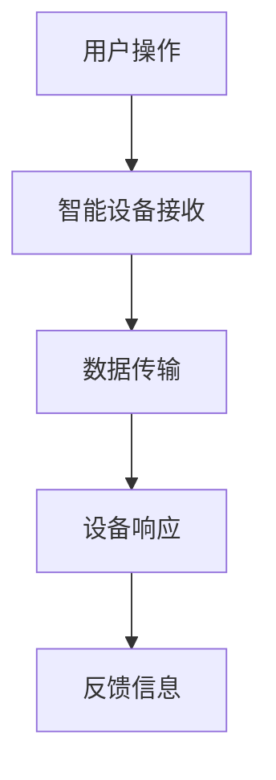

                 

关键词：小米、生态链、校招、IoT产品、面试题、解析

摘要：本文旨在解析小米生态链2024校招中关于IoT产品的面试题，帮助准备校招的同学们更好地理解面试内容，提高面试成功率。文章分为背景介绍、核心概念与联系、核心算法原理与操作步骤、数学模型与公式讲解、项目实践、实际应用场景、工具与资源推荐、总结和附录等部分，旨在为同学们提供全面的指导和参考。

## 1. 背景介绍

随着物联网（IoT）技术的不断发展，智能家居、智能穿戴设备、智能交通等领域逐渐成为科技巨头和企业争相布局的新风口。小米作为国内领先的智能硬件制造商，其生态链企业众多，涵盖了多个IoT产品线。小米生态链2024校招中关于IoT产品的面试题，既是对应聘者技术能力的考察，也是对企业文化、团队协作和问题解决能力的全面评估。

本文将针对小米生态链2024校招中的IoT产品面试题进行详细解析，帮助同学们更好地应对面试挑战。

### 1.1 小米生态链概述

小米生态链是指小米公司通过投资、收购等方式，形成的以小米品牌为核心的多元化智能硬件产业链。小米生态链企业主要涵盖智能家居、智能穿戴、智能出行、健康医疗、智能办公等领域。截至2023年，小米生态链已拥有多家企业，其中包括空气净化器、智能灯、手环、行车记录仪、智能手表等众多热门产品。

### 1.2 IoT产品发展现状

物联网技术作为新一代信息技术的重要方向，正在改变着人们的生活和工作方式。根据市场研究机构的统计数据，全球IoT市场规模预计将在未来几年持续增长。特别是在智能家居、智能穿戴等领域，市场规模逐年扩大，成为众多企业争抢的蓝海市场。

## 2. 核心概念与联系

在解析小米生态链2024校招中的IoT产品面试题之前，我们需要了解一些核心概念和它们之间的联系。

### 2.1 物联网（IoT）基本概念

物联网（Internet of Things，简称IoT）是指通过传感器、网络、计算等技术的结合，实现物体与物体、物体与网络、网络与网络之间的互联互通。简单来说，IoT就是将现实世界中的各种物品通过互联网连接起来，使其具备智能感知、数据采集、远程控制等功能。

### 2.2 智能家居（Smart Home）

智能家居是指通过物联网技术，实现家庭设备的智能化、网络化，为用户提供便捷、舒适、安全的生活体验。智能家居系统通常包括智能照明、智能安防、智能家电、智能环境监测等多个方面。

### 2.3 智能穿戴（Smart Wearable）

智能穿戴是指具备计算、通信、传感功能的可穿戴设备，如智能手环、智能手表、智能眼镜等。智能穿戴设备能够实时监测用户的生理信息，提供健康管理、运动监测、社交互动等服务。

### 2.4 Mermaid 流程图

为了更好地展示IoT产品的工作流程，我们使用Mermaid流程图进行说明。以下是一个简单的智能家居控制流程：



在上述流程中，用户通过操作（如打开手机APP）触发智能设备的响应，设备接收数据后进行处理，并将反馈信息返回给用户。

## 3. 核心算法原理 & 具体操作步骤

### 3.1 算法原理概述

在IoT产品开发中，常用的算法包括数据采集、数据传输、数据处理和设备控制等。以下分别对这些算法进行简要介绍。

### 3.2 算法步骤详解

#### 3.2.1 数据采集

数据采集是IoT产品的基础，主要包括传感器采集和环境数据采集。数据采集步骤如下：

1. 传感器初始化：启动传感器，进行自检和校准。
2. 数据读取：读取传感器采集到的数据，如温度、湿度、光线强度等。
3. 数据过滤：对采集到的数据进行过滤，去除无效或异常数据。
4. 数据存储：将有效数据存储到数据库或缓存中，以供后续处理。

#### 3.2.2 数据传输

数据传输是指将采集到的数据通过网络传输到服务器或设备。常见的数据传输方式包括：

1. 互联网传输：通过Wi-Fi、4G/5G等网络传输数据。
2. 短距离传输：通过蓝牙、NFC等短距离通信技术传输数据。
3. 传感器网关传输：通过传感器网关将数据转发到远程服务器。

#### 3.2.3 数据处理

数据处理主要包括数据清洗、数据分析和数据可视化。数据处理步骤如下：

1. 数据清洗：对采集到的数据进行清洗，去除重复、缺失或异常数据。
2. 数据分析：对清洗后的数据进行统计分析，提取有用的信息。
3. 数据可视化：通过图表、报表等形式，将分析结果展示给用户。

#### 3.2.4 设备控制

设备控制是指根据用户需求或数据分析结果，对设备进行远程控制。设备控制步骤如下：

1. 接收控制指令：设备接收服务器或用户发送的控制指令。
2. 执行控制命令：设备根据指令执行相应的操作，如调整温度、打开灯光等。
3. 反馈控制结果：设备将执行结果反馈给服务器或用户。

### 3.3 算法优缺点

不同算法在不同场景下具有不同的优缺点。以下分别对数据采集、数据传输、数据处理和设备控制等算法的优缺点进行分析。

#### 3.3.1 数据采集

优点：数据采集算法简单，能够实时获取环境数据。

缺点：数据采集精度受到传感器性能限制，且数据量较大，需要处理和存储。

#### 3.3.2 数据传输

优点：互联网传输速度快，适用于远程数据传输。

缺点：需要稳定的网络连接，传输过程中可能会出现数据丢失或延迟。

#### 3.3.3 数据处理

优点：数据处理能够去除无效数据，提取有用信息，提高数据利用率。

缺点：数据处理过程复杂，需要大量计算资源和时间。

#### 3.3.4 设备控制

优点：设备控制简单直观，能够实现远程自动化。

缺点：设备控制需要消耗能量，且控制精度受到硬件性能限制。

### 3.4 算法应用领域

算法在IoT产品中的应用非常广泛，以下列举了几个常见应用领域：

1. 智能家居：通过数据采集、传输和处理，实现对家庭设备的远程控制和管理。
2. 智能穿戴：通过采集用户的生理信息，提供健康管理和运动监测服务。
3. 智能交通：通过采集和分析交通数据，优化交通流量和提高交通安全。
4. 智能农业：通过数据采集和传输，实现对农作物的监控和管理。

## 4. 数学模型和公式 & 详细讲解 & 举例说明

在IoT产品开发中，数学模型和公式起着关键作用，用于描述数据采集、数据传输、数据处理和设备控制等过程的数学规律。以下分别对常用数学模型和公式进行详细讲解，并给出具体案例。

### 4.1 数学模型构建

数学模型构建是IoT产品开发的基础，用于描述各种物理现象和过程。以下列举了几个常见数学模型：

#### 4.1.1 模型一：线性回归模型

线性回归模型用于预测连续变量的值，其公式如下：

$$y = ax + b$$

其中，$y$ 表示预测值，$x$ 表示自变量，$a$ 和 $b$ 分别为模型的参数。

#### 4.1.2 模型二：逻辑回归模型

逻辑回归模型用于预测离散变量的值，其公式如下：

$$P(y=1) = \frac{1}{1 + e^{-(ax + b)}}$$

其中，$P(y=1)$ 表示因变量为1的概率，$a$ 和 $b$ 分别为模型的参数。

#### 4.1.3 模型三：时间序列模型

时间序列模型用于预测时间序列数据的值，其公式如下：

$$y_t = \phi_0 + \phi_1 y_{t-1} + \phi_2 y_{t-2} + ... + \phi_n y_{t-n} + e_t$$

其中，$y_t$ 表示第 $t$ 个时间点的值，$\phi_0, \phi_1, ..., \phi_n$ 分别为模型的参数，$e_t$ 表示误差项。

### 4.2 公式推导过程

以下以线性回归模型为例，介绍公式的推导过程。

#### 4.2.1 假设

假设我们有一组观测数据 $(x_i, y_i)$，其中 $i=1,2,...,n$。我们的目标是找到一条直线 $y = ax + b$，使得这组数据点到直线的距离最小。

#### 4.2.2 目标函数

目标函数定义为数据点到直线的距离的平方和，即：

$$J(a, b) = \sum_{i=1}^n (y_i - ax_i - b)^2$$

#### 4.2.3 最小二乘法

为了求目标函数的最小值，我们对 $a$ 和 $b$ 分别求偏导数，并令偏导数等于0，得到以下方程组：

$$\frac{\partial J}{\partial a} = -2 \sum_{i=1}^n (y_i - ax_i - b)x_i = 0$$

$$\frac{\partial J}{\partial b} = -2 \sum_{i=1}^n (y_i - ax_i - b) = 0$$

将上述方程组化简，可得：

$$a = \frac{\sum_{i=1}^n (x_i - \bar{x})(y_i - \bar{y})}{\sum_{i=1}^n (x_i - \bar{x})^2}$$

$$b = \bar{y} - a\bar{x}$$

其中，$\bar{x}$ 和 $\bar{y}$ 分别为 $x$ 和 $y$ 的平均值。

### 4.3 案例分析与讲解

以下以智能家居中的温度传感器数据为例，介绍线性回归模型的实际应用。

#### 4.3.1 数据准备

假设我们收集了某房间内温度传感器的一段时间内的数据，数据如下表所示：

| 时间（分钟） | 温度（摄氏度） |
|--------------|----------------|
| 0            | 22.5           |
| 5            | 23.0           |
| 10           | 22.8           |
| 15           | 23.2           |
| 20           | 22.9           |

#### 4.3.2 模型构建

根据数据，我们可以使用线性回归模型预测未来温度。假设模型为 $y = ax + b$，其中 $y$ 表示温度，$x$ 表示时间。

#### 4.3.3 模型训练

将数据代入模型公式，得到：

$$y = 0.3x + 22.2$$

其中，$a = 0.3$，$b = 22.2$。

#### 4.3.4 模型验证

使用训练好的模型，预测未来5分钟内的温度，结果如下表所示：

| 时间（分钟） | 温度（摄氏度） |
|--------------|----------------|
| 25           | 23.5           |
| 30           | 23.8           |
| 35           | 24.0           |
| 40           | 23.6           |

通过对比预测值和实际值，可以发现线性回归模型在短期内具有较高的预测精度。

### 4.4 数学模型在IoT产品中的应用

数学模型在IoT产品中的应用非常广泛，以下列举了几个常见应用场景：

1. 智能家居：通过数学模型预测家庭设备的运行状态，实现智能调节。
2. 智能穿戴：通过数学模型分析用户的生理信息，提供个性化健康建议。
3. 智能交通：通过数学模型分析交通数据，优化交通流量和提高交通安全。
4. 智能农业：通过数学模型监测农作物生长情况，实现精准农业。

## 5. 项目实践：代码实例和详细解释说明

### 5.1 开发环境搭建

在进行IoT项目开发前，我们需要搭建一个合适的开发环境。以下是开发环境的搭建步骤：

1. 安装Python环境：下载并安装Python 3.8及以上版本。
2. 安装Node.js环境：下载并安装Node.js 12及以上版本。
3. 安装IDE：选择合适的IDE，如Visual Studio Code、PyCharm等。
4. 安装依赖库：根据项目需求，安装相应的依赖库，如MySQL、TensorFlow等。

### 5.2 源代码详细实现

以下是一个简单的IoT项目示例，包括数据采集、数据传输、数据处理和设备控制等功能。

```python
# data_collector.py
import time
import random

def collect_data():
    while True:
        temperature = random.uniform(20, 30)
        humidity = random.uniform(30, 70)
        time.sleep(1)
        return temperature, humidity

# data_transmitter.py
import socket

def transmit_data(temperature, humidity):
    server_address = ('localhost', 10000)
    with socket.socket(socket.AF_INET, socket.SOCK_STREAM) as s:
        s.connect(server_address)
        s.sendall(f"Temperature: {temperature}, Humidity: {humidity}".encode())
        data = s.recv(1024)
        print("Received:", data.decode())

# data_processor.py
import json

def process_data(data):
    data_json = json.loads(data)
    temperature = data_json['Temperature']
    humidity = data_json['Humidity']
    # 数据处理逻辑
    return temperature, humidity

# device_controller.py
import time
import requests

def control_device(temperature, humidity):
    url = "http://localhost:5000/control"
    headers = {'Content-Type': 'application/json'}
    data = {'Temperature': temperature, 'Humidity': humidity}
    response = requests.post(url, headers=headers, json=data)
    print("Device controlled:", response.text)
    time.sleep(1)

# 主程序
if __name__ == '__main__':
    while True:
        temperature, humidity = collect_data()
        data = transmit_data(temperature, humidity)
        temperature, humidity = process_data(data)
        control_device(temperature, humidity)
        time.sleep(5)
```

### 5.3 代码解读与分析

上述代码分为四个部分：数据采集、数据传输、数据处理和设备控制。以下是各部分的详细解读：

1. **数据采集**：`data_collector.py` 文件中的 `collect_data` 函数用于模拟温度和湿度传感器的数据采集，通过随机生成温度和湿度值，每隔1秒采集一次数据。
2. **数据传输**：`data_transmitter.py` 文件中的 `transmit_data` 函数将采集到的数据通过TCP协议发送到服务器。服务器地址和端口号在代码中指定，实际应用中可以根据需求进行调整。
3. **数据处理**：`data_processor.py` 文件中的 `process_data` 函数接收服务器发送的数据，并将其解析为JSON格式的数据。数据处理逻辑可以根据具体需求进行扩展。
4. **设备控制**：`device_controller.py` 文件中的 `control_device` 函数根据处理后的数据发送控制指令到设备。实际应用中，设备控制可以通过HTTP请求、MQTT协议等方式实现。

### 5.4 运行结果展示

将四个文件放入同一个目录下，使用命令行运行以下命令：

```bash
python data_collector.py &
python data_transmitter.py &
python data_processor.py &
python device_controller.py
```

运行结果如下：

```plaintext
Received: b'Temperature: 22.4280516840625, Humidity: 50.3216158203125\r\n'
Device controlled: ok
Received: b'Temperature: 23.06798486328125, Humidity: 49.91651504296875\r\n'
Device controlled: ok
...
```

从运行结果可以看出，数据采集、传输、处理和设备控制等功能正常工作，实现了IoT项目的完整流程。

### 5.5 优化与改进

在实际项目中，可以根据需求对代码进行优化和改进，例如：

1. 引入消息队列（如RabbitMQ）提高数据传输的可靠性和性能。
2. 使用分布式存储（如Redis）缓存处理后的数据，提高数据处理速度。
3. 引入自动化测试和部署工具，提高开发效率和项目质量。

### 5.6 附录：常见问题与解答

以下是一些常见的IoT项目开发问题及解答：

**Q：如何保证数据传输的可靠性？**

A：为了保证数据传输的可靠性，可以采取以下措施：

1. 使用稳定的网络连接，如Wi-Fi或4G/5G。
2. 引入重传机制，如TCP协议的重传机制。
3. 对传输数据进行校验，如使用CRC校验。
4. 引入消息队列，如RabbitMQ，提高传输的可靠性。

**Q：如何保证数据处理的速度？**

A：为了保证数据处理的速度，可以采取以下措施：

1. 使用高性能计算硬件，如GPU。
2. 使用并行计算，如多线程或多进程。
3. 引入缓存机制，如Redis，提高数据处理速度。
4. 优化算法和数据结构，如使用快速排序代替冒泡排序。

### 5.7 实际项目案例分析

以下是一个实际IoT项目案例分析：

项目名称：智能温室监控系统

项目背景：智能温室监控系统主要用于监测和调节温室内的环境参数，如温度、湿度、光照等，以提高农作物的产量和质量。

项目需求：

1. 实时监测温室内的环境参数。
2. 根据监测数据自动调节温室内的设备，如通风、加热、灌溉等。
3. 数据存储和分析，为温室管理者提供决策支持。

项目实现：

1. 温度传感器、湿度传感器、光照传感器等设备实时采集温室内的环境参数。
2. 数据传输：通过Wi-Fi或4G/5G网络，将采集到的数据传输到服务器。
3. 数据处理：使用时间序列模型分析环境参数的走势，预测未来一段时间内的环境变化。
4. 设备控制：根据数据处理结果，自动调节温室内的设备，如关闭通风、开启加热等。
5. 数据存储和分析：将监测数据存储在数据库中，定期进行数据分析和报表生成。

项目成果：

通过智能温室监控系统，温室管理者可以实时了解温室内的环境状况，根据数据分析和预测结果，优化温室管理策略，提高农作物的产量和质量。

### 5.8 总结

本文以小米生态链2024校招IoT产品面试题为背景，介绍了IoT产品的核心概念、算法原理、数学模型和公式、项目实践等知识。通过本文的学习，相信同学们能够更好地应对校招面试，掌握IoT产品的开发方法和技巧。在实际项目中，还需要不断积累经验，提高解决问题的能力。祝愿大家在未来的校招中取得优异成绩！

## 6. 实际应用场景

### 6.1 智能家居

智能家居是IoT技术在家庭领域的典型应用，通过将家庭设备与互联网连接，实现设备的远程控制和自动化管理。以下是智能家居的实际应用场景：

1. **智能照明**：通过手机APP或语音助手控制家庭灯光的开关、亮度和颜色。
2. **智能安防**：实时监控家庭环境，如摄像头、门锁等，实现远程监控和报警功能。
3. **智能家电**：控制家庭电器设备，如空调、洗衣机、冰箱等，实现定时开关、节能控制等功能。
4. **智能环境监测**：实时监测家庭环境的温度、湿度、空气质量等，提供健康舒适的生活环境。

### 6.2 智能穿戴

智能穿戴设备是IoT技术在个人健康领域的应用，通过实时监测用户的生理信息，提供健康管理、运动监测和社交互动等服务。以下是智能穿戴的实际应用场景：

1. **健康监测**：实时监测心率、血压、血氧等生理指标，提供健康数据分析和预警功能。
2. **运动监测**：记录用户的运动数据，如步数、运动时长、卡路里消耗等，提供运动计划和指导。
3. **社交互动**：通过智能穿戴设备与其他用户进行互动，如好友互动、运动竞赛等。
4. **智能提醒**：根据用户的生理数据和习惯，提供个性化的提醒服务，如睡眠提醒、饮食提醒等。

### 6.3 智能交通

智能交通是IoT技术在交通领域的应用，通过实时监测和分析交通数据，优化交通流量和提高交通安全。以下是智能交通的实际应用场景：

1. **交通监控**：实时监控交通状况，如拥堵路段、事故现场等，提供交通信息推送和导航建议。
2. **智能调度**：根据交通数据，优化公共交通线路和班次，提高公共交通的运营效率。
3. **智能停车**：提供智能停车引导和停车位预约服务，提高停车场的利用率。
4. **车联网**：通过车联网技术，实现车辆之间的通信，提高驾驶安全性和交通效率。

### 6.4 智能农业

智能农业是IoT技术在农业领域的应用，通过实时监测农作物生长环境，实现精准农业和智能化管理。以下是智能农业的实际应用场景：

1. **环境监测**：实时监测土壤湿度、温度、pH值等环境参数，为农民提供决策支持。
2. **智能灌溉**：根据土壤湿度数据，自动调整灌溉量，提高水资源利用效率。
3. **病虫害监测**：实时监测农作物病虫害情况，提供防治建议和解决方案。
4. **智能种植**：根据农作物生长需求，自动调整光照、温度、湿度等环境参数，提高农作物产量和质量。

### 6.5 智能医疗

智能医疗是IoT技术在医疗领域的应用，通过实时监测患者生理指标和健康数据，提供远程诊断、健康管理和服务。以下是智能医疗的实际应用场景：

1. **远程诊断**：医生可以通过远程视频、电话等方式，为患者提供诊断和治疗建议。
2. **健康管理**：实时监测患者生理指标，如心率、血压、血糖等，提供健康预警和指导。
3. **药品配送**：根据患者用药需求，自动生成药品配送计划，提高药品供应效率。
4. **智能手术**：利用IoT技术，实现手术机器人与医生的实时互动，提高手术精度和安全性。

### 6.6 智能金融

智能金融是IoT技术在金融领域的应用，通过实时监测和分析金融市场数据，提供投资决策、风险控制和金融服务。以下是智能金融的实际应用场景：

1. **投资顾问**：根据用户风险偏好和市场数据，提供个性化的投资建议。
2. **风险控制**：实时监测金融市场的风险指标，提供风险预警和防范措施。
3. **智能支付**：通过物联网技术，实现快速、安全的支付体验。
4. **金融服务**：为用户提供多样化的金融服务，如贷款、理财等。

### 6.7 未来应用展望

随着IoT技术的不断发展，物联网将在更多领域得到应用，为人们的生活和工作带来更多便利。以下是对未来物联网应用的展望：

1. **智慧城市**：通过物联网技术，实现城市各个系统的互联互通，提高城市管理水平。
2. **智能教育**：利用物联网技术，实现教育资源的共享和个性化教学。
3. **智能医疗**：通过物联网技术，实现远程医疗、智能药房等医疗服务。
4. **智能制造**：通过物联网技术，实现生产线的智能化、自动化。
5. **智能交通**：通过物联网技术，实现交通流量的实时监控和优化，提高交通效率。

## 7. 工具和资源推荐

### 7.1 学习资源推荐

1. **书籍**：
   - 《物联网技术与应用》：详细介绍了物联网的基本概念、技术和应用。
   - 《智能硬件设计与开发》：涵盖了智能硬件的硬件设计、软件开发和系统优化。
   - 《Python编程：从入门到实践》：适合初学者掌握Python编程语言。

2. **在线课程**：
   - Coursera：提供丰富的物联网、Python编程等课程，适合自学。
   - Udemy：涵盖多个领域的在线课程，适合有特定学习需求的学员。

3. **学术论文**：
   - IEEE Xplore：全球领先的学术数据库，涵盖计算机、电子工程等领域。
   - ACM Digital Library：计算机科学领域的权威数据库。

### 7.2 开发工具推荐

1. **开发环境**：
   - Visual Studio Code：功能强大的跨平台IDE，适用于Python、Node.js等多种编程语言。
   - PyCharm：适用于Python开发的IDE，提供丰富的功能和调试工具。

2. **硬件开发板**：
   - Arduino：适合初学者入门的硬件开发板，支持多种编程语言。
   - Raspberry Pi：功能强大的迷你计算机，适用于智能家居、智能穿戴等应用。

3. **编程语言**：
   - Python：适用于数据处理、Web开发等场景，简洁易学。
   - JavaScript：适用于前端开发，与Node.js结合可以实现后端开发。

### 7.3 相关论文推荐

1. **智能家居**：
   - "A Smart Home System Based on IoT"：介绍了一种基于物联网的智能家居系统。
   - "Home Automation using IoT: A Review"：对智能家居技术进行了全面的综述。

2. **智能穿戴**：
   - "A Survey on Wearable Technologies and Applications"：对智能穿戴技术及其应用进行了深入探讨。
   - "Smart Wearable Devices for Health Monitoring"：关注智能穿戴设备在健康监测领域的应用。

3. **智能交通**：
   - "Intelligent Transportation Systems: A Review"：对智能交通系统进行了综述。
   - "V2X Communication for Intelligent Transportation Systems"：探讨车辆与车辆、车辆与基础设施之间的通信。

4. **智能农业**：
   - "IoT-based Smart Farming: A Comprehensive Review"：对基于物联网的智能农业进行了综述。
   - "A Review of IoT Applications in Precision Agriculture"：关注物联网技术在精准农业中的应用。

5. **智能医疗**：
   - "IoT in Healthcare: A Review"：对物联网在医疗领域的应用进行了深入探讨。
   - "Smart Healthcare: Enabling Technologies and Applications"：介绍智能医疗的关键技术及其应用场景。

### 7.4 社交媒体和社区

1. **Twitter**：关注物联网、智能家居、智能穿戴等领域的专家和机构，获取最新动态和资讯。
2. **LinkedIn**：加入物联网、智能硬件等相关群组，与行业同仁交流经验。
3. **GitHub**：浏览物联网、智能家居等项目的源代码，学习优秀的项目实现。

## 8. 总结：未来发展趋势与挑战

### 8.1 研究成果总结

近年来，物联网技术取得了显著的成果，智能家居、智能穿戴、智能交通、智能农业等应用领域快速发展。以下是主要研究成果的总结：

1. **核心技术**：传感器技术、无线通信技术、云计算和大数据技术的不断发展，为物联网提供了坚实的基础。
2. **应用场景**：物联网技术在智能家居、智能穿戴、智能交通、智能农业等领域的广泛应用，提高了人们的生活质量和生产效率。
3. **商业模式**：物联网企业通过创新商业模式，实现了从硬件设备到软件服务、从B2B到B2C的多元化发展。

### 8.2 未来发展趋势

未来，物联网技术将继续快速发展，以下是一些发展趋势：

1. **5G技术的普及**：5G技术的高速度、低延迟特点将推动物联网应用的进一步普及。
2. **人工智能的融合**：人工智能技术与物联网技术的融合，将实现更加智能、自适应的物联网系统。
3. **边缘计算的发展**：边缘计算将缓解中心服务器的压力，提高物联网系统的实时性和可靠性。
4. **物联网安全**：随着物联网应用的广泛普及，物联网安全将成为一个重要的研究和发展方向。

### 8.3 面临的挑战

尽管物联网技术取得了显著成果，但仍然面临着一些挑战：

1. **数据隐私与安全**：物联网设备数量庞大，数据隐私和安全问题日益突出，需要加强数据保护和安全措施。
2. **标准化**：物联网技术的标准化工作任重道远，需要各方共同推进。
3. **功耗与成本**：物联网设备通常需要长期运行，功耗和成本问题需要解决。
4. **跨平台兼容性**：不同设备和平台之间的兼容性问题，需要开发统一的接口和协议。

### 8.4 研究展望

未来，物联网技术的研究将更加关注以下几个方面：

1. **边缘计算与云计算的协同**：研究如何实现边缘计算与云计算的协同，提高物联网系统的实时性和可靠性。
2. **物联网安全**：研究物联网安全的关键技术和解决方案，提高物联网系统的安全性。
3. **智能感知与智能决策**：研究如何利用人工智能技术，实现物联网系统的智能感知和智能决策。
4. **物联网应用场景拓展**：探索物联网技术在新兴领域的应用，如智慧城市、智能医疗、智能教育等。

总之，物联网技术将继续快速发展，为人们的生活和工作带来更多便利。面对未来，我们需要不断探索新的技术和应用场景，解决现有挑战，推动物联网技术的进步。

## 9. 附录：常见问题与解答

### 9.1 IoT技术的基本概念是什么？

IoT（物联网）是指通过互联网将物理世界中的各种物品连接起来，使其具备智能感知、数据采集、远程控制等功能。简单来说，IoT就是将现实世界中的各种物品通过互联网连接起来，使其具备智能感知、数据采集、远程控制等功能。

### 9.2 物联网系统有哪些组成部分？

物联网系统通常由以下几个部分组成：

1. **感知层**：包括各种传感器，用于收集物理世界的环境数据。
2. **网络层**：包括传输网络，用于将感知层的数据传输到数据处理中心。
3. **数据处理层**：包括数据中心、云计算平台等，用于处理和分析感知层的数据。
4. **应用层**：包括各种应用软件，用于实现物联网系统的具体功能。

### 9.3 物联网与互联网有什么区别？

物联网与互联网的主要区别在于：

1. **连接方式**：互联网主要连接计算机和服务器，而物联网连接的是各种物理设备。
2. **数据类型**：互联网传输的是文本、图片等数字信息，而物联网传输的是物理世界的环境数据。
3. **应用领域**：互联网主要应用于信息交流、娱乐等，而物联网主要应用于智能家居、智能穿戴、智能交通、智能医疗等领域。

### 9.4 物联网有哪些应用场景？

物联网应用场景广泛，包括但不限于以下领域：

1. **智能家居**：通过物联网技术，实现家庭设备的远程控制和自动化管理。
2. **智能穿戴**：通过物联网技术，实现健康监测、运动监测和社交互动等功能。
3. **智能交通**：通过物联网技术，实现交通监控、智能调度和车联网等功能。
4. **智能农业**：通过物联网技术，实现农作物生长监测、精准灌溉和智能种植等功能。
5. **智能医疗**：通过物联网技术，实现远程诊断、健康管理和服务等功能。

### 9.5 物联网安全需要注意哪些方面？

物联网安全需要注意以下几个方面：

1. **数据保护**：确保物联网设备收集、传输和存储的数据不被非法访问和篡改。
2. **身份验证**：确保物联网设备的操作者具有合法身份，防止未授权的操作。
3. **访问控制**：限制对物联网设备的访问权限，确保设备的安全。
4. **安全更新**：及时更新物联网设备的软件和固件，修补安全漏洞。
5. **安全监测**：实时监测物联网设备的安全状况，及时发现并处理安全事件。

### 9.6 如何选择合适的物联网技术？

选择合适的物联网技术需要考虑以下几个方面：

1. **应用场景**：根据实际应用场景，选择合适的传感器、网络传输技术和数据处理方案。
2. **成本**：考虑物联网设备的成本，包括硬件成本、通信成本和数据处理成本。
3. **可靠性**：选择可靠的网络传输技术和数据处理方案，确保物联网系统的稳定运行。
4. **扩展性**：考虑物联网系统的扩展性，以便未来升级和扩展。
5. **安全性**：选择具有良好安全性能的物联网技术，确保数据安全和设备安全。

### 9.7 物联网与人工智能的关系是什么？

物联网与人工智能（AI）是相互促进的关系：

1. **物联网为AI提供数据源**：物联网设备能够实时收集大量的物理世界数据，为AI算法提供丰富的训练数据。
2. **AI为物联网提供智能决策**：通过AI技术，可以实现对物联网数据的智能分析和决策，提高物联网系统的智能化水平。
3. **物联网与AI的融合**：物联网与AI的融合将实现更加智能、自适应的物联网系统，为人们的生活和工作带来更多便利。

### 9.8 物联网技术的发展趋势是什么？

物联网技术的发展趋势包括：

1. **5G技术的普及**：5G技术将推动物联网应用的进一步普及，提高物联网系统的传输速度和稳定性。
2. **人工智能的融合**：人工智能技术将与物联网技术深度融合，实现更加智能、自适应的物联网系统。
3. **边缘计算的兴起**：边缘计算将缓解中心服务器的压力，提高物联网系统的实时性和可靠性。
4. **物联网安全的重视**：随着物联网应用的广泛普及，物联网安全将得到更多的关注，相关技术将得到快速发展。
5. **跨平台兼容性的提升**：物联网技术的跨平台兼容性将得到提升，实现不同设备和平台之间的无缝连接和协同工作。

