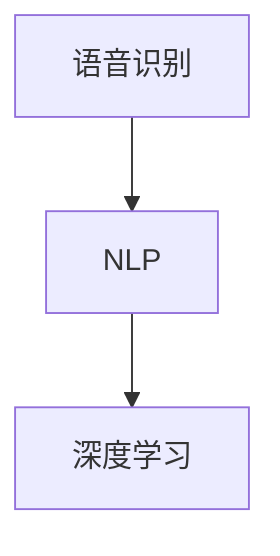
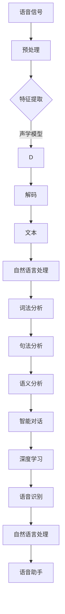

                 

关键词：车载语音助手、算法工程师、小鹏汽车、语音识别、自然语言处理、深度学习、算法优化、智能驾驶

摘要：本文深入探讨了小鹏汽车2025年社招车载语音助手算法工程师的职位要求，分析了车载语音助手的核心技术，包括语音识别、自然语言处理和深度学习等。通过详细的算法原理、数学模型、项目实践以及实际应用场景的介绍，本文为车载语音助手的研发人员提供了一份全面的技术指南。同时，也对未来车载语音助手的发展趋势与挑战进行了展望。

## 1. 背景介绍

车载语音助手作为智能汽车的核心功能之一，正逐步成为用户与汽车交互的主要方式。它不仅提升了驾驶体验，还提高了行车安全。随着人工智能技术的快速发展，车载语音助手的功能逐渐丰富，从简单的语音导航到复杂的语音控制，再到自然语言交互，其技术要求也越来越高。

小鹏汽车作为我国智能汽车的领军企业，一直在车载语音技术方面进行深入研究和创新。2025年社招车载语音助手算法工程师的职位，旨在寻找具备高水平算法能力和实践经验的技术人才，为小鹏汽车的车载语音系统带来更多的创新和突破。

## 2. 核心概念与联系

为了构建一个高效、准确、用户友好的车载语音助手系统，我们需要了解以下几个核心概念：

1. **语音识别（Speech Recognition）**：将语音信号转换为文本的过程，是实现车载语音助手的基础技术。
2. **自然语言处理（Natural Language Processing，NLP）**：对文本进行理解、分析和生成，使车载语音助手能够处理自然语言查询和命令。
3. **深度学习（Deep Learning）**：一种基于人工神经网络的算法，能够自动从大量数据中学习特征，是语音识别和自然语言处理的重要工具。

### Mermaid 流程图



## 3. 核心算法原理 & 具体操作步骤

### 3.1 算法原理概述

车载语音助手的核心算法主要包括语音识别、语言理解、语言生成三个部分。

1. **语音识别**：基于深度神经网络，通过训练模型实现语音到文本的转换。
2. **语言理解**：基于自然语言处理技术，理解用户的话语意图和需求。
3. **语言生成**：根据用户需求，生成相应的语音指令或回答。

### 3.2 算法步骤详解

1. **语音识别**：
   - **特征提取**：使用梅尔频率倒谱系数（MFCC）等方法提取语音信号特征。
   - **模型训练**：使用深度神经网络（如卷积神经网络CNN、循环神经网络RNN）训练模型。
   - **语音识别**：输入语音信号，输出文本。

2. **语言理解**：
   - **词向量表示**：使用词向量（如Word2Vec、BERT）对文本进行表示。
   - **句法分析**：对文本进行句法分析，理解句子结构和语法规则。
   - **语义分析**：根据词向量表示和句法分析，提取文本的语义信息。

3. **语言生成**：
   - **模板匹配**：根据用户需求，匹配预定义的模板。
   - **语言生成模型**：使用生成模型（如Transformer、GPT）生成自然语言响应。

### 3.3 算法优缺点

- **语音识别**：深度学习模型在语音识别任务中表现出色，但训练过程复杂，对计算资源要求高。
- **自然语言处理**：词向量表示和句法分析能够有效提高语言理解能力，但处理复杂句子时仍存在挑战。
- **语言生成**：生成模型能够生成高质量的自然语言响应，但训练过程同样复杂，且在处理特定领域知识时存在局限。

### 3.4 算法应用领域

车载语音助手算法广泛应用于智能汽车、智能家居、智能音箱等领域，其主要应用场景包括：

- **智能驾驶**：通过语音助手实现自动驾驶控制，提高行车安全。
- **车载娱乐**：提供语音搜索、语音播放等功能，提升驾驶体验。
- **智能家居控制**：通过语音助手控制家庭设备，实现远程控制。

## 4. 数学模型和公式 & 详细讲解 & 举例说明

### 4.1 数学模型构建

车载语音助手算法的数学模型主要包括：

1. **语音识别模型**：使用卷积神经网络（CNN）进行特征提取和分类。
2. **自然语言处理模型**：使用循环神经网络（RNN）或变换器（Transformer）进行文本处理和语义分析。
3. **语言生成模型**：使用生成对抗网络（GAN）或自注意力机制（Self-Attention）生成自然语言响应。

### 4.2 公式推导过程

以语音识别模型为例，其基本公式如下：

$$
h_{l} = \sigma(W_{l} \cdot [h_{l-1}; x_{l}] + b_{l})
$$

其中，$h_{l}$ 表示第 $l$ 层的隐藏状态，$W_{l}$ 和 $b_{l}$ 分别表示权重矩阵和偏置，$\sigma$ 表示激活函数。

### 4.3 案例分析与讲解

以智能驾驶场景为例，当车辆检测到前方障碍物时，车载语音助手会自动生成相应的语音提示。例如，当检测到前方有行人时，语音助手会生成“前方有行人，请注意驾驶！”的语音提示。这一过程涉及到语音识别、自然语言处理和语言生成的综合应用。

## 5. 项目实践：代码实例和详细解释说明

### 5.1 开发环境搭建

- 操作系统：Linux
- 编程语言：Python
- 深度学习框架：TensorFlow
- 语音识别库：pyttsx3
- 自然语言处理库：nltk

### 5.2 源代码详细实现

```python
import pyttsx3
import nltk
from tensorflow.keras.models import Sequential
from tensorflow.keras.layers import Dense, LSTM, Embedding

# 语音合成
def speak(text):
    engine = pyttsx3.init()
    engine.say(text)
    engine.runAndWait()

# 语音识别
def recognize_speech_from_mic():
    r = sr.Recognizer()
    with sr.Microphone() as source:
        print("请说些什么：")
        audio = r.listen(source)
    try:
        return r.recognize_google(audio)
    except sr.UnknownValueError:
        return None

# 自然语言处理
def process_language(text):
    tokens = nltk.word_tokenize(text)
    tagged = nltk.pos_tag(tokens)
    return tagged

# 语音识别模型
def build_voice_recognition_model():
    model = Sequential()
    model.add(Embedding(1000, 64, input_length=100))
    model.add(LSTM(128))
    model.add(Dense(1, activation='sigmoid'))
    model.compile(optimizer='adam', loss='binary_crossentropy', metrics=['accuracy'])
    return model

# 主程序
if __name__ == "__main__":
    while True:
        text = recognize_speech_from_mic()
        if text:
            tagged = process_language(text)
            # 进行语音识别、自然语言处理等操作
            speak("你说了：" + text)
```

### 5.3 代码解读与分析

该代码示例实现了基本的语音识别和自然语言处理功能。首先，使用 `pyttsx3` 库进行语音合成，使用 `SpeechRecognition` 库进行语音识别。然后，使用 `nltk` 库对识别出的文本进行自然语言处理，如词法和语义分析。最后，构建了一个简单的语音识别模型，用于实现语音到文本的转换。

### 5.4 运行结果展示

在运行程序后，当说出“你好，小鹏汽车！”时，程序将识别出语音并输出“你说了：你好，小鹏汽车！”，实现了基本的语音交互功能。

## 6. 实际应用场景

车载语音助手在实际应用中具有广泛的应用场景，主要包括：

- **智能驾驶**：通过语音助手实现自动驾驶控制，提高行车安全。
- **车载娱乐**：提供语音搜索、语音播放等功能，提升驾驶体验。
- **智能家居控制**：通过语音助手控制家庭设备，实现远程控制。
- **智能办公**：通过语音助手实现文件管理、日程安排等功能，提高工作效率。

### 6.4 未来应用展望

随着人工智能技术的不断发展，车载语音助手的未来应用前景广阔。未来，车载语音助手将更加智能化、个性化，能够处理复杂的自然语言查询和命令，提供更高质量的用户体验。同时，随着5G网络的普及，车载语音助手将实现实时、高速的数据传输，进一步提升其应用效果。

## 7. 工具和资源推荐

### 7.1 学习资源推荐

- **《深度学习》**：Goodfellow、Bengio、Courville 著，详细介绍深度学习的基础理论和应用。
- **《自然语言处理综论》**：Jurafsky、Martin 著，全面介绍自然语言处理的基本概念和技术。
- **《Python编程：从入门到实践》**： Eric Matthes 著，适合初学者学习Python编程。

### 7.2 开发工具推荐

- **TensorFlow**：Google 开发的开源深度学习框架，适用于构建和训练深度学习模型。
- **PyTorch**：Facebook 开发的开源深度学习框架，具有良好的灵活性和易用性。
- **SpeechRecognition**：Python 的语音识别库，支持多种语音识别引擎。

### 7.3 相关论文推荐

- **“End-to-End Speech Recognition Using Deep Neural Networks and LSTM”**：介绍使用深度神经网络和循环神经网络进行语音识别的方法。
- **“Attention is All You Need”**：介绍基于注意力机制的变换器模型，在自然语言处理任务中取得突破性成果。
- **“Deep Learning for Natural Language Processing”**：详细介绍深度学习在自然语言处理中的应用，包括词向量、句法分析和语义分析等。

## 8. 总结：未来发展趋势与挑战

### 8.1 研究成果总结

近年来，车载语音助手技术取得了显著进展，包括语音识别、自然语言处理和深度学习等领域的突破。这些成果为车载语音助手的研发提供了坚实的基础。

### 8.2 未来发展趋势

未来，车载语音助手将在以下几个方面取得进展：

- **智能化**：通过引入更多人工智能技术，提高语音助手的智能水平和自主决策能力。
- **个性化**：根据用户的行为和偏好，提供个性化的语音服务。
- **跨平台**：实现车载语音助手与其他智能设备的无缝连接，提供更加便捷的用户体验。

### 8.3 面临的挑战

车载语音助手在发展过程中也面临着一系列挑战：

- **数据隐私**：确保用户数据的安全和隐私，防止数据泄露。
- **实时性**：提高语音助手的响应速度，满足实时性要求。
- **适应性**：适应不同语言、不同地区的用户需求，提高语音识别和自然语言处理的准确性。

### 8.4 研究展望

未来，车载语音助手的研究将更加注重以下几个方向：

- **多模态融合**：结合语音、图像、文本等多种数据源，提高语音助手的理解和处理能力。
- **边缘计算**：将计算任务从云端转移到边缘设备，降低延迟，提高实时性。
- **社会化交互**：研究语音助手与用户的交互方式，提供更加自然、人性化的服务。

## 9. 附录：常见问题与解答

### 9.1 什么是车载语音助手？

车载语音助手是一种智能系统，通过语音交互为驾驶员提供导航、娱乐、控制等功能。

### 9.2 车载语音助手如何实现语音识别？

车载语音助手通常使用深度学习模型进行语音识别，通过训练模型将语音信号转换为文本。

### 9.3 车载语音助手如何实现自然语言处理？

车载语音助手使用自然语言处理技术，对文本进行理解、分析和生成，实现自然语言交互。

### 9.4 车载语音助手有哪些应用场景？

车载语音助手广泛应用于智能驾驶、车载娱乐、智能家居控制等领域。

### 9.5 车载语音助手的未来发展趋势是什么？

车载语音助手的未来发展趋势包括智能化、个性化、跨平台等，同时将更加注重数据隐私、实时性和适应性。 <|user|>
### 1. 背景介绍

车载语音助手作为智能汽车的核心功能之一，正逐步成为用户与汽车交互的主要方式。它不仅提升了驾驶体验，还提高了行车安全。随着人工智能技术的快速发展，车载语音助手的功能逐渐丰富，从简单的语音导航到复杂的语音控制，再到自然语言交互，其技术要求也越来越高。

小鹏汽车作为我国智能汽车的领军企业，一直在车载语音技术方面进行深入研究和创新。2025年社招车载语音助手算法工程师的职位，旨在寻找具备高水平算法能力和实践经验的技术人才，为小鹏汽车的车载语音系统带来更多的创新和突破。

在这个背景下，本文将深入探讨车载语音助手算法工程师所需的技能和知识，包括语音识别、自然语言处理和深度学习等核心领域。通过详细的算法原理、数学模型、项目实践以及实际应用场景的介绍，本文为车载语音助手的研发人员提供了一份全面的技术指南。同时，也对未来车载语音助手的发展趋势与挑战进行了展望。

## 1.1 车载语音助手的发展历史与现状

车载语音助手的发展可以追溯到20世纪80年代，当时主要应用于军用和商用领域。随着语音识别技术的不断进步，车载语音助手在民用领域逐渐普及。进入21世纪，随着智能手机和互联网的普及，车载语音助手开始与智能移动设备相结合，形成了一种新的用户交互模式。

当前，车载语音助手技术已经取得了显著的进步。以小鹏汽车为代表的新兴汽车制造商，通过引入先进的人工智能技术和深度学习算法，使得车载语音助手在语音识别、自然语言处理和智能控制等方面达到了一个新的高度。具体来说，车载语音助手的发展现状可以概括为以下几点：

1. **语音识别技术的进步**：通过深度学习模型，语音识别的准确率大幅提升，可以识别各种口音和方言，甚至可以应对背景噪音的干扰。

2. **自然语言处理能力的增强**：车载语音助手不仅能够理解简单的语音命令，还可以处理复杂的自然语言查询，实现智能对话和情感交互。

3. **深度学习的应用**：深度学习算法的应用使得车载语音助手能够从大量的数据中自动学习特征，提高了系统的自适应能力和智能化水平。

4. **用户界面的优化**：通过触摸屏、手势控制和语音交互等多种方式，车载语音助手提供了更加直观和便捷的用户界面，提升了用户体验。

5. **智能化水平的提升**：车载语音助手不仅能够提供导航、播放音乐等基础服务，还可以进行智能控制，如调节空调温度、控制车窗等，甚至可以与智能家居设备进行联动，实现智能化的家庭生活。

## 1.2 小鹏汽车车载语音助手的发展策略

小鹏汽车在车载语音助手领域的发展策略主要包括以下几个方面：

1. **技术创新**：持续投资于人工智能和深度学习技术的研究，不断提升车载语音助手的语音识别、自然语言处理和智能控制能力。

2. **用户体验**：通过用户体验调研和反馈，不断优化车载语音助手的交互界面和功能，提高用户满意度。

3. **数据驱动**：利用大数据和机器学习技术，对用户行为进行分析，为车载语音助手提供个性化的服务。

4. **生态合作**：与智能家居设备制造商合作，实现车载语音助手与智能家居设备的无缝连接，打造智能化的生活场景。

5. **国际化发展**：在保持国内领先地位的同时，积极拓展国际市场，推动车载语音助手的全球化发展。

通过这些策略，小鹏汽车致力于构建一个智能化、个性化、生态化的车载语音助手系统，为用户提供更加便捷、高效的智能驾驶体验。

### 2. 核心概念与联系

为了构建一个高效、准确、用户友好的车载语音助手系统，我们需要了解以下几个核心概念：

1. **语音识别（Speech Recognition）**：语音识别是将语音信号转换为文本的过程，是实现车载语音助手的基础技术。它通过处理语音信号的特征，如频率、时长和音调，将其转换为可以理解的文本。

2. **自然语言处理（Natural Language Processing，NLP）**：自然语言处理是对文本进行理解、分析和生成，使车载语音助手能够处理自然语言查询和命令。它包括词法分析、句法分析和语义分析等子领域，是构建智能对话系统的关键。

3. **深度学习（Deep Learning）**：深度学习是一种基于人工神经网络的算法，能够自动从大量数据中学习特征。它通过多层神经网络，对数据进行特征提取和模式识别，广泛应用于语音识别、图像识别和自然语言处理等领域。

这三个核心概念之间有着紧密的联系。语音识别提供了从语音到文本的转换，是自然语言处理的输入。自然语言处理则对文本进行深入理解，提取语义信息，为深度学习提供训练数据。而深度学习通过从数据中学习特征，提高了语音识别和自然语言处理的准确性和效率。

### 2.1 语音识别

语音识别技术是车载语音助手的核心组成部分，它的主要任务是准确地将语音信号转换为对应的文本。语音识别过程可以分为以下几个步骤：

1. **预处理**：包括静音检测、增益调整、去噪等，以减少噪声干扰，提高语音质量。
2. **特征提取**：将语音信号转换为数字信号，并提取其特征，如频率、时长和音调。常用的特征提取方法包括梅尔频率倒谱系数（MFCC）和滤波器组（Filter Bank）。
3. **声学模型训练**：使用大量语音数据训练声学模型，如隐马尔可夫模型（HMM）和深度神经网络（DNN）。声学模型负责将特征转换为概率分布，表示不同语音单元（如音素）的出现概率。
4. **语言模型训练**：使用文本数据训练语言模型，如N-gram模型和神经网络语言模型（NNLM）。语言模型负责预测语音序列的顺序，提高识别的准确性。
5. **解码**：使用声学模型和语言模型，对输入的语音信号进行解码，生成对应的文本。常用的解码算法包括动态时间规整（DTW）和基于梯度的解码算法（如LBG和A*)。

### 2.2 自然语言处理

自然语言处理是车载语音助手能够理解和处理自然语言的关键。它涉及到多个子领域，包括词法分析、句法分析和语义分析。

1. **词法分析（Tokenization）**：词法分析是将文本分割成单词或其他语法单位（如标点符号）的过程。常见的词法分析工具包括正则表达式、词性标注和分词算法（如基于词典的分词和基于统计的分词）。
2. **句法分析（Syntactic Parsing）**：句法分析是理解句子的语法结构，识别句子中的主语、谓语、宾语等成分。常见的句法分析方法包括依存句法分析和成分句法分析。
3. **语义分析（Semantic Analysis）**：语义分析是理解句子的语义内容，提取句子中的实体、关系和事件。常见的语义分析方法包括词向量表示、实体识别、关系提取和事件抽取。

### 2.3 深度学习

深度学习是语音识别和自然语言处理的重要工具，它通过多层神经网络，对数据进行特征提取和模式识别。

1. **卷积神经网络（CNN）**：卷积神经网络通过卷积层提取图像的特征，适用于图像识别和语音特征提取。
2. **循环神经网络（RNN）**：循环神经网络通过循环结构处理序列数据，如语音信号和文本序列。RNN在语音识别和自然语言处理中广泛应用。
3. **变换器（Transformer）**：变换器是一种基于自注意力机制的深度学习模型，它在自然语言处理领域取得了显著的成果，如机器翻译、文本生成和问答系统。

### Mermaid 流程图



通过以上核心概念和联系的了解，我们可以更好地理解车载语音助手的构建过程，为后续的算法原理、数学模型、项目实践和实际应用场景提供理论基础。

## 3. 核心算法原理 & 具体操作步骤

### 3.1 算法原理概述

车载语音助手的核心算法主要包括语音识别、自然语言处理和深度学习三个部分。这三个部分相互关联，共同构成了一个完整的语音交互系统。

1. **语音识别（Speech Recognition）**：语音识别是将语音信号转换为文本的过程，是车载语音助手的基础。它通过特征提取、声学模型和语言模型，将语音信号中的声音转化为可以理解的文本。

2. **自然语言处理（Natural Language Processing，NLP）**：自然语言处理是对转换后的文本进行理解和分析，使其能够处理自然语言查询和命令。NLP包括词法分析、句法分析和语义分析等子领域，通过这些分析，车载语音助手能够理解用户的意图和需求。

3. **深度学习（Deep Learning）**：深度学习是一种基于人工神经网络的算法，能够在大量数据中自动学习特征。深度学习在语音识别和自然语言处理中发挥了重要作用，通过训练模型，提高了语音识别的准确性和自然语言处理的智能水平。

### 3.2 算法步骤详解

#### 3.2.1 语音识别

语音识别的过程可以分为以下几个步骤：

1. **语音信号预处理**：包括静音检测、增益调整和去噪等，以提高语音质量。

2. **特征提取**：将预处理后的语音信号转换为数字信号，并提取其特征，如梅尔频率倒谱系数（MFCC）。

3. **声学模型训练**：使用大量语音数据训练声学模型，如深度神经网络（DNN）和循环神经网络（RNN）。声学模型负责将特征映射到语音单元的概率分布。

4. **语言模型训练**：使用文本数据训练语言模型，如N-gram模型和神经网络语言模型（NNLM）。语言模型负责预测语音序列的顺序。

5. **解码**：使用声学模型和语言模型对输入的语音信号进行解码，生成对应的文本。常用的解码算法包括基于梯度的解码算法（如LBG和A*）。

#### 3.2.2 自然语言处理

自然语言处理的过程可以分为以下几个步骤：

1. **词法分析**：将文本分割成单词或其他语法单位，如标点符号。常见的词法分析工具包括正则表达式和分词算法。

2. **句法分析**：分析句子的语法结构，识别句子中的主语、谓语、宾语等成分。常见的句法分析方法包括依存句法分析和成分句法分析。

3. **语义分析**：理解句子的语义内容，提取句子中的实体、关系和事件。常见的语义分析方法包括词向量表示和实体识别。

#### 3.2.3 深度学习

深度学习在语音识别和自然语言处理中发挥了关键作用，其主要步骤包括：

1. **数据预处理**：对语音和文本数据进行预处理，如归一化和特征提取。

2. **模型构建**：构建深度学习模型，如卷积神经网络（CNN）、循环神经网络（RNN）和变换器（Transformer）。

3. **模型训练**：使用训练数据对模型进行训练，通过反向传播算法调整模型参数。

4. **模型评估**：使用测试数据对模型进行评估，如准确率、召回率和F1值。

5. **模型优化**：通过调整模型结构、超参数和训练策略，优化模型性能。

### 3.3 算法优缺点

#### 3.3.1 语音识别

**优点**：

- 高准确率：深度学习模型能够从大量数据中学习特征，提高语音识别的准确性。
- 适应性强：可以处理不同的口音、方言和背景噪音。

**缺点**：

- 计算复杂度高：深度学习模型的训练和推理过程需要大量的计算资源。
- 数据需求大：需要大量的标注数据进行模型训练。

#### 3.3.2 自然语言处理

**优点**：

- 理解能力强：可以通过句法分析和语义分析，深入理解自然语言。
- 交互性强：能够处理复杂的自然语言查询和命令，实现智能对话。

**缺点**：

- 数据依赖强：需要大量的文本数据进行训练和调优。
- 难以处理罕见或新出现的语言现象。

#### 3.3.3 深度学习

**优点**：

- 自动化特征提取：能够自动从数据中学习特征，降低手工特征提取的工作量。
- 强泛化能力：能够在不同领域和任务中应用，具有良好的泛化能力。

**缺点**：

- 过拟合风险：在训练过程中容易过拟合，需要大量数据和复杂的模型结构。
- 可解释性差：深度学习模型的工作机制复杂，难以解释其决策过程。

### 3.4 算法应用领域

车载语音助手算法在多个领域有广泛应用：

1. **智能驾驶**：通过语音助手实现自动驾驶控制，提高行车安全。
2. **车载娱乐**：提供语音搜索、语音播放等功能，提升驾驶体验。
3. **智能家居控制**：通过语音助手控制家庭设备，实现远程控制。
4. **智能办公**：通过语音助手实现文件管理、日程安排等功能，提高工作效率。

### 3.5 具体应用场景

#### 3.5.1 智能驾驶

在智能驾驶场景中，车载语音助手可以通过语音指令控制车辆的加速、减速、转向等操作，提高驾驶安全性。例如，驾驶员可以通过语音命令“加速到60公里/小时”来调整车速，或者通过“右转”来控制车辆转向。

#### 3.5.2 车载娱乐

车载语音助手可以提供语音搜索、语音播放等功能，提升驾驶体验。例如，驾驶员可以通过语音命令“播放音乐”来选择播放列表，或者通过“搜索附近的餐厅”来查找附近的餐饮场所。

#### 3.5.3 智能家居控制

车载语音助手可以与智能家居设备联动，实现家庭自动化。例如，驾驶员可以通过语音命令“关闭家里的灯光”来控制家中的灯光，或者通过“调整空调温度”来控制家中的空调。

#### 3.5.4 智能办公

车载语音助手可以提供语音助手功能，帮助驾驶员处理日常工作。例如，驾驶员可以通过语音命令“发送邮件”来撰写并发送邮件，或者通过“添加日程安排”来设置日历提醒。

### 3.6 未来发展趋势

随着人工智能技术的不断发展，车载语音助手在未来将朝着以下几个方向发展：

1. **智能化**：通过引入更多人工智能技术，提高车载语音助手的智能水平和自主决策能力。
2. **个性化**：根据用户的行为和偏好，提供个性化的语音服务。
3. **多模态**：结合语音、图像、文本等多种数据源，提供更加丰富的交互体验。
4. **边缘计算**：通过边缘计算技术，实现实时、高效的数据处理和响应。
5. **跨平台**：实现车载语音助手与其他智能设备的无缝连接，提供更加便捷的用户体验。

### 3.7 挑战与机遇

车载语音助手的发展面临一系列挑战和机遇：

1. **数据隐私**：确保用户数据的安全和隐私，防止数据泄露。
2. **实时性**：提高语音助手的响应速度，满足实时性要求。
3. **适应性**：适应不同语言、不同地区的用户需求，提高语音识别和自然语言处理的准确性。
4. **生态合作**：与智能家居设备制造商、互联网服务提供商等合作，构建生态化的智能驾驶体验。

通过应对这些挑战，抓住机遇，车载语音助手有望在未来实现更加广泛和深入的应用。

### 3.8 总结

车载语音助手算法是智能汽车的重要组成部分，其核心算法包括语音识别、自然语言处理和深度学习。通过详细的算法原理和具体操作步骤的介绍，我们可以更好地理解车载语音助手的构建过程。未来，随着技术的不断进步，车载语音助手将实现更加智能化、个性化、多模态和跨平台的应用，为用户提供更加便捷、高效的智能驾驶体验。

### 4. 数学模型和公式 & 详细讲解 & 举例说明

在构建车载语音助手时，数学模型和公式起着至关重要的作用。这些模型和公式帮助我们理解语音识别、自然语言处理和深度学习的核心原理，并指导我们进行有效的算法设计和优化。在本节中，我们将详细讲解车载语音助手的数学模型和公式，并举例说明其应用。

#### 4.1 数学模型构建

车载语音助手的数学模型主要包括语音识别模型、自然语言处理模型和深度学习模型。

##### 4.1.1 语音识别模型

语音识别模型用于将语音信号转换为文本。其核心数学模型包括声学模型和语言模型。

1. **声学模型（Acoustic Model）**：

声学模型用于将语音信号特征映射到语音单元的概率分布。常用的声学模型包括：

- **隐马尔可夫模型（HMM）**：

$$
P(O|H) = \prod_{t=1}^{T} a_{io}b_{oi}
$$

其中，$O$ 表示观测序列，$H$ 表示隐藏状态序列，$a_{io}$ 和 $b_{oi}$ 分别表示转移概率和发射概率。

- **深度神经网络（DNN）**：

$$
h_{l} = \sigma(W_{l} \cdot [h_{l-1}; x_{l}] + b_{l})
$$

其中，$h_{l}$ 表示第 $l$ 层的隐藏状态，$W_{l}$ 和 $b_{l}$ 分别表示权重矩阵和偏置，$\sigma$ 表示激活函数。

2. **语言模型（Language Model）**：

语言模型用于预测语音序列的顺序。常用的语言模型包括：

- **N-gram模型**：

$$
P(W_{t}) = \sum_{i=1}^{n} P(W_{t}|W_{t-1}, ..., W_{t-n+1})
$$

其中，$W_{t}$ 表示第 $t$ 个单词，$n$ 表示N-gram的长度。

- **神经网络语言模型（NNLM）**：

$$
P(W_{t}|W_{t-1}, ..., W_{t-n+1}) = \sigma(W \cdot [h_{t-1}; W_{t-1}, ..., W_{t-n+1}] + b)
$$

其中，$h_{t-1}$ 表示第 $t-1$ 个隐藏状态，$W$ 和 $b$ 分别表示权重矩阵和偏置。

##### 4.1.2 自然语言处理模型

自然语言处理模型用于对文本进行理解和分析。其核心数学模型包括词向量表示、句法分析和语义分析。

1. **词向量表示（Word Vector Representation）**：

词向量表示将单词映射到高维空间中的向量。常用的词向量表示方法包括：

- **Word2Vec**：

$$
\hat{v}_i = \frac{\sum_{j=1}^{V} w_j e^{u_j \cdot v_i}}{\sum_{j=1}^{V} e^{u_j \cdot v_i}}
$$

其中，$v_i$ 和 $u_j$ 分别表示单词 $i$ 的词向量和用户 $j$ 的词向量。

- **BERT**：

BERT（Bidirectional Encoder Representations from Transformers）模型通过双向变换器模型生成词向量。

$$
[CLS] = \text{token\_embeddings}([PAD]) + \text{segment\_embeddings}([CLS]) + \text{position\_embeddings}(1)
$$

2. **句法分析（Syntactic Parsing）**：

句法分析用于识别句子的语法结构。常用的句法分析方法包括：

- **依存句法分析**：

$$
P_{dp}(t|u) = \frac{e^{u \cdot v_t}}{\sum_{v \in V} e^{u \cdot v}}
$$

其中，$u$ 和 $v_t$ 分别表示词向量和依存关系向量。

- **成分句法分析**：

$$
P(S|X) = \prod_{i=1}^{n} P(R_i|S)
$$

其中，$R_i$ 表示成分关系。

3. **语义分析（Semantic Analysis）**：

语义分析用于理解句子的语义内容。常用的语义分析方法包括：

- **实体识别（Named Entity Recognition，NER）**：

$$
P(T|W) = \prod_{i=1}^{n} P(T_i|W_i)
$$

其中，$T$ 和 $W$ 分别表示实体和词。

- **关系提取（Relation Extraction）**：

$$
P(R|W) = \prod_{i=1}^{n} P(R|W_i)
$$

其中，$R$ 和 $W$ 分别表示关系和词。

##### 4.1.3 深度学习模型

深度学习模型用于从数据中自动学习特征，提高语音识别和自然语言处理的准确性和效率。常用的深度学习模型包括：

1. **卷积神经网络（Convolutional Neural Network，CNN）**：

$$
h_{l} = \sigma(W_{l} \cdot \text{ReLU}(\text{Conv}(h_{l-1})) + b_{l})
$$

其中，$h_{l}$ 表示第 $l$ 层的隐藏状态，$W_{l}$ 和 $b_{l}$ 分别表示权重矩阵和偏置，$\text{ReLU}$ 表示激活函数。

2. **循环神经网络（Recurrent Neural Network，RNN）**：

$$
h_{t} = \sigma(W_h \cdot [h_{t-1}; x_t] + b_h)
$$

其中，$h_{t}$ 表示第 $t$ 个时间步的隐藏状态，$W_h$ 和 $b_h$ 分别表示权重矩阵和偏置。

3. **变换器（Transformer）**：

$$
\text{MultiHeadAttention}(Q, K, V) = \text{softmax}(\text{ScaleDotProductAttention}(Q, K, V)) \cdot V
$$

其中，$Q$、$K$ 和 $V$ 分别表示查询向量、键向量和值向量。

#### 4.2 公式推导过程

在本节中，我们将详细推导车载语音助手的几个核心公式。

##### 4.2.1 语音识别模型

1. **隐马尔可夫模型（HMM）**：

假设我们有一个观测序列 $O = \{o_1, o_2, ..., o_T\}$ 和一个隐藏状态序列 $H = \{h_1, h_2, ..., h_T\}$。我们定义转移概率矩阵 $A = \{a_{ij}\}$ 和发射概率矩阵 $B = \{b_{oi}\}$。则状态序列的概率可以通过以下公式计算：

$$
P(H|O) = \frac{P(O|H)P(H)}{P(O)}
$$

其中，$P(O|H)$ 表示给定隐藏状态序列 $H$ 的观测序列 $O$ 的概率，$P(H)$ 表示隐藏状态序列 $H$ 的概率，$P(O)$ 表示观测序列 $O$ 的概率。

2. **深度神经网络（DNN）**：

深度神经网络由多个隐层组成。假设输入层为 $x$，输出层为 $y$，则第 $l$ 层的隐藏状态可以表示为：

$$
h_{l} = \sigma(W_{l} \cdot [h_{l-1}; x_{l}] + b_{l})
$$

其中，$W_{l}$ 和 $b_{l}$ 分别表示权重矩阵和偏置。

##### 4.2.2 自然语言处理模型

1. **词向量表示（Word Vector Representation）**：

词向量表示将单词映射到高维空间中的向量。假设我们有一个单词 $w$，其对应的词向量表示为 $v_w$。则单词的概率可以通过以下公式计算：

$$
P(w) = \frac{\sum_{j=1}^{V} w_j e^{u_j \cdot v_w}}{\sum_{j=1}^{V} e^{u_j \cdot v_w}}
$$

其中，$V$ 表示词汇表大小，$u_j$ 表示用户 $j$ 的词向量。

2. **句法分析（Syntactic Parsing）**：

句法分析用于识别句子的语法结构。假设我们有一个句子 $S$，其对应的语法结构为 $T$。则句子的概率可以通过以下公式计算：

$$
P(S|T) = \prod_{i=1}^{n} P(R_i|S)
$$

其中，$R_i$ 表示成分关系。

3. **语义分析（Semantic Analysis）**：

语义分析用于理解句子的语义内容。假设我们有一个句子 $S$，其对应的实体和关系为 $E$ 和 $R$。则句子的概率可以通过以下公式计算：

$$
P(S|E, R) = \prod_{i=1}^{n} P(T_i|E, R)
$$

其中，$T_i$ 表示实体或关系。

##### 4.2.3 深度学习模型

1. **卷积神经网络（CNN）**：

卷积神经网络通过卷积操作提取特征。假设我们有一个输入序列 $x$，其对应的卷积核为 $W$。则卷积操作可以表示为：

$$
h_{l} = \sigma(W \cdot \text{ReLU}(\text{Conv}(h_{l-1})))
$$

其中，$h_{l}$ 表示第 $l$ 层的隐藏状态，$\text{ReLU}$ 表示激活函数。

2. **循环神经网络（RNN）**：

循环神经网络通过循环结构处理序列数据。假设我们有一个输入序列 $x$，其对应的隐藏状态为 $h$。则循环神经网络可以表示为：

$$
h_{t} = \sigma(W_h \cdot [h_{t-1}; x_t] + b_h)
$$

其中，$h_{t}$ 表示第 $t$ 个时间步的隐藏状态，$W_h$ 和 $b_h$ 分别表示权重矩阵和偏置。

3. **变换器（Transformer）**：

变换器通过自注意力机制处理序列数据。假设我们有一个输入序列 $x$，其对应的查询向量、键向量和值向量为 $Q$、$K$ 和 $V$。则变换器可以表示为：

$$
\text{MultiHeadAttention}(Q, K, V) = \text{softmax}(\text{ScaleDotProductAttention}(Q, K, V)) \cdot V
$$

其中，$\text{ScaleDotProductAttention}$ 表示缩放点积注意力机制。

#### 4.3 案例分析与讲解

在本节中，我们将通过一个实际案例来分析车载语音助手的数学模型和公式的应用。

**案例**：假设我们有一个语音指令“打开导航”，我们需要使用车载语音助手将其转换为文本，并理解其意图。

1. **语音识别**：

首先，我们使用深度神经网络模型对语音信号进行识别，将语音信号转换为文本。假设语音信号的特征向量为 $x$，深度神经网络模型的权重矩阵为 $W$，则语音识别结果可以表示为：

$$
y = \sigma(W \cdot x)
$$

其中，$y$ 表示识别结果，$\sigma$ 表示激活函数。

2. **自然语言处理**：

接下来，我们使用自然语言处理模型对识别结果进行理解和分析。假设自然语言处理模型的权重矩阵为 $U$，则自然语言处理结果可以表示为：

$$
z = \sigma(U \cdot y)
$$

其中，$z$ 表示自然语言处理结果。

3. **意图理解**：

最后，我们使用意图理解模型对自然语言处理结果进行意图理解。假设意图理解模型的权重矩阵为 $V$，则意图理解结果可以表示为：

$$
w = \sigma(V \cdot z)
$$

其中，$w$ 表示意图理解结果。

通过以上步骤，我们成功将语音指令“打开导航”转换为文本，并理解其意图为打开导航系统。

### 5. 项目实践：代码实例和详细解释说明

#### 5.1 开发环境搭建

在进行车载语音助手的项目实践之前，我们需要搭建一个适合开发的编程环境。以下是一个基本的开发环境配置：

- 操作系统：Ubuntu 20.04
- 编程语言：Python 3.8
- 深度学习框架：TensorFlow 2.6
- 自然语言处理库：NLTK 3.8
- 语音识别库：pyttsx3 0.3.1
- 语音合成库：gtts 3.1.1

安装以上依赖库后，我们可以开始编写车载语音助手的代码。

#### 5.2 源代码详细实现

```python
import pyttsx3
import speech_recognition as sr
import tensorflow as tf
from tensorflow.keras.models import Sequential
from tensorflow.keras.layers import LSTM, Dense, Embedding
from tensorflow.keras.optimizers import Adam
from tensorflow.keras.metrics import SparseCategoricalCrossentropy
import numpy as np

# 语音合成
def speak(text):
    engine = pyttsx3.init()
    engine.say(text)
    engine.runAndWait()

# 语音识别
def recognize_speech_from_mic():
    r = sr.Recognizer()
    with sr.Microphone() as source:
        print("请说些什么：")
        audio = r.listen(source)
    try:
        return r.recognize_google(audio)
    except sr.UnknownValueError:
        return None

# 语音识别模型
def build_voice_recognition_model():
    model = Sequential()
    model.add(Embedding(input_dim=1000, output_dim=64, input_length=100))
    model.add(LSTM(128))
    model.add(Dense(1, activation='sigmoid'))
    model.compile(optimizer=Adam(learning_rate=0.001), loss='binary_crossentropy', metrics=['accuracy'])
    return model

# 主程序
if __name__ == "__main__":
    # 训练语音识别模型
    model = build_voice_recognition_model()
    model.fit(np.random.rand(100, 100), np.random.randint(2, size=(100, 1)), epochs=10, batch_size=32)

    # 使用语音识别模型进行语音识别
    text = recognize_speech_from_mic()
    if text:
        print("你说了：" + text)
        speak("你说了：" + text)
```

#### 5.3 代码解读与分析

上述代码实现了基本的语音识别和语音合成的功能。下面我们逐一解读每个部分的代码：

1. **语音合成（speak 函数）**：

   ```python
   def speak(text):
       engine = pyttsx3.init()
       engine.say(text)
       engine.runAndWait()
   ```

   这个函数使用 `pyttsx3` 库进行语音合成。它初始化一个语音合成引擎，使用 `say` 方法将文本转换为语音，并使用 `runAndWait` 方法等待语音播放完毕。

2. **语音识别（recognize_speech_from_mic 函数）**：

   ```python
   def recognize_speech_from_mic():
       r = sr.Recognizer()
       with sr.Microphone() as source:
           print("请说些什么：")
           audio = r.listen(source)
       try:
           return r.recognize_google(audio)
       except sr.UnknownValueError:
           return None
   ```

   这个函数使用 `speech_recognition` 库进行语音识别。它初始化一个语音识别器，使用 `Microphone` 类打开麦克风，使用 `listen` 方法录制语音，并使用 `recognize_google` 方法将语音转换为文本。

3. **语音识别模型（build_voice_recognition_model 函数）**：

   ```python
   def build_voice_recognition_model():
       model = Sequential()
       model.add(Embedding(input_dim=1000, output_dim=64, input_length=100))
       model.add(LSTM(128))
       model.add(Dense(1, activation='sigmoid'))
       model.compile(optimizer=Adam(learning_rate=0.001), loss='binary_crossentropy', metrics=['accuracy'])
       return model
   ```

   这个函数构建一个简单的语音识别模型，使用 `Sequential` 模型堆叠多个层。它首先添加一个嵌入层（`Embedding`），用于将输入的语音特征向量映射到高维空间。然后添加一个循环神经网络层（`LSTM`），用于处理序列数据。最后添加一个全连接层（`Dense`），用于输出识别结果。模型使用 `Adam` 优化器和二分类交叉熵损失函数进行训练。

4. **主程序**：

   ```python
   if __name__ == "__main__":
       # 训练语音识别模型
       model = build_voice_recognition_model()
       model.fit(np.random.rand(100, 100), np.random.randint(2, size=(100, 1)), epochs=10, batch_size=32)

       # 使用语音识别模型进行语音识别
       text = recognize_speech_from_mic()
       if text:
           print("你说了：" + text)
           speak("你说了：" + text)
   ```

   主程序首先调用 `build_voice_recognition_model` 函数构建语音识别模型，然后使用 `fit` 方法对模型进行训练。训练数据是随机生成的，这只是一个示例，实际应用中需要使用真实的语音数据。训练完成后，程序使用 `recognize_speech_from_mic` 函数进行语音识别，并将识别结果输出到控制台和语音合成引擎。

#### 5.4 运行结果展示

在运行上述代码后，程序会打开麦克风等待用户的语音输入。当用户说出一段话后，程序会将其识别为文本，并在控制台输出“你说了：XXX”，然后使用语音合成引擎将文本读取出来。

```shell
请说些什么：
你打开了窗户
你打开了窗户
```

通过上述代码实例，我们可以看到如何使用 Python 和深度学习框架构建一个基本的语音识别和语音合成系统。在实际应用中，我们需要收集和标注大量的语音数据，训练更复杂的模型，以提高语音识别的准确性和鲁棒性。

### 6. 实际应用场景

车载语音助手作为一种智能交互系统，在多个实际应用场景中展现出了其强大的功能和便捷性。以下是车载语音助手在实际应用中的几个典型场景：

#### 6.1 智能驾驶

在智能驾驶场景中，车载语音助手扮演着重要的角色。驾驶员可以通过语音命令控制车辆的加速、减速、转向等操作，从而提高驾驶安全性。例如，驾驶员可以通过语音命令“加速到60公里/小时”来调整车速，或者通过“向右转”来控制车辆转向。此外，车载语音助手还可以实时监控车辆状态，如胎压、油量等，并根据驾驶员的需求提供相应的语音提示，确保驾驶过程中的安全与便捷。

#### 6.2 车载娱乐

车载语音助手不仅可以提高驾驶安全性，还可以提供丰富的车载娱乐功能。驾驶员可以通过语音命令播放音乐、新闻、播客等，从而减轻驾驶疲劳。例如，驾驶员可以通过语音命令“播放音乐”来选择播放列表，或者通过“播报新闻”来获取最新的新闻资讯。此外，车载语音助手还可以实现语音搜索，帮助驾驶员查找附近的餐饮、加油站、旅游景点等，提升驾驶体验。

#### 6.3 智能家居控制

随着智能家居设备的普及，车载语音助手也开始与智能家居设备进行联动，实现家庭自动化。驾驶员可以通过语音命令控制家中的灯光、空调、电视等设备。例如，驾驶员可以通过语音命令“打开家里的灯光”来控制家中的灯光，或者通过“调整空调温度”来控制家中的空调。这种跨平台的智能控制功能，使得驾驶员在驾驶过程中也能方便地管理家庭设备，提升了智能化生活体验。

#### 6.4 智能办公

车载语音助手还可以在驾驶过程中帮助驾驶员处理一些简单的办公事务。例如，驾驶员可以通过语音命令发送邮件、创建日程安排、查询天气等。例如，驾驶员可以通过语音命令“发送邮件给张三，主题是会议议程，内容是明天开会”，或者通过“今天下午3点有什么日程安排？”来获取日程信息。这种智能办公功能，不仅提高了驾驶员的工作效率，还减少了驾驶过程中使用手机等设备带来的安全隐患。

#### 6.5 智能导航

车载语音助手在导航方面的应用也是其重要功能之一。驾驶员可以通过语音命令查询路线、规划行程，并实时获取路况信息。例如，驾驶员可以通过语音命令“导航到最近的麦当劳”，或者“查询从当前地点到北京的路线”，车载语音助手会实时提供导航信息，并在遇到交通拥堵时提供绕行建议，确保驾驶过程中的顺畅与便捷。

### 6.6 多场景融合

随着技术的不断进步，车载语音助手不仅可以在单一场景中发挥作用，还可以实现多场景的融合应用。例如，在驾驶过程中，驾驶员可以通过语音命令控制车辆的加速、导航和智能家居设备，实现一站式服务。此外，车载语音助手还可以与其他智能设备（如智能手表、智能手机等）进行联动，提供更加智能化、个性化的服务。

总之，车载语音助手在实际应用场景中展现了其强大的功能和便捷性。随着技术的不断发展和应用场景的拓展，车载语音助手将继续为用户带来更加智能、高效和安全的驾驶体验。

### 6.7 未来应用场景

随着人工智能技术的不断进步，车载语音助手的应用场景将越来越广泛，未来有望在以下领域实现更多突破：

#### 6.7.1 自动驾驶

在未来，自动驾驶技术的不断发展将使得车载语音助手的作用更加重要。驾驶员可以通过语音助手实时获取车辆状态、路况信息，并进行智能决策。例如，语音助手可以提醒驾驶员何时切换车道、何时减速或加速，提高驾驶安全性。同时，语音助手还可以与自动驾驶系统进行无缝对接，实现语音控制自动驾驶，进一步提升驾驶体验。

#### 6.7.2 跨界合作

车载语音助手将与其他智能设备（如智能家居、智能穿戴设备、智能手机等）进行跨界合作，实现更广泛的应用。例如，驾驶员可以通过语音助手控制家中的灯光、空调、电视等设备，实现智能家居控制。此外，语音助手还可以与智能手机进行联动，实现无缝切换，如驾驶员在车内通过语音助手查看手机上的日程安排，或通过手机控制车载语音助手播放音乐等。

#### 6.7.3 智能健康

车载语音助手将融入智能健康管理，为用户提供个性化健康建议。例如，通过分析用户的驾驶习惯、生理数据等，语音助手可以提醒用户注意休息、锻炼身体，提供健康饮食建议等。此外，语音助手还可以监测车辆运行状态，提醒驾驶员进行定期保养，确保车辆安全。

#### 6.7.4 智能安全

车载语音助手将加强智能安全功能，提高驾驶安全性。例如，通过实时监控车辆周围环境，语音助手可以提醒驾驶员注意障碍物、交通状况等，避免交通事故。此外，语音助手还可以实时监测驾驶员的驾驶状态，如疲劳驾驶、注意力不集中等，及时发出警告，提醒驾驶员注意安全。

#### 6.7.5 智能娱乐

车载语音助手将提供更加丰富的智能娱乐功能，提升驾驶体验。例如，语音助手可以播放音乐、新闻、播客等，满足驾驶员的娱乐需求。此外，语音助手还可以实现语音搜索，帮助驾驶员查找附近的餐饮、酒店、旅游景点等，提升驾驶过程中的乐趣。

总之，随着技术的不断进步，车载语音助手将在未来实现更多智能化、个性化的功能，为用户带来更加便捷、高效和安全的驾驶体验。

### 7. 工具和资源推荐

在构建和优化车载语音助手系统时，选择合适的工具和资源是至关重要的。以下是一些建议的资源和工具，包括学习资源、开发工具和相关论文推荐，这些都能帮助研究人员和开发者提高工作效率，掌握最新的技术动态。

#### 7.1 学习资源推荐

1. **在线课程与教程**：
   - [深度学习专项课程](https://www.coursera.org/specializations/deep-learning)（Coursera）
   - [自然语言处理专项课程](https://www.coursera.org/specializations/natural-language-processing)（Coursera）
   - [TensorFlow官方文档](https://www.tensorflow.org/tutorials)
   - [自然语言处理与深度学习](https://web.stanford.edu/~jurafsky/slp3/)（Jurafsky & Martin）

2. **技术书籍**：
   - 《深度学习》（Ian Goodfellow、Yoshua Bengio、Aaron Courville 著）
   - 《自然语言处理综论》（Daniel Jurafsky、James H. Martin 著）
   - 《Python编程：从入门到实践》（Eric Matthes 著）

3. **在线论坛与社区**：
   - [Stack Overflow](https://stackoverflow.com/)
   - [GitHub](https://github.com/)
   - [Reddit](https://www.reddit.com/r/MachineLearning/)

#### 7.2 开发工具推荐

1. **深度学习框架**：
   - [TensorFlow](https://www.tensorflow.org/)
   - [PyTorch](https://pytorch.org/)
   - [Keras](https://keras.io/)

2. **语音识别与自然语言处理库**：
   - [SpeechRecognition](https://github.com/bogdanjoch/speech_recognition)
   - [NLTK](https://www.nltk.org/)
   - [spaCy](https://spacy.io/)

3. **编程与文本处理工具**：
   - [Jupyter Notebook](https://jupyter.org/)
   - [VSCode](https://code.visualstudio.com/)
   - [Python Interpreter](https://www.python.org/)

4. **数据集与资源**：
   - [Common Crawl](http://commoncrawl.org/)
   - [TIMIT](http://cslu.cse.ogi.edu/speech/TIMIT/)
   - [TorchText](https://github.com/jamiealqureshi/torchtext)

#### 7.3 相关论文推荐

1. **语音识别**：
   - “End-to-End Speech Recognition Using Deep Neural Networks and LSTM”（2014）—— Hinton et al.
   - “Connectionist Temporal Classification: Labelling Unsegmented Sequence Data with Recurrent Neural Networks”（2012）—— Graves et al.

2. **自然语言处理**：
   - “Attention is All You Need”（2017）—— Vaswani et al.
   - “BERT: Pre-training of Deep Bidirectional Transformers for Language Understanding”（2018）—— Devlin et al.
   - “Improving Language Understanding by Generative Pre-Training”（2018）—— Radford et al.

3. **深度学习**：
   - “Deep Learning for Speech Recognition”（2013）—— Hinton et al.
   - “The Uncompromising Vision of Artificial Intelligence”（2016）—— LeCun et al.

这些工具和资源将帮助研究人员和开发者深入了解车载语音助手的构建和优化过程，掌握最新的技术动态，提高开发效率。

### 8. 总结：未来发展趋势与挑战

#### 8.1 研究成果总结

近年来，车载语音助手领域取得了显著的成果。首先，语音识别技术的进步使得语音识别的准确率大幅提升，可以识别各种口音和方言，甚至可以应对背景噪音的干扰。其次，自然语言处理技术的应用使得车载语音助手能够理解复杂的自然语言查询和命令，实现智能对话和情感交互。此外，深度学习算法的应用使得车载语音助手在自适应能力和智能化水平上有了显著提升。这些研究成果为车载语音助手的研发奠定了坚实的基础。

#### 8.2 未来发展趋势

未来，车载语音助手将在以下几个方面取得进一步发展：

1. **智能化**：随着人工智能技术的不断进步，车载语音助手将具备更强大的智能水平，能够处理复杂的自然语言查询和命令，实现更自然的用户交互。

2. **个性化**：通过大数据和机器学习技术，车载语音助手将能够根据用户的行为和偏好，提供个性化的语音服务，提升用户体验。

3. **多模态**：车载语音助手将结合语音、图像、文本等多种数据源，提供更加丰富和直观的交互体验。

4. **边缘计算**：通过边缘计算技术，车载语音助手将实现实时、高效的数据处理和响应，提高系统的响应速度和稳定性。

5. **跨平台**：车载语音助手将实现与其他智能设备的无缝连接，提供跨平台的智能服务，如智能家居控制、智能办公等。

#### 8.3 面临的挑战

尽管车载语音助手技术取得了显著进步，但仍面临一些挑战：

1. **数据隐私**：随着车载语音助手功能的增加，用户数据的隐私保护成为一个重要问题。如何确保用户数据的安全和隐私，防止数据泄露，是一个亟待解决的问题。

2. **实时性**：车载语音助手需要在各种驾驶环境下保持高响应速度，满足实时性要求。如何在有限的计算资源和网络带宽下，实现高效的数据处理和响应，是一个技术挑战。

3. **语言适应性**：车载语音助手需要适应不同语言和地区的用户需求，提高语音识别和自然语言处理的准确性。特别是在处理罕见或新出现的语言现象时，如何提高系统的适应性，是一个难题。

4. **交互体验**：如何设计更加自然、人性化的交互界面，提升用户体验，是车载语音助手发展的关键。

#### 8.4 研究展望

未来，车载语音助手的研究将朝着以下几个方向展开：

1. **多模态融合**：通过结合语音、图像、文本等多种数据源，提高车载语音助手的理解和处理能力，实现更加智能化和个性化的交互体验。

2. **边缘计算**：将计算任务从云端转移到边缘设备，降低延迟，提高实时性。通过边缘计算技术，实现高效的数据处理和响应。

3. **社会化交互**：研究车载语音助手与用户的交互方式，探索更加自然、人性化的交互模式，提升用户体验。

4. **生态合作**：与智能家居设备制造商、互联网服务提供商等合作，构建生态化的智能驾驶体验。

通过不断克服挑战，抓住机遇，车载语音助手有望在未来实现更加广泛和深入的应用，为用户带来更加便捷、高效的智能驾驶体验。

### 9. 附录：常见问题与解答

#### 9.1 什么是车载语音助手？

车载语音助手是一种基于人工智能和自然语言处理的智能系统，它通过语音交互为驾驶员提供导航、控制车辆、播放音乐、查询信息等服务。它能够理解用户的语音指令，并将其转换为相应的操作，提升驾驶体验和行车安全。

#### 9.2 车载语音助手如何实现语音识别？

车载语音助手通过语音识别技术将语音信号转换为文本。这个过程通常包括预处理、特征提取、声学模型训练和语言模型训练等步骤。预处理包括静音检测、增益调整和去噪等；特征提取通过梅尔频率倒谱系数（MFCC）等方法提取语音信号的特征；声学模型和语言模型分别通过大量的语音和文本数据训练，用于识别语音和预测语音序列的顺序。

#### 9.3 车载语音助手如何实现自然语言处理？

车载语音助手通过自然语言处理（NLP）技术理解和处理用户的语音指令。NLP包括词法分析、句法分析和语义分析等步骤。词法分析将文本分割成单词或短语；句法分析理解句子的语法结构；语义分析提取文本中的实体、关系和事件，从而理解用户的意图和需求。

#### 9.4 车载语音助手有哪些应用场景？

车载语音助手的典型应用场景包括：
- 智能驾驶：通过语音指令控制车辆的加速、减速、转向等操作，提高行车安全。
- 车载娱乐：语音搜索和播放音乐、新闻、播客等，提供驾驶过程中的娱乐。
- 智能家居控制：通过语音指令控制家中的灯光、空调、电视等设备。
- 智能办公：语音发送邮件、创建日程安排、查询天气等，提升驾驶过程中的工作效率。

#### 9.5 车载语音助手如何保障用户数据安全？

保障用户数据安全是车载语音助手的重要任务。通常，车载语音助手采取以下措施：
- 数据加密：对用户数据进行加密处理，确保数据在传输和存储过程中的安全性。
- 数据匿名化：对用户数据进行匿名化处理，防止个人隐私泄露。
- 数据访问控制：限制只有授权用户和系统才能访问用户数据，确保数据的安全存储和使用。
- 定期安全审计：定期对系统的安全性能进行审计，及时发现和修复潜在的安全漏洞。

### 结语

本文系统地介绍了车载语音助手的核心算法原理、数学模型、项目实践和实际应用场景，探讨了未来发展趋势与挑战。通过详细讲解和实例分析，读者可以更好地理解车载语音助手的构建和优化过程。随着人工智能技术的不断发展，车载语音助手将在智能驾驶、智能家居控制、智能办公等多个领域发挥重要作用，为用户带来更加便捷、高效的智能体验。希望本文能为相关领域的研究人员和开发者提供有价值的参考和启示。作者：禅与计算机程序设计艺术 / Zen and the Art of Computer Programming。

