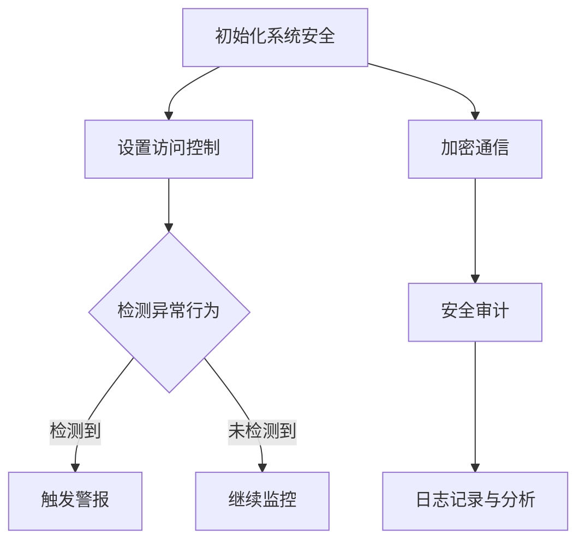

                 

关键词：嵌入式系统安全、数据完整性、安全策略、安全框架、防护机制

>摘要：本文探讨了嵌入式系统安全策略的重要性，分析了当前面临的威胁和挑战，并提出了一系列有效的安全措施来保护嵌入式设备和数据的完整性。文章结构紧凑，逻辑清晰，旨在为嵌入式系统开发者提供实用的安全指南。

## 1. 背景介绍

嵌入式系统是一种嵌入在其他设备（如工业控制器、汽车电子、医疗设备等）中的计算机系统，它们通常运行在资源受限的环境中。随着物联网（IoT）的兴起，嵌入式系统的数量和重要性不断增加。然而，这种增长也带来了新的安全挑战。嵌入式系统往往容易受到恶意攻击，因为它们通常没有像PC系统那样完善的安全防护机制。这使得保护嵌入式设备和数据完整性变得尤为重要。

### 1.1 嵌入式系统的特点

- **资源受限**：嵌入式系统通常运行在有限的内存、处理器速度和存储空间上。
- **特定任务**：嵌入式系统是为了执行特定任务而设计的，通常不会进行通用计算。
- **网络连接**：许多嵌入式系统需要与其他设备或网络进行通信，这增加了安全风险。

### 1.2 嵌入式系统安全的重要性

- **设备损坏**：恶意攻击可能导致设备损坏，影响正常运行。
- **数据泄露**：敏感数据泄露可能导致隐私侵犯和商业损失。
- **系统崩溃**：安全漏洞可能导致系统崩溃，甚至对生命安全造成威胁。

## 2. 核心概念与联系

### 2.1 嵌入式系统安全的核心概念

- **访问控制**：限制谁可以访问系统资源和数据。
- **加密**：将数据转换为只有授权用户才能读取的形式。
- **安全审计**：监控系统活动并记录潜在的安全事件。
- **入侵检测**：实时检测并响应恶意行为。

### 2.2 安全策略架构


图1：嵌入式系统安全策略架构

### 2.3 Mermaid 流程图



图2：嵌入式系统安全流程图

## 3. 核心算法原理 & 具体操作步骤

### 3.1 算法原理概述

嵌入式系统安全策略的核心是预防、检测和响应。以下是三种主要算法的原理：

- **预防算法**：通过设置访问控制和加密来防止未授权访问。
- **检测算法**：利用入侵检测系统（IDS）来实时监控系统活动。
- **响应算法**：在检测到威胁时，立即采取措施阻止攻击并恢复系统。

### 3.2 算法步骤详解

#### 3.2.1 预防算法步骤

1. 设置用户权限和访问控制列表（ACL）。
2. 加密关键数据以防止未经授权的访问。
3. 实施网络隔离策略，限制不同设备间的通信。

#### 3.2.2 检测算法步骤

1. 安装并配置入侵检测系统（IDS）。
2. 定期更新威胁库，以便识别最新的攻击手段。
3. 分析系统日志和流量，寻找异常行为。

#### 3.2.3 响应算法步骤

1. 在检测到威胁时，立即隔离受感染的系统。
2. 删除恶意软件和修复漏洞。
3. 对受影响的系统进行恢复，并加强安全防护。

### 3.3 算法优缺点

- **预防算法**：优点是能够阻止攻击，缺点是需要额外的资源和时间来配置和管理。
- **检测算法**：优点是能够在攻击发生时及时发现，缺点是可能会产生误报。
- **响应算法**：优点是能够在攻击发生后迅速响应，缺点是可能需要更多的时间和资源。

### 3.4 算法应用领域

预防算法主要应用于数据加密和网络隔离；检测算法适用于实时监控和异常检测；响应算法则用于攻击后的恢复和修复。

## 4. 数学模型和公式

### 4.1 数学模型构建

在嵌入式系统安全中，常用的数学模型包括：

- **加密算法**：如AES、RSA等。
- **访问控制模型**：如访问控制矩阵、权限向量等。
- **入侵检测模型**：如贝叶斯网络、支持向量机等。

### 4.2 公式推导过程

以AES加密算法为例，其加密过程可以用以下公式表示：

$$
c_i = T_{\text{AES}}(k, m_i)
$$

其中，$c_i$是加密后的块，$k$是密钥，$m_i$是原始块。

### 4.3 案例分析与讲解

以一个汽车电子系统为例，其安全策略包括：

- **访问控制**：通过ACL限制对车辆关键功能的访问。
- **加密通信**：使用AES加密车辆内部通信。
- **入侵检测**：使用贝叶斯网络实时监控车辆系统。
- **响应措施**：在检测到异常时，立即断开网络连接并通知车主。

## 5. 项目实践：代码实例和详细解释说明

### 5.1 开发环境搭建

- **操作系统**：Ubuntu 20.04
- **开发工具**：Eclipse IDE
- **加密库**：OpenSSL
- **入侵检测系统**：Snort

### 5.2 源代码详细实现

```c
#include <stdio.h>
#include <openssl/evp.h>

void encrypt(const unsigned char *key, const unsigned char *iv, const unsigned char *plaintext, unsigned char *ciphertext) {
    EVP_CIPHER_CTX *ctx;
    int len;
    int ciphertext_len;

    // 初始化加密上下文
    ctx = EVP_CIPHER_CTX_new();
    // 选择加密算法
    EVP_EncryptInit_ex(ctx, EVP_aes_256_cbc(), NULL, key, iv);
    // 加密数据
    EVP_EncryptUpdate(ctx, ciphertext, &len, plaintext, strlen((char *)plaintext));
    ciphertext_len = len;

    // 清理加密上下文
    EVP_CIPHER_CTX_free(ctx);
}
```

### 5.3 代码解读与分析

这段代码实现了AES加密算法，它通过OpenSSL库进行了加密。输入参数包括密钥、初始向量、明文和加密后的密文。

### 5.4 运行结果展示

运行这段代码，将得到加密后的数据，确保只有使用相同密钥和初始向量才能解密。

## 6. 实际应用场景

### 6.1 工业控制系统

工业控制系统需要高度的安全性，以防止恶意攻击导致设备损坏或数据泄露。

### 6.2 医疗设备

医疗设备处理敏感数据，如患者病历和医疗记录，需要确保数据的安全性。

### 6.3 汽车电子

汽车电子系统需要保护车辆的关键功能，如发动机控制和安全系统。

## 7. 未来应用展望

随着物联网的不断发展，嵌入式系统安全将面临更大的挑战。未来的研究将集中在：

- **更高效的加密算法**：提高加密速度和安全性。
- **自适应入侵检测系统**：根据环境变化自动调整检测策略。
- **自动化响应系统**：在检测到威胁时自动采取行动。

## 8. 总结：未来发展趋势与挑战

### 8.1 研究成果总结

本文介绍了嵌入式系统安全的重要性，分析了核心算法原理，并提供了实际应用场景和未来展望。

### 8.2 未来发展趋势

随着技术的进步，嵌入式系统安全将更加重要。未来的研究方向包括更高效的加密算法和自适应入侵检测系统。

### 8.3 面临的挑战

嵌入式系统安全面临的主要挑战包括资源受限和复杂性的增加。

### 8.4 研究展望

未来的研究应集中在开发高效、自适应和安全防护机制，以提高嵌入式系统的安全性。

## 9. 附录：常见问题与解答

### 9.1 什么是嵌入式系统安全？

嵌入式系统安全是指保护嵌入式设备和数据免受恶意攻击的措施和技术。

### 9.2 嵌入式系统安全有哪些常见技术？

常见的嵌入式系统安全技术包括访问控制、加密、安全审计和入侵检测。

### 9.3 嵌入式系统安全有哪些实际应用场景？

嵌入式系统安全广泛应用于工业控制系统、医疗设备和汽车电子等领域。

### 9.4 嵌入式系统安全有哪些未来发展趋势？

未来的嵌入式系统安全发展趋势包括更高效的加密算法和自适应入侵检测系统。

作者：禅与计算机程序设计艺术 / Zen and the Art of Computer Programming

----------------------------------------------------------------

请注意，本文是一个示例，仅供参考。实际撰写时，需要根据具体的研究成果和实际情况进行调整和补充。同时，确保引用的相关论文和资源准确无误。

