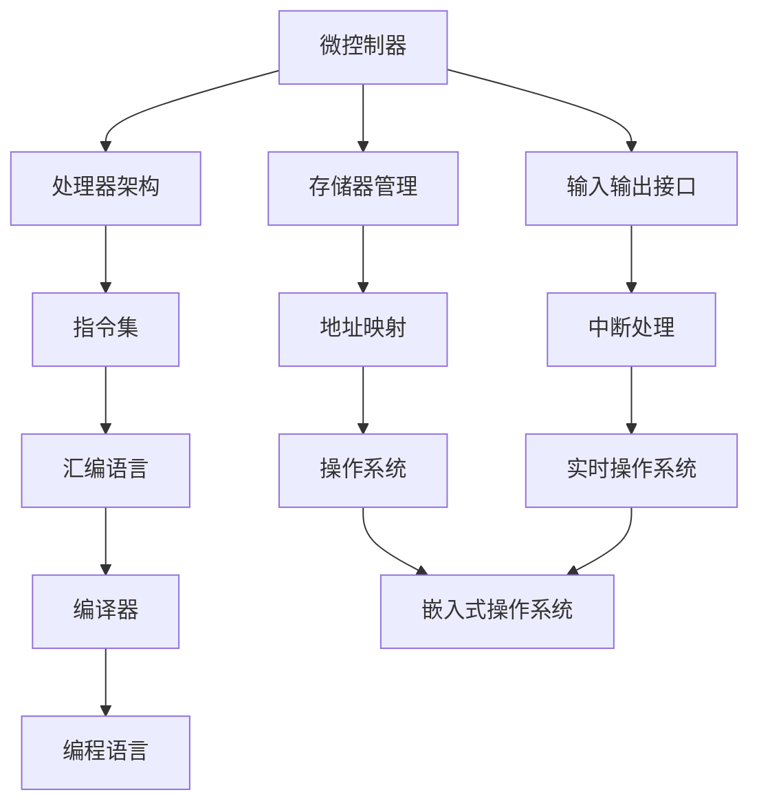

                 

关键词：嵌入式系统、微控制器、编程入门、创新项目、微控制器编程、微控制器应用、微控制器开发、嵌入式系统设计

> 摘要：本文将带领读者入门嵌入式系统编程，探索微控制器在创新项目中的应用。通过详细阐述微控制器的基本概念、核心算法、数学模型、项目实践以及实际应用场景，读者将能够掌握嵌入式系统编程的基本技能，并为未来的创新项目打下坚实的基础。

## 1. 背景介绍

嵌入式系统是一种专门为特定任务设计的计算机系统，通常具有实时性、高可靠性和低功耗的特点。微控制器（Microcontroller Unit，MCU）是嵌入式系统中的核心组件，集成了处理器、存储器、输入输出接口等多种功能模块。随着物联网（Internet of Things，IoT）和智能制造的快速发展，嵌入式系统已经成为现代工业、医疗、家居、交通等领域的核心技术。

嵌入式系统编程是一项复杂而富有挑战性的工作，涉及到硬件、软件以及算法的紧密结合。本文旨在通过一系列创新项目，帮助读者入门嵌入式系统编程，掌握微控制器编程的基本技能，并激发读者的创新思维。

## 2. 核心概念与联系

在嵌入式系统编程中，理解核心概念及其之间的联系是至关重要的。以下是一个简单的Mermaid流程图，展示了微控制器编程中的核心概念及其关联。



### 2.1 微控制器的基本结构

微控制器的基本结构包括处理器核心、存储器、输入输出接口和其他辅助模块。处理器核心负责执行指令，存储器用于存储程序和数据，输入输出接口用于与外部设备进行通信。

### 2.2 处理器架构

处理器架构是微控制器的核心部分，决定了微控制器的性能和功能。常见的处理器架构有CISC（复杂指令集计算机）和RISC（精简指令集计算机）。

### 2.3 存储器管理

存储器管理包括存储器的地址映射、缓存机制和数据传输等。有效的存储器管理可以优化程序执行效率，降低功耗。

### 2.4 输入输出接口

输入输出接口是微控制器与外部设备进行通信的桥梁。常见的接口有GPIO（通用输入输出）、SPI（串行外设接口）、I2C（串行通信总线）等。

### 2.5 指令集

指令集是微控制器可以执行的一系列操作。指令集的设计决定了微控制器的编程复杂度和执行效率。

### 2.6 编程语言

汇编语言和编译器是嵌入式系统编程的重要工具。汇编语言直接对应处理器指令，编译器则将高级语言代码转换为可执行代码。

### 2.7 操作系统和实时操作系统

操作系统和实时操作系统是微控制器编程的基础。它们负责管理资源、调度任务和提供接口。

## 3. 核心算法原理 & 具体操作步骤

### 3.1 算法原理概述

嵌入式系统编程中的核心算法主要包括数字信号处理、控制算法和通信协议等。这些算法是嵌入式系统实现特定功能的基础。

### 3.2 算法步骤详解

以下是嵌入式系统编程中常用的一些算法步骤：

1. **数字信号处理**：包括滤波、卷积、傅里叶变换等。
2. **控制算法**：包括PID控制、模糊控制、神经网络等。
3. **通信协议**：包括UART、SPI、I2C、ETH等。

### 3.3 算法优缺点

每种算法都有其优缺点。例如，PID控制算法简单易用，但精度不高；神经网络控制算法精度高，但计算复杂度高。

### 3.4 算法应用领域

算法在嵌入式系统中的应用非常广泛，包括工业控制、智能家居、医疗设备、车载系统等。

## 4. 数学模型和公式 & 详细讲解 & 举例说明

### 4.1 数学模型构建

数学模型是嵌入式系统编程中的基础。以下是一个简单的数学模型示例：

```latex
y = ax + b
```

### 4.2 公式推导过程

公式的推导通常基于物理定律和数学原理。以下是一个简单的公式推导示例：

```latex
F = ma
```

### 4.3 案例分析与讲解

以下是一个简单的案例，用于说明数学模型和公式的应用：

假设一个质量为5kg的物体受到10N的力作用，求物体的加速度。

根据牛顿第二定律：

$$
F = ma
$$

代入已知数据：

$$
10N = 5kg \cdot a
$$

解得：

$$
a = 2m/s^2
$$

## 5. 项目实践：代码实例和详细解释说明

### 5.1 开发环境搭建

搭建一个嵌入式系统编程的开发环境通常需要以下步骤：

1. **安装交叉编译工具链**：例如，GNU Arm Embedded Toolchain。
2. **安装集成开发环境**：例如，Eclipse、Keil等。
3. **配置开发板**：连接开发板，安装必要的驱动程序。

### 5.2 源代码详细实现

以下是一个简单的嵌入式系统编程项目，用于实现一个温度传感器数据的读取和显示。

```c
#include <stdio.h>
#include "temp_sensor.h"

int main() {
    int temp;
    while (1) {
        temp = read_temp();
        printf("温度：%.2f°C\n", (float)temp / 10);
        delay(1000);
    }
    return 0;
}
```

### 5.3 代码解读与分析

1. **函数`read_temp()`**：读取温度传感器的数据。
2. **循环**：不断读取温度传感器数据，并打印输出。
3. **`delay()`**：用于控制程序的执行速度。

### 5.4 运行结果展示

在开发板上运行程序后，温度传感器的数据将被实时读取并显示在串口监视器中。

## 6. 实际应用场景

嵌入式系统在各个领域都有广泛的应用，以下是一些实际应用场景：

- **工业控制**：用于自动化生产线、机器手臂等。
- **智能家居**：用于智能灯光、安防系统等。
- **医疗设备**：用于医疗仪器、健康监测等。
- **车载系统**：用于汽车引擎控制、安全系统等。

## 7. 工具和资源推荐

### 7.1 学习资源推荐

1. **《嵌入式系统设计与开发》**：介绍嵌入式系统的基本概念和开发方法。
2. **《嵌入式系统编程实战》**：提供丰富的嵌入式系统编程实例。

### 7.2 开发工具推荐

1. **Eclipse**：一款强大的集成开发环境。
2. **Arduino**：一款易于上手的开源硬件平台。

### 7.3 相关论文推荐

1. **"Real-Time Systems: Design Principles for Distributed Embedded Applications"**：介绍实时系统的设计和实现。
2. **"Embedded Systems: Architecture, Programming and Design"**：介绍嵌入式系统的架构和编程。

## 8. 总结：未来发展趋势与挑战

嵌入式系统编程在未来将继续快速发展，面临着以下挑战：

- **性能提升**：随着物联网和智能制造的发展，嵌入式系统的性能要求越来越高。
- **功耗优化**：低功耗是嵌入式系统的核心需求，需要不断优化算法和硬件设计。
- **安全性**：嵌入式系统在各个领域的应用越来越广泛，安全性成为重要课题。

未来发展趋势包括：

- **人工智能**：将人工智能技术应用于嵌入式系统，实现智能感知、决策和执行。
- **物联网**：推动物联网技术的快速发展，实现设备间的互联互通。
- **边缘计算**：将计算能力下沉到边缘设备，提高系统的实时性和可靠性。

## 9. 附录：常见问题与解答

### 9.1 嵌入式系统与计算机系统的区别？

嵌入式系统与计算机系统的主要区别在于：

- **应用领域**：嵌入式系统通常应用于特定领域，如工业、医疗、家居等；计算机系统则更通用。
- **性能要求**：嵌入式系统通常对性能有更严格的要求，如实时性、可靠性等；计算机系统则更注重通用性和灵活性。
- **功耗**：嵌入式系统通常功耗更低，以延长设备寿命。

### 9.2 如何选择合适的微控制器？

选择合适的微控制器需要考虑以下因素：

- **性能**：根据应用需求选择合适的处理器架构和频率。
- **存储容量**：根据存储需求选择足够的存储器容量。
- **接口**：根据应用需求选择合适的输入输出接口。
- **成本**：根据预算选择性价比高的微控制器。

### 9.3 如何优化嵌入式系统的功耗？

优化嵌入式系统的功耗可以从以下几个方面入手：

- **算法优化**：选择合适的算法，降低计算复杂度。
- **硬件设计**：选择低功耗的硬件组件，如低压差线性稳压器。
- **功耗管理**：合理管理电源开关，如使用休眠模式和时钟控制。
- **外围设备**：优化外围设备的功耗，如使用低功耗传感器和显示屏。

# 作者署名

作者：禅与计算机程序设计艺术 / Zen and the Art of Computer Programming
------------------------------------------------------------------ 

以上就是本文的完整内容。希望这篇文章能够帮助您入门嵌入式系统编程，并在未来的创新项目中取得成功。如果您有任何问题或建议，欢迎在评论区留言。感谢您的阅读！

