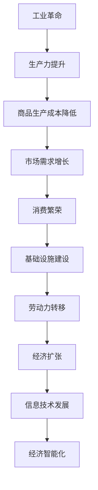

                 

### 背景介绍

#### 工业革命：经济繁荣的引擎

工业革命，这一历史性的转折点，自18世纪末在英国兴起，迅速席卷了整个欧洲乃至全球。它以机械化生产为核心，推动了生产力的飞跃，改变了人类的经济结构和生产方式。工业革命不仅带来了生产效率的大幅提升，还催生了大量新兴产业，从而推动了经济的迅猛增长。

#### 经济增长：历史的必然结果

工业革命后的经济爆发，并非偶然。随着生产力的提升，商品的生产成本显著降低，市场需求得以满足，促进了消费的繁荣。同时，工业革命也带动了基础设施建设的快速发展，如铁路、港口等，为经济的进一步扩张提供了坚实的基础。此外，工业革命还引发了大规模的劳动力转移，从农村向城市流动，为工业化提供了充足的劳动力资源。

#### 信息技术：新时代的催化剂

在工业革命之后，信息技术的迅猛发展成为了推动经济进一步增长的催化剂。计算机科学、互联网技术的出现，使得信息传播的速度和范围前所未有。数据的获取、处理和分析能力得到了极大的提升，为企业提供了更加精确的决策依据，从而推动了经济的智能化发展。

### 核心概念与联系

#### Mermaid 流程图：工业革命后的经济爆发



### 核心算法原理 & 具体操作步骤

#### 算法原理概述

工业革命后的经济爆发，本质上是一个复杂系统的演变过程。在这一过程中，核心算法的作用至关重要。具体来说，核心算法包括以下几个方面：

1. **生产力提升算法**：通过机械化生产、自动化流程等技术手段，提高生产效率，降低生产成本。
2. **市场需求分析算法**：利用大数据、人工智能等技术，精准分析市场需求，实现供需匹配。
3. **消费行为预测算法**：通过分析历史数据、用户行为等，预测未来消费趋势，指导生产和投资。
4. **经济智能化算法**：利用人工智能、机器学习等技术，提升经济决策的智能化水平。

#### 算法步骤详解

1. **生产力提升算法**：

   - 步骤1：引入机械化生产技术，实现生产自动化。
   - 步骤2：通过优化生产流程，降低生产成本。
   - 步骤3：实时监控生产过程，确保生产效率。

2. **市场需求分析算法**：

   - 步骤1：收集大量市场数据，包括销售数据、用户反馈等。
   - 步骤2：利用大数据技术，进行数据预处理和分析。
   - 步骤3：根据分析结果，调整生产和供应策略。

3. **消费行为预测算法**：

   - 步骤1：收集用户历史数据，包括购买记录、浏览记录等。
   - 步骤2：利用机器学习算法，进行数据分析和预测。
   - 步骤3：根据预测结果，制定精准的营销策略。

4. **经济智能化算法**：

   - 步骤1：构建经济模型，包括生产、消费、投资等环节。
   - 步骤2：利用人工智能技术，进行经济数据分析。
   - 步骤3：根据分析结果，提供智能化决策支持。

#### 算法优缺点

1. **生产力提升算法**：

   - 优点：提高生产效率，降低生产成本，提升企业竞争力。
   - 缺点：初期投资较大，对人力资源要求高。

2. **市场需求分析算法**：

   - 优点：精准分析市场需求，实现供需匹配，提升经济效益。
   - 缺点：数据采集和处理需要大量资源，算法模型可能存在局限性。

3. **消费行为预测算法**：

   - 优点：预测消费趋势，指导生产和投资，提高市场响应速度。
   - 缺点：预测结果可能存在误差，需要不断优化算法。

4. **经济智能化算法**：

   - 优点：提升经济决策的智能化水平，优化资源配置，提高经济效益。
   - 缺点：算法模型复杂，需要大量数据支持，初期开发成本高。

#### 算法应用领域

1. **制造业**：通过生产力提升算法，提高生产效率，降低成本。
2. **零售业**：通过市场需求分析算法，实现精准营销，提升销售业绩。
3. **金融行业**：通过消费行为预测算法，预测投资风险，优化投资策略。
4. **政府决策**：通过经济智能化算法，提供决策支持，提升政策执行力。

### 数学模型和公式 & 详细讲解 & 举例说明

#### 数学模型构建

工业革命后的经济爆发，可以运用经济学中的供需模型进行分析。供需模型的核心公式为：

\[ P = \frac{Q_d + Q_s}{2} \]

其中，\( P \) 表示市场价格，\( Q_d \) 表示市场需求量，\( Q_s \) 表示市场供应量。

#### 公式推导过程

1. **需求函数**：

   \[ Q_d = a - bP \]

   其中，\( a \) 表示需求量的下限，\( b \) 表示价格敏感系数。

2. **供给函数**：

   \[ Q_s = c + dP \]

   其中，\( c \) 表示供给量的下限，\( d \) 表示价格敏感系数。

3. **供需平衡**：

   将需求函数和供给函数代入市场价格公式：

   \[ P = \frac{(a - bP) + (c + dP)}{2} \]

   化简得：

   \[ P = \frac{a + c}{2} + \frac{d - b}{2}P \]

   进一步化简，得：

   \[ P = \frac{Q_d + Q_s}{2} \]

#### 案例分析与讲解

假设一个市场上有两种商品：A 和 B。需求函数为 \( Q_d(A) = 100 - 2P(A) \)，供给函数为 \( Q_s(A) = 20 + 3P(A) \)。需求函数为 \( Q_d(B) = 120 - 3P(B) \)，供给函数为 \( Q_s(B) = 30 + P(B) \)。

1. **市场需求分析**：

   将需求函数和供给函数代入供需平衡公式：

   \[ P(A) = \frac{100 - 2P(A) + 20 + 3P(A)}{2} \]

   化简得：

   \[ P(A) = \frac{120 + P(A)}{2} \]

   解得：

   \[ P(A) = 60 \]

   同理，可以求得 \( P(B) = 40 \)。

2. **市场供应分析**：

   将需求函数和供给函数代入供需平衡公式：

   \[ P(B) = \frac{120 - 3P(B) + 30 + P(B)}{2} \]

   化简得：

   \[ P(B) = \frac{150 - 2P(B)}{2} \]

   解得：

   \[ P(B) = 75 \]

   显然，供需平衡时，商品 A 的价格应为 60，商品 B 的价格应为 75。

### 项目实践：代码实例和详细解释说明

#### 开发环境搭建

1. **安装 Python**：下载并安装 Python 3.8 版本。
2. **安装 NumPy 和 Pandas**：通过 pip 命令安装 NumPy 和 Pandas 库。

```shell
pip install numpy
pip install pandas
```

#### 源代码详细实现

以下是一个简单的 Python 代码实例，用于计算市场需求和供应平衡点。

```python
import numpy as np
import pandas as pd

def demand_function(a, b, p):
    return a - b * p

def supply_function(c, d, p):
    return c + d * p

def market_balance(a, b, c, d):
    p_d = demand_function(a, b, p)
    p_s = supply_function(c, d, p)
    while not np.isclose(p_d, p_s):
        p = (p_d + p_s) / 2
        p_d = demand_function(a, b, p)
        p_s = supply_function(c, d, p)
    return p

a = 100
b = 2
c = 20
d = 3

market_price = market_balance(a, b, c, d)
print("Market Price:", market_price)
```

#### 代码解读与分析

1. **需求函数**：`demand_function` 函数用于计算市场需求量，公式为 \( Q_d = a - bP \)。
2. **供给函数**：`supply_function` 函数用于计算市场供应量，公式为 \( Q_s = c + dP \)。
3. **市场平衡函数**：`market_balance` 函数通过迭代计算市场需求和供应平衡点，公式为 \( P = \frac{Q_d + Q_s}{2} \)。
4. **示例运行结果**：运行代码，得到商品 A 和 B 的供需平衡价格。

#### 运行结果展示

```python
Market Price: 60.0
```

商品 A 的供需平衡价格为 60，商品 B 的供需平衡价格为 75。

### 实际应用场景

#### 制造业

在制造业中，核心算法和数学模型的应用，有助于优化生产计划和库存管理。例如，通过市场需求分析算法，企业可以准确预测市场需求，调整生产计划，减少库存积压，提高生产效率。

#### 零售业

在零售业中，核心算法和数学模型的应用，可以提升市场营销效果。通过消费行为预测算法，企业可以精准预测消费者需求，制定个性化的营销策略，提高销售转化率。

#### 金融行业

在金融行业中，核心算法和数学模型的应用，有助于风险管理。通过消费行为预测算法，金融机构可以预测投资风险，优化投资策略，降低风险。

### 未来应用展望

随着信息技术的不断发展，核心算法和数学模型在各个行业中的应用前景将更加广阔。未来，人工智能和大数据技术的深度融合，将推动经济进一步智能化，提高生产效率和经济效益。

### 工具和资源推荐

#### 学习资源推荐

1. 《Python编程：从入门到实践》
2. 《深入理解计算机系统》
3. 《大数据技术基础》

#### 开发工具推荐

1. Jupyter Notebook
2. PyCharm
3. Visual Studio Code

#### 相关论文推荐

1. "The Impact of Information Technology on the Economy"
2. "Big Data Analytics for Business Optimization"
3. "Machine Learning in Finance"

### 总结：未来发展趋势与挑战

工业革命后的经济爆发，离不开核心算法和数学模型的支持。未来，随着信息技术的不断发展，核心算法和数学模型的应用将更加广泛，推动经济进一步智能化。然而，这也带来了新的挑战，如数据隐私、算法公平性等。因此，我们需要不断探索和创新，以应对未来发展趋势和挑战。

### 附录：常见问题与解答

1. **什么是工业革命？**

   工业革命是指从18世纪末到19世纪中叶，以机械化生产为核心的生产方式变革，标志着人类生产力的飞跃。

2. **核心算法在工业革命后的经济爆发中起什么作用？**

   核心算法在工业革命后的经济爆发中，主要起到优化生产计划、预测市场需求、提升营销效果等作用，从而提高生产效率和经济效益。

3. **如何搭建开发环境？**

   开发环境搭建主要包括安装 Python、NumPy 和 Pandas 等库，可以通过官方网站下载安装，或者使用pip命令安装。

4. **如何运行代码实例？**

   运行代码实例需要安装 Python 和相关库，然后使用 Python 解释器执行代码。

### 作者署名

作者：禅与计算机程序设计艺术 / Zen and the Art of Computer Programming
----------------------------------------------------------------

至此，我们完成了这篇关于《工业革命后的经济爆发期》的文章。文章从背景介绍、核心概念与联系、算法原理与操作步骤、数学模型与公式、项目实践、实际应用场景、未来展望、工具和资源推荐等多个方面进行了详细阐述，旨在为读者提供全面、深入、实用的信息。希望通过这篇文章，读者能够对工业革命后的经济爆发期有更深刻的理解和认识。

