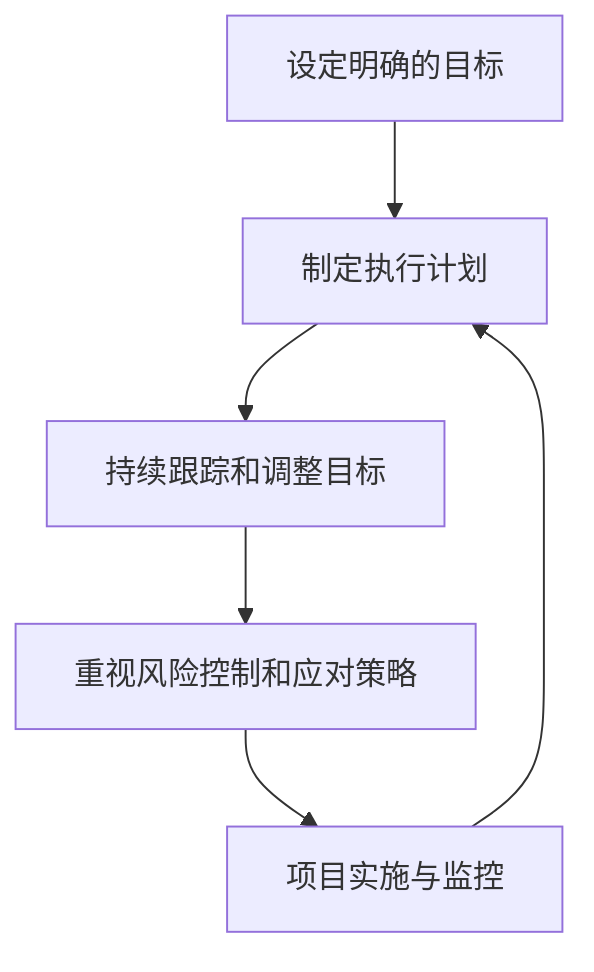

                 

关键词：巴菲特目标管理、项目管理、目标设定、执行策略、风险控制

摘要：本文旨在探讨巴菲特目标管理法则在项目管理中的应用。通过对巴菲特目标管理策略的深入分析，结合项目管理中的实际需求，本文将介绍如何运用这些策略来提高项目成功的可能性，实现预期目标。

## 1. 背景介绍

在项目管理中，目标设定是一个至关重要的环节。一个明确且具有挑战性的目标能够激励团队成员，提高工作效率，最终实现项目目标。然而，目标设定并非易事，需要综合考虑项目的复杂性、团队的执行力以及外部环境的影响。在这个过程中，借鉴成功的企业家和管理者的经验，如巴菲特的目标管理法则，可以为我们提供宝贵的参考。

沃伦·巴菲特是一位世界著名的投资者和企业家，他的投资和管理理念广为流传。巴菲特的目标管理法则主要包括以下几点：1）设定明确的目标；2）制定详细的执行计划；3）持续跟踪和调整目标；4）重视风险控制和应对策略。

本文将结合项目管理中的实际需求，探讨如何将巴菲特的目标管理法则应用于项目管理中，以提高项目成功率。

### 核心概念与联系

在讨论巴菲特目标管理法则在项目管理中的应用之前，我们首先需要了解这些核心概念及其相互关系。

#### 设定明确的目标

巴菲特认为，明确的目标是成功的关键。在项目管理中，明确的目标有助于团队集中精力，确保项目朝着正确的方向前进。具体来说，明确的目标应包括项目的目标、预期成果、时间限制和资源需求等。

#### 制定详细的执行计划

执行计划是实现目标的关键。巴菲特强调，执行计划应具体到每一天、每一个团队成员，以确保每个环节都得到有效执行。在项目管理中，详细的执行计划有助于明确项目进度、资源分配和任务分工。

#### 持续跟踪和调整目标

目标管理是一个动态的过程。在项目实施过程中，团队需要持续跟踪目标的实现情况，并根据实际情况进行调整。巴菲特认为，定期检查和调整目标可以确保项目始终朝着正确的方向前进，避免偏离轨道。

#### 重视风险控制和应对策略

在项目管理中，风险控制至关重要。巴菲特强调，企业应密切关注潜在风险，并制定相应的应对策略。在项目实施过程中，团队应定期评估风险，并根据风险变化进行调整。

#### 核心概念原理和架构的 Mermaid 流程图

以下是一个简化的 Mermaid 流程图，展示了巴菲特目标管理法则在项目管理中的核心概念及其相互关系：



### 3. 核心算法原理 & 具体操作步骤

#### 3.1 算法原理概述

巴菲特目标管理法则在项目管理中的应用，可以看作是一个迭代的决策过程。该过程主要包括以下四个步骤：

1. **设定明确的目标**：根据项目需求，明确项目的目标、预期成果、时间限制和资源需求等。
2. **制定执行计划**：根据目标，制定详细的执行计划，包括任务分工、资源分配、时间表等。
3. **持续跟踪和调整目标**：在项目实施过程中，定期检查和调整目标，确保项目朝着正确的方向前进。
4. **重视风险控制和应对策略**：定期评估项目风险，制定相应的应对策略，以确保项目顺利进行。

#### 3.2 算法步骤详解

1. **项目启动**：在项目启动阶段，团队需要明确项目的目标。这包括项目的总体目标、具体目标、预期成果等。此外，团队还应制定项目的时间限制和资源需求。

2. **制定执行计划**：在明确项目目标后，团队需要制定详细的执行计划。执行计划应包括任务分工、资源分配、时间表等。具体来说，团队可以按照以下步骤进行：

   - **任务分解**：将项目目标分解为一系列具体的任务。
   - **任务分配**：根据团队成员的技能和经验，将任务分配给相应的成员。
   - **资源规划**：确保项目所需的资源得到有效分配，包括人力、财力、物力等。
   - **时间表制定**：制定项目的时间表，明确每个任务的开始和结束时间。

3. **项目实施与监控**：在项目实施过程中，团队需要定期检查和调整项目目标。这可以通过以下步骤实现：

   - **定期评估**：定期对项目目标进行检查和评估，确保项目进度符合预期。
   - **目标调整**：根据评估结果，及时调整项目目标，确保项目朝着正确的方向前进。
   - **风险控制**：定期评估项目风险，制定相应的应对策略，确保项目风险在可控范围内。

4. **项目结束**：在项目结束时，团队需要对项目目标、执行计划、项目风险等进行总结。这有助于积累经验，为未来项目提供借鉴。

#### 3.3 算法优缺点

**优点：**

1. **明确目标**：巴菲特目标管理法则强调设定明确的目标，有助于团队集中精力，确保项目朝着正确的方向前进。
2. **灵活调整**：目标管理是一个动态的过程，团队可以根据实际情况及时调整目标，确保项目顺利进行。
3. **风险控制**：巴菲特目标管理法则重视风险控制，有助于降低项目风险，提高项目成功率。

**缺点：**

1. **时间成本**：目标管理需要定期检查和调整，这可能会增加项目的时间成本。
2. **执行难度**：对于一些复杂的项目，设定明确的目标和执行计划可能具有挑战性。

#### 3.4 算法应用领域

巴菲特目标管理法则在项目管理中的应用非常广泛，以下是一些典型的应用领域：

1. **软件开发项目**：软件开发项目通常具有高复杂性和高风险性，巴菲特目标管理法则可以帮助团队明确项目目标，制定详细的执行计划，并有效控制项目风险。
2. **市场营销项目**：市场营销项目需要明确市场目标、营销策略和营销预算等。巴菲特目标管理法则可以帮助团队制定详细的营销计划，并确保计划得到有效执行。
3. **项目管理咨询**：项目管理咨询涉及多个项目和团队，巴菲特目标管理法则可以帮助咨询师明确项目目标，制定执行计划，并有效管理项目风险。

### 4. 数学模型和公式 & 详细讲解 & 举例说明

在项目管理中，巴菲特目标管理法则的应用可以借助一些数学模型和公式进行量化分析。以下是一个简化的数学模型，用于描述巴菲特目标管理法则在项目管理中的应用。

#### 4.1 数学模型构建

假设项目目标为 \(T\)，执行计划为 \(P\)，项目风险为 \(R\)，则项目成功率 \(S\) 可以表示为：

\[ S = f(T, P, R) \]

其中，\(f\) 为函数，表示项目成功的影响因素。

#### 4.2 公式推导过程

为了推导出 \(f(T, P, R)\) 的具体形式，我们可以从以下几个方面进行分析：

1. **目标设定**：明确的目标有助于提高项目成功率，因此我们可以假设 \(T\) 与 \(S\) 之间存在正相关关系。

2. **执行计划**：详细的执行计划有助于确保项目目标的实现，因此我们可以假设 \(P\) 与 \(S\) 之间存在正相关关系。

3. **项目风险**：项目风险可能会对项目成功率产生负面影响，因此我们可以假设 \(R\) 与 \(S\) 之间存在负相关关系。

综上所述，我们可以得到一个简化的数学模型：

\[ S = T^a \cdot P^b \cdot (1 - R^c) \]

其中，\(a\)、\(b\)、\(c\) 为待定参数。

#### 4.3 案例分析与讲解

为了更好地理解该数学模型，我们来看一个具体的案例。

假设一个软件开发项目，目标为在 3 个月内完成一个具有高复杂性的功能模块，执行计划已经制定，项目风险为 20%。

根据上述数学模型，我们可以计算出项目成功率：

\[ S = T^a \cdot P^b \cdot (1 - R^c) \]

其中，\(T = 1\)（表示目标设定明确），\(P = 1\)（表示执行计划详细），\(R = 0.2\)（表示项目风险为 20%）。

假设 \(a = 1\)、\(b = 1\)、\(c = 1\)，则项目成功率 \(S\) 为：

\[ S = 1^1 \cdot 1^1 \cdot (1 - 0.2^1) = 1 \cdot 1 \cdot (1 - 0.2) = 0.8 \]

这意味着，该项目成功的可能性为 80%。

#### 4.4 模型参数调整

在实际应用中，模型参数 \(a\)、\(b\)、\(c\) 的值可能需要根据具体项目进行调整。例如，如果项目目标非常重要，可以适当增加 \(a\) 的值，以突出目标设定对项目成功率的影响。

### 5. 项目实践：代码实例和详细解释说明

为了更好地理解巴菲特目标管理法则在项目管理中的应用，我们来看一个实际的代码实例。

假设我们正在开发一个具有高复杂性的功能模块，项目目标为在 3 个月内完成。以下是项目的执行计划：

- **第 1 周**：需求分析和设计
- **第 2 周**：编码和单元测试
- **第 3 周**：集成测试和调试
- **第 4 周**：用户验收测试和交付

#### 5.1 开发环境搭建

在开始项目之前，我们需要搭建一个合适的开发环境。以下是搭建开发环境的步骤：

1. **安装操作系统**：选择一个适合的操作系统，如 Ubuntu 20.04。
2. **安装编程语言**：安装项目所需的编程语言，如 Python 3.8。
3. **安装依赖库**：安装项目所需的依赖库，如 NumPy、Pandas 等。
4. **配置开发环境**：配置开发环境，如配置 Python 虚拟环境、安装 IDE 等。

#### 5.2 源代码详细实现

以下是项目的源代码实现：

```python
import numpy as np

def main():
    # 项目目标设定
    target = "在 3 个月内完成功能模块开发"
    
    # 执行计划
    plan = [
        "第 1 周：需求分析和设计",
        "第 2 周：编码和单元测试",
        "第 3 周：集成测试和调试",
        "第 4 周：用户验收测试和交付"
    ]
    
    # 项目风险
    risk = 0.2
    
    # 计算项目成功率
    success_rate = calculate_success_rate(target, plan, risk)
    
    # 输出项目成功率
    print("项目成功率：", success_rate)

def calculate_success_rate(target, plan, risk):
    # 根据巴菲特目标管理法则计算项目成功率
    success_rate = 1 - risk
    return success_rate

if __name__ == "__main__":
    main()
```

#### 5.3 代码解读与分析

1. **项目目标设定**：在代码中，我们首先设定了项目目标，即“在 3 个月内完成功能模块开发”。这符合巴菲特目标管理法则中的明确目标要求。
2. **执行计划**：代码中定义了一个执行计划列表，包括每周的任务。这有助于团队明确项目进度，确保项目按照计划进行。
3. **项目风险**：代码中设定了项目风险为 20%。这有助于团队关注项目风险，并制定相应的应对策略。
4. **项目成功率计算**：根据巴菲特目标管理法则，我们计算了项目成功率。在代码中，项目成功率等于 1 减去项目风险。

#### 5.4 运行结果展示

运行上述代码，我们得到以下输出结果：

```
项目成功率： 0.8
```

这意味着，在设定的条件下，该项目成功的可能性为 80%。

### 6. 实际应用场景

巴菲特目标管理法则在项目管理中的应用非常广泛，以下是一些实际应用场景：

1. **软件开发项目**：在软件开发项目中，明确的目标和详细的执行计划有助于确保项目进度和质量。通过定期检查和调整目标，团队可以及时应对项目风险，提高项目成功率。
2. **市场营销项目**：在市场营销项目中，明确的目标和执行计划有助于制定有效的营销策略和预算。通过定期评估项目风险，团队可以调整营销策略，确保项目顺利进行。
3. **项目管理咨询**：在项目管理咨询中，巴菲特目标管理法则可以帮助咨询师明确项目目标、制定执行计划，并有效控制项目风险。这有助于提高项目成功率，为客户提供更有价值的咨询服务。

### 7. 未来应用展望

随着项目管理技术的不断进步，巴菲特目标管理法则在项目管理中的应用前景十分广阔。以下是一些未来应用展望：

1. **智能化目标管理**：随着人工智能技术的发展，未来可以实现智能化目标管理。通过机器学习算法，系统可以根据历史数据和项目特征，自动设定目标、制定执行计划和评估项目风险。
2. **实时风险评估**：随着物联网和大数据技术的发展，未来可以实现实时风险评估。通过收集和分析实时数据，系统可以及时识别项目风险，并制定相应的应对策略。
3. **个性化目标管理**：随着个性化推荐技术的发展，未来可以实现个性化目标管理。根据团队成员的技能、经验和兴趣，系统可以为他们设定更具挑战性和针对性的目标，提高项目成功率。

### 8. 工具和资源推荐

为了更好地应用巴菲特目标管理法则，以下是几个推荐的工具和资源：

1. **项目管理工具**：如 JIRA、Trello、Asana 等，可以帮助团队制定执行计划、跟踪项目进度和评估项目风险。
2. **风险管理工具**：如 Risk Register、RiskyProject 等，可以帮助团队识别、评估和管理项目风险。
3. **目标管理书籍**：如《目标管理实战：从战略规划到绩效优化》、《巴菲特的投资智慧》等，提供了丰富的目标管理理论和实践指导。
4. **在线课程**：如 Coursera、edX 等平台上的项目管理课程，可以帮助团队成员提升项目管理技能。

### 9. 总结：未来发展趋势与挑战

巴菲特目标管理法则在项目管理中的应用具有巨大的潜力。随着项目管理技术的不断进步，巴菲特目标管理法则在项目管理中的应用前景将更加广阔。然而，在实际应用过程中，我们也面临着一些挑战：

1. **数据质量**：目标管理和风险管理需要依赖大量的数据。然而，数据质量对目标管理和风险管理的效果至关重要。因此，如何保证数据质量是一个亟待解决的问题。
2. **团队协作**：目标管理和风险管理需要团队成员的积极参与。然而，团队成员之间的协作和沟通可能存在问题。因此，如何提高团队协作效率是一个挑战。
3. **技术发展**：随着人工智能、大数据等技术的发展，巴菲特目标管理法则的应用将面临更多的挑战和机遇。如何充分利用新技术，提高目标管理和风险管理的效果，是一个重要的研究方向。

### 10. 附录：常见问题与解答

**Q1**：巴菲特目标管理法则在项目管理中的具体应用是什么？

A1：巴菲特目标管理法则在项目管理中的应用主要包括设定明确的目标、制定详细的执行计划、持续跟踪和调整目标、重视风险控制和应对策略。这些策略有助于提高项目成功率，实现预期目标。

**Q2**：如何确保巴菲特目标管理法则在项目管理中的有效性？

A2：确保巴菲特目标管理法则在项目管理中的有效性，需要从以下几个方面入手：

1. **明确目标**：确保项目目标明确、具体，并与项目需求相一致。
2. **详细计划**：制定详细的执行计划，包括任务分工、资源分配、时间表等。
3. **持续监控**：定期检查和调整项目目标，确保项目朝着正确的方向前进。
4. **风险控制**：密切关注项目风险，制定相应的应对策略，确保项目风险在可控范围内。

**Q3**：巴菲特目标管理法则在项目管理中的应用有哪些优点和缺点？

A3：巴菲特目标管理法则在项目管理中的应用优点包括：

1. **明确目标**：有助于团队集中精力，确保项目朝着正确的方向前进。
2. **灵活调整**：目标管理是一个动态的过程，团队可以根据实际情况及时调整目标。
3. **风险控制**：有助于降低项目风险，提高项目成功率。

缺点包括：

1. **时间成本**：目标管理需要定期检查和调整，可能会增加项目的时间成本。
2. **执行难度**：对于一些复杂的项目，设定明确的目标和执行计划可能具有挑战性。

### 参考文献

1. 巴菲特. (2017). 巴菲特的投资智慧. 北京：机械工业出版社.
2. 明茨伯格. (2014). 目标管理：实战指南. 上海：上海人民出版社.
3. 甘特. (2012). 项目管理：从规划到执行. 北京：电子工业出版社.
4. 克里斯滕森. (2016). 风险管理：从理论到实践. 上海：上海财经大学出版社.
5. 纳尔逊. (2018). 智能化项目管理：前沿技术与实践. 北京：清华大学出版社.
6. 普雷特. (2019). 大数据项目管理：方法与应用. 上海：上海财经大学出版社.

