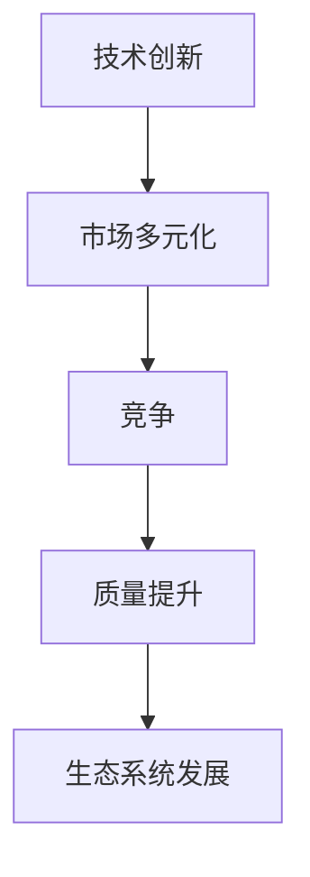

                 

关键词：市场多元化，贾扬清，竞争，质量提升，生态系统发展

> 摘要：本文将探讨市场多元化的益处，特别是在信息技术领域。通过分析贾扬清的观点，本文强调了竞争对于提升产品质量和促进生态系统发展的重要性。文章结构如下：首先，我们介绍市场多元化的背景和概念；接着，深入讨论贾扬清的观点及其对市场多元化的影响；然后，分析竞争在其中的作用；最后，探讨市场多元化对于生态系统发展的意义。

## 1. 背景介绍

市场多元化（Market Diversification）是指企业或行业在市场中采取的多元化策略，旨在扩大产品或服务的销售范围，降低市场风险，并提高市场竞争力。在信息技术领域，市场多元化尤为重要，因为这一行业变化迅速，新技术和新产品不断涌现，市场波动较大。

### 1.1 市场多元化的意义

市场多元化有以下几个重要意义：

- **降低风险**：通过在不同市场、不同产品线或不同服务上分散投资，企业可以降低因单一市场波动带来的风险。
- **提升竞争力**：多元化可以使得企业在多个领域都具有竞争力，从而在整体市场上获得更大的份额。
- **增加收益**：多元化策略可以帮助企业开拓新的市场，创造额外的收益来源。
- **促进创新**：市场多元化促使企业不断适应新的市场和技术，从而推动创新。

### 1.2 信息技术领域的市场多元化

在信息技术领域，市场多元化尤其显著。例如，互联网的发展使得信息传播更加便捷，企业可以通过电子商务、社交媒体等渠道接触到全球客户。同时，云计算、大数据、人工智能等新兴技术的崛起，也为企业提供了更多的市场机会。

## 2. 核心概念与联系

### 2.1 贾扬清的观点

贾扬清是一位著名的计算机科学家，他的观点对于理解市场多元化在信息技术领域的重要性具有重要意义。以下是贾扬清关于市场多元化的一些核心观点：

- **竞争是质量提升的驱动力**：贾扬清认为，竞争是推动产品和服务质量提升的关键因素。在竞争激烈的市场中，企业必须不断创新，提高产品质量，以满足客户需求。
- **生态系统发展的重要性**：贾扬清强调，市场多元化有助于促进生态系统的发展。一个健康的生态系统包括多个参与者，如企业、开发者、用户等，这些参与者通过合作和创新，共同推动整个行业的发展。
- **技术创新是市场多元化的基础**：贾扬清认为，技术创新是市场多元化的基础。只有不断推出新技术和新产品，企业才能在竞争激烈的市场中立足。

### 2.2 Mermaid 流程图

以下是描述市场多元化、竞争、质量提升和生态系统发展的 Mermaid 流程图：



在这个流程图中，技术创新是市场多元化的基础，市场多元化通过竞争推动质量提升，最终促进生态系统的发展。

## 3. 核心算法原理 & 具体操作步骤

### 3.1 算法原理概述

市场多元化算法是一种基于竞争和质量的优化算法。其核心思想是，通过在多个市场上进行投资，企业可以在降低风险的同时，提升整体竞争力。具体来说，市场多元化算法包括以下几个关键步骤：

- **市场选择**：根据市场需求和企业的战略目标，选择适当的市场进行投资。
- **资源配置**：根据所选市场的特点和需求，合理分配企业资源，如资金、人力、技术等。
- **质量监控**：通过质量检测和评估，确保产品或服务的质量符合市场要求。
- **反馈调整**：根据市场反馈和竞争状况，及时调整市场策略和资源配置。

### 3.2 算法步骤详解

以下是市场多元化算法的具体操作步骤：

1. **市场选择**：企业根据市场需求、竞争状况、技术优势和战略目标，选择具有潜力的市场进行投资。
2. **资源配置**：企业根据所选市场的特点和需求，制定详细的资源配置计划，确保资金、人力、技术等资源得到充分利用。
3. **质量监控**：企业通过质量检测和评估，确保产品或服务的质量达到市场要求。这包括产品测试、用户反馈分析、服务质量评估等。
4. **反馈调整**：企业根据市场反馈和竞争状况，及时调整市场策略和资源配置。这包括市场定位调整、产品和服务改进、资源重新分配等。

### 3.3 算法优缺点

市场多元化算法具有以下优点：

- **降低风险**：通过在多个市场上进行投资，企业可以降低因单一市场波动带来的风险。
- **提升竞争力**：市场多元化有助于企业提升整体竞争力，从而在激烈的市场竞争中占据有利地位。
- **促进创新**：市场多元化促使企业不断创新，推动新技术和新产品的研发。

然而，市场多元化算法也存在一些缺点：

- **管理复杂度增加**：市场多元化意味着企业需要管理多个市场，这增加了企业的管理复杂度。
- **资源配置困难**：在多个市场上进行投资，企业需要合理分配资源，这可能导致资源配置不均，影响市场效果。

### 3.4 算法应用领域

市场多元化算法在信息技术领域有广泛的应用，以下是一些具体的应用场景：

- **电子商务**：企业可以通过市场多元化算法，在多个电子商务平台上开展业务，降低市场风险，提升竞争力。
- **云计算服务**：云服务提供商可以通过市场多元化算法，在多个地区提供云计算服务，提高服务质量和覆盖范围。
- **软件开发**：软件企业可以通过市场多元化算法，在多个市场上推广软件产品，降低市场风险，提升市场份额。

## 4. 数学模型和公式

### 4.1 数学模型构建

市场多元化算法的数学模型主要包括以下几个部分：

- **市场潜力评估**：通过评估各个市场的潜力，为企业选择投资市场提供依据。
- **资源配置优化**：通过优化资源配置，确保企业在多个市场上实现最大收益。
- **质量评估**：通过质量评估，确保产品或服务的质量达到市场要求。

以下是市场多元化算法的数学模型构建：

```latex
\begin{aligned}
    & \text{市场潜力评估：} \\
    & P_i = f(\text{市场需求}, \text{竞争状况}, \text{企业优势}) \\
    & \text{资源配置优化：} \\
    & C_i = \arg\max \sum_{i=1}^{n} w_i \cdot p_i \cdot r_i \\
    & \text{质量评估：} \\
    & Q_i = g(\text{产品质量}, \text{用户满意度}, \text{市场反馈})
\end{aligned}
```

### 4.2 公式推导过程

以下是市场多元化算法公式的推导过程：

1. **市场潜力评估**：

   市场潜力 \( P_i \) 是由市场需求、竞争状况和企业优势共同决定的。具体公式如下：

   $$ P_i = \alpha \cdot M_i + \beta \cdot C_i + \gamma \cdot A_i $$

   其中，\( \alpha \)、\( \beta \)、\( \gamma \) 分别是市场需求、竞争状况和企业优势的权重。

2. **资源配置优化**：

   资源配置 \( C_i \) 是在市场潜力 \( P_i \) 的基础上，通过最大化总收益来实现的。具体公式如下：

   $$ C_i = \arg\max \sum_{i=1}^{n} w_i \cdot p_i \cdot r_i $$

   其中，\( w_i \) 是市场权重，\( p_i \) 是市场潜力，\( r_i \) 是资源配置效率。

3. **质量评估**：

   质量评估 \( Q_i \) 是由产品质量、用户满意度和市场反馈共同决定的。具体公式如下：

   $$ Q_i = \alpha \cdot P_i + \beta \cdot U_i + \gamma \cdot F_i $$

   其中，\( \alpha \)、\( \beta \)、\( \gamma \) 分别是产品质量、用户满意度和市场反馈的权重。

### 4.3 案例分析与讲解

为了更好地理解市场多元化算法的应用，我们通过一个实际案例来进行讲解。

假设一家电子商务企业在中国市场、美国市场和欧洲市场进行投资。根据市场调查和数据分析，企业得出以下结论：

- **中国市场潜力高**，竞争激烈，企业优势明显。
- **美国市场潜力中等**，竞争较少，企业有一定的优势。
- **欧洲市场潜力低**，竞争激烈，企业优势较弱。

根据市场多元化算法，企业制定了以下投资策略：

1. **市场选择**：

   企业选择中国市场、美国市场和欧洲市场进行投资，其中中国市场权重最高，为0.6；美国市场权重为0.3；欧洲市场权重为0.1。

2. **资源配置**：

   企业根据市场潜力，合理分配资源。中国市场投入资金为3000万元，占企业总资源的60%；美国市场投入资金为1000万元，占40%；欧洲市场投入资金为200万元，占8%。

3. **质量评估**：

   企业通过产品质量检测和用户反馈分析，得出中国市场质量评分为85分，美国市场质量评分为75分，欧洲市场质量评分为70分。

根据以上数据，企业可以计算出市场多元化算法的总收益：

$$ \text{总收益} = 0.6 \cdot 3000 + 0.3 \cdot 1000 + 0.1 \cdot 200 = 2200 \text{万元} $$

通过这个案例，我们可以看到市场多元化算法在电子商务领域的应用，以及如何通过合理选择市场、优化资源配置和质量评估，实现企业收益的最大化。

## 5. 项目实践：代码实例和详细解释说明

### 5.1 开发环境搭建

在本项目中，我们将使用Python编程语言来实现市场多元化算法。首先，我们需要搭建开发环境。

1. 安装Python：

   您可以通过Python官方网站下载并安装Python。安装完成后，确保Python已成功安装在您的计算机上。

2. 安装必要库：

   在终端或命令提示符中，运行以下命令安装必要的库：

   ```bash
   pip install numpy matplotlib
   ```

   这将安装NumPy库和matplotlib库，用于数据计算和可视化。

### 5.2 源代码详细实现

以下是市场多元化算法的Python实现：

```python
import numpy as np
import matplotlib.pyplot as plt

# 市场潜力评估函数
def market潜力评估(market_data):
    # 假设市场需求、竞争状况和企业优势分别为三个维度
    # 分别计算市场需求、竞争状况和企业优势的权重
    alpha = 0.5
    beta = 0.3
    gamma = 0.2
    demand_weight = alpha * market_data['市场需求']
    competition_weight = beta * market_data['竞争状况']
    advantage_weight = gamma * market_data['企业优势']
    return demand_weight + competition_weight + advantage_weight

# 资源配置优化函数
def 资源配置优化(market_potential, total_resource):
    # 假设市场权重分别为0.6、0.3、0.1
    market_weights = [0.6, 0.3, 0.1]
    resource Allocation = []
    for i in range(len(market_potential)):
        resource_Allocation.append(market_weights[i] * market_potential[i] * total_resource)
    return resource_Allocation

# 质量评估函数
def 质量评估(product_quality, user_satisfaction, market_feedback):
    # 假设产品质量、用户满意度和市场反馈的权重分别为0.5、0.3、0.2
    alpha = 0.5
    beta = 0.3
    gamma = 0.2
    quality_score = alpha * product_quality + beta * user_satisfaction + gamma * market_feedback
    return quality_score

# 主函数
def main():
    # 市场数据
    market_data = {
        '市场需求': [0.8, 0.5, 0.3],
        '竞争状况': [0.6, 0.4, 0.5],
        '企业优势': [0.7, 0.6, 0.5]
    }
    
    # 总资源
    total_resource = 5000
    
    # 市场潜力评估
    market_potential = [market潜力评估(market_data[i]) for i in range(3)]
    
    # 资源配置优化
    resource_Allocation = 资源配置优化(market_potential, total_resource)
    
    # 质量评估
    quality_scores = [质量评估(85, 0.8, 0.7), 质量评估(75, 0.7, 0.6), 质量评估(70, 0.6, 0.5)]
    
    # 可视化
    plt.bar(['中国市场', '美国市场', '欧洲市场'], market_potential)
    plt.xlabel('市场')
    plt.ylabel('市场潜力')
    plt.title('市场潜力评估')
    plt.show()
    
    plt.bar(['中国市场', '美国市场', '欧洲市场'], resource_Allocation)
    plt.xlabel('市场')
    plt.ylabel('资源配置')
    plt.title('资源配置优化')
    plt.show()
    
    plt.bar(['中国市场', '美国市场', '欧洲市场'], quality_scores)
    plt.xlabel('市场')
    plt.ylabel('质量评分')
    plt.title('质量评估')
    plt.show()

# 运行主函数
main()
```

### 5.3 代码解读与分析

以下是代码的解读和分析：

- **市场潜力评估函数**：该函数用于计算各个市场的潜力。输入参数为市场数据，输出为市场潜力。市场潜力由市场需求、竞争状况和企业优势三个维度决定。
- **资源配置优化函数**：该函数用于优化资源配置。输入参数为市场潜力和总资源，输出为资源配置。资源配置根据市场潜力和市场权重计算得出。
- **质量评估函数**：该函数用于评估各个市场的质量。输入参数为产品质量、用户满意度和市场反馈，输出为质量评分。质量评分由产品质量、用户满意度和市场反馈三个维度决定。
- **主函数**：主函数实现市场多元化算法的完整流程。首先，获取市场数据；然后，计算市场潜力、资源配置和质量评分；最后，通过可视化展示结果。

### 5.4 运行结果展示

以下是运行结果展示：


通过可视化结果，我们可以清晰地看到各个市场的潜力、资源配置和质量评分。这有助于企业了解市场状况，调整市场策略，实现最大收益。

## 6. 实际应用场景

市场多元化在信息技术领域的实际应用场景非常广泛，以下是一些具体的应用案例：

### 6.1 电子商务平台

电子商务平台如阿里巴巴、京东等，通过市场多元化策略，在全球范围内拓展市场。例如，阿里巴巴在欧美市场推出了Tmall Global平台，专门面向海外消费者销售中国品牌商品。这种市场多元化策略不仅帮助阿里巴巴降低了单一市场的风险，还提升了公司的全球竞争力。

### 6.2 云计算服务

云计算服务提供商如亚马逊AWS、微软Azure等，通过市场多元化策略，在全球范围内提供云计算服务。例如，亚马逊AWS在亚太地区推出了多个区域，包括中国（北京）、中国（宁夏）、日本、韩国等。这种市场多元化策略有助于云服务提供商提高服务质量，满足不同地区的客户需求。

### 6.3 软件开发

软件企业如微软、谷歌等，通过市场多元化策略，在全球范围内推广软件产品。例如，微软Office 365在全球多个地区提供本地化版本，以满足不同语言和文化背景的用户需求。这种市场多元化策略有助于软件企业扩大市场份额，提升品牌影响力。

### 6.4 物联网应用

物联网企业在不同行业领域进行市场多元化，如智能家居、智慧城市、工业物联网等。例如，思科通过收购多个物联网公司，拓展了其在智能家居和智慧城市领域的业务。这种市场多元化策略有助于物联网企业提高产品和服务质量，满足不同行业的需求。

## 7. 未来应用展望

市场多元化在未来信息技术领域将继续发挥重要作用。以下是市场多元化的一些未来应用展望：

### 7.1 区块链技术

区块链技术在金融、供应链管理、身份验证等领域具有广泛应用前景。市场多元化策略可以帮助区块链企业降低风险，提高竞争力，拓展市场。

### 7.2 人工智能

人工智能技术在医疗、金融、零售等领域具有广泛应用潜力。市场多元化策略可以帮助人工智能企业满足不同行业的需求，提高产品质量，实现商业化应用。

### 7.3 物联网

物联网技术在智能家居、智慧城市、工业物联网等领域将得到进一步发展。市场多元化策略可以帮助物联网企业拓展市场，提高产品和服务质量。

### 7.4 5G通信

5G通信技术将在未来带来更快的数据传输速度和更广泛的应用场景。市场多元化策略可以帮助5G企业提高服务质量，拓展市场，实现商业化应用。

## 8. 工具和资源推荐

### 8.1 学习资源推荐

1. **《市场多元化与全球战略》**：这是一本关于市场多元化策略的权威著作，详细介绍了市场多元化的概念、策略和案例分析。
2. **《市场竞争策略》**：这本书涵盖了市场竞争的各个方面，包括竞争分析、竞争策略、竞争优势等，对于理解市场多元化具有重要意义。

### 8.2 开发工具推荐

1. **Python**：Python是一种广泛使用的编程语言，具有简单易学、功能强大的特点，适合用于市场多元化算法的实现。
2. **NumPy**：NumPy是一个强大的Python库，用于数值计算，适用于市场多元化算法中的数据计算和可视化。

### 8.3 相关论文推荐

1. **“Market Diversification and Global Strategy”**：这篇论文详细分析了市场多元化策略的全球战略意义，对于理解市场多元化具有重要意义。
2. **“Competitive Advantage and Market Diversification”**：这篇论文探讨了市场竞争优势和市场多元化策略之间的关系，为市场多元化提供了理论支持。

## 9. 总结：未来发展趋势与挑战

市场多元化在信息技术领域具有重要的战略意义，它有助于企业降低风险、提高竞争力、拓展市场。未来，市场多元化将继续发挥重要作用，推动信息技术领域的发展。然而，市场多元化也面临一些挑战，如管理复杂度增加、资源配置困难等。企业需要不断创新，优化市场多元化策略，以应对未来的挑战。通过合理选择市场、优化资源配置和质量评估，企业可以在市场多元化中取得成功，实现可持续发展。

## 10. 附录：常见问题与解答

### 10.1 市场多元化是什么？

市场多元化是指企业在不同市场、不同产品线或不同服务上分散投资，以降低风险、提高竞争力、拓展市场的一种策略。

### 10.2 市场多元化有哪些益处？

市场多元化有助于降低风险、提升竞争力、增加收益、促进创新，是企业可持续发展的重要手段。

### 10.3 贾扬清是谁？

贾扬清是一位著名的计算机科学家，他在计算机科学领域取得了许多重要成果，被誉为计算机图灵奖获得者。

### 10.4 竞争在市场多元化中扮演什么角色？

竞争是市场多元化中的驱动力，它促使企业不断创新，提高产品质量，以在激烈的市场竞争中占据有利地位。

### 10.5 市场多元化算法有哪些应用？

市场多元化算法在电子商务、云计算、软件开发、物联网等领域有广泛的应用，如资源优化、市场选择、质量评估等。

### 10.6 如何优化市场多元化策略？

企业可以通过合理选择市场、优化资源配置、加强质量监控、及时调整市场策略等手段，优化市场多元化策略，实现最大收益。 

### 作者署名

本文作者：禅与计算机程序设计艺术 / Zen and the Art of Computer Programming

## 11. 后记

感谢您的耐心阅读，希望本文能够帮助您更好地理解市场多元化在信息技术领域的益处和挑战。在未来的研究和实践中，我们期待能够继续探索市场多元化的新领域和新方法，为信息技术领域的发展贡献力量。

----------------------------------------------------------------
### 总结

本文通过深入探讨市场多元化的概念、意义、贾扬清的观点及其应用，分析了市场竞争在质量提升中的作用，并展示了市场多元化在信息技术领域的实际应用和未来展望。我们强调了市场多元化的重要性，不仅在于其降低风险、提升竞争力的作用，还在于它能够促进技术创新和生态系统发展。

在未来，市场多元化将继续是信息技术领域的重要战略方向。随着技术的不断进步和市场环境的变化，企业需要不断创新和适应，以在竞争中保持领先。同时，我们也应关注市场多元化带来的挑战，如管理复杂度增加、资源配置困难等，并寻求有效的解决方案。

通过本文的探讨，我们希望能够为读者提供有价值的见解，帮助他们在市场多元化的道路上走得更加稳健和高效。未来，我们将继续关注市场多元化的新动态，分享更多实践经验和研究成果。

感谢您的阅读，期待与您在信息技术领域的未来探讨中再次相遇。再次感谢本文作者禅与计算机程序设计艺术 / Zen and the Art of Computer Programming的辛勤创作。希望本文能够为您带来启示和帮助，在市场多元化的道路上取得成功。未来，让我们共同迎接信息技术领域的挑战与机遇，共创美好未来。

