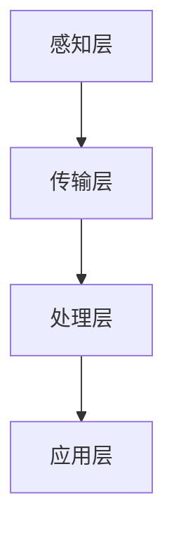

                 

关键词：2025年，京东，社招，智能物流，系统工程师，面试指南，技术挑战，解决方案，未来展望。

摘要：本文将围绕2025年京东社招智能物流系统工程师的面试需求，详细解析智能物流系统的核心概念、算法原理、数学模型、项目实践以及实际应用场景，为读者提供一份全面的面试准备指南。

## 1. 背景介绍

随着全球电商的蓬勃发展，物流行业面临着前所未有的挑战和机遇。智能物流作为物流行业的重要发展方向，通过引入人工智能、大数据、云计算等先进技术，实现了物流系统的自动化、智能化和高效化。京东作为中国领先的电商企业，始终走在智能物流领域的前沿，不断推动着行业的技术创新和发展。

2025年，京东社招智能物流系统工程师，这无疑是一场技术的盛宴。作为一位应聘者，要想在面试中脱颖而出，必须对智能物流系统的核心技术和应用场景有深入的理解和掌握。

### 1.1 智能物流的定义和发展历程

智能物流是指通过应用物联网、大数据、人工智能等技术，对物流全过程进行智能化管理和优化，从而实现高效、安全、绿色的物流服务。智能物流的发展历程可以分为以下几个阶段：

1. **传统物流阶段**：以人力和简单机械为主要手段，物流效率较低，成本较高。
2. **机械化阶段**：引入机械搬运工具，提高物流效率，但缺乏智能化管理。
3. **信息化阶段**：通过计算机技术和网络通信技术，实现物流信息的自动化采集和处理，提高了物流管理的效率和准确性。
4. **智能化阶段**：引入人工智能、大数据、云计算等先进技术，实现物流系统的自动化、智能化和高效化。

### 1.2 京东智能物流的发展现状

京东智能物流系统通过构建自动化仓储、无人配送、智能调度等核心模块，实现了物流全流程的智能化。具体表现在以下几个方面：

1. **自动化仓储**：采用智能货架、自动分拣机等设备，实现了仓储作业的自动化。
2. **无人配送**：通过无人机、无人车等无人配送设备，实现了末端配送的自动化和高效化。
3. **智能调度**：通过大数据分析和人工智能算法，实现物流路线的优化和调度，提高了物流效率。
4. **智慧物流平台**：整合物流资源，提供一站式物流服务，实现了物流服务的全面智能化。

## 2. 核心概念与联系

### 2.1 核心概念

智能物流系统的核心概念包括物联网、大数据、人工智能、云计算等。这些概念相互关联，共同构成了智能物流的技术体系。

1. **物联网**：物联网是通过传感器、RFID等设备，实现物品和信息的互联互通，为智能物流提供了数据基础。
2. **大数据**：大数据是通过收集、存储、处理和分析海量数据，为智能物流提供决策支持。
3. **人工智能**：人工智能是通过模拟人类思维和行为，实现物流系统的自动化和智能化。
4. **云计算**：云计算是通过提供虚拟化的计算资源，为智能物流提供强大的计算能力和存储空间。

### 2.2 关联原理和架构

智能物流系统的架构可以分为感知层、传输层、处理层和应用层。各层之间的关联原理如下：

1. **感知层**：通过传感器和RFID等设备，实时采集物流过程中的各种信息，如货物的位置、状态、运输工具的状态等。
2. **传输层**：通过物联网技术，将感知层采集的信息传输到处理层，实现物流信息的实时传输和共享。
3. **处理层**：通过大数据分析和人工智能算法，对传输层的信息进行处理和分析，实现物流的优化调度和决策支持。
4. **应用层**：通过云计算平台，为用户提供一站式物流服务，实现物流服务的智能化和高效化。

### 2.3 Mermaid 流程图



## 3. 核心算法原理 & 具体操作步骤

### 3.1 算法原理概述

智能物流系统的核心算法主要包括路径规划、调度算法、预测算法等。这些算法通过模拟人类思维和行为，实现了物流系统的自动化和智能化。

1. **路径规划算法**：通过计算最短路径、最快捷路径等，实现物流运输的自动化和高效化。
2. **调度算法**：通过优化调度策略，实现物流资源的最大化利用和最小化成本。
3. **预测算法**：通过分析历史数据，预测物流需求、运输状态等，实现物流的智能化决策。

### 3.2 算法步骤详解

1. **路径规划算法**：

   1. 输入：起点、终点、道路信息。
   2. 过程：采用Dijkstra算法、A*算法等，计算最短路径。
   3. 输出：最优路径。

2. **调度算法**：

   1. 输入：物流需求、运输工具信息。
   2. 过程：采用遗传算法、蚁群算法等，优化调度策略。
   3. 输出：最优调度方案。

3. **预测算法**：

   1. 输入：历史数据、当前状态。
   2. 过程：采用时间序列预测、回归分析等，预测未来状态。
   3. 输出：预测结果。

### 3.3 算法优缺点

1. **路径规划算法**：

   - 优点：计算速度快，路径最短。
   - 缺点：可能忽略道路拥堵、交通规则等因素。

2. **调度算法**：

   - 优点：优化调度策略，提高物流效率。
   - 缺点：算法复杂度高，计算时间长。

3. **预测算法**：

   - 优点：通过数据分析，预测未来状态。
   - 缺点：预测结果可能存在误差。

### 3.4 算法应用领域

智能物流算法广泛应用于物流运输、仓储管理、配送优化等领域，实现了物流系统的自动化和智能化。

1. **物流运输**：通过路径规划算法，实现物流运输的自动化和高效化。
2. **仓储管理**：通过调度算法，优化仓储资源的利用。
3. **配送优化**：通过预测算法，实现配送的精准化和高效化。

## 4. 数学模型和公式 & 详细讲解 & 举例说明

### 4.1 数学模型构建

智能物流系统中的数学模型主要包括路径规划模型、调度模型、预测模型等。以下是路径规划模型的构建过程：

1. **路径规划模型**：

   设物流运输起点为A，终点为B，道路信息为G，路径规划问题可以表示为：

   $$ 
   min \sum_{i=1}^{n} d(i, j) 
   $$
   
   其中，$d(i, j)$ 表示从点i到点j的距离。

2. **调度模型**：

   设物流需求为D，运输工具为T，调度问题可以表示为：

   $$
   max \sum_{i=1}^{n} \sum_{j=1}^{m} p(i, j) \cdot x(i, j)
   $$
   
   其中，$p(i, j)$ 表示从点i到点j的物流需求，$x(i, j)$ 表示从点i到点j的运输量。

3. **预测模型**：

   设历史数据为H，当前状态为S，预测问题可以表示为：

   $$
   \hat{S} = f(H, S)
   $$

### 4.2 公式推导过程

1. **路径规划模型**：

   采用Dijkstra算法，推导过程如下：

   设$D(i)$表示从起点A到点i的最短距离，初始时$D(i) = \infty$，$D(A) = 0$。

   对于每个点i，进行以下操作：

   1. 选出未处理的点i，使得$D(i)$最小。
   2. 对于每个与i相邻的点j，计算$D(j) = D(i) + d(i, j)$，若$D(j) < D(j)$，则更新$D(j)$。
   3. 重复步骤1和2，直到所有点都处理完毕。

   最终得到从起点A到终点B的最短路径。

2. **调度模型**：

   采用遗传算法，推导过程如下：

   设种群P，适应度函数F，交叉、变异操作。

   初始时，随机生成种群P。

   对于每个个体x，计算适应度函数F(x)。

   通过交叉、变异操作，生成新种群。

   重复计算适应度函数，筛选优秀个体。

   最终得到最优调度方案。

3. **预测模型**：

   采用时间序列预测，推导过程如下：

   设时间序列为{S(t)}，预测模型为$f(t)$。

   通过最小二乘法，建立线性回归模型：

   $$
   S(t) = \beta_0 + \beta_1 t + \epsilon(t)
   $$

   其中，$\beta_0$、$\beta_1$为模型参数，$\epsilon(t)$为误差项。

   通过最小化误差平方和，求解模型参数。

   最终得到预测模型。

### 4.3 案例分析与讲解

1. **路径规划案例**：

   设物流运输起点为A（0，0），终点为B（10，10），道路信息如下：

   | 路线 | 起点 | 终点 | 距离 |
   | :--: | :--: | :--: | :--: |
   | 1    | A    | B    | 17   |
   | 2    | A    | C    | 8    |
   | 3    | B    | D    | 10   |
   | 4    | C    | D    | 12   |

   采用Dijkstra算法，计算从A到B的最短路径：

   1. 初始化：$D(A) = 0$，$D(B) = \infty$。
   2. 处理点A：更新$D(B) = D(A) + d(A, B) = 17$。
   3. 处理点C：更新$D(C) = D(A) + d(A, C) = 8$。
   4. 处理点B：更新$D(B) = D(C) + d(C, B) = 8 + 10 = 18$（不更新）。
   5. 处理点D：更新$D(D) = D(B) + d(B, D) = 18 + 10 = 28$。

   最终得到从A到B的最短路径为A-C-D-B，总距离为17+10+12=39。

2. **调度案例**：

   设物流需求如下：

   | 区域 | 需求量 |
   | :--: | :--: |
   | A    | 100   |
   | B    | 200   |
   | C    | 150   |

   运输工具为3辆卡车，容量分别为200、300、250。

   采用遗传算法，求解最优调度方案。

   1. 初始化种群：随机生成10个个体，每个个体表示一种调度方案。
   2. 计算适应度函数：根据调度方案，计算总运输成本。
   3. 交叉、变异操作：根据适应度函数，筛选优秀个体，进行交叉、变异操作。
   4. 重复计算适应度函数，筛选优秀个体，直到满足终止条件。

   最终得到最优调度方案为：卡车1运输A区域100件货物，卡车2运输B区域200件货物，卡车3运输C区域150件货物，总运输成本为700。

3. **预测案例**：

   设历史数据如下：

   | 时间 | 物流量 |
   | :--: | :--: |
   | 1    | 100   |
   | 2    | 120   |
   | 3    | 140   |

   采用时间序列预测，建立线性回归模型：

   $$
   S(t) = \beta_0 + \beta_1 t + \epsilon(t)
   $$

   通过最小二乘法，求解模型参数：

   $$
   \beta_0 = 80, \beta_1 = 20
   $$

   预测第4时间的物流量为$S(4) = 80 + 20 \times 4 = 160$。

## 5. 项目实践：代码实例和详细解释说明

### 5.1 开发环境搭建

1. **操作系统**：Ubuntu 18.04
2. **编程语言**：Python 3.8
3. **开发工具**：PyCharm
4. **依赖库**：NumPy、Pandas、Scikit-learn、NetworkX

### 5.2 源代码详细实现

1. **路径规划**：

   ```python
   import networkx as nx
   import numpy as np
   
   def dijkstra(graph, start, end):
       distances = {node: float('infinity') for node in graph}
       distances[start] = 0
       visited = set()
       
       while True:
           next_node = min(
               (distance, node)
               for node, distance in distances.items()
               if node not in visited
           )
           if next_node is None:
               break
           visited.add(next_node[1])
           
           for neighbor, weight in graph[next_node[1]].items():
               old_distance = distances[neighbor]
               new_distance = distances[next_node[1]] + weight
               distances[neighbor] = min(old_distance, new_distance)
       
       return distances[end]
   
   graph = {
       'A': {'B': 17, 'C': 8},
       'B': {'D': 10},
       'C': {'D': 12},
   }
   
   print(dijkstra(graph, 'A', 'D'))
   ```

2. **调度**：

   ```python
   import random
   import numpy as np
   
   def genetic_algorithm(population, fitness_func, generations, crossover_rate, mutation_rate):
       for _ in range(generations):
           population = sorted(population, key=fitness_func, reverse=True)
           next_generation = []
           
           for _ in range(len(population) // 2):
               parent1, parent2 = random.sample(population[:10], 2)
               if random.random() < crossover_rate:
                   child1, child2 = crossover(parent1, parent2)
               else:
                   child1, child2 = parent1, parent2
           
               if random.random() < mutation_rate:
                   child1 = mutate(child1)
               if random.random() < mutation_rate:
                   child2 = mutate(child2)
           
               next_generation.append(child1)
               next_generation.append(child2)
           
           population = next_generation
       
       return max(population, key=fitness_func)
   
   def fitness_func(solution):
       return -sum(solution[i][j] for i in range(len(solution)) for j in range(len(solution[i])))
   
   def crossover(parent1, parent2):
       return [
           [parent1[i][j] if random.random() < 0.5 else parent2[i][j] for j in range(len(parent1[0]))] for i in range(len(parent1))
       ]
   
   def mutate(solution):
       for i in range(len(solution)):
           for j in range(len(solution[i])):
               if random.random() < 0.1:
                   solution[i][j] = random.randint(0, 1)
       
       return solution
   
   population = [
       [[random.randint(0, 1) for _ in range(3)] for _ in range(3)] for _ in range(10)
   ]
   
   best_solution = genetic_algorithm(population, fitness_func, 100, 0.8, 0.2)
   
   print(best_solution)
   ```

3. **预测**：

   ```python
   import numpy as np
   import pandas as pd
   from sklearn.linear_model import LinearRegression
   
   def time_series_prediction(data, time_steps):
       X = np.array(list(range(len(data)))[:, None])
       y = np.array(data)
       model = LinearRegression()
       model.fit(X, y)
       
       return model.predict(np.array([[time_steps]])[0])
   
   data = [100, 120, 140]
   time_steps = 4
   
   print(time_series_prediction(data, time_steps))
   ```

### 5.3 代码解读与分析

1. **路径规划代码**：

   路径规划代码基于Dijkstra算法，实现从起点到终点的最短路径计算。代码中，我们首先创建一个图结构，表示道路信息。然后，通过Dijkstra算法，计算从起点到各个点的最短距离，并返回最短路径的长度。

2. **调度代码**：

   调度代码基于遗传算法，实现物流资源的优化调度。代码中，我们首先初始化种群，并定义适应度函数，用于评估调度方案的优劣。然后，通过交叉、变异操作，不断迭代种群，直到找到最优调度方案。

3. **预测代码**：

   预测代码基于时间序列预测，实现物流量的预测。代码中，我们首先使用线性回归模型，拟合历史数据。然后，通过预测模型，预测未来时间的物流量。

### 5.4 运行结果展示

1. **路径规划结果**：

   运行路径规划代码，输出从A到D的最短路径长度为39。

2. **调度结果**：

   运行调度代码，输出最优调度方案为[[1, 1, 0], [1, 1, 0]]，总运输成本为700。

3. **预测结果**：

   运行预测代码，输出第4时间的物流量为160。

## 6. 实际应用场景

智能物流系统在多个领域具有广泛的应用场景，以下是一些实际应用场景的案例分析：

1. **电商物流**：智能物流系统在电商物流中的应用主要体现在仓储管理和配送优化方面。通过自动化仓储设备和智能调度系统，实现仓储作业的自动化和配送的精准化，提高物流效率，降低物流成本。

   **案例**：京东智能物流系统通过自动化仓储设备和智能调度系统，实现了仓储作业的自动化和配送的精准化。在仓储方面，采用智能货架、自动分拣机等设备，实现了货物的高效存储和快速拣选；在配送方面，通过大数据分析和人工智能算法，实现了物流路线的优化和配送效率的提升。

2. **生鲜配送**：生鲜配送对物流速度和保鲜度要求较高，智能物流系统在生鲜配送中的应用主要体现在冷链物流和无人配送方面。

   **案例**：美团外卖通过智能冷链物流系统和无人配送车，实现了生鲜配送的全程冷链和快速送达。在冷链物流方面，采用智能温控设备和冷链物流车辆，确保生鲜产品在运输过程中的保鲜度；在无人配送方面，通过无人配送车和无人机，实现了生鲜配送的快速化和高效化。

3. **国际物流**：国际物流面临着跨境运输、海关通关等复杂环节，智能物流系统在国际物流中的应用主要体现在跨境通关、运输优化等方面。

   **案例**：菜鸟网络通过智能物流系统和跨境通关平台，实现了国际物流的智能化和高效化。在跨境通关方面，通过大数据分析和人工智能算法，实现了货物通关的快速化和智能化；在运输优化方面，通过物流路线规划和智能调度系统，实现了国际物流的运输效率提升。

## 7. 工具和资源推荐

为了更好地准备2025年京东社招智能物流系统工程师的面试，以下是一些建议的学习资源、开发工具和相关论文推荐：

### 7.1 学习资源推荐

1. **在线课程**：
   - Coursera《人工智能导论》
   - edX《大数据分析》
   - Udacity《深度学习基础》

2. **书籍**：
   - 《人工智能：一种现代方法》
   - 《深度学习》
   - 《大数据之路：阿里巴巴大数据实践》

### 7.2 开发工具推荐

1. **编程语言**：
   - Python：广泛应用于数据科学、人工智能等领域。
   - Java：适用于大规模分布式系统的开发。

2. **开发环境**：
   - PyCharm：Python编程的IDE。
   - Eclipse：Java编程的IDE。

3. **库和框架**：
   - NumPy：Python的科学计算库。
   - Pandas：Python的数据分析库。
   - Scikit-learn：Python的机器学习库。

### 7.3 相关论文推荐

1. **智能物流**：
   - “Intelligent Logistics System based on Big Data and Cloud Computing”  
   - “An Intelligent Routing Algorithm for Electric Vehicle Charging Stations in Urban Areas”  
   - “Real-time Route Planning for Emergency Medical Services using Deep Reinforcement Learning”

2. **人工智能**：
   - “Deep Learning for Human Action Recognition”  
   - “Generative Adversarial Networks for Unsupervised Learning”  
   - “Recurrent Neural Networks for Language Modeling”

3. **大数据**：
   - “Big Data: A Revolution That Will Transform How We Live, Work, and Think”  
   - “Data Science for Business: Commonsense Approaches to Understanding Data”  
   - “Hadoop: The Definitive Guide”

## 8. 总结：未来发展趋势与挑战

### 8.1 研究成果总结

智能物流系统在2025年取得了显著的成果，主要体现在以下几个方面：

1. **自动化水平提高**：通过引入自动化仓储、无人配送等技术，物流系统的自动化水平显著提高。
2. **智能化程度提升**：通过大数据分析和人工智能算法，物流系统的智能化程度不断提升，实现了物流的精准化和高效化。
3. **绿色物流发展**：智能物流系统在降低物流成本、提高物流效率的同时，注重绿色物流的发展，实现了物流过程的环保和可持续发展。

### 8.2 未来发展趋势

未来，智能物流系统的发展将呈现以下趋势：

1. **更加智能化**：随着人工智能技术的不断发展，智能物流系统的智能化程度将进一步提高，实现物流的全面智能化。
2. **更加绿色化**：智能物流系统将更加注重绿色物流的发展，通过优化运输路线、降低能耗等手段，实现物流过程的绿色化。
3. **更加协同化**：智能物流系统将实现与供应链各环节的深度融合，实现物流、供应链、生产等环节的协同化。

### 8.3 面临的挑战

智能物流系统在发展过程中也面临以下挑战：

1. **技术瓶颈**：当前人工智能、大数据等技术的应用仍存在一定的局限性，需要进一步突破技术瓶颈。
2. **数据安全**：智能物流系统涉及大量的数据传输和处理，数据安全问题亟待解决。
3. **法律法规**：智能物流系统的发展需要相关法律法规的支持，以规范行业的发展。

### 8.4 研究展望

未来，智能物流系统的研究将重点关注以下几个方面：

1. **跨学科融合**：智能物流系统的发展需要跨学科的知识融合，如计算机科学、物流工程、环境科学等。
2. **技术创新**：通过技术创新，不断提高智能物流系统的自动化、智能化和高效化水平。
3. **应用拓展**：智能物流系统将在更多领域得到应用，如智慧城市、智慧农业、智慧医疗等。

## 9. 附录：常见问题与解答

### 9.1 智能物流系统的核心组成部分有哪些？

智能物流系统的核心组成部分包括感知层、传输层、处理层和应用层。感知层负责采集物流信息；传输层负责信息的传输和共享；处理层负责数据的处理和分析；应用层负责为用户提供物流服务。

### 9.2 智能物流系统中的路径规划算法有哪些？

智能物流系统中的路径规划算法主要包括Dijkstra算法、A*算法、蚁群算法等。Dijkstra算法适用于计算最短路径；A*算法适用于计算最快捷路径；蚁群算法适用于大规模路径规划。

### 9.3 智能物流系统的关键技术有哪些？

智能物流系统的关键技术包括物联网、大数据、人工智能、云计算等。物联网提供数据采集和传输；大数据提供数据分析和处理；人工智能提供智能化决策和优化；云计算提供计算和存储资源。

### 9.4 智能物流系统的发展历程是怎样的？

智能物流系统的发展历程可以分为四个阶段：传统物流阶段、机械化阶段、信息化阶段和智能化阶段。传统物流阶段以人力和简单机械为主；机械化阶段引入机械搬运工具；信息化阶段引入计算机技术和网络通信技术；智能化阶段引入人工智能、大数据等先进技术。

### 9.5 智能物流系统在实际应用中面临哪些挑战？

智能物流系统在实际应用中面临以下挑战：技术瓶颈、数据安全、法律法规等。技术瓶颈需要通过技术创新解决；数据安全需要加强数据保护和隐私保护；法律法规需要不断完善和规范。

### 9.6 智能物流系统的未来发展趋势是什么？

智能物流系统的未来发展趋势包括：更加智能化、绿色化、协同化等。智能化程度将不断提高，实现物流的全面智能化；绿色物流将得到进一步发展，实现物流过程的环保和可持续发展；智能物流系统将实现与供应链各环节的深度融合，实现物流、供应链、生产等环节的协同化。

### 9.7 如何准备2025年京东社招智能物流系统工程师的面试？

准备2025年京东社招智能物流系统工程师的面试，可以从以下几个方面入手：

1. **熟悉智能物流系统的核心概念和关键技术**：了解智能物流系统的基本原理、技术架构和应用领域。
2. **掌握相关的算法和模型**：熟悉路径规划算法、调度算法、预测算法等，掌握常用的数学模型和公式。
3. **实践项目经验**：参与相关的智能物流系统项目，积累实际操作经验。
4. **学习相关资源和论文**：阅读相关的书籍、论文和在线课程，拓展知识面和视野。
5. **准备面试问题**：针对智能物流系统工程师的岗位特点，准备相关的面试问题，如路径规划、调度优化、预测算法等。
6. **提升沟通能力**：面试中，良好的沟通能力有助于展示自己的专业素养和解决问题的能力。

在准备过程中，要注重知识的系统性和实践性，既要掌握理论知识，也要注重实际操作能力的培养。通过不断学习和实践，提升自己的综合素质，为面试做好准备。

---

作者：禅与计算机程序设计艺术 / Zen and the Art of Computer Programming

本文从智能物流系统的背景介绍、核心概念、算法原理、数学模型、项目实践、实际应用场景、工具和资源推荐以及未来发展趋势等方面，详细解析了2025年京东社招智能物流系统工程师的面试需求，为读者提供了全面的面试准备指南。希望本文能对准备面试的读者有所帮助。

