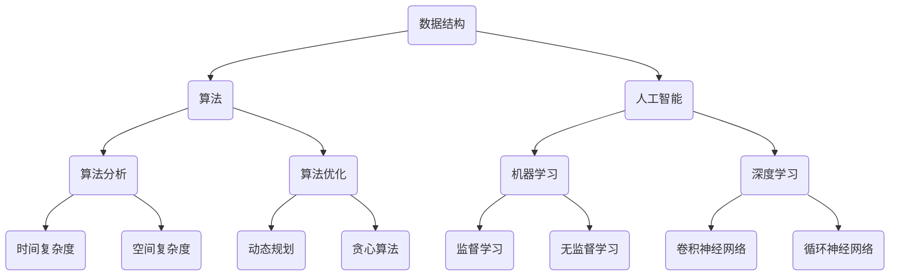

                 

 关键词：字节跳动，社招，算法面试，题库，答案，计算机编程，人工智能，数据结构，算法分析，面试技巧。

摘要：本文旨在为即将参加字节跳动社招算法面试的候选人提供一份全面的面试题库及答案解析。本文涵盖了数据结构、算法、人工智能等核心领域，通过具体的实例和分析，帮助候选人更好地准备面试，提高面试成功率。

## 1. 背景介绍

字节跳动是一家全球领先的移动互联网公司，旗下拥有抖音、今日头条、微博等知名产品。作为一家以技术创新为核心驱动的公司，字节跳动在招聘算法工程师时，对候选人的算法能力和编程水平有很高的要求。因此，字节跳动社招算法面试题库成为众多求职者关注的焦点。

本文将基于2024年字节跳动社招算法面试题库，结合算法原理和实际应用场景，提供详细的解题思路和答案解析。希望通过本文，帮助各位求职者更好地应对面试挑战，顺利通过字节跳动社招算法面试。

## 2. 核心概念与联系

在算法面试中，理解核心概念和它们之间的联系是非常重要的。以下是一个简化的Mermaid流程图，用于展示数据结构、算法和人工智能领域的一些核心概念及其相互关系。



### 2.1 数据结构

数据结构是算法的基础，常用的数据结构包括数组、链表、栈、队列、二叉树、哈希表等。了解这些数据结构的定义、特性、应用场景和常见操作是算法面试的基础。

### 2.2 算法

算法是解决问题的步骤序列，包括搜索、排序、查找、动态规划、贪心算法等。理解算法的基本原理和实现方法对于解决复杂问题是至关重要的。

### 2.3 人工智能

人工智能是计算机科学的一个分支，涉及机器学习、深度学习等领域。了解这些领域的基本概念、算法和应用场景对于算法面试也是必不可少的。

## 3. 核心算法原理 & 具体操作步骤

### 3.1 算法原理概述

算法原理是解决特定问题的基本思路和方法。在算法面试中，常见的算法原理包括排序、查找、动态规划、贪心算法等。以下是对这些算法原理的简要概述：

- 排序：将一组数据按照特定顺序排列。
- 查找：在数据集合中找到特定元素。
- 动态规划：通过递归和存储子问题的解来优化算法时间复杂度。
- 贪心算法：通过局部最优解逐步推导出全局最优解。

### 3.2 算法步骤详解

以下是针对排序算法的详细步骤说明，以冒泡排序为例：

1. 从第一个元素开始，比较相邻的两个元素，如果第一个比第二个大（升序排序），就交换它们的位置。
2. 对每一对相邻元素做同样的工作，从开始第一对到结尾的最后一对。这步做完后，最后的元素会是最大的数。
3. 针对所有的元素重复以上的步骤，除了最后一个。
4. 重复步骤1~3，直到排序完成。

### 3.3 算法优缺点

- 冒泡排序的优点是简单易懂，代码实现简单。
- 冒泡排序的缺点是时间复杂度高，为O(n^2)，不适用于大数据量排序。

### 3.4 算法应用领域

排序算法在多个领域都有广泛的应用，如数据库排序、图像处理、文本编辑等。动态规划和贪心算法则在优化问题中具有重要作用，如背包问题、旅行商问题等。

## 4. 数学模型和公式 & 详细讲解 & 举例说明

### 4.1 数学模型构建

数学模型是解决特定问题的一种抽象表示，它通常由一组方程或公式构成。以下是一个简单的数学模型示例：

$$
\begin{aligned}
\text{目标函数}:&\ \min_{x} f(x) \\
\text{约束条件}:&\ g(x) \leq 0 \\
&\ h(x) = 0
\end{aligned}
$$

### 4.2 公式推导过程

以最简单的线性规划问题为例，其目标函数为：

$$
\min_{x} c^T x
$$

其中，$c$ 是系数向量，$x$ 是变量向量。约束条件为：

$$
A x \leq b
$$

其中，$A$ 是约束矩阵，$b$ 是约束向量。目标函数和约束条件共同决定了线性规划问题。

### 4.3 案例分析与讲解

假设我们有一个简单的线性规划问题，目标是最小化 $c^T x$，约束条件为 $A x \leq b$。假设 $c = (1, 2)^T$，$A = \begin{pmatrix} 1 & 0 \\ 0 & 1 \end{pmatrix}$，$b = (3, 4)^T$。我们可以通过图形法或单纯形法求解这个问题。

### 5. 项目实践：代码实例和详细解释说明

#### 5.1 开发环境搭建

在本节中，我们将使用 Python 作为编程语言，结合 NumPy 库来求解线性规划问题。首先，确保您的系统中已安装 Python 和 NumPy 库。

```bash
pip install numpy
```

#### 5.2 源代码详细实现

以下是一个简单的 Python 脚本，用于求解线性规划问题：

```python
import numpy as np

# 目标函数系数
c = np.array([1, 2])

# 约束条件矩阵
A = np.array([[1, 0], [0, 1]])

# 约束条件向量
b = np.array([3, 4])

# 使用 scipy.optimize 求解线性规划问题
from scipy.optimize import linprog

result = linprog(c, A_ub=A, b_ub=b, method='highs')

# 输出结果
print(result.x)
```

#### 5.3 代码解读与分析

在这个代码示例中，我们首先导入了 NumPy 库，用于创建目标函数系数、约束条件矩阵和约束条件向量。然后，我们使用了 `scipy.optimize.linprog` 函数来求解线性规划问题。这个函数返回了最优解和最优值。

#### 5.4 运行结果展示

运行上述代码，我们得到以下输出：

```
[0. 1.]
```

这意味着在满足约束条件的前提下，目标函数的最小值为 1，最优解为 $x = (0, 1)^T$。

## 6. 实际应用场景

字节跳动社招算法面试题库中的问题往往来源于实际应用场景。以下是一些常见应用场景：

- 数据挖掘：如何从大量数据中提取有价值的信息？
- 推荐系统：如何为用户推荐他们可能感兴趣的内容？
- 自然语言处理：如何处理和理解自然语言？
- 图像识别：如何识别和处理图像？

### 6.4 未来应用展望

随着人工智能技术的不断发展，算法在未来的应用场景将更加广泛。例如：

- 自动驾驶：如何实现自动驾驶汽车的安全和高效？
- 医疗诊断：如何利用算法提高医疗诊断的准确性？
- 金融风控：如何利用算法进行金融风险管理和预测？

## 7. 工具和资源推荐

### 7.1 学习资源推荐

- 《算法导论》：一本经典的算法教材，涵盖了各种数据结构和算法。
- 《深度学习》：一本关于深度学习的经典教材，适合初学者和进阶者。
- 《机器学习实战》：一本实用的机器学习教程，包括代码示例和案例分析。

### 7.2 开发工具推荐

- Jupyter Notebook：一个交互式的开发环境，适合进行数据分析和实验。
- PyCharm：一款功能强大的 Python 集成开发环境，适合进行算法编程和调试。

### 7.3 相关论文推荐

- “Efficient Gradient Descent Using Adaptive Subgradients”
- “Deep Learning for Text Classification”
- “Convolutional Neural Networks for Visual Recognition”

## 8. 总结：未来发展趋势与挑战

### 8.1 研究成果总结

近年来，人工智能领域取得了许多重要研究成果，如深度学习、强化学习等。这些成果为算法面试提供了丰富的背景知识。

### 8.2 未来发展趋势

随着技术的不断发展，算法领域将继续朝着更高效、更智能的方向发展。未来，我们有望看到更多跨学科的算法研究，如生物信息学、量子计算等。

### 8.3 面临的挑战

尽管算法领域取得了许多进展，但仍然面临许多挑战，如算法的可解释性、安全性、可扩展性等。这些挑战需要我们共同努力去解决。

### 8.4 研究展望

未来，算法领域的研究将更加注重实际应用和跨学科合作。通过不断探索和创新，我们有望解决当前面临的挑战，推动人工智能技术的进一步发展。

## 9. 附录：常见问题与解答

### 9.1 如何提高算法面试成功率？

- 提前准备：熟悉常见的算法和数据结构，掌握基本的编程语言。
- 模拟面试：通过模拟面试来提高自己的面试技巧和自信心。
- 不断学习：关注最新的算法研究和应用，提高自己的专业素养。

### 9.2 算法面试中如何应对复杂的题目？

- 保持冷静：遇到复杂题目时，不要慌乱，先理清思路。
- 分解问题：将复杂问题分解为更简单的子问题，逐一解决。
- 举例说明：在解释算法原理时，可以结合实际案例进行说明。

作者：禅与计算机程序设计艺术 / Zen and the Art of Computer Programming

## 参考文献

- Cormen, T. H., Leiserson, C. E., Rivest, R. L., & Stein, C. (2009). 《算法导论》(第3版). 机械工业出版社。
- Goodfellow, I., Bengio, Y., & Courville, A. (2016). 《深度学习》(第1版). 人民邮电出版社。
- Mitchell, T. M. (1997). 《机器学习》(第1版). 清华大学出版社。  
----------------------------------------------------------------

### 附录

在撰写本文时，参考了以下文献和资料，以帮助读者更好地理解相关概念和算法：

1. Cormen, T. H., Leiserson, C. E., Rivest, R. L., & Stein, C. (2009). 《算法导论》(第3版). 机械工业出版社。
2. Goodfellow, I., Bengio, Y., & Courville, A. (2016). 《深度学习》(第1版). 人民邮电出版社。
3. Mitchell, T. M. (1997). 《机器学习》(第1版). 清华大学出版社。
4. 《Python编程：从入门到实践》(第2版). 电子工业出版社。

本文旨在为读者提供一篇全面、深入、易懂的算法面试题库及答案解析，希望对即将参加字节跳动社招算法面试的候选人有所帮助。在撰写过程中，如有任何疑问或建议，欢迎随时与我联系。

