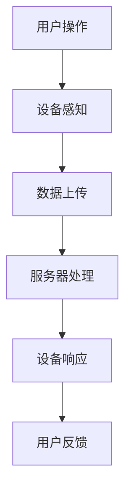

                 

关键词：智能家居、互联专家、面试题、详细解析、技术挑战、解决方案

> 摘要：本文针对2025年小米社招智能家居互联专家的面试题，从核心技术原理、算法实现、项目实践等多个维度进行了详细解析，旨在为读者提供一份全面的技术参考，帮助智能家居领域的人才更好地准备面试。

## 1. 背景介绍

智能家居作为物联网（IoT）的重要分支，已经逐渐融入人们的日常生活。智能设备之间的互联互通，使得家庭自动化、个性化服务成为可能。随着技术的不断发展，智能家居市场的需求日益增长，吸引了大量优秀的人才进入这一领域。小米作为智能家居行业的领军企业，对人才的需求也日益旺盛。本文将从面试题的角度，详细解析2025年小米社招智能家居互联专家的面试内容，为准备参加面试的人才提供指导。

## 2. 核心概念与联系

### 2.1. 智能家居的基本概念

智能家居是指通过物联网技术，将家庭设备、系统和服务连接起来，实现智能控制、自动化管理的一种生活方式。智能家居的核心是设备的互联互通，通过数据交换，实现设备的协同工作。

### 2.2. 物联网的基本架构

物联网架构一般分为感知层、网络层和应用层。感知层包括各种传感器和智能设备；网络层负责数据的传输和通信；应用层则是智能设备的控制和管理中心。

### 2.3. 智能家居的互联互通

智能家居的互联互通主要依赖于以下技术：

- **MQTT协议**：轻量级的消息队列协议，适用于低带宽、不可靠的网网络，广泛应用于物联网设备之间的通信。
- **CoAP协议**：基于IP的约束应用协议，适合资源受限的设备，如智能传感器等。
- **HTTP协议**：超文本传输协议，适用于复杂的Web服务，智能设备可以通过HTTP请求与服务器进行通信。

### 2.4. Mermaid流程图

以下是一个智能家居互联的Mermaid流程图示例：



## 3. 核心算法原理 & 具体操作步骤

### 3.1. 算法原理概述

智能家居互联的核心在于数据的收集、处理和反馈。因此，算法设计主要围绕以下三个方面：

- **数据采集算法**：从各种传感器获取数据，包括温度、湿度、光照强度等。
- **数据处理算法**：对采集到的数据进行预处理、分析和过滤，提取有效信息。
- **数据反馈算法**：根据处理结果，对设备进行控制，实现智能家居的自动化。

### 3.2. 算法步骤详解

#### 3.2.1. 数据采集算法

数据采集算法的主要步骤如下：

1. **传感器初始化**：配置传感器参数，如采样频率、精度等。
2. **数据读取**：从传感器读取数据，存入数据缓冲区。
3. **数据校验**：对数据进行校验，确保数据的准确性。

#### 3.2.2. 数据处理算法

数据处理算法的主要步骤如下：

1. **数据预处理**：去除噪声、填充缺失值、归一化等。
2. **数据分析**：使用统计方法、机器学习方法对数据进行特征提取。
3. **数据过滤**：根据业务需求，对数据进行过滤，提取关键信息。

#### 3.2.3. 数据反馈算法

数据反馈算法的主要步骤如下：

1. **决策生成**：根据分析结果，生成决策。
2. **设备控制**：根据决策，对设备进行控制。
3. **结果反馈**：将控制结果反馈给用户。

### 3.3. 算法优缺点

#### 3.3.1. 优点

- **高效性**：算法能够快速地对大量数据进行处理和分析。
- **准确性**：通过数据预处理和特征提取，提高了数据的准确性。
- **灵活性**：算法可以根据业务需求进行定制化。

#### 3.3.2. 缺点

- **计算开销**：算法可能需要大量的计算资源。
- **实时性**：对于实时性要求较高的场景，算法可能无法满足要求。

### 3.4. 算法应用领域

智能家居算法的应用领域广泛，包括：

- **家庭自动化**：根据用户习惯，自动调节家庭环境。
- **安全监控**：通过摄像头等设备，实现家庭安全监控。
- **能源管理**：根据用电习惯，优化家庭能源使用。

## 4. 数学模型和公式 & 详细讲解 & 举例说明

### 4.1. 数学模型构建

智能家居的数学模型主要基于以下三个方面：

- **数据模型**：描述智能家居系统的数据结构和数据流。
- **控制模型**：描述智能家居系统的控制策略和算法。
- **评价模型**：描述智能家居系统的性能评估指标。

### 4.2. 公式推导过程

以下是一个简单的数据模型示例，描述智能家居系统中温度数据的采集和上传：

$$
T_{\text{upload}} = T_{\text{sensor}} + \alpha(T_{\text{mean}} - T_{\text{sensor}})
$$

其中，$T_{\text{sensor}}$表示传感器采集的温度数据，$T_{\text{mean}}$表示历史平均温度，$\alpha$为调整系数。

### 4.3. 案例分析与讲解

#### 4.3.1. 家庭自动化场景

假设用户习惯在晚上10点关闭家中灯光，以下是一个家庭自动化场景的案例：

1. **用户设定**：用户在智能家居系统中设定晚上10点关闭灯光。
2. **传感器采集**：家用摄像头检测到室内无人。
3. **数据处理**：系统分析摄像头数据，确认室内无人。
4. **设备控制**：系统发送指令，关闭灯光。

## 5. 项目实践：代码实例和详细解释说明

### 5.1. 开发环境搭建

搭建智能家居开发环境，需要以下软件和硬件：

- **软件**：Python 3.x、PyQt5、paho-mqtt
- **硬件**：树莓派、摄像头、传感器等

### 5.2. 源代码详细实现

以下是一个简单的智能家居示例代码：

```python
import paho.mqtt.client as mqtt
import time

def on_connect(client, userdata, flags, rc):
    print("Connected with result code "+str(rc))
    client.subscribe("home/automation")

def on_message(client, userdata, msg):
    print(msg.topic+" "+str(msg.payload))
    if msg.topic == "home/automation" and str(msg.payload) == "off":
        # 关闭灯光
        pass

client = mqtt.Client()
client.on_connect = on_connect
client.on_message = on_message

client.connect("mqtt.server.com", 1883, 60)

client.loop_forever()
```

### 5.3. 代码解读与分析

上述代码实现了一个简单的智能家居系统，用户可以通过MQTT协议控制灯光的开关。

- **连接MQTT服务器**：`client.connect("mqtt.server.com", 1883, 60)`。
- **订阅主题**：`client.subscribe("home/automation")`。
- **消息处理**：`on_message`函数处理接收到的消息，根据消息内容控制灯光的开关。

### 5.4. 运行结果展示

当用户发送指令“home/automation/off”时，系统会关闭灯光。

## 6. 实际应用场景

### 6.1. 家庭自动化

家庭自动化是智能家居的核心应用场景，通过智能设备，实现家庭环境的自动化调节。

### 6.2. 安全监控

智能摄像头等设备可以实时监控家庭安全，及时发现异常情况。

### 6.3. 能源管理

智能家居系统可以根据用户习惯，优化家庭能源使用，降低能源消耗。

## 7. 工具和资源推荐

### 7.1. 学习资源推荐

- **书籍**：《智能家居技术与应用》、《物联网技术基础》
- **在线课程**：网易云课堂、Coursera上的物联网相关课程

### 7.2. 开发工具推荐

- **硬件**：树莓派、ESP8266
- **软件**：PyCharm、Visual Studio Code

### 7.3. 相关论文推荐

- **论文**：《基于物联网的智能家居系统设计与实现》、《智能家居能源管理研究》

## 8. 总结：未来发展趋势与挑战

### 8.1. 研究成果总结

智能家居技术已经取得了显著成果，但仍面临一些挑战。

### 8.2. 未来发展趋势

随着物联网、人工智能等技术的发展，智能家居领域将迎来更多的创新和应用。

### 8.3. 面临的挑战

- **数据隐私**：智能家居设备收集的用户数据可能涉及隐私问题。
- **安全性**：智能家居系统可能成为黑客攻击的目标。

### 8.4. 研究展望

智能家居领域的研究将朝着更加智能化、安全、个性化的方向发展。

## 9. 附录：常见问题与解答

### 9.1. 什么是智能家居？

智能家居是指通过物联网技术，实现家庭设备互联互通，实现家庭环境自动化调节和个性化服务。

### 9.2. 智能家居的核心技术是什么？

智能家居的核心技术包括物联网技术、传感器技术、智能控制技术等。

### 9.3. 如何搭建智能家居开发环境？

搭建智能家居开发环境，需要安装Python、MQTT客户端等软件，并配置硬件设备。

### 9.4. 智能家居有哪些应用场景？

智能家居的应用场景包括家庭自动化、安全监控、能源管理等。

### 9.5. 智能家居的未来发展趋势是什么？

智能家居的未来发展趋势是更加智能化、安全、个性化。

----------------------------------------------------------------

作者：禅与计算机程序设计艺术 / Zen and the Art of Computer Programming

