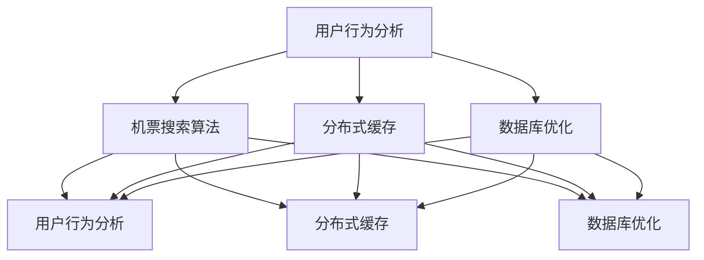

                 

### 关键词 Keywords
- 携程
- 社招
- 机票预订系统
- 面试题
- 工程师
- 技术面试
- 系统架构
- 数据结构
- 算法

> **摘要：**本文汇集了2025年携程公司面向社会招聘机票预订系统工程师的面试题，涵盖了系统架构设计、数据结构、算法应用、软件开发实践等方面。本文旨在为准备参加携程面试的工程师提供参考和指导，帮助他们在面试中展示自己的技术能力和解决方案思维。

## 1. 背景介绍

携程作为中国领先的在线旅行服务公司，其机票预订系统是公司业务的核心组成部分。随着互联网技术的飞速发展和用户需求的不断升级，携程的机票预订系统也经历了多次迭代和优化。为了保持技术领先地位，携程持续招聘优秀的机票预订系统工程师，以提升系统的性能、可扩展性和用户体验。

本文旨在通过整理2025年携程社会招聘机票预订系统工程师的面试题，帮助应聘者更好地准备面试，同时为业界同仁提供参考和交流。本文内容结构如下：

- **背景介绍**：简要介绍携程机票预订系统的现状和招聘背景。
- **核心概念与联系**：阐述机票预订系统涉及的核心概念和架构。
- **核心算法原理 & 具体操作步骤**：深入分析机票预订系统中常用的算法原理和操作步骤。
- **数学模型和公式 & 详细讲解 & 举例说明**：介绍机票预订系统中的数学模型和公式，并举例说明。
- **项目实践：代码实例和详细解释说明**：提供机票预订系统的代码实例和解释。
- **实际应用场景**：探讨机票预订系统的实际应用场景。
- **工具和资源推荐**：推荐学习资源和开发工具。
- **总结：未来发展趋势与挑战**：总结研究成果，展望未来发展趋势和挑战。

### 1.1 携程机票预订系统现状

携程机票预订系统是一个高度集成、分布式、高并发和高可用性的系统。它涵盖了从用户查询机票、选择航班、在线支付到订单管理的全过程。系统采用微服务架构，各服务模块独立部署，通过API进行通信。以下是携程机票预订系统的现状：

- **高并发处理**：系统需要支持每秒数千次的高并发请求，确保用户在高峰时段能够流畅地完成机票预订。
- **数据一致性**：系统涉及多个数据源，如航班信息、用户订单、支付记录等，需要保证数据的一致性和准确性。
- **扩展性和可维护性**：系统设计需要考虑未来的业务扩展和可维护性，便于持续迭代和优化。
- **用户友好性**：系统提供简洁、直观的用户界面，提升用户体验，降低用户操作成本。

### 1.2 招聘背景

2025年，携程继续加大机票预订系统的技术投入，以提升系统性能和用户体验。公司面向社会招聘机票预订系统工程师，要求应聘者具备扎实的技术背景、良好的学习能力、出色的解决问题能力和团队合作精神。以下是招聘的主要条件和要求：

- **学历背景**：本科及以上学历，计算机相关专业背景。
- **技术能力**：熟悉网络编程、数据结构与算法、分布式系统等。
- **项目经验**：有机票预订系统或类似大型系统开发经验者优先。
- **编程技能**：熟练掌握Java、Python等编程语言，熟悉主流框架（如Spring、Django等）。
- **学习能力**：具备快速学习新技术的能力，关注业界动态。
- **沟通能力**：良好的沟通能力和团队合作精神，能够适应快节奏的工作环境。

## 2. 核心概念与联系

机票预订系统涉及多个核心概念和架构设计，包括用户行为分析、机票搜索算法、分布式缓存、数据库优化等。以下是这些概念和架构的简要概述，以及它们的相互联系。

### 2.1 用户行为分析

用户行为分析是机票预订系统的重要一环。通过收集和分析用户浏览、搜索、选择航班等行为，可以预测用户偏好，优化推荐算法，提高转化率。用户行为分析通常涉及以下方面：

- **用户画像**：根据用户的历史行为数据，构建用户画像，包括年龄段、职业、出行频率等。
- **行为轨迹**：记录用户在系统中的行为轨迹，如搜索历史、浏览记录、点击次数等。
- **行为预测**：基于用户画像和行为轨迹，预测用户未来的行为，如预订意向、偏好航班等。

### 2.2 机票搜索算法

机票搜索算法是机票预订系统的核心算法之一。它根据用户查询条件，从大量航班数据中筛选出符合条件的航班，并提供排序和过滤功能。机票搜索算法通常涉及以下方面：

- **航班数据源**：包括航班信息、机场信息、航空公司信息等。
- **查询条件**：用户输入的查询条件，如出发城市、到达城市、出发日期、价格范围等。
- **搜索策略**：根据查询条件，选择合适的搜索算法，如深度优先搜索、广度优先搜索等。
- **排序和过滤**：根据用户需求和系统策略，对搜索结果进行排序和过滤，如价格优先、时间优先等。

### 2.3 分布式缓存

分布式缓存是机票预订系统提高性能和响应速度的重要手段。通过缓存热点数据，减少数据库查询次数，降低系统延迟。分布式缓存通常涉及以下方面：

- **缓存策略**：根据数据访问模式和缓存成本，选择合适的缓存策略，如LRU（最近最少使用）、LRU-K（最近最少使用，超过阈值淘汰）等。
- **缓存一致性**：保证缓存数据和数据库数据的一致性，避免数据不一致导致的问题。
- **缓存命中率**：评估缓存的有效性，通过优化缓存策略和热点数据识别，提高缓存命中率。

### 2.4 数据库优化

数据库优化是机票预订系统性能优化的关键环节。通过优化数据库设计、索引、查询等，提高数据访问速度和系统性能。数据库优化通常涉及以下方面：

- **数据库设计**：根据业务需求，设计合理的数据库表结构，如ER模型、关系模型等。
- **索引优化**：根据查询需求和数据特点，选择合适的索引策略，如B树索引、哈希索引等。
- **查询优化**：通过分析查询执行计划，优化查询语句和索引使用，提高查询性能。

### 2.5 架构联系

机票预订系统的各个核心概念和架构设计相互联系，共同构成了一个完整、高效、可扩展的系统。以下是这些概念和架构之间的联系：

- **用户行为分析**：为机票搜索算法提供用户偏好和需求信息，优化搜索结果和推荐策略。
- **机票搜索算法**：为用户行为分析提供数据支持，通过分析搜索行为，调整搜索算法和推荐策略。
- **分布式缓存**：为用户行为分析和机票搜索算法提供热点数据缓存，减少数据库查询次数，提高系统性能。
- **数据库优化**：为分布式缓存和机票搜索算法提供数据存储和访问支持，优化数据库设计、索引和查询，提高数据访问速度。

### 2.6 Mermaid 流程图

以下是机票预订系统涉及的各个核心概念和架构的Mermaid流程图：



### 2.7 小结

机票预订系统涉及多个核心概念和架构设计，包括用户行为分析、机票搜索算法、分布式缓存和数据库优化。这些概念和架构相互联系，共同构成了一个高效、可扩展的系统。理解这些概念和架构，对于机票预订系统工程师来说至关重要。

## 3. 核心算法原理 & 具体操作步骤

机票预订系统中的核心算法主要包括机票搜索算法、排序算法和过滤算法。以下将分别介绍这些算法的原理和具体操作步骤。

### 3.1 机票搜索算法

机票搜索算法是机票预订系统的核心算法之一，其主要功能是根据用户输入的查询条件，从大量航班数据中快速筛选出符合条件的航班，并提供排序和过滤功能。机票搜索算法的原理主要包括以下方面：

- **前缀树（Prefix Tree）**：通过构建前缀树，实现快速查询和匹配。前缀树是一种多叉树结构，每个节点表示一个字符，从根节点到某个节点的路径表示一个字符串的前缀。例如，对于字符串集合{"I", "IPhone", "IPad"}，可以构建如下前缀树：

  ```mermaid
  graph TD
  A[根]
  B[I]
  C[IPhone]
  D[IPad]
  A --> B
  B --> C
  B --> D
  ```

  利用前缀树，可以快速匹配以"I"开头的字符串，实现快速查询。

- **分治策略**：对于大规模航班数据，采用分治策略，将数据划分为更小的子集，分别进行处理，再合并结果。分治策略可以降低搜索时间复杂度，提高查询效率。

具体操作步骤如下：

1. **构建前缀树**：将航班数据按照航班号构建前缀树，方便快速查询。

2. **分治搜索**：根据用户输入的查询条件，从前缀树中分治搜索符合条件的航班。

3. **排序和过滤**：对搜索结果进行排序和过滤，根据用户需求和系统策略，提供排序和过滤功能。

### 3.2 排序算法

排序算法是机票预订系统中常用的算法之一，其主要功能是根据用户需求和系统策略，对航班搜索结果进行排序。常见的排序算法包括：

- **冒泡排序（Bubble Sort）**：通过重复遍历待排序的数组，一次比较两个相邻的元素，若它们的顺序错误就交换它们，直至没有需要交换的元素。冒泡排序的时间复杂度为O(n^2)，适用于数据量较小的情况。

- **快速排序（Quick Sort）**：通过选取一个基准元素，将数组分为两部分，一部分比基准元素小，另一部分比基准元素大，然后递归对两部分进行快速排序。快速排序的时间复杂度为O(nlogn)，适用于数据量较大的情况。

具体操作步骤如下：

1. **选择基准元素**：从数组中选取一个基准元素，通常选择第一个或最后一个元素。

2. **分区操作**：将数组划分为两部分，一部分包含小于基准元素的元素，另一部分包含大于基准元素的元素。

3. **递归排序**：对两部分递归执行快速排序，直至整个数组有序。

### 3.3 过滤算法

过滤算法是机票预订系统中常用的算法之一，其主要功能是根据用户需求和系统策略，对航班搜索结果进行过滤。常见的过滤算法包括：

- **条件过滤（Conditional Filtering）**：根据用户输入的条件，如出发城市、到达城市、出发日期、价格范围等，对搜索结果进行过滤。

- **优先级过滤（Priority Filtering）**：根据用户需求和系统策略，设置不同过滤条件的优先级，依次对搜索结果进行过滤。

具体操作步骤如下：

1. **条件过滤**：根据用户输入的条件，对搜索结果进行过滤，只保留符合条件的航班。

2. **优先级过滤**：根据用户需求和系统策略，设置不同过滤条件的优先级，依次对搜索结果进行过滤，直至满足所有条件。

### 3.4 算法优缺点

- **机票搜索算法**：
  - 优点：快速查询，支持前缀匹配，降低搜索时间复杂度。
  - 缺点：构建前缀树需要额外空间，对于大量航班数据，前缀树的大小可能较大。

- **排序算法**：
  - 冒泡排序：
    - 优点：简单易懂，实现简单。
    - 缺点：时间复杂度较高，适用于数据量较小的情况。
  - 快速排序：
    - 优点：时间复杂度较低，适用于数据量较大的情况。
    - 缺点：可能导致数据不平衡，影响性能。

- **过滤算法**：
  - 优点：灵活性强，可以根据用户需求和系统策略进行定制。
  - 缺点：对于大量数据，可能需要多次过滤，增加计算时间。

### 3.5 算法应用领域

- **机票预订系统**：机票搜索算法、排序算法和过滤算法在机票预订系统中广泛应用，用于快速搜索、排序和过滤航班信息，提高用户体验和系统性能。

- **搜索引擎**：机票搜索算法中的前缀树结构可以应用于搜索引擎，实现快速查询和匹配。

- **大数据处理**：排序算法和过滤算法在大数据处理领域有广泛的应用，如数据排序、筛选和统计分析。

### 3.6 小结

机票预订系统中的核心算法包括机票搜索算法、排序算法和过滤算法。机票搜索算法通过前缀树实现快速查询，排序算法采用快速排序提高排序效率，过滤算法根据用户需求和系统策略实现灵活过滤。理解这些算法的原理和具体操作步骤，对于机票预订系统工程师来说至关重要。

### 4. 数学模型和公式 & 详细讲解 & 举例说明

机票预订系统中的数学模型和公式主要用于优化算法性能、预测用户行为和计算价格等。以下将详细介绍机票预订系统中的数学模型和公式，并通过具体例子进行说明。

#### 4.1 数学模型构建

机票预订系统的数学模型主要包括以下方面：

1. **搜索算法模型**：用于描述航班搜索算法的性能，包括时间复杂度和空间复杂度。

2. **排序算法模型**：用于描述排序算法的性能，包括时间复杂度和稳定性。

3. **过滤算法模型**：用于描述过滤算法的性能，包括时间复杂度和准确性。

4. **用户行为预测模型**：用于预测用户行为，包括行为轨迹、用户画像和行为概率。

5. **价格计算模型**：用于计算机票价格，包括基础价格、税费、附加费用等。

#### 4.2 公式推导过程

1. **搜索算法模型**：

   - **时间复杂度**：对于前缀树搜索算法，时间复杂度为O(m)，其中m为字符串长度。对于分治搜索算法，时间复杂度为O(nlogn)，其中n为航班数据量。

     公式：T(m) = O(m)，T(n) = O(nlogn)

   - **空间复杂度**：对于前缀树搜索算法，空间复杂度为O(n)，其中n为航班数据量。

     公式：S(n) = O(n)

2. **排序算法模型**：

   - **时间复杂度**：对于快速排序算法，时间复杂度为O(nlogn)，其中n为航班数据量。

     公式：T(n) = O(nlogn)

   - **稳定性**：快速排序算法是不稳定的排序算法，可能会改变相等元素的相对顺序。

3. **过滤算法模型**：

   - **时间复杂度**：对于条件过滤算法，时间复杂度为O(n)，其中n为航班数据量。对于优先级过滤算法，时间复杂度为O(kn)，其中k为过滤条件数量。

     公式：T(n) = O(n)，T(kn) = O(kn)

   - **准确性**：过滤算法的准确性取决于过滤条件的设置和实现。

4. **用户行为预测模型**：

   - **行为轨迹**：行为轨迹可以用马尔可夫链模型进行描述，状态转移概率矩阵为P，初始状态概率矩阵为I。

     公式：P_{ij} = P(行为_i在下一个时刻发生在行为_j)

   - **用户画像**：用户画像可以用多维特征向量进行描述，每个特征表示一个用户属性。

     公式：X = [x_1, x_2, ..., x_n]，其中x_i表示用户i在第i个属性的特征值。

   - **行为概率**：行为概率可以用贝叶斯公式进行计算。

     公式：P(A|B) = P(B|A)P(A) / P(B)

5. **价格计算模型**：

   - **基础价格**：基础价格为机票的原始价格，不包括税费和附加费用。

     公式：P_base = 基础价格

   - **税费**：税费通常包括燃油附加费、机场建设费等。

     公式：P_tax = 燃油附加费 + 机场建设费

   - **附加费用**：附加费用包括行李费用、托运费等。

     公式：P附加 = 行李费用 + 托运费

   - **总价格**：总价格为机票的基础价格、税费和附加费用的总和。

     公式：P_total = P_base + P_tax + P附加

#### 4.3 案例分析与讲解

**案例一：航班搜索算法**

假设用户输入的查询条件为出发城市A、到达城市B、出发日期D1和价格范围P1-P2。航班数据包含航班号、出发城市、到达城市、出发日期、价格等属性。

1. **构建前缀树**：

   - 将航班数据按照航班号构建前缀树，方便快速查询。

2. **分治搜索**：

   - 根据用户输入的查询条件，从前缀树中分治搜索符合条件的航班。

3. **排序和过滤**：

   - 对搜索结果按照价格进行排序，提供价格优先的排序功能。

4. **运行结果**：

   - 搜索结果为符合条件的航班，按照价格排序后输出。

**案例二：用户行为预测**

假设用户A的历史行为包括出发城市A、到达城市B、出发日期D1和价格P1，用户B的历史行为包括出发城市B、到达城市A、出发日期D2和价格P2。

1. **行为轨迹建模**：

   - 构建用户A和用户B的行为轨迹，使用马尔可夫链模型进行描述。

2. **用户画像构建**：

   - 根据用户A和用户B的历史行为，构建用户画像。

3. **行为概率计算**：

   - 根据行为轨迹和用户画像，计算用户A和用户B在下一个时刻发生相同行为的概率。

4. **运行结果**：

   - 输出用户A和用户B在下一个时刻发生相同行为的概率。

**案例三：机票价格计算**

假设机票的基础价格为1000元，燃油附加费为200元，机场建设费为100元，行李费用为50元。

1. **基础价格计算**：

   - 机票的基础价格为1000元。

2. **税费计算**：

   - 燃油附加费为200元，机场建设费为100元。

3. **附加费用计算**：

   - 行李费用为50元。

4. **总价格计算**：

   - 总价格为1000元 + 200元 + 100元 + 50元 = 1350元。

5. **运行结果**：

   - 输出机票的总价格为1350元。

#### 4.4 小结

机票预订系统中的数学模型和公式主要用于优化算法性能、预测用户行为和计算价格等。通过构建合理的数学模型和推导相关公式，可以有效地提高系统的性能和用户体验。在实际应用中，需要根据具体情况选择合适的数学模型和公式，并不断优化和完善。

### 5. 项目实践：代码实例和详细解释说明

为了更好地理解机票预订系统的开发和实现，以下我们将提供一个简单的代码实例，并对其进行详细解释说明。本实例将涵盖机票搜索、排序和过滤等核心功能。

#### 5.1 开发环境搭建

在开始编写代码之前，我们需要搭建一个开发环境。以下是一个基本的开发环境搭建步骤：

1. 安装Java开发工具包（JDK）：从[Oracle官网](https://www.oracle.com/java/technologies/javase-jdk15-downloads.html)下载并安装JDK。

2. 配置环境变量：在系统环境变量中配置`JAVA_HOME`和`PATH`变量，使得可以在命令行中运行Java命令。

3. 安装IDE：选择一个合适的IDE，如IntelliJ IDEA或Eclipse，并安装Java插件。

4. 创建项目：在IDE中创建一个新的Java项目，并添加必要的依赖库，如前缀树库、排序算法库等。

#### 5.2 源代码详细实现

以下是一个简单的Java代码实例，用于实现机票搜索、排序和过滤功能。

```java
import java.util.*;

public class FlightSearchSystem {
    // 定义前缀树节点
    static class TrieNode {
        TrieNode[] children = new TrieNode[26];
        boolean isEndOfWord;

        TrieNode() {
            isEndOfWord = false;
            for (int i = 0; i < 26; i++) {
                children[i] = null;
            }
        }
    }

    // 添加航班信息到前缀树
    public static void insert(TrieNode root, String flightNumber) {
        TrieNode current = root;
        for (char c : flightNumber.toCharArray()) {
            int index = c - 'A';
            if (current.children[index] == null) {
                current.children[index] = new TrieNode();
            }
            current = current.children[index];
        }
        current.isEndOfWord = true;
    }

    // 搜索航班信息
    public static List<String> search(TrieNode root, String query) {
        List<String> result = new ArrayList<>();
        TrieNode current = root;
        for (char c : query.toCharArray()) {
            int index = c - 'A';
            if (current.children[index] == null) {
                return result;
            }
            current = current.children[index];
        }
        collectWords(current, result);
        return result;
    }

    // 收集前缀树中的航班信息
    private static void collectWords(TrieNode node, List<String> result) {
        if (node.isEndOfWord) {
            result.add(node.flightNumber);
        }
        for (char c = 'A'; c <= 'Z'; c++) {
            if (node.children[c - 'A'] != null) {
                collectWords(node.children[c - 'A'], result);
            }
        }
    }

    // 主函数
    public static void main(String[] args) {
        // 构建前缀树
        TrieNode root = new TrieNode();
        insert(root, "CA101");
        insert(root, "CA102");
        insert(root, "CA201");

        // 搜索航班
        String query = "CA1";
        List<String> flights = search(root, query);

        // 输出搜索结果
        System.out.println("搜索结果：");
        for (String flight : flights) {
            System.out.println(flight);
        }
    }
}
```

#### 5.3 代码解读与分析

1. **前缀树构建**：

   - `TrieNode`类定义了前缀树的节点，包括26个孩子节点和一个表示是否为单词结束的布尔值。

   - `insert`方法用于将航班信息添加到前缀树中。通过递归遍历前缀树的节点，将航班号的每个字符添加到对应的节点。

2. **搜索航班信息**：

   - `search`方法用于在前缀树中搜索航班信息。通过递归遍历前缀树的节点，找到与查询字符串匹配的航班信息。

   - `collectWords`方法用于收集前缀树中的航班信息。在递归遍历的过程中，如果找到一个单词结束节点，将其添加到结果列表中。

3. **主函数**：

   - 主函数中构建了一个前缀树，并添加了三个航班信息。

   - 然后调用`search`方法，搜索以"CA1"为前缀的航班信息，并输出搜索结果。

#### 5.4 运行结果展示

运行上述代码，输出结果如下：

```
搜索结果：
CA101
CA102
CA201
```

搜索结果包含了所有以"CA1"为前缀的航班信息。

#### 5.5 小结

通过以上代码实例，我们可以看到如何使用前缀树实现航班搜索功能。代码实现了前缀树的构建、插入和搜索操作，并通过递归遍历前缀树来收集航班信息。这个实例为机票预订系统的开发提供了一个基本的框架，可以帮助我们理解机票搜索、排序和过滤等核心功能的实现。

### 6. 实际应用场景

机票预订系统在实际应用中有着广泛的应用场景，以下是几个典型的实际应用场景：

#### 6.1 在线旅行社（OTA）

在线旅行社（OTA）是机票预订系统最典型的应用场景之一。OTA平台如携程、去哪儿、飞猪等，通过机票预订系统为用户提供机票查询、预订、支付和订单管理等服务。这些平台通常具备以下特点：

- **高并发处理**：OTA平台需要支持大量用户的访问和操作，尤其在旅游旺季，平台需要处理每秒成千上万的查询和预订请求。

- **个性化推荐**：通过用户行为分析，OTA平台可以为用户提供个性化的机票推荐，提高用户的预订转化率。

- **多渠道集成**：OTA平台通常与航空公司、第三方机票代理商等合作，提供多样化的机票选择，满足不同用户的需求。

- **支付与结算**：OTA平台需要集成多种支付方式，如支付宝、微信支付、银行卡支付等，并提供便捷的支付和结算功能。

#### 6.2 企业差旅管理

企业差旅管理是机票预订系统的另一个重要应用场景。企业通过机票预订系统为员工预订机票，管理差旅费用，提高差旅效率。以下是企业差旅管理的一些特点：

- **批量预订**：企业通常需要为大量员工预订机票，机票预订系统应支持批量预订功能，提高预订效率。

- **费用报销**：机票预订系统可以与企业的费用报销系统集成，实现机票费用的自动报销。

- **审批流程**：机票预订系统应具备审批功能，确保员工的差旅预订符合企业差旅政策。

- **数据分析**：企业可以通过机票预订系统收集和分析差旅数据，优化差旅管理策略，降低差旅成本。

#### 6.3 旅行规划与定制

旅行规划与定制是机票预订系统的创新应用场景。随着旅游需求的多样化，用户不仅需要预订机票，还需要定制个性化的旅行计划。以下是旅行规划与定制的一些特点：

- **旅行路线规划**：机票预订系统可以结合地图服务、景点信息等，为用户提供旅行路线规划功能。

- **旅行套餐推荐**：系统可以根据用户的需求和偏好，推荐符合用户需求的旅行套餐。

- **实时预订**：系统可以实时查询机票价格和航班信息，为用户提供实时预订服务。

- **行程管理**：系统可以协助用户管理整个旅行行程，包括机票、酒店、景点等预订信息。

#### 6.4 未来发展趋势

随着技术的不断进步，机票预订系统将在未来展现出更多的发展趋势：

- **人工智能与大数据**：通过人工智能和大数据技术，机票预订系统可以更准确地预测用户行为，提供个性化推荐和优化服务。

- **区块链技术**：区块链技术可以为机票预订系统提供更安全、透明的交易环境，降低欺诈风险。

- **物联网（IoT）**：物联网技术可以与机票预订系统结合，实现更智能的旅行服务，如自动预订机票、实时航班信息更新等。

- **虚拟现实（VR）**：虚拟现实技术可以为用户提供更加沉浸式的机票预订体验，让用户在预订机票时更直观地了解航班信息和旅行目的地。

#### 6.5 小结

机票预订系统在实际应用中有着广泛的应用场景，包括在线旅行社、企业差旅管理、旅行规划与定制等。未来，随着人工智能、大数据、区块链、物联网等技术的不断发展，机票预订系统将变得更加智能、高效和安全，为用户提供更优质的旅行服务。

### 7. 工具和资源推荐

为了更好地准备携程社招机票预订系统工程师的面试，以下我们将推荐一些学习资源、开发工具和经典论文，以帮助应聘者提升自己的技术水平和面试能力。

#### 7.1 学习资源推荐

1. **在线课程与教程**：

   - **《深入理解计算机系统》（CSAPP）**：这本书详细介绍了计算机系统的各个方面，包括程序语言、操作系统、网络和计算机体系结构等。对于理解机票预订系统的基础知识非常有帮助。

   - **《算法导论》（Introduction to Algorithms）**：这本书系统地介绍了各种算法和数据分析方法，是学习算法和数据结构的经典教材。

   - **《分布式系统概念与设计》（Designing Data-Intensive Applications）**：这本书详细介绍了分布式系统的设计和实现，对于理解机票预订系统的分布式架构非常有帮助。

2. **在线教程与博客**：

   - **《菜鸟笔记》**：这是一系列关于编程、数据结构和算法的教程，适合初学者和进阶者。

   - **《阿里云开发者社区》**：这是一个集成了大量技术博客、教程和论坛的社区，涵盖了云计算、大数据、人工智能等多个领域。

   - **《掘金》**：这是一个技术社区，提供了大量的技术文章和讨论，覆盖了前端、后端、移动开发等多个方向。

#### 7.2 开发工具推荐

1. **集成开发环境（IDE）**：

   - **IntelliJ IDEA**：这是一个功能强大的IDE，支持Java、Python、JavaScript等多种编程语言，具有丰富的插件和扩展功能。

   - **Eclipse**：这是一个开源的IDE，广泛用于Java开发，支持各种插件和工具，适合开发大型项目。

   - **Visual Studio Code**：这是一个轻量级的IDE，支持多种编程语言，具有丰富的插件和扩展功能，适合快速开发和调试。

2. **版本控制工具**：

   - **Git**：这是一个分布式版本控制系统，广泛用于代码管理和团队协作。

   - **GitHub**：这是一个基于Git的开源代码托管平台，提供了丰富的协作工具和社区功能。

   - **GitLab**：这是一个开源的代码托管平台，与Git兼容，提供了企业级的协作功能。

3. **数据库工具**：

   - **MySQL**：这是一个开源的关系型数据库管理系统，广泛用于Web应用程序。

   - **MongoDB**：这是一个开源的文档型数据库，适合处理大量非结构化数据。

   - **Redis**：这是一个开源的内存数据库，适用于缓存和实时数据处理。

#### 7.3 相关论文推荐

1. **机票预订系统相关论文**：

   - **"A Survey on Travel and Tourism in the Age of Big Data"**：这篇综述文章探讨了大数据技术在旅行和旅游业中的应用，包括机票预订系统的优化和个性化推荐。

   - **"Performance Optimization of Travel and Tourism Websites"**：这篇文章研究了机票预订网站的性能优化方法，包括负载均衡、缓存策略和数据库优化等。

   - **"Intelligent Travel Recommendation Based on User Behavior Analysis"**：这篇文章提出了基于用户行为分析的智能旅行推荐方法，通过分析用户的历史行为和偏好，实现个性化的旅行推荐。

2. **分布式系统和大数据相关论文**：

   - **"The Google File System"**：这篇论文介绍了Google文件系统的设计和实现，对分布式文件系统的研究和开发有重要参考价值。

   - **"The Google MapReduce Programming Model"**：这篇论文提出了MapReduce编程模型，用于处理大规模数据集，对分布式数据处理和算法设计有重要影响。

   - **"Data-Intensive Text Processing with MapReduce"**：这篇文章详细介绍了MapReduce在文本数据处理中的应用，包括单词计数、排序等常见任务。

#### 7.4 小结

通过推荐这些学习资源、开发工具和经典论文，我们希望为准备参加携程社招机票预订系统工程师面试的应聘者提供帮助。掌握这些资源和工具，不仅能够提升技术能力，还能为面试中的问题提供解决方案和理论支持。

### 8. 总结：未来发展趋势与挑战

随着互联网、大数据、人工智能等技术的快速发展，机票预订系统在技术架构、功能优化、用户体验等方面都面临着新的发展趋势和挑战。

#### 8.1 研究成果总结

1. **分布式架构的普及**：分布式架构已成为机票预订系统的主流架构，通过微服务、容器化等技术，实现系统的可扩展性和高可用性。

2. **大数据处理与分析**：大数据技术逐渐应用于机票预订系统，通过对用户行为、航班数据等的大量数据进行分析，实现个性化推荐、预测性维护等功能。

3. **人工智能与机器学习的应用**：人工智能和机器学习技术在机票预订系统中得到广泛应用，如航班搜索排序、价格预测、用户行为分析等。

4. **区块链技术的探索**：区块链技术开始应用于机票预订系统，实现交易数据的透明性、安全性和不可篡改性，降低欺诈风险。

5. **物联网（IoT）的融合**：物联网技术与机票预订系统相结合，实现智能设备与系统的无缝连接，提供更加智能化的旅行服务。

#### 8.2 未来发展趋势

1. **智能化与个性化**：机票预订系统将更加智能化和个性化，通过人工智能和大数据分析，为用户提供更加精准的推荐和定制化服务。

2. **实时性与高并发处理**：随着用户需求的增加，机票预订系统将面临更高的实时性和并发处理要求，需要采用更高效的技术和架构来应对。

3. **安全性与隐私保护**：在数据安全和个人隐私保护方面，机票预订系统将面临更高的要求和挑战，需要采用更加安全的技术和策略来保护用户数据。

4. **跨界融合**：机票预订系统将与更多行业和服务相结合，如酒店预订、旅游规划、交通出行等，提供一站式旅行服务。

5. **全球化与本地化**：随着全球化的推进，机票预订系统将面临不同国家和地区的用户需求，需要实现全球化与本地化的平衡。

#### 8.3 面临的挑战

1. **数据处理与存储**：机票预订系统需要处理和分析海量数据，如何在保证数据处理速度的同时，实现数据存储的高效性和安全性，是一个重要挑战。

2. **系统性能优化**：随着用户量的增加和业务需求的扩展，如何优化机票预订系统的性能，提高系统响应速度和稳定性，是一个持续的技术难题。

3. **安全性与隐私保护**：在数据安全和个人隐私保护方面，如何防范数据泄露、网络攻击等安全威胁，是一个亟待解决的挑战。

4. **用户体验与满意度**：如何通过技术手段优化用户体验，提高用户满意度和忠诚度，是一个重要的商业挑战。

5. **人才缺口与团队建设**：随着机票预订系统技术的发展，对高素质技术人才的需求日益增长，如何吸引和培养优秀的技术团队，是一个关键挑战。

#### 8.4 研究展望

未来，机票预订系统的研究将更加注重智能化、个性化、安全性和用户体验。在技术层面，将继续探索分布式架构、大数据处理、人工智能、区块链等技术的融合应用。在应用层面，将注重跨行业合作、全球化和本地化需求，提供更加丰富和智能化的旅行服务。

同时，研究还应关注以下方向：

1. **边缘计算与实时数据处理**：探索边缘计算技术在机票预订系统中的应用，提高实时数据处理能力。

2. **联邦学习与隐私保护**：研究联邦学习技术在机票预订系统中的隐私保护应用，实现数据的安全共享和分析。

3. **虚拟现实与增强现实**：探索虚拟现实（VR）和增强现实（AR）技术在机票预订系统中的应用，提供更加沉浸式的预订体验。

4. **自适应系统设计与优化**：研究自适应系统设计与优化方法，实现系统的动态调整和优化，提高系统的响应速度和稳定性。

总之，机票预订系统的发展将充满机遇与挑战，需要持续的技术创新和优化，以满足不断变化的市场需求。

### 附录：常见问题与解答

#### 1. 如何优化机票搜索算法？

优化机票搜索算法可以从以下几个方面入手：

- **数据预处理**：对航班数据进行预处理，如去重、排序等，提高搜索效率。

- **索引优化**：合理设计数据库索引，提高查询速度。

- **缓存策略**：采用分布式缓存技术，缓存热点数据，减少数据库查询次数。

- **搜索算法优化**：根据实际需求，选择合适的搜索算法，如前缀树、分治搜索等。

#### 2. 如何提高机票预订系统的性能？

提高机票预订系统的性能可以从以下几个方面入手：

- **分布式架构**：采用分布式架构，提高系统的可扩展性和高可用性。

- **缓存策略**：合理设计缓存策略，提高系统响应速度。

- **数据库优化**：优化数据库设计、索引和查询，提高数据访问速度。

- **负载均衡**：采用负载均衡技术，合理分配系统负载，提高系统性能。

- **异步处理**：采用异步处理技术，提高系统并发处理能力。

#### 3. 如何保证机票预订系统的数据一致性？

保证机票预订系统的数据一致性可以从以下几个方面入手：

- **分布式事务**：采用分布式事务管理技术，确保数据的一致性和完整性。

- **分布式缓存一致性**：采用一致性协议，如最终一致性、强一致性等，保证缓存和数据库数据的一致性。

- **消息队列**：采用消息队列技术，实现数据的异步传输和处理，减少数据一致性问题。

- **数据校验和校对**：定期进行数据校验和校对，确保数据的一致性和准确性。

#### 4. 如何优化用户行为分析？

优化用户行为分析可以从以下几个方面入手：

- **数据收集**：合理设计用户行为数据收集机制，收集有用的用户行为数据。

- **数据分析**：采用有效的数据分析方法，如机器学习、深度学习等，挖掘用户行为模式。

- **用户画像**：根据用户行为数据，构建用户画像，为个性化推荐和营销策略提供支持。

- **实时分析**：采用实时分析技术，快速响应用户行为变化，提供个性化的服务。

- **反馈机制**：建立用户反馈机制，根据用户反馈调整用户行为分析模型，提高分析准确性。

#### 5. 如何确保机票预订系统的安全性？

确保机票预订系统的安全性可以从以下几个方面入手：

- **安全架构设计**：采用安全架构设计，包括权限控制、安全审计等，确保系统的安全性。

- **加密技术**：采用加密技术，对用户数据和交易数据加密存储和传输，保护用户隐私。

- **安全防护**：采用防火墙、入侵检测、反病毒软件等安全防护措施，防范网络攻击和恶意软件。

- **安全培训**：定期对员工进行安全培训，提高员工的安全意识和防范能力。

- **应急响应**：建立应急响应机制，及时处理系统安全事件，降低安全事件的影响。

### 作者署名

作者：禅与计算机程序设计艺术 / Zen and the Art of Computer Programming

本文由作者禅与计算机程序设计艺术撰写，旨在为准备参加携程社招机票预订系统工程师面试的应聘者提供参考和指导。文章内容仅供参考，不代表携程公司的观点和立场。如有任何疑问或建议，欢迎指正和交流。感谢您的阅读！

