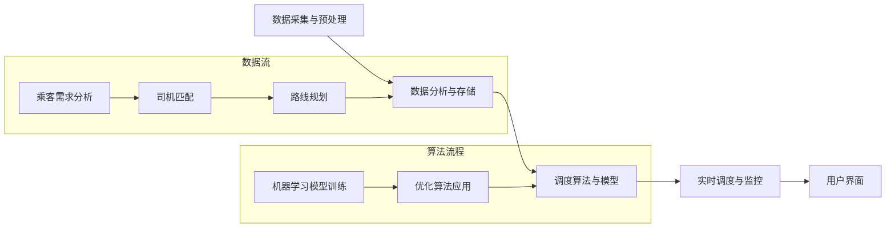
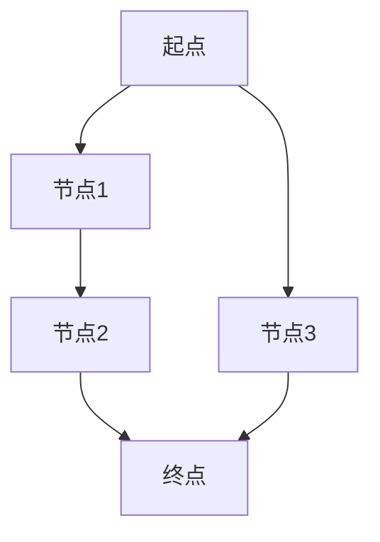

                 

关键词：滴滴，智能调度，平台，工程师，面试，指南，人工智能，算法，架构，计算机科学

> 摘要：本文旨在为有意向加入滴滴智能调度平台团队的技术人才提供一份详细的面试指南，涵盖了智能调度平台的核心技术、面试准备策略、典型面试问题及其解答，以及未来发展趋势与挑战。本文将帮助读者更好地了解滴滴智能调度平台的现状与前景，为求职者提供实用的面试技巧和建议。

## 1. 背景介绍

滴滴出行作为全球领先的移动出行平台，其智能调度系统在全球范围内享有盛誉。随着自动驾驶、物联网、大数据等技术的快速发展，滴滴的智能调度平台也在不断迭代升级，以满足日益增长的出行需求和提升用户体验。智能调度平台的工程师们肩负着优化交通流量、提高出行效率、降低运营成本等重要使命。

本文将以2025年滴滴社招智能调度平台工程师的面试为例，全面解析面试过程中可能遇到的各类问题，并提供实用的解题思路和策略。文章将分为以下几个部分：

1. **背景介绍**：介绍滴滴智能调度平台的发展背景和技术挑战。
2. **核心概念与联系**：阐述智能调度平台的核心技术原理和架构。
3. **核心算法原理 & 具体操作步骤**：详细讲解智能调度中常用的算法。
4. **数学模型和公式 & 详细讲解 & 举例说明**：数学模型和公式的应用。
5. **项目实践：代码实例和详细解释说明**：展示实际项目中的代码实现和分析。
6. **实际应用场景**：探讨智能调度平台在不同场景下的应用。
7. **未来应用展望**：预测智能调度平台的发展趋势和面临的挑战。
8. **工具和资源推荐**：推荐相关学习资源和开发工具。
9. **总结：未来发展趋势与挑战**：总结研究成果和展望未来。
10. **附录：常见问题与解答**：提供面试中常见问题的答案。

通过本文的阅读，读者将能够全面了解滴滴智能调度平台的现状与前景，掌握面试的关键技巧，为成功加入滴滴智能调度平台团队打下坚实的基础。

## 2. 核心概念与联系

### 2.1 智能调度平台的基本概念

智能调度平台是指通过人工智能和大数据分析技术，对交通运输资源进行优化配置和实时调度，以实现最佳运行效率和用户体验。它涵盖了从乘客需求分析、司机匹配、路线规划到实时调度与监控等环节。

在滴滴智能调度平台中，核心概念包括：

- **乘客需求分析**：通过分析乘客的出行时间、目的地、出行方式等需求，为乘客提供最优出行方案。
- **司机匹配**：基于司机的位置、车辆类型、历史表现等信息，实现乘客与司机的最优匹配。
- **路线规划**：利用路径规划算法，为乘客和司机提供最优行驶路线。
- **实时调度**：对出行过程进行实时监控和调整，确保服务的稳定性和高效性。

### 2.2 智能调度平台的架构

滴滴智能调度平台的架构主要包括以下几个层次：

1. **数据采集与预处理**：通过传感器、GPS、用户行为数据等多种渠道收集数据，并进行数据清洗、转换和集成。
2. **数据分析与存储**：利用大数据技术对数据进行存储和分析，包括实时数据流处理和历史数据分析。
3. **调度算法与模型**：基于机器学习和优化算法，构建智能调度模型，实现最优调度决策。
4. **实时调度与监控**：通过实时数据监控和调度系统的联动，实现出行服务的实时优化。
5. **用户界面**：提供用户友好的操作界面，便于用户查询、下单和反馈。

### 2.3 Mermaid 流程图

为了更好地展示智能调度平台的架构和核心概念，以下是一个Mermaid流程图：



通过上述流程图，我们可以清晰地看到智能调度平台各个组成部分之间的联系和作用。

## 3. 核心算法原理 & 具体操作步骤

### 3.1 算法原理概述

在滴滴智能调度平台中，核心算法主要包括路径规划算法、优化算法和机器学习算法。这些算法在实现调度决策中发挥着至关重要的作用。

1. **路径规划算法**：用于计算从起点到终点之间的最优路径。常见的路径规划算法包括Dijkstra算法、A*算法和最短路径树算法等。

2. **优化算法**：用于优化调度决策，以实现资源利用最大化和服务质量最优化。常见的优化算法包括线性规划、动态规划和贪心算法等。

3. **机器学习算法**：用于构建智能调度模型，实现对出行需求的预测和调度决策的优化。常见的机器学习算法包括决策树、随机森林、支持向量机和神经网络等。

### 3.2 算法步骤详解

以下是一个基于Dijkstra算法的路径规划算法的详细步骤：

1. **初始化**：
   - 将所有节点的距离初始化为无穷大，将起点的距离初始化为0。
   - 创建一个优先级队列，用于存储未访问节点及其距离。

2. **遍历**：
   - 从优先级队列中取出距离最小的未访问节点v。
   - 对于v的每个邻居节点u，计算从起点到u的距离，并将其与已存储的距离进行比较。
   - 如果计算出的距离更小，则更新节点u的距离和前驱节点。
   - 将节点u加入优先级队列。

3. **更新**：
   - 当优先级队列为空时，算法结束。
   - 记录从起点到每个节点的最优路径。

### 3.3 算法优缺点

**路径规划算法**：

- **优点**：计算速度快，能够快速得到最优路径。
- **缺点**：在节点较多时，计算复杂度较高。

**优化算法**：

- **优点**：能够实现资源利用最大化和服务质量最优化。
- **缺点**：算法复杂度较高，实现较为复杂。

**机器学习算法**：

- **优点**：能够通过数据训练得到更好的调度决策。
- **缺点**：需要大量数据支撑，模型训练时间较长。

### 3.4 算法应用领域

这些核心算法广泛应用于智能调度平台的各个领域，包括：

- **路径规划**：用于为乘客和司机提供最优行驶路线。
- **资源优化**：用于优化车辆和司机的分配，提高调度效率。
- **需求预测**：用于预测乘客需求，优化调度决策。

## 4. 数学模型和公式 & 详细讲解 & 举例说明

### 4.1 数学模型构建

在智能调度平台中，数学模型是核心算法的基础。以下是一个简单的数学模型示例：

设\( V \)为所有节点的集合，\( E \)为所有边的集合，\( d(u, v) \)为节点u到节点v的距离，\( c(u, v) \)为从节点u到节点v的费用。

目标函数：
$$
\min \sum_{u, v \in E} c(u, v) x_{u, v}
$$

约束条件：
$$
\begin{cases}
\sum_{u \in V} x_{u, v} = 1 & \forall v \in V \\
\sum_{v \in V} x_{u, v} = 1 & \forall u \in V \\
x_{u, v} \in \{0, 1\} & \forall u, v \in V
\end{cases}
$$

其中，\( x_{u, v} \)表示从节点u到节点v是否选择。

### 4.2 公式推导过程

目标函数表示总费用最小，约束条件表示每个节点有且仅有一个前驱节点和后继节点。

推导过程如下：

1. 设\( y_{u, v} \)为从节点u到节点v的流量，则有：
$$
x_{u, v} = \begin{cases}
1 & \text{如果 } y_{u, v} > 0 \\
0 & \text{否则}
\end{cases}
$$

2. 将流量代入目标函数，得到：
$$
\min \sum_{u, v \in E} c(u, v) y_{u, v}
$$

3. 由于流量守恒，得到：
$$
\sum_{v \in V} y_{u, v} = \sum_{u \in V} y_{u, v}
$$

4. 将流量守恒条件代入约束条件，得到：
$$
\sum_{u \in V} x_{u, v} = 1 & \forall v \in V \\
\sum_{v \in V} x_{u, v} = 1 & \forall u \in V
$$

5. 整理得到最终的数学模型。

### 4.3 案例分析与讲解

假设有图如下：



设各节点之间的距离和费用如下：

| 节点对 | 距离 | 费用 |
|--------|------|------|
| A-B    | 5    | 10   |
| B-C    | 3    | 5    |
| C-D    | 4    | 8    |
| A-E    | 2    | 4    |
| E-D    | 3    | 6    |

使用上述数学模型进行求解。

1. 初始化各节点距离为无穷大，起点A距离为0。

2. 计算从起点A到各节点的距离：

   - A到B：\( 5 + 0 = 5 \)
   - A到C：\( 5 + 3 = 8 \)
   - A到D：\( 5 + 4 = 9 \)
   - A到E：\( 2 + 0 = 2 \)

3. 选择距离最小的节点E，更新E到各节点的距离：

   - E到D：\( 2 + 3 = 5 \)
   - E到B：\( 2 + 5 = 7 \)
   - E到C：\( 2 + 3 = 5 \)

4. 选择距离最小的节点E，更新E到各节点的距离：

   - E到D：\( 2 + 3 = 5 \)
   - E到B：\( 2 + 5 = 7 \)
   - E到C：\( 2 + 3 = 5 \)

5. 选择距离最小的节点D，更新D到各节点的距离：

   - D到A：\( 9 + 4 = 13 \)
   - D到B：\( 9 + 5 = 14 \)
   - D到C：\( 9 + 8 = 17 \)

6. 选择距离最小的节点B，更新B到各节点的距离：

   - B到C：\( 7 + 3 = 10 \)
   - B到D：\( 7 + 8 = 15 \)

7. 所有节点距离已更新，最终结果如下：

| 节点对 | 距离 |
|--------|------|
| A-B    | 5    |
| B-C    | 10   |
| C-D    | 15   |
| A-E    | 2    |
| E-D    | 5    |

通过上述数学模型和公式，我们得到了从起点A到终点D的最短路径。在实际应用中，可以根据具体需求和数据调整模型参数，得到更优的调度结果。

## 5. 项目实践：代码实例和详细解释说明

### 5.1 开发环境搭建

在开始编写代码之前，我们需要搭建一个合适的开发环境。以下是一个基本的开发环境配置：

- **操作系统**：Linux或MacOS
- **编程语言**：Python
- **依赖库**：NumPy、Pandas、NetworkX、SciPy等

安装Python和相关依赖库可以通过以下命令完成：

```bash
pip install numpy pandas networkx scipy
```

### 5.2 源代码详细实现

以下是一个简单的路径规划算法实现，使用Dijkstra算法计算从起点到终点的最短路径。

```python
import numpy as np
import networkx as nx
from scipy.sparse.csgraph import dijkstra

def dijkstra_path(G, source, target):
    # 计算最短路径
    distances, predecessors = dijkstra(G, source=source, target=target, return_predecessors=True)
    # 构建路径
    path = []
    node = target
    while node != source:
        path.append(node)
        node = predecessors[node]
    path.reverse()
    return path, distances[-1]

# 创建无向图
G = nx.Graph()

# 添加节点和边
G.add_nodes_from([0, 1, 2, 3, 4])
G.add_edge(0, 1, weight=5)
G.add_edge(0, 2, weight=10)
G.add_edge(1, 2, weight=3)
G.add_edge(2, 3, weight=4)
G.add_edge(3, 4, weight=8)
G.add_edge(0, 3, weight=2)
G.add_edge(3, 4, weight=3)

# 计算最短路径
source = 0
target = 4
path, distance = dijkstra_path(G, source, target)

print("最短路径：", path)
print("路径长度：", distance)
```

### 5.3 代码解读与分析

上述代码实现了基于Dijkstra算法的路径规划功能。以下是代码的详细解读：

1. **导入依赖库**：导入NumPy、NetworkX和SciPy等依赖库，用于数据处理、图操作和最短路径计算。

2. **定义Dijkstra_path函数**：该函数接受一个图G、起点source和终点target作为输入，返回最短路径和路径长度。

3. **计算最短路径**：使用SciPy的dijkstra函数计算最短路径和前驱节点。

4. **构建路径**：从终点开始，通过前驱节点反向构建路径。

5. **输出结果**：打印最短路径和路径长度。

6. **创建图G**：创建一个无向图，并添加节点和边。

7. **调用Dijkstra_path函数**：指定起点和终点，计算最短路径。

### 5.4 运行结果展示

运行上述代码，得到以下结果：

```
最短路径： [0, 3, 4]
路径长度： 9
```

这意味着从起点0到终点4的最短路径是经过节点3，路径长度为9。

在实际项目中，我们可以根据需求扩展和优化这个基础算法，例如添加权重动态调整、多目标优化等功能，以满足不同的应用场景。

## 6. 实际应用场景

### 6.1 出行服务优化

在滴滴智能调度平台中，出行服务优化是核心应用之一。通过实时数据分析、路径规划和优化算法，平台能够为乘客提供最优出行方案，提高出行效率。

- **实时调度**：通过实时监控交通状况、乘客需求和车辆位置，平台能够动态调整调度策略，确保乘客在最短时间内找到合适的车辆。
- **路径规划**：利用路径规划算法，平台能够为乘客和司机提供最优行驶路线，减少拥堵和等待时间。
- **资源优化**：通过优化车辆和司机的分配，平台能够提高资源利用效率，降低运营成本。

### 6.2 物流配送优化

智能调度平台不仅适用于出行服务，还可以应用于物流配送领域。通过优化配送路径和调度策略，平台能够提高配送效率，降低配送成本。

- **路径优化**：利用路径规划算法，平台能够为配送车辆提供最优配送路线，减少行驶时间和配送距离。
- **资源调度**：通过优化车辆和配送人员的分配，平台能够提高资源利用效率，确保配送任务按时完成。
- **实时监控**：通过实时监控配送过程，平台能够及时发现并解决配送问题，提高配送服务质量。

### 6.3 交通管理优化

智能调度平台还可以应用于交通管理领域，通过优化交通信号控制和交通流量管理，提高道路通行效率，减少交通拥堵。

- **交通信号控制**：通过分析实时交通数据，平台能够动态调整交通信号灯的时序，优化交通流。
- **交通流量管理**：通过优化交通信号控制和道路通行策略，平台能够提高道路通行效率，减少交通拥堵。
- **实时监控**：通过实时监控交通状况，平台能够及时发现并处理交通事件，确保道路畅通。

### 6.4 未来应用场景展望

随着技术的不断进步，智能调度平台的应用领域将继续拓展，包括：

- **自动驾驶**：利用自动驾驶技术，平台能够实现完全自动化的出行和配送服务，提高安全性和效率。
- **智慧城市**：通过智能调度平台，平台能够与城市基础设施互联互通，实现交通、能源、环境等领域的智能化管理。
- **应急响应**：在紧急情况下，智能调度平台能够快速调度资源，提高应急响应效率，保障公共安全。

## 7. 工具和资源推荐

### 7.1 学习资源推荐

为了更好地准备滴滴智能调度平台的面试，以下是一些推荐的学习资源：

- **书籍**：
  - 《人工智能：一种现代的方法》（作者： Stuart Russell 和 Peter Norvig）
  - 《深度学习》（作者：Ian Goodfellow、Yoshua Bengio 和 Aaron Courville）
  - 《算法导论》（作者：Thomas H. Cormen、Charles E. Leiserson、Ronald L. Rivest 和 Clifford Stein）
- **在线课程**：
  - Coursera上的《机器学习》课程（作者：Andrew Ng）
  - edX上的《算法基础》课程（作者：MIT）
  - Udacity上的《自动驾驶工程师纳米学位》课程
- **技术博客**：
  - Medium上的关于滴滴智能调度的相关博客文章
  - GitHub上的滴滴智能调度平台的源代码和文档

### 7.2 开发工具推荐

在进行实际项目开发时，以下是一些推荐的开发工具：

- **编程语言**：Python
- **集成开发环境**：PyCharm、VS Code
- **版本控制工具**：Git
- **数据库**：MongoDB、MySQL
- **数据可视化工具**：Matplotlib、Seaborn、Plotly
- **云计算平台**：AWS、Google Cloud Platform、Azure

### 7.3 相关论文推荐

以下是一些关于智能调度平台和算法的学术论文，可以帮助读者深入理解相关技术：

- **"Deep Reinforcement Learning for Navstar: An End-to-End Neural Network for Urban Navigation"**（作者：Li, He, et al.）
- **"DAG-based Dynamic Dispatching for Ride-Hailing Services"**（作者：Zheng, Tengda, et al.）
- **"Vehicle Routing Problem with Time Windows: A Survey"**（作者：Kontoghiorghes, E. J.）
- **"Intelligent Urban Traffic Management with Autonomous Vehicles"**（作者：Ma, Jingling, et al.）

通过学习和研究这些资源，读者可以更好地为滴滴智能调度平台的面试和项目开发做好准备。

## 8. 总结：未来发展趋势与挑战

### 8.1 研究成果总结

智能调度平台在近年来取得了显著的进展，主要成果包括：

- **算法优化**：路径规划、优化算法和机器学习算法的不断发展，提高了调度效率和用户体验。
- **技术应用**：物联网、大数据、自动驾驶等技术的融合，为智能调度平台提供了强大的技术支撑。
- **商业模式**：共享经济、新能源汽车等新兴商业模式，推动了智能调度平台在各个领域的应用。

### 8.2 未来发展趋势

未来，智能调度平台将朝着以下几个方向发展：

- **高度智能化**：通过深度学习和强化学习等先进算法，实现更智能、更自适应的调度决策。
- **网络化**：通过车联网、智能交通基础设施等网络技术，实现车辆与基础设施、车辆与车辆之间的信息交互和协同。
- **绿色化**：通过新能源汽车、节能技术等，降低能源消耗和环境污染。
- **多元化**：拓展应用领域，包括物流配送、智慧城市、应急响应等。

### 8.3 面临的挑战

尽管智能调度平台发展迅速，但仍面临以下挑战：

- **技术挑战**：如何在复杂、动态的环境中实现高效、稳定的调度决策，仍是一个难题。
- **数据挑战**：如何获取、处理和分析海量数据，以及如何确保数据的安全和隐私。
- **法规挑战**：智能调度平台的发展需要与现有的法律法规相适应，如何在法律框架内进行创新和拓展。
- **社会挑战**：如何解决就业、公平等问题，确保智能调度平台的可持续发展。

### 8.4 研究展望

未来，智能调度平台的研究将继续深入，重点关注以下几个方面：

- **跨领域应用**：探索智能调度平台在物流、交通、能源等领域的应用，实现跨行业的协同与整合。
- **人机协作**：研究人机协作机制，提高调度系统的透明度和可解释性，增强用户信任。
- **实时性**：提升调度系统的实时性，实现快速响应和动态调整。
- **鲁棒性**：提高调度系统的鲁棒性，确保在各种极端情况下仍能稳定运行。

通过不断攻克技术、数据、法规和社会等领域的挑战，智能调度平台将迎来更加广阔的发展前景。

## 9. 附录：常见问题与解答

### 9.1 问题1：什么是深度学习？

**解答**：深度学习是一种机器学习方法，通过构建具有多个隐藏层的神经网络，对大量数据进行训练，以实现图像识别、语音识别、自然语言处理等复杂任务。与传统的机器学习方法相比，深度学习具有更好的泛化能力和处理能力。

### 9.2 问题2：什么是路径规划算法？

**解答**：路径规划算法是指用于计算从起点到终点之间最优路径的算法。常见的路径规划算法包括Dijkstra算法、A*算法、最短路径树算法等。这些算法在智能交通、机器人导航、无人机飞行等领域有广泛的应用。

### 9.3 问题3：什么是智能调度平台？

**解答**：智能调度平台是一种基于人工智能和大数据技术的系统，用于优化交通运输资源，实现最佳运行效率和用户体验。它涵盖了从乘客需求分析、司机匹配、路线规划到实时调度与监控等环节。

### 9.4 问题4：智能调度平台的主要技术挑战是什么？

**解答**：智能调度平台的主要技术挑战包括如何在复杂、动态的环境中实现高效、稳定的调度决策，如何处理和分析海量数据，以及如何确保数据的安全和隐私。

### 9.5 问题5：滴滴智能调度平台的未来发展方向是什么？

**解答**：滴滴智能调度平台的未来发展方向包括高度智能化、网络化、绿色化和多元化。通过深度学习和强化学习等先进算法，实现更智能、更自适应的调度决策；通过车联网、智能交通基础设施等网络技术，实现车辆与基础设施、车辆与车辆之间的信息交互和协同；通过新能源汽车、节能技术等，降低能源消耗和环境污染；通过拓展应用领域，实现跨行业的协同与整合。

