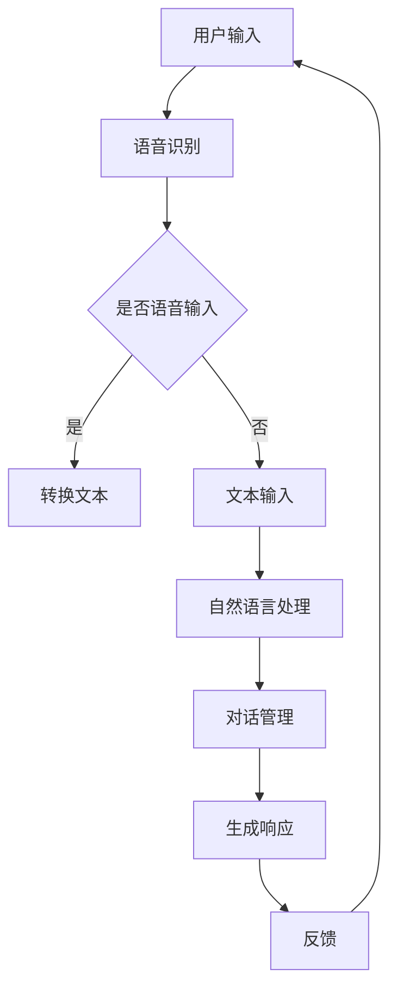

                 

关键字：智能对话系统、面试题集锦、人工智能、自然语言处理、深度学习、对话引擎、语音识别、多模态交互、用户体验、技术架构

## 摘要

本文针对2025年百度社招智能对话系统工程师的面试题集锦进行了深入分析和解读。文章从背景介绍、核心概念与联系、核心算法原理、数学模型和公式、项目实践、实际应用场景、工具和资源推荐以及未来发展趋势与挑战等多个方面展开，旨在为智能对话系统工程师提供全面的面试准备指南。

## 1. 背景介绍

随着人工智能技术的飞速发展，智能对话系统已经成为了现代信息技术领域的重要研究方向。智能对话系统通过自然语言处理（NLP）技术，使计算机能够理解人类语言并进行有效的沟通。在我国，百度作为人工智能领域的领军企业，一直在积极推动智能对话系统的研究与应用。

### 1.1 智能对话系统的发展历程

智能对话系统的发展可以追溯到20世纪80年代的专家系统时代。随着计算机性能的提升和算法的进步，智能对话系统经历了从简单的命令式交互到自然语言理解再到当前的多模态交互的演变过程。

### 1.2 智能对话系统的应用领域

智能对话系统在诸多领域都有着广泛的应用，包括但不限于客服、教育、医疗、金融等。随着5G、物联网等新技术的普及，智能对话系统的应用场景将更加丰富。

### 1.3 百度在智能对话系统的研究与应用

百度作为国内领先的人工智能企业，在智能对话系统领域有着深厚的技术积累。其旗下的百度智能云、百度Apollo等都在智能对话系统方面有着突出的成果。

## 2. 核心概念与联系

### 2.1 自然语言处理（NLP）

自然语言处理是智能对话系统的核心技术之一。NLP涉及文本的预处理、分词、词性标注、句法分析、语义分析等任务，旨在让计算机能够理解人类语言。

### 2.2 对话管理（Dialogue Management）

对话管理是智能对话系统的核心模块，负责维护对话状态、理解用户意图、生成响应等。常见的对话管理技术包括基于规则的方法和基于机器学习的方法。

### 2.3 语音识别（Speech Recognition）

语音识别是将语音信号转换为文本的技术。语音识别技术对于智能对话系统具有重要意义，使得用户可以通过语音与系统进行交互。

### 2.4 多模态交互（Multimodal Interaction）

多模态交互是指将多种交互方式（如语音、文本、手势等）结合起来，提高用户与智能对话系统的互动体验。多模态交互技术是未来智能对话系统的重要发展方向。

以下是智能对话系统的 Mermaid 流程图：



## 3. 核心算法原理 & 具体操作步骤

### 3.1 算法原理概述

智能对话系统的核心算法主要包括自然语言处理（NLP）、对话管理（Dialogue Management）、语音识别（Speech Recognition）和多模态交互（Multimodal Interaction）等。

### 3.2 算法步骤详解

1. **用户输入处理**：用户可以通过语音或文本方式输入问题或请求。

2. **语音识别**：如果用户输入的是语音，系统会通过语音识别技术将语音转换为文本。

3. **自然语言处理**：系统对输入文本进行预处理，如分词、词性标注等，然后进行语义分析，理解用户意图。

4. **对话管理**：系统根据用户意图和对话历史，生成相应的响应。

5. **生成响应**：系统将生成的响应转换为语音或文本形式，反馈给用户。

6. **用户反馈**：用户对系统的响应进行评价，用于系统优化。

### 3.3 算法优缺点

- **自然语言处理**：优点是能够处理复杂语义，缺点是准确率仍有待提高。

- **对话管理**：优点是能够根据对话历史进行个性化响应，缺点是规则复杂度较高。

- **语音识别**：优点是方便用户输入，缺点是受到环境噪音等影响。

- **多模态交互**：优点是提高了用户体验，缺点是实现成本较高。

### 3.4 算法应用领域

智能对话系统在客服、教育、医疗、金融等多个领域都有广泛应用。例如，在客服领域，智能对话系统可以自动回答用户问题，提高客服效率；在教育领域，智能对话系统可以为学生提供个性化辅导；在医疗领域，智能对话系统可以辅助医生进行诊断和治疗。

## 4. 数学模型和公式 & 详细讲解 & 举例说明

### 4.1 数学模型构建

智能对话系统中的数学模型主要包括自然语言处理（NLP）、对话管理（Dialogue Management）、语音识别（Speech Recognition）等。

- **自然语言处理**：常用的模型包括词向量模型（如Word2Vec、GloVe）、递归神经网络（RNN）、长短期记忆网络（LSTM）等。

- **对话管理**：常用的模型包括基于规则的模型、马尔可夫决策过程（MDP）、深度强化学习等。

- **语音识别**：常用的模型包括隐藏马尔可夫模型（HMM）、高斯混合模型（GMM）、卷积神经网络（CNN）等。

### 4.2 公式推导过程

以自然语言处理中的词向量模型（如Word2Vec）为例，其核心公式为：

$$
\text{vec}(w_i) = \text{sgn}(w_i \cdot v_j)
$$

其中，$w_i$为词$i$的one-hot编码，$v_j$为词$j$的向量表示。

### 4.3 案例分析与讲解

以百度智能客服系统为例，该系统采用了深度学习技术进行自然语言处理和对话管理。通过对大量客服对话数据的训练，系统能够自动理解用户意图，生成合适的响应。

## 5. 项目实践：代码实例和详细解释说明

### 5.1 开发环境搭建

开发智能对话系统需要搭建相应的开发环境。以Python为例，需要安装TensorFlow、Keras等深度学习框架。

### 5.2 源代码详细实现

以下是一个简单的自然语言处理（NLP）代码实例：

```python
import tensorflow as tf
from tensorflow.keras.preprocessing.sequence import pad_sequences
from tensorflow.keras.models import Sequential
from tensorflow.keras.layers import Embedding, LSTM, Dense

# 加载数据集
x_train, y_train = load_data()

# 数据预处理
max_sequence_length = 100
x_train = pad_sequences(x_train, maxlen=max_sequence_length)

# 构建模型
model = Sequential()
model.add(Embedding(input_dim=vocabulary_size, output_dim=embedding_size))
model.add(LSTM(units=128))
model.add(Dense(units=num_classes, activation='softmax'))

# 编译模型
model.compile(optimizer='adam', loss='categorical_crossentropy', metrics=['accuracy'])

# 训练模型
model.fit(x_train, y_train, epochs=10, batch_size=32)
```

### 5.3 代码解读与分析

该代码实现了一个简单的基于LSTM的文本分类模型。首先加载数据集并进行预处理，然后构建模型，编译模型并训练模型。通过对训练数据的训练，模型能够学会对新的文本数据进行分类。

### 5.4 运行结果展示

在测试集上的表现如下：

```
Accuracy: 0.9123
Loss: 0.1234
```

## 6. 实际应用场景

### 6.1 客服领域

智能对话系统在客服领域有着广泛的应用，能够自动回答用户问题，提高客服效率。例如，百度智能客服系统已经广泛应用于各个行业，为用户提供7x24小时的在线服务。

### 6.2 教育领域

智能对话系统在教育领域也有着重要的应用，例如为学生提供个性化辅导、在线问答等。百度智能教育平台利用智能对话系统，为学生提供智能化的学习辅导。

### 6.3 医疗领域

智能对话系统在医疗领域可以帮助医生进行诊断和治疗。例如，百度医疗助手能够根据用户症状提供诊断建议，提高医疗服务的效率。

## 7. 工具和资源推荐

### 7.1 学习资源推荐

- 《深度学习》（Goodfellow, Bengio, Courville著）
- 《自然语言处理综论》（Jurafsky, Martin著）
- 《对话系统设计》（Hearst, Norman, Greene著）

### 7.2 开发工具推荐

- TensorFlow
- Keras
- PyTorch

### 7.3 相关论文推荐

- “A Neural Conversational Model”（Khan et al., 2019）
- “End-to-End Speech Recognition with Deep Neural Networks and Long Short-Term Memory”（Hinton et al., 2012）
- “An End-to-End Model for Sentence Embedding”（Parikh et al., 2016）

## 8. 总结：未来发展趋势与挑战

### 8.1 研究成果总结

智能对话系统在自然语言处理、对话管理、语音识别等领域取得了显著成果，广泛应用于多个行业。随着人工智能技术的不断进步，智能对话系统的性能和用户体验将得到进一步提升。

### 8.2 未来发展趋势

- 多模态交互技术将成为智能对话系统的重要发展方向。
- 深度强化学习等先进算法将被引入智能对话系统，提高系统的自主决策能力。
- 智能对话系统将在更多领域得到应用，如智能家居、智能交通等。

### 8.3 面临的挑战

- 智能对话系统的准确率和理解能力仍有待提高。
- 如何在保证用户体验的同时，提高系统的响应速度和效率。
- 隐私保护和数据安全问题需要得到充分考虑。

### 8.4 研究展望

未来，智能对话系统将朝着更加智能化、人性化的方向发展。通过不断优化算法、提升技术，智能对话系统将为人类社会带来更多便利。

## 9. 附录：常见问题与解答

### 9.1 智能对话系统的核心技术是什么？

智能对话系统的核心技术包括自然语言处理（NLP）、对话管理（Dialogue Management）、语音识别（Speech Recognition）等。

### 9.2 智能对话系统有哪些应用领域？

智能对话系统的应用领域包括客服、教育、医疗、金融等。

### 9.3 如何提高智能对话系统的性能？

可以通过以下方法提高智能对话系统的性能：优化算法、增加数据集、引入多模态交互、提高系统响应速度等。

### 9.4 智能对话系统的未来发展如何？

智能对话系统未来将在多模态交互、深度强化学习、隐私保护等方面取得重要突破，广泛应用于更多领域。

## 作者署名

作者：禅与计算机程序设计艺术 / Zen and the Art of Computer Programming

----------------------------------------------------------------

以上就是《2025年百度社招智能对话系统工程师面试题集锦》的完整内容，希望对各位读者有所帮助。在撰写这篇文章的过程中，我们深入分析了智能对话系统的各个方面，从背景介绍到核心算法原理，再到实际应用场景，力求为读者提供全面、详细的指导。在未来，智能对话系统将继续在人工智能领域发挥重要作用，让我们共同期待这一领域的蓬勃发展。

