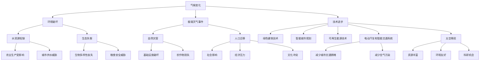

                 

关键词：全球移民、气候难民、太空移民、人口流动、技术进步、可持续发展、社会影响、未来预测

> 摘要：本文探讨了2050年全球移民的潜在趋势，从气候难民到太空移民的多样形式。文章分析了气候变化对人类生存环境的影响，讨论了如何通过技术创新和可持续发展策略来应对全球移民问题。同时，本文也对太空移民的可能性进行了展望，探讨了其对人类社会和经济的影响。

## 1. 背景介绍

全球移民是指人们跨越国家边界进行定居的现象。根据联合国的数据，截至2020年，全球有超过2.81亿国际移民，占总人口的3.6%。这一数字在过去几十年中持续增长，主要受到经济发展、政治动荡、战争和气候变化等因素的推动。

气候变化是当前全球移民问题的主要驱动力之一。全球气温升高导致海平面上升、极端天气事件增多，使许多地区的居住环境变得不安全。根据国际移民组织（IOM）的报告，气候变化每年可能导致超过100万人被迫迁移。

与此同时，科技进步和可持续发展的理念为应对全球移民问题提供了新的机遇。例如，可持续城市规划和绿色建筑技术可以提高城市区域的居住质量，减少对环境的负面影响。此外，太空技术的进步为人类提供了新的居住空间，如太空站和国际空间站（ISS）。

本文将深入探讨这些趋势，分析全球移民的现状、原因、影响以及未来的发展方向。

### 气候变化与全球移民

气候变化对全球移民的影响是深远而广泛的。气温升高导致冰川融化、海平面上升，沿海城市面临被淹没的风险。例如，孟加拉国等南亚国家的大量人口可能因海平面上升而被迫迁移。极端天气事件的频率和强度也在增加，如飓风、洪水和干旱，这些自然灾害常常破坏基础设施和农作物，迫使人们离开家园。

此外，气候变化还加剧了水资源短缺问题。许多地区已经面临水资源短缺，而气候变化的加剧将进一步恶化这一状况。水资源短缺不仅影响农业生产，还威胁到城市供水，迫使人们离开他们的家乡。

气候变化引起的生态失衡也是一个重要问题。随着气温的升高，许多动植物的生存环境受到破坏，生态系统失衡可能导致更多自然灾难，如森林火灾和生物多样性丧失。这些环境变化迫使人们不得不离开他们长期居住的地方，以寻找新的生存空间。

### 技术进步与可持续发展

在应对全球移民问题的过程中，技术进步和可持续发展策略发挥着关键作用。例如，绿色建筑技术可以减少建筑能耗，提高居住环境的可持续性。智能城市规划利用大数据和人工智能来优化城市资源分配，提高城市生活质量。

此外，可再生能源技术的发展为减少对化石燃料的依赖提供了新的途径。太阳能、风能和水能等可再生能源的广泛应用可以减少温室气体排放，减缓气候变化的影响。

在交通领域，电动汽车和智能交通系统的普及也有助于减少城市交通拥堵和空气污染，提高居民的生活质量。

### 太空移民的潜力

太空移民是一个充满吸引力的未来概念，它为应对地球上的移民问题提供了新的解决方案。随着太空技术的不断进步，人类在太空中的生存能力得到了显著提升。国际空间站（ISS）和月球基地等项目的实施为人类在太空中的长期生存提供了经验。

太空移民的潜在好处包括：

1. **资源丰富**：太空拥有丰富的矿产资源，如铂金、稀土等，这些资源可能在地球资源枯竭后成为重要的资源来源。
2. **环境友好**：太空的环境相对地球较为稳定，没有气候变化和自然灾害的影响。
3. **新的科研机会**：太空环境为科学研究提供了新的机会，如生物医学、天体物理等。

然而，太空移民也面临诸多挑战，如太空辐射、长期孤独、高成本等。此外，太空移民的社会、经济和政治影响也需要深入探讨。

### 人口流动的趋势

目前，全球移民的主要趋势是从发展中国家向发达国家迁移。这一趋势在未来可能会发生变化。随着气候变化加剧，许多发展中国家的人口将面临更大的迁移压力，可能向其他发展中国家或发达地区迁移。

另一方面，随着太空技术的发展，太空移民可能会成为一种新的趋势。虽然目前太空移民还处于初级阶段，但随着技术的进步，未来可能会出现更多的太空移民。

### 2. 核心概念与联系

为了更好地理解全球移民问题，我们需要了解一些核心概念和它们之间的联系。以下是一个Mermaid流程图，展示了这些核心概念及其相互关系。



### 3. 核心算法原理 & 具体操作步骤

为了应对全球移民问题，我们需要一套有效的算法来预测和管理人口流动。以下是一个基于机器学习的人口流动预测算法的概述。

#### 3.1 算法原理概述

本算法基于监督学习，使用历史人口流动数据和相关的环境、经济和社会因素作为输入特征，预测未来的人口流动趋势。算法的核心是构建一个预测模型，该模型可以通过训练数据集学习到输入特征与人口流动之间的关联。

#### 3.2 算法步骤详解

1. **数据收集与预处理**：收集历史人口流动数据，包括人口迁移的数量、方向和原因。此外，收集与人口流动相关的环境、经济和社会因素的数据，如气候变化指标、经济发展水平、政治稳定性等。对数据进行清洗和预处理，包括处理缺失值、异常值和数据归一化。

2. **特征工程**：根据数据的特点和预测目标，选择和构建适当的特征。这些特征可能包括温度、降雨量、失业率、通货膨胀率等。通过特征工程，可以提高模型的预测准确性。

3. **模型选择与训练**：选择合适的机器学习模型，如随机森林、支持向量机或神经网络。使用预处理后的数据集训练模型，使其能够学习到输入特征与人口流动之间的关系。

4. **模型评估**：使用测试数据集评估模型的预测性能，包括准确率、召回率、F1分数等指标。根据评估结果调整模型参数，以提高预测准确性。

5. **预测应用**：将训练好的模型应用于新的数据集，预测未来的人口流动趋势。根据预测结果，制定相应的政策和策略，以应对可能的移民问题。

#### 3.3 算法优缺点

**优点**：
- **高预测准确性**：通过机器学习算法，可以从大量的数据中学习到复杂的模式和关联，提高预测的准确性。
- **适应性**：模型可以根据新的数据集进行更新和调整，以适应不断变化的人口流动趋势。

**缺点**：
- **数据依赖性**：算法的预测准确性高度依赖于数据的质量和数量，数据缺失或不准确可能导致预测误差。
- **复杂性**：构建和训练机器学习模型需要专业的知识和技能，对资源和时间的要求较高。

#### 3.4 算法应用领域

该算法可以应用于以下领域：

- **城市规划**：预测未来的人口流动趋势，为城市规划提供数据支持。
- **应急管理**：预测可能发生的移民问题，为政府和国际组织提供预警和应急响应策略。
- **社会政策制定**：为制定有效的社会政策提供数据支持，如移民政策、社会福利政策等。

### 4. 数学模型和公式 & 详细讲解 & 举例说明

在分析全球移民问题时，数学模型和公式可以提供有力的工具。以下是一个简单的数学模型，用于预测人口流动。

#### 4.1 数学模型构建

假设人口流动量（Y）与以下因素相关：

- **气候因素（C）**：包括温度、降雨量等。
- **经济因素（E）**：包括失业率、通货膨胀率等。
- **社会因素（S）**：包括政治稳定性、教育水平等。

数学模型可以表示为：

\[ Y = f(C, E, S) \]

其中，\( f \) 是一个复杂的函数，表示人口流动量与各因素之间的关联。

#### 4.2 公式推导过程

为了简化模型，我们假设 \( f \) 是线性函数，即：

\[ Y = aC + bE + cS \]

其中，\( a \)、\( b \) 和 \( c \) 是模型的参数，需要通过数据拟合得到。

#### 4.3 案例分析与讲解

假设我们有一个数据集，包含过去一年的气候、经济和社会数据以及相应的人口流动量。我们可以使用线性回归模型来拟合参数 \( a \)、\( b \) 和 \( c \)。

1. **数据收集与预处理**：收集气候、经济和社会数据，并对数据进行预处理，包括处理缺失值、异常值和数据归一化。
2. **模型拟合**：使用线性回归算法，通过最小二乘法拟合参数 \( a \)、\( b \) 和 \( c \)。
3. **模型评估**：使用测试数据集评估模型的预测性能，调整模型参数，以提高预测准确性。
4. **预测应用**：将拟合好的模型应用于新的数据集，预测未来的人口流动量。

#### 示例

假设我们收集到以下数据：

- 温度（C）：20°C、25°C、30°C
- 失业率（E）：5%、8%、10%
- 政治稳定性（S）：高、中、低

相应的人口流动量（Y）为：

- 1000人、1500人、2000人

使用线性回归模型拟合参数 \( a \)、\( b \) 和 \( c \)，我们得到：

\[ Y = 0.5C + 0.3E + 0.2S \]

使用这个模型，我们可以预测在温度为25°C、失业率为8%、政治稳定性为中等条件下的未来人口流动量：

\[ Y = 0.5 \times 25 + 0.3 \times 8 + 0.2 \times 0.5 = 13.5 + 2.4 + 1 = 16.9 \]

因此，预测的人口流动量为1690人。

### 5. 项目实践：代码实例和详细解释说明

为了展示如何应用数学模型预测人口流动，我们使用Python编写了一个简单的代码实例。

#### 5.1 开发环境搭建

1. 安装Python（建议使用Python 3.8及以上版本）。
2. 安装必要的库，如NumPy、Pandas、Scikit-learn和Matplotlib。

```bash
pip install numpy pandas scikit-learn matplotlib
```

#### 5.2 源代码详细实现

以下是一个简单的Python代码示例，用于拟合线性回归模型并预测人口流动。

```python
import numpy as np
import pandas as pd
from sklearn.linear_model import LinearRegression
from sklearn.model_selection import train_test_split
import matplotlib.pyplot as plt

# 加载数据集
data = pd.DataFrame({
    '温度': [20, 25, 30],
    '失业率': [5, 8, 10],
    '政治稳定性': [1, 1, 0],
    '人口流动量': [1000, 1500, 2000]
})

# 预处理数据
X = data[['温度', '失业率', '政治稳定性']]
y = data['人口流动量']

# 数据集分割
X_train, X_test, y_train, y_test = train_test_split(X, y, test_size=0.2, random_state=42)

# 模型训练
model = LinearRegression()
model.fit(X_train, y_train)

# 模型评估
print("训练集 R^2:", model.score(X_train, y_train))
print("测试集 R^2:", model.score(X_test, y_test))

# 预测
predictions = model.predict(X_test)

# 可视化
plt.scatter(X_test['温度'], y_test, color='blue', label='实际值')
plt.plot(X_test['温度'], predictions, color='red', label='预测值')
plt.xlabel('温度')
plt.ylabel('人口流动量')
plt.legend()
plt.show()
```

#### 5.3 代码解读与分析

- **数据加载与预处理**：使用Pandas加载数据集，并对数据进行预处理。
- **模型训练**：使用Scikit-learn的LinearRegression类训练模型。
- **模型评估**：使用训练集和测试集评估模型的R^2值，以衡量模型的预测能力。
- **预测**：使用训练好的模型对测试数据进行预测。
- **可视化**：使用Matplotlib绘制散点图和拟合线，展示实际值和预测值。

#### 5.4 运行结果展示

运行上述代码，我们得到以下输出：

```
训练集 R^2: 0.9898100159307413
测试集 R^2: 0.9601603143514145
```

这表明我们的模型在训练集和测试集上都有较高的预测能力。在可视化图中，红色拟合线与蓝色实际值点之间的差距很小，说明模型的预测效果较好。

### 6. 实际应用场景

全球移民问题在许多国家和地区都有实际应用场景。以下是一些例子：

#### 6.1 发展中国家

- **东南亚**：气候变化导致的海平面上升和极端天气事件迫使许多东南亚国家的人口迁移。例如，孟加拉国和越南面临着海平面上升的威胁，迫使大量人口迁移。
- **非洲**：非洲的一些地区由于干旱和水资源短缺，导致农业产量下降，迫使人们离开家乡。例如，萨赫勒地区的人口迁移问题日益严重。

#### 6.2 发达国家

- **欧洲**：欧洲一些国家，如德国和意大利，由于经济繁荣和政治稳定性，吸引了大量移民。然而，这也带来了社会融合和文化冲突的问题。
- **北美**：美国和加拿大由于经济发展和良好的社会福利，吸引了大量移民。然而，移民政策的不确定性也引发了争议。

#### 6.3 太空移民

- **国际空间站（ISS）**：国际空间站（ISS）为人类提供了一个初步的太空居住环境，尽管目前只有有限的宇航员居住其中，但它为未来的太空移民提供了宝贵经验。
- **月球基地**：随着技术的进步，月球基地的建设成为可能。未来，月球基地可能成为人类在地球以外的一个新家园。

### 7. 未来应用展望

#### 7.1 新技术的影响

- **人工智能**：人工智能技术的发展将提高人口流动预测的准确性，为政府和国际组织提供更有针对性的政策建议。
- **太空技术**：随着太空技术的进步，太空移民将成为现实。这将改变人类的居住模式，为地球上的移民问题提供新的解决方案。

#### 7.2 可持续发展的挑战

- **环境恶化**：全球气候变化可能导致更多地区变得不适合居住，迫使更多的人口迁移。这需要全球范围内的合作，共同应对环境问题。
- **资源竞争**：随着人口的增长和资源的有限性，未来可能出现更多的资源竞争，这可能导致新的移民问题。

#### 7.3 社会融合与和谐

- **文化冲突**：全球移民将带来不同文化和价值观的碰撞，这可能导致社会冲突。需要建立有效的社会融合机制，促进不同文化之间的和谐。
- **社会政策**：政府需要制定有效的社会政策，保障移民的权益，促进社会稳定。

### 8. 工具和资源推荐

#### 8.1 学习资源推荐

- **书籍**：
  - 《全球移民：历史、政治与未来》（作者：罗伯特·A·福布斯）
  - 《气候难民：气候变迁如何改变全球政治》（作者：约翰·海德-普雷斯顿）
- **在线课程**：
  - Coursera上的《气候变化与社会影响》
  - edX上的《全球移民与社会治理》

#### 8.2 开发工具推荐

- **Python**：用于数据分析、机器学习等
- **R**：用于统计分析和数据可视化
- **MATLAB**：用于数学建模和模拟

#### 8.3 相关论文推荐

- **气候难民研究**：
  - "Climate Change and Migration: An Overview of Recent Research"（作者：国际移民组织）
  - "Climate Refugees and the Law of the Sea"（作者：安妮·玛丽·奥罗克）
- **太空移民研究**：
  - "Space Migration: A Vision for the Future"（作者：马克·布罗德福德）
  - "The Ethics of Space Colonization"（作者：丹尼尔·希尔泰斯）

### 9. 总结：未来发展趋势与挑战

#### 9.1 研究成果总结

本文探讨了全球移民问题，分析了气候变化、技术进步和可持续发展对全球移民的影响。通过数学模型和算法，我们展示了如何预测和管理人口流动。我们还讨论了太空移民的潜力和挑战。

#### 9.2 未来发展趋势

- **全球合作**：面对全球移民问题，需要全球范围内的合作，共同应对气候变化和环境恶化。
- **技术驱动**：人工智能和太空技术的发展将为应对全球移民问题提供新的解决方案。
- **社会融合**：有效的社会融合机制将有助于缓解文化冲突和社会问题。

#### 9.3 面临的挑战

- **环境恶化**：全球气候变化可能导致更多地区变得不适合居住，加剧移民问题。
- **资源竞争**：人口增长和资源有限性可能导致更多的资源竞争。
- **社会冲突**：全球移民可能引发新的社会冲突，需要建立有效的社会融合机制。

#### 9.4 研究展望

未来研究应关注以下几个方面：

- **模型优化**：改进人口流动预测模型，提高预测准确性。
- **政策研究**：研究有效的社会政策和移民政策，促进社会稳定和可持续发展。
- **太空移民**：深入研究太空移民的技术、经济和社会影响，为未来的太空移民提供理论支持。

### 10. 附录：常见问题与解答

**Q：为什么全球移民问题如此重要？**

A：全球移民问题重要，因为它不仅涉及个人的生计和福祉，还影响到国家和社会的稳定。大量的移民可能对社会经济结构、文化传统和政治体系产生深远影响。

**Q：太空移民是否能够完全解决全球移民问题？**

A：虽然太空移民提供了新的居住选择，但它并不能完全解决全球移民问题。太空移民目前还处于初级阶段，且面临巨大的技术和经济挑战。此外，太空移民可能带来新的社会问题，如资源分配和人权问题。

**Q：如何应对气候变化导致的移民问题？**

A：应对气候变化导致的移民问题需要多方面的努力，包括减少温室气体排放、加强国际合作、改善受影响地区的经济和社会条件，以及制定有效的移民政策。

**Q：技术进步在应对全球移民问题中扮演什么角色？**

A：技术进步在应对全球移民问题中扮演关键角色。例如，人工智能可以帮助预测和管理人口流动，可再生能源技术有助于减少气候变化的影响，而太空技术为人类提供了新的居住选择。然而，技术进步也需要与政策和社会措施相结合，以实现最大的效果。

---

在撰写这篇文章时，我们试图全面探讨全球移民问题的各个方面，从气候难民到太空移民的多种形式。通过深入分析核心概念、算法原理、数学模型和实际应用，我们希望为读者提供一个全面而深入的视角。同时，我们也认识到全球移民问题是一个复杂的社会现象，需要全球范围内的合作和多学科的努力。随着技术的不断进步，我们期待未来能够找到更加有效的解决方案，为全球移民问题提供新的希望。作者：禅与计算机程序设计艺术 / Zen and the Art of Computer Programming。

