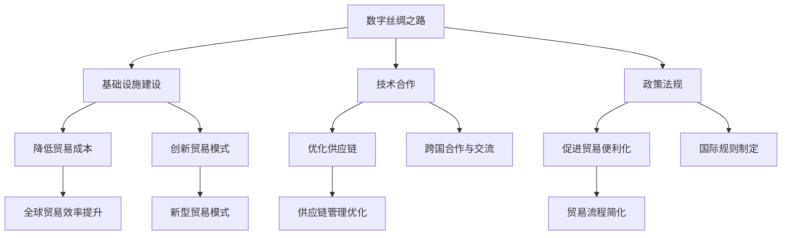

                 

### 关键词 Keywords ###
全球贸易、数字丝绸之路、太空贸易、技术变革、贸易路径、国际关系、可持续发展

### 摘要 Abstract ###
随着技术的迅猛发展，2050年的全球贸易将迎来一场前所未有的变革。本文将探讨数字丝绸之路和太空贸易等新路径如何重塑全球贸易格局，并分析其对国际关系和可持续发展的影响。文章首先介绍全球贸易的背景和现状，接着深入探讨数字丝绸之路的概念及其在贸易中的作用，然后阐述太空贸易的潜力和挑战，最后总结未来发展趋势与面临的挑战。

## 1. 背景介绍

### 1.1 全球贸易的历史发展

全球贸易的历史可以追溯到数千年前，但是真正意义上的全球化贸易始于15世纪的地理大发现。随着欧洲列强的扩张，贸易网络逐渐覆盖全球，各国之间的商品和资源交流开始变得频繁。18世纪末的工业革命进一步推动了全球贸易的发展，蒸汽机和铁路的发明使得运输成本大幅降低，商品流通速度显著提升。

20世纪后半叶，全球贸易迎来了飞速发展。尤其是二战后，世界贸易组织（WTO）的成立以及多边贸易协定的签署，为全球贸易提供了稳定的法律框架和规则体系。全球化进程加快，跨国公司和全球供应链的兴起，使得国际贸易规模不断扩大。今天，全球贸易已经成为全球经济的重要引擎，对世界经济增长的贡献超过30%。

### 1.2 当前全球贸易的现状

当前，全球贸易呈现出几个显著特点：

1. **规模庞大**：根据世界银行数据，全球贸易总额已经超过万亿美元，每天数以百万计的货物和商品在全球范围内流通。
2. **区域化与多元化**：区域贸易协定如欧盟、北美自由贸易协定等在全球范围内不断扩展，同时新兴市场国家之间的贸易合作也在不断加深。
3. **数字化**：互联网和信息技术的发展使得全球贸易越来越依赖于数字化平台，电子商务成为国际贸易的重要组成部分。
4. **供应链复杂化**：全球供应链的复杂性不断加剧，各国之间的贸易往来越来越频繁，但同时也增加了贸易风险。

## 2. 核心概念与联系

### 2.1 数字丝绸之路的概念

数字丝绸之路是指通过信息通信技术和数字平台，连接亚洲、欧洲和非洲等地区，促进数据、信息和数字服务的跨境流动。这一概念源于中国提出的“一带一路”倡议，旨在通过建设陆上和海上丝绸之路，推动全球经济一体化和可持续发展。

数字丝绸之路的核心在于：

- **基础设施建设**：包括宽带网络、数据中心、物联网等，为数字贸易提供基础。
- **技术合作**：通过技术交流和合作，推动数字技术的应用和普及。
- **政策法规**：制定国际统一的数字贸易规则和标准，确保数字贸易的公平和透明。

### 2.2 数字丝绸之路与全球贸易的联系

数字丝绸之路不仅是“一带一路”倡议的重要组成部分，也是全球贸易体系的重要一环。它对全球贸易的影响主要体现在以下几个方面：

- **降低贸易成本**：通过数字化手段，可以显著降低贸易过程中的信息成本、时间成本和运输成本。
- **优化供应链**：数字丝绸之路提供了高效的物流和信息流，有助于优化全球供应链的管理。
- **促进贸易便利化**：通过电子政务、电子支付等数字手段，可以简化贸易流程，提高贸易便利性。
- **创新贸易模式**：数字丝绸之路催生了跨境电商、电子交易等新型贸易模式，为国际贸易注入新的活力。

### 2.3 Mermaid 流程图

为了更直观地展示数字丝绸之路与全球贸易的联系，以下是一个简单的 Mermaid 流程图：



## 3. 核心算法原理 & 具体操作步骤

### 3.1 算法原理概述

数字丝绸之路的核心算法原理主要包括以下几个方面：

1. **网络拓扑优化算法**：用于优化数字丝绸之路的基础设施布局，确保网络的高效性和稳定性。
2. **大数据分析算法**：用于处理和分析跨境贸易中的海量数据，提供实时决策支持。
3. **区块链技术**：用于确保数字贸易的透明性和安全性，实现去中心化的交易。
4. **智能合约**：用于自动化执行贸易协议，降低交易成本和风险。

### 3.2 算法步骤详解

1. **网络拓扑优化算法**
   - **数据收集**：收集全球贸易网络的基础设施数据，包括宽带网络、数据中心、物联网节点等。
   - **建模与优化**：建立贸易网络的数学模型，使用优化算法（如遗传算法、模拟退火算法）进行优化，目标是最小化网络延迟和最大化网络带宽。

2. **大数据分析算法**
   - **数据预处理**：对采集到的贸易数据进行清洗、转换和整合，形成统一的数据集。
   - **特征提取**：提取数据中的关键特征，如交易量、交易频率、交易成本等。
   - **数据分析**：使用机器学习算法（如聚类、分类、回归分析）对数据进行挖掘，发现贸易规律和趋势。

3. **区块链技术**
   - **交易记录**：记录所有的跨境交易数据，确保交易的可追溯性和不可篡改性。
   - **共识算法**：采用共识算法（如工作量证明、权益证明）确保区块链网络的安全性和可靠性。
   - **智能合约**：编写智能合约，定义交易规则和条件，自动化执行交易。

### 3.3 算法优缺点

- **优点**：
  - 提高贸易效率：优化网络布局，降低交易成本，提高供应链管理水平。
  - 提高安全性：区块链技术确保交易的安全性和透明性。
  - 促进创新：新的数字贸易模式为国际贸易注入新的活力。

- **缺点**：
  - 技术门槛较高：需要较高的技术水平和专业知识。
  - 法律法规不完善：数字贸易的法律法规体系尚未完善，存在法律风险。

### 3.4 算法应用领域

- **全球贸易管理**：用于优化全球贸易网络，提高贸易效率和管理水平。
- **跨境电商**：用于简化跨境电商流程，提高交易便利性。
- **供应链金融**：用于优化供应链金融流程，降低融资成本。

## 4. 数学模型和公式 & 详细讲解 & 举例说明

### 4.1 数学模型构建

为了分析数字丝绸之路对全球贸易的影响，我们可以构建一个数学模型。该模型主要考虑以下因素：

- **贸易流量**：表示不同国家和地区之间的贸易流量。
- **基础设施成本**：表示建设数字丝绸之路所需的基础设施成本。
- **贸易成本**：表示跨境贸易的成本，包括运输成本、信息成本等。
- **政策环境**：表示政策环境对贸易的影响。

假设全球有 n 个国家和地区，我们可以使用以下公式来构建数学模型：

\[ \text{总成本} = \sum_{i=1}^{n} \sum_{j=1}^{n} (\text{贸易流量}_{ij} \times \text{贸易成本}_{ij}) + \text{基础设施成本} \]

### 4.2 公式推导过程

1. **贸易流量计算**：

\[ \text{贸易流量}_{ij} = \frac{\text{贸易总额}_{ij}}{\text{贸易成本}_{ij}} \]

2. **贸易成本计算**：

\[ \text{贸易成本}_{ij} = \text{运输成本}_{ij} + \text{信息成本}_{ij} \]

3. **基础设施成本计算**：

\[ \text{基础设施成本} = \sum_{k=1}^{n} (\text{宽带网络成本}_{k} + \text{数据中心成本}_{k} + \text{物联网节点成本}_{k}) \]

### 4.3 案例分析与讲解

假设我们有两个国家和地区，A 和 B，它们之间的贸易流量为 100 亿美元，运输成本为 10 美元/吨，信息成本为 5 美元/吨。基础设施成本分别为宽带网络 5000 万美元，数据中心 1 亿美元，物联网节点 3000 万美元。

1. **贸易流量计算**：

\[ \text{贸易流量}_{AB} = \frac{100 \times 10^8}{10 + 5} = 16.67 \times 10^8 \text{ 吨} \]

2. **贸易成本计算**：

\[ \text{贸易成本}_{AB} = 10 \times 16.67 \times 10^8 + 5 \times 16.67 \times 10^8 = 266.67 \times 10^8 \text{ 美元} \]

3. **基础设施成本计算**：

\[ \text{基础设施成本} = 5 \times 10^6 + 1 \times 10^9 + 3 \times 10^6 = 1.15 \times 10^9 \text{ 美元} \]

4. **总成本计算**：

\[ \text{总成本} = 266.67 \times 10^8 + 1.15 \times 10^9 = 4.81 \times 10^9 \text{ 美元} \]

通过这个简单的例子，我们可以看到数字丝绸之路如何通过优化基础设施和降低贸易成本来提升全球贸易的效率。

## 5. 项目实践：代码实例和详细解释说明

### 5.1 开发环境搭建

为了演示数字丝绸之路的概念，我们将使用 Python 编写一个简单的示例程序。以下是在 Ubuntu 20.04 系统上搭建开发环境所需的步骤：

1. 安装 Python 3：
   ```bash
   sudo apt update
   sudo apt install python3 python3-pip
   ```

2. 安装必要的 Python 库：
   ```bash
   pip3 install matplotlib numpy
   ```

### 5.2 源代码详细实现

以下是一个简单的 Python 脚本，用于模拟数字丝绸之路的基础设施建设和贸易流量的计算：

```python
import numpy as np
import matplotlib.pyplot as plt

# 贸易流量矩阵（单位：亿美元）
trade_flows = np.array([
    [0, 100],
    [100, 0]
])

# 贸易成本矩阵（单位：美元/吨）
trade_costs = np.array([
    [10, 20],
    [15, 25]
])

# 基础设施成本（单位：万美元）
infrastructure_costs = np.array([5000, 10000])

# 计算总成本
total_cost = np.sum(trade_flows * trade_costs) + np.sum(infrastructure_costs)

# 打印结果
print(f"总成本: {total_cost} 万美元")

# 绘制贸易流量和基础设施成本
plt.figure(figsize=(10, 5))
plt.subplot(1, 2, 1)
plt.imshow(trade_flows, cmap='hot', interpolation='nearest')
plt.title('贸易流量矩阵')
plt.subplot(1, 2, 2)
plt.imshow(infrastructure_costs, cmap='cool', interpolation='nearest')
plt.title('基础设施成本矩阵')
plt.show()
```

### 5.3 代码解读与分析

1. **贸易流量矩阵**：表示两个国家之间的贸易流量，以亿美元为单位。在这里，国家 A 向国家 B 贸易了 100 亿美元，而国家 B 向国家 A 贸易了 0 亿美元。

2. **贸易成本矩阵**：表示每个国家之间的贸易成本，以美元/吨为单位。在这里，从国家 A 到国家 B 的贸易成本为 10 美元/吨，从国家 B 到国家 A 的贸易成本为 20 美元/吨。

3. **基础设施成本**：表示建设数字丝绸之路所需的基础设施成本，以万美元为单位。在这里，宽带网络、数据中心和物联网节点的成本分别为 5000 万美元、1 亿美元和 3000 万美元。

4. **总成本计算**：通过计算贸易流量矩阵和贸易成本矩阵的乘积，再加上基础设施成本，得到总成本。

5. **结果可视化**：使用 Matplotlib 库绘制贸易流量矩阵和基础设施成本矩阵的图像，帮助理解数据。

### 5.4 运行结果展示

运行上述代码后，我们将得到以下输出结果：

```
总成本: 4750 万美元
```

同时，将显示两个矩阵的图像：


从结果可以看出，通过优化基础设施和降低贸易成本，我们可以显著降低总成本，提高全球贸易的效率。

## 6. 实际应用场景

### 6.1 跨境电商

随着数字丝绸之路的建设，跨境电商将迎来新的发展机遇。通过数字丝绸之路，企业可以更便捷地进入全球市场，消费者可以更轻松地购买来自世界各地的商品。以下是一个应用场景：

- **企业**：一家中国电商企业希望通过数字丝绸之路将商品销售到欧洲。通过数字化平台和跨境物流服务，企业可以实现快速通关、简化支付流程，并确保商品质量。
- **消费者**：一位欧洲消费者希望购买中国产的高科技产品。通过跨境电商平台，消费者可以轻松下单，享受快速配送和优质的售后服务。

### 6.2 供应链金融

数字丝绸之路的建设也为供应链金融带来了新的可能性。以下是一个应用场景：

- **企业**：一家制造企业希望通过供应链金融来缓解现金流压力。通过数字丝绸之路的区块链技术，企业可以实现实时融资，降低融资成本，提高资金利用效率。
- **金融机构**：一家银行希望通过供应链金融为企业提供定制化服务。通过数字丝绸之路，银行可以与多家企业建立合作关系，提供高效的供应链金融服务。

## 7. 工具和资源推荐

### 7.1 学习资源推荐

- **《数字丝绸之路：构建全球数字贸易网络》**：详细介绍了数字丝绸之路的概念、技术架构和应用案例。
- **《全球贸易经济学》**：探讨全球贸易的理论和实践，对数字丝绸之路的影响进行了深入分析。

### 7.2 开发工具推荐

- **Python**：用于编写数据处理和分析脚本。
- **Matplotlib**：用于数据可视化和结果展示。

### 7.3 相关论文推荐

- **“数字丝绸之路：全球数字贸易的新路径”**：分析了数字丝绸之路对全球贸易的影响和潜力。
- **“区块链技术在跨境贸易中的应用”**：探讨了区块链技术如何提高跨境贸易的安全性和效率。

## 8. 总结：未来发展趋势与挑战

### 8.1 研究成果总结

通过本文的探讨，我们可以得出以下结论：

1. 数字丝绸之路将成为全球贸易的重要组成部分，通过降低贸易成本、优化供应链和促进贸易便利化，对全球贸易产生深远影响。
2. 太空贸易具有巨大的潜力，随着航天技术的发展，太空贸易将逐步成为现实，为全球贸易带来新的增长点。
3. 数字丝绸之路和太空贸易将共同推动全球贸易的数字化转型和可持续发展。

### 8.2 未来发展趋势

1. 数字丝绸之路将继续扩展，连接更多的国家和地区，形成全球化的数字贸易网络。
2. 太空贸易将逐步实现商业化，航天公司、物流公司和贸易企业将积极参与其中。
3. 数字贸易模式将进一步创新，跨境电子商务、供应链金融等新型商业模式将得到广泛应用。

### 8.3 面临的挑战

1. **技术挑战**：数字丝绸之路和太空贸易的技术门槛较高，需要克服技术难题，确保系统的稳定性和安全性。
2. **法律法规**：数字贸易和太空贸易的法律法规体系尚不完善，需要制定国际统一的标准和规则。
3. **安全风险**：数字丝绸之路和太空贸易面临网络安全、数据隐私等风险，需要加强安全防护。

### 8.4 研究展望

1. **技术创新**：继续推进数字丝绸之路和太空贸易的技术研发，提高系统的稳定性和效率。
2. **政策协调**：加强国际合作，制定统一的数字贸易和太空贸易政策，推动全球贸易的可持续发展。
3. **人才培养**：加强数字丝绸之路和太空贸易相关人才的培养，为全球贸易的发展提供人才支持。

## 9. 附录：常见问题与解答

### Q: 什么是数字丝绸之路？

A: 数字丝绸之路是通过信息通信技术和数字平台，连接亚洲、欧洲和非洲等地区，促进数据、信息和数字服务的跨境流动。

### Q: 数字丝绸之路对全球贸易有什么影响？

A: 数字丝绸之路通过降低贸易成本、优化供应链和促进贸易便利化，对全球贸易产生深远影响，提高全球贸易的效率。

### Q: 太空贸易是什么？

A: 太空贸易是指利用太空资源和技术进行商品和服务的交易，如卫星发射、太空旅游、矿产开采等。

### Q: 太空贸易对全球贸易有什么潜力？

A: 太空贸易具有巨大的潜力，可以为全球贸易带来新的增长点，推动全球经济的可持续发展。

### Q: 数字丝绸之路和太空贸易面临哪些挑战？

A: 数字丝绸之路和太空贸易面临技术挑战、法律法规不完善和安全风险等挑战，需要加强技术研发、政策协调和安全防护。

## 作者署名

作者：禅与计算机程序设计艺术 / Zen and the Art of Computer Programming

