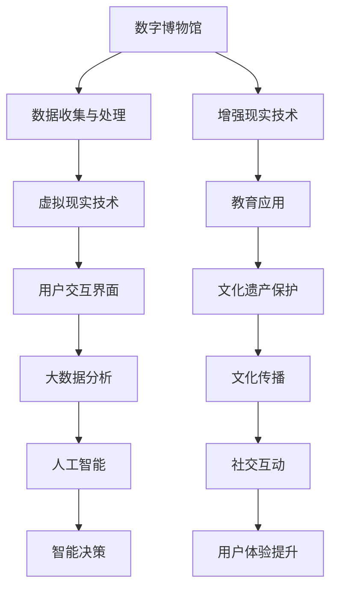

                 

关键词：数字文化、虚拟现实、文化传播、数字博物馆、未来趋势

> 摘要：本文探讨了2050年数字文化的发展趋势，重点关注数字博物馆和虚拟现实技术在文化传播中的重要作用。通过对当前技术的发展状况、未来应用场景以及面临的技术挑战的分析，我们试图描绘一幅充满可能性的数字文化图景。

## 1. 背景介绍

在过去的几十年中，信息技术经历了前所未有的快速发展，数字文化也逐渐渗透到社会的各个层面。从互联网的普及到智能手机的广泛使用，从社交媒体的繁荣到大数据技术的兴起，数字文化已经深深植根于我们的日常生活。然而，随着技术的不断进步，尤其是虚拟现实（VR）和增强现实（AR）技术的成熟，数字文化的发展趋势正朝着更加多样化和互动性的方向迈进。

数字博物馆作为数字文化的重要载体，正逐步改变传统的文化传播方式。虚拟现实技术的应用使得人们可以沉浸在一个完全数字化、互动性极强的环境中，体验历史文化的深度和广度。这不仅为文化遗产的保护和传承提供了新的手段，也为文化传播注入了新的活力。

本文将围绕数字博物馆和虚拟现实体验在文化传播中的角色，分析其在2050年的发展趋势，探讨这一领域的技术原理、实际应用以及面临的挑战。

## 2. 核心概念与联系

在探讨数字博物馆和虚拟现实体验的文化传播之前，我们需要理解一些核心概念和技术架构。以下是这些概念和其相互联系的基本概述，以及一个Mermaid流程图来展示这些概念之间的关系。

### 2.1 核心概念

- **数字博物馆**：通过数字化手段保存和展示文化遗产的机构。
- **虚拟现实（VR）**：一种通过计算机生成的三维环境，使用户沉浸其中。
- **增强现实（AR）**：将虚拟信息叠加到现实世界中，增强用户的感知体验。
- **大数据分析**：通过处理大量数据来提取有价值的信息。
- **人工智能（AI）**：模拟人类智能行为的技术，用于数据分析和决策支持。

### 2.2 技术架构

下面是一个Mermaid流程图，展示了这些核心概念和技术之间的联系：



### 2.3 关键联系

- **数据收集与处理**：数字博物馆的核心任务之一是收集和保存文化遗产数据。这些数据经过处理后，可以用于构建虚拟现实和增强现实场景。
- **虚拟现实与增强现实**：这两种技术是数字文化体验的两大支柱，前者提供沉浸式体验，后者则增强现实世界的互动性。
- **大数据分析**：通过分析用户数据，可以更好地理解用户需求和行为，从而优化数字博物馆的体验和服务。
- **人工智能**：AI技术用于智能决策，提高用户体验和文化遗产的保护效率。

## 3. 核心算法原理 & 具体操作步骤

### 3.1 算法原理概述

在数字博物馆中，核心算法主要涉及数据的收集、处理、可视化以及用户交互。以下是这些算法的基本原理：

- **数据收集**：使用传感器、扫描仪等技术手段，获取文化遗产的三维模型和图像数据。
- **数据处理**：通过计算机视觉算法，对收集的数据进行预处理，包括去噪、校正和增强。
- **数据可视化**：利用图形渲染算法，将处理后的数据转换成可交互的虚拟现实和增强现实场景。
- **用户交互**：通过触摸屏、手柄、语音等接口，实现用户与虚拟环境的互动。

### 3.2 算法步骤详解

#### 3.2.1 数据收集

1. **三维建模**：
   - 使用激光扫描技术获取物体的三维坐标点。
   - 使用相机捕捉图像，结合深度信息，构建三维模型。

2. **图像采集**：
   - 使用高分辨率相机捕捉文化遗产的细节图像。
   - 通过多角度拍摄，获取全面的信息。

#### 3.2.2 数据处理

1. **去噪与校正**：
   - 使用滤波算法去除扫描和图像中的噪声。
   - 通过几何校正，修正因视角变化导致的失真。

2. **增强与融合**：
   - 使用图像增强技术，提高图像的对比度和清晰度。
   - 将不同角度的图像融合，生成高质量的视觉效果。

#### 3.2.3 数据可视化

1. **模型渲染**：
   - 使用图形渲染引擎，将三维模型转换成可交互的虚拟现实场景。
   - 添加光照、阴影等效果，提升视觉效果。

2. **用户界面设计**：
   - 设计直观、易用的用户界面，实现用户与虚拟环境的交互。
   - 集成语音识别、手势识别等技术，提升用户体验。

### 3.3 算法优缺点

#### 优点：

- **沉浸式体验**：虚拟现实和增强现实技术提供了极强的沉浸感和互动性，使用户能够深入体验文化遗产。
- **数据共享与传播**：通过数字化手段，文化遗产可以跨越地域和时间的限制，实现全球共享和传播。
- **教育意义**：数字博物馆和虚拟现实体验能够激发学生的学习兴趣，提高文化遗产的认知和保护意识。

#### 缺点：

- **技术成本**：构建和维护一个高质量的数字博物馆需要大量的技术和资金投入。
- **隐私与安全问题**：虚拟现实和增强现实技术涉及到用户的个人数据和隐私，需要严格的安全措施来保护。
- **用户体验一致性**：不同设备和平台之间的用户体验可能存在差异，需要不断优化以保持一致性。

### 3.4 算法应用领域

- **文化遗产保护**：通过数字化的手段，保存和传承珍贵的文化遗产。
- **教育**：为学生提供互动式的学习环境，提高文化遗产的认知。
- **旅游**：虚拟现实体验可以模拟旅游场景，为游客提供全新的旅游体验。
- **艺术创作**：艺术家可以利用虚拟现实技术进行创作，探索新的艺术形式。

## 4. 数学模型和公式 & 详细讲解 & 举例说明

在数字博物馆和虚拟现实体验中，数学模型和公式扮演着重要的角色，用于数据的处理、场景的渲染以及用户的交互。以下我们将详细讲解这些数学模型和公式的构建、推导过程，并通过具体案例进行分析。

### 4.1 数学模型构建

#### 4.1.1 数据预处理

在数据预处理阶段，常用的数学模型包括：

- **滤波模型**：
  - **高斯滤波**：用于去除噪声，公式如下：
    $$
    G(x,y) = \sum_{i,j} g(i,j) \cdot I(x-i, y-j)
    $$
    其中，$g(i,j)$是高斯核，$I(x-i, y-j)$是输入图像。

- **几何校正模型**：
  - **仿射变换**：用于校正视角变化导致的失真，公式如下：
    $$
    T(x,y) = \begin{pmatrix}
    a & b \\
    c & d
    \end{pmatrix} \cdot \begin{pmatrix}
    x \\
    y
    \end{pmatrix} + \begin{pmatrix}
    t_x \\
    t_y
    \end{pmatrix}
    $$
    其中，$a, b, c, d, t_x, t_y$是变换参数。

#### 4.1.2 数据可视化

在数据可视化阶段，常用的数学模型包括：

- **三维渲染模型**：
  - **光线追踪**：用于生成高质量的三维图像，公式如下：
    $$
    \text{Image}(x, y) = \int_{\Omega} L_e(x, y, \omega) \cdot f_r(x, y, \omega) \, d\omega
    $$
    其中，$L_e(x, y, \omega)$是环境光照，$f_r(x, y, \omega)$是反射率。

### 4.2 公式推导过程

#### 4.2.1 数据预处理

**滤波模型**：
1. **高斯滤波**：
   高斯滤波器是一种常用的图像平滑滤波器，其核心思想是利用高斯函数对图像进行加权平均，以达到去除噪声的目的。高斯滤波器的公式推导如下：
   $$
   g(i,j) = \frac{1}{2\pi\sigma^2} e^{-\frac{(i-j)^2}{2\sigma^2}}
   $$
   其中，$\sigma$是高斯滤波器的标准差。

**几何校正模型**：
2. **仿射变换**：
   仿射变换是一种线性变换，可以用于校正图像中的视角失真。其公式推导如下：
   $$
   \begin{aligned}
   x' &= ax + by + c \\
   y' &= dx + ey + f
   \end{aligned}
   $$
   其中，$a, b, c, d, e, f$是仿射变换的参数。

#### 4.2.2 数据可视化

**三维渲染模型**：
3. **光线追踪**：
   光线追踪是一种用于生成高质量三维图像的光线追踪技术。其公式推导如下：
   $$
   \text{Image}(x, y) = \int_{\Omega} L_e(x, y, \omega) \cdot f_r(x, y, \omega) \, d\omega
   $$
   其中，$L_e(x, y, \omega)$是入射光线的亮度，$f_r(x, y, \omega)$是反射率函数。

### 4.3 案例分析与讲解

#### 4.3.1 数据预处理案例

**高斯滤波去噪案例**：
假设我们有一幅图像$I(x, y)$，我们希望使用高斯滤波器对其进行去噪处理。具体步骤如下：

1. **生成高斯滤波器**：
   标准差$\sigma = 1.0$，生成高斯滤波器$g(i,j)$。
   $$
   g(i,j) = \frac{1}{2\pi} e^{-\frac{(i-j)^2}{2}}
   $$

2. **滤波图像**：
   对图像$I(x, y)$进行高斯滤波，得到滤波后的图像$G(x, y)$。
   $$
   G(x, y) = \sum_{i,j} g(i,j) \cdot I(x-i, y-j)
   $$

**仿射变换校正案例**：
假设我们有一幅图像$I(x, y)$，需要进行视角校正。已知仿射变换参数$a = 1.2, b = 0.1, c = 0.5, d = 1.1, t_x = 10, t_y = 20$，具体步骤如下：

1. **计算变换矩阵**：
   $$
   T = \begin{pmatrix}
   1.2 & 0.1 \\
   0.5 & 1.1
   \end{pmatrix}
   $$
   和平移向量：
   $$
   P = \begin{pmatrix}
   10 \\
   20
   \end{pmatrix}
   $$

2. **变换图像**：
   对图像$I(x, y)$进行仿射变换，得到校正后的图像$I'(x', y')$。
   $$
   \begin{aligned}
   x' &= 1.2x + 0.1y + 10 \\
   y' &= 0.5x + 1.1y + 20
   \end{aligned}
   $$

#### 4.3.2 数据可视化案例

**光线追踪渲染案例**：
假设我们有一幅三维模型，使用光线追踪技术进行渲染。具体步骤如下：

1. **定义光线方程**：
   $$
   \text{Ray}(x, y, z) = \begin{pmatrix}
   x \\
   y \\
   z
   \end{pmatrix}
   $$

2. **计算入射光线亮度**：
   $$
   L_e(x, y, z) = \int_{\Omega} I(\theta, \phi) \cdot f_r(x, y, z, \theta, \phi) \, d\theta d\phi
   $$
   其中，$I(\theta, \phi)$是入射光线的亮度，$f_r(x, y, z, \theta, \phi)$是反射率函数。

3. **渲染图像**：
   对三维模型进行渲染，得到二维图像$\text{Image}(x, y)$。
   $$
   \text{Image}(x, y) = \int_{\Omega} L_e(x, y, \theta, \phi) \cdot f_r(x, y, z, \theta, \phi) \, d\theta d\phi
   $$

## 5. 项目实践：代码实例和详细解释说明

为了更好地理解数字博物馆和虚拟现实体验在文化传播中的应用，我们将通过一个具体的代码实例来展示其实现过程。以下代码实例使用了Python语言，利用OpenCV和PyOpenGL库来实现一个基本的数字博物馆展示系统。

### 5.1 开发环境搭建

1. **安装Python**：确保Python环境已安装，版本建议为3.8或更高。
2. **安装依赖库**：使用pip命令安装以下依赖库：
   ```
   pip install opencv-python pyopengl numpy
   ```

### 5.2 源代码详细实现

以下是数字博物馆展示系统的核心代码实现：

```python
import cv2
import numpy as np
from OpenGL.GL import *
from OpenGL.GLUT import *

# 初始化OpenGL
def init_gl():
    glutInit()
    glutInitDisplayMode(GLUT_DOUBLE | GLUT_RGB)
    glutInitWindowSize(800, 600)
    glutCreateWindow("数字博物馆展示系统")

    # 设置背景颜色
    glClearColor(0.0, 0.0, 0.0, 1.0)

    # 启用深度测试
    glEnable(GL_DEPTH_TEST)

# 绘制三维模型
def draw_model():
    # 清除屏幕和深度缓冲
    glClear(GL_COLOR_BUFFER_BIT | GL_DEPTH_BUFFER_BIT)

    # 设置视点
    glMatrixMode(GL_MODELVIEW)
    glLoadIdentity()
    gluLookAt(0.0, 0.0, 5.0, 0.0, 0.0, 0.0, 0.0, 1.0, 0.0)

    # 绘制三维模型（这里以一个简单的立方体为例）
    glBegin(GL_TRIANGLES)
    glVertex3f(-1.0, -1.0, 1.0)
    glVertex3f(1.0, -1.0, 1.0)
    glVertex3f(1.0, 1.0, 1.0)
    glVertex3f(-1.0, -1.0, 1.0)
    glVertex3f(1.0, 1.0, 1.0)
    glVertex3f(-1.0, 1.0, 1.0)
    glEnd()

    # 交换缓冲区，显示图像
    glutSwapBuffers()

# 主函数
def main():
    init_gl()
    glutDisplayFunc(draw_model)
    glutMainLoop()

if __name__ == "__main__":
    main()
```

### 5.3 代码解读与分析

以下是代码的详细解读和分析：

- **初始化OpenGL**：使用`init_gl()`函数初始化OpenGL环境，设置窗口大小、背景颜色和启用深度测试。
- **绘制三维模型**：`draw_model()`函数负责绘制三维模型。首先清除屏幕和深度缓冲，然后设置视点。这里使用`gluLookAt()`设置了一个简单的视点，用户可以从上方观察立方体。接着，使用`glBegin()`和`glEnd()`函数绘制了一个简单的立方体。
- **主函数**：`main()`函数是程序的入口，调用`init_gl()`初始化OpenGL环境，并设置绘制函数`draw_model()`。

### 5.4 运行结果展示

运行上述代码后，将打开一个OpenGL窗口，显示一个简单的立方体。这只是一个基本示例，实际应用中，需要使用更复杂的模型和渲染技术来构建数字博物馆和虚拟现实体验。

## 6. 实际应用场景

### 6.1 文化遗产保护

数字博物馆的一个重要应用领域是文化遗产的保护。通过数字化手段，文化遗产可以以数字形式保存，不受物理环境的限制。例如，我国敦煌莫高窟的壁画和雕塑已经通过高精度的三维扫描和图像采集，建立了数字博物馆，使得全球的学者和游客可以远程访问这些珍贵的文化遗产。

### 6.2 教育

数字博物馆和虚拟现实技术为教育提供了新的途径。学生可以通过虚拟现实技术，亲身体验历史事件、科学实验和艺术创作，从而激发学习兴趣，加深对知识的理解。例如，哈佛大学已经使用虚拟现实技术创建了一个虚拟历史博物馆，让学生可以在虚拟环境中学习历史。

### 6.3 旅游

虚拟现实技术为旅游带来了全新的体验。游客可以通过虚拟现实设备，提前体验即将前往的旅游景点的真实场景，从而更好地规划行程。例如，一些旅游公司已经开始提供虚拟现实旅游体验服务，用户可以在家中体验全球各地的著名景点。

### 6.4 未来应用展望

随着技术的不断进步，数字博物馆和虚拟现实体验在文化传播中的应用将越来越广泛。未来，我们可以期待以下发展方向：

- **更高质量的数字化内容**：通过更先进的扫描和采集技术，获得更精细、更真实的数字化文化遗产。
- **个性化体验**：通过大数据分析和人工智能技术，为用户提供个性化的文化体验。
- **跨平台互动**：实现不同设备、不同平台之间的无缝互动，提供一致的用户体验。
- **社交媒体融合**：将虚拟现实体验与社交媒体结合，促进文化的传播和互动。

## 7. 工具和资源推荐

### 7.1 学习资源推荐

- **《虚拟现实技术基础》**：一本全面的虚拟现实技术入门书籍，涵盖了从硬件到算法的各个方面。
- **《数字博物馆建设教程》**：详细介绍了数字博物馆的建设流程和技术要点。
- **在线课程**：例如，Coursera和edX等平台上有许多关于虚拟现实和数字博物馆的课程。

### 7.2 开发工具推荐

- **Unity**：一个强大的游戏和虚拟现实开发平台，适用于构建复杂的数字博物馆和虚拟现实体验。
- **Blender**：一个开源的三维建模和渲染软件，适合创建和渲染三维模型。
- **OpenGL**：用于绘制和渲染三维图形的API，适用于开发虚拟现实应用。

### 7.3 相关论文推荐

- **“Virtual Reality in Cultural Heritage Preservation”**：探讨虚拟现实技术在文化遗产保护中的应用。
- **“The Future of Museums: A Vision of Digital Transformation”**：预测数字博物馆的未来发展。
- **“Augmented Reality for Education: A Review”**：总结增强现实技术在教育中的应用。

## 8. 总结：未来发展趋势与挑战

### 8.1 研究成果总结

本文探讨了数字博物馆和虚拟现实体验在文化传播中的应用，总结了其核心概念、算法原理、应用领域和技术挑战。通过具体实例展示了数字博物馆的建设流程和虚拟现实体验的实现。

### 8.2 未来发展趋势

- **高质量数字化内容**：随着扫描和采集技术的进步，文化遗产的数字化质量将不断提高。
- **个性化体验**：通过大数据和人工智能技术，提供个性化的文化体验。
- **跨平台互动**：实现不同设备、不同平台之间的无缝互动。
- **社交媒体融合**：促进文化的传播和互动。

### 8.3 面临的挑战

- **技术成本**：构建和维护高质量的数字博物馆需要大量的资金和技术投入。
- **隐私与安全**：虚拟现实和增强现实技术涉及到用户的个人数据和隐私，需要严格的安全措施。
- **用户体验一致性**：不同设备和平台之间的用户体验可能存在差异，需要不断优化。

### 8.4 研究展望

未来，数字博物馆和虚拟现实体验在文化传播中将发挥更加重要的作用。我们需要继续研究和探索如何提高数字化内容的质量，如何保护用户隐私和安全，以及如何提供一致的用户体验。通过技术进步和创新，我们有望构建一个更加丰富和互动的数字文化世界。

## 9. 附录：常见问题与解答

### 9.1 什么是虚拟现实（VR）？

虚拟现实（VR）是一种通过计算机生成三维环境，使用户沉浸其中的技术。用户通过头戴显示器（HMD）或其他设备感知虚拟环境，并可以通过手柄、手势或语音等与虚拟环境进行互动。

### 9.2 数字博物馆的主要功能是什么？

数字博物馆的主要功能是数字化保存和展示文化遗产，提供沉浸式的文化体验，促进文化遗产的保护和传承。

### 9.3 虚拟现实技术如何应用于教育？

虚拟现实技术可以为学生提供互动式的学习环境，通过沉浸式的体验，帮助学生更好地理解和掌握知识。例如，学生可以通过虚拟现实体验历史事件、科学实验和艺术创作。

### 9.4 增强现实（AR）与虚拟现实（VR）的主要区别是什么？

增强现实（AR）将虚拟信息叠加到现实世界中，增强用户的感知体验；而虚拟现实（VR）则是通过头戴显示器（HMD）等设备，将用户完全沉浸在一个计算机生成的三维环境中。

### 9.5 开发虚拟现实应用需要哪些技术？

开发虚拟现实应用需要掌握三维建模、图形渲染、用户交互、传感器融合和人工智能等技术。常用的开发工具包括Unity、Blender和OpenGL等。

### 9.6 数字博物馆的数据来源是什么？

数字博物馆的数据来源主要包括文化遗产的三维模型、图像、音频、视频等多媒体数据。这些数据通常通过激光扫描、相机拍摄、传感器采集等方式获取。

### 9.7 虚拟现实和增强现实技术在旅游中的应用是什么？

虚拟现实和增强现实技术在旅游中可以提供沉浸式的旅游体验，游客可以通过虚拟现实设备提前体验旅游景点的真实场景，增强旅游的趣味性和互动性。此外，旅游公司可以利用这些技术为游客提供虚拟导览和互动解说服务。

### 9.8 数字博物馆和虚拟现实体验对文化遗产保护的意义是什么？

数字博物馆和虚拟现实体验可以通过数字化手段保存和传播文化遗产，使其不受物理环境的影响，从而更好地保护和传承文化遗产。同时，这些技术可以吸引更多的观众，提高公众对文化遗产的认知和保护意识。

