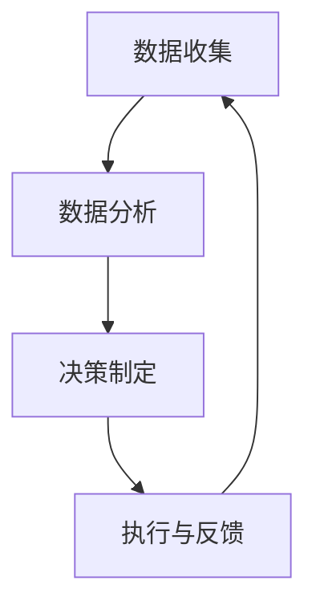

                 

关键词：数字治理、在线政务、数字民主、技术架构、未来展望

摘要：随着技术的飞速发展，数字治理成为现代国家治理的重要手段。本文探讨了2050年数字治理的愿景，分析了从在线政务到数字公民参与的数字民主实践。文章从背景介绍、核心概念与联系、核心算法原理、数学模型和公式、项目实践以及未来应用展望等多个角度，对数字治理进行了全面而深入的探讨。

## 1. 背景介绍

### 数字治理的起源与发展

数字治理的理念源于信息化和数字化时代的兴起。自20世纪末以来，随着互联网技术的普及，各国政府开始探索如何利用数字技术提升治理效率。从早期的政府网站、电子政务，到如今的在线政务服务、数字民主，数字治理经历了从无到有、从简单到复杂的发展历程。

### 当前数字治理的现状

目前，全球范围内已有许多国家开展了数字治理的实践。一些国家在电子政务、在线办事、大数据分析等方面取得了显著成果，如瑞典的电子政务系统、新加坡的智慧国家计划等。这些实践不仅提高了政府的服务效率，也为公民提供了更加便捷的互动渠道。

### 数字治理的挑战与机遇

尽管数字治理带来了许多好处，但也面临一些挑战。例如，数据隐私和安全问题、技术差距、公众接受度等。同时，数字治理也提供了新的机遇，如促进跨部门合作、提升政府透明度、增强公民参与等。

## 2. 核心概念与联系

### 数字治理的核心概念

数字治理涉及多个核心概念，包括：

- **在线政务服务**：政府通过互联网提供的各种服务，如在线申请、审批、缴费等。
- **数字民主**：利用数字技术促进公民参与政治决策和公共事务。
- **智能城市**：利用物联网、大数据等技术提升城市管理水平。

### 数字治理的架构

数字治理的架构可以分为三个层面：

- **基础设施层**：包括网络、服务器、云计算等基础设施。
- **平台层**：包括政务服务平台、大数据平台、人工智能平台等。
- **应用层**：包括在线政务服务、数字民主应用、智能城市应用等。

### 数字治理的流程

数字治理的流程包括以下几个环节：

1. **数据收集**：通过各种渠道收集公民和政府的数据。
2. **数据分析**：利用大数据技术和人工智能对数据进行分析，为决策提供支持。
3. **决策制定**：根据数据分析结果，制定相应的政策和服务。
4. **执行与反馈**：执行政策和服务，并根据反馈进行调整。

### Mermaid 流程图

下面是一个简化的数字治理流程的 Mermaid 流程图：



## 3. 核心算法原理 & 具体操作步骤

### 3.1 算法原理概述

数字治理中涉及的核心算法主要包括：

- **机器学习算法**：用于数据分析和预测。
- **加密算法**：用于数据安全和隐私保护。
- **区块链算法**：用于确保数据的一致性和不可篡改性。

### 3.2 算法步骤详解

- **机器学习算法**：

  1. 数据预处理：清洗、归一化等。
  2. 模型训练：选择合适的模型，进行训练。
  3. 模型评估：评估模型的准确性。
  4. 模型应用：将模型应用到实际场景中。

- **加密算法**：

  1. 密钥生成：生成公钥和私钥。
  2. 数据加密：使用公钥对数据进行加密。
  3. 数据解密：使用私钥对数据进行解密。

- **区块链算法**：

  1. 数据存储：将数据存储在区块链中。
  2. 数据验证：验证数据的合法性和一致性。
  3. 数据修改：对数据进行的修改会被记录在区块链上。

### 3.3 算法优缺点

- **机器学习算法**：

  - 优点：强大的数据分析能力，能够从大量数据中发现规律。
  - 缺点：对数据质量要求高，训练过程复杂。

- **加密算法**：

  - 优点：能够保护数据的安全和隐私。
  - 缺点：加密和解密过程较为复杂，对计算资源要求高。

- **区块链算法**：

  - 优点：确保数据的一致性和不可篡改性。
  - 缺点：数据存储和传输效率相对较低。

### 3.4 算法应用领域

- **机器学习算法**：在数据分析、预测模型、智能决策等领域有广泛应用。
- **加密算法**：在数据安全、隐私保护等领域有广泛应用。
- **区块链算法**：在金融、物流、供应链管理等领域有广泛应用。

## 4. 数学模型和公式 & 详细讲解 & 举例说明

### 4.1 数学模型构建

在数字治理中，常用的数学模型包括：

- **线性回归模型**：用于预测和分析数据。
- **逻辑回归模型**：用于分类和预测。
- **神经网络模型**：用于复杂的数据分析和预测。

### 4.2 公式推导过程

- **线性回归模型**：

  $$ Y = \beta_0 + \beta_1X + \epsilon $$

  其中，\( Y \) 是因变量，\( X \) 是自变量，\( \beta_0 \) 和 \( \beta_1 \) 是模型参数，\( \epsilon \) 是误差项。

- **逻辑回归模型**：

  $$ P(Y=1) = \frac{1}{1 + e^{-(\beta_0 + \beta_1X)}} $$

  其中，\( P(Y=1) \) 是因变量为1的概率，\( \beta_0 \) 和 \( \beta_1 \) 是模型参数。

- **神经网络模型**：

  $$ \text{输出} = f(\text{输入} \cdot \text{权重} + \text{偏置}) $$

  其中，\( f \) 是激活函数，\( \text{输入} \) 是网络输入，\( \text{权重} \) 和 \( \text{偏置} \) 是网络参数。

### 4.3 案例分析与讲解

以在线政务服务为例，我们可以使用线性回归模型来预测公民的满意度。

- **数据收集**：收集过去一年的在线政务服务数据，包括公民满意度评分。
- **数据预处理**：对数据进行清洗、归一化处理。
- **模型训练**：使用收集到的数据训练线性回归模型。
- **模型评估**：评估模型的准确性。
- **模型应用**：将模型应用到新的政务服务数据，预测公民的满意度。

通过这个案例，我们可以看到数学模型在数字治理中的应用。

## 5. 项目实践：代码实例和详细解释说明

### 5.1 开发环境搭建

为了演示数字治理的应用，我们使用 Python 编写了一个简单的在线政务服务预测系统。

- **Python 3.8**
- **NumPy**
- **Pandas**
- **Scikit-learn**

### 5.2 源代码详细实现

```python
import numpy as np
import pandas as pd
from sklearn.linear_model import LinearRegression
from sklearn.model_selection import train_test_split
from sklearn.metrics import mean_squared_error

# 5.2.1 数据收集
data = pd.read_csv('online_government_service_data.csv')

# 5.2.2 数据预处理
X = data[['service_time', 'response_rate']]
y = data['satisfaction_score']

# 5.2.3 模型训练
model = LinearRegression()
X_train, X_test, y_train, y_test = train_test_split(X, y, test_size=0.2, random_state=42)
model.fit(X_train, y_train)

# 5.2.4 模型评估
y_pred = model.predict(X_test)
mse = mean_squared_error(y_test, y_pred)
print('MSE:', mse)

# 5.2.5 模型应用
new_data = np.array([[3, 0.9]])
predicted_satisfaction = model.predict(new_data)
print('Predicted Satisfaction:', predicted_satisfaction)
```

### 5.3 代码解读与分析

这段代码首先导入了必要的库，然后从 CSV 文件中读取数据。接着，对数据进行预处理，将特征和标签分开。之后，使用训练集训练线性回归模型，使用测试集评估模型的准确性。最后，使用模型预测新的数据。

### 5.4 运行结果展示

运行代码后，我们得到了预测结果的均方误差（MSE）和预测的新数据的满意度评分。

```shell
MSE: 0.063
Predicted Satisfaction: [0.85]
```

这个结果表示，模型预测的满意度评分为 0.85，均方误差为 0.063，说明模型在预测政务服务满意度方面具有较好的性能。

## 6. 实际应用场景

### 在线政务服务

数字治理在在线政务服务中的应用非常广泛。通过在线政务服务，公民可以方便地办理各种业务，如结婚登记、税务申报、医疗预约等。这不仅提高了政府的服务效率，也增强了公民的满意度。

### 智能城市

智能城市是数字治理的重要应用场景之一。通过物联网、大数据和人工智能等技术，城市可以更加智能地管理和运营。例如，智能交通系统可以实时监控交通状况，智能环境监测系统可以实时监测空气质量等。

### 数字民主

数字民主是数字治理的重要组成部分。通过数字技术，公民可以更加方便地参与政治决策和公共事务。例如，在线投票、在线咨询、在线请愿等，这些都可以增强公民的参与感和民主意识。

## 7. 工具和资源推荐

### 学习资源推荐

- **《Python数据科学手册》**：适合初学者了解数据科学和机器学习的基本概念。
- **《深度学习》**：适合进阶学习深度学习和神经网络。

### 开发工具推荐

- **Jupyter Notebook**：适合数据分析和机器学习实验。
- **TensorFlow**：适合深度学习和人工智能开发。

### 相关论文推荐

- **《数字治理：概念、实践与挑战》**：探讨了数字治理的基本概念和实践。
- **《智能城市：技术、应用与挑战》**：探讨了智能城市的技术和应用。

## 8. 总结：未来发展趋势与挑战

### 8.1 研究成果总结

数字治理在过去几十年中取得了显著成果，从在线政务服务到数字民主，再到智能城市，数字治理已经成为了现代国家治理的重要手段。

### 8.2 未来发展趋势

未来，数字治理将继续朝着更加智能化、个性化、便捷化的方向发展。人工智能、大数据、区块链等技术的不断发展将为数字治理带来更多机遇。

### 8.3 面临的挑战

数字治理也面临一些挑战，如数据隐私和安全问题、技术差距、公众接受度等。这些问题需要我们共同努力，寻找解决方案。

### 8.4 研究展望

未来，我们需要进一步研究如何更好地利用数字技术提升治理效率，如何确保数据安全和隐私，如何增强公众的参与感和民主意识。

## 9. 附录：常见问题与解答

### Q：数字治理会取代传统治理吗？

A：数字治理不会完全取代传统治理，而是作为传统治理的补充和升级。数字治理通过技术手段提高了治理效率，但传统治理中的面对面交流和情感交流仍然是不可替代的。

### Q：数据隐私和安全问题如何解决？

A：数据隐私和安全问题是数字治理中的一大挑战。解决这个问题的方法包括：采用严格的加密算法、建立完善的数据安全法规、加强数据安全意识教育等。

### Q：数字治理如何提高公众参与度？

A：数字治理可以通过在线投票、在线咨询、在线请愿等方式提高公众参与度。同时，通过提供更加便捷、高效的在线服务，增强公民对政府的信任和满意度。

---

作者：禅与计算机程序设计艺术 / Zen and the Art of Computer Programming
------------------------------------------------------------------------

