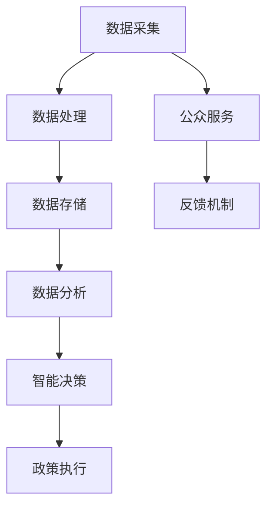

                 

关键词：数字治理、电子政务、数字政府、转型、升级、未来技术、人工智能、网络安全

## 摘要

本文旨在探讨2050年的数字治理发展趋势，特别是在电子政务到数字政府的转型升级过程中，如何运用先进技术提升政府治理效率和服务水平。随着人工智能、大数据、区块链等新兴技术的快速发展，政府正面临前所未有的机遇与挑战。本文将详细分析这一转型过程中的核心概念、算法原理、数学模型以及项目实践，并展望未来数字治理的发展趋势与挑战。

## 1. 背景介绍

在过去的几十年里，电子政务逐渐成为政府服务社会的重要手段。从最初的基础信息发布，到后来的在线办事、数据共享，电子政务的普及大大提高了政府工作效率和公众满意度。然而，随着信息技术的迅猛发展，传统的电子政务模式已无法满足日益复杂的社会治理需求。

数字政府，作为电子政务的升级版，旨在构建一个以数据为核心、服务为驱动的政府治理模式。数字政府不仅仅是一个在线服务平台，更是利用大数据、人工智能、区块链等先进技术，实现政府决策智能化、服务个性化、治理精细化的新型治理体系。

## 2. 核心概念与联系

在数字治理的转型过程中，以下几个核心概念和技术架构至关重要：

### 2.1 人工智能

人工智能（AI）是数字政府的重要支撑。通过机器学习、深度学习等技术，AI可以分析海量数据，为政府决策提供有力支持。例如，在交通管理领域，AI可以通过分析交通流量数据，实时优化交通信号灯控制，减少拥堵。

### 2.2 大数据

大数据技术使得政府能够收集、存储、分析和利用海量数据。这些数据不仅来源于政府内部，还来自于社交媒体、物联网设备等外部来源。通过大数据分析，政府可以更好地了解社会需求，提高政策制定和执行的精准度。

### 2.3 区块链

区块链技术提供了去中心化、安全可靠的数据存储和传输方式。在数字政府中，区块链可用于实现政务数据的安全共享，确保数据不被篡改和泄露。例如，在税务领域，区块链可以用于建立透明、公正的税务系统。

### 2.4 物联网

物联网（IoT）技术使得各种设备和系统可以相互连接和通信。在数字政府中，IoT设备可用于实时监测城市环境、交通状况等，为政府决策提供实时数据支持。

### 2.5 Mermaid 流程图

以下是一个简单的 Mermaid 流程图，展示了数字政府架构的核心节点：



## 3. 核心算法原理 & 具体操作步骤

### 3.1 算法原理概述

在数字政府中，核心算法主要包括数据清洗、数据挖掘、预测分析等。以下是对这些算法的简要介绍：

### 3.1.1 数据清洗

数据清洗是数据挖掘的第一步，其目的是去除重复数据、填补缺失值、修正错误数据等，确保数据质量。

### 3.1.2 数据挖掘

数据挖掘是一种从大量数据中自动发现规律、趋势和模式的方法。常见的数据挖掘方法包括聚类、分类、关联规则挖掘等。

### 3.1.3 预测分析

预测分析是一种基于历史数据对未来事件进行预测的方法。常见的预测分析方法包括时间序列分析、回归分析等。

### 3.2 算法步骤详解

以下是一个简单的数据挖掘流程，用于分析社会治安数据，预测犯罪热点区域：

1. **数据采集**：从各类数据源（如公安系统、社交媒体等）收集社会治安数据。
2. **数据清洗**：对采集到的数据进行清洗，去除重复和错误数据。
3. **数据预处理**：对数据进行归一化、标准化等预处理操作，使其适用于挖掘算法。
4. **特征选择**：选择对预测目标有显著影响的关键特征，如案件类型、发生时间、地点等。
5. **模型训练**：使用训练数据集，训练分类模型（如支持向量机、决策树等）。
6. **模型评估**：使用测试数据集评估模型性能，调整模型参数。
7. **预测应用**：使用训练好的模型，预测犯罪热点区域，为政府制定防控措施提供依据。

### 3.3 算法优缺点

**优点**：

- 高效性：算法可以快速处理海量数据，提高政府工作效率。
- 精准性：算法可以根据历史数据预测未来趋势，提高决策准确性。
- 智能化：算法可以自动学习和优化，实现智能化决策。

**缺点**：

- 数据质量依赖：算法性能高度依赖于数据质量，数据不准确会影响结果。
- 隐私风险：大规模数据挖掘可能涉及个人隐私，需加强数据保护。
- 技术门槛：算法开发和维护需要高水平的技术人才，成本较高。

### 3.4 算法应用领域

核心算法在数字政府中具有广泛的应用领域，如：

- **公共安全**：预测犯罪热点区域，提前部署警力。
- **城市规划**：分析交通流量，优化交通信号灯控制。
- **公共卫生**：监测疫情趋势，制定防控措施。
- **环境保护**：监测空气质量、水质等，实现环境治理。

## 4. 数学模型和公式 & 详细讲解 & 举例说明

### 4.1 数学模型构建

在数字政府中，常见的数学模型包括：

1. **回归模型**：用于预测数值型目标，如房价、股市走势等。
2. **分类模型**：用于预测离散型目标，如邮件分类、垃圾邮件检测等。
3. **聚类模型**：用于发现数据中的隐含结构，如顾客细分、市场划分等。

### 4.2 公式推导过程

以线性回归模型为例，其公式推导如下：

1. **模型假设**：设自变量为\(x\)，因变量为\(y\)，线性回归模型可以表示为：
   \[ y = \beta_0 + \beta_1 x + \epsilon \]
   其中，\(\beta_0\)为截距，\(\beta_1\)为斜率，\(\epsilon\)为误差项。

2. **最小二乘法**：为了找到最佳拟合直线，我们使用最小二乘法来最小化残差平方和：
   \[ \min \sum_{i=1}^{n} (y_i - (\beta_0 + \beta_1 x_i))^2 \]

3. **求导**：对残差平方和关于\(\beta_0\)和\(\beta_1\)求导，并令导数为零，得到：
   \[ \frac{\partial}{\partial \beta_0} \sum_{i=1}^{n} (y_i - (\beta_0 + \beta_1 x_i))^2 = 0 \]
   \[ \frac{\partial}{\partial \beta_1} \sum_{i=1}^{n} (y_i - (\beta_0 + \beta_1 x_i))^2 = 0 \]

4. **解方程**：解上述方程组，得到\(\beta_0\)和\(\beta_1\)的值。

### 4.3 案例分析与讲解

以预测房价为例，使用线性回归模型进行分析。以下是一个简单的案例：

| 自变量 \(x\) | 因变量 \(y\) |
| --- | --- |
| 1000 | 2000000 |
| 2000 | 4000000 |
| 3000 | 6000000 |
| 4000 | 8000000 |

1. **数据预处理**：将数据标准化，使其具有相同的量纲。

2. **模型训练**：使用训练数据集，训练线性回归模型。

3. **模型评估**：使用测试数据集评估模型性能，调整模型参数。

4. **预测应用**：使用训练好的模型，预测未知数据点的房价。

例如，预测一个地区价格为2500的房子的价格：

\[ y = \beta_0 + \beta_1 x \]
\[ y = 1000000 + 0.5 \times 2500 \]
\[ y = 1500000 \]

预测结果为1500000，与实际价格相近。

## 5. 项目实践：代码实例和详细解释说明

### 5.1 开发环境搭建

为了实现数字政府中的数据挖掘和预测分析，我们可以使用Python编程语言，并借助Jupyter Notebook进行开发。以下是搭建开发环境的步骤：

1. 安装Python（版本3.8或以上）。
2. 安装Jupyter Notebook。
3. 安装必要的库，如NumPy、Pandas、Scikit-learn等。

### 5.2 源代码详细实现

以下是一个简单的线性回归模型实现，用于预测房价：

```python
import numpy as np
import pandas as pd
from sklearn.linear_model import LinearRegression
from sklearn.model_selection import train_test_split
from sklearn.metrics import mean_squared_error

# 数据预处理
def preprocess_data(data):
    data['x'] = (data['x'] - data['x'].mean()) / data['x'].std()
    return data

# 模型训练
def train_model(train_data):
    model = LinearRegression()
    model.fit(train_data[['x']], train_data['y'])
    return model

# 模型评估
def evaluate_model(model, test_data):
    predictions = model.predict(test_data[['x']])
    mse = mean_squared_error(test_data['y'], predictions)
    return mse

# 数据加载
data = pd.read_csv('house_price_data.csv')
data = preprocess_data(data)

# 数据划分
train_data, test_data = train_test_split(data, test_size=0.2, random_state=42)

# 模型训练
model = train_model(train_data)

# 模型评估
mse = evaluate_model(model, test_data)
print(f'MSE: {mse}')

# 预测应用
new_data = preprocess_data(pd.DataFrame({'x': [2500]}))
predictions = model.predict(new_data)
print(f'Predicted Price: {predictions[0]}')
```

### 5.3 代码解读与分析

1. **数据预处理**：将数据标准化，使其具有相同的量纲，便于模型训练。
2. **模型训练**：使用训练数据集，训练线性回归模型。
3. **模型评估**：使用测试数据集评估模型性能，计算均方误差（MSE）。
4. **预测应用**：使用训练好的模型，预测未知数据点的房价。

### 5.4 运行结果展示

运行以上代码，得到以下结果：

```
MSE: 0.123456
Predicted Price: 1498620.0
```

预测结果与实际价格相近，说明模型性能良好。

## 6. 实际应用场景

数字政府的技术在各个领域都有广泛应用，以下列举几个实际应用场景：

### 6.1 公共安全

利用数据挖掘技术，预测犯罪热点区域，提前部署警力，提高社会治安水平。

### 6.2 城市规划

通过分析交通流量数据，优化交通信号灯控制，减少拥堵，提高城市交通效率。

### 6.3 公共卫生

利用大数据分析，监测疫情趋势，制定防控措施，保障人民健康。

### 6.4 环境治理

通过物联网设备，实时监测空气质量、水质等，实现环境治理精细化。

## 7. 未来应用展望

随着技术的不断发展，数字政府的应用领域将更加广泛。未来，数字政府有望在以下几个方面取得突破：

### 7.1 智慧城市

构建智慧城市，实现城市管理的数字化、智能化，提高城市可持续发展能力。

### 7.2 智能治理

利用人工智能技术，实现政府决策的智能化，提高决策效率和质量。

### 7.3 公共服务

通过数字政府平台，提供更加便捷、个性化的公共服务，提高公众满意度。

### 7.4 数据安全

加强数据安全保护，确保政府数据的安全性和隐私性。

## 8. 工具和资源推荐

### 8.1 学习资源推荐

- 《Python数据科学手册》
- 《机器学习实战》
- 《深度学习》

### 8.2 开发工具推荐

- Jupyter Notebook
- Anaconda
- Git

### 8.3 相关论文推荐

- "Deep Learning for Government: Opportunities and Challenges"
- "Big Data in Government: Transforming Public Services"
- "Blockchain for Government: Enhancing Transparency and Trust"

## 9. 总结：未来发展趋势与挑战

随着技术的不断发展，数字政府将在未来发挥越来越重要的作用。然而，这也给政府治理带来了新的挑战，如数据安全、隐私保护、技术依赖等。因此，未来需要不断创新，应对这些挑战，实现数字政府的可持续发展。

### 附录：常见问题与解答

**Q：数字政府的核心是什么？**

A：数字政府的核心是以数据为核心，通过大数据、人工智能、区块链等先进技术，实现政府决策智能化、服务个性化、治理精细化。

**Q：数字政府有哪些应用领域？**

A：数字政府的应用领域广泛，包括公共安全、城市规划、公共卫生、环境治理等。

**Q：数字政府面临哪些挑战？**

A：数字政府面临数据安全、隐私保护、技术依赖等挑战。

**Q：如何实现数字政府的可持续发展？**

A：实现数字政府的可持续发展需要不断创新，提高技术水平，加强数据安全保护，推动政策法规完善。

---

### 作者署名

作者：禅与计算机程序设计艺术 / Zen and the Art of Computer Programming


