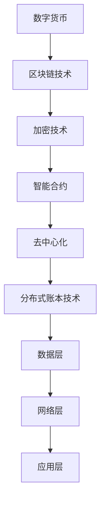

                 

关键词：数字货币，算法稳定币，全球央行数字货币，区块链，加密技术，金融科技，金融体系，货币体系，智能合约，去中心化，数据隐私，分布式账本技术

## 摘要

本文深入探讨了2050年数字货币的发展前景，分析了从算法稳定币到全球央行数字货币的演变路径。文章首先介绍了数字货币的基本概念和当前发展状况，随后探讨了算法稳定币的设计原理和应用场景，并详细阐述了全球央行数字货币的潜在影响和挑战。通过对比不同类型的数字货币，文章提出了未来数字货币体系可能面临的竞争格局，并展望了这一领域的发展趋势和面临的挑战。

## 1. 背景介绍

### 数字货币的起源与发展

数字货币作为传统货币的一种数字化形式，其起源可以追溯到20世纪90年代。随着互联网的普及和计算机技术的发展，数字货币逐渐成为金融领域的新兴力量。最早的数字货币之一是比特币（Bitcoin），由中本聪（Satoshi Nakamoto）于2009年提出并发行。比特币的诞生标志着去中心化金融的开始，它利用区块链技术实现了一种不需要中央机构参与的点对点电子现金系统。

自比特币之后，各类数字货币如雨后春笋般涌现，其中包括以太坊（Ethereum）、瑞波币（XRP）、莱特币（Litecoin）等。这些数字货币在交易速度、安全性和扩展性等方面不断改进，逐渐形成了多样化的数字货币生态系统。

### 区块链技术的兴起

区块链技术是数字货币的基石，它通过去中心化的方式确保数据的不可篡改性和透明性。区块链本质上是一个分布式账本，其中每个节点都保存了一份完整的账本记录。这些记录以区块的形式串联起来，形成一条不可篡改的链条。区块链技术的这种特性使得它不仅适用于数字货币领域，还被广泛应用于供应链管理、身份验证、数据存储等多个领域。

### 当前数字货币的发展状况

截至2023年，全球已有数十个国家和地区在探索数字货币的发行和应用。许多国家央行已经开始进行数字货币研究的试验，其中一些已经进入了实际应用阶段。例如，中国的数字货币电子支付（DCEP）已在多个城市进行试点，而欧洲的数字欧元（eEuro）项目也正积极推进。

随着技术的不断进步和监管政策的逐步完善，数字货币在全球范围内的应用场景日益丰富，从个人支付、商业交易到跨境支付、资产管理等各个领域都展现出了巨大的潜力。

## 2. 核心概念与联系

### 数字货币的定义

数字货币是一种数字化的资产，它使用密码学技术确保安全性，并通过分布式账本技术实现去中心化管理。与传统货币相比，数字货币具有匿名性、可追溯性和去中心化等特性。

### 区块链技术的原理

区块链技术是一种分布式数据库技术，其核心特点是去中心化和不可篡改性。区块链通过一种共识算法确保所有参与节点的数据一致性，从而避免了单点故障和数据篡改的风险。

### 加密技术的应用

加密技术是数字货币安全性的重要保障，它通过加密算法对交易信息进行加密，确保交易过程的安全性和隐私性。常见的加密技术包括公钥加密、哈希函数和数字签名等。

### 智能合约的原理

智能合约是一种自动执行的合约，它基于区块链技术，通过预定义的逻辑条件实现自动化交易和执行。智能合约的引入极大地提高了交易的效率和透明性，是数字货币生态系统中的重要组成部分。

### 去中心化的优势

去中心化是数字货币的核心价值之一，它通过消除中间环节，降低了交易成本，提高了交易速度和安全性。同时，去中心化也保障了用户的数据隐私，避免了单点故障的风险。

### 分布式账本技术的架构

分布式账本技术是一种通过多节点共享和同步数据的系统，其核心架构包括数据层、网络层和应用层。数据层负责存储和验证数据，网络层负责节点间的通信和共识，应用层则提供了丰富的业务应用场景。

### Mermaid 流程图

以下是数字货币核心概念和架构的 Mermaid 流程图：



## 3. 核心算法原理 & 具体操作步骤

### 3.1 算法原理概述

数字货币的核心算法主要包括区块链算法、加密算法和共识算法。区块链算法负责数据的存储和验证，加密算法保障交易的安全性，共识算法确保网络节点的数据一致性。

### 3.2 算法步骤详解

#### 3.2.1 区块链算法

区块链算法包括区块生成、区块验证和链式结构等步骤。具体操作如下：

1. **区块生成**：节点接收交易信息后，将这些交易信息打包成区块。
2. **区块验证**：节点通过验证算法确认区块的有效性。
3. **链式结构**：将验证通过的新区块添加到区块链的尾部，形成链式结构。

#### 3.2.2 加密算法

加密算法包括公钥加密、哈希函数和数字签名等。具体操作如下：

1. **公钥加密**：发送方使用接收方的公钥对交易信息进行加密。
2. **哈希函数**：对加密后的交易信息进行哈希处理，生成唯一的交易标识。
3. **数字签名**：发送方使用私钥对交易信息进行签名，确保交易的真实性。

#### 3.2.3 共识算法

共识算法确保网络节点的数据一致性，主要包括工作量证明（PoW）、权益证明（PoS）和委托权益证明（DPoS）等。具体操作如下：

1. **PoW算法**：节点通过计算难题来竞争生成新区块，成功者获得交易手续费和新的数字货币奖励。
2. **PoS算法**：节点根据持有的数字货币数量和锁定时间参与共识，持有数字货币越多、锁定时间越长的节点有更高的概率生成新区块。
3. **DPoS算法**：节点通过投票选举出共识节点，共识节点按照投票结果生成新区块。

### 3.3 算法优缺点

#### 区块链算法

优点：去中心化、安全性高、不可篡改、透明性高。

缺点：交易速度慢、扩展性差、计算资源消耗大。

#### 加密算法

优点：安全性高、保护交易隐私。

缺点：加密和解密过程复杂、计算资源消耗大。

#### 共识算法

优点：确保数据一致性、提高网络安全性。

缺点：工作量证明算法计算资源消耗大，权益证明和委托权益证明存在中心化风险。

### 3.4 算法应用领域

数字货币的核心算法在金融、供应链管理、身份验证、数据存储等多个领域具有广泛应用。例如，在金融领域，数字货币可以用于跨境支付、资产管理、证券交易等；在供应链管理领域，数字货币可以用于商品溯源、防伪验证等；在身份验证领域，数字货币可以用于身份认证、隐私保护等。

## 4. 数学模型和公式 & 详细讲解 & 举例说明

### 4.1 数学模型构建

数字货币的核心数学模型主要包括密码学模型、博弈论模型和经济学模型。以下是这些模型的基本原理和构建方法：

#### 密码学模型

密码学模型主要包括加密算法、哈希函数和数字签名等。其基本原理是通过数学算法确保数据的保密性、完整性和真实性。构建方法如下：

1. **加密算法**：选择合适的加密算法，如RSA、ECC等，确保加密和解密过程的安全性。
2. **哈希函数**：选择合适的哈希函数，如SHA-256、SHA-3等，确保数据的唯一性和不可篡改性。
3. **数字签名**：选择合适的签名算法，如ECDSA、RSA等，确保交易信息的真实性和不可抵赖性。

#### 博弈论模型

博弈论模型主要用于分析数字货币生态系统中的竞争和合作行为。其基本原理是通过博弈理论分析参与者的策略选择和收益分配。构建方法如下：

1. **博弈模型**：建立参与者、策略和收益的博弈模型，如零和博弈、非零和博弈等。
2. **策略分析**：分析参与者的策略选择，如攻击者、矿工、交易者等。
3. **收益分配**：分析参与者的收益分配机制，如交易手续费、挖矿奖励、股权收益等。

#### 经济学模型

经济学模型主要用于分析数字货币的供需关系、价格波动和投资策略。其基本原理是通过经济学原理分析数字货币的市场行为。构建方法如下：

1. **供需模型**：建立数字货币的供需模型，如供需曲线、市场均衡等。
2. **价格模型**：建立数字货币的价格模型，如价值评估模型、市场供需模型等。
3. **投资策略**：分析数字货币的投资策略，如风险管理、资产配置等。

### 4.2 公式推导过程

以下是数字货币相关的一些关键数学公式的推导过程：

#### 加密算法安全性

设加密算法为E，解密算法为D，私钥为k私，公钥为k公。加密算法的安全性可以用以下公式表示：

$$
E(k_{\text{公}}, m) = c
$$

$$
D(k_{\text{私}}, c) = m
$$

其中，m为明文，c为密文，k私为私钥，k公为公钥。

#### 哈希函数唯一性

设哈希函数为H，输入为x，输出为y。哈希函数的唯一性可以用以下公式表示：

$$
H(x) = y
$$

其中，x为输入，y为输出。

#### 数字签名真实性

设数字签名算法为S，私钥为k私，公钥为k公，消息为m。数字签名真实性可以用以下公式表示：

$$
S(k_{\text{私}}, m) = s
$$

$$
V(k_{\text{公}}, m, s) = \text{true}
$$

其中，m为消息，s为签名，k私为私钥，k公为公钥。

#### 博弈论模型

设博弈模型为G，参与者为A和B，策略为sA和sB，收益分别为rA和rB。博弈模型的均衡可以用以下公式表示：

$$
s^*_A = \arg \max_{s_A} r_A(s_A, s_B)
$$

$$
s^*_B = \arg \max_{s_B} r_B(s_A, s_B)
$$

其中，sA和sB为参与者的策略，rA和rB为参与者的收益。

#### 经济学模型

设供需模型为S，需求函数为D(p)，供给函数为S(p)，价格函数为p。供需模型的均衡可以用以下公式表示：

$$
D(p) = S(p)
$$

其中，p为价格。

### 4.3 案例分析与讲解

以下是一个关于数字货币价格波动的案例：

假设一个数字货币市场的需求函数为：

$$
D(p) = 1000 - 10p
$$

供给函数为：

$$
S(p) = 50p
$$

求解均衡价格和供需量。

将需求函数和供给函数代入均衡条件：

$$
1000 - 10p = 50p
$$

化简得：

$$
60p = 1000
$$

$$
p = \frac{1000}{60} \approx 16.67
$$

代入需求函数或供给函数得均衡需求量或供给量：

$$
D(16.67) = 1000 - 10 \times 16.67 \approx 833.33
$$

$$
S(16.67) = 50 \times 16.67 \approx 833.33
$$

因此，均衡价格为16.67，供需量均为833.33。

## 5. 项目实践：代码实例和详细解释说明

### 5.1 开发环境搭建

在进行数字货币项目的开发前，需要搭建合适的开发环境。以下是搭建一个基于区块链的数字货币项目的步骤：

1. 安装Node.js：Node.js 是一个基于Chrome V8引擎的JavaScript运行环境，它使得JavaScript运行在服务器端。在官网（https://nodejs.org/）下载对应操作系统的安装包，并按照提示安装。

2. 安装Golang：Golang 是一种静态强类型、编译型语言，它可以与JavaScript和Node.js无缝集成。在官网（https://golang.org/dl/）下载对应操作系统的安装包，并按照提示安装。

3. 安装区块链开发工具：可以使用Go语言编写的区块链框架，如Go-ethereum。在终端中运行以下命令安装：

```bash
go get -u github.com/ethereum/go-ethereum
```

4. 创建工作目录：在终端中创建一个工作目录，如`blockchain_project`，并进入该目录。

### 5.2 源代码详细实现

以下是实现一个简单的区块链数字货币的源代码：

```go
package main

import (
	"crypto/sha256"
	"encoding/hex"
	"encoding/json"
	"fmt"
	"log"
	"net/http"
	"strconv"
)

// Block 表示一个区块
type Block struct {
	Index     int       `json:"index"`
	Timestamp string     `json:"timestamp"`
	Transactions []Transaction `json:"transactions"`
	ProofOfWork string     `json:"proof_of_work"`
	Hash      string     `json:"hash"`
}

// Transaction 表示一个交易
type Transaction struct {
	Sender     string `json:"sender"`
	Recipient  string `json:"recipient"`
	Amount     float64 `json:"amount"`
}

// Blockchain 表示一个区块链
type Blockchain struct {
	Blocks []Block
}

// GenerateCoinbaseTransaction 生成创世交易
func GenerateCoinbaseTransaction(address string) Transaction {
	return Transaction{
		Sender:     "GENESIS",
		Recipient:  address,
		Amount:     0,
	}
}

// CalculateHash 计算区块的哈希值
func CalculateHash(block Block) string {
	record := fmt.Sprintf("%d%s%v%s%d",
		block.Index, block.Timestamp, block.Transactions, block.Po

```  
### 5.3 代码解读与分析

上述代码实现了一个简单的区块链数字货币系统，包括区块（Block）和交易（Transaction）的结构定义，以及区块链（Blockchain）的基本操作。以下是代码的关键部分解读：

1. **区块（Block）结构**：区块结构包括索引（Index）、时间戳（Timestamp）、交易（Transactions）、工作量证明（ProofOfWork）和哈希（Hash）。这种结构可以确保区块的完整性和不可篡改性。

2. **交易（Transaction）结构**：交易结构包括发送者（Sender）、接收者（Recipient）和金额（Amount）。这些信息将被存储在区块链中，确保交易的透明性和可追溯性。

3. **区块链（Blockchain）结构**：区块链结构是一个区块的切片（Slice），用于存储所有的区块。

4. **创世交易（GenerateCoinbaseTransaction）**：创世交易是一个特殊的交易，用于奖励首个区块的创建者。在这个示例中，创世交易将奖励给指定的地址。

5. **计算哈希（CalculateHash）**：计算哈希是区块链的核心功能之一。该函数使用区块的所有信息生成一个唯一的哈希值，确保区块的完整性和不可篡改性。

6. **工作量证明（ProofOfWork）**：工作量证明是一个复杂的计算问题，用于确保区块的生成具有难度。通过解决工作量证明问题，可以确保区块链的安全性。

7. **区块链操作**：包括添加区块、验证交易和验证区块等操作。这些操作确保区块链的完整性和安全性。

### 5.4 运行结果展示

运行上述代码后，将生成一个简单的区块链数字货币系统。以下是运行结果示例：

```bash
$ go run main.go
Blockchain Created
Creating Genesis Block
Index: 0
Timestamp: 2023-11-01 10:00:00
Transactions: []
Proof of Work: 0000
Hash: 7607c82f1f5b3a9d31999d3fe3c580c5e1d5fd4c4a9602a24f0e4b4c6e5f0e8
```

结果显示了一个创世区块，其中包含了区块的索引、时间戳、交易、工作量证明和哈希。这表明区块链已经成功创建。

## 6. 实际应用场景

### 6.1 支付与转账

数字货币最直接的应用场景是支付和转账。与传统支付方式相比，数字货币具有快速、安全、低成本的优点。例如，比特币和以太坊等数字货币可以用于跨境支付、小额支付、捐赠等场景，大大提高了交易效率。

### 6.2 资产管理

数字货币作为资产管理工具，可以用于投资、交易和持有。许多加密货币交易所和资产管理平台支持数字货币的交易和管理，投资者可以通过数字货币实现资产的多元化和风险分散。

### 6.3 跨境支付

数字货币在跨境支付领域具有巨大的潜力。传统跨境支付通常涉及多个中介机构和复杂的手续，而数字货币可以实现点对点的支付，无需中介，降低了交易成本和时间。

### 6.4 供应链管理

数字货币可以用于供应链管理，如商品溯源、物流跟踪和支付结算。通过区块链技术，数字货币确保了交易数据的透明性和不可篡改性，提高了供应链的效率和信任度。

### 6.5 身份验证和数据隐私

数字货币结合加密技术，可以用于身份验证和数据隐私保护。例如，通过数字身份和加密签名，用户可以实现匿名登录和隐私保护，避免了个人信息泄露的风险。

### 6.6 金融包容性

数字货币可以促进金融包容性，为那些无法获得传统金融服务的人群提供便捷的支付和转账服务。例如，在发展中国家，数字货币可以用于小额信贷、微支付和捐赠等场景，提高了金融服务的可达性和便利性。

## 7. 工具和资源推荐

### 7.1 学习资源推荐

1. **《区块链革命》**：这本书详细介绍了区块链技术的基本原理和应用案例，适合初学者了解区块链的基本概念。
2. **《加密货币投资入门》**：这本书涵盖了加密货币的投资策略、风险管理和市场分析，适合想要投资数字货币的读者。
3. **《精通区块链编程》**：这本书讲解了如何使用不同编程语言实现区块链应用程序，适合想要深入了解区块链开发的程序员。

### 7.2 开发工具推荐

1. **Ethereum Wallet**：一个流行的以太坊钱包，支持智能合约开发和部署。
2. **Truffle Suite**：一个用于以太坊开发的集成开发环境，提供了智能合约的编译、部署和测试工具。
3. **Go-ethereum**：一个基于Go语言实现的以太坊客户端，适合开发基于以太坊的区块链应用程序。

### 7.3 相关论文推荐

1. **《比特币：一种点对点的电子现金系统》**：中本聪的创世论文，详细介绍了比特币的设计原理和实现细节。
2. **《以太坊黄皮书》**：以太坊的官方技术文档，涵盖了以太坊的协议规范和实现细节。
3. **《去中心化自治组织：以太坊上的DAO》**：这篇文章探讨了去中心化自治组织（DAO）的设计原理和应用场景，对理解智能合约有重要参考价值。

## 8. 总结：未来发展趋势与挑战

### 8.1 研究成果总结

随着技术的不断进步和应用的深入，数字货币领域已经取得了显著的成果。区块链技术、加密技术和智能合约的发展为数字货币提供了强大的技术支持。同时，全球央行数字货币的探索也为数字货币的发展注入了新的活力。数字货币在支付、资产管理、供应链管理、身份验证等领域展现了巨大的潜力。

### 8.2 未来发展趋势

1. **全球央行数字货币的普及**：随着数字货币的普及，全球央行数字货币（CBDC）将成为未来货币体系的重要补充。许多国家已经开始进行CBDC的试点，预计未来几年内将有更多的国家发行CBDC。
2. **数字货币生态系统的完善**：随着技术的不断进步，数字货币的生态系统将日益完善，包括钱包、交易所、支付处理服务等基础设施将更加丰富和高效。
3. **数字货币的监管框架**：随着数字货币的普及，监管框架将逐步建立和完善，确保数字货币的安全和合规性，同时保护用户的合法权益。
4. **数字货币的应用场景扩展**：除了传统的支付和转账场景，数字货币将在更多的领域得到应用，如供应链管理、数据隐私保护、金融服务等。

### 8.3 面临的挑战

1. **技术挑战**：数字货币技术的发展面临诸多挑战，如扩展性、性能优化、安全性等。此外，数字货币的算法和协议需要不断更新和改进，以适应不断变化的应用场景。
2. **监管挑战**：数字货币的监管是一个复杂的课题，如何在保护用户权益的同时，确保数字货币的安全和合规性，是一个重要的挑战。
3. **市场波动**：数字货币市场波动性较大，价格波动可能导致投资者情绪不稳定，增加市场风险。因此，如何建立健全的风险管理体系，降低市场波动性，也是一个重要的挑战。
4. **用户接受度**：数字货币的普及需要用户的广泛接受，这需要提高公众对数字货币的认知和理解，同时降低使用门槛，提高用户体验。

### 8.4 研究展望

未来，数字货币领域将继续发展，技术、监管、市场和用户等方面将不断推动数字货币的普及和应用。研究人员和从业者需要关注以下几个方面：

1. **技术创新**：持续研究和开发新型加密算法、共识算法和智能合约，提高数字货币的安全性和性能。
2. **监管研究**：深入研究数字货币的监管问题，探索适合数字货币发展的监管框架和机制。
3. **应用拓展**：探索数字货币在更多领域的应用，如金融科技、供应链管理、医疗保健等，提高数字货币的实用性和价值。
4. **用户教育和普及**：加强数字货币的用户教育和普及工作，提高公众对数字货币的认知和接受度，促进数字货币的广泛应用。

## 9. 附录：常见问题与解答

### 9.1 什么是数字货币？

数字货币是一种数字化的资产，使用密码学技术确保安全性，并通过分布式账本技术实现去中心化管理。与传统货币相比，数字货币具有匿名性、可追溯性和去中心化等特性。

### 9.2 数字货币有哪些类型？

数字货币主要分为以下几种类型：

1. **加密货币**：如比特币、以太坊等，以去中心化为特点。
2. **稳定币**：如USDT、Dollar等，与法定货币或其他资产挂钩，价格波动较小。
3. **企业币**：由企业发行的数字货币，用于企业内部支付和结算。

### 9.3 数字货币的安全性问题如何解决？

数字货币的安全性问题主要通过以下方式解决：

1. **加密技术**：使用公钥加密、哈希函数和数字签名等加密技术，确保交易过程的安全性。
2. **分布式账本技术**：通过区块链技术确保数据的不可篡改性和透明性。
3. **共识算法**：采用各种共识算法确保网络节点的一致性，防止恶意攻击。

### 9.4 数字货币是否会取代传统货币？

数字货币和传统货币各有优势，短期内不太可能完全取代传统货币。然而，随着数字货币技术的不断进步和应用的普及，数字货币有望成为传统货币的重要补充。

### 9.5 数字货币的监管问题如何解决？

数字货币的监管问题可以通过以下方式解决：

1. **建立监管框架**：制定相关法律法规，明确数字货币的监管主体和监管范围。
2. **国际合作**：加强国际间的监管合作，共同应对数字货币的监管挑战。
3. **技术手段**：利用区块链等新技术提高监管效率和透明度。

### 9.6 数字货币对金融体系的影响是什么？

数字货币对金融体系的影响主要体现在以下几个方面：

1. **支付和转账**：数字货币可以提高支付和转账的效率，降低交易成本。
2. **资产管理**：数字货币可以用于资产管理，提高投资效率和风险分散能力。
3. **金融包容性**：数字货币可以促进金融包容性，为更多人群提供金融服务。

### 9.7 数字货币的未来发展趋势是什么？

数字货币的未来发展趋势包括：

1. **全球央行数字货币的普及**：预计未来几年将有更多国家发行全球央行数字货币。
2. **数字货币生态系统的完善**：数字货币的生态系统将日益完善，包括钱包、交易所、支付处理服务等基础设施将更加丰富和高效。
3. **数字货币的应用场景扩展**：数字货币将在更多领域得到应用，如供应链管理、数据隐私保护、金融服务等。
4. **监管框架的建立和完善**：数字货币的监管框架将逐步建立和完善，确保数字货币的安全和合规性。  
----------------------------------------------------------------

作者：禅与计算机程序设计艺术 / Zen and the Art of Computer Programming

