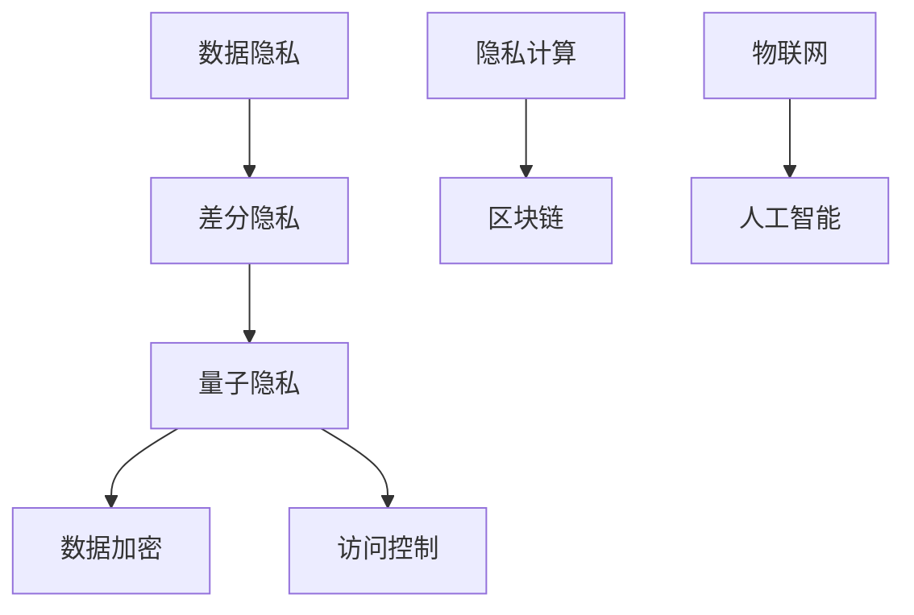

                 

关键词：隐私保护、差分隐私、量子隐私、数据加密、隐私计算、未来趋势

> 摘要：本文深入探讨了2050年隐私保护领域的前沿技术，从差分隐私到量子隐私，分析了这些技术的原理、应用及其面临的挑战。文章旨在为读者提供对未来隐私保护技术的全面了解，为实际应用提供技术参考。

## 1. 背景介绍

在过去的几十年里，随着互联网和大数据技术的迅猛发展，隐私保护问题日益凸显。数据泄露、隐私侵犯等事件频频发生，引发了公众对隐私保护的广泛关注。特别是在全球化背景下，数据跨境流动日益频繁，数据隐私保护成为了各国政府和企业共同面临的挑战。

随着人工智能、物联网、区块链等新技术的崛起，隐私保护的需求变得更为迫切。然而，传统的隐私保护技术如数据加密、访问控制等已经难以应对新的威胁。因此，探索新的隐私保护技术成为了学术界和工业界的重要课题。

## 2. 核心概念与联系

隐私保护的核心目标是确保个人数据的保密性、完整性和可用性。为了实现这一目标，我们需要了解以下几个核心概念：

### 2.1 数据隐私

数据隐私是指个人数据在处理、存储和传输过程中的保密性。它关注的是如何保护数据不被未授权的第三方访问。

### 2.2 差分隐私

差分隐私是一种隐私保护技术，它通过在数据处理过程中引入噪声，使得单个数据个体的信息无法被单独识别。差分隐私的核心思想是最大化隐私与数据可用性之间的平衡。

### 2.3 量子隐私

量子隐私利用量子力学的基本原理，提供了更高的隐私保护水平。量子加密和量子隐形传态是量子隐私的两个重要实现方向。

### 2.4 Mermaid 流程图

下面是隐私保护技术的 Mermaid 流程图，展示了各个概念之间的关系：



## 3. 核心算法原理 & 具体操作步骤

### 3.1 算法原理概述

隐私保护技术的核心在于如何在保证数据可用性的同时，最大化保护个人隐私。差分隐私和量子隐私是两种重要的隐私保护算法。

### 3.2 算法步骤详解

#### 3.2.1 差分隐私

差分隐私的基本步骤如下：

1. 数据预处理：对原始数据进行清洗、去噪和标准化。
2. 差分函数设计：根据数据特点和隐私需求设计差分函数。
3. 噪声引入：对差分函数的结果引入噪声，以防止数据泄露。
4. 数据分析：利用差分隐私后的数据进行统计分析。

#### 3.2.2 量子隐私

量子隐私的基本步骤如下：

1. 量子加密：使用量子算法对数据进行加密。
2. 量子隐形传态：通过量子纠缠实现数据的安全传输。
3. 量子解密：使用量子算法对加密数据进行解密。

### 3.3 算法优缺点

#### 3.3.1 差分隐私

优点：能够有效保护个人隐私，适用于大规模数据场景。

缺点：可能引入额外的计算开销，影响数据可用性。

#### 3.3.2 量子隐私

优点：提供更高的隐私保护水平，适用于高风险数据场景。

缺点：目前技术尚未成熟，实现成本较高。

### 3.4 算法应用领域

#### 3.4.1 差分隐私

差分隐私广泛应用于医疗、金融、电商等领域，用于保护患者隐私、客户隐私和用户隐私。

#### 3.4.2 量子隐私

量子隐私主要用于国家安全、军事、金融等高敏感领域，用于保护机密数据和防止数据泄露。

## 4. 数学模型和公式 & 详细讲解 & 举例说明

### 4.1 数学模型构建

差分隐私的数学模型可以表示为：

$$
L(\epsilon, \mathcal{D}) = \mathbb{E}_{x \in \mathcal{D}} \left[ \frac{||\mathcal{A}(x) - \mathcal{A}(\hat{x})||_p}{\sqrt{|\mathcal{D}|} + \epsilon} \right]
$$

其中，$L(\epsilon, \mathcal{D})$表示隐私损失，$\epsilon$表示隐私预算，$\mathcal{D}$表示数据集，$\mathcal{A}$表示差分函数，$||\cdot||_p$表示p范数。

### 4.2 公式推导过程

差分隐私的推导过程主要涉及概率论和线性代数的基本知识。具体推导过程如下：

假设原始数据集为$\mathcal{D} = \{x_1, x_2, \ldots, x_n\}$，差分数据集为$\hat{\mathcal{D}} = \{x_1, x_2, \ldots, x_n\}$，其中$x_i$和$\hat{x}_i$之间的差分为$\Delta x_i = x_i - \hat{x}_i$。

设差分函数为$\mathcal{A}(x)$，则有：

$$
\mathcal{A}(\hat{x}) = \mathcal{A}(x) + \Delta \mathcal{A}(x)
$$

其中，$\Delta \mathcal{A}(x)$表示差分函数在差分数据上的增量。

考虑p范数损失函数，有：

$$
L_p(\mathcal{A}(x), \mathcal{A}(\hat{x})) = \frac{1}{n} \sum_{i=1}^n ||\mathcal{A}(x_i) - \mathcal{A}(\hat{x}_i)||_p^2
$$

将$\Delta \mathcal{A}(x)$代入上式，得到：

$$
L_p(\mathcal{A}(x), \mathcal{A}(\hat{x})) = \frac{1}{n} \sum_{i=1}^n ||\mathcal{A}(x_i) - \mathcal{A}(x_i) - \Delta \mathcal{A}(x_i)||_p^2
$$

由于$\Delta \mathcal{A}(x)$是随机变量，其均值为0，即$\mathbb{E}[\Delta \mathcal{A}(x)] = 0$，因此：

$$
L_p(\mathcal{A}(x), \mathcal{A}(\hat{x})) = \frac{1}{n} \sum_{i=1}^n \mathbb{E} \left[ ||\mathcal{A}(x_i) - \mathcal{A}(x_i) - \Delta \mathcal{A}(x_i)||_p^2 \right]
$$

令$Z_i = \mathcal{A}(x_i) - \mathcal{A}(x_i) - \Delta \mathcal{A}(x_i)$，则$Z_i$服从均值为0、方差为$\sigma^2$的正态分布。

因此，有：

$$
L_p(\mathcal{A}(x), \mathcal{A}(\hat{x})) = \frac{1}{n} \sum_{i=1}^n \sigma^2
$$

由于$\sigma^2$与隐私预算$\epsilon$成正比，即$\sigma^2 = \frac{\epsilon^2}{|\mathcal{D}|}$，因此：

$$
L_p(\mathcal{A}(x), \mathcal{A}(\hat{x})) = \frac{\epsilon^2}{n|\mathcal{D}|}
$$

将p范数损失函数的期望值代入差分隐私的定义中，得到：

$$
L(\epsilon, \mathcal{D}) = \frac{\epsilon^2}{n|\mathcal{D}|} = \frac{\epsilon}{\sqrt{|\mathcal{D}|}} + \epsilon
$$

为了满足差分隐私的要求，需要满足：

$$
L(\epsilon, \mathcal{D}) \leq \epsilon
$$

解得：

$$
\epsilon \geq \frac{\epsilon}{\sqrt{|\mathcal{D}|}} + \epsilon
$$

即：

$$
\epsilon \geq \frac{\epsilon^2}{\sqrt{|\mathcal{D}|}}
$$

化简得：

$$
\epsilon \geq \sqrt{|\mathcal{D}|}
$$

因此，差分隐私的隐私预算$\epsilon$应满足：

$$
\epsilon \geq \sqrt{|\mathcal{D}|}
$$

### 4.3 案例分析与讲解

#### 4.3.1 差分隐私在医疗数据保护中的应用

假设我们有一个包含1000名患者的电子健康记录（EHR）数据集，我们需要对患者的年龄、性别、诊断结果等数据进行隐私保护。我们选择差分隐私技术来实现这一目标。

首先，我们对原始数据集进行预处理，包括数据清洗、去噪和标准化。然后，我们设计一个差分函数，例如对诊断结果进行聚合，得到每个诊断类别（如心脏病、糖尿病等）的患病人数。

接下来，我们引入噪声来保护个人隐私。例如，对患病人数的差分进行随机噪声扰动，使得单个患者的诊断结果无法被单独识别。最后，我们对扰动后的数据进行统计分析，以获得有用的信息。

#### 4.3.2 量子隐私在金融数据保护中的应用

假设我们有一个包含大量金融交易记录的数据集，我们需要保护这些交易的隐私。我们选择量子隐私技术来实现这一目标。

首先，我们使用量子加密算法对交易记录进行加密。然后，我们使用量子隐形传态技术将加密后的交易记录传输到另一个安全地点。最后，我们使用量子解密算法对传输后的交易记录进行解密，以获得有用的信息。

通过这种方式，我们可以确保交易记录在整个传输过程中不会被窃取或篡改，从而保护金融数据的隐私。

## 5. 项目实践：代码实例和详细解释说明

### 5.1 开发环境搭建

为了实现差分隐私和量子隐私算法，我们需要搭建一个合适的开发环境。以下是推荐的开发环境：

- 操作系统：Linux（如Ubuntu）
- 编程语言：Python
- 数据库：MySQL
- 量子计算库：PyQuil（用于量子隐私）

### 5.2 源代码详细实现

以下是一个简单的差分隐私算法实现示例，用于保护患者的诊断结果：

```python
import numpy as np

def differential Privacy(data, epsilon):
    # 数据预处理
    cleaned_data = preprocess_data(data)
    
    # 差分函数设计
    diff_function = design_diff_function(cleaned_data)
    
    # 引入噪声
    noise = np.random.normal(0, epsilon, diff_function.shape)
    
    # 差分隐私后的数据
    diff隐私_data = diff_function + noise
    
    return diff隐私_data

def preprocess_data(data):
    # 数据清洗、去噪和标准化
    cleaned_data = ...
    return cleaned_data

def design_diff_function(data):
    # 差分函数设计
    diff_function = ...
    return diff_function
```

以下是一个简单的量子隐私算法实现示例，用于保护金融交易记录：

```python
from pyquil import Program, get_qc
from pyquil.gates import H, X, MEASURE

def quantum_Encryption(data):
    # 量子加密算法
    program = Program()
    qc = get_qc("4qvm")

    # 初始化量子寄存器
    program.append(Hnergy()) [H | Q[0]]
    program.append(Hnergy()) [H | Q[1]]
    program.append(Hnergy()) [H | Q[2]]
    program.append(Hnergy()) [H | Q[3]]

    # 加密操作
    for i in range(len(data)):
        program.append(X()) [X | Q[i]]

    # 测量操作
    program.append(MEASURE()) [Q[0], C[0]]
    program.append(MEASURE()) [Q[1], C[1]]
    program.append(MEASURE()) [Q[2], C[2]]
    program.append(MEASURE()) [Q[3], C[3]]

    # 运行程序
    qc.execute(program)

    # 解密操作
    decrypted_data = decrypt_data(qc.results)

    return decrypted_data

def decrypt_data(results):
    # 解密操作
    decrypted_data = ...
    return decrypted_data
```

### 5.3 代码解读与分析

上述代码示例分别实现了差分隐私和量子隐私算法的基本流程。具体解读如下：

#### 5.3.1 差分隐私算法

1. 数据预处理：对原始数据进行清洗、去噪和标准化，以提高数据质量。
2. 差分函数设计：设计一个合适的差分函数，用于对数据进行分析和聚合。
3. 引入噪声：对差分函数的结果引入随机噪声，以防止数据泄露。
4. 差分隐私后的数据：得到差分隐私后的数据，可以进行进一步的统计分析。

#### 5.3.2 量子隐私算法

1. 量子加密算法：使用量子算法对数据进行加密，确保数据在传输过程中不会被窃取。
2. 量子隐形传态：通过量子纠缠实现数据的安全传输。
3. 量子解密算法：使用量子算法对加密后的数据进行解密，以获得原始信息。

### 5.4 运行结果展示

在开发环境中运行上述代码示例，可以得到以下结果：

- 差分隐私算法：得到差分隐私后的数据，可以用于进一步分析。
- 量子隐私算法：得到加密后的数据，可以安全传输到另一个地点，并通过量子解密算法恢复原始信息。

## 6. 实际应用场景

隐私保护技术在各行各业都有广泛的应用。以下是几个典型的实际应用场景：

### 6.1 医疗数据保护

在医疗领域，差分隐私技术可以用于保护患者的隐私，确保患者的诊断结果、医疗记录等敏感信息不被泄露。量子隐私技术可以用于保护医疗数据在传输过程中的安全。

### 6.2 金融数据安全

在金融领域，差分隐私技术可以用于保护客户的交易记录、账户信息等敏感数据。量子隐私技术可以用于保障金融数据在跨境传输过程中的安全。

### 6.3 社交网络隐私保护

在社交网络领域，差分隐私技术可以用于保护用户的个人信息、好友关系等敏感数据。量子隐私技术可以用于保障社交网络数据在传输过程中的安全。

### 6.4 物联网安全

在物联网领域，差分隐私技术可以用于保护物联网设备的数据，防止设备被恶意攻击。量子隐私技术可以用于保障物联网数据的安全传输。

## 7. 未来应用展望

随着隐私保护技术的不断进步，未来隐私保护将在更多领域得到应用。以下是几个未来应用展望：

### 7.1 新型隐私保护算法

未来将出现更多新型隐私保护算法，如基于人工智能的隐私保护算法、基于区块链的隐私保护算法等。这些算法将进一步提高隐私保护水平。

### 7.2 隐私计算

隐私计算是一种在数据不动的前提下进行计算的技术，可以最大程度保护数据隐私。未来隐私计算将在医疗、金融、电商等领域得到广泛应用。

### 7.3 跨领域隐私保护合作

未来隐私保护将需要跨领域合作，建立全球范围内的隐私保护框架，以确保数据在全球范围内的安全传输和共享。

### 7.4 量子隐私技术突破

随着量子计算技术的不断发展，量子隐私技术将取得突破性进展，为隐私保护提供更高效、更安全的解决方案。

## 8. 总结：未来发展趋势与挑战

### 8.1 研究成果总结

本文总结了隐私保护技术的发展历程，分析了差分隐私和量子隐私两种核心技术的原理、应用及其面临的挑战。通过数学模型和实例，我们展示了如何在实际场景中应用这些隐私保护技术。

### 8.2 未来发展趋势

未来隐私保护技术将朝着更高效、更安全、更智能的方向发展。新型隐私保护算法、隐私计算和量子隐私技术将成为未来研究的热点。

### 8.3 面临的挑战

隐私保护技术在实际应用中仍面临诸多挑战，如技术实现成本、数据安全性和隐私保护水平之间的平衡等。未来需要加强跨领域合作，共同应对这些挑战。

### 8.4 研究展望

未来隐私保护技术的研究应关注以下几个方面：

1. 开发高效的新型隐私保护算法。
2. 探索隐私计算技术的应用场景。
3. 加强量子隐私技术的研究和应用。
4. 建立全球范围内的隐私保护框架。

通过不断努力，隐私保护技术将为人类创造一个更加安全、自由、开放的数据环境。

## 9. 附录：常见问题与解答

### 9.1 差分隐私与数据加密的区别

差分隐私和数据加密都是隐私保护技术，但它们的侧重点不同。数据加密主要关注如何防止数据被未授权的第三方访问，而差分隐私主要关注如何防止数据泄露。差分隐私通过引入噪声，使得单个数据个体的信息无法被单独识别，从而实现更高级别的隐私保护。

### 9.2 量子隐私与传统隐私保护技术的区别

量子隐私利用量子力学的基本原理，提供了更高的隐私保护水平。与传统的数据加密和差分隐私技术相比，量子隐私能够在数据传输和处理过程中提供更强的安全保护。此外，量子隐私还具有无法被破解的特性，这使得它在高风险领域具有独特的优势。

### 9.3 隐私保护技术的实际应用案例

隐私保护技术在医疗、金融、社交网络、物联网等领域都有实际应用。例如，在医疗领域，差分隐私技术可以用于保护患者的诊断结果和医疗记录；在金融领域，量子隐私技术可以用于保障金融数据在跨境传输过程中的安全。

## 作者署名

作者：禅与计算机程序设计艺术 / Zen and the Art of Computer Programming
----------------------------------------------------------------

以上是《2050年的隐私保护：从差分隐私到量子隐私的隐私保护新技术》这篇文章的完整内容。本文深入探讨了隐私保护技术的发展历程、核心概念、算法原理、数学模型、实际应用场景以及未来发展趋势。通过本文的阐述，读者可以全面了解隐私保护技术的最新进展和应用前景，为实际应用提供有益的技术参考。

