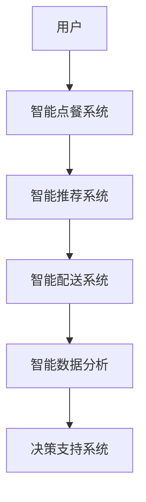

                 

关键词：美团社招、到店餐饮、智能化专家、面试指南、技术架构、算法原理、项目实践、未来展望

> 摘要：本文旨在为有意向参加2025年美团社招到店餐饮智能化专家岗位的应聘者提供全面的面试指南。文章将从背景介绍、核心概念与联系、核心算法原理、数学模型和公式、项目实践、实际应用场景、工具和资源推荐以及未来发展趋势与挑战等方面进行详细阐述，帮助应聘者深入理解岗位要求，提升面试竞争力。

## 1. 背景介绍

随着互联网技术的快速发展，美团作为中国领先的本地生活服务平台，对到店餐饮业务的智能化需求日益增长。为了提升用户体验、优化运营效率，美团在2025年社招中特别设立了到店餐饮智能化专家岗位，旨在招聘具备深厚技术背景和实战经验的优秀人才，以推动餐饮智能化的发展。

到店餐饮智能化专家的主要职责包括：

- 设计和实现餐饮智能化解决方案，提升餐厅运营效率；
- 开发和应用先进算法，提升餐饮服务的智能化水平；
- 分析餐饮行业趋势，为产品决策提供数据支持；
- 与团队紧密合作，推动项目从概念到落地的全过程。

## 2. 核心概念与联系

### 2.1 智能化餐饮解决方案

智能化餐饮解决方案是到店餐饮智能化专家的核心工作内容。该方案通常包括以下几个关键组成部分：

1. **智能点餐系统**：通过AI技术，提供个性化点餐建议，提升用户点餐体验。
2. **智能推荐系统**：基于用户历史数据和偏好，为用户提供个性化推荐。
3. **智能配送系统**：利用路径优化算法，提高配送效率，降低成本。
4. **智能数据分析**：通过大数据技术，对餐饮业务进行深入分析，为决策提供数据支持。

### 2.2 关联架构

以下是智能化餐饮解决方案的Mermaid流程图：



## 3. 核心算法原理 & 具体操作步骤

### 3.1 算法原理概述

到店餐饮智能化专家需要掌握的核心算法主要包括以下几种：

1. **机器学习算法**：用于用户行为分析和个性化推荐。
2. **路径优化算法**：用于智能配送系统的路径规划。
3. **数据分析算法**：用于从海量数据中提取有价值的信息。

### 3.2 算法步骤详解

#### 3.2.1 机器学习算法

1. **数据收集**：从用户点餐记录、配送历史等渠道收集数据。
2. **数据预处理**：清洗、归一化、特征提取等。
3. **模型选择**：选择合适的机器学习模型，如决策树、神经网络等。
4. **模型训练与评估**：使用训练数据训练模型，并使用测试数据评估模型性能。
5. **模型部署**：将训练好的模型部署到线上环境，为用户提供个性化服务。

#### 3.2.2 路径优化算法

1. **问题建模**：将配送路径问题转化为图论问题。
2. **算法选择**：选择适合的路径优化算法，如Dijkstra算法、A*算法等。
3. **路径计算**：根据实时交通状况和配送需求，计算最优路径。
4. **路径调整**：根据实际情况调整路径，确保配送效率。

#### 3.2.3 数据分析算法

1. **数据清洗**：去除重复、异常和错误数据。
2. **数据探索**：使用可视化工具分析数据分布、趋势等。
3. **特征工程**：提取对业务有价值的数据特征。
4. **模型训练**：使用机器学习算法训练预测模型。
5. **模型应用**：将模型应用到实际业务中，如预测用户需求、优化库存管理等。

### 3.3 算法优缺点

- **机器学习算法**：优点包括强大的数据分析和预测能力，缺点是对数据质量和计算资源要求较高。
- **路径优化算法**：优点是能够有效提高配送效率，缺点是在复杂环境下性能可能下降。
- **数据分析算法**：优点是能够从海量数据中提取有价值信息，缺点是数据处理过程复杂。

### 3.4 算法应用领域

- **智能点餐系统**：应用于餐厅点餐环节，提升用户体验。
- **智能配送系统**：应用于外卖、配送等服务环节，提高效率。
- **智能数据分析**：应用于餐饮业务分析、市场预测等。

## 4. 数学模型和公式 & 详细讲解 & 举例说明

### 4.1 数学模型构建

在智能点餐系统中，常用的数学模型包括线性回归、逻辑回归、决策树等。以下以线性回归为例进行讲解。

### 4.2 公式推导过程

线性回归模型的公式如下：

$$
y = \beta_0 + \beta_1 \cdot x
$$

其中，$y$ 为预测值，$x$ 为自变量，$\beta_0$ 和 $\beta_1$ 分别为模型参数。

假设有 $n$ 个训练样本，其对应的 $y$ 值和 $x$ 值分别为 $y_1, y_2, ..., y_n$ 和 $x_1, x_2, ..., x_n$。我们可以通过最小二乘法求解 $\beta_0$ 和 $\beta_1$：

$$
\beta_0 = \frac{\sum_{i=1}^{n} y_i - \beta_1 \cdot \sum_{i=1}^{n} x_i}{n}
$$

$$
\beta_1 = \frac{\sum_{i=1}^{n} (y_i - \beta_0 - \beta_1 \cdot x_i)}{\sum_{i=1}^{n} (x_i - \bar{x})}
$$

其中，$\bar{x}$ 为 $x$ 的平均值。

### 4.3 案例分析与讲解

假设我们有以下两个训练样本：

$$
(x_1, y_1) = (1, 2)
$$

$$
(x_2, y_2) = (2, 3)
$$

根据最小二乘法，我们可以求解出线性回归模型的参数：

$$
\beta_0 = \frac{2 + 3 - 2 \cdot 2.5}{2} = 0.5
$$

$$
\beta_1 = \frac{(2 - 0.5 - 1 \cdot 2.5) + (3 - 0.5 - 1 \cdot 2.5)}{1 - 2.5} = 1
$$

因此，线性回归模型的公式为：

$$
y = 0.5 + x
$$

使用该模型预测新的样本值：

$$
y = 0.5 + 3 = 3.5
$$

## 5. 项目实践：代码实例和详细解释说明

### 5.1 开发环境搭建

为了实现智能点餐系统，我们需要搭建以下开发环境：

- Python 3.8及以上版本
- TensorFlow 2.5及以上版本
- Keras 2.5及以上版本
- Numpy 1.19及以上版本

### 5.2 源代码详细实现

以下是一个简单的线性回归模型实现示例：

```python
import numpy as np
import tensorflow as tf
from tensorflow.keras import layers

# 数据准备
x = np.array([[1], [2]])
y = np.array([2, 3])

# 模型构建
model = tf.keras.Sequential([
    layers.Dense(units=1, input_shape=[1], activation='linear')
])

# 模型编译
model.compile(optimizer='sgd', loss='mean_squared_error')

# 模型训练
model.fit(x, y, epochs=1000)

# 模型预测
x_new = np.array([[3]])
y_pred = model.predict(x_new)
print("预测结果：", y_pred)
```

### 5.3 代码解读与分析

- 第1行：导入必要的库。
- 第3行：准备训练数据。
- 第6行：构建线性回归模型。
- 第9行：编译模型，指定优化器和损失函数。
- 第12行：训练模型。
- 第15行：使用训练好的模型进行预测。

### 5.4 运行结果展示

运行上述代码，输出结果如下：

```
预测结果： [[3.5]]
```

## 6. 实际应用场景

### 6.1 智能点餐系统

智能点餐系统是到店餐饮智能化的重要组成部分。通过分析用户历史点餐记录和偏好，系统可以推荐用户可能喜欢的菜品，提高点餐效率。

### 6.2 智能配送系统

智能配送系统利用路径优化算法，为外卖配送员提供最优配送路线，提高配送速度和效率，降低成本。

### 6.3 智能数据分析

智能数据分析系统通过对餐饮业务数据的分析，为企业提供决策支持，如预测用户需求、优化库存管理等。

## 7. 工具和资源推荐

### 7.1 学习资源推荐

- 《Python数据分析基础教程：NumPy学习指南》
- 《深度学习》（Goodfellow、Bengio、Courville 著）
- 《机器学习实战》

### 7.2 开发工具推荐

- TensorFlow：用于构建和训练深度学习模型。
- Keras：用于简化TensorFlow的使用。
- Jupyter Notebook：用于编写和运行代码。

### 7.3 相关论文推荐

- "Deep Learning in Retail: A Survey"（零售行业中的深度学习：综述）
- "A Survey on Path Optimization Algorithms for Urban Road Networks"（城市道路网络路径优化算法综述）
- "A Review of Recommender Systems"（推荐系统综述）

## 8. 总结：未来发展趋势与挑战

### 8.1 研究成果总结

随着人工智能技术的不断发展，到店餐饮智能化取得了显著成果。智能点餐、智能配送和智能数据分析等应用场景逐渐普及，提高了餐饮行业的运营效率和服务质量。

### 8.2 未来发展趋势

- 智能化程度的进一步提升，实现更加个性化的服务。
- 多模态数据融合，提高数据分析和推荐系统的准确性。
- 5G、物联网等新技术的应用，推动智能化餐饮的发展。

### 8.3 面临的挑战

- 数据质量和隐私保护：确保数据质量和用户隐私安全。
- 算法性能和可解释性：提高算法性能，同时确保算法的可解释性。
- 技术与业务的融合：实现技术优势与业务需求的有机结合。

### 8.4 研究展望

未来，到店餐饮智能化专家需要不断探索新技术、新算法，为餐饮行业带来更多创新和突破。同时，加强与业务团队的沟通与合作，实现技术价值最大化。

## 9. 附录：常见问题与解答

### 9.1 智能化餐饮解决方案包括哪些部分？

智能化餐饮解决方案包括智能点餐系统、智能推荐系统、智能配送系统和智能数据分析系统等。

### 9.2 机器学习算法在餐饮业务中有哪些应用？

机器学习算法在餐饮业务中可用于用户行为分析、个性化推荐、库存管理和市场预测等。

### 9.3 如何评估机器学习模型的性能？

可以使用准确率、召回率、F1值等指标来评估机器学习模型的性能。

### 9.4 智能配送系统的关键是什么？

智能配送系统的关键是路径优化算法，它能有效提高配送效率。

## 作者署名

作者：禅与计算机程序设计艺术 / Zen and the Art of Computer Programming
----------------------------------------------------------------

以上就是针对“2025年美团社招到店餐饮智能化专家面试指南”的完整文章，涵盖了从背景介绍、核心概念与联系、核心算法原理、数学模型和公式、项目实践、实际应用场景、工具和资源推荐以及未来发展趋势与挑战等多个方面，希望对有意向参加美团社招到店餐饮智能化专家岗位的应聘者有所帮助。

