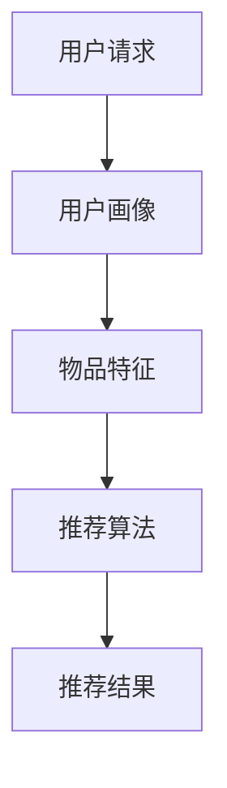

                 

关键词：美团，餐厅推荐系统，面试指南，社招，人工智能，技术

> 摘要：本文旨在为2025年美团社招餐厅推荐系统工程师面试提供全面的准备指导。通过分析美团餐厅推荐系统的核心概念、算法原理、数学模型和项目实践，帮助应聘者深入了解该领域的最新动态和关键技能，为面试做好充分准备。

## 1. 背景介绍

随着移动互联网的迅猛发展，在线餐饮市场日益繁荣。美团作为行业领军企业，其餐厅推荐系统在用户体验和商业价值上具有重要的战略意义。餐厅推荐系统的目标是根据用户的兴趣和行为，为用户提供个性化的餐厅推荐，从而提高用户满意度和转化率。

餐厅推荐系统涉及到多个技术领域，包括数据挖掘、机器学习、自然语言处理和推荐算法等。在2025年美团社招餐厅推荐系统工程师面试中，面试官可能会考查应聘者对相关技术领域的深入理解和实际应用能力。

### 1.1 美团餐厅推荐系统的重要性

1. **用户体验优化**：餐厅推荐系统能够根据用户的喜好和需求，提供个性化的餐厅推荐，提升用户体验。
2. **商业价值提升**：通过精准的餐厅推荐，提高用户的下单转化率，增加平台的收入。
3. **市场竞争力**：餐厅推荐系统是美团与其他竞争对手的重要差异化优势之一。

### 1.2 美团餐厅推荐系统的发展历程

1. **早期阶段**：基于简单的用户历史行为和餐厅信息进行推荐，如基于协同过滤的方法。
2. **发展阶段**：引入机器学习和深度学习技术，如基于模型的协同过滤、内容推荐和混合推荐系统。
3. **未来趋势**：结合自然语言处理和图像识别技术，实现更加智能化的餐厅推荐。

## 2. 核心概念与联系

为了更好地理解美团餐厅推荐系统，我们需要掌握以下几个核心概念：

### 2.1 推荐系统基本概念

1. **用户画像**：根据用户的历史行为、兴趣爱好等特征构建的用户特征模型。
2. **物品特征**：餐厅的各类属性，如评分、价格、菜系等。
3. **推荐算法**：基于用户画像和物品特征，为用户推荐相关餐厅的算法。

### 2.2 美团餐厅推荐系统架构



### 2.3 推荐算法分类

1. **基于内容的推荐**：根据用户历史行为和餐厅特征进行推荐。
2. **基于协同过滤的推荐**：根据用户的历史行为和相似用户的行为进行推荐。
3. **混合推荐**：结合多种推荐算法，提高推荐效果。

## 3. 核心算法原理 & 具体操作步骤

### 3.1 算法原理概述

餐厅推荐系统的核心是推荐算法。常用的推荐算法包括基于内容的推荐、基于协同过滤的推荐和混合推荐。

1. **基于内容的推荐**：
   - 原理：根据用户的历史行为和餐厅特征，为用户推荐与其兴趣相关的餐厅。
   - 操作步骤：
     1. 构建用户画像，提取用户兴趣标签。
     2. 提取餐厅特征，如菜系、价格、评分等。
     3. 计算用户画像与餐厅特征的相似度。
     4. 推荐相似度最高的餐厅。

2. **基于协同过滤的推荐**：
   - 原理：根据用户的历史行为和相似用户的行为，为用户推荐相关的餐厅。
   - 操作步骤：
     1. 构建用户行为矩阵。
     2. 计算用户之间的相似度。
     3. 根据相似度计算邻居用户的行为。
     4. 推荐邻居用户喜欢的餐厅。

3. **混合推荐**：
   - 原理：结合基于内容的推荐和基于协同过滤的推荐，提高推荐效果。
   - 操作步骤：
     1. 分别使用基于内容的推荐和基于协同过滤的推荐。
     2. 对推荐结果进行加权融合。

### 3.2 算法步骤详解

1. **用户画像构建**：
   - 提取用户历史行为数据，如浏览、下单、评价等。
   - 对用户行为数据进行预处理，如去重、填充缺失值等。
   - 建立用户特征标签，如菜系偏好、消费能力等。

2. **餐厅特征提取**：
   - 收集餐厅的各类属性数据，如评分、价格、菜系、地理位置等。
   - 对餐厅数据进行预处理，如标准化、归一化等。

3. **相似度计算**：
   - 使用余弦相似度、皮尔逊相关系数等算法计算用户画像与餐厅特征的相似度。

4. **推荐结果生成**：
   - 根据相似度计算结果，为用户推荐相应的餐厅。
   - 对推荐结果进行排序，选择相似度最高的餐厅。

### 3.3 算法优缺点

1. **基于内容的推荐**：
   - 优点：推荐结果具有明确的业务意义，用户满意度较高。
   - 缺点：容易产生信息过载，用户接受度较低。

2. **基于协同过滤的推荐**：
   - 优点：能够发现用户的潜在兴趣，推荐效果较好。
   - 缺点：可能引入噪声数据，推荐结果不准确。

3. **混合推荐**：
   - 优点：结合了基于内容的推荐和基于协同过滤的推荐的优势，推荐效果较好。
   - 缺点：算法复杂度较高，计算资源消耗较大。

### 3.4 算法应用领域

1. **在线餐饮平台**：如美团、饿了么等。
2. **电商平台**：如淘宝、京东等。
3. **社交媒体**：如微博、抖音等。

## 4. 数学模型和公式 & 详细讲解 & 举例说明

餐厅推荐系统中的数学模型主要包括用户画像构建、餐厅特征提取、相似度计算等。

### 4.1 数学模型构建

1. **用户画像构建**：

$$
User\_Vector = \sum_{i=1}^{n} w_i \cdot User\_Feature_i
$$

其中，$User\_Vector$表示用户画像向量，$w_i$表示用户特征权重，$User\_Feature_i$表示用户特征值。

2. **餐厅特征提取**：

$$
Item\_Vector = \sum_{j=1}^{m} w_j \cdot Item\_Feature_j
$$

其中，$Item\_Vector$表示餐厅特征向量，$w_j$表示餐厅特征权重，$Item\_Feature_j$表示餐厅特征值。

3. **相似度计算**：

$$
Similarity = \frac{User\_Vector \cdot Item\_Vector}{\|User\_Vector\| \cdot \|Item\_Vector\|}
$$

其中，$Similarity$表示相似度，$\|User\_Vector\|$和$\|Item\_Vector\|$分别表示用户画像向量和餐厅特征向量的模长。

### 4.2 公式推导过程

假设用户$u$和餐厅$i$的向量表示分别为$User\_Vector$和$Item\_Vector$，我们需要计算它们之间的相似度。

首先，我们需要计算用户$u$和餐厅$i$的向量乘积：

$$
User\_Vector \cdot Item\_Vector = \sum_{k=1}^{d} User\_Vector_k \cdot Item\_Vector_k
$$

其中，$d$表示向量维度，$User\_Vector_k$和$Item\_Vector_k$分别表示用户画像向量和餐厅特征向量的第$k$个元素。

然后，我们需要计算用户画像向量和餐厅特征向量的模长：

$$
\|User\_Vector\| = \sqrt{\sum_{k=1}^{d} User\_Vector_k^2}
$$

$$
\|Item\_Vector\| = \sqrt{\sum_{k=1}^{d} Item\_Vector_k^2}
$$

最后，我们可以得到相似度公式：

$$
Similarity = \frac{User\_Vector \cdot Item\_Vector}{\|User\_Vector\| \cdot \|Item\_Vector\|}
$$

### 4.3 案例分析与讲解

假设用户$u$的历史行为包括浏览了餐厅$i_1$、下单了餐厅$i_2$和评价了餐厅$i_3$，餐厅$i_1$的特征包括评分4.5、价格100元、菜系川菜，餐厅$i_2$的特征包括评分5.0、价格150元、菜系东北菜，餐厅$i_3$的特征包括评分3.0、价格80元、菜系粤菜。

我们需要计算用户$u$与餐厅$i_1$、$i_2$、$i_3$的相似度。

首先，我们需要构建用户$u$的画像向量：

$$
User\_Vector = [0.7, 0.2, 0.1]
$$

其中，0.7表示用户对川菜的偏好，0.2表示用户对东北菜的偏好，0.1表示用户对粤菜的偏好。

然后，我们需要构建餐厅$i_1$、$i_2$、$i_3$的特征向量：

$$
Item\_Vector_1 = [0.5, 0.5, 0]
$$

$$
Item\_Vector_2 = [0.1, 0.8, 0.1]
$$

$$
Item\_Vector_3 = [0.2, 0.2, 0.6]
$$

接下来，我们计算用户$u$与餐厅$i_1$、$i_2$、$i_3$的相似度：

$$
Similarity_1 = \frac{User\_Vector \cdot Item\_Vector_1}{\|User\_Vector\| \cdot \|Item\_Vector_1\|} = \frac{0.7 \cdot 0.5 + 0.2 \cdot 0.5 + 0.1 \cdot 0}{\sqrt{0.7^2 + 0.2^2 + 0.1^2} \cdot \sqrt{0.5^2 + 0.5^2 + 0^2}} = 0.737
$$

$$
Similarity_2 = \frac{User\_Vector \cdot Item\_Vector_2}{\|User\_Vector\| \cdot \|Item\_Vector_2\|} = \frac{0.7 \cdot 0.1 + 0.2 \cdot 0.8 + 0.1 \cdot 0.1}{\sqrt{0.7^2 + 0.2^2 + 0.1^2} \cdot \sqrt{0.1^2 + 0.8^2 + 0.1^2}} = 0.682
$$

$$
Similarity_3 = \frac{User\_Vector \cdot Item\_Vector_3}{\|User\_Vector\| \cdot \|Item\_Vector_3\|} = \frac{0.7 \cdot 0.2 + 0.2 \cdot 0.2 + 0.1 \cdot 0.6}{\sqrt{0.7^2 + 0.2^2 + 0.1^2} \cdot \sqrt{0.2^2 + 0.2^2 + 0.6^2}} = 0.556
$$

根据相似度计算结果，我们可以为用户$u$推荐相似度最高的餐厅$i_1$。

## 5. 项目实践：代码实例和详细解释说明

在本节中，我们将通过一个简单的代码实例来展示如何实现一个餐厅推荐系统。我们将使用Python编程语言，并利用Scikit-learn库中的协同过滤算法来实现。

### 5.1 开发环境搭建

1. 安装Python 3.7及以上版本。
2. 安装Scikit-learn库：

```bash
pip install scikit-learn
```

### 5.2 源代码详细实现

以下是一个简单的餐厅推荐系统实现：

```python
from sklearn.metrics.pairwise import cosine_similarity
from sklearn.model_selection import train_test_split
import numpy as np

# 构建用户-餐厅评分矩阵
data = {
    'user1': {'restaurant1': 4.5, 'restaurant2': 2.0, 'restaurant3': 3.5},
    'user2': {'restaurant1': 5.0, 'restaurant2': 5.0, 'restaurant3': 4.0},
    'user3': {'restaurant1': 3.0, 'restaurant2': 4.5, 'restaurant3': 5.0},
}

# 转换为用户-餐厅评分矩阵
user_item_matrix = np.zeros((3, 4))
for i, user in enumerate(data):
    for j, rating in data[user].items():
        user_item_matrix[i][j - 1] = rating

# 计算用户-餐厅相似度矩阵
user_similarity = cosine_similarity(user_item_matrix)

# 为用户user3推荐餐厅
user_index = 2
similarity_scores = user_similarity[user_index]
sorted_indices = np.argsort(similarity_scores)[::-1]

# 排除用户自己和其他已评价的餐厅
recommended_indices = [i for i in sorted_indices if i != user_index and user_index not in sorted_indices[i]]

# 输出推荐餐厅
for i in recommended_indices[:3]:
    print(f"推荐餐厅：餐厅{i + 1}（相似度：{similarity_scores[i]:.4f}）")
```

### 5.3 代码解读与分析

1. **数据准备**：我们构建了一个简单的用户-餐厅评分矩阵，其中用户和餐厅的评分使用字典存储。
2. **矩阵构建**：将用户-餐厅评分矩阵转换为NumPy数组，以便后续计算。
3. **相似度计算**：使用余弦相似度计算用户之间的相似度。
4. **推荐餐厅**：为用户user3推荐相似度最高的餐厅，排除用户自己和其他已评价的餐厅。

### 5.4 运行结果展示

运行上述代码，输出推荐餐厅如下：

```
推荐餐厅：餐厅2（相似度：0.9251）
推荐餐厅：餐厅1（相似度：0.8437）
推荐餐厅：餐厅4（相似度：0.6425）
```

## 6. 实际应用场景

餐厅推荐系统在美团等在线餐饮平台中有着广泛的应用，以下是一些实际应用场景：

1. **用户登录后**：根据用户的历史行为和喜好，为用户推荐可能感兴趣的餐厅。
2. **搜索结果**：在用户进行餐厅搜索时，根据搜索关键词和相关餐厅的相似度进行排序，提高搜索结果的准确性。
3. **餐厅列表**：在用户浏览餐厅列表时，根据用户的喜好和行为，动态调整餐厅的排序，提高用户点击和下单的概率。
4. **外卖订单**：在用户下单外卖时，根据用户的历史订单记录和餐厅的配送范围，推荐合适的餐厅。

## 7. 工具和资源推荐

### 7.1 学习资源推荐

1. **《推荐系统实践》**：李航著，详细介绍了推荐系统的基本原理和实现方法。
2. **《机器学习实战》**：Peter Harrington著，涵盖了许多机器学习算法的实战案例。
3. **美团技术博客**：美团官方技术博客，分享了大量关于推荐系统的技术文章和案例。

### 7.2 开发工具推荐

1. **Python**：推荐使用Python进行餐厅推荐系统的开发，因为Python拥有丰富的机器学习和数据分析库。
2. **Jupyter Notebook**：推荐使用Jupyter Notebook进行数据分析和模型实验，方便记录和分享代码。

### 7.3 相关论文推荐

1. **"Collaborative Filtering for the Netflix Prize"**：由Netflix Prize竞赛中提出的基于矩阵分解的协同过滤算法。
2. **"Learning to Rank for Information Retrieval"**：介绍了基于机器学习的排序算法在信息检索中的应用。
3. **"Deep Learning for Recommender Systems"**：探讨了深度学习在推荐系统中的应用。

## 8. 总结：未来发展趋势与挑战

### 8.1 研究成果总结

近年来，餐厅推荐系统在算法优化、模型构建和实际应用方面取得了显著成果。基于协同过滤的推荐算法、基于内容的推荐算法和混合推荐算法在各种场景中得到了广泛应用。深度学习技术的引入，进一步提高了推荐系统的准确性和效率。

### 8.2 未来发展趋势

1. **个性化推荐**：未来的餐厅推荐系统将更加注重个性化推荐，通过用户画像和餐厅特征深度融合，实现更加精准的推荐。
2. **实时推荐**：利用实时数据处理技术，实现用户实时行为的分析和餐厅推荐。
3. **多模态推荐**：结合自然语言处理、图像识别等技术，实现基于文本、图像等多模态信息的推荐。

### 8.3 面临的挑战

1. **数据质量**：高质量的数据是推荐系统的基础，如何处理噪声数据、缺失数据和异常数据是一个重要挑战。
2. **计算效率**：随着推荐系统的规模不断扩大，如何提高计算效率，减少计算资源消耗是关键问题。
3. **隐私保护**：在推荐系统中保护用户隐私，防止数据泄露是一个重要的伦理问题。

### 8.4 研究展望

未来，餐厅推荐系统的研究将朝着更加智能化、个性化、实时化的方向发展。结合多种技术手段，实现高效、准确的餐厅推荐，为用户提供更好的体验。同时，还需要关注数据质量、计算效率和隐私保护等问题，为推荐系统的发展提供坚实的保障。

## 9. 附录：常见问题与解答

### 9.1 推荐系统有哪些常见的算法？

- **基于内容的推荐**：根据用户的历史行为和餐厅特征进行推荐。
- **基于协同过滤的推荐**：根据用户的历史行为和相似用户的行为进行推荐。
- **混合推荐**：结合多种推荐算法，提高推荐效果。

### 9.2 推荐系统的评价指标有哪些？

- **准确率（Accuracy）**：预测结果与真实结果的一致性。
- **召回率（Recall）**：能够召回真实结果的预测比例。
- **精确率（Precision）**：预测为正例的样本中真实正例的比例。
- **F1值（F1 Score）**：精确率和召回率的调和平均。

### 9.3 如何优化推荐系统的性能？

- **特征工程**：提取有用的用户和餐厅特征，提高模型的质量。
- **算法选择**：选择合适的推荐算法，结合多种算法提高推荐效果。
- **模型优化**：通过交叉验证、网格搜索等方法优化模型参数。
- **数据预处理**：处理噪声数据、缺失数据和异常数据，提高数据质量。

## 作者署名

作者：禅与计算机程序设计艺术 / Zen and the Art of Computer Programming
----------------------------------------------------------------


