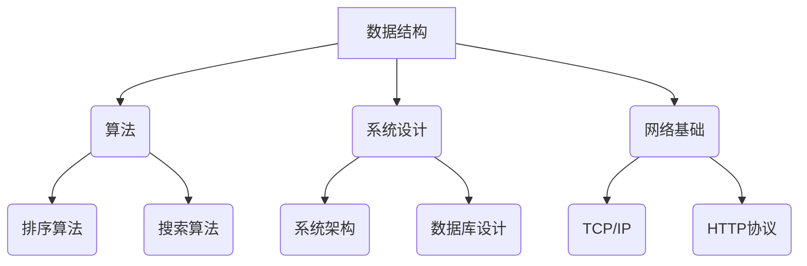

                 

腾讯作为中国领先的互联网公司之一，其社招技术面试一直以来都是技术求职者关注的焦点。本文旨在为2025年即将参加腾讯社招面试的技术人才提供一份集锦，涵盖可能的面试题目、解题思路和关键知识点。通过这篇集锦，希望求职者能够更好地准备面试，展示自己的技术实力。

## 关键词

- **腾讯社招**
- **技术面试题**
- **解题思路**
- **关键知识点**
- **面试准备**
- **技术人才**

## 摘要

本文汇集了2025年腾讯社招技术面试中可能出现的一些典型问题，包括但不限于编程算法、系统设计、数据结构与网络基础等领域。通过解析这些问题，提供了解题思路和关键知识点，旨在帮助读者更好地应对面试挑战，成功获得腾讯的录用机会。

## 1. 背景介绍

腾讯成立于1998年，如今已发展成为全球领先的互联网科技公司，业务涵盖了社交、媒体、娱乐、金融等多个领域。腾讯的社招面试，由于其严谨的筛选机制和广泛的专业覆盖，一直是广大技术人才向往的舞台。2025年的腾讯社招技术面试，将继续秉承高标准、严要求的原则，选拔出真正具备扎实技术基础和创新能力的人才。

## 2. 核心概念与联系

为了更好地理解和解答面试题目，以下将介绍几个核心概念，并使用Mermaid流程图展示其联系。

### 2.1 核心概念

- **数据结构**：包括数组、链表、栈、队列、树、图等。
- **算法**：如排序算法、搜索算法、动态规划、贪心算法等。
- **系统设计**：涉及系统架构、数据库设计、缓存策略、分布式系统等。
- **网络基础**：TCP/IP协议、HTTP协议、网络编程等。

### 2.2 Mermaid 流程图



## 3. 核心算法原理 & 具体操作步骤

### 3.1 算法原理概述

在面试中，算法题是重中之重。常见的算法题包括但不限于：排序算法（冒泡排序、选择排序、插入排序、快速排序等），搜索算法（二分查找、广度优先搜索、深度优先搜索等），以及动态规划、贪心算法等。

### 3.2 算法步骤详解

以排序算法中的快速排序为例，其基本步骤如下：

1. 选择一个基准元素。
2. 将比基准值小的元素放在基准元素的左侧，比其大的放在右侧。
3. 对左侧和右侧的子序列重复步骤1和2。

### 3.3 算法优缺点

快速排序的优点在于其平均时间复杂度为 \(O(n\log n)\)，在大多数情况下效率较高。然而，最坏情况下的时间复杂度可能达到 \(O(n^2)\)，这是其主要缺点。

### 3.4 算法应用领域

快速排序广泛应用于各种场景，如数组排序、查找算法中的辅助排序等。

## 4. 数学模型和公式 & 详细讲解 & 举例说明

数学模型和公式在面试中同样重要，以下以动态规划中的一个经典问题——最长公共子序列（LCS）为例进行讲解。

### 4.1 数学模型构建

LCS的数学模型可以用一个二维数组 `dp` 表示，其中 `dp[i][j]` 表示文本1的前 `i` 个字符和文本2的前 `j` 个字符的最长公共子序列长度。

### 4.2 公式推导过程

当文本1的第 `i` 个字符与文本2的第 `j` 个字符相同时，`dp[i][j] = dp[i-1][j-1] + 1`。否则，`dp[i][j] = max(dp[i-1][j], dp[i][j-1])`。

### 4.3 案例分析与讲解

假设文本1为 `ABCD`，文本2为 `ACDF`。构建的 `dp` 数组如下：

|   | A | C | D | F |
|---|---|---|---|---|
| A | 0 | 0 | 0 | 0 |
| B | 0 | 0 | 0 | 0 |
| C | 0 | 1 | 1 | 1 |
| D | 0 | 1 | 2 | 2 |
| E | 0 | 1 | 2 | 2 |

最长公共子序列为 `ACD`，长度为2。

## 5. 项目实践：代码实例和详细解释说明

### 5.1 开发环境搭建

假设使用Python进行开发，需要安装Python环境以及相关的库（如Pandas、NumPy等）。

### 5.2 源代码详细实现

以下是一个简单的快速排序的实现：

```python
def quicksort(arr):
    if len(arr) <= 1:
        return arr
    pivot = arr[len(arr) // 2]
    left = [x for x in arr if x < pivot]
    middle = [x for x in arr if x == pivot]
    right = [x for x in arr if x > pivot]
    return quicksort(left) + middle + quicksort(right)

print(quicksort([3,6,8,10,1,2,1]))
```

### 5.3 代码解读与分析

这段代码实现了快速排序算法。首先，判断数组长度是否小于等于1，如果是，则直接返回数组。否则，选择中间的元素作为基准值，将数组划分为小于、等于和大于基准值的三个子数组，然后对这三个子数组递归调用快速排序函数。

### 5.4 运行结果展示

运行结果为 `[1, 1, 2, 3, 6, 8, 10]`，这是升序排列后的数组。

## 6. 实际应用场景

腾讯的技术面试题目往往与实际工作场景紧密相关。例如，系统设计题可能会涉及到微信、QQ等产品的核心架构，算法题可能会考察数据分析或推荐系统中的经典问题。掌握这些实际应用场景，对于面试来说至关重要。

### 6.1 社交产品系统设计

在社交产品系统设计中，常见的面试题包括消息队列设计、用户增长策略、数据一致性保障等。

### 6.2 推荐系统算法

推荐系统算法是互联网公司广泛应用的领域，面试中可能会考察协同过滤、基于内容的推荐等算法原理。

### 6.3 大数据平台架构

随着大数据时代的到来，腾讯等公司对大数据平台的需求日益增加，相关的面试题包括Hadoop、Spark等大数据处理框架的应用和优化。

## 7. 未来应用展望

随着技术的不断发展，未来的应用场景将更加多样化。例如，人工智能、区块链、物联网等技术的应用，将为面试带来新的挑战和机遇。技术人才需要不断学习新知识，提升自身能力，才能在未来的竞争中脱颖而出。

### 7.1 人工智能

人工智能技术在腾讯的应用日益广泛，面试中可能会考察深度学习、自然语言处理等领域的知识。

### 7.2 区块链

区块链技术作为新兴领域，其在金融、物流等行业的应用前景广阔，相关的面试题可能涉及智能合约、共识算法等。

### 7.3 物联网

物联网技术正逐步渗透到人们的生活中，面试中可能会考察物联网架构设计、数据传输优化等问题。

## 8. 工具和资源推荐

为了更好地准备腾讯社招技术面试，以下是一些推荐的工具和资源：

### 8.1 学习资源推荐

- 《算法导论》（Introduction to Algorithms）
- 《深入理解计算机系统》（Deep Dive into Systems）
- 《大数据技术基础》（Basic Big Data Technology）

### 8.2 开发工具推荐

- Python、Java、C++等编程语言
- Git版本控制工具
- MySQL、MongoDB等数据库

### 8.3 相关论文推荐

- 《分布式系统原理与范型》（Principles of Distributed Systems）
- 《分布式存储系统：一致性、性能与可用性》（Distributed Storage Systems: Consistency, Performance, and Availability）
- 《深度学习》（Deep Learning）

## 9. 总结：未来发展趋势与挑战

### 9.1 研究成果总结

腾讯在互联网领域积累了丰富的技术成果，涵盖了从社交、娱乐到金融、物联网等多个领域。未来，腾讯将继续在这些领域深入探索，推动技术创新。

### 9.2 未来发展趋势

随着5G、人工智能等新技术的不断发展，互联网行业将迎来新的发展机遇。腾讯等科技巨头将继续引领技术潮流，推动行业变革。

### 9.3 面临的挑战

尽管前景广阔，但互联网行业也面临着诸多挑战，如网络安全、数据隐私、技术伦理等。技术人才需要具备全面的素质和高度的职业道德，才能应对这些挑战。

### 9.4 研究展望

未来，随着新技术的不断涌现，互联网行业将继续保持高速发展。技术人才需要不断学习，紧跟时代步伐，才能在未来的竞争中立于不败之地。

## 10. 附录：常见问题与解答

### 10.1 如何应对算法题？

- **掌握常见算法和数据结构**：如排序算法、搜索算法、动态规划等。
- **练习**：通过刷题网站（如LeetCode、牛客网等）进行大量练习。
- **总结**：总结常见算法题型的解题思路和解题模板。

### 10.2 如何应对系统设计题？

- **了解常见系统架构**：如分布式系统、微服务架构等。
- **分析需求**：明确系统需求，包括性能、可靠性、可扩展性等。
- **设计方案**：根据需求设计系统架构，包括模块划分、数据库设计、缓存策略等。

### 10.3 如何准备腾讯社招面试？

- **全面了解腾讯**：研究腾讯的产品、技术方向、企业文化等。
- **充分准备**：针对面试中可能出现的各种题型，提前准备。
- **展现自我**：在面试中展现自己的技术实力、团队合作能力和沟通能力。

---

通过本文的集锦，希望求职者能够更好地准备腾讯社招技术面试，把握住这次难得的机遇。祝愿大家面试成功，加入腾讯这个大家庭！最后，感谢读者对本文的关注，期待与大家共同探讨更多技术话题。作者：禅与计算机程序设计艺术 / Zen and the Art of Computer Programming。

