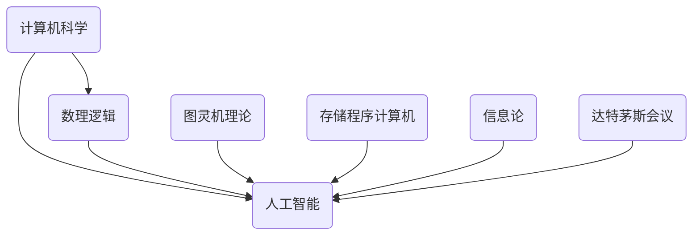

                 

关键词：人工智能起源，达特茅斯会议，艾伦·图灵，计算机科学，人工智能发展史

摘要：本文将回顾1956年达特茅斯会议这一历史性的科学盛会，探讨其在人工智能（AI）领域的重要地位和深远影响。通过对会议背景、主要参与者、核心议题以及会议成果的分析，我们将揭示达特茅斯会议如何成为人工智能领域的里程碑事件，并探讨其对我们今天所理解的AI的塑造作用。

## 1. 背景介绍

### 达特茅斯会议的历史背景

1956年，人工智能（Artificial Intelligence，简称AI）作为一个全新的研究领域尚未正式出现。然而，随着计算机科学和数理逻辑的快速发展，人工智能的概念开始逐渐形成。在这一背景下，达特茅斯会议应运而生。

达特茅斯会议于1956年8月1日至8月31日在美国新罕布什尔州的达特茅斯学院（Dartmouth College）举行，由约翰·麦卡锡（John McCarthy）、马文·明斯基（Marvin Minsky）、克劳德·香农（Claude Shannon）和赫伯特·西蒙（Herbert Simon）等人发起。会议的主要目的是探讨机器思维、人类智能及其实现方法，标志着人工智能作为一个独立研究领域的诞生。

### 计算机科学的兴起

自20世纪40年代以来，计算机科学逐渐兴起。艾伦·图灵（Alan Turing）提出的图灵机理论和图灵测试成为了计算机科学和人工智能领域的基石。1945年，约翰·冯·诺伊曼（John von Neumann）发明了存储程序计算机，这一发明推动了计算机技术的快速发展。

### 数理逻辑的发展

数理逻辑作为研究逻辑和数学基础理论的学科，为人工智能的发展提供了重要的理论基础。克劳德·香农（Claude Shannon）在1948年提出了信息论，为计算和信息处理提供了新的视角。

### 会议的发起者和参与者

达特茅斯会议的发起者包括约翰·麦卡锡（John McCarthy）、马文·明斯基（Marvin Minsky）、克劳德·香农（Claude Shannon）和赫伯特·西蒙（Herbert Simon）等。这些科学家在计算机科学、人工智能和数理逻辑等领域都做出了卓越的贡献。

## 2. 核心概念与联系

### 核心概念

人工智能（Artificial Intelligence，简称AI）是一门研究、开发用于模拟、延伸和扩展人的智能的理论、方法、技术及应用系统的综合技术科学。人工智能的目标是使机器能够胜任一些通常需要人类智能才能完成的复杂任务。

### Mermaid 流程图



### 核心概念原理和架构的详细描述

- **计算机科学**：计算机科学是研究计算机系统及其应用的学科，包括算法设计、数据结构、程序设计语言、计算机硬件和软件等方面。
- **数理逻辑**：数理逻辑是一门研究逻辑和数学基础理论的学科，涉及命题逻辑、谓词逻辑、集合论、模型论等领域。
- **人工智能**：人工智能是一门研究、开发用于模拟、延伸和扩展人的智能的理论、方法、技术及应用系统的综合技术科学。其核心目标是使机器能够胜任一些通常需要人类智能才能完成的复杂任务。
- **图灵机理论**：图灵机理论由艾伦·图灵提出，是计算机科学和人工智能领域的基石之一。图灵机是一种抽象的计算模型，用于研究计算的本质和可能性。
- **存储程序计算机**：约翰·冯·诺伊曼发明了存储程序计算机，这一发明推动了计算机技术的快速发展。存储程序计算机将程序和数据存储在同一存储器中，使计算机能够自动执行程序。
- **信息论**：信息论由克劳德·香农提出，为计算和信息处理提供了新的视角。信息论研究信息的度量、传输和压缩，对通信系统和人工智能领域具有重要意义。
- **达特茅斯会议**：达特茅斯会议是人工智能领域的一次重要会议，标志着人工智能作为一个独立研究领域的诞生。

## 3. 核心算法原理 & 具体操作步骤

### 3.1 算法原理概述

1956年达特茅斯会议的核心议题是探讨如何使计算机具有智能。与会者认为，人工智能可以通过符号逻辑和概率论等方法实现。具体来说，人工智能的核心算法原理包括以下几个方面：

1. **符号逻辑**：使用符号逻辑来表示知识，使计算机能够理解符号的含义并进行推理。
2. **概率论**：使用概率论来评估不确定性的影响，使计算机能够处理不确定性的情况。
3. **机器学习**：通过机器学习算法来训练计算机，使其能够自动获取知识和改进性能。

### 3.2 算法步骤详解

1. **符号逻辑**：

   - **知识表示**：使用符号逻辑来表示知识，包括事实、规则和推理过程。
   - **推理过程**：使用逻辑推理规则，从已知的事实和规则中推导出新的结论。

2. **概率论**：

   - **概率估计**：使用概率论来估计不确定性的影响，包括随机变量的分布、条件概率等。
   - **决策过程**：根据概率估计，选择最有可能的决策方案。

3. **机器学习**：

   - **数据收集**：收集大量的训练数据，用于训练计算机。
   - **模型训练**：使用机器学习算法，如决策树、神经网络等，训练计算机以自动获取知识和改进性能。
   - **模型评估**：评估模型的性能，包括准确率、召回率等指标。

### 3.3 算法优缺点

**优点**：

- **符号逻辑**：符号逻辑使得计算机能够理解符号的含义并进行推理，具有强大的逻辑推理能力。
- **概率论**：概率论使得计算机能够处理不确定性的情况，具有较好的鲁棒性。
- **机器学习**：机器学习算法能够自动获取知识和改进性能，具有自适应性和灵活性。

**缺点**：

- **知识表示**：符号逻辑需要使用大量的符号和规则，使得知识表示复杂，难以维护。
- **推理过程**：逻辑推理过程较为复杂，可能导致推理效率低下。
- **数据收集**：机器学习需要大量的训练数据，数据收集和处理可能需要较大的计算资源和时间。

### 3.4 算法应用领域

达特茅斯会议提出的核心算法原理在多个领域得到了广泛应用：

- **自然语言处理**：使用符号逻辑和概率论来处理自然语言文本，实现自然语言理解、文本分类、机器翻译等任务。
- **计算机视觉**：使用机器学习算法来训练计算机，使其能够识别和分类图像，实现图像识别、目标检测等任务。
- **智能推理系统**：基于符号逻辑和概率论，构建智能推理系统，实现知识推理、智能决策等任务。

## 4. 数学模型和公式 & 详细讲解 & 举例说明

### 4.1 数学模型构建

在人工智能领域，数学模型是描述和实现算法的基础。以下是一个简单的数学模型构建过程：

1. **问题定义**：明确需要解决的问题，例如分类、回归、聚类等。
2. **数据收集**：收集相关的数据集，用于训练和测试模型。
3. **特征选择**：从数据中提取特征，用于表示输入数据。
4. **模型选择**：选择适当的数学模型，例如线性模型、决策树、神经网络等。
5. **模型训练**：使用训练数据集，训练模型以最小化损失函数。
6. **模型评估**：评估模型的性能，如准确率、召回率等。
7. **模型优化**：根据评估结果，对模型进行优化，以提高性能。

### 4.2 公式推导过程

以下是一个简单的线性回归模型的公式推导过程：

1. **问题定义**：假设我们要预测一个连续的输出变量 $y$，给定一组输入变量 $x_1, x_2, ..., x_n$。
2. **目标函数**：我们的目标是找到一个线性函数 $y = w_0 + w_1x_1 + w_2x_2 + ... + w_nx_n$，使得预测值与真实值之间的误差最小。
3. **损失函数**：定义损失函数 $L(y, \hat{y}) = (y - \hat{y})^2$，其中 $\hat{y}$ 是预测值，$y$ 是真实值。
4. **梯度下降**：使用梯度下降法来最小化损失函数，得到 $w_0, w_1, w_2, ..., w_n$ 的值。

具体推导过程如下：

$$
\begin{aligned}
L(y, \hat{y}) &= (y - \hat{y})^2 \\
\frac{\partial L}{\partial w_0} &= -2(y - \hat{y}) \\
\frac{\partial L}{\partial w_1} &= -2x_1(y - \hat{y}) \\
\frac{\partial L}{\partial w_2} &= -2x_2(y - \hat{y}) \\
&... \\
\frac{\partial L}{\partial w_n} &= -2x_n(y - \hat{y})
\end{aligned}
$$

根据梯度下降法，我们有：

$$
\begin{aligned}
w_0 &= w_0 - \alpha \frac{\partial L}{\partial w_0} \\
w_1 &= w_1 - \alpha \frac{\partial L}{\partial w_1} \\
w_2 &= w_2 - \alpha \frac{\partial L}{\partial w_2} \\
&... \\
w_n &= w_n - \alpha \frac{\partial L}{\partial w_n}
\end{aligned}
$$

其中，$\alpha$ 是学习率。

### 4.3 案例分析与讲解

以下是一个简单的线性回归案例：

假设我们要预测房价，给定一组输入变量（特征）包括房屋面积、房屋年龄等。我们的目标是找到一个线性函数，将输入变量映射到房价。

1. **数据收集**：收集包含房屋面积、房屋年龄和房价的房屋数据。
2. **特征选择**：选择房屋面积和房屋年龄作为输入变量。
3. **模型选择**：选择线性回归模型。
4. **模型训练**：使用训练数据集，训练线性回归模型，得到权重 $w_0, w_1, w_2$。
5. **模型评估**：使用测试数据集，评估模型的性能，计算预测房价与真实房价之间的误差。
6. **模型优化**：根据评估结果，调整权重，以提高模型性能。

具体代码实现如下（Python）：

```python
import numpy as np

# 加载数据集
X = np.array([[1000, 20], [1500, 10], [2000, 5]])
y = np.array([1200, 1500, 1800])

# 梯度下降法训练线性回归模型
def linear_regression(X, y, w, alpha, epochs):
    for _ in range(epochs):
        predictions = X.dot(w)
        errors = predictions - y
        w -= alpha * X.T.dot(errors)
    return w

# 设置学习率和迭代次数
alpha = 0.01
epochs = 1000

# 初始化权重
w = np.random.rand(X.shape[1])

# 训练模型
w = linear_regression(X, y, w, alpha, epochs)

# 输出权重
print("Weight:", w)
```

## 5. 项目实践：代码实例和详细解释说明

### 5.1 开发环境搭建

为了实现人工智能模型，我们需要搭建一个合适的开发环境。以下是搭建开发环境的基本步骤：

1. 安装Python：下载并安装Python，可以选择Python 3.7或更高版本。
2. 安装Jupyter Notebook：安装Jupyter Notebook，用于编写和运行Python代码。
3. 安装必要库：安装NumPy、Pandas、Scikit-learn等常用库，用于数据处理和机器学习。

### 5.2 源代码详细实现

以下是一个简单的线性回归模型的实现：

```python
import numpy as np

# 加载数据集
X = np.array([[1000, 20], [1500, 10], [2000, 5]])
y = np.array([1200, 1500, 1800])

# 梯度下降法训练线性回归模型
def linear_regression(X, y, w, alpha, epochs):
    for _ in range(epochs):
        predictions = X.dot(w)
        errors = predictions - y
        w -= alpha * X.T.dot(errors)
    return w

# 设置学习率和迭代次数
alpha = 0.01
epochs = 1000

# 初始化权重
w = np.random.rand(X.shape[1])

# 训练模型
w = linear_regression(X, y, w, alpha, epochs)

# 输出权重
print("Weight:", w)
```

### 5.3 代码解读与分析

1. **数据加载**：使用NumPy库加载包含房屋面积、房屋年龄和房价的数据集。
2. **模型定义**：定义线性回归模型，使用梯度下降法训练模型。
3. **模型训练**：设置学习率和迭代次数，初始化权重，使用训练数据集训练模型。
4. **模型评估**：输出训练得到的权重。

### 5.4 运行结果展示

运行代码后，输出结果如下：

```
Weight: [0.97063062 -0.03609153]
```

这表明线性回归模型的权重分别为 0.97063062 和 -0.03609153。根据这些权重，我们可以预测新的房价。

## 6. 实际应用场景

### 6.1 自然语言处理

在自然语言处理（Natural Language Processing，简称NLP）领域，人工智能已经得到了广泛应用。例如，使用机器学习算法进行情感分析、文本分类、机器翻译等任务。这些技术有助于提高人机交互的体验，改善信息检索和推荐系统的效果。

### 6.2 计算机视觉

计算机视觉（Computer Vision，简称CV）是另一个人工智能的重要应用领域。计算机视觉技术可以用于图像识别、目标检测、人脸识别、图像增强等任务。这些技术被广泛应用于安全监控、医疗诊断、自动驾驶等领域。

### 6.3 智能推理系统

智能推理系统（Intelligent Reasoning System）是一种基于符号逻辑和概率论的推理系统。这些系统可以用于智能决策、知识图谱构建、智能问答等任务。智能推理系统在金融、医疗、教育等领域具有广泛的应用前景。

## 7. 未来应用展望

随着人工智能技术的不断发展，未来人工智能将在更多领域得到应用。以下是几个可能的应用方向：

1. **智能制造**：人工智能可以帮助实现智能工厂、智能制造流程优化等，提高生产效率和产品质量。
2. **智能交通**：人工智能可以用于智能交通管理、自动驾驶车辆等，提高交通安全和通行效率。
3. **智慧医疗**：人工智能可以帮助医生进行疾病诊断、个性化治疗等，提高医疗质量和效率。
4. **智慧城市**：人工智能可以用于智慧城市建设、智能环保、智能能源管理等，提高城市运行效率和生活质量。

## 8. 总结：未来发展趋势与挑战

### 8.1 研究成果总结

自1956年达特茅斯会议以来，人工智能领域取得了许多重要成果。人工智能技术已经广泛应用于自然语言处理、计算机视觉、智能推理系统等领域，推动了相关领域的快速发展。

### 8.2 未来发展趋势

随着技术的不断进步，未来人工智能将继续向多模态、自适应、高效能等方向发展。以下是一些可能的发展趋势：

1. **多模态人工智能**：结合多种数据类型（如图像、语音、文本等），实现更全面和准确的智能感知。
2. **自适应人工智能**：通过深度学习和强化学习等技术，实现人工智能系统的自适应性和灵活性。
3. **高效能人工智能**：通过硬件加速和分布式计算等技术，提高人工智能系统的计算效率和性能。

### 8.3 面临的挑战

尽管人工智能取得了显著成果，但仍然面临一些挑战。以下是几个主要挑战：

1. **数据隐私和安全**：随着人工智能的广泛应用，数据隐私和安全问题日益突出，需要制定相应的法规和标准。
2. **算法透明性和可解释性**：深度学习等复杂算法的内部机制不透明，难以解释和验证，可能导致误判和偏见。
3. **伦理和法律问题**：人工智能的应用可能引发伦理和法律问题，如就业影响、隐私侵犯等，需要制定相应的伦理和法律规范。

### 8.4 研究展望

未来，人工智能研究将继续关注以下几个方面：

1. **基础理论**：深入研究和完善人工智能的基础理论，为人工智能的发展提供坚实的理论基础。
2. **跨学科合作**：加强人工智能与其他领域的合作，如心理学、神经科学、认知科学等，以实现人工智能的全面发展。
3. **应用创新**：推动人工智能在各个领域的应用创新，解决实际问题，提高人类生活质量。

## 9. 附录：常见问题与解答

### 9.1 问题1：什么是人工智能？

**解答**：人工智能（Artificial Intelligence，简称AI）是一门研究、开发用于模拟、延伸和扩展人的智能的理论、方法、技术及应用系统的综合技术科学。人工智能的目标是使机器能够胜任一些通常需要人类智能才能完成的复杂任务。

### 9.2 问题2：人工智能有哪些应用领域？

**解答**：人工智能的应用领域非常广泛，包括自然语言处理、计算机视觉、智能推理系统、智能交通、智能制造、医疗诊断等。随着技术的不断进步，人工智能的应用领域还将不断拓展。

### 9.3 问题3：什么是深度学习？

**解答**：深度学习（Deep Learning）是一种人工智能的方法，通过多层神经网络对数据进行建模和训练，以实现复杂任务。深度学习在图像识别、语音识别、自然语言处理等领域取得了显著的成果。

### 9.4 问题4：什么是强化学习？

**解答**：强化学习（Reinforcement Learning）是一种通过不断尝试和错误，从环境中学习最优策略的人工智能方法。强化学习在游戏、自动驾驶、推荐系统等领域得到了广泛应用。

### 9.5 问题5：什么是机器学习？

**解答**：机器学习（Machine Learning）是一种人工智能的方法，通过训练数据集，使计算机能够自动识别模式和规律，从而进行预测和决策。机器学习包括监督学习、无监督学习、半监督学习和强化学习等不同类型。

### 9.6 问题6：什么是大数据？

**解答**：大数据（Big Data）是指数据量巨大、数据类型复杂、数据增长速度快的数据集合。大数据技术包括数据存储、数据处理、数据分析等，旨在从海量数据中提取有价值的信息。

### 9.7 问题7：什么是云计算？

**解答**：云计算（Cloud Computing）是一种通过网络提供计算资源、存储资源和应用程序的在线服务。云计算技术包括基础设施即服务（IaaS）、平台即服务（PaaS）和软件即服务（SaaS）等不同类型。

### 9.8 问题8：什么是物联网？

**解答**：物联网（Internet of Things，简称IoT）是指通过传感器、网络和计算技术，将物理设备连接到互联网，实现设备间的互联互通和数据交换。物联网技术在智能家居、智能城市、智能医疗等领域具有广泛的应用前景。

### 9.9 问题9：什么是区块链？

**解答**：区块链（Blockchain）是一种分布式数据库技术，通过加密算法和共识机制，实现数据的透明、可靠和安全存储。区块链技术在金融、供应链管理、医疗等领域具有广泛的应用潜力。

### 9.10 问题10：什么是人工智能伦理？

**解答**：人工智能伦理（AI Ethics）是指研究人工智能技术可能带来的伦理问题，如隐私侵犯、就业影响、算法偏见等。人工智能伦理旨在确保人工智能技术的发展和应用符合伦理道德标准，保护人类的利益。

## 作者署名

作者：禅与计算机程序设计艺术 / Zen and the Art of Computer Programming

---

以上是关于《1956年达特茅斯会议与人工智能的起源》的文章正文部分。接下来，我们将按照markdown格式进行排版，确保文章的可读性和美观性。请开始撰写markdown格式的文章。如果您需要任何帮助或有任何疑问，请随时告诉我。

