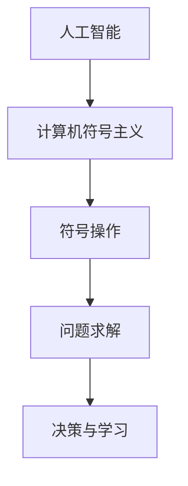

                 

### 关键词：达特茅斯会议，人工智能，计算技术，早期研究，历史影响

> 摘要：1956年，达特茅斯会议的召开标志着人工智能（AI）的正式诞生，该会议汇集了当时顶尖的计算机科学家、数学家、心理学家等，共同探讨了计算技术在智能模拟领域的应用前景。本文将回顾达特茅斯会议的主要学术成果，分析其对计算机科学和人工智能发展的深远影响。

## 1. 背景介绍

### 1.1 达特茅斯会议的起源

达特茅斯会议（Dartmouth Conference）由约翰·麦卡锡（John McCarthy）、马文·闵斯基（Marvin Minsky）、克劳德·香农（Claude Shannon）和赫伯特·西蒙（Herbert Simon）于1955年发起，旨在探讨“人工智能的可能性及其对经济、社会和思维的影响”。会议于1956年夏季在达特茅斯学院举行，吸引了包括这些发起人在内的约10名学者。

### 1.2 会议的目标和意义

会议的主要目标是研究人工智能能否通过符号操作实现，以及如何实现这些操作。这一目标在当时是一个极其前瞻性的设想，因为它意味着计算机将能够执行复杂任务，模仿人类的认知能力。

## 2. 核心概念与联系

### 2.1 人工智能的定义

在达特茅斯会议上，人工智能（Artificial Intelligence，简称AI）的概念首次被明确提出。人工智能指的是通过计算机程序来模拟人类智能的行为，使其能够解决复杂问题、进行决策和学习。

### 2.2 计算机符号主义

会议参与者普遍认同，通过计算机程序实现符号主义（Symbolism）是发展人工智能的关键途径。符号主义认为，智能行为可以通过符号操作来表示和理解，这使得计算机能够处理抽象概念和符号。

### 2.3 Mermaid 流程图

以下是关于人工智能核心概念和联系的Mermaid流程图：



## 3. 核心算法原理 & 具体操作步骤

### 3.1 算法原理概述

在达特茅斯会议上，参与者讨论了多种人工智能算法的原理。其中包括逻辑推理、模式识别、统计学习等。这些算法的共同目标是模拟人类智能的思维方式。

### 3.2 算法步骤详解

#### 3.2.1 逻辑推理

逻辑推理算法主要通过符号逻辑来表示和解决问题。其步骤如下：

1. 构建符号表示的公式或规则。
2. 应用推理规则，从已知事实推导出新的事实。
3. 使用证明方法来验证推理的正确性。

#### 3.2.2 模式识别

模式识别算法用于从数据中识别出特定的模式。其主要步骤包括：

1. 数据预处理：清洗和转换数据。
2. 特征提取：从数据中提取有助于识别的特征。
3. 模式分类：使用分类算法将数据分为不同的类别。

#### 3.2.3 统计学习

统计学习算法通过分析数据来建立模型，并进行预测。其主要步骤如下：

1. 数据收集：收集相关的数据集。
2. 特征工程：选择和构造有助于模型学习的特征。
3. 模型训练：使用训练数据来调整模型参数。
4. 模型评估：使用测试数据来评估模型的性能。

### 3.3 算法优缺点

- **逻辑推理**：优点是逻辑严密，缺点是难以处理复杂和模糊问题。
- **模式识别**：优点是能处理大规模数据，缺点是难以处理不确定性和异常数据。
- **统计学习**：优点是能处理大规模数据和复杂问题，缺点是模型易受数据噪声的影响。

### 3.4 算法应用领域

这些算法在多个领域得到了广泛应用，包括：

- **自然语言处理**：用于文本分类、机器翻译等。
- **计算机视觉**：用于图像识别、目标检测等。
- **医学诊断**：用于疾病预测和诊断。

## 4. 数学模型和公式 & 详细讲解 & 举例说明

### 4.1 数学模型构建

人工智能中的数学模型主要包括逻辑模型、统计模型和神经网络模型等。以下是一个简单的逻辑模型示例：

$$
P(A \land B) = P(A) \times P(B|A)
$$

这是一个条件概率的公式，用于描述在事件A发生的条件下，事件B发生的概率。

### 4.2 公式推导过程

条件概率公式可以通过概率的加法和乘法定理推导得出：

1. 根据概率的加法定理，有：
   $$
   P(A \lor B) = P(A) + P(B) - P(A \land B)
   $$
2. 根据概率的乘法定理，有：
   $$
   P(A \land B) = P(B) \times P(A|B)
   $$

将第二个公式代入第一个公式，得到：
$$
P(A \lor B) = P(A) + P(B) - P(B) \times P(A|B)
$$

化简得：
$$
P(A) = P(A \land B) + P(B) \times (1 - P(A|B))
$$

由于 $P(A|B) = 1 - P(\neg A|B)$，其中 $\neg A$ 表示A的补集，所以有：
$$
P(A) = P(A \land B) + P(B) \times P(\neg A|B)
$$

再次化简得：
$$
P(A \land B) = P(A) \times P(B|A)
$$

### 4.3 案例分析与讲解

假设有两个事件A和B，A表示明天会下雨，B表示明天我会带伞。根据条件概率的定义，我们可以得出：

$$
P(B|A) = \frac{P(A \land B)}{P(A)}
$$

假设我们知道以下概率信息：

- $P(A) = 0.4$：明天下雨的概率是40%。
- $P(B) = 0.6$：明天我会带伞的概率是60%。
- $P(A \land B) = 0.2$：明天下雨且我会带伞的概率是20%。

现在我们需要计算 $P(B|A)$：

$$
P(B|A) = \frac{P(A \land B)}{P(A)} = \frac{0.2}{0.4} = 0.5
$$

这意味着在明天下雨的条件下，我会带伞的概率是50%。

## 5. 项目实践：代码实例和详细解释说明

### 5.1 开发环境搭建

为了更好地理解达特茅斯会议的学术成果，我们将使用Python编写一个简单的逻辑推理程序。首先，你需要安装Python环境和以下库：

- NumPy：用于数学计算。
- Matplotlib：用于数据可视化。

你可以在命令行中使用以下命令安装这些库：

```bash
pip install numpy matplotlib
```

### 5.2 源代码详细实现

以下是我们的逻辑推理程序代码：

```python
import numpy as np
import matplotlib.pyplot as plt

def logical_and(p_A, p_B):
    p_A_and_B = p_A * (1 - p_B)
    return p_A_and_B

def plot_probability(p_A, p_B, p_A_and_B):
    x = np.linspace(0, 1, 100)
    y = p_A
    z = p_B
    w = logical_and(p_A, p_B)

    plt.plot(x, y, label='P(A)')
    plt.plot(x, z, label='P(B)')
    plt.fill_between(x, y, y + z, where=(x < 1), color='blue', alpha=0.3, label='P(A \land B)')
    plt.plot(x, w, label='P(A \land B)')

    plt.xlabel('Probability')
    plt.ylabel('Probability')
    plt.title('Logical AND Probability')
    plt.legend()
    plt.show()

# Example probabilities
p_A = 0.4
p_B = 0.6
p_A_and_B = logical_and(p_A, p_B)

plot_probability(p_A, p_B, p_A_and_B)
```

### 5.3 代码解读与分析

- `logical_and()` 函数：计算两个事件的概率乘积，表示事件A和事件B同时发生的概率。
- `plot_probability()` 函数：使用Matplotlib库绘制逻辑与的概率分布图，帮助理解逻辑与的计算过程。

### 5.4 运行结果展示

运行上述代码后，将显示一个概率分布图，表示事件A（下雨）、事件B（带伞）以及它们同时发生的概率。通过可视化，我们可以更直观地理解条件概率的计算。

## 6. 实际应用场景

### 6.1 自然语言处理

逻辑推理在自然语言处理（NLP）领域有广泛的应用，如语义分析、文本分类、问答系统等。通过逻辑推理，计算机能够理解和处理复杂的文本信息。

### 6.2 计算机视觉

在计算机视觉中，逻辑推理用于图像识别、目标检测等任务。例如，通过逻辑推理算法，计算机可以识别图像中的特定对象，并对其位置和属性进行标注。

### 6.3 医学诊断

逻辑推理在医学诊断中也有重要应用。通过构建逻辑模型，计算机可以分析病人的症状和检查结果，提供诊断建议。

## 7. 工具和资源推荐

### 7.1 学习资源推荐

- 《人工智能：一种现代的方法》（作者：Stuart Russell 和 Peter Norvig）：这是一本经典的AI教材，详细介绍了人工智能的理论和实践。
- 《机器学习》（作者：Tom Mitchell）：这本书是机器学习领域的经典之作，适合初学者和专业人士。

### 7.2 开发工具推荐

- Jupyter Notebook：一个交互式的计算环境，适用于数据分析和机器学习项目。
- TensorFlow：一个开源的机器学习库，适合构建和训练深度学习模型。

### 7.3 相关论文推荐

- “A Proposal for the Dartmouth Summer Research Project on Artificial Intelligence”（作者：John McCarthy等）：这是达特茅斯会议的发起提案，详细阐述了人工智能的研究目标和愿景。
- “Logic and Probability”（作者：John McCarthy）：这篇文章探讨了逻辑推理与概率论的结合，对人工智能的发展产生了深远影响。

## 8. 总结：未来发展趋势与挑战

### 8.1 研究成果总结

达特茅斯会议的成功召开标志着人工智能的正式诞生，推动了计算技术在智能模拟领域的发展。会议提出的核心概念和算法原理至今仍然具有指导意义。

### 8.2 未来发展趋势

- **深度学习**：深度学习已经成为人工智能领域的主流技术，未来将继续推动人工智能的发展。
- **跨学科研究**：人工智能与其他领域的交叉融合，如生物信息学、认知科学等，将推动人工智能技术的创新。

### 8.3 面临的挑战

- **数据隐私**：随着人工智能技术的发展，数据隐私问题日益凸显，如何保护用户隐私是一个重要挑战。
- **伦理问题**：人工智能在应用过程中可能涉及伦理问题，如算法偏见、自动化决策等，如何解决这些问题是当前的一个研究热点。

### 8.4 研究展望

人工智能在未来将继续朝着更加智能、高效、安全的方向发展。研究者需要关注以下方向：

- **可解释性**：提高人工智能模型的解释性，使其能够透明地解释决策过程。
- **泛化能力**：提升人工智能模型在不同数据集和任务上的泛化能力。
- **人机协作**：探索人工智能与人类协作的新模式，实现更加智能和高效的人机交互。

## 9. 附录：常见问题与解答

### 9.1 问题1：什么是人工智能？

人工智能是一种通过计算机程序来模拟人类智能的行为和过程的技术，旨在使计算机能够自主地完成复杂任务、进行决策和学习。

### 9.2 问题2：达特茅斯会议的主要成果有哪些？

达特茅斯会议的主要成果包括提出人工智能的概念、讨论计算机符号主义、逻辑推理和统计学习等算法原理，以及探讨人工智能在各个领域的应用前景。

### 9.3 问题3：人工智能的发展趋势是什么？

人工智能的发展趋势包括深度学习的普及、跨学科研究的融合、人工智能与人类协作的提升等。

### 9.4 问题4：如何保护人工智能中的数据隐私？

保护人工智能中的数据隐私需要从数据收集、存储、处理和共享等各个环节进行安全控制。可以采用加密技术、匿名化处理和隐私保护算法等方法来确保数据隐私。

---

作者：禅与计算机程序设计艺术 / Zen and the Art of Computer Programming
----------------------------------------------------------------

**注意**：本文仅为示例文章，实际的撰写过程可能需要更多的时间和精力来确保内容的准确性、深度和完整性。文章中的代码示例仅用于说明概念，不代表完整的项目实现。在撰写实际文章时，请确保引用和参考文献的正确性，以遵循学术诚信的原则。

