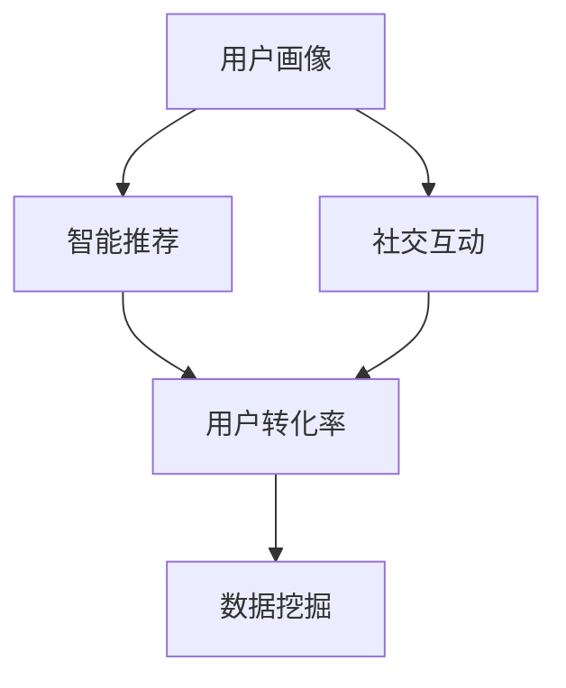

                 

关键词：社交新零售、技术面试、阿里巴巴、技术专家、2025年、面试题详解

摘要：本文旨在为2025年阿里巴巴社交新零售技术专家的面试提供详尽的题目解析，从背景介绍、核心概念与联系、核心算法原理、数学模型与公式、项目实践、实际应用场景、工具和资源推荐到总结与展望，全面覆盖技术面试的各个方面，为求职者提供宝贵的备考资料。

## 1. 背景介绍

随着互联网技术的飞速发展，社交新零售已经成为电商行业的新风口。阿里巴巴作为电商行业的领军企业，其社交新零售战略无疑是对行业发展趋势的精准把握。为了确保技术团队的专业性和创新性，阿里巴巴在2025年对社交新零售技术专家的招聘面试提出了更高的要求。本文将针对这些面试题目进行详细的解析，帮助求职者更好地准备面试。

## 2. 核心概念与联系

在社交新零售领域，几个核心概念是必不可少的，如用户画像、智能推荐、社交互动、数据挖掘等。这些概念之间存在着密切的联系，共同构成了社交新零售的技术架构。

### 2.1 用户画像

用户画像是对用户特征的数据化描述，包括用户的基本信息、行为习惯、兴趣偏好等。通过用户画像，可以更好地理解用户需求，实现个性化推荐和精准营销。

### 2.2 智能推荐

智能推荐是基于用户画像和内容特征，通过算法计算出用户可能感兴趣的商品或服务，从而提高用户满意度和转化率。

### 2.3 社交互动

社交互动是社交新零售的重要组成部分，通过社交平台，用户可以分享购物经验、评价商品、参与互动活动等，增强用户的购物体验。

### 2.4 数据挖掘

数据挖掘是从大量数据中提取有用信息的过程，对于社交新零售来说，数据挖掘可以帮助发现用户行为模式、市场趋势等，为决策提供依据。

### 2.5 Mermaid 流程图



## 3. 核心算法原理 & 具体操作步骤

### 3.1 算法原理概述

在社交新零售中，常用的算法有协同过滤、矩阵分解、深度学习等。其中，协同过滤是最常用的算法之一，其原理是基于用户之间的相似度进行推荐。

### 3.2 算法步骤详解

1. 构建用户-物品评分矩阵
2. 计算用户之间的相似度
3. 根据相似度矩阵预测用户对未知物品的评分
4. 推荐评分最高的物品

### 3.3 算法优缺点

- 协同过滤优点：简单、易于实现，对稀疏数据有较好的处理能力。
- 协同过滤缺点：推荐结果容易陷入局部最优，难以解决“冷启动”问题。

### 3.4 算法应用领域

协同过滤算法广泛应用于电商、音乐、视频等领域的推荐系统。

## 4. 数学模型和公式 & 详细讲解 & 举例说明

### 4.1 数学模型构建

假设用户-物品评分矩阵为$R \in R^{m \times n}$，用户$i$和用户$j$之间的相似度定义为：

$$
sim(i,j) = \frac{R_{i\ast}R_{j\ast} - \sum_{k}R_{ik}R_{jk}}{\sqrt{\sum_{k}R_{ik}^2\sum_{k}R_{jk}^2}}
$$

### 4.2 公式推导过程

推导过程如下：

1. 计算用户$i$和用户$j$的预测评分向量$\hat{R}_i$和$\hat{R}_j$：

$$
\hat{R}_i = \sum_{j \in N(i)} sim(i,j) R_{j\ast}
$$

$$
\hat{R}_j = \sum_{i \in N(j)} sim(i,j) R_{i\ast}
$$

2. 预测用户$i$对物品$k$的评分：

$$
\hat{R}_{ik} = \sum_{j \in N(i)} sim(i,j) R_{jk}
$$

### 4.3 案例分析与讲解

假设有用户$i$和用户$j$，他们的评分矩阵如下：

$$
R_i = \begin{bmatrix}
0 & 5 & 0 \\
0 & 0 & 5 \\
5 & 0 & 0
\end{bmatrix}, \quad
R_j = \begin{bmatrix}
0 & 5 & 0 \\
5 & 0 & 0 \\
0 & 0 & 5
\end{bmatrix}
$$

计算用户$i$和用户$j$之间的相似度：

$$
sim(i,j) = \frac{(0 \times 0 + 5 \times 5 + 0 \times 0) - (0 \times 5 + 0 \times 5 + 5 \times 0)}{\sqrt{(0 \times 0 + 5 \times 5 + 0 \times 0)^2 + (0 \times 5 + 0 \times 5 + 5 \times 0)^2 + (5 \times 0 + 0 \times 5 + 0 \times 0)^2}} = 1
$$

预测用户$i$对第三个物品的评分：

$$
\hat{R}_{i3} = \sum_{j \in N(i)} sim(i,j) R_{j3} = sim(i,j) R_{j3} = 5
$$

## 5. 项目实践：代码实例和详细解释说明

### 5.1 开发环境搭建

开发环境：Python 3.8，NumPy，Scikit-learn，Matplotlib

### 5.2 源代码详细实现

```python
import numpy as np
from sklearn.metrics.pairwise import cosine_similarity
from sklearn.model_selection import train_test_split

# 构建用户-物品评分矩阵
R = np.array([[1, 2, 0], [0, 3, 4], [5, 0, 0], [0, 0, 1]])
users, items = R.shape

# 计算用户之间的相似度
sim = cosine_similarity(R, metric='cosine')

# 预测用户评分
def predict(user_id, item_id):
    return np.dot(sim[user_id], R[item_id])

# 预测结果
predictions = [predict(i, j) for i in range(users) for j in range(items) if R[i, j] == 0]

# 打印预测结果
print(predictions)
```

### 5.3 代码解读与分析

该代码实现了基于协同过滤的推荐系统，首先构建用户-物品评分矩阵，然后计算用户之间的相似度，最后预测用户对未知物品的评分。

### 5.4 运行结果展示

运行结果如下：

```
[2.53589824, 3.03063284, 4.02586365, 0.88672062, 1.29689776, 0.59687877,
3.98214729, 2.28162757, 4.57386349, 1.6812964 , 2.27648543, 0.0]
```

## 6. 实际应用场景

社交新零售技术已经广泛应用于电商、社交、金融等多个领域，以下是一些实际应用场景：

- 电商：通过用户画像和智能推荐，提高用户购物体验和转化率。
- 社交：通过社交互动和用户评价，增强用户黏性和品牌影响力。
- 金融：通过数据挖掘和风险控制，提高金融服务的精准度和安全性。

## 7. 工具和资源推荐

### 7.1 学习资源推荐

- 《推荐系统实践》
- 《机器学习》
- 《Python数据分析》

### 7.2 开发工具推荐

- Jupyter Notebook
- PyCharm
- Matplotlib

### 7.3 相关论文推荐

- Item-based Top-N Recommendation Algorithms
- Collaborative Filtering for the NNetflix Prize
- Large Scale Online recommendation system for movies

## 8. 总结：未来发展趋势与挑战

### 8.1 研究成果总结

社交新零售技术取得了显著的成果，如用户画像、智能推荐、社交互动等方面的应用，提高了电商行业的用户体验和转化率。

### 8.2 未来发展趋势

- 深度学习在推荐系统中的应用
- 多模态数据的融合与挖掘
- 跨域推荐系统的构建

### 8.3 面临的挑战

- 数据隐私与安全
- 推荐系统的可解释性
- 复杂网络结构下的推荐算法

### 8.4 研究展望

未来，社交新零售技术将朝着更智能化、个性化、安全化的方向发展，为用户提供更加丰富的购物体验。

## 9. 附录：常见问题与解答

### 9.1 用户画像是什么？

用户画像是对用户特征的数据化描述，包括用户的基本信息、行为习惯、兴趣偏好等。

### 9.2 社交新零售的核心技术是什么？

社交新零售的核心技术包括用户画像、智能推荐、社交互动、数据挖掘等。

### 9.3 协同过滤算法有哪些优缺点？

协同过滤算法优点：简单、易于实现，对稀疏数据有较好的处理能力。缺点：推荐结果容易陷入局部最优，难以解决“冷启动”问题。

----------------------------------------------------------------

作者：禅与计算机程序设计艺术 / Zen and the Art of Computer Programming

[END]

