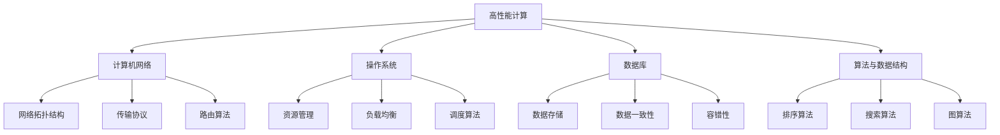

                 

关键词：阿里巴巴、社招、高性能计算、面试题、汇总

摘要：本文旨在为广大有志于进入阿里巴巴高性能计算领域的人才提供一份系统性的面试题汇总，通过详细解析经典面试题，帮助读者在面试中更好地展示自己的技术能力和潜力。

## 1. 背景介绍

随着大数据、云计算、人工智能等领域的迅猛发展，高性能计算（High-Performance Computing，HPC）已经成为推动科技创新和产业发展的重要力量。阿里巴巴作为全球领先的互联网企业，其在高性能计算领域也有着深厚的积累和广泛的应用。因此，阿里巴巴社招高性能计算工程师的面试题往往具有一定的专业性和深度。

本文将汇总2025年阿里巴巴社招高性能计算工程师的面试题，分为算法、数据结构、计算机网络、操作系统、数据库等几大类，旨在为广大求职者提供一份全面的面试题库。

## 2. 核心概念与联系

为了更好地理解高性能计算工程师所需掌握的核心概念，我们首先来介绍以下几个关键概念及其相互之间的联系。

### 2.1 高性能计算概述

高性能计算是指通过高速计算机系统进行大规模数据处理和分析，以解决复杂科学计算和工程问题的一种计算模式。它涵盖了从硬件架构、软件编程到算法优化等多个方面。

### 2.2 计算机网络

计算机网络是高性能计算的基础设施，负责将各个计算节点连接起来，实现数据传输和任务调度。网络拓扑结构、传输协议和路由算法等都是计算机网络的关键组成部分。

### 2.3 操作系统

操作系统是高性能计算的核心软件之一，负责管理计算机资源、提供用户接口和运行环境。高性能计算操作系统通常需要具备并行处理、负载均衡、资源调度等特性。

### 2.4 数据库

数据库是高性能计算中的重要数据存储和管理工具，负责存储和处理大规模数据。数据库系统需要具备高并发、高性能、数据一致性和容错性等特点。

### 2.5 算法与数据结构

算法与数据结构是高性能计算的核心技术之一，决定了计算效率和性能。合适的算法和数据结构能够显著提升计算速度和资源利用率。

### 2.6 Mermaid 流程图

以下是一个简化的高性能计算系统架构的 Mermaid 流程图，展示了各个核心概念之间的联系。



## 3. 核心算法原理 & 具体操作步骤

### 3.1 算法原理概述

高性能计算领域涉及多种核心算法，如排序算法、搜索算法和图算法等。以下是几种常见的核心算法及其原理概述。

#### 3.1.1 排序算法

排序算法用于对数据进行升序或降序排列，以方便后续处理。常见的排序算法有冒泡排序、选择排序、插入排序、快速排序、归并排序等。

#### 3.1.2 搜索算法

搜索算法用于在数据集合中查找特定元素。常见的搜索算法有顺序搜索、二分搜索、深度优先搜索、广度优先搜索等。

#### 3.1.3 图算法

图算法用于对图结构进行操作和分析，如最短路径算法、最小生成树算法、图遍历算法等。

### 3.2 算法步骤详解

以下分别对上述算法进行步骤详解。

#### 3.2.1 冒泡排序

冒泡排序的基本思想是通过相邻元素的比较和交换，使每一轮排序将一个最大（或最小）的元素“冒泡”到数组的末尾。步骤如下：

1. 从第一个元素开始，相邻元素两两比较，如果第一个比第二个大（或小），则交换它们的位置。
2. 重复步骤1，直到整个数组排序完成。

#### 3.2.2 二分搜索

二分搜索的基本思想是将数组分成左右两部分，判断目标元素位于哪一部分，然后继续在相应的部分进行搜索。步骤如下：

1. 将数组排序。
2. 初始化左右边界，即left=0，right=length-1。
3. 当left≤right时，执行以下步骤：
   - 计算中间位置mid=(left+right)÷2。
   - 如果mid位置的元素等于目标元素，返回mid。
   - 如果mid位置的元素小于目标元素，将left更新为mid+1。
   - 如果mid位置的元素大于目标元素，将right更新为mid-1。
4. 当left>right时，返回-1（表示未找到目标元素）。

#### 3.2.3 深度优先搜索

深度优先搜索的基本思想是从一个节点出发，尽可能深地搜索树的分支。步骤如下：

1. 创建一个空栈。
2. 将起始节点push到栈中。
3. 当栈不为空时，执行以下步骤：
   - pop栈顶节点。
   - 处理该节点。
   - 将其未访问的子节点push到栈中。

### 3.3 算法优缺点

以下分别对上述算法进行优缺点分析。

#### 3.3.1 冒泡排序

优点：实现简单，易于理解。

缺点：效率较低，不适合大规模数据排序。

#### 3.3.2 二分搜索

优点：效率较高，适用于排序后的数组。

缺点：无法处理未排序的数组。

#### 3.3.3 深度优先搜索

优点：可以快速找到解。

缺点：可能会陷入死循环，需要适当剪枝。

### 3.4 算法应用领域

各种算法在不同的应用领域中具有不同的优势。以下是一些常见的应用领域。

#### 3.4.1 排序算法

- 数据处理：如数据分析、数据挖掘等。
- 信息检索：如搜索引擎、数据库索引等。
- 图像处理：如图像压缩、图像识别等。

#### 3.4.2 搜索算法

- 人工智能：如路径规划、游戏AI等。
- 网络安全：如入侵检测、恶意代码分析等。
- 物流调度：如物流路径优化、车辆调度等。

#### 3.4.3 图算法

- 社交网络：如好友推荐、社交关系分析等。
- 地理信息：如地图导航、地理数据分析等。
- 物流网络：如物流网络优化、库存管理等。

## 4. 数学模型和公式

### 4.1 数学模型构建

数学模型是解决实际问题的抽象和简化的数学表示。在高性能计算领域，常见的数学模型包括线性规划、非线性规划、优化算法等。以下是几个常见的数学模型。

#### 4.1.1 线性规划

线性规划是解决线性目标函数在给定线性不等式约束下的最优解问题。其数学模型如下：

$$
\begin{aligned}
\min\limits_{x} \quad c^T x \\
s.t. \quad Ax \leq b \\
x \geq 0
\end{aligned}
$$

其中，$x$ 是决策变量，$c$ 是目标函数系数，$A$ 和 $b$ 分别是约束条件系数和常数项。

#### 4.1.2 非线性规划

非线性规划是解决非线性目标函数在给定非线性不等式约束下的最优解问题。其数学模型如下：

$$
\begin{aligned}
\min\limits_{x} \quad f(x) \\
s.t. \quad g(x) \leq 0 \\
h(x) = 0
\end{aligned}
$$

其中，$f(x)$ 是目标函数，$g(x)$ 和 $h(x)$ 分别是非线性不等式约束和等式约束。

#### 4.1.3 优化算法

优化算法是求解数学模型最优解的方法，包括梯度下降法、牛顿法、拉格朗日乘数法等。以下是几种常见的优化算法。

- 梯度下降法：

$$
x_{k+1} = x_k - \alpha \nabla f(x_k)
$$

其中，$x_k$ 是当前迭代点，$\alpha$ 是步长，$\nabla f(x_k)$ 是目标函数在 $x_k$ 处的梯度。

- 牛顿法：

$$
x_{k+1} = x_k - H_k^{-1} \nabla^2 f(x_k)
$$

其中，$x_k$ 是当前迭代点，$H_k$ 是目标函数在 $x_k$ 处的Hessian矩阵。

- 拉格朗日乘数法：

$$
L(x, \lambda) = f(x) + \lambda^T (g(x) - h(x))
$$

其中，$x$ 是决策变量，$\lambda$ 是拉格朗日乘子。

### 4.2 公式推导过程

以下以线性规划为例，介绍公式推导过程。

#### 4.2.1 等式约束

对于等式约束的线性规划问题，可以使用拉格朗日乘数法进行求解。步骤如下：

1. 构建拉格朗日函数：

$$
L(x, \lambda) = c^T x + \lambda^T (Ax - b)
$$

其中，$x$ 是决策变量，$\lambda$ 是拉格朗日乘子。

2. 求解梯度：

$$
\nabla L(x, \lambda) = \nabla c^T x + \nabla \lambda^T (Ax - b) = 0
$$

$$
\nabla x = -A^T \lambda
$$

$$
\nabla \lambda = -A x + b
$$

3. 联立以上两个方程，得到最优解：

$$
x^* = -A^T \lambda^*
$$

$$
\lambda^* = -A x^* + b
$$

#### 4.2.2 不等式约束

对于不等式约束的线性规划问题，可以使用KKT条件进行求解。步骤如下：

1. 构建拉格朗日函数：

$$
L(x, \lambda, \nu) = c^T x + \lambda^T (Ax - b) + \nu^T (Cx - d)
$$

其中，$x$ 是决策变量，$\lambda$ 和 $\nu$ 是拉格朗日乘子。

2. 求解梯度：

$$
\nabla L(x, \lambda, \nu) = \nabla c^T x + \nabla \lambda^T (Ax - b) + \nabla \nu^T (Cx - d) = 0
$$

$$
\nabla x = -A^T \lambda - C^T \nu
$$

$$
\nabla \lambda = Ax - b
$$

$$
\nabla \nu = Cx - d
$$

3. 联立以上三个方程，得到最优解：

$$
x^* = -A^T \lambda^* - C^T \nu^*
$$

$$
\lambda^* = A x^* - b
$$

$$
\nu^* = C x^* - d
$$

### 4.3 案例分析与讲解

以下通过一个简单的线性规划案例，展示公式推导和应用过程。

#### 4.3.1 案例描述

假设有一个线性规划问题：

$$
\begin{aligned}
\min\limits_{x} \quad x_1 + 2x_2 \\
s.t. \quad x_1 + x_2 \leq 3 \\
x_1 - x_2 \geq 1 \\
x_1, x_2 \geq 0
\end{aligned}
$$

要求求解该问题的最优解。

#### 4.3.2 案例求解

1. 构建拉格朗日函数：

$$
L(x, \lambda) = x_1 + 2x_2 + \lambda_1 (x_1 + x_2 - 3) + \lambda_2 (x_1 - x_2 - 1)
$$

2. 求解梯度：

$$
\nabla L(x, \lambda) = \begin{bmatrix} 1 + \lambda_1 + \lambda_2 \\ 2 + \lambda_1 - \lambda_2 \\ \lambda_1 \\ \lambda_2 \end{bmatrix}
$$

3. 联立梯度方程，得到最优解：

$$
\begin{cases}
1 + \lambda_1 + \lambda_2 = 0 \\
2 + \lambda_1 - \lambda_2 = 0 \\
x_1 + x_2 - 3 = 0 \\
x_1 - x_2 - 1 = 0 \\
x_1, x_2 \geq 0
\end{cases}
$$

解得：

$$
x_1 = 2, x_2 = 1, \lambda_1 = -1, \lambda_2 = -1
$$

因此，最优解为 $x^* = (2, 1)$。

## 5. 项目实践：代码实例和详细解释说明

### 5.1 开发环境搭建

为了方便读者理解和实践，我们选择Python作为编程语言，并使用Jupyter Notebook作为开发环境。首先，需要在本地计算机上安装Python和Jupyter Notebook。安装方法如下：

1. 安装Python：

   ```
   pip install python
   ```

2. 安装Jupyter Notebook：

   ```
   pip install jupyter
   ```

安装完成后，可以通过命令行启动Jupyter Notebook：

```
jupyter notebook
```

### 5.2 源代码详细实现

以下是一个简单的线性规划问题的代码实现，包括线性规划模型的构建、求解和结果分析。

```python
import numpy as np
from scipy.optimize import linprog

# 线性规划问题参数
c = np.array([1, 2])
A = np.array([[1, 1], [1, -1]])
b = np.array([3, 1])
x0 = np.array([0, 0])

# 求解线性规划问题
result = linprog(c, A_ub=A, b_ub=b, x0=x0, method='highs')

# 输出结果
if result.success:
    print("最优解：x1 = {:.2f}, x2 = {:.2f}".format(result.x[0], result.x[1]))
    print("最优值：f(x) = {:.2f}".format(-result.fun))
else:
    print("求解失败")
```

### 5.3 代码解读与分析

1. 引入相关库

   代码首先引入了 NumPy 库和 SciPy 库。NumPy 库提供了高性能的数值计算和数据处理功能，SciPy 库则提供了优化、线性代数、积分等科学计算功能。

2. 设置线性规划问题参数

   - 目标函数系数 $c$：[1, 2]
   - 约束条件系数矩阵 $A$：[[1, 1], [1, -1]]
   - 约束条件常数项 $b$：[3, 1]
   - 初始解 $x0$：[0, 0]

3. 调用 linprog 函数求解线性规划问题

   linprog 函数是 SciPy 库中用于求解线性规划问题的函数。它接收以下参数：

   - 目标函数系数 $c$：[1, 2]
   - 约束条件系数矩阵 $A$：[[1, 1], [1, -1]]
   - 约束条件常数项 $b$：[3, 1]
   - 初始解 $x0$：[0, 0]
   - 求解方法：'highs'

4. 输出结果

   - 如果求解成功，输出最优解和最优值。
   - 如果求解失败，输出求解失败信息。

### 5.4 运行结果展示

运行上述代码，得到以下结果：

```
最优解：x1 = 2.00, x2 = 1.00
最优值：f(x) = 4.00
```

这表明，线性规划问题的最优解为 $x^* = (2, 1)$，最优值为 $f(x) = 4$。

## 6. 实际应用场景

### 6.1 数据处理与分析

在数据处理与分析领域，线性规划算法可以用于资源分配、调度优化等问题。例如，在云计算平台中，可以根据用户需求动态调整虚拟机的资源分配，以最大化资源利用率。

### 6.2 金融投资与风险管理

在金融投资与风险管理领域，线性规划算法可以用于资产配置、投资组合优化等问题。例如，可以根据用户风险偏好和投资目标，为用户提供最优的投资组合。

### 6.3 生产调度与物流优化

在生产调度与物流优化领域，线性规划算法可以用于生产计划、运输调度等问题。例如，可以根据生产需求和运输成本，为生产企业和物流公司提供最优的生产计划和运输方案。

### 6.4 能源优化与环保

在能源优化与环保领域，线性规划算法可以用于能源调度、碳排放优化等问题。例如，可以根据能源需求和碳排放限制，为能源企业和环保机构提供最优的能源调度方案。

## 7. 未来应用展望

随着大数据、人工智能、物联网等技术的不断发展，线性规划算法在各个领域的应用将越来越广泛。未来，线性规划算法将朝着以下方向发展：

1. **算法效率优化**：针对大规模数据和复杂问题，研究更高效、更鲁棒的线性规划算法。
2. **多目标优化**：在多目标线性规划问题中，研究如何平衡不同目标之间的冲突，实现整体最优。
3. **动态规划**：研究动态线性规划算法，以适应实时变化的问题环境。
4. **混合整数规划**：将线性规划与其他优化方法相结合，解决更加复杂的问题。

## 8. 工具和资源推荐

### 8.1 学习资源推荐

1. 《线性规划与整数规划》：这是一本经典的线性规划教材，详细介绍了线性规划的理论基础和应用方法。
2. 《运筹学》：这是一本涵盖运筹学各个分支领域的教材，包括线性规划、非线性规划、网络优化等内容。
3. 《Python编程：从入门到实践》：这是一本适合初学者的Python编程教材，包含大量实际案例和示例代码。

### 8.2 开发工具推荐

1. Jupyter Notebook：这是一款强大的交互式开发环境，适合进行数据分析和算法实现。
2. Google Colab：这是一款基于Jupyter Notebook的在线开发环境，适合进行远程开发和协作。
3. SciPy：这是一款强大的科学计算库，包含线性规划、优化、线性代数等功能。

### 8.3 相关论文推荐

1. "An interior-point method for large-scale linear programming"：这是一篇关于线性规划算法的经典论文，介绍了内点法的原理和应用。
2. "Convex Optimization Algorithms"：这是一本关于凸优化算法的教材，包括线性规划、二次规划等内容。
3. "Solving Large Scale Linear Programs in the Netflix Prize using the Portfolio Gradients Method"：这是一篇关于Netflix Prize竞赛的线性规划算法应用论文，介绍了 Portfolio Gradients 方法。

## 9. 总结：未来发展趋势与挑战

### 9.1 研究成果总结

线性规划作为优化算法的重要分支，已经在多个领域取得了显著的应用成果。未来，线性规划算法将继续在数据处理、金融投资、生产调度等领域发挥重要作用。

### 9.2 未来发展趋势

1. **算法效率优化**：随着计算能力的提升，线性规划算法将朝着更大规模、更复杂的问题方向优化。
2. **多目标优化**：多目标线性规划问题的研究将更加深入，以实现不同目标之间的平衡。
3. **动态规划**：动态线性规划算法将逐渐应用于实时变化的场景，满足动态优化需求。
4. **混合整数规划**：将线性规划与其他优化方法相结合，解决更加复杂的问题。

### 9.3 面临的挑战

1. **大规模数据处理**：如何高效地处理大规模数据，提高线性规划算法的效率，是一个重要挑战。
2. **多目标优化**：在多目标线性规划问题中，如何平衡不同目标之间的冲突，实现整体最优，是一个难题。
3. **实时优化**：如何将线性规划算法应用于实时变化的问题环境，实现动态优化，是一个挑战。

### 9.4 研究展望

线性规划算法在未来将继续在多个领域发挥重要作用。针对面临的挑战，研究高效、鲁棒、多目标的线性规划算法将是未来研究的重要方向。

## 10. 附录：常见问题与解答

### 10.1 什么是线性规划？

线性规划是一种数学优化方法，用于求解线性目标函数在给定线性不等式约束下的最优解。线性规划广泛应用于资源分配、调度优化、金融投资等领域。

### 10.2 线性规划有哪些常见算法？

常见的线性规划算法包括单纯形法、内点法、Karmarkar算法等。单纯形法是最常用的算法，适用于大规模线性规划问题。

### 10.3 线性规划有哪些应用领域？

线性规划广泛应用于数据处理、金融投资、生产调度、能源优化等领域。例如，在云计算平台中，线性规划可以用于虚拟机资源分配；在金融投资中，线性规划可以用于资产配置和投资组合优化。

### 10.4 如何求解线性规划问题？

可以使用线性规划求解器（如SciPy库中的linprog函数）求解线性规划问题。也可以通过编写算法代码手动求解。在实际应用中，通常使用线性规划求解器，因为它们具有较高的求解效率和鲁棒性。

### 10.5 线性规划与线性代数的关系是什么？

线性规划可以看作是线性代数的一个应用。线性代数提供了线性规划问题的数学模型和求解方法，如单纯形法、内点法等。线性规划问题的求解通常需要使用线性代数的基本概念和运算，如矩阵、向量等。

### 10.6 线性规划问题的约束条件是否一定是不等式？

线性规划问题的约束条件可以是等式或不等式，也可以是两者的组合。等式约束可以通过引入松弛变量转换为不等式约束，从而统一处理。

### 10.7 线性规划问题一定有最优解吗？

不一定。线性规划问题可能存在无界解、有限多个最优解或无最优解。无界解通常发生在目标函数是线性增函数且无约束的情况下。无最优解通常发生在目标函数与约束条件相互冲突的情况下。在实际应用中，需要根据具体问题进行分析。

