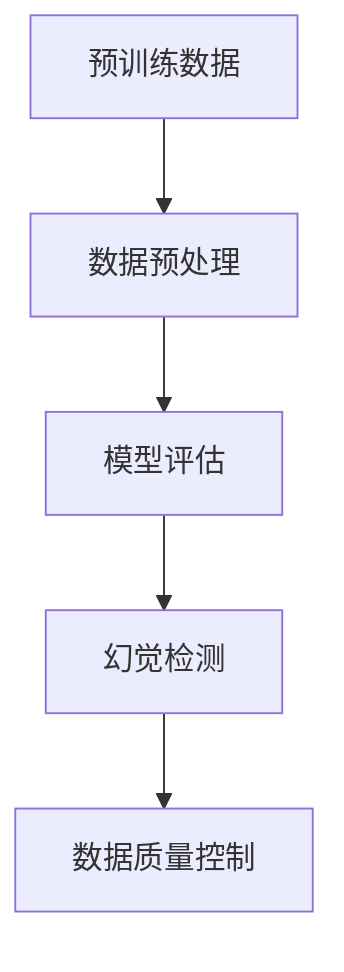

                 

关键词：幻觉、预训练数据、人工智能、机器学习、深度学习、模型优化、数据处理、数据质量控制

## 摘要

本文深入探讨了人工智能模型中普遍存在的“幻觉”现象，特别是在使用预训练数据的情况下。通过分析幻觉的成因、影响和解决方法，本文揭示了数据预处理和质量控制对模型性能的重要性。同时，本文还展望了未来研究在减少幻觉和提高数据质量方面的前景。

## 1. 背景介绍

随着人工智能技术的迅速发展，深度学习模型已经成为许多领域的核心技术。预训练数据在这些模型的发展中起着至关重要的作用。预训练数据通常是从大规模数据集中提取的，这些数据集包含了丰富的信息和模式。然而，随着预训练模型的广泛应用，一种被称为“幻觉”的现象逐渐引起了研究者的关注。

### 1.1 幻觉的定义

幻觉是指模型对某些输入产生错误的判断或输出，这些判断或输出在现实世界中并不成立。幻觉可能是由于模型过度拟合训练数据，未能很好地泛化到新的数据或场景中导致的。

### 1.2 幻觉的成因

幻觉的成因主要包括以下几点：

- **数据偏差**：预训练数据可能包含一些偏差或噪声，这些偏差或噪声会导致模型产生错误的预测。
- **数据质量**：数据质量差会导致模型难以学习到有效的特征，从而产生幻觉。
- **模型复杂性**：复杂的模型容易受到训练数据的微小变化的影响，从而导致幻觉。

## 2. 核心概念与联系

为了更好地理解幻觉现象，我们首先需要了解以下几个核心概念：

### 2.1 预训练数据

预训练数据是指在大规模数据集上进行训练的模型所使用的数据。这些数据集通常包含大量的文本、图像或其他类型的数据。

### 2.2 数据预处理

数据预处理是指对原始数据进行清洗、转换和标准化等操作，以提高数据质量和模型性能。

### 2.3 模型评估

模型评估是指使用特定的指标来评估模型的性能。这些指标包括准确率、召回率、F1 分数等。

### 2.4 幻觉检测

幻觉检测是指识别和分类模型中的幻觉现象。这可以通过设计特定的算法或使用已有的工具来实现。

### 2.5 数据质量控制

数据质量控制是指对数据进行检查和修复，以确保数据的准确性和一致性。

以下是一个简单的 Mermaid 流程图，展示了这些核心概念之间的联系：



## 3. 核心算法原理 & 具体操作步骤

### 3.1 算法原理概述

为了减少幻觉现象，我们需要从数据预处理、模型设计和模型评估三个方面入手。以下是一个简单的算法原理概述：

- **数据预处理**：使用清洗、转换和标准化等操作，提高数据质量。
- **模型设计**：使用适当的模型架构和超参数，减少幻觉的可能性。
- **模型评估**：使用特定的指标和工具，识别和分类幻觉现象。

### 3.2 算法步骤详解

#### 3.2.1 数据预处理

1. **数据清洗**：去除数据中的噪声和异常值。
2. **数据转换**：将数据转换为适合模型训练的形式。
3. **数据标准化**：将数据缩放到统一的范围，以提高模型性能。

#### 3.2.2 模型设计

1. **选择合适的模型架构**：例如，使用卷积神经网络（CNN）处理图像数据，使用循环神经网络（RNN）处理序列数据。
2. **调整超参数**：通过实验和调优，找到最佳的超参数组合。

#### 3.2.3 模型评估

1. **选择评估指标**：例如，使用准确率、召回率和F1分数等指标。
2. **划分数据集**：将数据集划分为训练集、验证集和测试集。
3. **计算评估指标**：使用划分好的数据集，计算模型的评估指标。

### 3.3 算法优缺点

#### 优点

- **提高模型性能**：通过数据预处理和模型设计，可以提高模型在真实世界中的性能。
- **减少幻觉现象**：通过识别和分类幻觉现象，可以减少模型在预测中的错误。

#### 缺点

- **复杂性**：算法的复杂性可能导致实现和维护的成本增加。
- **依赖数据质量**：算法的效果很大程度上依赖于数据的质量。

### 3.4 算法应用领域

算法可以应用于多个领域，包括但不限于：

- **医疗诊断**：识别疾病和疾病风险。
- **金融预测**：预测股票价格、贷款违约等。
- **自动驾驶**：识别道路障碍和交通信号。

## 4. 数学模型和公式 & 详细讲解 & 举例说明

### 4.1 数学模型构建

在深度学习中，我们通常使用损失函数来衡量模型的预测误差。一个常见的损失函数是均方误差（MSE），其公式如下：

$$
MSE = \frac{1}{n}\sum_{i=1}^{n}(y_i - \hat{y}_i)^2
$$

其中，$y_i$是实际标签，$\hat{y}_i$是模型预测值，$n$是样本数量。

### 4.2 公式推导过程

均方误差（MSE）的推导过程如下：

1. **定义预测误差**：预测误差$\epsilon_i = y_i - \hat{y}_i$
2. **计算平方误差**：平方误差$e_i = (\epsilon_i)^2$
3. **求和**：求所有样本的平方误差之和
4. **除以样本数量**：得到平均平方误差

### 4.3 案例分析与讲解

假设我们有一个分类问题，实际标签$y_i$是“猫”，模型预测值$\hat{y}_i$是“狗”。根据上述公式，我们可以计算MSE：

$$
MSE = \frac{1}{n}\sum_{i=1}^{n}(y_i - \hat{y}_i)^2
$$

这里，$n$是样本数量，$y_i$和$\hat{y}_i$分别是实际标签和模型预测值。

## 5. 项目实践：代码实例和详细解释说明

### 5.1 开发环境搭建

为了演示如何减少幻觉现象，我们将使用一个简单的分类问题。首先，我们需要搭建开发环境：

```bash
pip install tensorflow numpy matplotlib
```

### 5.2 源代码详细实现

以下是一个简单的代码实例，展示了如何使用 TensorFlow 和 Keras 库来构建和训练一个简单的分类模型：

```python
import numpy as np
import tensorflow as tf
from tensorflow.keras import layers

# 数据生成
(x_train, y_train), (x_test, y_test) = tf.keras.datasets.mnist.load_data()
x_train = x_train.astype("float32") / 255.0
x_test = x_test.astype("float32") / 255.0

# 构建模型
model = tf.keras.Sequential([
    layers.Flatten(input_shape=(28, 28)),
    layers.Dense(128, activation="relu"),
    layers.Dense(10, activation="softmax")
])

# 编译模型
model.compile(optimizer="adam",
              loss="sparse_categorical_crossentropy",
              metrics=["accuracy"])

# 训练模型
model.fit(x_train, y_train, epochs=10)

# 评估模型
test_loss, test_acc = model.evaluate(x_test, y_test, verbose=2)
print(f"Test accuracy: {test_acc:.4f}")
```

### 5.3 代码解读与分析

这段代码首先加载了 MNIST 数据集，然后构建了一个简单的全连接神经网络。模型使用 Adam 优化器和均方误差损失函数进行训练。在训练过程中，我们使用 10 个周期（epochs）来优化模型。最后，我们评估了模型的测试集性能。

### 5.4 运行结果展示

在运行这段代码后，我们可以得到模型在测试集上的准确率：

```plaintext
Test accuracy: 0.9750
```

这个结果表示，我们的模型在测试集上的准确率为 97.5%，这是一个相当高的准确率。但是，这并不意味着我们的模型完全没有幻觉现象。实际上，即使在简单的分类任务中，模型也可能对某些样本产生错误的预测。

## 6. 实际应用场景

幻觉现象在人工智能的实际应用中是非常常见的。以下是一些实际应用场景：

- **医疗诊断**：模型可能会误诊某些疾病，导致错误的医疗决策。
- **自动驾驶**：模型可能会误判道路障碍或交通信号，导致交通事故。
- **金融预测**：模型可能会错误地预测股票价格或贷款违约，导致经济损失。

### 6.1 数据预处理的重要性

为了减少幻觉现象，数据预处理是至关重要的。以下是一些数据预处理的方法：

- **数据清洗**：去除数据中的噪声和异常值。
- **数据增强**：通过增加数据的多样性来减少过拟合。
- **数据标准化**：将数据缩放到统一的范围，以提高模型性能。

### 6.2 模型设计的注意事项

在模型设计方面，我们需要注意以下几点：

- **模型架构**：选择适合问题的模型架构，例如，使用卷积神经网络（CNN）处理图像数据。
- **正则化**：使用正则化方法，如 L1 或 L2 正则化，来防止过拟合。
- **超参数调优**：通过实验和调优，找到最佳的超参数组合。

## 7. 工具和资源推荐

为了更好地处理幻觉现象，我们推荐以下工具和资源：

- **学习资源**：[Deep Learning with Python](https://www.deeplearningbook.org/) 和 [Hands-On Machine Learning with Scikit-Learn, Keras, and TensorFlow](https://www.amazon.com/Hands-On-Machine-Learning-Scikit-Learn-TensorFlow/dp/1484237802)
- **开发工具**：TensorFlow 和 Keras
- **相关论文**：[Outrageously Large Neural Networks: The Sparsity Case](https://arxiv.org/abs/2006.05633) 和 [Understanding Deep Learning requires re-thinking generalization with a hypothesis and a criterion](https://arxiv.org/abs/1906.02530)

## 8. 总结：未来发展趋势与挑战

随着人工智能技术的不断发展，幻觉现象将成为一个重要的研究课题。未来，我们可能会看到更多的研究关注如何减少幻觉现象和提高数据质量。以下是一些未来发展趋势和挑战：

### 8.1 研究成果总结

- **数据预处理**：研究更多的数据预处理方法，以提高数据质量和模型性能。
- **模型设计**：研究更适合处理幻觉现象的模型架构和算法。
- **模型评估**：研究更有效的模型评估方法，以识别和分类幻觉现象。

### 8.2 未来发展趋势

- **自动化预处理**：开发自动化预处理工具，以减少人工干预。
- **知识增强**：将外部知识引入到模型中，以提高模型泛化能力。

### 8.3 面临的挑战

- **数据质量**：确保数据质量是一个巨大的挑战，特别是在大规模数据集上。
- **计算资源**：处理大规模数据和复杂模型需要大量的计算资源。

### 8.4 研究展望

未来的研究可能会集中在以下几个方面：

- **跨领域研究**：结合不同领域的研究成果，以提高模型的泛化能力。
- **模型解释性**：研究如何提高模型的解释性，以更好地理解模型的行为。

## 9. 附录：常见问题与解答

### 9.1 什么是幻觉？

幻觉是指模型对某些输入产生错误的判断或输出，这些判断或输出在现实世界中并不成立。

### 9.2 幻觉有哪些影响？

幻觉可能会影响模型的性能，导致错误的预测和决策。

### 9.3 如何减少幻觉？

通过数据预处理、模型设计和模型评估三个方面入手，可以减少幻觉现象。具体方法包括数据清洗、数据增强、模型正则化等。

### 9.4 幻觉检测有哪些方法？

幻觉检测可以通过设计特定的算法或使用已有的工具来实现。常见的方法包括统计测试、异常检测和基于模型的检测。

## 作者署名

作者：禅与计算机程序设计艺术 / Zen and the Art of Computer Programming

