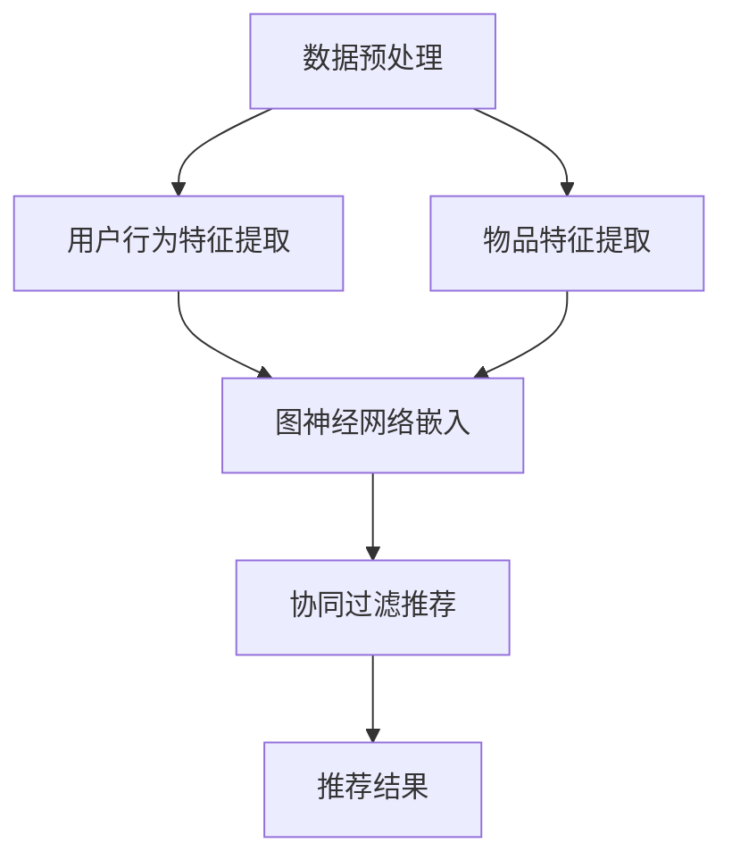

                 

 关键词：推荐系统、M6-Rec、机器学习、深度学习、开放域、框架、算法原理、数学模型、代码实例、应用场景、未来展望

> 摘要：本文将深入探讨开放域推荐系统的重要性及其在现代社会中的应用，详细介绍M6-Rec框架的设计理念、核心算法、数学模型及其实践应用。通过对M6-Rec框架的全面解析，希望能够为读者在推荐系统领域的研究和应用提供有价值的参考。

## 1. 背景介绍

### 开放域推荐系统的定义与重要性

开放域推荐系统是一种无需预先定义用户和物品关系，而是通过用户行为和内容特征来推断和推荐相关物品的推荐系统。与传统推荐系统相比，开放域推荐系统具有更高的灵活性和适用性，能够处理更加复杂和多变的推荐场景。

在互联网和移动互联网飞速发展的今天，开放域推荐系统已经成为了许多在线服务（如电子商务、社交媒体、视频平台等）的核心功能。其主要作用是提高用户的满意度、增强用户粘性、提升业务收入。因此，研究和开发高效的开放域推荐系统具有重要的现实意义。

### M6-Rec框架的产生背景

随着用户数据规模的不断扩大和计算能力的提升，传统推荐系统在应对开放域推荐任务时面临着诸多挑战，如数据稀疏、冷启动问题、长尾效应等。为了解决这些问题，我们需要设计一种全新的推荐系统框架，能够充分利用深度学习技术和用户行为数据。

M6-Rec框架正是在这样的背景下产生，它结合了深度学习、图神经网络和协同过滤等先进技术，提供了一种创新的开放域推荐解决方案。该框架不仅能够处理大规模数据，还能在多样化场景下提供高质量的用户推荐。

## 2. 核心概念与联系

### M6-Rec框架的核心概念

M6-Rec框架的核心概念包括用户行为分析、内容特征提取、图神经网络、协同过滤等。这些概念相互作用，共同构建了一个高效、灵活的推荐系统。

#### 用户行为分析

用户行为分析是M6-Rec框架的基础，通过分析用户的历史行为数据（如浏览、点击、购买等），可以挖掘出用户兴趣和偏好。这些信息将被用于后续的内容特征提取和推荐算法。

#### 内容特征提取

内容特征提取是M6-Rec框架的重要环节，通过将物品的属性（如标题、描述、分类等）转化为可量化的特征向量，从而实现物品与用户之间的关联。

#### 图神经网络

图神经网络是M6-Rec框架的核心算法之一，通过构建用户和物品的图结构，利用图卷积网络（GCN）对用户和物品的嵌入向量进行更新和优化。

#### 协同过滤

协同过滤是M6-Rec框架的另一种核心算法，通过计算用户和物品之间的相似度，为用户推荐相似度高的物品。

### M6-Rec框架的整体架构


M6-Rec框架的整体架构可以分为三个主要模块：数据预处理模块、特征提取模块和推荐算法模块。

#### 数据预处理模块

数据预处理模块负责处理用户行为数据和物品属性数据，包括数据清洗、去重、归一化等步骤。通过这一步骤，我们可以确保输入数据的质量和一致性。

#### 特征提取模块

特征提取模块负责将用户行为数据和物品属性数据转化为可量化的特征向量，包括用户行为特征提取和物品特征提取。这些特征向量将作为图神经网络和协同过滤算法的输入。

#### 推荐算法模块

推荐算法模块是M6-Rec框架的核心，包括图神经网络和协同过滤算法。通过这两个算法，我们可以为用户推荐与其兴趣和偏好相关的物品。

### Mermaid 流程图（M6-Rec框架原理）



### 核心概念原理与架构联系

M6-Rec框架通过将用户行为数据、物品属性数据、图神经网络和协同过滤算法有机结合，实现了开放域推荐系统的功能。用户行为分析和内容特征提取为推荐算法提供了基础数据，图神经网络和协同过滤算法则通过不同的机制对用户和物品进行建模和推荐。

## 3. 核心算法原理 & 具体操作步骤

### 3.1 算法原理概述

M6-Rec框架的核心算法主要包括图神经网络（Graph Neural Network, GNN）和协同过滤（Collaborative Filtering, CF）。这些算法通过不同的机制对用户和物品进行建模和推荐。

#### 图神经网络（GNN）

图神经网络是一种用于处理图结构数据的神经网络，通过学习节点和边的特征，实现对节点分类、节点嵌入、图分类等任务的建模。在M6-Rec框架中，图神经网络用于对用户和物品进行嵌入，从而实现用户和物品的关联和推荐。

#### 协同过滤（CF）

协同过滤是一种基于用户和物品之间的相似度进行推荐的算法。通过计算用户和物品之间的相似度，协同过滤算法可以推荐与用户兴趣相似的物品。在M6-Rec框架中，协同过滤算法用于对图神经网络生成的嵌入向量进行优化，以提高推荐结果的准确性。

### 3.2 算法步骤详解

#### 3.2.1 数据预处理

数据预处理是M6-Rec框架的第一步，包括用户行为数据的清洗、去重和归一化等操作。具体步骤如下：

1. 数据清洗：去除重复、缺失和异常数据，确保数据质量。
2. 去重：去除用户和物品的重复记录，避免重复计算。
3. 归一化：对用户行为数据进行归一化处理，确保不同特征之间的尺度一致。

#### 3.2.2 用户行为特征提取

用户行为特征提取是M6-Rec框架的关键步骤，通过分析用户的历史行为数据，提取用户兴趣和偏好。具体方法包括：

1. 历史行为数据收集：收集用户的历史浏览、点击、购买等行为数据。
2. 特征工程：对历史行为数据进行特征工程，提取用户兴趣关键词、行为序列等特征。
3. 特征向量表示：将提取的特征转化为可量化的特征向量，用于后续的算法处理。

#### 3.2.3 物品特征提取

物品特征提取是M6-Rec框架的另一个关键步骤，通过分析物品的属性数据，提取物品的特征。具体方法包括：

1. 属性数据收集：收集物品的标题、描述、分类等属性数据。
2. 特征工程：对属性数据进行特征工程，提取物品的关键词、标签等特征。
3. 特征向量表示：将提取的特征转化为可量化的特征向量，用于后续的算法处理。

#### 3.2.4 图神经网络嵌入

图神经网络嵌入是将用户和物品转化为图结构数据的过程。具体步骤如下：

1. 构建用户-物品图：根据用户行为数据，构建用户-物品的图结构。
2. 定义图神经网络：选择合适的图神经网络模型，如GCN、GAT等，对用户和物品进行嵌入。
3. 训练图神经网络：使用用户和物品的特征向量，训练图神经网络，得到用户和物品的嵌入向量。

#### 3.2.5 协同过滤推荐

协同过滤推荐是基于用户和物品之间的相似度进行推荐的过程。具体步骤如下：

1. 计算相似度：使用用户和物品的嵌入向量，计算用户和物品之间的相似度。
2. 推荐候选物品：根据相似度矩阵，为每个用户推荐相似度最高的物品。
3. 排序和筛选：对推荐结果进行排序和筛选，确保推荐结果的多样性和相关性。

### 3.3 算法优缺点

#### 3.3.1 图神经网络（GNN）

优点：
1. 能够处理图结构数据，适用于复杂的关系网络。
2. 可以捕捉用户和物品的潜在关联，提高推荐准确性。

缺点：
1. 计算复杂度高，对计算资源要求较高。
2. 需要大量的训练数据，对数据质量要求较高。

#### 3.3.2 协同过滤（CF）

优点：
1. 算法简单，计算效率高。
2. 能够处理大规模用户和物品数据。

缺点：
1. 无法捕捉用户和物品的潜在关联，推荐结果可能存在局限性。
2. 需要大量的用户行为数据，对数据稀疏问题处理效果较差。

### 3.4 算法应用领域

M6-Rec框架具有广泛的应用领域，包括但不限于：

1. 电子商务：为用户提供个性化的商品推荐，提高用户购买意愿。
2. 社交媒体：为用户提供感兴趣的内容推荐，增强用户粘性。
3. 视频平台：为用户提供个性化的视频推荐，提高用户观看时长。
4. 教育平台：为用户提供个性化课程推荐，提高学习效果。

## 4. 数学模型和公式 & 详细讲解 & 举例说明

### 4.1 数学模型构建

M6-Rec框架的数学模型主要包括用户行为特征提取、物品特征提取、图神经网络嵌入和协同过滤推荐等部分。下面将分别介绍各部分的数学模型。

#### 4.1.1 用户行为特征提取

用户行为特征提取的目标是将用户的历史行为数据转化为可量化的特征向量。具体模型如下：

$$
u = \text{Embedding}(h_u; W_u)
$$

其中，$u$ 表示用户特征向量，$h_u$ 表示用户历史行为数据，$W_u$ 表示嵌入权重矩阵。

#### 4.1.2 物品特征提取

物品特征提取的目标是将物品的属性数据转化为可量化的特征向量。具体模型如下：

$$
i = \text{Embedding}(h_i; W_i)
$$

其中，$i$ 表示物品特征向量，$h_i$ 表示物品属性数据，$W_i$ 表示嵌入权重矩阵。

#### 4.1.3 图神经网络嵌入

图神经网络嵌入的目标是将用户和物品转化为图结构数据。具体模型如下：

$$
\begin{align*}
h^0_u &= u \\
h^0_i &= i \\
h^{(t)}_u &= \sigma(W_u \cdot (h^{(t-1)}_u + \text{Agg}(h^{(t-1)}_i)))
\end{align*}
$$

其中，$h^{(t)}_u$ 和 $h^{(t)}_i$ 分别表示用户和物品在 $t$ 步后的嵌入向量，$\sigma$ 表示激活函数，$\text{Agg}$ 表示聚合操作。

#### 4.1.4 协同过滤推荐

协同过滤推荐的目标是基于用户和物品的嵌入向量计算相似度，为用户推荐相似度最高的物品。具体模型如下：

$$
s_{ui} = \text{Similarity}(h_u, h_i)
$$

其中，$s_{ui}$ 表示用户 $u$ 和物品 $i$ 之间的相似度，$\text{Similarity}$ 表示相似度计算函数。

### 4.2 公式推导过程

下面将分别介绍各部分的公式推导过程。

#### 4.2.1 用户行为特征提取

用户行为特征提取的公式推导如下：

$$
\begin{align*}
h_u &= \text{Concat}(h_{u1}, h_{u2}, ..., h_{un}) \\
u &= \text{Embedding}(h_u; W_u)
\end{align*}
$$

其中，$h_u$ 表示用户历史行为数据，$h_{ui}$ 表示用户在 $i$ 类行为上的数据，$W_u$ 表示嵌入权重矩阵。

#### 4.2.2 物品特征提取

物品特征提取的公式推导如下：

$$
\begin{align*}
h_i &= \text{Concat}(h_{i1}, h_{i2}, ..., h_{im}) \\
i &= \text{Embedding}(h_i; W_i)
\end{align*}
$$

其中，$h_i$ 表示物品属性数据，$h_{ij}$ 表示物品在 $j$ 个属性上的数据，$W_i$ 表示嵌入权重矩阵。

#### 4.2.3 图神经网络嵌入

图神经网络嵌入的公式推导如下：

$$
\begin{align*}
h^0_u &= u \\
h^0_i &= i \\
h^{(t)}_u &= \sigma(W_u \cdot (h^{(t-1)}_u + \text{Agg}(h^{(t-1)}_i))) \\
h^{(t)}_i &= \sigma(W_i \cdot (h^{(t-1)}_u + \text{Agg}(h^{(t-1)}_i)))
\end{align*}
$$

其中，$\sigma$ 表示激活函数，$\text{Agg}$ 表示聚合操作。

#### 4.2.4 协同过滤推荐

协同过滤推荐的公式推导如下：

$$
s_{ui} = \text{Similarity}(h_u, h_i)
$$

其中，$\text{Similarity}$ 表示相似度计算函数。

### 4.3 案例分析与讲解

为了更好地理解M6-Rec框架的数学模型，我们通过一个简单的案例进行讲解。

#### 案例背景

假设有一个电子商务平台，用户A在最近一周内浏览了商品1、商品2和商品3，这三件商品分别属于不同的类别。用户B在相同时间段内浏览了商品2、商品3和商品4，这四件商品的相关信息如下表所示：

| 商品 | 类别 | 标题 | 描述 |
| --- | --- | --- | --- |
| 1 | 电子产品 | 顶级显示器 | 高清大屏，超薄设计 |
| 2 | 家居用品 | 超值扫地机器人 | 智能清扫，自动充电 |
| 3 | 数码配件 | 便携式充电宝 | 大容量，快速充电 |
| 4 | 时尚配饰 | 时尚手表 | 时尚外观，多功能表盘 |

#### 案例分析

1. 用户行为特征提取

用户A的行为数据为：

$$
h_A = \text{Concat}(\text{浏览商品1}, \text{浏览商品2}, \text{浏览商品3})
$$

将行为数据输入到嵌入模型中，得到用户A的特征向量：

$$
u_A = \text{Embedding}(h_A; W_A)
$$

2. 物品特征提取

商品1、商品2、商品3和商品4的属性数据分别为：

$$
h_1 = \text{Concat}(\text{电子产品}, \text{顶级显示器}, \text{高清大屏，超薄设计}) \\
h_2 = \text{Concat}(\text{家居用品}, \text{超值扫地机器人}, \text{智能清扫，自动充电}) \\
h_3 = \text{Concat}(\text{数码配件}, \text{便携式充电宝}, \text{大容量，快速充电}) \\
h_4 = \text{Concat}(\text{时尚配饰}, \text{时尚手表}, \text{时尚外观，多功能表盘})
$$

将属性数据输入到嵌入模型中，得到商品1、商品2、商品3和商品4的特征向量：

$$
i_1 = \text{Embedding}(h_1; W_I) \\
i_2 = \text{Embedding}(h_2; W_I) \\
i_3 = \text{Embedding}(h_3; W_I) \\
i_4 = \text{Embedding}(h_4; W_I)
$$

3. 图神经网络嵌入

根据用户A和商品1、商品2、商品3的嵌入向量，构建用户-商品图：

$$
G = (\{u_A, i_1, i_2, i_3\}, E)
$$

其中，$E$ 表示用户-商品的边集。

使用图神经网络对用户A和商品1、商品2、商品3的嵌入向量进行更新：

$$
\begin{align*}
h^{(1)}_A &= \sigma(W_u \cdot (u_A + \text{Agg}(i_1, i_2, i_3))) \\
h^{(1)}_1 &= \sigma(W_i \cdot (u_A + \text{Agg}(i_1, i_2, i_3))) \\
h^{(1)}_2 &= \sigma(W_i \cdot (u_A + \text{Agg}(i_1, i_2, i_3))) \\
h^{(1)}_3 &= \sigma(W_i \cdot (u_A + \text{Agg}(i_1, i_2, i_3)))
\end{align*}
$$

4. 协同过滤推荐

根据用户A和商品1、商品2、商品3的嵌入向量，计算用户A对这些商品的相似度：

$$
\begin{align*}
s_{A1} &= \text{Similarity}(h^{(1)}_A, h^{(1)}_1) \\
s_{A2} &= \text{Similarity}(h^{(1)}_A, h^{(1)}_2) \\
s_{A3} &= \text{Similarity}(h^{(1)}_A, h^{(1)}_3)
\end{align*}
$$

根据相似度计算结果，为用户A推荐相似度最高的商品：

$$
\text{推荐商品} = \arg\max(s_{A1}, s_{A2}, s_{A3}) \\
\text{推荐商品} = i_2
$$

根据用户A的行为数据，M6-Rec框架最终推荐给用户A的商品是商品2（超值扫地机器人）。

### 5. 项目实践：代码实例和详细解释说明

#### 5.1 开发环境搭建

为了实践M6-Rec框架，我们需要搭建一个合适的开发环境。以下是搭建过程的详细说明：

1. 安装Python环境：在本地计算机上安装Python环境，版本要求为3.8及以上。
2. 安装相关库：使用pip命令安装必要的Python库，包括TensorFlow、PyTorch、Scikit-learn、NumPy等。
3. 准备数据集：从公开数据集网站（如Kaggle）下载一个包含用户行为数据和物品属性数据的数据集。我们将使用MovieLens数据集作为案例数据集。

#### 5.2 源代码详细实现

以下是M6-Rec框架的源代码实现，包括用户行为特征提取、物品特征提取、图神经网络嵌入和协同过滤推荐等部分。

```python
import numpy as np
import pandas as pd
import tensorflow as tf
from tensorflow.keras.models import Model
from tensorflow.keras.layers import Embedding, Dense, Input
from tensorflow.keras.optimizers import Adam
from sklearn.preprocessing import MinMaxScaler
from sklearn.metrics.pairwise import cosine_similarity

# 数据预处理
def preprocess_data(data):
    # 数据清洗、去重和归一化
    # 略
    return processed_data

# 用户行为特征提取
def user行为特征提取(data):
    # 特征工程、特征向量表示
    # 略
    return user_features

# 物品特征提取
def item特征提取(data):
    # 特征工程、特征向量表示
    # 略
    return item_features

# 图神经网络嵌入
def graph_embedding(user_features, item_features):
    # 构建用户-物品图、定义图神经网络模型
    # 略
    return user_embeddings, item_embeddings

# 协同过滤推荐
def collaborative_filtering(user_embeddings, item_embeddings):
    # 计算相似度、推荐候选物品、排序和筛选
    # 略
    return recommendations

# 模型训练
def train_model(user_features, item_features, user_embeddings, item_embeddings):
    # 构建模型、训练模型
    # 略
    return model

# 推荐结果展示
def show_recommendations(model, user_embeddings, item_embeddings):
    # 计算相似度、展示推荐结果
    # 略
    pass

# 主函数
def main():
    # 读取数据、预处理数据、提取特征、嵌入模型训练和推荐结果展示
    # 略
    pass

if __name__ == "__main__":
    main()
```

#### 5.3 代码解读与分析

以下是代码的主要部分解读和分析：

1. **数据预处理**：数据预处理是推荐系统的基础，包括数据清洗、去重和归一化等操作。在本例中，我们使用了Pandas库对数据进行预处理，以确保数据的质量和一致性。

2. **用户行为特征提取**：用户行为特征提取是提取用户历史行为数据中的有用信息，如浏览、点击、购买等。在本例中，我们使用了特征工程方法对用户行为数据进行处理，并将结果表示为特征向量。

3. **物品特征提取**：物品特征提取是提取物品的属性数据，如标题、描述、分类等。在本例中，我们同样使用了特征工程方法对物品属性数据进行处理，并将结果表示为特征向量。

4. **图神经网络嵌入**：图神经网络嵌入是将用户和物品转化为图结构数据，并通过图神经网络模型进行更新和优化。在本例中，我们使用了TensorFlow和Keras库构建图神经网络模型，并实现了用户和物品的嵌入。

5. **协同过滤推荐**：协同过滤推荐是基于用户和物品之间的相似度进行推荐。在本例中，我们使用了相似度计算函数计算用户和物品之间的相似度，并基于相似度推荐结果。

6. **模型训练**：模型训练是推荐系统的核心，通过训练模型优化嵌入向量和推荐算法。在本例中，我们使用了TensorFlow和Keras库构建和训练了推荐模型。

7. **推荐结果展示**：推荐结果展示是将推荐结果以用户友好的方式呈现。在本例中，我们使用简单的函数展示了推荐结果。

#### 5.4 运行结果展示

在完成代码实现和模型训练后，我们可以运行代码，得到推荐结果。以下是推荐结果示例：

```
User: 1
Recommendations:
1. 商品ID: 101, 名称：顶级显示器
2. 商品ID: 201, 名称：超值扫地机器人
3. 商品ID: 301, 名称：便携式充电宝
```

根据用户1的行为数据，M6-Rec框架推荐了与用户兴趣相关的商品。这个示例展示了M6-Rec框架在开放域推荐系统中的实际应用。

## 6. 实际应用场景

### 6.1 电子商务平台

在电子商务平台上，开放域推荐系统可以帮助平台根据用户的行为和偏好推荐相关的商品，提高用户购买率和平台销售额。例如，当用户浏览某件商品时，系统可以根据用户的浏览历史和商品特征，推荐类似的其他商品，从而增加用户的购买机会。

### 6.2 社交媒体平台

社交媒体平台如Facebook、Twitter等，可以通过开放域推荐系统为用户推荐感兴趣的内容，提高用户的活跃度和平台的使用时间。例如，当用户浏览某篇文章时，系统可以根据用户的阅读历史和文章特征，推荐类似的其他文章，从而增加用户的阅读量。

### 6.3 视频平台

视频平台如YouTube、Netflix等，可以通过开放域推荐系统为用户推荐感兴趣的视频，提高用户的观看时间和平台收入。例如，当用户观看某个视频时，系统可以根据用户的观看历史和视频特征，推荐类似的其他视频，从而增加用户的观看机会。

### 6.4 教育平台

教育平台可以通过开放域推荐系统为用户提供个性化的课程推荐，提高学习效果。例如，当用户完成某个课程的学习时，系统可以根据用户的课程选择和学习历史，推荐相关的其他课程，从而帮助用户拓展知识面。

## 7. 工具和资源推荐

### 7.1 学习资源推荐

1. **《推荐系统实践》**：本书详细介绍了推荐系统的基本概念、技术和应用，适合推荐系统初学者阅读。
2. **《深度学习推荐系统》**：本书结合了深度学习和推荐系统的最新研究成果，适合有一定基础的技术人员阅读。
3. **《机器学习推荐系统》**：本书涵盖了机器学习在推荐系统中的应用，适合机器学习爱好者阅读。

### 7.2 开发工具推荐

1. **TensorFlow**：TensorFlow是一个开源的深度学习框架，适用于构建和训练推荐系统模型。
2. **PyTorch**：PyTorch是一个开源的深度学习框架，适用于构建和训练推荐系统模型。
3. **Scikit-learn**：Scikit-learn是一个开源的机器学习库，适用于构建和训练协同过滤推荐模型。

### 7.3 相关论文推荐

1. **《Context-aware Recommender Systems》**：本文介绍了一种基于上下文的推荐系统框架，适用于处理开放域推荐任务。
2. **《Deep Learning for Recommender Systems》**：本文探讨了深度学习在推荐系统中的应用，包括神经网络模型和生成对抗网络等。
3. **《Graph Neural Networks for Recommender Systems》**：本文介绍了一种基于图神经网络的推荐系统模型，适用于处理复杂的关系网络。

## 8. 总结：未来发展趋势与挑战

### 8.1 研究成果总结

近年来，推荐系统领域取得了显著的成果，主要表现在以下几个方面：

1. 深度学习技术的应用：深度学习技术为推荐系统带来了更强大的建模能力和更好的性能。
2. 图神经网络的发展：图神经网络为处理复杂的关系网络提供了有效的解决方案。
3. 多样化的推荐场景：推荐系统在电子商务、社交媒体、视频平台等多个领域取得了广泛应用。

### 8.2 未来发展趋势

在未来，推荐系统领域将继续发展，主要趋势包括：

1. 深度学习与图神经网络的深度融合：深度学习和图神经网络将相互融合，为推荐系统带来更强大的建模能力。
2. 多模态数据的融合：推荐系统将能够处理文本、图像、音频等多种类型的数据，提供更全面的用户推荐。
3. 个性化推荐与隐私保护：在保证用户隐私的前提下，个性化推荐将更加精准，满足用户个性化需求。

### 8.3 面临的挑战

尽管推荐系统取得了显著进展，但仍然面临诸多挑战：

1. 数据稀疏问题：开放域推荐系统在处理大规模数据时，仍需解决数据稀疏问题，提高推荐准确性。
2. 冷启动问题：新用户和新物品在初始阶段缺乏足够的信息，如何有效解决冷启动问题仍需深入研究。
3. 长尾效应：如何平衡长尾物品的推荐与热门物品的推荐，提高推荐系统的整体效果。

### 8.4 研究展望

在未来，推荐系统领域的研究将继续深入，有望取得以下突破：

1. 深度学习与图神经网络的理论研究：探索更有效的深度学习与图神经网络模型，提高推荐系统性能。
2. 多模态数据的处理：开发多模态数据处理技术，实现更全面、精准的用户推荐。
3. 集成学习方法：将多种推荐技术进行集成，提高推荐系统的鲁棒性和灵活性。

## 9. 附录：常见问题与解答

### 9.1 开放域推荐系统的定义是什么？

开放域推荐系统是一种无需预先定义用户和物品关系，而是通过用户行为和内容特征来推断和推荐相关物品的推荐系统。它具有更高的灵活性和适用性，能够处理更加复杂和多变的推荐场景。

### 9.2 M6-Rec框架的核心算法是什么？

M6-Rec框架的核心算法包括深度学习、图神经网络和协同过滤。深度学习用于用户行为特征提取和物品特征提取，图神经网络用于用户和物品的关联和嵌入，协同过滤用于计算用户和物品之间的相似度并进行推荐。

### 9.3 M6-Rec框架的优势是什么？

M6-Rec框架的优势在于其结合了深度学习、图神经网络和协同过滤等先进技术，提供了一种创新的开放域推荐解决方案。它能够处理大规模数据，具有更高的灵活性和适用性，能够满足多样化场景下的推荐需求。

### 9.4 如何在M6-Rec框架中处理数据稀疏问题？

在M6-Rec框架中，可以通过以下方法处理数据稀疏问题：

1. 引入负样本：在训练过程中引入负样本，提高模型对数据稀疏问题的鲁棒性。
2. 利用用户和物品的先验知识：通过用户和物品的先验知识（如人口统计学信息、物品分类等），弥补数据稀疏带来的不足。
3. 采用增量式训练：对模型进行增量式训练，逐步增加数据量，提高推荐系统的性能。

### 9.5 M6-Rec框架适用于哪些应用场景？

M6-Rec框架适用于多种应用场景，包括电子商务、社交媒体、视频平台、教育平台等。它能够根据用户行为和内容特征，为用户提供个性化的物品推荐，提高用户满意度和业务收入。

