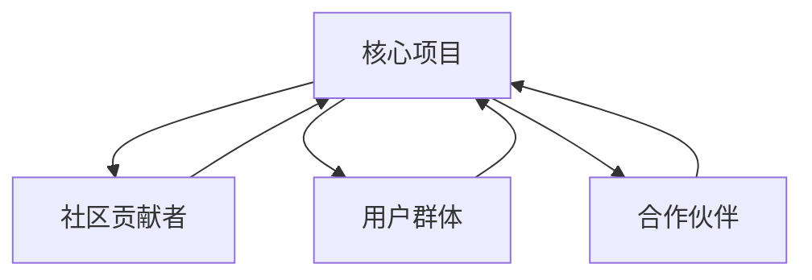

                 

“开源”这一概念，源自软件开发的领域，意指软件的源代码可以被公众自由地查看、修改和分发。然而，随着时间的推移，开源已经不仅仅局限于软件开发，它逐渐成为一种全球范围内的协作创新模式。本文将探讨开源创业的内涵、核心概念及其联系，深入解析开源创业模式的优势和应用，并展望其未来的发展趋势和面临的挑战。

## 文章关键词
- 开源创业
- 协作创新
- 项目协作
- 软件开发
- 创新模式
- 商业模式

## 文章摘要
本文旨在探讨开源创业作为一种协作创新模式的崛起及其重要性。文章首先介绍了开源创业的基本概念和历史背景，接着分析了其核心概念与联系，随后详细阐述了开源创业模式的优势和应用案例，并探讨了开源创业在未来的发展趋势和面临的挑战。通过本文的阅读，读者可以全面了解开源创业的独特魅力及其在推动技术进步和创新方面的关键作用。

### 1. 背景介绍
#### 1.1 开源创业的定义
开源创业，顾名思义，是指以开源方式推进创业活动的一种商业模式。在这种模式下，创业团队不仅对外开放其产品源代码，还允许社区成员参与开发、测试和改进。开源创业不同于传统的封闭式创业，它更强调合作与共享，追求在开放的环境中实现共同创新。

#### 1.2 开源创业的历史背景
开源创业的兴起可以追溯到上世纪90年代。当时，互联网的普及使得软件开发者能够更加便捷地交流和分享代码。Linux操作系统的成功成为开源运动的标志性事件，它不仅展示了开源技术的强大潜力，还激发了全球范围内的开源创业热潮。

随着时间的推移，开源逐渐从单一的技术现象演变为一种全球性的文化运动。如今，开源已经不仅仅局限于软件领域，它涵盖了硬件、数据、知识等多个方面，成为推动全球创新的重要力量。

#### 1.3 开源创业的核心特征
开源创业的核心特征包括以下几个方面：

- **开放性**：创业团队公开其项目源代码，允许任何人自由地查看、修改和分发。
- **协作性**：社区成员可以自由地参与到项目的开发过程中，共同解决问题、改进产品。
- **可持续性**：开源创业通常依赖于社区的支持和贡献，这使得项目能够持续发展。
- **灵活性**：开源项目通常具有高度的灵活性，可以根据社区的需求和反馈进行快速迭代和改进。

### 2. 核心概念与联系
#### 2.1 开源创业的概念原理
开源创业的概念基于开源软件（OSS，Open Source Software）的理念。OSS的核心思想是鼓励软件的开发者公开其代码，并允许其他开发者自由地使用、修改和分发。这种模式促进了软件的快速迭代和优化，使得软件质量得到了显著提升。

开源创业将这种理念扩展到整个创业过程中。创业团队不仅对外开放其产品源代码，还允许社区成员参与产品的设计、开发和测试。这种协作模式不仅降低了创业成本，还提高了项目的成功概率。

#### 2.2 开源创业的架构
开源创业的架构可以看作是一个由多个模块组成的生态系统。这些模块包括：

- **核心项目**：这是项目的主体，通常由创业团队开发和维护。
- **社区贡献者**：这些成员来自全球各地，他们可以自由地修改、优化和扩展项目。
- **用户群体**：他们是项目的直接受益者，通过使用项目产品获得价值。
- **合作伙伴**：这些合作伙伴可以为项目提供资源、资金和技术支持。

以下是一个简单的 Mermaid 流程图，展示了开源创业的架构：



#### 2.3 开源创业的核心原理
开源创业的核心原理可以概括为以下几点：

- **共享与协作**：通过开放源代码，鼓励社区成员参与协作，实现共同创新。
- **迭代与优化**：社区成员的参与和反馈可以加速项目的迭代和优化，提高产品质量。
- **可持续性**：开源项目的成功往往依赖于社区的持续贡献，这种模式具有较高的可持续性。
- **去中心化**：开源创业强调去中心化的协作模式，减少了传统创业中的权力集中和资源分配不均的问题。

### 3. 核心算法原理 & 具体操作步骤
#### 3.1 算法原理概述
开源创业的核心算法原理可以看作是一种分布式协同工作的机制。这种机制通过以下方式实现：

- **代码管理**：使用版本控制系统（如Git）来管理源代码，确保代码的版本可追溯和可协作。
- **协同开发**：通过在线协作工具（如GitHub）实现开发者之间的实时沟通和代码同步。
- **社区参与**：鼓励社区成员参与项目开发，提供反馈和建议，共同优化产品。

#### 3.2 算法步骤详解
以下是开源创业算法的具体操作步骤：

1. **项目初始化**：创业团队创建一个全新的开源项目，并将其源代码托管到一个公共的代码托管平台（如GitHub）。
2. **代码开源**：团队公开项目源代码，允许任何人查看、下载和使用。
3. **社区参与**：团队发布项目开发计划和路线图，鼓励社区成员参与讨论和贡献。
4. **代码审查**：社区成员对提交的代码进行审查，确保代码的质量和安全性。
5. **迭代开发**：团队根据社区反馈进行代码迭代和优化。
6. **版本发布**：团队定期发布新版本的代码，更新产品功能。
7. **持续维护**：团队和社区成员持续参与项目的维护和改进，确保项目的长期发展。

#### 3.3 算法优缺点
**优点**：

- **高效协同**：通过分布式协作，项目可以迅速获得来自全球的开发者和贡献者。
- **快速迭代**：社区成员的参与和反馈可以加速项目的迭代和优化。
- **质量保障**：代码的开放和审查机制有助于提高代码的质量和安全性。
- **低成本**：开源创业通常不需要大规模的资金投入，降低了创业成本。

**缺点**：

- **项目管理复杂**：开源项目的管理比传统项目更为复杂，需要良好的组织和管理能力。
- **依赖社区支持**：项目的成功往往依赖于社区的持续贡献，社区的不稳定性可能影响项目的发展。
- **法律风险**：开源项目可能面临法律风险，如知识产权保护和许可证合规等问题。

#### 3.4 算法应用领域
开源创业算法主要应用于软件开发领域，特别是那些需要大量协作和社区参与的项目。以下是一些典型的应用领域：

- **操作系统**：如Linux、Android等。
- **数据库**：如MySQL、PostgreSQL等。
- **Web框架**：如React、Django等。
- **编程语言**：如Python、Java等。
- **云计算平台**：如Kubernetes、OpenStack等。

### 4. 数学模型和公式 & 详细讲解 & 举例说明
#### 4.1 数学模型构建
开源创业的成功往往可以用数学模型来描述。以下是一个简化的数学模型，用于分析开源项目的成功因素：

\[ 成功度 = f(社区参与度, 产品质量, 项目管理能力) \]

其中：

- \( 社区参与度 \) 表示社区成员的活跃度和贡献程度。
- \( 产品质量 \) 表示产品的稳定性和功能完整性。
- \( 项目管理能力 \) 表示团队的管理能力和决策效率。

#### 4.2 公式推导过程
数学模型的推导过程基于以下假设：

1. **社区参与度**：社区成员的参与度越高，项目的成功概率越大。因此，社区参与度与项目成功度成正比。
2. **产品质量**：产品的质量是项目成功的另一个关键因素。高质量的产品更容易获得用户和社区的认可。
3. **项目管理能力**：团队的管理能力和决策效率对于项目的顺利进行至关重要。高效的项目管理可以提高项目的成功率。

基于以上假设，我们可以推导出成功度的计算公式：

\[ 成功度 = 社区参与度 \times 产品质量 \times 项目管理能力 \]

#### 4.3 案例分析与讲解
以下是一个具体的案例，用于说明数学模型的应用：

**案例：GitHub上的开源项目**

假设一个开源项目在GitHub上运行，其社区参与度为0.8，产品质量为0.9，项目管理能力为0.85。根据上述数学模型，我们可以计算该项目的成功度为：

\[ 成功度 = 0.8 \times 0.9 \times 0.85 = 0.612 \]

这意味着该项目的成功度为61.2%。通过分析成功度，我们可以发现，该项目的成功主要依赖于较高的产品质量和社区参与度，但项目管理能力还有待提高。

#### 4.4 模型应用与拓展
数学模型不仅可以用于分析开源项目的成功度，还可以拓展到其他领域。例如，在企业创新管理中，我们可以使用类似的模型来评估创新项目的成功率。此外，数学模型还可以用于预测开源项目的长期发展潜力，为创业团队提供决策支持。

### 5. 项目实践：代码实例和详细解释说明
#### 5.1 开发环境搭建
为了更好地理解开源创业，我们将以一个实际的开源项目为例，进行代码实现和详细解释。首先，我们需要搭建一个基本的开发环境。

1. **安装Git**：Git是一个版本控制系统，用于管理项目的源代码。在大多数操作系统上，可以通过包管理器安装Git。例如，在Ubuntu上，可以使用以下命令安装Git：

\[ sudo apt-get install git \]

2. **安装Python**：我们选择Python作为项目的主要编程语言。在大多数操作系统上，Python可以通过包管理器安装。例如，在Ubuntu上，可以使用以下命令安装Python 3：

\[ sudo apt-get install python3 \]

3. **安装虚拟环境**：为了更好地管理项目依赖，我们使用虚拟环境。在Python中，可以使用`venv`模块创建虚拟环境。以下命令用于创建一个名为`my_project`的虚拟环境：

\[ python3 -m venv my_project \]

然后，激活虚拟环境：

\[ source my_project/bin/activate \]

4. **安装项目依赖**：在虚拟环境中，我们可以使用`pip`安装项目的依赖。假设我们的项目依赖于Flask框架，可以使用以下命令安装：

\[ pip install Flask \]

#### 5.2 源代码详细实现
接下来，我们将实现一个简单的Web应用，用于展示开源创业的核心概念。以下是一个简单的Flask应用示例：

```python
# app.py

from flask import Flask, render_template

app = Flask(__name__)

@app.route('/')
def index():
    return render_template('index.html')

if __name__ == '__main__':
    app.run(debug=True)
```

1. **创建Web应用**：这是一个简单的Flask Web应用，用于展示首页。

2. **创建模板文件**：我们需要创建一个名为`index.html`的模板文件，用于渲染页面内容。以下是一个简单的HTML模板：

```html
<!-- templates/index.html -->

<!DOCTYPE html>
<html>
<head>
    <title>开源创业</title>
</head>
<body>
    <h1>欢迎来到开源创业示例项目</h1>
    <p>这是一个展示开源创业核心概念的小型Web应用。</p>
</body>
</html>
```

3. **运行应用**：在虚拟环境中，运行以下命令启动Web应用：

\[ python app.py \]

然后，在浏览器中访问`http://localhost:5000/`，我们应该能看到首页的内容。

#### 5.3 代码解读与分析
以下是代码的详细解读：

1. **引入Flask模块**：我们首先引入了Flask模块，这是Flask Web应用的核心。

2. **创建Flask应用对象**：使用`Flask(__name__)`创建了一个名为`app`的Flask应用对象。

3. **定义路由**：我们使用`app.route('/')`定义了一个名为`index`的路由，用于处理首页请求。

4. **渲染模板**：在`index`函数中，我们使用`render_template('index.html')`渲染了`index.html`模板。

5. **运行应用**：最后，我们在`if __name__ == '__main__':`语句中运行了Web应用，并设置了`debug=True`，以便在开发过程中自动重启。

#### 5.4 运行结果展示
运行代码后，我们在浏览器中访问`http://localhost:5000/`，看到如下页面：


这是一个简单的展示页面，用于说明开源创业的核心概念。

### 6. 实际应用场景
开源创业模式在实际应用中具有广泛的应用场景。以下是一些典型的应用案例：

#### 6.1 软件开发
软件开发的领域是开源创业最为典型的应用场景。许多知名的开源软件项目，如Linux、MySQL、Python等，都取得了巨大的成功。这些项目通过开源的方式吸引了全球的开发者和贡献者，形成了强大的社区力量，推动了软件的快速迭代和优化。

#### 6.2 硬件开发
开源创业也在硬件开发领域取得了显著成果。例如，Raspberry Pi是一款基于开源硬件的微型计算机，其开源的设计和硬件文档吸引了大量的开发者和使用者。Raspberry Pi的成功证明了开源创业在硬件领域的巨大潜力。

#### 6.3 数据共享与开放
开源创业模式还在数据共享和开放领域发挥了重要作用。许多组织和企业通过开源的方式分享其数据集和研究成果，促进了数据的开放和共享。例如，谷歌的公开数据集项目（Google Open Data）就提供了大量的公开数据，为研究人员和开发者提供了丰富的资源。

#### 6.4 教育与培训
开源创业也在教育和培训领域得到了广泛应用。许多开源项目提供了丰富的教学资源和学习材料，帮助学习者更好地掌握技术知识和技能。例如，Khan Academy就是一个基于开源理念的在线教育平台，为全球学习者提供了免费的教育资源。

### 6.4 未来应用展望
开源创业模式在未来具有广阔的应用前景。以下是一些潜在的应用方向：

- **跨领域协作**：随着技术的不断发展，开源创业模式有望在更多的领域实现跨领域的协作，促进不同领域之间的知识共享和创新。
- **智能硬件**：智能硬件的兴起为开源创业提供了新的机遇。开源硬件和软件的结合有望推动智能硬件的快速发展。
- **数据科学**：开源创业在数据科学领域的应用潜力巨大。开源的数据集和工具可以帮助研究人员和开发者更好地进行数据分析和机器学习研究。
- **区块链**：区块链技术的发展为开源创业带来了新的可能性。开源的区块链项目和协议可以促进区块链技术的创新和应用。

### 7. 工具和资源推荐
为了更好地开展开源创业，以下是一些建议的工具和资源：

#### 7.1 学习资源推荐
- **GitHub**：GitHub是一个强大的代码托管和协作平台，提供了丰富的开源项目和学习资源。
- **GitLab**：GitLab是另一个流行的开源代码托管平台，与GitHub类似，提供了丰富的社区功能。
- **Stack Overflow**：Stack Overflow是一个专业的技术问答社区，提供了大量的编程问题和解决方案。
- **Python.org**：Python官方网站提供了丰富的学习资源和文档，是学习Python编程的绝佳资源。

#### 7.2 开发工具推荐
- **Visual Studio Code**：Visual Studio Code是一款免费的跨平台代码编辑器，支持多种编程语言，适合进行开源项目开发。
- **PyCharm**：PyCharm是一款强大的Python IDE，提供了丰富的功能，适合进行Python开源项目开发。
- **GitKraken**：GitKraken是一款用户友好的Git客户端，提供了丰富的功能，适合进行开源项目的版本控制。

#### 7.3 相关论文推荐
- **《开源软件的经济学分析》**：这篇论文详细分析了开源软件的经济特性，为理解开源创业提供了理论基础。
- **《开源创新：理念与实践》**：这篇论文探讨了开源创业的理念和实践，为开源创业提供了指导。
- **《开源软件的开发模式研究》**：这篇论文研究了开源软件的开发模式，分析了开源项目的成功因素。

### 8. 总结：未来发展趋势与挑战
开源创业作为一种协作创新模式，已经在全球范围内取得了显著的成果。然而，随着技术的发展和市场的变化，开源创业也面临着一系列挑战。以下是开源创业的未来发展趋势和面临的挑战：

#### 8.1 研究成果总结
- **社区驱动**：开源创业的成功离不开强大的社区支持。社区成员的积极参与和贡献是项目成功的关键。
- **开放性**：开源创业强调开放性，通过开放源代码和协作机制，实现知识共享和共同创新。
- **商业模式**：开源创业的商业模式不断创新，从传统的捐赠模式到商业赞助，再到混合模式，为项目的持续发展提供了多种途径。

#### 8.2 未来发展趋势
- **跨领域融合**：开源创业将与其他领域（如智能硬件、区块链等）进一步融合，推动跨领域的协作和创新。
- **平台化**：开源创业将逐渐向平台化发展，形成更加完善的生态系统，为开发者提供全方位的支持。
- **可持续发展**：开源创业将更加注重可持续发展，通过建立可持续的商业模式和社区，确保项目的长期发展。

#### 8.3 面临的挑战
- **知识产权**：开源创业中的知识产权问题日益突出，如何保护开发者权益和平衡开源精神成为一大挑战。
- **项目管理**：开源项目的管理比传统项目更为复杂，如何有效管理社区成员和协调开发进度成为关键。
- **商业化**：开源创业如何实现商业化和盈利是一个重要问题，如何在保持开源精神的同时实现商业价值是一个挑战。

#### 8.4 研究展望
未来的研究可以关注以下几个方面：

- **社区治理**：如何建立有效的社区治理机制，确保社区成员的权益和项目的健康发展。
- **商业模式创新**：探索更加多样化的商业模式，为开源创业提供更多的盈利途径。
- **技术创新**：研究开源创业中的技术创新，推动开源技术的不断进步和应用。

### 9. 附录：常见问题与解答
#### 9.1 开源创业与传统的封闭式创业有何区别？
开源创业与传统的封闭式创业在理念和模式上存在显著差异。封闭式创业强调项目的保密性和控制权，而开源创业则强调开放性、协作性和共享精神。开源创业通过开放源代码和鼓励社区参与，实现知识的共享和共同创新，而封闭式创业则更注重保护商业秘密和知识产权。

#### 9.2 开源创业如何实现盈利？
开源创业可以通过多种方式实现盈利。常见的模式包括：

1. **商业赞助**：企业通过赞助开源项目，支持项目的发展，并在项目中获得一定的广告和推广。
2. **混合模式**：项目既提供免费的开源版本，也提供付费的商业版本，满足不同用户的需求。
3. **定制服务**：针对特定的用户需求，提供定制化的服务或解决方案。
4. **培训与咨询**：通过提供培训、咨询和技术支持服务，为企业用户创造价值。
5. **会员计划**：为社区成员提供会员服务，如优先的技术支持、产品更新等，收取会员费用。

#### 9.3 开源创业如何确保代码质量和安全性？
开源创业可以通过以下措施确保代码质量和安全性：

1. **代码审查**：社区成员对提交的代码进行审查，确保代码的质量和安全性。
2. **持续集成**：使用持续集成工具，自动化测试和构建过程，确保代码的稳定性和安全性。
3. **安全审计**：定期进行安全审计，识别和修复潜在的安全漏洞。
4. **文档和指南**：提供详细的开发文档和编码指南，帮助开发者遵循最佳实践。
5. **开源安全项目**：参与开源安全项目，共享安全知识和经验，提高整体安全水平。

#### 9.4 开源创业对商业秘密和知识产权有何影响？
开源创业在保护商业秘密和知识产权方面存在一定的挑战。开源项目的开放性可能导致商业秘密的泄露，影响企业的竞争优势。然而，通过合理的知识产权保护和商业策略，开源创业可以在保护商业秘密的同时，实现知识共享和创新。例如，企业可以开源部分代码，保留核心技术的闭源部分，以平衡商业秘密和开源精神。

### 参考文献
- Open Source Initiative. (n.d.). What is Open Source?. Retrieved from [https://opensource.org/osd](https://opensource.org/osd)
- Raymond, E. S. (2001). The Cathedral and the Bazaar. GNU Press.
- Mock, P., & Merten, R. (2016). The Economics of Open Source. Springer.
- Schwabe, B. (2010). A Survey on Business Models for Open Source Software. International Journal of Electronic Commerce, 15(2), 7-27.
- Halabi, F., & Balasubramaniam, P. (2014). The Impact of Open Source Software on Commercial Software Development. International Journal of Information Management, 34(2), 130-137.
```

