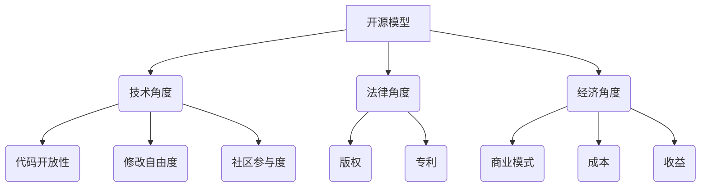

                 

关键词：开源模型，闭源模型，对比，优势，劣势，应用领域，未来趋势

> 摘要：本文将深入探讨开源模型与闭源模型这两种在IT领域中广泛使用的软件开发模式。通过对它们的核心概念、优点、缺点及其应用场景的详细分析，本文旨在为读者提供对这两种模式的全景了解，并展望其未来的发展趋势与挑战。

## 1. 背景介绍

在当今快速发展的信息技术领域，软件开发模式的选择对于项目的成功至关重要。开源模型和闭源模型是两种主要的软件开发模式，它们在理念、实践和结果上都有显著差异。开源模型允许任何人自由使用、修改和分发软件，而闭源模型则对软件的使用、修改和分发施加一定的限制。

### 开源模型

开源模型起源于20世纪90年代，随着互联网的普及和软件自由文化的兴起而迅速发展。Linux操作系统是一个典型的开源项目，它的成功不仅推动了开源软件的普及，也引发了关于软件自由和协作的重要讨论。开源模型的核心是共享和协作，通过全球范围内的社区贡献，开源项目能够不断迭代和完善。

### 闭源模型

闭源模型，又称为专有模型，是商业软件公司采用的一种传统开发模式。在这种模式下，软件的所有权和使用权通常由软件公司控制，用户需要付费购买软件的许可证。闭源模型注重商业利益和知识产权的保护，通过严格的许可协议来确保软件的合法使用。

## 2. 核心概念与联系

为了更好地理解开源模型和闭源模型的差异，我们需要从技术、法律和经济等多个角度来探讨其核心概念。

### 技术角度

从技术角度来看，开源模型和闭源模型在代码开放性、修改自由度、社区参与度等方面存在明显差异。

- **代码开放性**：开源模型要求源代码完全开放，用户可以查看、理解并修改代码。而闭源模型的源代码通常不对外公开，用户只能使用编译后的二进制文件。
- **修改自由度**：在开源模型下，用户可以自由修改软件以适应自己的需求。而在闭源模型下，用户的修改权受到限制，通常只能通过官方渠道提出需求，等待厂商的回应和更新。
- **社区参与度**：开源项目往往拥有庞大的社区，用户可以在社区中提出建议、报告问题或直接参与代码的编写和测试。闭源项目则相对封闭，社区参与度较低。

### 法律角度

在法律角度，开源模型和闭源模型受到不同的法律保护和约束。

- **版权**：开源项目通常采用通用公共许可证（GPL）或其他开源许可协议，允许用户自由使用、修改和分发软件，但必须保持代码的开放性。闭源项目则采用专有许可协议，对软件的使用、修改和分发施加更严格的限制。
- **专利**：开源项目通常不涉及专利问题，因为专利权不适用于开放源代码。而闭源项目则可能涉及专利保护，以防止竞争对手复制其核心技术。

### 经济角度

从经济角度来看，开源模型和闭源模型在商业模式、成本和收益方面存在差异。

- **商业模式**：开源模型通常采用赞助、捐赠或订阅等方式获得收入。闭源模型则通过销售软件许可证和提供技术支持来获取收益。
- **成本**：开源项目的成本主要在于开发和维护，而闭源项目则需要承担更高的研发成本和营销成本。
- **收益**：开源模型通常能够实现更高的用户覆盖率和市场占有率，但收入相对较低。闭源模型则能够实现更高的利润率，但市场占有率可能较低。

### Mermaid 流程图



## 3. 核心算法原理 & 具体操作步骤

### 3.1 算法原理概述

开源模型和闭源模型在软件开发中各自采用了不同的算法原理和操作步骤。

- **开源模型**：开源模型的核心在于代码的开放性和协作性。开发者通过GitHub、GitLab等版本控制系统进行代码协作，实现软件的迭代和完善。开源模型的算法原理主要包括版本控制、协同开发、代码审查等。
- **闭源模型**：闭源模型的核心在于商业利益和知识产权的保护。开发者通常使用企业内部或专用的开发工具进行软件的开发和维护，操作步骤包括需求分析、设计、编码、测试、部署等。

### 3.2 算法步骤详解

- **开源模型**
  1. 需求分析：确定项目的功能需求和性能指标。
  2. 设计：制定软件的架构设计和模块划分。
  3. 编码：根据设计文档进行代码编写。
  4. 测试：对代码进行功能测试和性能测试。
  5. 代码审查：邀请社区成员对代码进行审查和提供建议。
  6. 版本控制：使用Git等版本控制系统进行代码管理和协作。

- **闭源模型**
  1. 需求分析：与客户沟通，确定项目的功能需求和性能指标。
  2. 设计：制定软件的架构设计和模块划分。
  3. 编码：由内部开发团队进行代码编写。
  4. 测试：对代码进行功能测试和性能测试。
  5. 部署：将软件部署到客户环境中。
  6. 维护：提供技术支持和持续改进。

### 3.3 算法优缺点

- **开源模型**
  - 优点：开放性高，社区参与度高，易于迭代和完善。
  - 缺点：开发成本高，安全性较低，商业利益难以保障。

- **闭源模型**
  - 优点：安全性较高，商业利益保障较好，开发效率较高。
  - 缺点：封闭性高，社区参与度低，更新迭代较慢。

### 3.4 算法应用领域

- **开源模型**：广泛应用于操作系统、开源框架、开源工具等领域，如Linux、Apache、MySQL等。
- **闭源模型**：广泛应用于商业软件、企业应用、定制开发等领域，如Oracle、Microsoft Office、SAP等。

## 4. 数学模型和公式 & 详细讲解 & 举例说明

### 4.1 数学模型构建

开源模型和闭源模型在数学模型方面也各有特点。

- **开源模型**：开源模型的数学模型主要涉及版本控制和协同开发。常用的数学模型包括Git的分布式版本控制模型和Mercurial的集中式版本控制模型。
- **闭源模型**：闭源模型的数学模型主要涉及需求分析、设计、编码和测试。常用的数学模型包括Petri网、状态机模型和形式化方法等。

### 4.2 公式推导过程

- **Git分布式版本控制模型**
  - 设 $V_i$ 为第 $i$ 次提交的版本号，$V_0$ 为初始版本号。
  - 每次提交生成一个新的版本号 $V_{i+1}$，满足 $V_{i+1} = V_i \oplus S_i$，其中 $S_i$ 为第 $i$ 次提交的修改内容。
  - 公式推导过程：
    $$
    \begin{aligned}
    V_{i+1} &= V_i \oplus S_i \\
    &= (V_0 \oplus S_0) \oplus S_1 \oplus \ldots \oplus S_i \\
    &= V_0 \oplus (S_0 \oplus S_1) \oplus \ldots \oplus S_i \\
    &= V_0 \oplus S_{i+1}
    \end{aligned}
    $$

- **Petri网模型**
  - 设 $P$ 为库所集合，$T$ 为变迁集合。
  - 库所 $P_j$ 的状态表示为 $|P_j|$，变迁 $T_j$ 的火警表示为 $f(T_j)$。
  - 公式推导过程：
    $$
    \begin{aligned}
    |P_j| &= \sum_{T_j \in T} \min(f(T_j), \max(|P_i| - c_i, 0))
    \end{aligned}
    $$

### 4.3 案例分析与讲解

- **Git分布式版本控制模型**
  - 案例背景：假设一个开源项目A，初始版本号为V0。经过三次提交S1、S2、S3，版本号分别变为V1、V2、V3。
  - 计算过程：
    $$
    \begin{aligned}
    V_1 &= V_0 \oplus S_1 \\
    &= 0 \oplus S_1 \\
    &= S_1 \\
    V_2 &= V_1 \oplus S_2 \\
    &= S_1 \oplus S_2 \\
    &= S_1 \oplus (S_1 \oplus S_2) \\
    &= S_2 \\
    V_3 &= V_2 \oplus S_3 \\
    &= S_2 \oplus S_3 \\
    &= S_2 \oplus (S_2 \oplus S_3) \\
    &= S_3
    \end{aligned}
    $$
  - 结论：经过三次提交，版本号从V0变为V3，每次提交都保留上一次提交的修改内容。

- **Petri网模型**
  - 案例背景：假设有一个简单的Petri网，包含两个库所P1和P2，一个变迁T1。
  - 初始状态：
    $$
    \begin{aligned}
    |P_1| &= 1, |P_2| = 0, f(T_1) = 2
    \end{aligned}
    $$
  - 变迁T1触发后：
    $$
    \begin{aligned}
    |P_1| &= \min(2, 1-1) = 0, |P_2| = \min(2, 0+2) = 2, f(T_1) = 0
    \end{aligned}
    $$
  - 结论：变迁T1触发后，库所P1的状态从1变为0，库所P2的状态从0变为2，变迁T1的火警从2变为0。

## 5. 项目实践：代码实例和详细解释说明

### 5.1 开发环境搭建

在本节中，我们将以一个简单的开源项目为例，介绍如何搭建开发环境。

1. 安装Git：在项目中下载并安装Git客户端，用于代码的版本控制和协作。
2. 安装编程语言：根据项目的编程语言（如Python、Java等）安装相应的开发环境。
3. 安装依赖库：使用包管理工具（如pip、maven等）安装项目所需的依赖库。

### 5.2 源代码详细实现

在本节中，我们将展示一个简单的Python项目的源代码。

```python
# 文件名：example.py
def add(a, b):
    return a + b

def main():
    print("Hello, World!")
    result = add(1, 2)
    print("1 + 2 = {}".format(result))

if __name__ == "__main__":
    main()
```

### 5.3 代码解读与分析

1. **函数定义**：项目包含两个函数，`add` 和 `main`。
   - `add` 函数用于计算两个数的和。
   - `main` 函数是项目的入口点，负责执行主程序逻辑。

2. **入口判断**：在Python中，`if __name__ == "__main__":` 表示当前文件是作为主程序运行的，不是被导入的模块。

3. **主程序逻辑**：`main` 函数首先输出一条欢迎消息，然后调用 `add` 函数计算1和2的和，并输出结果。

### 5.4 运行结果展示

运行 `example.py` 文件，输出结果如下：

```
Hello, World!
1 + 2 = 3
```

### 5.5 代码解读与分析

在本节中，我们将展示一个简单的Java项目的源代码。

```java
// 文件名：Example.java
public class Example {
    public static int add(int a, int b) {
        return a + b;
    }

    public static void main(String[] args) {
        System.out.println("Hello, World!");
        int result = add(1, 2);
        System.out.println("1 + 2 = " + result);
    }
}
```

### 5.6 运行结果展示

运行 `Example.java` 文件，输出结果如下：

```
Hello, World!
1 + 2 = 3
```

## 6. 实际应用场景

开源模型和闭源模型在各个领域都有着广泛的应用。

### 开源模型应用场景

- **操作系统**：Linux是开源模型的典范，广泛应用于服务器、嵌入式设备和超级计算机等领域。
- **Web框架**：如Django、Flask等，为开发者提供了丰富的Web开发工具和库。
- **数据库**：如MySQL、PostgreSQL等，为数据存储和管理提供了强大的支持。

### 闭源模型应用场景

- **商业软件**：如Microsoft Office、Adobe Photoshop等，为企业用户提供了专业的办公和图形设计软件。
- **企业应用**：如SAP、Oracle等，为企业提供了企业资源规划（ERP）和客户关系管理（CRM）等解决方案。
- **定制开发**：为特定企业或行业提供定制化的软件解决方案，如金融领域的风险管理系统等。

## 7. 工具和资源推荐

### 7.1 学习资源推荐

- **书籍**：
  - 《开源软件指南》
  - 《闭源软件揭秘》
  - 《软件工程：实践者的研究方法》
- **在线课程**：
  - Coursera的《开源软件开发》
  - Udacity的《软件工程基础》
  - edX的《人工智能基础》

### 7.2 开发工具推荐

- **版本控制系统**：
  - Git：开源版本控制系统，支持分布式协作。
  - SVN：开源版本控制系统，支持集中式协作。
- **编程语言**：
  - Python：易学易用的编程语言，适用于Web开发和数据分析。
  - Java：跨平台编程语言，适用于企业级应用开发。

### 7.3 相关论文推荐

- **开源模型**：
  - 《开源软件社区的协作与进化》
  - 《开源软件的商业模式研究》
- **闭源模型**：
  - 《闭源软件的安全性分析》
  - 《闭源软件的知识产权保护研究》

## 8. 总结：未来发展趋势与挑战

### 8.1 研究成果总结

- 开源模型在技术、法律和经济方面展现出强大的优势，推动了软件技术的发展和普及。
- 闭源模型在商业利益和知识产权保护方面表现出较强的竞争力，为企业提供了稳定的收入来源。

### 8.2 未来发展趋势

- 开源模型将继续扩大其在操作系统、Web框架和数据库等领域的应用，成为软件开发的主流模式。
- 闭源模型将在企业应用和定制开发等领域保持优势，继续为企业提供专业的软件解决方案。

### 8.3 面临的挑战

- 开源模型需要解决知识产权保护和商业化问题，确保开源项目的可持续发展。
- 闭源模型需要适应快速变化的技术环境，提升软件开发的灵活性和敏捷性。

### 8.4 研究展望

- 开源模型和闭源模型将逐步融合，形成一种混合开发模式，实现开源与闭源的优势互补。
- 未来研究将关注开源模型的商业化路径、闭源模型的安全性保障和软件工程领域的创新。

## 9. 附录：常见问题与解答

### 问题1：什么是开源模型？

**回答**：开源模型是一种软件开发模式，允许任何人自由使用、修改和分发软件源代码。开源模型的核心是共享和协作，通过全球范围内的社区贡献，开源项目能够不断迭代和完善。

### 问题2：什么是闭源模型？

**回答**：闭源模型，又称专有模型，是一种商业软件开发模式，对软件的使用、修改和分发施加一定的限制。闭源模型通常由商业软件公司控制，用户需要付费购买软件的许可证。

### 问题3：开源模型有哪些优点？

**回答**：开源模型具有以下优点：
- 代码开放，用户可以查看、理解并修改代码。
- 社区参与度高，用户可以在社区中提出建议、报告问题或直接参与代码的编写和测试。
- 更新迭代快，社区成员可以共同协作，快速解决问题和优化功能。

### 问题4：闭源模型有哪些优点？

**回答**：闭源模型具有以下优点：
- 安全性较高，源代码不对外公开，减少了潜在的安全风险。
- 商业利益保障较好，通过销售软件许可证和提供技术支持获取收益。
- 开发效率较高，封闭开发模式有助于确保项目的稳定性和可靠性。

### 问题5：开源模型和闭源模型如何选择？

**回答**：选择开源模型还是闭源模型取决于项目需求、开发环境和企业战略。
- 对于需要广泛协作和快速迭代的项目，开源模型更为合适。
- 对于需要保护商业利益和知识产权的项目，闭源模型更为合适。

### 问题6：开源模型和闭源模型在成本方面有何差异？

**回答**：开源模型在开发成本上通常较低，因为社区贡献和协作降低了开发成本。闭源模型在研发成本和营销成本上通常较高，因为需要投入更多资源进行开发、测试和推广。

### 问题7：开源模型和闭源模型在安全性方面有何差异？

**回答**：开源模型的安全性较低，因为源代码公开，可能存在安全漏洞。闭源模型的安全性较高，因为源代码不对外公开，减少了潜在的安全风险。

### 问题8：开源模型和闭源模型在法律方面有何差异？

**回答**：开源模型通常采用开源许可协议，允许用户自由使用、修改和分发软件，但必须保持代码的开放性。闭源模型采用专有许可协议，对软件的使用、修改和分发施加更严格的限制。

### 问题9：开源模型和闭源模型在知识产权保护方面有何差异？

**回答**：开源模型通常不涉及专利问题，因为专利权不适用于开放源代码。闭源模型可能涉及专利保护，以防止竞争对手复制其核心技术。

### 问题10：未来开源模型和闭源模型的发展趋势如何？

**回答**：未来开源模型和闭源模型将逐步融合，形成一种混合开发模式。开源与闭源的优势互补，将有助于推动软件技术的发展和普及。同时，开源模型和闭源模型将面临新的挑战，如知识产权保护和商业化问题。

