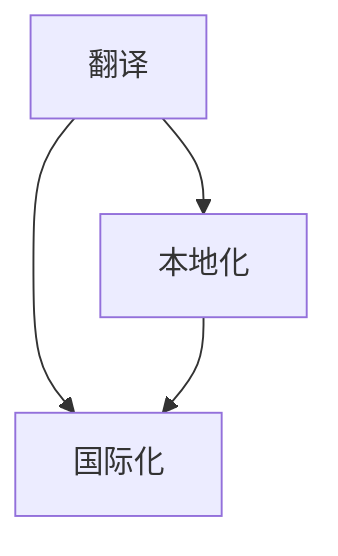

                 

关键词：开源项目、国际化、市场扩大、收入来源、翻译、本地化、市场策略、全球化

> 摘要：随着开源项目的不断发展，国际化已经成为项目成功的关键因素之一。本文将探讨如何通过国际化策略来扩大开源项目的市场，增加收入来源。我们将分析开源项目的国际化现状，讨论翻译和本地化的重要性，并分享一些成功案例和实用技巧。

## 1. 背景介绍

开源项目是一种基于共享精神和合作原则的软件开发模式。它们允许任何人自由地查看、修改和使用源代码，从而促进了技术的创新和传播。然而，尽管开源项目在全球范围内得到了广泛的应用，但大多数项目仍然主要面向英语用户，这在一定程度上限制了它们的潜力和影响力。

国际化是指将产品或服务适应不同文化、语言和地区需求的过程。对于开源项目而言，国际化意味着为非英语用户提供可用的语言版本，并且考虑到不同市场的文化和商业习惯。国际化不仅可以扩大项目的用户基础，还可以为项目带来新的收入来源。

## 2. 核心概念与联系

为了实现开源项目的国际化，我们需要理解以下几个核心概念：

- **翻译**：将项目的文档、代码注释和用户界面等从一种语言转换为另一种语言。
- **本地化**：除了翻译，还包括对项目进行文化适应，例如调整货币格式、日期格式和度量单位等。
- **国际化**：确保项目可以在多种语言和文化环境中使用，为翻译和本地化提供支持。

以下是一个简单的 Mermaid 流程图，展示了这三个概念之间的关系：



## 3. 核心算法原理 & 具体操作步骤

### 3.1 算法原理概述

国际化开源项目的核心在于构建一个灵活的架构，使得翻译和本地化过程可以无缝进行。以下是实现国际化的一些关键步骤：

1. **多语言支持**：选择一种合适的语言框架，例如 i18next，以支持多语言界面。
2. **翻译管理**：使用翻译平台（如 Crowdin、Transifex）来管理翻译流程，并确保翻译质量。
3. **本地化调整**：对项目的日期、时间、货币和度量单位等进行本地化调整。
4. **国际化测试**：在多个语言和地区环境中测试项目，确保其功能正常。

### 3.2 算法步骤详解

1. **选择多语言框架**：根据项目需求，选择一个合适的多语言框架。i18next 是一个非常流行的选择，因为它支持模块化、灵活的翻译管理和国际化的数据格式。
   
2. **设置翻译平台**：注册并配置一个翻译平台，如 Crowdin 或 Transifex。这些平台提供了用户友好的界面和丰富的功能，如项目分片、翻译提醒和版本控制。

3. **创建翻译资源**：将项目的所有需要翻译的部分（如用户界面、文档和代码注释）导出为翻译资源文件。i18next 使用 JSON 文件来存储翻译内容。

4. **分配翻译任务**：将翻译资源文件分配给翻译者，可以是内部团队成员或外部翻译服务商。确保他们熟悉项目的上下文和目标市场。

5. **翻译和审核**：翻译者根据分配的任务进行翻译，然后由审核者检查翻译的质量和准确性。这是一个反复迭代的过程，直到所有翻译都经过审核。

6. **本地化调整**：在翻译完成后，对项目进行本地化调整。例如，更改货币格式、日期格式和度量单位等，以适应目标市场的需求。

7. **国际化测试**：在多个语言和地区环境中测试项目，确保其功能正常。这包括用户界面、文档和代码的兼容性测试。

### 3.3 算法优缺点

- **优点**：国际化策略可以显著增加开源项目的用户基础，提高项目的知名度和影响力。此外，通过提供本地化版本，项目可以更好地适应不同市场的文化和商业习惯。
- **缺点**：国际化过程需要投入大量时间和资源，包括翻译、测试和调整。此外，不同地区的法规和标准也可能给国际化带来挑战。

### 3.4 算法应用领域

国际化策略适用于所有面向全球用户的开源项目，尤其是那些具有跨文化交流需求的项目。以下是一些常见的应用领域：

- **社交网络平台**：如 Diaspora 和 Mastodon，这些平台需要支持多种语言，以吸引来自不同国家和地区的用户。
- **开发工具**：如 Git、GitHub 和 GitLab，这些工具通常被全球开发者使用，因此需要提供多语言支持。
- **开源框架和库**：如 React、Vue 和 Angular，这些框架和库在全球范围内被广泛使用，因此国际化对于它们的成功至关重要。

## 4. 数学模型和公式 & 详细讲解 & 举例说明

国际化开源项目的过程中，我们可以使用一些数学模型和公式来衡量项目的国际化程度和潜在收益。以下是一个简单的例子：

### 4.1 数学模型构建

我们假设一个开源项目有 \( N \) 个功能模块，每个模块有 \( M \) 个界面元素。项目目前支持 \( L \) 种语言。我们可以定义以下几个参数：

- \( C \)：项目的总成本（包括开发、测试、翻译和维护成本）
- \( R \)：每个用户的收入
- \( P \)：国际化带来的市场份额增加比例
- \( E \)：国际化的额外收入

### 4.2 公式推导过程

1. **国际化前的收入**：

\[ I_{\text{before}} = R \times N \times M \times L_0 \]

其中，\( L_0 \) 是项目的原始语言（通常是英语）。

2. **国际化后的收入**：

\[ I_{\text{after}} = R \times N \times M \times (L_0 + \Delta L) \]

其中，\( \Delta L \) 是国际化后的新增语言数量。

3. **国际化的额外收入**：

\[ E = I_{\text{after}} - I_{\text{before}} \]

### 4.3 案例分析与讲解

假设一个开源项目目前只支持英语，项目有 100 个功能模块，每个模块有 100 个界面元素。项目的每个用户平均带来 10 美元的收入。如果国际化后，项目新增支持 5 种语言，我们可以计算出国际化的额外收入：

1. **国际化前的收入**：

\[ I_{\text{before}} = 10 \times 100 \times 100 \times 1 = 10,000 \text{ 美元} \]

2. **国际化后的收入**：

\[ I_{\text{after}} = 10 \times 100 \times 100 \times (1 + 5) = 60,000 \text{ 美元} \]

3. **国际化的额外收入**：

\[ E = 60,000 - 10,000 = 50,000 \text{ 美元} \]

这个简单的例子展示了国际化可以为开源项目带来显著的额外收入。

## 5. 项目实践：代码实例和详细解释说明

### 5.1 开发环境搭建

为了实践国际化，我们可以使用一个简单的开源项目，如一个网页应用。以下是在一个 Linux 系统上搭建开发环境的基本步骤：

1. **安装 Node.js**：从 [Node.js 官网](https://nodejs.org/) 下载并安装 Node.js。
2. **创建项目**：使用 npm（Node.js 的包管理器）创建一个新的项目：

\[ npm init -y \]

3. **安装 i18next**：在项目中安装 i18next 和其依赖项：

\[ npm install i18next i18next-node-fs-backend i18next-http-backend \]

### 5.2 源代码详细实现

1. **设置 i18next**：在项目的根目录下创建一个名为 `i18n.js` 的文件，设置 i18next 的基本配置：

```javascript
const i18next = require('i18next');
const Backend = require('i18next-node-fs-backend');

i18next
  .use(Backend)
  .init({
    fallbackLng: 'en',
    lng: 'en',
    backend: {
      loadPath: './locales/{{lng}}/{{ns}}.json',
    },
  });
module.exports = i18next;
```

2. **创建翻译资源**：在项目的 `locales` 目录下创建英语和其他语言的翻译文件，例如 `en.json`、`es.json`（西班牙语）等。

3. **加载翻译**：在应用的主文件中加载翻译：

```javascript
const i18next = require('./i18n');

// 加载翻译
i18next.load({
  lng: 'es',
  ns: 'common',
  returnObjects: true,
}, (err, t) => {
  if (err) {
    console.error(err);
  } else {
    console.log(t('hello')); // 输出 "Hola"（如果语言设置为西班牙语）
  }
});
```

4. **使用翻译**：在应用的 UI 中使用翻译：

```html
<p>{{ t('hello') }}</p>
```

### 5.3 代码解读与分析

上述代码示例展示了如何使用 i18next 实现国际化。主要步骤包括：

- **设置 i18next**：配置 i18next 的基本参数，如默认语言和翻译资源路径。
- **创建翻译资源**：为每种语言创建一个 JSON 文件，存储翻译内容。
- **加载翻译**：根据用户选择的语言加载相应的翻译资源。
- **使用翻译**：在应用的 UI 中使用 `{{ t('key') }}` 语法嵌入翻译内容。

### 5.4 运行结果展示

在命令行中运行项目后，根据设置的语言，页面将显示相应的翻译内容。例如，如果设置为西班牙语，页面将显示 "Hola"。

## 6. 实际应用场景

国际化策略在开源项目中有着广泛的应用场景。以下是一些实际例子：

- **GitHub**：GitHub 提供了多语言界面，使用户可以方便地浏览和使用各种语言的开源项目。
- **Django**：Django 是一个流行的 Python 框架，其官方文档支持多种语言，包括中文、法语和西班牙语。
- **Kubernetes**：Kubernetes 是一个开源的容器编排平台，其官方文档和用户界面支持多种语言，包括中文。

这些案例展示了国际化如何提高开源项目的可访问性和用户满意度。

### 6.4 未来应用展望

随着全球互联网的普及，开源项目的国际化将变得更加重要。未来，我们可能会看到以下趋势：

- **自动化翻译**：随着机器翻译技术的进步，自动化翻译将变得更加准确和高效。
- **智能本地化**：智能技术可以帮助自动识别和调整项目中的文化差异，提高本地化的质量。
- **多语言社区**：开源项目可能会建立多语言社区，鼓励全球用户参与翻译和维护。

## 7. 工具和资源推荐

### 7.1 学习资源推荐

- **i18next 官方文档**：[i18next Documentation](https://www.i18next.com/)
- **国际化最佳实践**：[Internationalization Best Practices](https://www.sitepoint.com/internationalization-best-practices/)

### 7.2 开发工具推荐

- **Crowdin**：[Crowdin](https://www.crowdin.com/)
- **Transifex**：[Transifex](https://www.transifex.com/)

### 7.3 相关论文推荐

- **"A Survey of Internationalization in Free/Open Source Software Projects"**：[ResearchGate](https://www.researchgate.net/publication/304760395_A_Survey_of_Internationalization_in_Free_Open_Source_Software_Projects)
- **"Global Software Development: Challenges and Opportunities"**：[ACM Digital Library](https://dl.acm.org/doi/10.1145/3577226.3577267)

## 8. 总结：未来发展趋势与挑战

### 8.1 研究成果总结

国际化策略对于开源项目的成功至关重要。通过翻译和本地化，开源项目可以吸引更多的用户和贡献者，从而提高其影响力和市场价值。

### 8.2 未来发展趋势

未来，开源项目的国际化将更加注重自动化和智能化。随着人工智能和机器学习技术的发展，自动化翻译和智能本地化将变得更加准确和高效。

### 8.3 面临的挑战

尽管国际化带来了巨大的潜力，但项目也面临着一些挑战，如翻译成本、维护成本和文化差异等。此外，不同地区的法规和标准也可能给国际化带来挑战。

### 8.4 研究展望

未来的研究可以关注如何优化国际化流程，提高翻译质量，以及如何更好地适应不同市场的文化和商业习惯。此外，开发智能化的国际化工具和平台也将是一个重要的研究方向。

## 9. 附录：常见问题与解答

### 问题 1：国际化需要投入大量资源，值得吗？

解答：是的，国际化可以为开源项目带来显著的额外收入和市场机会。尽管初期投入较大，但长期来看，国际化是一个值得的投资。

### 问题 2：如何确保翻译质量？

解答：确保翻译质量的关键在于选择合适的翻译平台和翻译者。此外，定期审核和迭代翻译内容也是提高翻译质量的有效方法。

### 问题 3：国际化是否适用于所有开源项目？

解答：是的，任何面向全球用户的开源项目都可以从国际化中受益。然而，项目的规模和目标市场可能需要不同的国际化策略。

### 问题 4：如何处理不同地区的法规和标准？

解答：在国际化过程中，需要仔细研究目标市场的法规和标准，并确保项目符合这些要求。此外，可以寻求法律专家的帮助，以确保合规性。

作者：禅与计算机程序设计艺术 / Zen and the Art of Computer Programming
----------------------------------------------------------------

### 文章结束语

通过本文的探讨，我们了解到国际化对于开源项目的重要性。国际化不仅可以扩大项目的市场，提高项目的知名度和影响力，还可以为项目带来新的收入来源。希望本文能为您的开源项目国际化提供一些有益的启示和实用技巧。感谢您的阅读，期待您的项目在全球范围内取得更大的成功！

