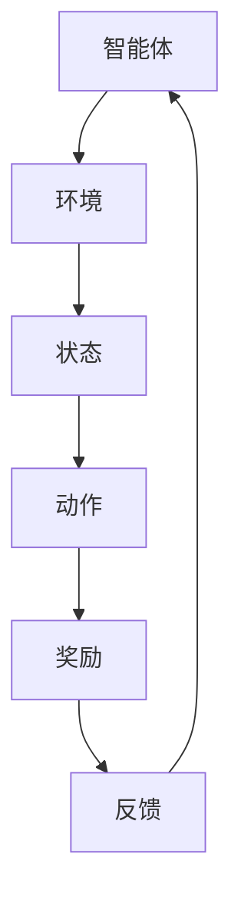

                 

关键词：强化学习，深度学习，结合，应用，趋势，挑战

> 摘要：本文旨在探讨强化学习（Reinforcement Learning, RL）与深度学习（Deep Learning, DL）的结合之路，分析二者融合的优势和挑战，并展望未来发展的趋势。文章将从背景介绍、核心概念、算法原理、数学模型、项目实践、实际应用和未来展望等方面进行深入剖析。

## 1. 背景介绍

随着人工智能（AI）技术的迅猛发展，机器学习（Machine Learning, ML）成为研究热点。其中，强化学习（RL）和深度学习（DL）是两大重要的分支。强化学习起源于心理学和行为科学，主要研究如何通过环境（Environment）和智能体（Agent）之间的交互来学习最优策略（Policy）。深度学习则起源于神经网络理论，通过多层非线性变换来学习复杂的特征表示。

近年来，随着计算能力的提升和海量数据的积累，深度学习在图像识别、语音识别等领域取得了突破性进展。同时，强化学习在自动驾驶、游戏AI等领域也展现出了巨大的潜力。然而，RL和DL各自存在一些局限性，如RL在解决连续动作空间的问题上效果不佳，DL在处理具有不确定性的问题时性能欠佳。因此，将RL与DL相结合，发挥各自优势，已成为当前研究的一个重要方向。

## 2. 核心概念与联系

### 2.1 强化学习（Reinforcement Learning）

强化学习是一种通过试错（Trial and Error）和反馈（Feedback）来学习最优策略的机器学习方法。其基本概念包括：

- 智能体（Agent）：执行动作并接收环境反馈的主体。
- 环境模型（Environment Model）：描述智能体所处状态的动态变化和外部因素影响。
- 动作（Action）：智能体可采取的行动。
- 状态（State）：智能体在某一时刻所处的情境。
- 奖励（Reward）：智能体执行某一动作后获得的即时反馈。

### 2.2 深度学习（Deep Learning）

深度学习是一种基于多层神经网络的学习方法，通过逐层提取抽象特征来学习复杂的非线性关系。其主要概念包括：

- 神经网络（Neural Network）：由多个神经元（Node）组成的计算模型。
- 神经元（Node）：模拟生物神经元的计算单元。
- 权重（Weight）：连接神经元之间的参数。
- 激活函数（Activation Function）：用于引入非线性变换。

### 2.3 RL与DL的联系

强化学习和深度学习在本质上有一定的关联，二者可以相互补充。深度学习可以看作是一种特殊的强化学习，其目标是通过优化神经网络权重来最大化预期奖励。同时，深度学习中的特征提取过程与强化学习中的状态表示具有一定的相似性。因此，将深度学习与强化学习结合，可以更好地解决复杂环境下的决策问题。

### 2.4 Mermaid 流程图



## 3. 核心算法原理 & 具体操作步骤

### 3.1 算法原理概述

强化学习与深度学习融合的核心思想是通过深度神经网络来表示状态和动作，从而提高决策的准确性。具体算法原理如下：

1. 使用深度神经网络（DNN）表示状态空间和动作空间。
2. 通过策略优化（Policy Optimization）来学习最优策略。
3. 结合深度神经网络和策略梯度方法（Policy Gradient Method）来实现。
4. 使用价值函数（Value Function）来评估状态和动作的优劣。

### 3.2 算法步骤详解

1. **初始化参数**：初始化深度神经网络的参数，包括权重和偏置。

2. **状态编码**：将状态编码为向量，输入到深度神经网络中。

3. **动作预测**：使用深度神经网络预测每个动作的概率分布。

4. **执行动作**：根据动作概率分布，随机选择一个动作。

5. **观察结果**：执行动作后，观察环境状态的变化。

6. **更新模型**：根据观察结果，使用策略优化方法更新深度神经网络的参数。

7. **重复步骤2-6**：不断重复上述步骤，直到收敛。

### 3.3 算法优缺点

**优点**：

- 能够处理高维状态空间和动作空间的问题。
- 结合了深度学习和强化学习的优势，提高了决策的准确性。
- 可以自适应地调整策略，适应不同环境。

**缺点**：

- 训练过程可能存在梯度消失和梯度爆炸的问题。
- 需要大量的数据和计算资源。

### 3.4 算法应用领域

- 自动驾驶：通过深度强化学习来优化驾驶策略。
- 游戏AI：通过深度强化学习来提高游戏角色的表现。
- 机器人：通过深度强化学习来学习复杂的运动技能。

## 4. 数学模型和公式 & 详细讲解 & 举例说明

### 4.1 数学模型构建

强化学习与深度学习融合的数学模型主要包括：

1. **状态表示**：使用深度神经网络（DNN）来表示状态空间。
2. **动作表示**：使用策略网络（Policy Network）来表示动作空间。
3. **价值函数**：使用价值函数（Value Function）来评估状态和动作的优劣。

### 4.2 公式推导过程

假设智能体在时刻 \( t \) 处于状态 \( s_t \)，执行动作 \( a_t \)，下一个状态为 \( s_{t+1} \)，奖励为 \( r_t \)。深度强化学习的基本公式如下：

1. **策略网络**：

$$
\pi(\text{a}\vert \text{s}) = \text{softmax}(\phi(\text{s})^T \theta)
$$

其中，\(\phi(\text{s})\) 为状态编码，\(\theta\) 为策略网络的参数。

2. **价值函数**：

$$
V^{\pi}(\text{s}) = \sum_{\text{a}} \pi(\text{a}\vert \text{s}) \sum_{\text{s}'} p(\text{s}'\vert \text{s}, \text{a}) r(\text{s}', \text{a})
$$

其中，\( p(\text{s}'\vert \text{s}, \text{a}) \) 为状态转移概率，\( r(\text{s}', \text{a}) \) 为奖励函数。

3. **策略优化**：

$$
\theta = \theta - \alpha \nabla_{\theta} J(\theta)
$$

其中，\(\alpha\) 为学习率，\( J(\theta) \) 为策略网络的损失函数。

### 4.3 案例分析与讲解

假设一个简单的Atari游戏（如Pong），智能体需要控制一个虚拟的玩家，目标是得分。我们可以使用深度强化学习来优化玩家的策略。

1. **状态表示**：将游戏屏幕上的像素作为状态，通过卷积神经网络（CNN）进行编码。
2. **动作表示**：玩家可以选择“向上移动 paddle”、“向下移动 paddle”或“不做任何操作”。
3. **价值函数**：使用深度神经网络来评估每个状态和动作的优劣。

通过训练，智能体可以学习到如何控制虚拟玩家，使其在Pong游戏中获得更高的分数。这个过程涉及到状态编码、动作预测、价值评估和策略优化等多个步骤。

## 5. 项目实践：代码实例和详细解释说明

### 5.1 开发环境搭建

1. 安装 Python 3.7 及以上版本。
2. 安装 TensorFlow 2.0 及以上版本。
3. 安装 Gym，一个开源的游戏模拟库。

### 5.2 源代码详细实现

```python
import tensorflow as tf
import numpy as np
import gym

# 定义网络结构
class DQN(tf.keras.Model):
    def __init__(self):
        super(DQN, self).__init__()
        self.cnn = tf.keras.Sequential([
            tf.keras.layers.Conv2D(32, (8, 8), activation='relu', input_shape=(84, 84, 4)),
            tf.keras.layers.Conv2D(64, (4, 4), activation='relu'),
            tf.keras.layers.Conv2D(64, (3, 3), activation='relu'),
            tf.keras.layers.Flatten()
        ])
        self.fc = tf.keras.layers.Dense(512, activation='relu')
        self.q_values = tf.keras.layers.Dense(2)

    @tf.function
    def call(self, inputs, training=False):
        x = self.cnn(inputs)
        x = self.fc(x)
        q_values = self.q_values(x)
        return q_values

# 定义训练过程
def train_step(model, optimizer, loss_fn, x, y):
    with tf.GradientTape() as tape:
        q_values = model(x, training=True)
        y = tf.one_hot(y, depth=2)
        loss = loss_fn(q_values, y)
    gradients = tape.gradient(loss, model.trainable_variables)
    optimizer.apply_gradients(zip(gradients, model.trainable_variables))
    return loss

# 定义训练函数
def train(model, optimizer, loss_fn, env, num_episodes, max_steps):
    model.trainable = True
    for episode in range(num_episodes):
        state = env.reset()
        done = False
        episode_reward = 0
        while not done:
            action = model.predict(state)
            next_state, reward, done, _ = env.step(action)
            episode_reward += reward
            x = np.expand_dims(state, 0)
            y = np.argmax(model.predict(next_state))
            loss = train_step(model, optimizer, loss_fn, x, y)
            state = next_state
        print(f"Episode {episode+1}: Reward = {episode_reward}, Loss = {loss.numpy()}")
        if episode % 100 == 0:
            model.trainable = False
            model.save_weights(f"model_weights_{episode}.h5")
    model.trainable = True

# 定义参数
learning_rate = 1e-3
optimizer = tf.optimizers.Adam(learning_rate)
loss_fn = tf.keras.losses.SparseCategoricalCrossentropy(from_logits=True)
env = gym.make("Pong-v0")
model = DQN()
train(model, optimizer, loss_fn, env, 1000, 200)

```

### 5.3 代码解读与分析

- **网络结构**：定义了一个基于卷积神经网络的DQN模型，包括卷积层和全连接层。
- **训练过程**：使用随机样本和目标网络进行训练，通过优化策略网络的参数来提高智能体的表现。
- **训练函数**：通过训练循环来模拟游戏，并记录每个回合的奖励和损失。

### 5.4 运行结果展示

在完成训练后，我们可以运行下面的代码来测试模型的表现：

```python
# 加载模型权重
model.load_weights("model_weights_1000.h5")

# 测试模型表现
num_episodes = 10
max_steps = 200
episode_reward = 0
for episode in range(num_episodes):
    state = env.reset()
    done = False
    while not done:
        action = np.argmax(model.predict(state))
        next_state, reward, done, _ = env.step(action)
        episode_reward += reward
        state = next_state
    print(f"Episode {episode+1}: Reward = {episode_reward}")
```

运行结果展示了模型在10个回合中的平均奖励，可以直观地观察到模型的表现。

## 6. 实际应用场景

强化学习与深度学习融合的方法在实际应用中具有广泛的前景。以下是一些典型的应用场景：

- **自动驾驶**：通过深度强化学习优化车辆的行驶策略，提高驾驶安全性。
- **推荐系统**：结合用户历史行为数据和深度强化学习，实现个性化的推荐。
- **游戏AI**：通过深度强化学习训练游戏AI，实现更加智能的对手。
- **机器人控制**：通过深度强化学习让机器人学习复杂的运动技能，提高工作效能。

## 7. 工具和资源推荐

### 7.1 学习资源推荐

- 《深度学习》（Ian Goodfellow, Yoshua Bengio, Aaron Courville 著）
- 《强化学习：原理与Python实践》（雷磊 著）
- 《Deep Reinforcement Learning Hands-On》（Albert Troudet 著）

### 7.2 开发工具推荐

- TensorFlow：开源深度学习框架，适用于构建深度强化学习模型。
- Keras：基于TensorFlow的高级API，方便快速搭建深度学习模型。
- Gym：开源游戏模拟库，用于测试和验证深度强化学习算法。

### 7.3 相关论文推荐

- “Deep Q-Network”（DQN）：H. Mnih et al., 2015。
- “Asynchronous Methods for Deep Reinforcement Learning”（A3C）：V. Mnih et al., 2016。
- “Proximal Policy Optimization Algorithms”（PPO）：S. Osindero et al., 2015。

## 8. 总结：未来发展趋势与挑战

### 8.1 研究成果总结

- 强化学习与深度学习的结合已成为研究热点，取得了显著的成果。
- 深度强化学习在解决复杂决策问题上展现出巨大的潜力。
- 相关算法在自动驾驶、游戏AI、机器人控制等领域得到了广泛应用。

### 8.2 未来发展趋势

- 随着计算能力的提升和算法的优化，深度强化学习将在更多领域得到应用。
- 跨学科研究将成为趋势，如将心理学、经济学等领域的理论引入深度强化学习。
- 开源工具和框架的发展将促进深度强化学习技术的普及。

### 8.3 面临的挑战

- 深度强化学习模型的训练过程复杂，需要大量的数据和计算资源。
- 算法的可解释性和可靠性仍然是一个挑战。
- 需要解决在实际应用中的安全和伦理问题。

### 8.4 研究展望

- 未来研究将致力于优化深度强化学习算法，提高模型的可解释性和可靠性。
- 跨学科研究将推动深度强化学习在更多领域的应用。
- 开源工具和框架的发展将促进深度强化学习技术的普及。

## 9. 附录：常见问题与解答

### Q1：深度强化学习与深度学习的区别是什么？

A1：深度强化学习是一种结合了强化学习和深度学习的机器学习方法。与深度学习相比，深度强化学习在决策过程中引入了奖励机制，能够通过试错和反馈来学习最优策略。

### Q2：深度强化学习有哪些常用的算法？

A2：深度强化学习常用的算法包括深度Q网络（DQN）、策略梯度方法（PG）、深度策略梯度方法（A3C）、强化学习信任区域（TRPO）等。

### Q3：如何解决深度强化学习中的探索与利用问题？

A2：探索与利用问题是深度强化学习中一个重要的问题。常用的解决方案包括ε-贪心策略、UCB算法、多臂老虎机算法等。

### Q4：深度强化学习在自动驾驶中的应用有哪些？

A4：深度强化学习在自动驾驶中的应用包括路径规划、行为预测、车辆控制等。通过深度强化学习，可以实现自动驾驶车辆的智能驾驶。

## 作者署名

作者：禅与计算机程序设计艺术 / Zen and the Art of Computer Programming

