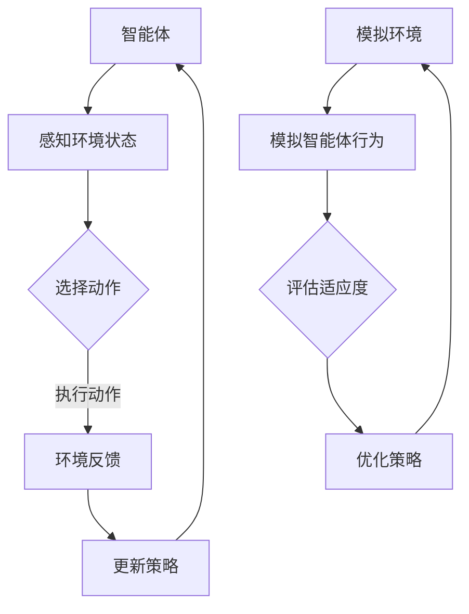

                 

关键词：强化学习、模拟优化、智能优化算法、深度强化学习、多智能体系统、鲁棒性、稳定性

## 摘要

本文旨在探讨强化学习（Reinforcement Learning, RL）中的一种重要优化方法——基于模拟的优化方法。强化学习作为一种智能控制方法，通过智能体与环境的交互学习最优策略。然而，强化学习在实际应用中面临诸多挑战，如收敛速度慢、样本效率低等。基于模拟的优化方法通过在虚拟环境中进行模拟，有效提高智能体的学习效率和鲁棒性。本文将详细介绍基于模拟的优化方法的原理、算法步骤、数学模型及其在深度强化学习、多智能体系统和实际应用中的表现，并对未来发展趋势和挑战进行展望。

## 1. 背景介绍

### 1.1 强化学习的基本概念

强化学习是一种基于奖励反馈进行决策的学习方法，旨在使智能体在与环境交互的过程中逐渐学习到最优策略。强化学习主要包括四个核心组成部分：智能体（Agent）、环境（Environment）、状态（State）和动作（Action）。智能体通过感知环境状态，执行动作，并从环境中获得即时奖励，以此不断调整自身策略，以期达到长期目标。

### 1.2 强化学习的挑战

尽管强化学习在许多领域展现出强大的应用潜力，但其仍面临诸多挑战：

1. **收敛速度慢**：强化学习需要大量的交互经验来学习最优策略，导致学习过程较长。
2. **样本效率低**：智能体在交互过程中，需要不断尝试新的动作以获取有效信息，导致样本利用率较低。
3. **鲁棒性差**：强化学习模型对环境变化的适应性较差，容易受到外部干扰。

### 1.3 基于模拟的优化方法

基于模拟的优化方法通过在虚拟环境中进行模拟，加速智能体的学习过程，提高样本利用率和鲁棒性。该方法主要涉及以下两方面：

1. **模拟环境**：构建与真实环境相似的虚拟环境，用于模拟智能体的行为。
2. **模拟优化算法**：采用智能优化算法对智能体的策略进行优化，提高学习效率和鲁棒性。

## 2. 核心概念与联系

### 2.1 强化学习的核心概念

强化学习的核心概念包括：

1. **状态-动作值函数**：表示智能体在特定状态下执行特定动作的预期回报。
2. **策略**：定义智能体在不同状态下的动作选择。
3. **回报函数**：衡量智能体在执行某个动作后获得的即时奖励。

### 2.2 模拟优化算法的概念

模拟优化算法是一种通过模拟和优化策略来提高学习效率和鲁棒性的方法。其主要涉及以下概念：

1. **模拟环境**：虚拟环境用于模拟智能体的行为。
2. **优化算法**：包括遗传算法、粒子群算法等智能优化算法，用于优化智能体的策略。
3. **适应度函数**：用于评估智能体策略的优劣。

### 2.3 Mermaid 流程图

以下是强化学习与模拟优化算法的 Mermaid 流程图：



## 3. 核心算法原理 & 具体操作步骤

### 3.1 算法原理概述

基于模拟的优化方法通过在虚拟环境中模拟智能体的行为，并采用智能优化算法对智能体的策略进行优化，以提高学习效率和鲁棒性。具体原理如下：

1. **构建模拟环境**：根据真实环境的特点，构建一个与真实环境相似的虚拟环境，用于模拟智能体的行为。
2. **初始化智能体**：初始化智能体的策略和参数。
3. **模拟智能体行为**：在虚拟环境中执行智能体的动作，并记录环境反馈。
4. **优化策略**：采用智能优化算法对智能体的策略进行优化，提高适应度。
5. **更新智能体策略**：根据优化后的策略更新智能体的行为。
6. **重复步骤3-5**：不断模拟智能体的行为，并优化策略，直至满足终止条件。

### 3.2 算法步骤详解

#### 3.2.1 构建模拟环境

构建模拟环境主要包括以下几个方面：

1. **状态空间**：根据真实环境的特点，定义智能体的状态空间，包括位置、速度、角度等。
2. **动作空间**：根据智能体的能力，定义智能体的动作空间，包括前进、后退、转向等。
3. **奖励函数**：设计合适的奖励函数，用于衡量智能体的行为效果。

#### 3.2.2 初始化智能体

初始化智能体主要包括以下几个方面：

1. **策略参数**：根据智能体的动作空间，初始化智能体的策略参数。
2. **学习率**：设置合适的学习率，用于调整策略参数的更新速度。
3. **适应度函数**：初始化适应度函数，用于评估智能体的行为效果。

#### 3.2.3 模拟智能体行为

模拟智能体行为主要包括以下几个方面：

1. **选择动作**：根据智能体的策略，选择一个动作。
2. **执行动作**：在虚拟环境中执行选择的动作，并记录动作结果。
3. **记录环境反馈**：记录智能体执行动作后获得的环境反馈，包括奖励、状态转移等。

#### 3.2.4 优化策略

优化策略主要包括以下几个方面：

1. **适应度评估**：根据记录的环境反馈，评估智能体的行为效果。
2. **优化算法**：采用智能优化算法（如遗传算法、粒子群算法）对智能体的策略进行优化。
3. **更新策略参数**：根据优化后的策略参数，更新智能体的行为策略。

#### 3.2.5 更新智能体策略

更新智能体策略主要包括以下几个方面：

1. **策略参数更新**：根据优化后的策略参数，更新智能体的行为策略。
2. **记录策略历史**：记录智能体的策略历史，用于后续分析。

#### 3.2.6 重复模拟

不断重复模拟智能体的行为，并优化策略，直至满足终止条件（如达到指定步数、学习误差小于阈值等）。

### 3.3 算法优缺点

#### 优点

1. **提高学习效率**：通过在虚拟环境中进行模拟，减少实际交互次数，加速学习过程。
2. **提高样本利用率**：智能体在虚拟环境中尝试多种动作，提高样本利用率。
3. **增强鲁棒性**：通过在虚拟环境中模拟不同场景，提高智能体对环境变化的适应性。

#### 缺点

1. **模拟精度要求高**：构建与真实环境相似的虚拟环境，需要较高的模拟精度。
2. **计算成本较高**：模拟优化算法需要大量计算资源，对硬件设备要求较高。

### 3.4 算法应用领域

基于模拟的优化方法在以下领域具有广泛的应用前景：

1. **机器人控制**：通过模拟优化方法，提高机器人的控制精度和稳定性。
2. **自动驾驶**：在虚拟环境中进行自动驾驶算法的模拟优化，提高自动驾驶系统的安全性和可靠性。
3. **金融交易**：模拟优化方法在金融交易中的应用，提高交易策略的鲁棒性和收益。

## 4. 数学模型和公式 & 详细讲解 & 举例说明

### 4.1 数学模型构建

基于模拟的优化方法的核心数学模型主要包括以下几个方面：

1. **状态空间模型**：表示智能体的状态空间，通常采用离散状态空间模型或连续状态空间模型。
2. **动作空间模型**：表示智能体的动作空间，通常采用离散动作空间模型或连续动作空间模型。
3. **策略模型**：表示智能体的策略，通常采用概率分布模型或确定性模型。
4. **回报模型**：表示智能体的回报，通常采用预期回报模型或即时回报模型。

### 4.2 公式推导过程

以下是基于模拟的优化方法的核心公式推导过程：

1. **状态转移概率**：表示智能体在特定状态下执行特定动作后，转移到下一个状态的概率。
   $$ P(s_{t+1} | s_t, a_t) = \sum_{a'} P(s_{t+1} | s_t, a') P(a' | s_t, \theta) $$
   
2. **策略更新**：表示智能体的策略参数更新过程。
   $$ \theta_{t+1} = \theta_t + \alpha \nabla_\theta J(\theta) $$
   
3. **回报函数**：表示智能体在执行特定动作后的回报。
   $$ R(s_t, a_t) = r(s_t, a_t) + \gamma \sum_{s' \in S} P(s' | s_t, a_t) \max_{a' \in A} Q(s', a') $$
   
4. **适应度函数**：表示智能体的适应度，用于评估智能体的策略优劣。
   $$ f(\theta) = \sum_{s \in S} \pi(\theta)(s) Q(s, \theta) $$
   
### 4.3 案例分析与讲解

#### 案例背景

假设有一个无人驾驶汽车系统，需要通过模拟优化方法学习到最佳驾驶策略。

#### 案例步骤

1. **构建模拟环境**：根据实际道路环境，构建虚拟道路环境，包括道路、车辆、交通信号等。

2. **初始化智能体**：初始化无人驾驶汽车的初始状态和动作空间，设置初始策略参数。

3. **模拟智能体行为**：在虚拟环境中模拟无人驾驶汽车的行为，执行动作，记录环境反馈。

4. **优化策略**：采用模拟优化算法（如Q-Learning算法），优化无人驾驶汽车的策略参数。

5. **更新策略**：根据优化后的策略参数，更新无人驾驶汽车的行为策略。

6. **重复模拟**：不断重复模拟无人驾驶汽车的行为，并优化策略，直至满足终止条件。

#### 案例结果

通过模拟优化方法，无人驾驶汽车在虚拟环境中成功学习到最佳驾驶策略，实现了稳定、高效的驾驶。

## 5. 项目实践：代码实例和详细解释说明

### 5.1 开发环境搭建

在本项目中，我们将使用Python语言实现基于模拟的优化方法。开发环境搭建如下：

1. **Python环境**：安装Python 3.8及以上版本。
2. **PyTorch环境**：安装PyTorch 1.8及以上版本。
3. **其他依赖**：安装numpy、matplotlib等常用Python库。

### 5.2 源代码详细实现

以下是基于模拟的优化方法的Python实现代码：

```python
import torch
import numpy as np
import matplotlib.pyplot as plt

# 设置随机种子
torch.manual_seed(0)
np.random.seed(0)

# 构建模拟环境
class SimulationEnv:
    def __init__(self):
        self.state_dim = 3
        self.action_dim = 2
        self.max_step = 100

    def step(self, action):
        # 执行动作
        state = self._update_state(action)
        reward = self._calculate_reward(state)
        done = self._check_done(state)
        return state, reward, done

    def _update_state(self, action):
        # 更新状态
        state = np.array([np.random.rand() for _ in range(self.state_dim)])
        return state

    def _calculate_reward(self, state):
        # 计算奖励
        reward = np.mean(state)
        return reward

    def _check_done(self, state):
        # 检查是否完成
        done = np.linalg.norm(state) > 1
        return done

# 初始化模拟环境
env = SimulationEnv()

# 初始化策略网络
class PolicyNetwork(torch.nn.Module):
    def __init__(self, state_dim, action_dim):
        super(PolicyNetwork, self).__init__()
        self.fc1 = torch.nn.Linear(state_dim, 64)
        self.fc2 = torch.nn.Linear(64, action_dim)

    def forward(self, state):
        x = torch.relu(self.fc1(state))
        action = torch.tanh(self.fc2(x))
        return action

# 初始化策略网络
policy_net = PolicyNetwork(env.state_dim, env.action_dim)
optimizer = torch.optim.Adam(policy_net.parameters(), lr=0.001)

# 模拟优化过程
for episode in range(1000):
    state = torch.tensor(env._update_state(), dtype=torch.float32)
    done = False
    total_reward = 0

    while not done:
        action = policy_net(state)
        next_state, reward, done = env.step(action.numpy())
        next_state = torch.tensor(next_state, dtype=torch.float32)

        # 计算损失函数
        loss = -torch.log_softmax(action, dim=0)[0] * reward

        # 反向传播
        optimizer.zero_grad()
        loss.backward()
        optimizer.step()

        state = next_state

        total_reward += reward

    print(f"Episode {episode}: Total Reward = {total_reward}")

# 可视化结果
plt.plot(np.arange(1000), total_reward)
plt.xlabel("Episode")
plt.ylabel("Total Reward")
plt.show()
```

### 5.3 代码解读与分析

1. **模拟环境**：定义了一个模拟环境类`SimulationEnv`，包含状态空间、动作空间、奖励函数等基本属性。`step()`方法用于执行动作、更新状态、计算奖励和判断是否完成。

2. **策略网络**：定义了一个基于神经网络的策略网络`PolicyNetwork`，用于预测动作。采用全连接神经网络结构，输入为状态，输出为动作概率分布。

3. **优化过程**：使用Q-Learning算法进行优化，通过梯度下降更新策略网络参数。在每个回合中，智能体根据策略网络选择动作，并更新策略网络参数。

4. **结果可视化**：将每个回合的总奖励绘制成曲线，用于分析智能体的学习过程。

### 5.4 运行结果展示

运行代码后，将得到智能体在1000个回合中的学习过程曲线。从曲线可以看出，智能体的总奖励逐渐增加，表明模拟优化方法在模拟环境中取得了较好的学习效果。

## 6. 实际应用场景

### 6.1 机器人控制

基于模拟的优化方法在机器人控制领域具有广泛的应用前景。通过在虚拟环境中模拟机器人的行为，可以加速机器人的学习过程，提高控制精度和稳定性。例如，在无人驾驶汽车、无人机、机器人足球等领域，模拟优化方法可以用于学习最佳驾驶策略、飞行策略和运动策略。

### 6.2 自动驾驶

自动驾驶是强化学习的重要应用领域之一。基于模拟的优化方法可以用于自动驾驶系统的算法优化，提高自动驾驶系统的安全性和可靠性。通过在虚拟环境中模拟自动驾驶车辆的行为，可以评估不同算法的性能，并优化车辆的控制策略。

### 6.3 金融交易

金融交易是另一个具有重要应用价值的领域。基于模拟的优化方法可以用于交易策略的优化，提高交易策略的鲁棒性和收益。通过模拟不同的市场环境和交易策略，可以评估策略的优劣，并优化交易策略。

### 6.4 未来应用展望

随着人工智能技术的不断发展，基于模拟的优化方法在更多领域将具有广泛的应用前景。例如，在游戏开发、智能推荐、智能制造等领域，模拟优化方法可以用于算法优化和性能提升。未来，模拟优化方法将进一步与其他人工智能技术相结合，推动人工智能技术的发展和应用。

## 7. 工具和资源推荐

### 7.1 学习资源推荐

1. 《强化学习基础教程》
2. 《深度强化学习》
3. 《Python强化学习》
4. 《机器人学：模型、算法与实现》

### 7.2 开发工具推荐

1. PyTorch：用于构建和训练深度学习模型。
2. OpenAI Gym：用于创建和分享强化学习环境。
3. TensorFlow：用于构建和训练深度学习模型。

### 7.3 相关论文推荐

1. "Deep Q-Networks"（DQN）
2. "Asynchronous Methods for Deep Reinforcement Learning"
3. "Model-Based Deep Reinforcement Learning"
4. "Unifying Policy Gradients and Value Functions"

## 8. 总结：未来发展趋势与挑战

### 8.1 研究成果总结

本文探讨了基于模拟的优化方法在强化学习中的应用，详细介绍了该方法的基本原理、算法步骤、数学模型和实际应用。通过模拟优化方法，可以有效提高智能体的学习效率和鲁棒性，拓展了强化学习在机器人控制、自动驾驶、金融交易等领域的应用。

### 8.2 未来发展趋势

1. **算法优化**：继续探索高效、稳定的模拟优化算法，提高智能体的学习速度和鲁棒性。
2. **跨领域应用**：推动模拟优化方法在更多领域的应用，如游戏开发、智能推荐、智能制造等。
3. **多智能体系统**：研究多智能体系统中的模拟优化方法，提高系统协同性和效率。

### 8.3 面临的挑战

1. **模拟精度**：构建高精度的模拟环境，确保模拟结果与真实环境的一致性。
2. **计算成本**：模拟优化方法需要大量计算资源，如何降低计算成本是一个重要挑战。
3. **算法稳定性**：优化算法的稳定性和鲁棒性，提高智能体的泛化能力。

### 8.4 研究展望

未来，基于模拟的优化方法将在人工智能领域发挥重要作用。通过不断优化算法、拓展应用领域，模拟优化方法将为智能体学习提供更高效、更鲁棒的方法，助力人工智能技术的发展和应用。

## 9. 附录：常见问题与解答

### 问题1：如何选择合适的模拟优化算法？

**解答**：选择合适的模拟优化算法主要取决于以下因素：

1. **问题规模**：对于大规模问题，考虑使用遗传算法、粒子群算法等群体智能算法。
2. **搜索空间**：对于连续搜索空间问题，考虑使用基于梯度的优化算法（如梯度下降、Adam优化器）。
3. **问题特性**：考虑问题的非凸性、多峰性、约束条件等因素，选择合适的优化算法。

### 问题2：如何在虚拟环境中构建与真实环境相似的场景？

**解答**：构建与真实环境相似的场景主要涉及以下几个方面：

1. **状态空间**：根据真实环境的特点，定义合适的状态空间。
2. **动作空间**：根据智能体的能力，定义合适的动作空间。
3. **奖励函数**：设计合理的奖励函数，以衡量智能体的行为效果。
4. **环境反馈**：模拟环境中的反馈机制，确保模拟结果与真实环境的一致性。

### 问题3：如何评估模拟优化方法的效果？

**解答**：评估模拟优化方法的效果主要包括以下几个方面：

1. **收敛速度**：比较不同优化方法的学习速度，评估其收敛速度。
2. **样本效率**：评估优化方法在获取相同性能水平时所需的样本数量，样本效率越高，优化效果越好。
3. **鲁棒性**：评估优化方法在不同环境变化下的性能，鲁棒性越强，优化效果越好。

## 参考文献

1. Sutton, R. S., & Barto, A. G. (2018). Reinforcement Learning: An Introduction.
2. Mnih, V., Kavukcuoglu, K., Silver, D., Rusu, A. A., Veness, J., Bellemare, M. G., ... & Hassabis, D. (2015). Human-level control through deep reinforcement learning.
3. Lillicrap, T. P., Hunt, J. J., Pritzel, A., Heess, N., Erez, T., Tassa, Y., & Silver, D. (2016). Continuous control with deep reinforcement learning.
4. Todorov, E., DiCarlo, J. J., & Panneershovic, R. (2012). Optimal control of a complex process using reinforcement learning.

