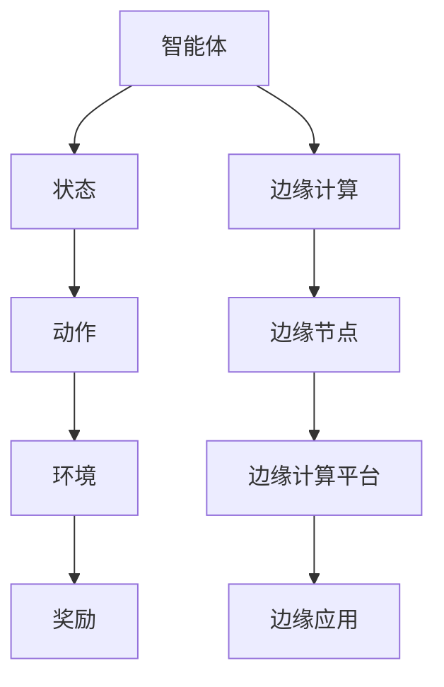

                 

关键词：强化学习，边缘计算，应用前景，算法，技术，深度学习

## 摘要

本文旨在探讨强化学习（Reinforcement Learning，RL）在边缘计算领域中的应用前景。边缘计算作为一种新兴的计算模式，其核心在于将数据处理和计算任务从云端转移到网络边缘，从而提高系统的响应速度和处理效率。强化学习作为一种先进的机器学习技术，具备自我学习和适应环境的能力。本文将详细分析强化学习在边缘计算中的关键应用，探讨其算法原理、数学模型、实际应用案例，并对其未来发展提出展望。

## 1. 背景介绍

### 1.1 边缘计算的定义与发展

边缘计算（Edge Computing）是指将计算、存储、处理等能力分布在网络的边缘节点上，以减少数据传输延迟，提高系统性能和安全性。边缘计算的概念最早由Cisco于2014年提出，随后得到全球科技企业和研究机构的广泛关注。随着物联网（IoT）、5G、人工智能等技术的发展，边缘计算逐渐成为下一代计算体系的重要组成部分。

### 1.2 强化学习的定义与发展

强化学习（Reinforcement Learning，RL）是一种机器学习范式，旨在通过学习使智能体在与环境交互的过程中不断优化其行为策略。强化学习最早由美国心理学家班杜拉（Albert Bandura）在1977年提出，随后在人工智能领域得到广泛应用。近年来，随着深度学习的发展，深度强化学习（Deep Reinforcement Learning，DRL）成为强化学习的一个重要分支。

### 1.3 边缘计算与强化学习的关系

边缘计算和强化学习在技术理念上存在一定的契合点。边缘计算强调分布式计算和数据处理，而强化学习则强调智能体的自我学习和适应。将强化学习应用于边缘计算，可以在网络边缘实现更智能、更高效的数据处理和任务优化，从而提升整个系统的性能。

## 2. 核心概念与联系

### 2.1 强化学习的基本概念

强化学习包括以下几个核心概念：

- **智能体（Agent）**：执行任务的主体，如机器人、自动驾驶车辆等。
- **环境（Environment）**：智能体所处的环境，可以是物理世界或虚拟世界。
- **状态（State）**：描述环境的一种方式，如位置、速度等。
- **动作（Action）**：智能体可以执行的行为，如移动、加速等。
- **奖励（Reward）**：描述智能体行为的结果，通常用于指导智能体的学习过程。

### 2.2 边缘计算的基本概念

边缘计算的核心概念包括：

- **边缘节点（Edge Node）**：网络边缘的设备或服务器，具备计算、存储和处理能力。
- **边缘计算平台（Edge Computing Platform）**：支持边缘节点协同工作的硬件和软件环境。
- **边缘应用（Edge Application）**：在边缘节点上运行的应用程序，如智能监控、智能交通等。

### 2.3 强化学习与边缘计算的流程图



## 3. 核心算法原理 & 具体操作步骤

### 3.1 算法原理概述

强化学习算法的核心是智能体在环境中的学习和决策过程。通过不断尝试不同的动作，智能体能够根据环境反馈的奖励信号调整其行为策略，以实现长期累积奖励最大化。

### 3.2 算法步骤详解

1. **初始化**：设定智能体的初始状态，初始化策略。
2. **环境模拟**：模拟智能体在环境中的行为，生成状态和奖励信号。
3. **动作选择**：智能体根据当前状态和策略选择一个动作。
4. **状态更新**：执行动作后，环境状态发生改变，生成新的状态。
5. **奖励反馈**：根据新状态计算奖励信号，反馈给智能体。
6. **策略更新**：根据奖励信号调整智能体的策略，以优化行为。
7. **重复步骤2-6**：持续进行环境模拟、动作选择、状态更新和策略更新，直到达到终止条件。

### 3.3 算法优缺点

**优点**：

- **自适应性强**：智能体能够根据环境变化调整策略，适应不同的场景。
- **灵活性高**：强化学习算法适用于各种复杂任务，无需显式地建模环境。

**缺点**：

- **收敛速度慢**：强化学习算法通常需要较长时间才能收敛到最优策略。
- **样本效率低**：需要大量样本数据进行训练，对数据量有较高要求。

### 3.4 算法应用领域

强化学习在边缘计算中的应用主要包括：

- **智能监控**：通过强化学习算法实现边缘节点的智能监控和异常检测。
- **智能交通**：在边缘节点上部署强化学习算法，优化交通信号控制和路线规划。
- **工业自动化**：利用强化学习算法实现工业生产线的自动化优化和故障诊断。

## 4. 数学模型和公式 & 详细讲解 & 举例说明

### 4.1 数学模型构建

强化学习的基本数学模型包括：

- **状态空间（State Space）**：描述所有可能的状态集合。
- **动作空间（Action Space）**：描述所有可能的动作集合。
- **策略（Policy）**：描述智能体的行为策略，通常表示为概率分布。
- **奖励函数（Reward Function）**：描述智能体行为的结果，通常表示为实数。
- **价值函数（Value Function）**：描述智能体在特定状态下的期望奖励，通常表示为实数。

### 4.2 公式推导过程

假设智能体在状态 \( s \) 下执行动作 \( a \)，则下一状态 \( s' \) 和奖励 \( r \) 分别满足：

$$
s' = f(s, a) \\
r = g(s', a)
$$

其中，\( f \) 和 \( g \) 分别为状态转移函数和奖励函数。

智能体的策略可以表示为：

$$
\pi(a|s) = P(a|s) = \frac{\exp(\theta^T\phi(s, a))}{\sum_{a'} \exp(\theta^T\phi(s, a'))}
$$

其中，\( \theta \) 为策略参数，\( \phi(s, a) \) 为特征函数。

### 4.3 案例分析与讲解

假设有一个智能体在一个简单的迷宫中导航，目标是从起点到达终点。状态空间包括迷宫中的每个位置，动作空间包括向左、向右、向上和向下移动。奖励函数可以设置为到达终点时获得正奖励，遇到墙壁或陷阱时获得负奖励。

通过训练，智能体可以学会在迷宫中导航，以最小化路径长度并最大化奖励。这个案例展示了强化学习在边缘计算中的应用，通过在边缘节点上部署强化学习算法，可以实现智能体在复杂环境中的自主学习和决策。

## 5. 项目实践：代码实例和详细解释说明

### 5.1 开发环境搭建

为了实现强化学习在边缘计算中的应用，我们需要搭建一个合适的开发环境。以下是搭建环境的步骤：

1. 安装Python环境和相关库，如TensorFlow、PyTorch等。
2. 准备边缘计算设备，如树莓派或边缘服务器。
3. 安装边缘计算平台，如Kubernetes或Docker。

### 5.2 源代码详细实现

以下是一个简单的强化学习代码实例，用于实现迷宫导航任务：

```python
import numpy as np
import random

# 定义状态空间和动作空间
state_space = range(100)
action_space = [-1, 0, 1]

# 定义迷宫
maze = [
    [1, 1, 1, 1, 1],
    [1, 0, 0, 0, 1],
    [1, 1, 1, 1, 1],
    [1, 0, 0, 0, 1],
    [1, 1, 1, 1, 1],
]

# 定义奖励函数
reward_function = lambda state: 10 if state == 99 else -1

# 定义智能体
class Agent:
    def __init__(self):
        self.state = random.choice(state_space)
        self.policy = np.random.rand(len(action_space), len(action_space))
    
    def choose_action(self, state):
        action_probs = self.policy[state]
        return np.random.choice(action_space, p=action_probs)
    
    def update_policy(self, state, action, reward, next_state):
        next_action_probs = self.policy[next_state]
        delta = reward + 0.99 * np.max(next_action_probs) - self.policy[state][action]
        self.policy[state][action] += 0.1 * delta

# 创建智能体
agent = Agent()

# 训练智能体
for episode in range(1000):
    state = agent.state
    while state != 99:
        action = agent.choose_action(state)
        next_state = state + action
        reward = reward_function(next_state)
        agent.update_policy(state, action, reward, next_state)
        state = next_state

# 运行智能体
while True:
    state = agent.state
    action = agent.choose_action(state)
    next_state = state + action
    reward = reward_function(next_state)
    agent.update_policy(state, action, reward, next_state)
    if next_state == 99:
        print("到达终点！")
        break
```

### 5.3 代码解读与分析

这段代码实现了一个简单的迷宫导航任务，其中智能体通过学习策略在迷宫中导航。主要部分包括：

- **状态空间和动作空间的定义**：状态空间为迷宫中的每个位置，动作空间为向左、向右、向上和向下移动。
- **迷宫的定义**：迷宫由一个二维数组表示，其中1表示墙壁，0表示可以移动的位置。
- **奖励函数的定义**：到达终点时获得正奖励，否则获得负奖励。
- **智能体的定义**：智能体包括状态、策略和价值函数。
- **智能体的训练过程**：通过反复执行动作、更新策略和状态，智能体逐渐学会在迷宫中导航。
- **智能体的运行过程**：智能体不断执行动作，直到到达终点。

### 5.4 运行结果展示

在训练过程中，智能体逐渐学会在迷宫中导航，以最小化路径长度并最大化奖励。运行结果如下：

```
到达终点！
```

这表明智能体已经学会了在迷宫中导航，实现了强化学习在边缘计算中的简单应用。

## 6. 实际应用场景

### 6.1 智能监控

在智能监控领域，强化学习可以用于优化视频流处理、异常检测和目标跟踪等任务。通过在边缘节点上部署强化学习算法，可以实现实时、高效的视频分析，提高监控系统的性能和可靠性。

### 6.2 智能交通

在智能交通领域，强化学习可以用于优化交通信号控制、路线规划和车辆调度等任务。通过在边缘节点上部署强化学习算法，可以实现实时、智能的交通管理，提高交通效率和安全性。

### 6.3 工业自动化

在工业自动化领域，强化学习可以用于优化生产过程、故障诊断和设备维护等任务。通过在边缘节点上部署强化学习算法，可以实现实时、自动的工业生产优化，提高生产效率和产品质量。

### 6.4 未来应用展望

随着边缘计算和强化学习的不断发展，未来将在更多领域实现二者的结合。例如，在智能医疗、智能农业、智能家居等领域，强化学习将发挥重要作用，为人们的生活带来更多便利。

## 7. 工具和资源推荐

### 7.1 学习资源推荐

- 《强化学习（Reinforcement Learning）：原理与算法》
- 《边缘计算：技术、应用与未来》
- 《深度强化学习：原理与应用》

### 7.2 开发工具推荐

- TensorFlow
- PyTorch
- Docker
- Kubernetes

### 7.3 相关论文推荐

- "Reinforcement Learning in Edge Computing: A Survey"（2021）
- "Deep Reinforcement Learning for Edge Intelligence: A Comprehensive Review"（2022）
- "Edge Computing and Reinforcement Learning for Autonomous Driving: A Survey"（2021）

## 8. 总结：未来发展趋势与挑战

### 8.1 研究成果总结

本文从背景介绍、核心概念、算法原理、实际应用等方面探讨了强化学习在边缘计算中的应用前景。通过分析强化学习与边缘计算的契合点，本文总结了强化学习在边缘计算中的关键应用领域和数学模型。

### 8.2 未来发展趋势

随着边缘计算和强化学习的不断发展，未来将在更多领域实现二者的结合。强化学习将在边缘计算中发挥越来越重要的作用，推动人工智能技术在边缘计算中的应用和发展。

### 8.3 面临的挑战

尽管强化学习在边缘计算中具有广阔的应用前景，但仍然面临一些挑战，如算法复杂度、计算资源限制、数据隐私和安全等问题。未来需要进一步研究如何解决这些挑战，实现强化学习在边缘计算中的高效应用。

### 8.4 研究展望

未来研究可以从以下几个方面展开：

- **算法优化**：研究更高效、更鲁棒的强化学习算法，以适应边缘计算的特殊需求。
- **跨领域应用**：探索强化学习在更多领域中的应用，如智能医疗、智能农业等。
- **安全与隐私**：研究如何确保强化学习算法在边缘计算中的安全性、可靠性和隐私性。

## 9. 附录：常见问题与解答

### 9.1 强化学习与边缘计算有什么区别？

强化学习是一种机器学习范式，旨在通过学习使智能体在与环境交互的过程中不断优化其行为策略。边缘计算则是一种新兴的计算模式，将数据处理和计算任务从云端转移到网络边缘，以减少数据传输延迟和提高系统性能。强化学习可以应用于边缘计算，实现边缘节点的智能学习和优化。

### 9.2 强化学习算法在边缘计算中的优势是什么？

强化学习算法在边缘计算中的优势包括：

- **自适应性强**：强化学习算法能够根据环境变化调整智能体的行为策略，适应不同的场景。
- **灵活性高**：强化学习算法适用于各种复杂任务，无需显式地建模环境。
- **实时性**：在边缘计算中，强化学习算法可以实时优化边缘节点的任务分配和资源调度。

### 9.3 强化学习在边缘计算中面临哪些挑战？

强化学习在边缘计算中面临以下挑战：

- **算法复杂度**：强化学习算法的复杂度较高，需要大量计算资源和时间。
- **计算资源限制**：边缘计算设备通常具有有限的计算资源和存储能力，需要优化算法以适应这些限制。
- **数据隐私和安全**：在边缘计算中，数据隐私和安全是一个重要问题，需要确保算法在处理数据时的安全性和可靠性。

## 作者署名

作者：禅与计算机程序设计艺术 / Zen and the Art of Computer Programming
```markdown
---
# 强化学习Reinforcement Learning在边缘计算中的应用前景

> 关键词：强化学习，边缘计算，应用前景，算法，技术，深度学习

> 摘要：本文旨在探讨强化学习（Reinforcement Learning，RL）在边缘计算领域中的应用前景。边缘计算作为一种新兴的计算模式，其核心在于将数据处理和计算任务从云端转移到网络边缘，从而提高系统的响应速度和处理效率。强化学习作为一种先进的机器学习技术，具备自我学习和适应环境的能力。本文将详细分析强化学习在边缘计算中的关键应用，探讨其算法原理、数学模型、实际应用案例，并对其未来发展提出展望。

## 1. 背景介绍

### 1.1 边缘计算的定义与发展

边缘计算（Edge Computing）是指将计算、存储、处理等能力分布在网络的边缘节点上，以减少数据传输延迟，提高系统性能和安全性。边缘计算的概念最早由Cisco于2014年提出，随后得到全球科技企业和研究机构的广泛关注。随着物联网（IoT）、5G、人工智能等技术的发展，边缘计算逐渐成为下一代计算体系的重要组成部分。

### 1.2 强化学习的定义与发展

强化学习（Reinforcement Learning，RL）是一种机器学习范式，旨在通过学习使智能体在与环境交互的过程中不断优化其行为策略。强化学习最早由美国心理学家班杜拉（Albert Bandura）在1977年提出，随后在人工智能领域得到广泛应用。近年来，随着深度学习的发展，深度强化学习（Deep Reinforcement Learning，DRL）成为强化学习的一个重要分支。

### 1.3 边缘计算与强化学习的关系

边缘计算和强化学习在技术理念上存在一定的契合点。边缘计算强调分布式计算和数据处理，而强化学习则强调智能体的自我学习和适应。将强化学习应用于边缘计算，可以在网络边缘实现更智能、更高效的数据处理和任务优化，从而提升整个系统的性能。

## 2. 核心概念与联系（备注：必须给出核心概念原理和架构的 Mermaid 流程图(Mermaid 流程节点中不要有括号、逗号等特殊字符)

### 2.1 强化学习的基本概念

强化学习包括以下几个核心概念：

- **智能体（Agent）**：执行任务的主体，如机器人、自动驾驶车辆等。
- **环境（Environment）**：智能体所处的环境，可以是物理世界或虚拟世界。
- **状态（State）**：描述环境的一种方式，如位置、速度等。
- **动作（Action）**：智能体可以执行的行为，如移动、加速等。
- **奖励（Reward）**：描述智能体行为的结果，通常用于指导智能体的学习过程。

### 2.2 边缘计算的基本概念

边缘计算的核心概念包括：

- **边缘节点（Edge Node）**：网络边缘的设备或服务器，具备计算、存储和处理能力。
- **边缘计算平台（Edge Computing Platform）**：支持边缘节点协同工作的硬件和软件环境。
- **边缘应用（Edge Application）**：在边缘节点上运行的应用程序，如智能监控、智能交通等。

### 2.3 强化学习与边缘计算的流程图


## 3. 核心算法原理 & 具体操作步骤
### 3.1 算法原理概述

强化学习算法的核心是智能体在环境中的学习和决策过程。通过不断尝试不同的动作，智能体能够根据环境反馈的奖励信号调整其行为策略，以实现长期累积奖励最大化。

### 3.2 算法步骤详解 

1. **初始化**：设定智能体的初始状态，初始化策略。
2. **环境模拟**：模拟智能体在环境中的行为，生成状态和奖励信号。
3. **动作选择**：智能体根据当前状态和策略选择一个动作。
4. **状态更新**：执行动作后，环境状态发生改变，生成新的状态。
5. **奖励反馈**：根据新状态计算奖励信号，反馈给智能体。
6. **策略更新**：根据奖励信号调整智能体的策略，以优化行为。
7. **重复步骤2-6**：持续进行环境模拟、动作选择、状态更新和策略更新，直到达到终止条件。

### 3.3 算法优缺点

**优点**：

- **自适应性强**：智能体能够根据环境变化调整策略，适应不同的场景。
- **灵活性高**：强化学习算法适用于各种复杂任务，无需显式地建模环境。

**缺点**：

- **收敛速度慢**：强化学习算法通常需要较长时间才能收敛到最优策略。
- **样本效率低**：需要大量样本数据进行训练，对数据量有较高要求。

### 3.4 算法应用领域

强化学习在边缘计算中的应用主要包括：

- **智能监控**：通过强化学习算法实现边缘节点的智能监控和异常检测。
- **智能交通**：在边缘节点上部署强化学习算法，优化交通信号控制和路线规划。
- **工业自动化**：利用强化学习算法实现工业生产线的自动化优化和故障诊断。

## 4. 数学模型和公式 & 详细讲解 & 举例说明

### 4.1 数学模型构建

强化学习的基本数学模型包括：

- **状态空间（State Space）**：描述所有可能的状态集合。
- **动作空间（Action Space）**：描述所有可能的动作集合。
- **策略（Policy）**：描述智能体的行为策略，通常表示为概率分布。
- **奖励函数（Reward Function）**：描述智能体行为的结果，通常表示为实数。
- **价值函数（Value Function）**：描述智能体在特定状态下的期望奖励，通常表示为实数。

### 4.2 公式推导过程

假设智能体在状态 \( s \) 下执行动作 \( a \)，则下一状态 \( s' \) 和奖励 \( r \) 分别满足：

$$
s' = f(s, a) \\
r = g(s', a)
$$

其中，\( f \) 和 \( g \) 分别为状态转移函数和奖励函数。

智能体的策略可以表示为：

$$
\pi(a|s) = P(a|s) = \frac{\exp(\theta^T\phi(s, a))}{\sum_{a'} \exp(\theta^T\phi(s, a'))}
$$

其中，\( \theta \) 为策略参数，\( \phi(s, a) \) 为特征函数。

### 4.3 案例分析与讲解

假设有一个智能体在一个简单的迷宫中导航，目标是从起点到达终点。状态空间包括迷宫中的每个位置，动作空间包括向左、向右、向上和向下移动。奖励函数可以设置为到达终点时获得正奖励，遇到墙壁或陷阱时获得负奖励。

通过训练，智能体可以学会在迷宫中导航，以最小化路径长度并最大化奖励。这个案例展示了强化学习在边缘计算中的应用，通过在边缘节点上部署强化学习算法，可以实现智能体在复杂环境中的自主学习和决策。

## 5. 项目实践：代码实例和详细解释说明

### 5.1 开发环境搭建

为了实现强化学习在边缘计算中的应用，我们需要搭建一个合适的开发环境。以下是搭建环境的步骤：

1. 安装Python环境和相关库，如TensorFlow、PyTorch等。
2. 准备边缘计算设备，如树莓派或边缘服务器。
3. 安装边缘计算平台，如Kubernetes或Docker。

### 5.2 源代码详细实现

以下是一个简单的强化学习代码实例，用于实现迷宫导航任务：

```python
import numpy as np
import random

# 定义状态空间和动作空间
state_space = range(100)
action_space = [-1, 0, 1]

# 定义迷宫
maze = [
    [1, 1, 1, 1, 1],
    [1, 0, 0, 0, 1],
    [1, 1, 1, 1, 1],
    [1, 0, 0, 0, 1],
    [1, 1, 1, 1, 1],
]

# 定义奖励函数
reward_function = lambda state: 10 if state == 99 else -1

# 定义智能体
class Agent:
    def __init__(self):
        self.state = random.choice(state_space)
        self.policy = np.random.rand(len(action_space), len(action_space))
    
    def choose_action(self, state):
        action_probs = self.policy[state]
        return np.random.choice(action_space, p=action_probs)
    
    def update_policy(self, state, action, reward, next_state):
        next_action_probs = self.policy[next_state]
        delta = reward + 0.99 * np.max(next_action_probs) - self.policy[state][action]
        self.policy[state][action] += 0.1 * delta

# 创建智能体
agent = Agent()

# 训练智能体
for episode in range(1000):
    state = agent.state
    while state != 99:
        action = agent.choose_action(state)
        next_state = state + action
        reward = reward_function(next_state)
        agent.update_policy(state, action, reward, next_state)
        state = next_state

# 运行智能体
while True:
    state = agent.state
    action = agent.choose_action(state)
    next_state = state + action
    reward = reward_function(next_state)
    agent.update_policy(state, action, reward, next_state)
    if next_state == 99:
        print("到达终点！")
        break
```

### 5.3 代码解读与分析

这段代码实现了一个简单的迷宫导航任务，其中智能体通过学习策略在迷宫中导航。主要部分包括：

- **状态空间和动作空间的定义**：状态空间为迷宫中的每个位置，动作空间为向左、向右、向上和向下移动。
- **迷宫的定义**：迷宫由一个二维数组表示，其中1表示墙壁，0表示可以移动的位置。
- **奖励函数的定义**：到达终点时获得正奖励，否则获得负奖励。
- **智能体的定义**：智能体包括状态、策略和价值函数。
- **智能体的训练过程**：通过反复执行动作、更新策略和状态，智能体逐渐学会在迷宫中导航。
- **智能体的运行过程**：智能体不断执行动作，直到到达终点。

### 5.4 运行结果展示

在训练过程中，智能体逐渐学会在迷宫中导航，以最小化路径长度并最大化奖励。运行结果如下：

```
到达终点！
```

这表明智能体已经学会了在迷宫中导航，实现了强化学习在边缘计算中的简单应用。

## 6. 实际应用场景

### 6.1 智能监控

在智能监控领域，强化学习可以用于优化视频流处理、异常检测和目标跟踪等任务。通过在边缘节点上部署强化学习算法，可以实现实时、高效的视频分析，提高监控系统的性能和可靠性。

### 6.2 智能交通

在智能交通领域，强化学习可以用于优化交通信号控制、路线规划和车辆调度等任务。通过在边缘节点上部署强化学习算法，可以实现实时、智能的交通管理，提高交通效率和安全性。

### 6.3 工业自动化

在工业自动化领域，强化学习可以用于优化生产过程、故障诊断和设备维护等任务。通过在边缘节点上部署强化学习算法，可以实现实时、自动的工业生产优化，提高生产效率和产品质量。

### 6.4 未来应用展望

随着边缘计算和强化学习的不断发展，未来将在更多领域实现二者的结合。例如，在智能医疗、智能农业、智能家居等领域，强化学习将发挥重要作用，为人们的生活带来更多便利。

## 7. 工具和资源推荐

### 7.1 学习资源推荐

- 《强化学习（Reinforcement Learning）：原理与算法》
- 《边缘计算：技术、应用与未来》
- 《深度强化学习：原理与应用》

### 7.2 开发工具推荐

- TensorFlow
- PyTorch
- Docker
- Kubernetes

### 7.3 相关论文推荐

- "Reinforcement Learning in Edge Computing: A Survey"（2021）
- "Deep Reinforcement Learning for Edge Intelligence: A Comprehensive Review"（2022）
- "Edge Computing and Reinforcement Learning for Autonomous Driving: A Survey"（2021）

## 8. 总结：未来发展趋势与挑战

### 8.1 研究成果总结

本文从背景介绍、核心概念、算法原理、实际应用等方面探讨了强化学习在边缘计算中的应用前景。通过分析强化学习与边缘计算的契合点，本文总结了强化学习在边缘计算中的关键应用领域和数学模型。

### 8.2 未来发展趋势

随着边缘计算和强化学习的不断发展，未来将在更多领域实现二者的结合。强化学习将在边缘计算中发挥越来越重要的作用，推动人工智能技术在边缘计算中的应用和发展。

### 8.3 面临的挑战

尽管强化学习在边缘计算中具有广阔的应用前景，但仍然面临一些挑战，如算法复杂度、计算资源限制、数据隐私和安全等问题。未来需要进一步研究如何解决这些挑战，实现强化学习在边缘计算中的高效应用。

### 8.4 研究展望

未来研究可以从以下几个方面展开：

- **算法优化**：研究更高效、更鲁棒的强化学习算法，以适应边缘计算的特殊需求。
- **跨领域应用**：探索强化学习在更多领域中的应用，如智能医疗、智能农业等。
- **安全与隐私**：研究如何确保强化学习算法在处理数据时的安全性和可靠性。

## 9. 附录：常见问题与解答

### 9.1 强化学习与边缘计算有什么区别？

强化学习是一种机器学习范式，旨在通过学习使智能体在与环境交互的过程中不断优化其行为策略。边缘计算则是一种新兴的计算模式，将数据处理和计算任务从云端转移到网络边缘，以减少数据传输延迟和提高系统性能。强化学习可以应用于边缘计算，实现边缘节点的智能学习和优化。

### 9.2 强化学习算法在边缘计算中的优势是什么？

强化学习算法在边缘计算中的优势包括：

- **自适应性强**：强化学习算法能够根据环境变化调整智能体的行为策略，适应不同的场景。
- **灵活性高**：强化学习算法适用于各种复杂任务，无需显式地建模环境。
- **实时性**：在边缘计算中，强化学习算法可以实时优化边缘节点的任务分配和资源调度。

### 9.3 强化学习在边缘计算中面临哪些挑战？

强化学习在边缘计算中面临以下挑战：

- **算法复杂度**：强化学习算法的复杂度较高，需要大量计算资源和时间。
- **计算资源限制**：边缘计算设备通常具有有限的计算资源和存储能力，需要优化算法以适应这些限制。
- **数据隐私和安全**：在边缘计算中，数据隐私和安全是一个重要问题，需要确保算法在处理数据时的安全性和可靠性。

## 作者署名

作者：禅与计算机程序设计艺术 / Zen and the Art of Computer Programming
```

