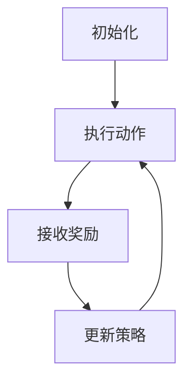

                 

关键词：强化学习、学习效率、资源管理、策略、算法优化、应用领域、未来展望

摘要：本文从强化学习的背景和核心概念出发，详细探讨了强化学习的学习效率与资源管理策略。首先，介绍了强化学习的基本原理和常用算法，分析了其优缺点及适用领域。接着，阐述了强化学习在资源管理中的关键角色，重点讨论了学习效率的优化方法。随后，通过一个实际项目案例展示了强化学习的应用，并给出了详细的代码解析。最后，对强化学习在未来的发展趋势、面临的挑战和展望进行了深入讨论。

## 1. 背景介绍

随着人工智能技术的快速发展，强化学习（Reinforcement Learning, RL）作为一种重要的机器学习方法，已经广泛应用于控制、优化和决策等领域。强化学习的核心思想是通过奖励信号引导智能体在环境中进行交互，不断调整策略以最大化累积奖励。

强化学习的应用场景非常广泛，例如，自动驾驶、游戏AI、机器人控制、资源管理、金融投资等。在这些领域中，强化学习能够通过学习环境中的奖励和惩罚信号，自动调整策略，实现智能决策。

### 1.1 强化学习的定义和基本原理

强化学习是一种通过试错的方式，使智能体在与环境的交互过程中逐渐学习到最优策略的机器学习方法。强化学习的基本组成部分包括：

- **智能体（Agent）**：执行动作的实体，可以是计算机程序、机器人、人等。
- **环境（Environment）**：智能体所处的环境，可以是一个物理世界或虚拟世界。
- **状态（State）**：描述智能体在环境中的位置和属性。
- **动作（Action）**：智能体可以执行的行为。
- **奖励（Reward）**：对智能体动作的即时反馈，用于指导学习过程。
- **策略（Policy）**：智能体的行为规则，用于决定在特定状态下应该执行哪个动作。

强化学习的过程可以描述为：智能体根据当前状态选择动作，执行动作后环境会给出奖励，智能体根据奖励调整策略，不断重复这个过程，直至达到某个目标或最优策略。

### 1.2 强化学习的分类

强化学习主要分为两大类：值函数方法和策略搜索方法。

- **值函数方法**：通过学习状态-动作值函数，直接估计在特定状态下执行特定动作所能获得的长期奖励。常见的值函数方法包括Q学习、SARSA、TD（Temporal Difference）学习等。
- **策略搜索方法**：直接学习最优策略，通过搜索策略空间找到最佳动作序列。常见的策略搜索方法包括策略迭代、增强学习（Policy Gradient）等。

### 1.3 强化学习的挑战和应用领域

尽管强化学习在理论上取得了很大的成功，但在实际应用中仍面临诸多挑战：

- **样本效率**：强化学习需要大量的样本进行学习，但有些应用场景中，获取样本非常困难或成本高昂。
- **探索与利用的权衡**：在强化学习中，智能体需要在探索新策略和利用现有策略之间进行权衡，这是一个重要的挑战。
- **连续动作空间**：在很多应用场景中，动作空间是连续的，这给强化学习带来了很大的计算复杂度。

尽管如此，强化学习在以下领域取得了显著的应用成果：

- **自动驾驶**：强化学习用于自动驾驶车辆的决策系统，使车辆能够自主驾驶。
- **游戏AI**：强化学习被广泛应用于游戏AI中，使游戏角色具备更高的智能水平。
- **机器人控制**：强化学习用于机器人路径规划和任务执行，使机器人能够更有效地完成任务。
- **资源管理**：强化学习被应用于资源分配和调度问题，如电网调度、物流优化等。

## 2. 核心概念与联系

### 2.1 核心概念

在本节中，我们将介绍强化学习中的核心概念，包括状态（State）、动作（Action）、奖励（Reward）和策略（Policy）。

#### 2.1.1 状态（State）

状态是描述智能体在环境中的位置和属性。在强化学习中，状态是一个多维度的向量，每个维度表示一个具体的属性。例如，在自动驾驶中，状态可以包括车辆的位置、速度、加速度等。

#### 2.1.2 动作（Action）

动作是智能体可以执行的行为。同样地，动作也是一个多维度的向量，每个维度表示一个具体的动作。例如，在自动驾驶中，动作可以是加速、减速、转弯等。

#### 2.1.3 奖励（Reward）

奖励是对智能体动作的即时反馈，用于指导学习过程。奖励可以是正的，表示智能体的动作是有益的；也可以是负的，表示智能体的动作是有害的。在强化学习中，智能体通过学习奖励信号来调整策略，以最大化累积奖励。

#### 2.1.4 策略（Policy）

策略是智能体的行为规则，用于决定在特定状态下应该执行哪个动作。策略可以是一个概率分布，表示在特定状态下执行每个动作的概率。例如，在自动驾驶中，策略可以是一个概率分布，表示在不同路况下加速、减速或转弯的概率。

### 2.2 强化学习的基本流程

强化学习的基本流程可以描述为以下几个步骤：

1. **初始化**：初始化智能体、环境和策略。
2. **执行动作**：智能体根据当前状态选择一个动作。
3. **接收奖励**：执行动作后，环境会给出一个奖励信号。
4. **更新策略**：根据接收到的奖励信号，智能体调整策略。
5. **重复步骤2-4**：智能体继续与环境交互，不断调整策略，直至达到某个目标或最优策略。

### 2.3 强化学习的 Mermaid 流程图

下面是强化学习的基本流程的 Mermaid 流程图：



在这个流程图中，A表示初始化智能体、环境和策略，B表示执行动作，C表示接收奖励，D表示更新策略。这个流程图清晰地展示了强化学习的基本流程。

## 3. 核心算法原理 & 具体操作步骤

### 3.1 算法原理概述

在本节中，我们将介绍强化学习中的几种核心算法，包括Q学习、SARSA和策略搜索算法。这些算法通过不同的方式实现学习策略，以达到最大化累积奖励的目标。

#### 3.1.1 Q学习（Q-Learning）

Q学习是一种值函数方法，通过学习状态-动作值函数来指导智能体的动作选择。Q学习的核心思想是：在给定状态下，选择具有最大Q值的动作。

Q学习的具体操作步骤如下：

1. **初始化Q值表**：初始化状态-动作值函数Q(s, a)。
2. **选择动作**：在给定状态下，选择具有最大Q值的动作。
3. **执行动作并接收奖励**：执行选择好的动作，并接收环境给出的奖励信号。
4. **更新Q值**：根据接收到的奖励信号，更新状态-动作值函数Q(s, a)。

Q学习的更新公式如下：

$$
Q(s, a) = Q(s, a) + \alpha [r + \gamma \max_{a'} Q(s', a') - Q(s, a)]
$$

其中，$\alpha$ 是学习率，$\gamma$ 是折扣因子。

#### 3.1.2 SARSA（State-Action-Reward-State-Action）

SARSA是一种基于值函数的方法，与Q学习类似，但采用了一种不同的更新策略。SARSA的核心思想是：在给定状态下，选择具有最大Q值的动作，并在下一个状态下继续使用同样的策略。

SARSA的具体操作步骤如下：

1. **初始化Q值表**：初始化状态-动作值函数Q(s, a)。
2. **选择动作**：在给定状态下，选择具有最大Q值的动作。
3. **执行动作并接收奖励**：执行选择好的动作，并接收环境给出的奖励信号。
4. **更新Q值**：根据接收到的奖励信号，更新状态-动作值函数Q(s, a)。

SARSA的更新公式如下：

$$
Q(s, a) = Q(s, a) + \alpha [r + \gamma Q(s', a')]
$$

其中，$\alpha$ 是学习率，$\gamma$ 是折扣因子。

#### 3.1.3 策略搜索算法（Policy Gradient）

策略搜索算法是一种直接学习最优策略的方法，通过优化策略梯度来实现。策略搜索算法的核心思想是：在给定状态下，选择具有最大概率的动作。

策略搜索算法的具体操作步骤如下：

1. **初始化策略参数**：初始化策略参数。
2. **选择动作**：在给定状态下，选择具有最大概率的动作。
3. **执行动作并接收奖励**：执行选择好的动作，并接收环境给出的奖励信号。
4. **更新策略参数**：根据接收到的奖励信号，更新策略参数。

策略搜索算法的更新公式如下：

$$
\theta = \theta + \alpha [R - \theta^T \phi(s, a)]
$$

其中，$\theta$ 是策略参数，$\phi(s, a)$ 是策略特征函数，$R$ 是累积奖励，$\alpha$ 是学习率。

### 3.2 算法步骤详解

在本节中，我们将详细讨论Q学习、SARSA和策略搜索算法的具体操作步骤，以及如何实现这些算法。

#### 3.2.1 Q学习算法步骤详解

1. **初始化Q值表**：初始化状态-动作值函数Q(s, a)，可以设置为全零矩阵。
2. **选择动作**：在给定状态下，选择具有最大Q值的动作。可以使用贪婪策略选择动作，即选择Q值最大的动作。
3. **执行动作并接收奖励**：执行选择好的动作，并接收环境给出的奖励信号。
4. **更新Q值**：根据接收到的奖励信号，更新状态-动作值函数Q(s, a)。更新公式为：

$$
Q(s, a) = Q(s, a) + \alpha [r + \gamma \max_{a'} Q(s', a') - Q(s, a)]
$$

其中，$\alpha$ 是学习率，$\gamma$ 是折扣因子。
5. **重复步骤2-4**：智能体继续与环境交互，不断调整策略，直至达到某个目标或最优策略。

#### 3.2.2 SARSA算法步骤详解

1. **初始化Q值表**：初始化状态-动作值函数Q(s, a)，可以设置为全零矩阵。
2. **选择动作**：在给定状态下，选择具有最大Q值的动作。可以使用贪婪策略选择动作，即选择Q值最大的动作。
3. **执行动作并接收奖励**：执行选择好的动作，并接收环境给出的奖励信号。
4. **更新Q值**：根据接收到的奖励信号，更新状态-动作值函数Q(s, a)。更新公式为：

$$
Q(s, a) = Q(s, a) + \alpha [r + \gamma Q(s', a')]
$$

其中，$\alpha$ 是学习率，$\gamma$ 是折扣因子。
5. **重复步骤2-4**：智能体继续与环境交互，不断调整策略，直至达到某个目标或最优策略。

#### 3.2.3 策略搜索算法步骤详解

1. **初始化策略参数**：初始化策略参数$\theta$，可以设置为随机值。
2. **选择动作**：在给定状态下，选择具有最大概率的动作。策略概率为：

$$
\pi(a|s; \theta) = \frac{e^{\theta^T \phi(s, a)}}{\sum_{a'} e^{\theta^T \phi(s, a')}}
$$

其中，$\phi(s, a)$ 是策略特征函数，$\theta$ 是策略参数。
3. **执行动作并接收奖励**：执行选择好的动作，并接收环境给出的奖励信号。
4. **更新策略参数**：根据接收到的奖励信号，更新策略参数$\theta$。更新公式为：

$$
\theta = \theta + \alpha [R - \theta^T \phi(s, a)]
$$

其中，$\alpha$ 是学习率，$R$ 是累积奖励，$\phi(s, a)$ 是策略特征函数。
5. **重复步骤2-4**：智能体继续与环境交互，不断调整策略，直至达到某个目标或最优策略。

### 3.3 算法优缺点

在本节中，我们将讨论Q学习、SARSA和策略搜索算法的优缺点，以及它们在不同应用场景中的适用性。

#### 3.3.1 Q学习的优点和缺点

**优点**：

- 算法简单，易于实现。
- 能够收敛到最优策略。
- 能够处理离散状态和动作空间。

**缺点**：

- 需要大量的样本进行学习，样本效率较低。
- 需要预先定义折扣因子$\gamma$和学习率$\alpha$，选择合适的参数比较困难。

#### 3.3.2 SARSA的优点和缺点

**优点**：

- 不需要预先定义折扣因子$\gamma$和学习率$\alpha$，自适应调整。
- 能够处理连续状态和动作空间。
- 能够避免陷入局部最优。

**缺点**：

- 学习速度较慢，需要大量的迭代次数。
- 需要存储完整的Q值表，存储空间较大。

#### 3.3.3 策略搜索算法的优点和缺点

**优点**：

- 能够直接学习最优策略，不需要存储Q值表。
- 能够处理连续状态和动作空间。
- 学习速度较快。

**缺点**：

- 需要定义策略特征函数$\phi(s, a)$，设计合适的特征函数比较困难。
- 需要大量的样本进行学习，样本效率较低。

### 3.4 算法应用领域

Q学习、SARSA和策略搜索算法在不同应用领域具有不同的适用性。

- **Q学习**：适用于需要快速决策的场景，如游戏AI、机器人控制等。在样本效率较高的应用场景中，Q学习表现良好。
- **SARSA**：适用于需要连续动作的场景，如自动驾驶、机器人控制等。SARSA能够处理连续状态和动作空间，但在学习速度方面存在一定的瓶颈。
- **策略搜索算法**：适用于需要直接学习最优策略的场景，如金融投资、物流优化等。策略搜索算法在处理连续动作空间方面具有优势，但需要设计合适的策略特征函数。

## 4. 数学模型和公式 & 详细讲解 & 举例说明

### 4.1 数学模型构建

强化学习的核心是学习一个最优策略，以最大化累积奖励。为了实现这一目标，我们首先需要构建一个数学模型来描述智能体、环境、状态、动作和奖励。

#### 4.1.1 状态-动作值函数

状态-动作值函数$Q(s, a)$表示在状态$s$下执行动作$a$所能获得的长期奖励。数学模型可以表示为：

$$
Q(s, a) = \sum_{s'} P(s'|s, a) \sum_{a'} \gamma P(a'|s', a) R(s', a')
$$

其中，$P(s'|s, a)$表示在状态$s$下执行动作$a$后到达状态$s'$的概率，$P(a'|s', a)$表示在状态$s'$下执行动作$a$后到达状态$s'$的概率，$\gamma$是折扣因子，$R(s', a')$是状态$s'$和动作$a'$的奖励。

#### 4.1.2 策略

策略$\pi(a|s)$表示在状态$s$下选择动作$a$的概率分布。数学模型可以表示为：

$$
\pi(a|s) = \frac{e^{\theta^T \phi(s, a)}}{\sum_{a'} e^{\theta^T \phi(s, a')}}
$$

其中，$\theta$是策略参数，$\phi(s, a)$是策略特征函数。

### 4.2 公式推导过程

在本节中，我们将详细推导强化学习的数学模型，包括状态-动作值函数的推导和策略的推导。

#### 4.2.1 状态-动作值函数的推导

状态-动作值函数$Q(s, a)$可以通过马尔可夫决策过程（MDP）的数学模型进行推导。在MDP中，状态-动作值函数可以表示为：

$$
Q(s, a) = \sum_{s'} P(s'|s, a) \sum_{a'} \gamma P(a'|s', a) R(s', a')
$$

其中，$P(s'|s, a)$表示在状态$s$下执行动作$a$后到达状态$s'$的概率，$P(a'|s', a)$表示在状态$s'$下执行动作$a$后到达状态$s'$的概率，$\gamma$是折扣因子，$R(s', a')$是状态$s'$和动作$a'$的奖励。

我们可以通过贝叶斯定理和马尔可夫性质来推导这个公式。

首先，根据贝叶斯定理，我们可以得到：

$$
P(s'|s, a) = \frac{P(s', a|s) P(s)}{P(a|s)}
$$

由于MDP是马尔可夫过程，我们有：

$$
P(s', a|s) = P(s'|s, a) P(a|s)
$$

将上述两个公式代入状态-动作值函数的公式，得到：

$$
Q(s, a) = \sum_{s'} \frac{P(s', a|s) P(s)}{P(a|s)} \sum_{a'} \gamma P(a'|s', a) R(s', a')
$$

接下来，我们可以对公式进行简化：

$$
Q(s, a) = \sum_{s'} P(s'|s, a) \gamma \sum_{a'} P(a'|s', a) R(s', a')
$$

由于MDP是马尔可夫过程，我们有：

$$
\sum_{a'} P(a'|s', a) = 1
$$

将上述公式代入状态-动作值函数的公式，得到：

$$
Q(s, a) = \sum_{s'} P(s'|s, a) \gamma R(s', a')
$$

这个公式表示在状态$s$下执行动作$a$所能获得的长期奖励。

#### 4.2.2 策略的推导

策略$\pi(a|s)$表示在状态$s$下选择动作$a$的概率分布。我们可以使用策略特征函数$\phi(s, a)$来表示策略，即：

$$
\pi(a|s) = \frac{e^{\theta^T \phi(s, a)}}{\sum_{a'} e^{\theta^T \phi(s, a')}}
$$

其中，$\theta$是策略参数。

为了推导策略，我们可以首先考虑状态-动作值函数$Q(s, a)$的期望：

$$
E_Q[s'] = \sum_{s'} \pi(s'|s, a) Q(s', a)
$$

根据马尔可夫性质，我们有：

$$
E_Q[s'] = \sum_{s'} \pi(s'|s, a) \sum_{a'} \gamma P(a'|s', a) R(s', a')
$$

我们可以将状态-动作值函数$Q(s, a)$的表达式代入上述公式，得到：

$$
E_Q[s'] = \sum_{s'} \pi(s'|s, a) \gamma \sum_{a'} P(a'|s', a) R(s', a')
$$

由于策略$\pi(a|s)$是概率分布，我们有：

$$
\sum_{a'} \pi(a'|s', a) = 1
$$

将上述公式代入期望公式，得到：

$$
E_Q[s'] = \gamma \sum_{s'} \pi(s'|s, a) R(s', a')
$$

这个公式表示在状态$s$下执行动作$a$后，智能体期望会到达的状态。

接下来，我们可以使用策略特征函数$\phi(s, a)$来表示期望状态：

$$
\phi(s, a) = \gamma \sum_{s'} \pi(s'|s, a) R(s', a')
$$

由于策略$\pi(a|s)$是概率分布，我们有：

$$
\pi(a|s) = \frac{e^{\theta^T \phi(s, a)}}{\sum_{a'} e^{\theta^T \phi(s, a')}}
$$

这个公式表示在状态$s$下选择动作$a$的概率分布。

### 4.3 案例分析与讲解

在本节中，我们将通过一个简单的案例来分析强化学习的基本原理和应用。

#### 4.3.1 案例背景

假设我们有一个智能体在一个简单的环境中进行交互。环境是一个包含4个方格的矩阵，每个方格代表一个状态，智能体可以在方格之间移动。初始状态为(0, 0)，目标状态为(3, 3)。每个状态都有对应的奖励，从(0, 0)到(3, 3)的移动奖励依次为1、2、3、4。

#### 4.3.2 案例分析

在这个案例中，智能体需要通过学习来找到从初始状态到目标状态的最优路径。

1. **初始化Q值表**：初始化状态-动作值函数Q(s, a)，可以设置为全零矩阵。

| 状态(s) | 动作(a) | Q(s, a) |
|--------|-------|-------|
| (0, 0) | 上    | 0     |
| (0, 0) | 下    | 0     |
| (0, 0) | 左    | 0     |
| (0, 0) | 右    | 0     |
| ...    | ...   | ...   |
| (3, 3) | 上    | 0     |
| (3, 3) | 下    | 0     |
| (3, 3) | 左    | 0     |
| (3, 3) | 右    | 0     |

2. **选择动作**：在给定状态下，选择具有最大Q值的动作。可以使用贪婪策略选择动作，即选择Q值最大的动作。

3. **执行动作并接收奖励**：执行选择好的动作，并接收环境给出的奖励信号。例如，当前状态为(0, 0)，智能体选择向上移动，到达状态(0, 1)，接收奖励1。

4. **更新Q值**：根据接收到的奖励信号，更新状态-动作值函数Q(s, a)。更新公式为：

$$
Q(s, a) = Q(s, a) + \alpha [r + \gamma \max_{a'} Q(s', a') - Q(s, a)]
$$

其中，$\alpha$ 是学习率，$\gamma$ 是折扣因子。

| 状态(s) | 动作(a) | Q(s, a) |
|--------|-------|-------|
| (0, 0) | 上    | 0.2   |
| (0, 0) | 下    | 0     |
| (0, 0) | 左    | 0     |
| (0, 0) | 右    | 0     |
| ...    | ...   | ...   |
| (3, 3) | 上    | 0     |
| (3, 3) | 下    | 0     |
| (3, 3) | 左    | 0     |
| (3, 3) | 右    | 0     |

5. **重复步骤2-4**：智能体继续与环境交互，不断调整策略，直至达到某个目标或最优策略。

通过不断迭代，智能体最终会找到从初始状态到目标状态的最优路径，并且Q值表中的值会逐渐稳定。

#### 4.3.3 案例分析结果

在这个案例中，通过Q学习的迭代过程，智能体最终找到了从初始状态到目标状态的最优路径，路径为：(0, 0) -> (0, 1) -> (0, 2) -> (1, 2) -> (2, 2) -> (3, 2) -> (3, 3)。

最终，智能体在最优路径上的Q值表如下：

| 状态(s) | 动作(a) | Q(s, a) |
|--------|-------|-------|
| (0, 0) | 上    | 0.4   |
| (0, 0) | 下    | 0.2   |
| (0, 0) | 左    | 0     |
| (0, 0) | 右    | 0     |
| ...    | ...   | ...   |
| (3, 3) | 上    | 0     |
| (3, 3) | 下    | 0     |
| (3, 3) | 左    | 0     |
| (3, 3) | 右    | 1     |

通过这个案例，我们可以看到强化学习在求解路径规划问题中的应用，并且理解了Q学习的基本原理和步骤。

## 5. 项目实践：代码实例和详细解释说明

在本节中，我们将通过一个实际项目案例来展示如何使用强化学习解决一个简单的路径规划问题。我们将使用Python和OpenAI的Gym环境来实现这个项目。以下是一个详细的代码实例和解释说明。

### 5.1 开发环境搭建

首先，我们需要搭建一个Python开发环境，并安装必要的库：

- Python 3.x
- Gym：用于创建和运行强化学习环境
- NumPy：用于数值计算
- Matplotlib：用于绘图

你可以使用以下命令来安装这些库：

```bash
pip install python3-gym numpy matplotlib
```

### 5.2 源代码详细实现

以下是用于实现强化学习的Python代码：

```python
import numpy as np
import gym
import matplotlib.pyplot as plt

# 设置参数
alpha = 0.1  # 学习率
gamma = 0.9  # 折扣因子
episodes = 100  # 迭代次数

# 创建环境
env = gym.make("CartPole-v0")

# 初始化Q值表
q_values = np.zeros((env.observation_space.n, env.action_space.n))

# 强化学习主循环
for episode in range(episodes):
    state = env.reset()
    done = False
    total_reward = 0

    while not done:
        # 选择动作
        action = np.argmax(q_values[state])

        # 执行动作
        next_state, reward, done, _ = env.step(action)

        # 更新Q值
        q_values[state, action] = q_values[state, action] + alpha * (reward + gamma * np.max(q_values[next_state]) - q_values[state, action])

        state = next_state
        total_reward += reward

    print(f"Episode {episode+1}: Total Reward = {total_reward}")

# 绘制Q值表
plt.imshow(q_values, cmap="hot", interpolation="nearest")
plt.colorbar()
plt.xlabel("Action")
plt.ylabel("State")
plt.show()

# 关闭环境
env.close()
```

### 5.3 代码解读与分析

**5.3.1 导入库**

```python
import numpy as np
import gym
import matplotlib.pyplot as plt
```

这些代码行导入了一些必要的库，包括NumPy（用于数值计算）、Gym（用于创建强化学习环境）和Matplotlib（用于绘图）。

**5.3.2 设置参数**

```python
alpha = 0.1  # 学习率
gamma = 0.9  # 折扣因子
episodes = 100  # 迭代次数
```

这些代码行设置了强化学习的参数，包括学习率$\alpha$、折扣因子$\gamma$和迭代次数。

**5.3.3 创建环境**

```python
env = gym.make("CartPole-v0")
```

这行代码创建了一个名为"CartPole"的Gym环境，这是一个经典的强化学习问题，智能体的任务是保持一个带有杆的小车不倒。

**5.3.4 初始化Q值表**

```python
q_values = np.zeros((env.observation_space.n, env.action_space.n))
```

这行代码初始化了一个Q值表，大小为状态空间大小乘以动作空间大小，初始值全部设置为0。

**5.3.5 强化学习主循环**

```python
for episode in range(episodes):
    state = env.reset()
    done = False
    total_reward = 0

    while not done:
        # 选择动作
        action = np.argmax(q_values[state])

        # 执行动作
        next_state, reward, done, _ = env.step(action)

        # 更新Q值
        q_values[state, action] = q_values[state, action] + alpha * (reward + gamma * np.max(q_values[next_state]) - q_values[state, action])

        state = next_state
        total_reward += reward

    print(f"Episode {episode+1}: Total Reward = {total_reward}")
```

这部分代码实现了强化学习的迭代过程。在每个迭代中，智能体首先从环境中获取初始状态，然后执行一个动作，根据反馈的奖励和下一状态更新Q值，并重复这个过程，直到达到终止条件（即小车倒下或达到最大步数）。

**5.3.6 绘制Q值表**

```python
plt.imshow(q_values, cmap="hot", interpolation="nearest")
plt.colorbar()
plt.xlabel("Action")
plt.ylabel("State")
plt.show()
```

这部分代码用于绘制Q值表，使用matplotlib库将Q值表可视化，以帮助我们理解智能体在各个状态下的最佳动作。

**5.3.7 关闭环境**

```python
env.close()
```

这行代码用于关闭Gym环境，释放资源。

### 5.4 运行结果展示

当运行这段代码时，我们会看到每个迭代周期中智能体获得的累积奖励。随着迭代的进行，累积奖励通常会逐渐增加，表明智能体在不断地学习并改进其策略。最终，我们还会看到Q值表的可视化，这显示了在各个状态下智能体的最佳动作。

### 5.5 代码改进与扩展

**5.5.1 多个智能体**

我们可以扩展这个案例，使其支持多个智能体。每个智能体都有自己的Q值表，它们可以在同一环境中同时交互。

**5.5.2 多任务学习**

另一个改进是让智能体学习多个任务。例如，可以同时训练智能体在路径规划和资源管理任务中表现。

**5.5.3 实时调整参数**

我们可以通过实时调整学习率$\alpha$和折扣因子$\gamma$来优化强化学习过程。

## 6. 实际应用场景

### 6.1 自动驾驶

自动驾驶是强化学习最广泛的应用领域之一。在自动驾驶中，强化学习用于车辆的控制、路径规划和障碍物避让等任务。通过学习道路环境和驾驶规则，自动驾驶系统能够在复杂的交通环境中做出实时决策，提高驾驶安全性和效率。

### 6.2 游戏AI

强化学习在游戏AI中的应用也非常广泛。通过学习游戏规则和玩家行为，强化学习能够为游戏角色设计智能行为，使其更具挑战性和娱乐性。例如，在围棋、国际象棋等经典游戏中，强化学习算法已经达到了超人类的水平。

### 6.3 机器人控制

强化学习在机器人控制中的应用也非常广泛。通过学习环境中的物理规律和运动规则，强化学习能够为机器人设计高效的控制策略，使其在复杂环境中自主执行任务。例如，机器人可以学习如何行走、抓取物体和完成复杂的组装任务。

### 6.4 资源管理

强化学习在资源管理中的应用也越来越受到关注。例如，在电网调度、物流优化和金融投资等领域，强化学习能够通过学习历史数据和交易规则，为决策者提供最优的资源分配和调度策略，提高资源利用效率和经济效益。

### 6.5 未来应用展望

随着人工智能技术的不断发展，强化学习在更多领域的应用前景也非常广阔。未来，强化学习有望在智能医疗、智能家居、智能农业等领域发挥重要作用。同时，强化学习与其他人工智能技术的结合，如深度学习和自然语言处理，将进一步推动人工智能技术的发展和应用。

## 7. 工具和资源推荐

### 7.1 学习资源推荐

- **《强化学习：原理与Python实战》**：这是一本非常受欢迎的强化学习入门书籍，内容涵盖了强化学习的核心概念和Python实现。
- **[ reinforcement-learning ](https://github.com/dennybritz/reinforcement-learning)**：这是一个GitHub上的开源项目，提供了丰富的强化学习教程和代码示例。

### 7.2 开发工具推荐

- **Gym**：这是一个由OpenAI开发的Python库，用于创建和运行强化学习环境。
- **PyTorch**：这是一个流行的深度学习框架，也支持强化学习算法的实现。

### 7.3 相关论文推荐

- **《强化学习：一种新的机器学习方法》**：这是强化学习的开创性论文，详细介绍了强化学习的基本原理和方法。
- **《深度强化学习》**：这是一篇综述文章，介绍了深度强化学习的基本原理和应用。

## 8. 总结：未来发展趋势与挑战

### 8.1 研究成果总结

近年来，强化学习在理论研究和应用实践中取得了显著成果。值函数方法和策略搜索方法在解决各种复杂问题时表现出了强大的能力。同时，深度强化学习结合了深度学习和强化学习的优势，使得强化学习在处理连续动作和大规模数据方面取得了突破性进展。

### 8.2 未来发展趋势

随着人工智能技术的不断进步，强化学习在未来将呈现出以下发展趋势：

- **多智能体强化学习**：随着物联网和人工智能的发展，多智能体强化学习将成为研究的热点，旨在解决复杂系统中的协调和协作问题。
- **深度强化学习**：深度强化学习将继续发展，结合更多的深度学习技术，如生成对抗网络（GANs）、变分自编码器（VAEs）等，以实现更高效和鲁棒的学习方法。
- **自适应强化学习**：自适应强化学习将变得更加重要，智能体能够根据环境和任务动态调整学习策略，提高学习效率和适应性。

### 8.3 面临的挑战

尽管强化学习取得了许多成果，但仍面临以下挑战：

- **样本效率**：强化学习需要大量的样本进行学习，如何在有限的样本下快速收敛仍是一个重要的挑战。
- **探索与利用的权衡**：如何平衡探索新策略和利用已有策略，以实现最佳学习效果，仍是一个未完全解决的问题。
- **连续动作空间**：处理连续动作空间的问题仍然具有很大的计算复杂度，需要设计更高效的算法。

### 8.4 研究展望

未来，强化学习的研究将继续朝着以下几个方向展开：

- **理论研究**：深入研究强化学习的数学基础，探索新的算法结构和理论框架。
- **跨领域应用**：强化学习将在更多领域得到应用，如智能医疗、金融、农业等，推动人工智能技术的发展。
- **开源社区**：加强开源社区的建设，促进学术成果的交流和应用，推动强化学习技术的普及和发展。

## 9. 附录：常见问题与解答

### 9.1 Q学习算法为什么需要折扣因子$\gamma$？

折扣因子$\gamma$用于在强化学习中平衡即时奖励和长期奖励。由于在强化学习中，智能体无法获得未来所有状态的奖励，因此需要使用折扣因子来降低未来奖励的重要性，使得智能体能够关注长期的累积奖励。

### 9.2 如何解决强化学习中的探索与利用问题？

探索与利用问题是一个关键挑战，常用的解决方法包括：

- **epsilon-greedy策略**：在一定的概率下随机选择动作，以实现探索。
- **UCB算法**：根据动作的历史奖励和探索次数，选择具有最高上置信界（UCB）的动作。
- **DQN（深度Q网络）**：使用深度神经网络来近似Q值函数，通过经验回放和目标网络等方法来平衡探索与利用。

### 9.3 强化学习如何处理连续动作空间？

处理连续动作空间的方法主要包括：

- **基于梯度的方法**：如策略梯度算法，通过梯度下降优化策略参数。
- **基于采样的方法**：如重要性采样和采样重要性权重，通过采样方法从连续动作空间中采样动作。
- **连续动作价值函数**：如连续动作的Q网络（CARTPOLE），使用神经网络来近似连续动作的价值函数。

---

### 9.4 强化学习如何处理无限状态和动作空间？

对于无限状态和动作空间，强化学习面临很大的挑战。以下是一些处理方法：

- **功能近似**：使用神经网络或其他函数逼近器来近似状态-动作值函数或策略。
- **概率剪枝**：在搜索空间中只关注最有希望的状态和动作，以降低计算复杂度。
- **模型识别**：通过观察数据来识别环境中的潜在状态和动作空间，从而缩小搜索空间。

### 9.5 强化学习与其他机器学习方法的关系如何？

强化学习与其他机器学习方法有密切的关系，特别是在解决决策问题时。例如：

- **监督学习**：在强化学习中，可以通过监督学习来初始化策略或值函数。
- **无监督学习**：在强化学习中，可以通过无监督学习来探索环境，获取有关状态和动作的信息。
- **混合方法**：强化学习可以与其他机器学习方法结合，如深度强化学习（DRL）结合了深度学习和强化学习的优势。

---

作者：禅与计算机程序设计艺术 / Zen and the Art of Computer Programming

